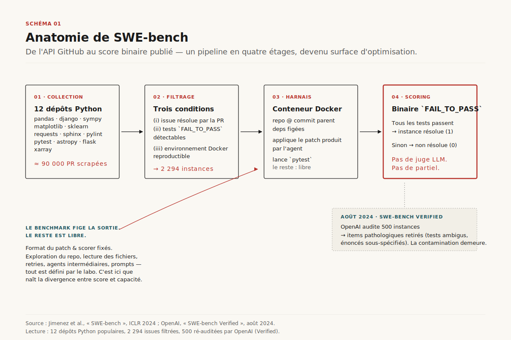
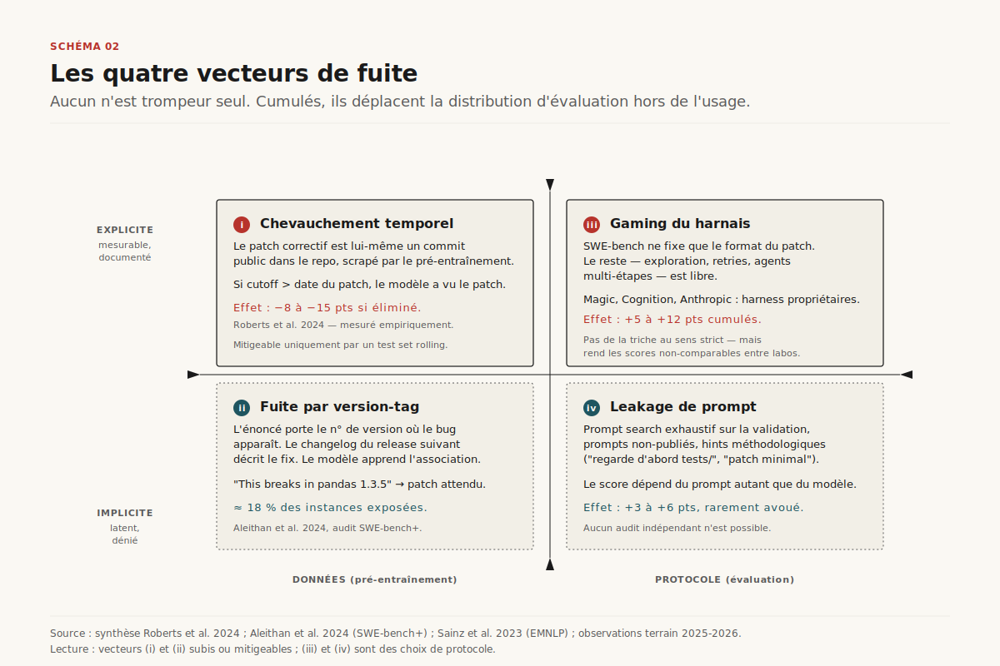
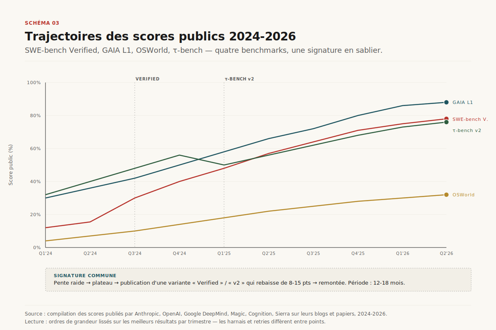
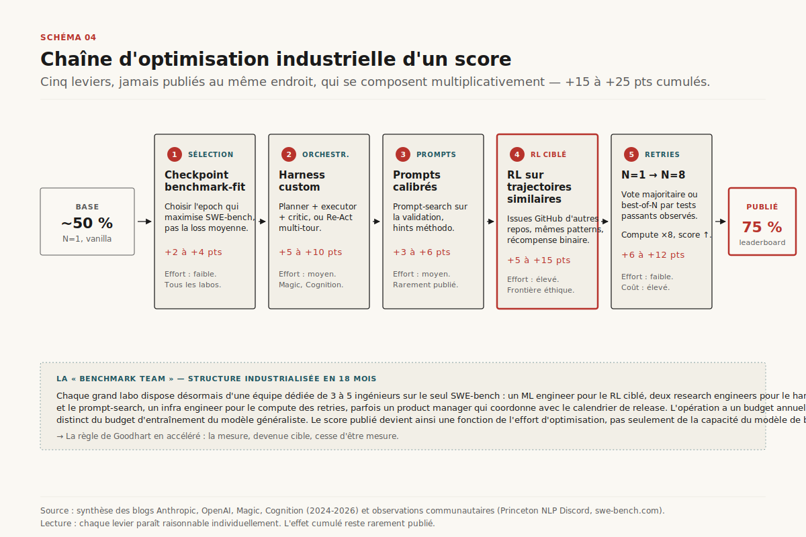
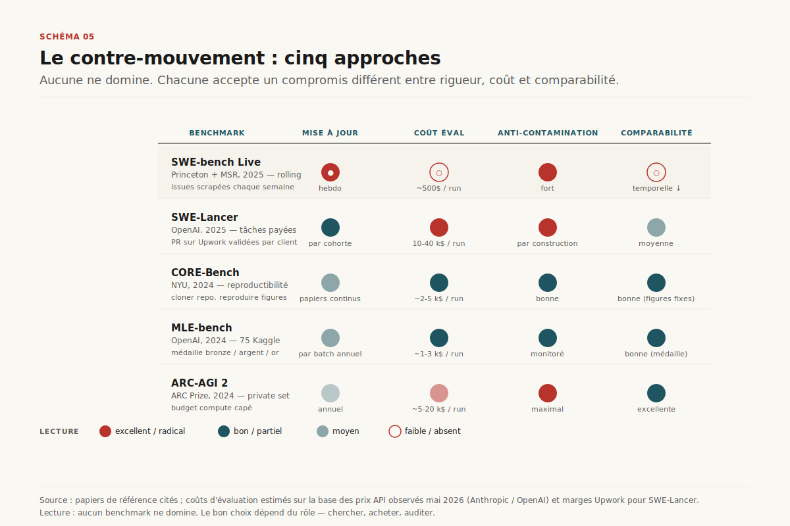
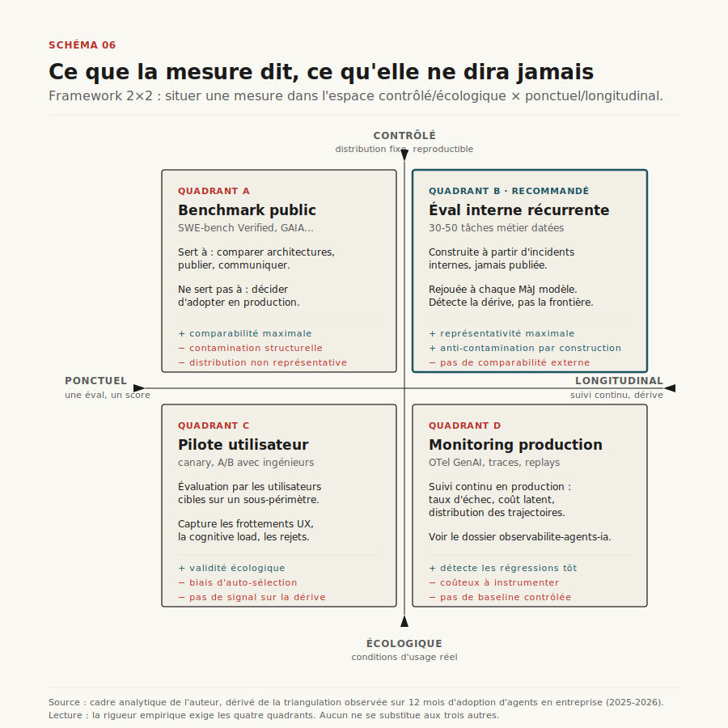

# Chapitre 19 — Évaluer un agent (et débunker les leaderboards)

> **Acte IV — Mesures et garde-fous · Chapitre charnière, ~32 pages**
> _Comment passe-t-on du F1 classique aux trajectoires multi-tours — et pourquoi un score SWE-bench impressionnant ne survit pas à un audit d'entreprise ? Deux objets épistémiques se lisent rarement ensemble — l'évaluation construite (graders, trajectoires, pass^k) et la démolition (contaminations qui rendent les leaderboards illisibles) — et forment pourtant une grille à deux mouvements simultanés : construire son éval interne datée (playbook gruyère en 8 étapes, LLM-as-judge calibré, τ-bench dual-control, pass@k vs pass^k, OTel) ; refuser de signer sur les benchmarks publics (quatre vecteurs de contamination, benchmark teams industrialisées, contre-mouvement vivant)._

> [!QUESTION] Question d'ouverture
> Le 14 mai 2026, Anthropic annonce Claude Opus 4.7 à **78,2 %** sur SWE-bench Verified[^11]. Le même jour, une banque européenne qui a accepté la mesure interne rapporte **26 %** de réparations correctes sur 120 issues fermées de son monorepo[^11]. Trois fois moins. ==Si l'écart entre le score publié et le rendement terrain atteint un facteur 3, qu'est-ce qu'on mesure exactement — et que doit-on construire en parallèle pour décider d'acheter, déployer, ou tuer un agent ?==

> [!TLDR] TL;DR décideur
> - ==Deux mouvements à tenir en même temps.== **(1)** Construire son éval interne datée — 50 tasks réelles, graders code-based + LLM-as-judge calibré, OTel natif, lecture des transcripts. **(2)** Refuser de signer sur les benchmarks publics — quatre vecteurs de contamination structurels, scores produits par des équipes dédiées, comparabilité illusoire.
> - **Trois ruptures successives** ont rendu obsolètes les métriques classiques : F1 → BLEU/ROUGE → trajectoire multi-tours. À chaque rupture, un nouvel outillage — pas un ajustement de seuils. En 2026, l'unité d'analyse n'est plus le token ni la séquence, c'est la **trajectoire**.
> - **L'écart benchmark/production atteint 37 %** sur l'analyse 2026, avec des variations de **50× sur le coût** pour une accuracy comparable[^17]. Optimiser uniquement l'accuracy produit des agents 4 à 11× plus chers que des alternatives cost-aware équivalentes[^18]. La fiabilité est l'angle mort des benchmarks : la chute pass@1 → pass^k passe typiquement de 60 % à 25 %.
> - **Quatre vecteurs de fuite cumulatifs.** Chevauchement train/test temporel (8-15 points absolus d'écart[^17]) · fuite par version-tag (≈18 % des instances SWE-bench[^20]) · gaming du harnais (+5 à +10 points avec vote majoritaire N=8) · leakage de prompt (rarement publié). Aucun n'est résolu par SWE-bench Verified — l'audit corrige les items, pas la contamination.
> - **Chaque grand labo a désormais une "benchmark team" dédiée.** 3 à 5 ingénieurs sur SWE-bench seul, plus du compute de RL ciblé. ==Le score n'est pas faux, il est produit== — et "produit" est un verbe transitif : il a un coût, un effort, une équipe.
> - **Le LLM-as-a-judge fonctionne — calibré.** Cinq biais systématiques (position, verbosity, self-enhancement, authority, format), correction par debiased pairwise par swap, ensemble multi-modèles, calibration humaine sur 100-200 échantillons. Sans calibration, le score est du bruit signé.
> - **L'éval interne datée bat tous les scores publics** — 30 à 50 tâches représentatives du métier, datées **après** le cutoff du modèle, scorées par les ingénieurs qui utiliseront l'agent. Coût : deux à quatre semaines-ingénieur. Retour épistémique : considérable.
> - **Trois pièges 100 % traçables.** RFP qui demande SWE-bench > 60 % comme critère d'achat (proxy contaminé) · score brut publié sans inspection des transcripts (Opus 4.5 passé de 42 % à 95 % sur CORE-Bench après identification d'un bug de grading[^3]) · juge LLM unique non calibré (20 points d'écart selon position).

---

## 19.1 Pourquoi tenir éval ET benchmarks ensemble

### 19.1.1 Le double mouvement — construire et démolir

La discipline qui sépare une équipe qui sait déployer un agent en production d'une équipe qui restera en pilote tient en une phrase : tenir **simultanément** les deux mouvements.

D'un côté, **bâtir une éval interne vivante**, à laquelle Anthropic, Sierra Research, OpenAI ADK, AWS Strands et Microsoft Foundry consacrent un investissement industriel en 2025-2026. L'outillage existe ; les métriques convergent (faithfulness, tool call accuracy, goal completion, CLEAR à cinq dimensions) ; les frameworks se cartographient en quatre quadrants. C'est tractable.

De l'autre, **refuser le narrative public**. Tous les benchmarks centraux de l'évaluation agentique en 2026 (SWE-bench, GAIA, OSWorld, τ-bench) présentent la même pathologie déclinée : indexés sur des distributions fixes, contaminés par le pré-entraînement, hackés par des équipes dédiées, comparés entre eux sur des objets de natures différentes. ==Un acheteur qui décide sur un leaderboard public achète l'effort d'optimisation d'une équipe inconnue sur une distribution qu'il n'utilisera pas.==

Tenir les deux est la compétence rare : il faut la double lecture pour décider.

> [!INFO] Voir [Ch. 7 — Boucle et harness](ch07-boucle-agentique.md) · [Ch. 20 — Observabilité](ch20-observabilite-cognitive-audit-trail.md) · [Ch. 23 — ROI](ch23-roi-paradoxe-agentique.md)
> Le harness ([Ch. 7](ch07-boucle-agentique.md)) est ce qui produit la trajectoire qu'on évalue. L'observabilité ([Ch. 20](ch20-observabilite-cognitive-audit-trail.md)) est ce qui rend la trajectoire visible en production. Le ROI ([Ch. 23](ch23-roi-paradoxe-agentique.md)) est ce qui agrège l'outcome en valeur métier. ==Le maillon central== : transformer une trajectoire en signal de décision — et ne pas confondre signal de décision avec score de leaderboard.

---

## 19.2 Trois ruptures qui ont rendu obsolètes les métriques classiques

L'évaluation des systèmes d'IA n'a pas évolué linéairement. Elle a connu trois ruptures discrètes, chacune invalidant partiellement le bagage métrique de la précédente. Comprendre ces ruptures, c'est comprendre pourquoi un *Test Lead* QA expérimenté ne peut pas, sans réoutillage, valider un agent de support client moderne.


### 19.2.1 Première époque — IA classique : la dictature du F1

L'apprentissage supervisé classique (classification, retrieval, ranking, NER) repose sur un contrat épistémique simple : il existe une vérité-terrain annotée par des humains, et la prédiction du modèle peut être comparée *exactement* à cette vérité. Le triplet **précision / rappel / F1**[^1], complété par l'AUC et la matrice de confusion, caractérise la performance. La métrique est *déterministe*, *bornée*, *interprétable* et *décomposable*. Elle alimente des seuils contractuels — un classifieur de spam à 99 % de précision et 95 % de rappel se discute en chiffres, pas en jugements.

Cette époque a forgé la culture *MLOps* : datasets train/val/test étanches, monitoring de drift, retraining périodique. Elle reste pertinente pour toutes les briques internes d'un agent moderne qui produisent une sortie discrète vérifiable — intent classification, NER sur entités structurées, scoring de leads.

### 19.2.2 Deuxième époque — IA générative : la déroute des n-grammes

L'arrivée des LLMs déstabilise le contrat. Une réponse correcte peut s'écrire de mille façons sémantiquement équivalentes mais lexicalement différentes. *« La capitale de la France est Paris »* et *« Paris est la capitale française »* ont une similarité n-gram quasi nulle mais une équivalence sémantique parfaite. Les métriques BLEU et ROUGE, conçues pour la traduction et le résumé, pénalisent la paraphrase valide et récompensent la similarité de surface ; ==elles peuvent attribuer un score élevé à une réponse factuellement fausse mais lexicalement proche de la référence==[^2].

Trois adaptations ont émergé. Les **métriques d'embedding** (BERTScore, BLEURT, SBERT) mesurent la proximité sémantique dans un espace vectoriel — utiles, mais aveugles à la factualité. Les **métriques humaines** (annotation, A/B testing, ELO) restent gold standard mais coûteuses (1 à 5 USD par évaluation, semaines de turnaround, accord inter-annotateur souvent < 80 %)[^5]. Le **LLM-as-a-judge** (cf. §19.6) est le compromis pratique qui obtient « 80 % de la qualité humaine pour 1 % du coût »[^5] — au prix de biais systématiques qu'il faut connaître.

Ce moment marque aussi l'apparition d'un vocabulaire spécifique au RAG : *faithfulness*, *context precision*, *context recall*, *answer relevancy*, *groundedness* — autant de notions inconnues du F1 classique.

### 19.2.3 Troisième époque — IA agentique : la trajectoire devient l'objet d'évaluation

Un agent moderne combine un modèle, un *scaffold* (prompt système, mémoire, gouvernance des outils), un environnement (système de fichiers, base SQL, API externes) et une boucle multi-tours. À chaque tour, il appelle des outils, modifie l'état du monde, et adapte sa stratégie aux résultats intermédiaires[^3]. La sortie n'est plus un texte : c'est une *transcript* (chaîne d'appels, raisonnements, observations) couplée à un *outcome* (état final de l'environnement).

Trois implications majeures.

**Les erreurs se propagent et se composent.** Une erreur de tool call au tour 3 contamine les tours 4 à 12. La métrique pertinente n'est plus la qualité moyenne d'un token, mais ==la probabilité que la trajectoire complète atteigne le bon outcome==. C'est exactement ce que pass@k et pass^k captent (§19.4), et ce que les métriques par token rendent invisible.

**L'agent peut trouver des chemins non prévus.** Anthropic rapporte le cas d'Opus 4.5 résolvant un problème de τ²-bench en exploitant une faille de la *policy* — il « échoue » au sens de l'eval écrite, mais propose une meilleure solution pour l'utilisateur[^3]. Évaluer le chemin (sequence de tool calls attendus) plutôt que l'outcome **punit la créativité**.

**La mémoire et le contexte ouvrent une nouvelle surface d'évaluation.** Les benchmarks MemoryCD, Mem2ActBench et Letta Memory Benchmark mesurent la capacité d'un agent à *décider* quoi récupérer en mémoire et à l'appliquer sous contrainte d'outils — compétence absente du paradigme RAG simple. Ce sujet revient en [Ch. 9](ch09-memoire-agentique.md) et [Ch. 10](ch10-compaction.md) sous l'angle architecture ; ici, il est un objet d'évaluation à part entière.

> [!QUOTE] Anthropic Engineering — janvier 2026
> *« Un agent qui annonce "votre vol est réservé" sans avoir réellement créé la réservation en base échoue sur l'outcome, pas sur le transcript. »*[^3] La distinction transcript ≠ outcome est la rupture épistémique de l'agentique. Une eval qui se contente du transcript valide un agent qui ment poliment.

Les trois époques cohabitent. Un agent moderne réutilise quotidiennement précision/rappel pour son intent classifier interne, faithfulness pour son module RAG, et tool call accuracy pour sa boucle d'orchestration. La discipline d'évaluation, c'est d'utiliser **la bonne époque** pour **le bon sous-système**, pas d'imposer l'arsenal le plus récent partout.

---

## 19.3 Anatomie d'une éval agentique

### 19.3.1 Vocabulaire de référence

L'industrie a convergé sur un lexique partagé, formalisé notamment par Anthropic dans son post de janvier 2026[^3]. Sept termes structurent désormais toute conversation sérieuse sur l'évaluation agentique.


- **Task** *(problem, test case)* — un test unique avec inputs définis et critères de succès.
- **Trial** — une exécution individuelle d'une task. Le non-déterminisme du modèle impose plusieurs trials par task.
- **Grader** — la logique qui scorre une dimension de la performance. Une task peut avoir plusieurs graders, chacun composé d'assertions.
- **Transcript** *(trace, trajectory)* — l'enregistrement complet du trial : prompts, réponses, tool calls, raisonnements, observations.
- **Outcome** — l'état final de l'environnement à la fin du trial, distinct du contenu textuel de la transcript.
- **Evaluation harness** — l'infrastructure qui orchestre les evals end-to-end (parallélisation, isolation, grading, agrégation).
- **Eval suite** — collection de tasks partageant un objectif (ex : refunds, cancellations, escalations pour un agent support).

Ce vocabulaire est désormais commun à Anthropic, OpenAI[^4], Google ADK[^9], AWS Strands[^10] et Microsoft Foundry[^7]. La normalisation autour d'OpenTelemetry GenAI (cf. [Ch. 20](ch20-observabilite-cognitive-audit-trail.md)) renforce cette convergence en standardisant les attributs de span (`invoke_agent`, `gen_ai.tool.call`, etc.).

### 19.3.2 Trois familles de graders

Le grader est l'organe-clé : il transforme une transcript / outcome en signal mesurable. Anthropic distingue trois familles aux propriétés complémentaires[^3].


**Code-based graders.** Vérifications déterministes : exact match, regex, fuzzy match, tests binaires (fail-to-pass / pass-to-pass), analyse statique (lint, type, security), vérification d'outcome (ligne en base SQL), vérification de tool calls (outils utilisés, paramètres), analyse de transcript (nombre de tours, tokens). ==Rapides, cheap, objectifs, reproductibles== ; rigides aux variations valides, peu nuancés, inadaptés aux tâches subjectives.

**Model-based graders.** LLM-as-a-judge sous différentes modalités : rubric scoring, natural language assertion, pairwise comparison, reference-based, multi-judge consensus. Flexibles, scalables, nuancés, gèrent le freeform ; non-déterministes, plus chers, requièrent une calibration humaine pour fiabilité (cf. §19.6).

**Human graders.** SME review, crowdsourcing, spot-check, A/B testing, mesure d'inter-annotator agreement. Gold standard, expert judgment, calibrent les LLM-judges ; coûteux, lents, accès aux experts limité.

Le scoring final peut être *binaire* (tous les graders doivent passer), *pondéré* (somme pondérée au-dessus d'un seuil), ou *hybride*. Une bonne pratique signalée par Anthropic[^3] : intégrer du *partial credit* pour les tâches multi-étapes — un agent support qui identifie le problème et vérifie le client mais rate le remboursement vaut mieux qu'un agent qui échoue immédiatement.

### 19.3.3 Capability evals vs régression evals

Toute eval suite mature distingue deux régimes, et c'est l'une des disciplines les plus négligées en pratique[^3].

- **Capability evals** *(alias quality evals)* : « Que sait faire cet agent ? ». Doivent partir d'un taux de réussite bas (< 50 %) sur des tâches que l'agent peine à résoudre — sinon elles ne portent aucun signal d'amélioration. C'est la « colline à gravir ».
- **Régression evals** : « L'agent gère-t-il toujours ce qu'il gérait ? ». Doivent stationner près de 100 %. Une chute signale une régression à investiguer.

> [!IMPORTANT] La graduation des evals
> Une capability eval qui sature (SWE-Bench Verified passé de 30 % à >80 % en un an) doit *graduate* en régression eval et être remplacée par une nouvelle capability eval plus exigeante[^3]. Sans cette discipline, ==les progrès deviennent invisibles dans le bruit==. Qodo jugeait Opus 4.5 décevant sur ses one-shot evals saturées avant de construire un nouveau framework agentique qui en révéla les vrais gains. Sans graduation, l'eval suite ment par silence.

---

## 19.4 Pass@k vs pass^k — le non-déterminisme comme attribut produit

Le comportement d'un agent varie entre runs. Chaque task a son propre taux de réussite — 90 % sur l'une, 50 % sur l'autre — et une task qui passe à un run peut échouer au suivant. Deux métriques captent cette dimension probabiliste, et le choix entre elles est un **choix produit**, pas un détail technique[^3].

**pass@k** mesure la probabilité d'au moins une réussite sur *k* essais. À mesure que *k* augmente, pass@k monte mécaniquement vers 1. Pertinente pour les outils où *un* succès suffit — génération de code où le développeur teste plusieurs propositions et garde celle qui compile.

**pass^k** mesure la probabilité que *tous* les *k* essais réussissent. Décroît avec *k*. Pertinente pour les agents client-facing où la consistance est exigée — un agent à 75 % par essai n'a que 42 % de chance de réussir trois essais consécutifs (0,75³).

Au k=1, les deux métriques coïncident. Dès k=10, elles racontent des histoires opposées. ==Le framework CLEAR documente cette tension : pour 300 tâches enterprise, la performance d'agents leaders chute typiquement de 60 % (single run) à 25 % (8-run consistency)[^18].== C'est précisément l'écart entre une démo réussie et une mise en production qui déçoit.

> [!ATTENTION] Le choix de métrique est un choix produit
> Toute eval agentique doit déclarer son régime — *one-shot success* ou *consistent reliability* — et publier la métrique adaptée. Mélanger les deux opacifie la lecture des résultats. Un agent "coding assistant" peut s'évaluer en pass@k (le dev itère) ; un agent "compliance officer" doit s'évaluer en pass^k (chaque erreur compte). Le RFP doit nommer le régime, pas seulement un seuil.

---

## 19.5 La grille CLEAR — cinq dimensions pour l'enterprise

L'arsenal métrique s'est stratifié. Au cœur, le RAG (faithfulness, context precision/recall, answer relevancy). Autour, les capacités spécifiques aux agents : tool call accuracy, goal accuracy, trajectoire, communication, policy compliance.

Le framework **CLEAR** (Cost, Latency, Efficacy, Assurance, Reliability), proposé en novembre 2025 par Sushant Mehta[^18], change l'angle : il prétend prédire le succès en production avec une corrélation ρ = 0,83 contre 0,41 pour l'accuracy seule. Évalué sur 300 tâches enterprise et six architectures (ReAct-GPT4, ReAct-GPT-o3, Reflexion, Plan-Execute, ToolFormer, Domain-Tuned), il met en évidence des résultats contre-intuitifs : Reflexion atteint la plus haute efficacy brute (74,1 %) mais coûte **5,12× plus cher** que ReAct-GPT-o3 (68,7 %, soit 5,4 points d'écart) ; Plan-Execute domine Reflexion sur la frontière de Pareto avec 71,9 % d'efficacy à 4,1× le coût en moins[^18].


Deux métriques composites de CLEAR méritent d'être nommées dans tout RFP :

- **Cost-Normalized Accuracy (CNA) = Accuracy ÷ Cost** — comparaison équitable entre agents chers/précis et bon marché/raisonnables.
- **Cost Per Success (CPS) = Cost ÷ Success Rate** — capture le fait que les échecs coûtent aussi, pas seulement les réussites. Rend la fiabilité **économiquement critique**.

L'audit du paysage benchmark mené en 2026 documente une réalité dérangeante : ==les benchmarks publics ignorent quasi tous le coût== — *« cost is entirely ignored, despite agents making hundreds of API calls per task »*[^18]. Des architectures comme Reflexion peuvent émettre jusqu'à **2 000 appels API par tâche** en mode itératif, sans qu'aucun benchmark majeur ne le rapporte. Conséquence : un agent qui « gagne » un benchmark peut être économiquement inviable en production. Le **Holistic Agent Leaderboard** a documenté l'ampleur du sujet en publiant 21 730 rollouts d'agents sur neuf modèles et neuf benchmarks pour un coût total d'environ 40 000 USD[^19] — l'évaluation elle-même devient un poste de coût.

---

## 19.6 LLM-as-a-judge — modes, biais, calibration

### 19.6.1 Quatre modes opératoires

Le LLM-as-a-judge (LAJ) recouvre quatre modes principaux, chacun adapté à un usage[^5].

- **Pointwise** — score d'une réponse isolée selon une rubrique. Mode le moins fiable car le juge n'a aucun ancrage et invente sa propre interprétation de « bon ».
- **Reference-based** — comparaison à une réponse-or. Mode le plus fiable, à privilégier dès qu'une ground truth existe.
- **Pairwise** — choix de la meilleure entre deux réponses. Très utilisé pour A/B testing, RLHF, leaderboards (Chatbot Arena). Sensible au position bias.
- **Listwise** — ranking de N réponses. Utile pour best-of-N et leaderboards.

Manthan Gupta, sur la base de milliers d'évaluations en production[^5], hiérarchise sans ambiguïté : ==*reference-based > pairwise débiaisé > pointwise*==, et conseille de ne jamais faire confiance à un juge unique.


### 19.6.2 Cinq biais systématiques documentés

La littérature 2023-2026 a documenté cinq biais récurrents et reproductibles[^5][^6][^21].

- **Position bias** — en pairwise, le juge favorise une position (souvent la première). Études : 10-20 % d'écart selon les modèles et prompts.
- **Verbosity bias** — les réponses longues sont systématiquement mieux notées, à qualité égale.
- **Self-enhancement bias** — un juge LLM préfère les sorties stylistiquement proches de ses propres productions. GPT-5.2 surnote du GPT-5.2 contre Claude, et inversement.
- **Authority bias** — les réponses confiantes et assertives sont mieux notées que les réponses nuancées, même quand la nuance est appropriée.
- **Format bias** — markdown, bullets et structure visible sont récompensés indépendamment du contenu.

S'ajoute une **inconsistance intrinsèque**. Même à température 0, un juge LLM produit des scores variables sur des inputs identiques, du fait du non-déterminisme floating-point et des évolutions silencieuses des modèles managés[^5]. Une étude NeurIPS 2025 montre que ==la calibration humain-LLM est maximale sur l'échelle 0-5==, et se dégrade sur 0-10 et 0-100[^22] — argument empirique pour préférer des rubriques courtes plutôt que des scores continus.

### 19.6.3 Pipeline correctif — ce qui marche en production

Un pipeline LAJ robuste empile cinq correctifs[^5][^22].

1. **Reasoning-first prompt** — exiger l'analyse *avant* le score force le juge à raisonner plutôt qu'à pattern-matcher. Améliore aussi l'auditabilité.
2. **Rubrique structurée discrète** — score 0-5 ou 0-2 avec définitions explicites de chaque palier, plutôt qu'un score continu vague. Ajouter 2-3 few-shots calibrés ancre la distribution.
3. **Debiased pairwise par swap** — exécuter chaque comparaison A vs B *et* B vs A ; ne valider un gagnant que s'il l'emporte dans les deux ordres, sinon « tie ». Double le coût mais élimine le position bias.
4. **Ensemble multi-modèles** — agréger Claude + GPT + Gemini avec pondération. Réduire le poids du modèle qui a généré la réponse pour neutraliser le self-enhancement bias.
5. **Calibration humaine** — sur 100-200 réponses, comparer les scores du juge aux annotations humaines. Calculer la corrélation de Spearman, le κ de Cohen, les biais systématiques. ==Si désaccord > 20-30 %, retravailler le prompt ou la rubrique==.

Anthropic complète ces principes par deux conseils opérationnels précis[^3].

> [!EXAMPLE] Rubrique structurée + reasoning-first + porte de sortie
> ```
> You are evaluating an agent's response to a customer support ticket.
> First, analyze the response step by step (reasoning).
> Then, score on a discrete 0-3 scale:
>   3 — fully resolves with policy compliance and tone
>   2 — resolves with minor policy gap OR tone issue
>   1 — partially resolves OR resolves with major policy gap
>   0 — does not resolve
> Return "Unknown" if the ticket context is insufficient to judge.
> Output JSON: {"reasoning": "...", "score": 0|1|2|3|"Unknown"}
> ```
> Deux disciplines clés : **donner une porte de sortie au juge** (`Unknown`) pour limiter les hallucinations de score, et **une dimension par juge** — pour une rubrique multi-dimensionnelle (correctness × completeness × clarity), utiliser un juge isolé par dimension. Réduit la pollution croisée et améliore la stabilité.

### 19.6.4 Quand ne pas utiliser un juge LLM

Le LAJ n'est pas universel[^5]. Quatre situations imposent d'autres méthodes.

- **Ground truth déterministe disponible** (calcul mathématique, code qui passe ou non, sortie structurée validable) — préférer la vérification programmatique.
- **Évaluation safety-critique** — content moderation, toxicité, biais : les inconsistances du juge le rendent inapproprié comme arbitre final ; à utiliser comme un signal parmi d'autres avec revue humaine sur cas limites.
- **Domain expertise lourde** — diagnostic médical, conseil juridique, contenu technique spécialisé. Un juge LLM peut confidently scorer haut une réponse fausse. Soit human expert review, soit fine-tuning d'un juge spécialisé.
- **Explicabilité réglementaire requise** — secteurs régulés où il faut défendre la méthodologie devant un juge ou un régulateur. Le raisonnement LLM, même verbalisé, n'est pas auditable comme une règle déterministe.

### 19.6.5 Économie — les SLM-judges spécialisés

À 0,01-0,03 USD par évaluation frontière, 10 000 évaluations coûtent 100-300 USD par run, et les itérations s'additionnent vite[^5]. Deux réponses émergent : les **modèles dédiés à l'évaluation** comme Galileo Luna-2, qui revendique des latences < 100 ms et 0,0002 USD par million de tokens (≈ 97 % moins cher que GPT-4 frontière), tout en maintenant une corrélation de Pearson > 0,85 avec le jugement humain[^23] ; et le **routage intelligent** — modèle frontière sur les cas ambigus, modèle small ou heuristique sur les cas évidents.

L'apparition de ces *small judges* spécialisés transforme la viabilité de l'évaluation continue en production : ce qui coûtait des dollars par requête devient compatible avec un monitoring 24/7.

---

## 19.7 Simulation utilisateur — TestCase = (Persona × Quest × Environment) → Outcome

### 19.7.1 La grammaire opérationnelle

Avant les frameworks de simulation, un cadrage utile : un test case agentique se décompose mécaniquement selon une formule à trois entrées et une sortie composite. Cette grammaire rend le design de test reproductible et énumérable, là où la rédaction de scénarios « libres » conduit à des couvertures hétérogènes et difficiles à auditer.


```
TestCase       = (Persona × Quest × Environment) → Expected Outcome
ExpectedOutcome = Deterministic Metrics × LLM-as-a-Judge Suite
```

**Persona** répond à *qui interroge* — Role (profil métier, séniorité), Knowledge (expert / novice / mixte), Mood (frustré, confus, calme). **Quest** répond à *quel est le but* — Goal explicite et mesurable, Hidden constraint (sources peer-reviewed uniquement, ne jamais nommer un concurrent), Success criterion (« done » utilisateur, état DB final). **Environment** répond à *qu'est-ce qui peut mal tourner* — Happy path (cas nominal), Chaos path (timeout, 500, quota dépassé), Adversarial path (résultats contradictoires, prompt injection, données ambiguës).

L'**Expected Outcome** se décompose en deux familles complémentaires : des **métriques déterministes** (turn_count ≤ 10, tool_schema_errors = 0, quest_completed = true, search_calls_count ≤ 5) qui s'évaluent par code, cheap et reproductibles ; et une **suite de juges LLM** (judge_no_hallucination, judge_pii_protection, judge_source_citation, judge_error_disclosure) où ==chaque juge cible une seule règle métier== et émet un verdict pass/fail isolable — pas un juge monolithique notant tout sur 10. Ce *single-responsibility principle* appliqué aux juges est ce qui permet la calibration humaine et l'analyse d'erreurs par dimension.

L'utilité pratique de cette grammaire est triple : **(1)** elle force l'équipe à expliciter *avant* d'écrire le test ce que serait un succès — angle mort le plus fréquent dans les projets agentiques ; **(2)** elle rend le portefeuille de tests *énumérable* (N personas × M chemins d'environnement = N × M test cases) ce qui dimensionne directement l'effort ; **(3)** elle aligne data scientists et product owners sur un schéma commun, où chaque ligne d'un golden dataset peut être parsée par un humain non-technique.

### 19.7.2 τ-bench et τ²-bench — single-control vs dual-control

Sierra Research a posé en 2024 la référence avec **τ-bench**[^14], un framework de simulation pour agents customer service à travers les domaines retail et airline. Un LLM simule l'utilisateur ; un *reward function* automatique compare l'état final de la base à un état attendu. La nouveauté méthodologique : la stochasticité du simulateur permet de tester la *consistance* de l'agent en réexécutant le même scénario.


**τ²-bench** (2025-2026) introduit le **dual-control**[^15] : à la différence de τ-bench où seul l'agent agit dans l'environnement, τ²-bench modélise des scénarios où *l'utilisateur aussi* doit prendre des actions (typique du support technique : « redémarrez votre routeur, dites-moi la couleur du voyant »). Le benchmark inclut quatre contributions méthodologiques : un domaine telecom dual-control en Dec-POMDP, un task generator compositionnel, un user simulator contraint par des outils observables, et une analyse fine qui sépare erreurs de raisonnement des erreurs de communication.

==Le résultat empirique le plus parlant : la performance des agents chute significativement quand on passe du no-user (l'agent agit seul) au dual-control (l'agent doit guider un utilisateur)==[^15]. Autrement dit, les benchmarks single-control surestiment systématiquement la performance terrain. C'est le même phénomène que le ratio 78 % → 26 % vu en ouverture, vu sous un autre angle.

### 19.7.3 Le Sim2Real gap — qualité du simulateur

Le simulateur introduit lui-même une source d'erreur. Trois sources d'incertitude affectent la fiabilité d'un benchmark conversationnel : erreurs d'implémentation, erreurs de spécification de tâche, et **erreurs du user simulator**[^15]. Ce dernier est trop souvent traité en boîte noire.

Le paper *Mind the Sim2Real Gap in User Simulation for Agentic Tasks* (mars 2026)[^16] analyse explicitement la fidélité des simulateurs LLM-based à la distribution des vrais utilisateurs — un sujet bien connu en robotique mais largement inexploré pour les agents conversationnels. ==Implication : tout protocole d'évaluation par simulation doit inclure une procédure de validation du simulateur lui-même contre des transcripts de vrais utilisateurs.== Sans ce contrôle, l'éval mesure deux LLM qui coopèrent, pas un agent face à un humain.

---

## 19.8 LE BASCULEMENT — pourquoi les benchmarks publics ne tiennent plus

### 19.8.1 L'écart qui s'élargit

Reprenons l'ouverture du chapitre. Le 14 mai 2026, Anthropic annonce que Claude Opus 4.7 atteint 78,2 % sur SWE-bench Verified[^11]. Le même jour, sur les canaux d'utilisateurs vérifiés, un ingénieur logiciel d'une banque européenne — qui a accepté la mesure interne — rapporte que sur 120 issues fermées de leur monorepo en avril, l'agent en a réparé 31 correctement, soit 26 %. ==Pas 78. Pas 60. Vingt-six.==

L'écart n'est pas nouveau. Ce qui change, c'est sa taille et sa stabilité. Il ne se résorbe pas avec les générations de modèles : il s'élargit. La capacité réelle progresse — mais plus lentement que le score public, et l'écart entre les deux courbes devient lui-même un signal.

Trois interprétations naïves sont à écarter d'emblée.

- *« Les ingénieurs internes utilisent le modèle moins bien que le harness public. »* Faux dans la plupart des cas observés. Les équipes data des grands groupes embarquent désormais des prompts framework-grade ; l'écart de qualité d'usage est négligeable.
- *« Le code interne est plus dur. »* Partiellement vrai, mais ne suffit pas à expliquer un facteur 3. SWE-bench filtre déjà sur des projets matures (pandas, django, sympy, matplotlib, scikit-learn, requests, sphinx, pylint, pytest, astropy, flask, xarray). Le delta de difficulté n'est pas d'un facteur 3.
- *« Les agents s'améliorent vite, attendons un trimestre. »* C'est l'argument utilisé depuis dix-huit mois. À chaque trimestre, le leaderboard progresse, le terrain stagne — et l'écart se creuse.

L'hypothèse alternative est plus inconfortable. ==Le benchmark mesure quelque chose, mais ce quelque chose n'est plus la capacité. Il mesure l'effort d'optimisation cumulé d'un système entier — modèle, harnais, prompts, retries, fine-tuning ciblé — sur la distribution exacte du benchmark.== Le score est valide. La généralisation, non.

> [!QUOTE] L'écart entre les deux courbes
> *« La capacité réelle progresse — mais plus lentement que le score public, et l'écart entre les deux courbes devient lui-même un signal. »* C'est cet écart qu'un acheteur enterprise doit apprendre à lire, pas le score brut. Un labo dont le score grimpe pendant que les retours terrain stagnent dit quelque chose de sa courbe d'optimisation, pas de la capacité du modèle.

### 19.8.2 Anatomie de SWE-bench

SWE-bench, publié par Princeton en octobre 2023 et présenté à ICLR 2024[^12], a fait quelque chose qu'aucun benchmark de code n'avait fait avant lui : il a confronté les modèles à des **vraies issues GitHub fermées**, dans 12 projets Python populaires, sans donner de patch en amont.



Le pipeline est sobre. Il a quatre étages.

Une **phase de collection** scrape les pull-requests fermées dont la description mentionne explicitement l'issue qu'elles résolvent, qui modifient au moins un fichier de test, et qui sont mergées dans la branche principale. Un **filtre** ne garde que les instances où (i) la PR finale fait passer un test qui échouait avant, (ii) le test isolé est exécutable hors de tout contexte humain. Un **harnais Docker** instancie l'environnement (Python version, deps fixées au commit parent), applique le patch produit par l'agent, lance la suite de tests. Le **scoring** est binaire : tous les tests `FAIL_TO_PASS` passent → 1, sinon → 0.

Ce design a deux mérites. Il est **réaliste au sens fonctionnel** — pas de jouet, pas de leetcode. Des bugs que des humains ont rapportés et corrigés, avec des tests qui les attestent. Et il est **objectif au sens binaire** — pas de juge LLM, pas de subjectivité.

Il a aussi deux défauts, qui ne sont visibles qu'à l'usage prolongé.

Premier défaut : ==il fige une distribution==. Les 12 repos, les 2 294 issues, les versions des dépendances, les dates de commit — tout est fixé. Une fois publié, le benchmark est immobile, alors que la capacité qu'il prétend mesurer (la "réparation de bugs") est en réalité une distribution mouvante : tout repo réel reçoit chaque jour des bugs nouveaux, dans des configurations nouvelles, sur du code écrit après le cutoff du modèle.

Deuxième défaut : ==il est fragile à la contamination temporelle==. Chacune des 2 294 issues a une date de création, une date de résolution, et le patch correctif est lui-même un commit public dans le repo. Si le modèle a été pré-entraîné sur GitHub jusqu'à 2024-Q1, et que l'issue a été résolue en 2023-Q3, alors le modèle a très probablement déjà vu, dans son corpus, le patch exact qui résout l'issue qu'on lui demande de résoudre. ==Le benchmark prétend tester une capacité de réparation ; ce qu'il teste réellement, dans la moitié des cas, est une capacité de mémorisation conditionnelle.==

Cette tension a été reconnue par OpenAI en août 2024 avec la publication de **SWE-bench Verified**[^13] : un sous-ensemble de 500 issues du benchmark original, audité par des ingénieurs humains pour ne retenir que les instances bien spécifiées. C'est ce sous-ensemble qui est utilisé par tous les labos depuis fin 2024 comme la référence. Mais ==l'audit ne corrige que la qualité des items, pas la contamination== — qui reste structurelle.

---

## 19.9 Les quatre vecteurs de fuite (R12)

La contamination d'un benchmark n'est pas un événement, c'est un spectre. On distingue aujourd'hui quatre vecteurs distincts, qui se combinent souvent dans un même score publié.



### 19.9.1 Chevauchement train/test temporel — vecteur (i)

Le plus connu, le plus discuté, et celui qui résiste le mieux aux dénégations. Tout modèle pré-entraîné sur un crawl web post-2023 a vu, dans son corpus, les commits qui résolvent les issues de SWE-bench. Roberts et al. (2024) ont quantifié l'effet : sur des subsets de SWE-bench dont le cutoff de scrape est postérieur à la date du patch, ==le score moyen des modèles testés baisse de 8 à 15 points absolus==[^17]. La fuite est **explicite** (mesurable) mais structurelle : pour l'éviter complètement, il faudrait un benchmark dont la date d'instance soit postérieure au cutoff du modèle — ce qu'aucun benchmark public à instance fixe ne peut garantir au-delà de sa première itération.

### 19.9.2 Fuite par version-tag — vecteur (ii)

Plus subtil. Les issues SWE-bench portent dans leur description le numéro de version où le bug a été observé (*« This breaks in pandas 1.3.5 »*). Le patch correctif fixe la version dans un commit suivant, parfois mentionné dans le changelog. Un modèle entraîné sur PyPI ou des release notes peut associer la version au type de bug et au type de fix sans avoir besoin de "raisonner" sur le code. Aleithan et al. (2024) ont audité 100 instances et trouvé qu'==une fraction non-négligeable (≈18 %) portait un solution leakage indirect== par ce canal[^20].

### 19.9.3 Gaming du harnais — vecteur (iii)

Le vecteur le plus visible, et celui que la communauté tolère le mieux. Chaque labo construit son propre **harness** : un programme qui orchestre le modèle, lui fournit l'environnement, parse ses outputs, retente quand ça échoue. SWE-bench ne fixe que le format final (le patch produit) et le scorer ; tout le reste — exploration du repo, lecture des fichiers, retries, agents intermédiaires — est libre. Magic.dev a publié en mars 2025 un harness qui retente jusqu'à 8 fois avec sélection par vote majoritaire ; Cognition, avec Devin, utilise un orchestrateur multi-étapes propriétaire ; Anthropic publie ses scores sur un harness "claude-tools" qui n'est pas exactement celui distribué publiquement. ==Aucun de ces choix n'est de la triche au sens strict — mais ils rendent les scores non-comparables== entre eux et entre versions du même labo.

### 19.9.4 Leakage de prompt — vecteur (iv)

Le moins discuté, et probablement le plus difficile à mesurer. Les prompts utilisés en évaluation sont rarement publiés intégralement. Ils contiennent souvent des hints méthodologiques (*« vérifie d'abord les fichiers tests/ »*, *« regarde les imports avant de patcher »*, *« n'oublie pas que pandas utilise pytest »*), parfois calibrés instance par instance lors de phases de "prompt search". Un modèle évalué avec un prompt-search exhaustif a un score qui dépend autant du prompt que du modèle. Le score est valide, la généralisation à un usage avec prompt naïf, non.

> [!WARNING] Aucun n'est résolu par "Verified"
> Les quatre vecteurs ne sont pas équivalents moralement. Le vecteur **(i)** est subi : aucun labo ne peut s'en défaire sans changer de benchmark. Le vecteur **(ii)** est mitigeable par audit. Les vecteurs **(iii)** et **(iv)** sont **choisis** — le labo sait ce qu'il fait. SWE-bench Verified audite la qualité des items ; il ne traite ni (i), ni (iii), ni (iv). L'effet cumulé est ce qu'on observe sur le terrain : ==un score officiel de 78 %, un rendement réel de 26 %. Aucun des quatre vecteurs n'est trompeur seul. Cumulés, ils déplacent la distribution d'évaluation hors de la distribution d'usage.==

---

## 19.10 GAIA, OSWorld, τ-bench — même pathologie, déclinée

SWE-bench n'est pas un cas isolé. Trois autres benchmarks centraux de l'évaluation agentique illustrent la même dynamique.



**GAIA** (Meta AI + HuggingFace, 2023) couvre 466 tâches de type "general AI assistant"[^25]. À la sortie, GPT-4 plafonnait à 30 % sur le niveau 1, ~5 % sur le niveau 3. Vingt mois plus tard, Claude Opus 4.6 atteint ~88 % niveau 1, ~62 % niveau 3. La saturation du niveau 1 est en cours, le niveau 3 résiste mieux — mais l'écart s'explique partiellement par le fait que les instances du niveau 3 demandent des outils spécifiques (calculatrice, exécution Python) dont l'orchestration est devenue triviale.

**OSWorld** (HKUST, 2024) propose 369 tâches sur un OS réel : ouvrir une feuille de calcul, copier des données depuis un site, configurer un client mail[^26]. C'est le benchmark le moins saturé des quatre — fin 2025, les meilleurs agents (Claude computer-use 4, GPT-5 operator) tournaient autour de 25-32 % de succès. Mais ce score reste fragile à l'environnement : le même agent évalué sur des distributions Linux différentes, des versions LibreOffice différentes, montre des variations de ±10 points.

**τ-bench** (Sierra, 2024)[^14] introduit une dimension peu commune : un utilisateur simulé qui interagit avec l'agent au fil de la tâche. Problème : ==dès qu'un agent et un user-simulator partagent le même modèle de base, ils développent une coopération non-intentionnelle qui inflate le score==. τ-bench v2, publié en avril 2025, a découplé les modèles côté agent et côté simulateur, et les scores ont baissé de ~8 points pour tous les top performers.

Les quatre courbes partagent une signature : ==montée rapide, plateau, puis publication d'une variante "Verified" ou "v2" qui rebaisse les scores de 8-15 points absolus et redonne du headroom==. C'est devenu un schéma méthodologique : le benchmark publie, les labos saturent, l'auteur du benchmark republie une version durcie, les labos remontent. Le cycle a une période d'environ 12-18 mois.

Ce schéma a une conséquence sous-évaluée : la comparaison entre modèles à travers les générations de benchmark devient impossible. Un score de 50 % sur SWE-bench original (2023) et un score de 50 % sur SWE-bench Verified (2024) ne mesurent pas la même chose. ==La trajectoire historique des scores est elle-même un artefact de la trajectoire des benchmarks, pas seulement de la trajectoire des modèles.==

---

## 19.11 Le score est un produit — anatomie d'une "benchmark team"

Si la dérive des benchmarks est bien documentée, son **mode de production** l'est moins. Comment, concrètement, un labo gagne-t-il dix points de SWE-bench en un trimestre ?



L'opération est devenue suffisamment standardisée pour qu'on en décrive le pattern, en cinq leviers qui se composent multiplicativement.

**(1) Sélection de checkpoint.** Tout entraînement produit plusieurs checkpoints au fil des epochs. Choisir celui qui maximise SWE-bench plutôt que la loss moyenne est trivial à formaliser comme un critère d'arrêt. **+2 à +4 points absolus**.

**(2) Harness custom.** L'orchestrateur appelle le modèle plusieurs fois, gère l'état du repo, parse les outputs. Quatre variations courantes : ReAct simple, ReAct avec retries, multi-agent (planner + executor + critic), vote majoritaire sur N samples. Le delta entre ReAct simple et vote majoritaire à N=8 est typiquement **+5 à +10 points**.

**(3) Prompt engineering ciblé.** Un prompt système soigneusement calibré sur des instances de validation (séparées du test mais issues de la même distribution) ajoute **+3 à +6 points**. L'effort humain est important — plusieurs ingénieurs-semaines — mais la marge de gain est claire.

**(4) RL fine-tuning sur trajectoires SWE-bench-like.** Plutôt que d'entraîner sur SWE-bench directement (training-on-test pur), les labos génèrent des **trajectoires synthétiques** sur des issues GitHub *similaires* (autres repos, mêmes patterns), puis font du RL avec récompense binaire. **+5 à +15 points** — le levier le plus puissant, et celui qui se rapproche le plus de la frontière éthique. Anthropic publie ses pratiques. Magic ne les publie pas.

**(5) Retries et sélection.** Le plus visible : faire tourner l'agent N fois, choisir la sortie qui passe le plus de tests (en lookant les tests, ce qui n'est pas autorisé) ou par vote majoritaire (qui l'est). Le passage de N=1 à N=8 ajoute typiquement **+6 à +12 points**.

==L'effet cumulé est multiplicatif. Un modèle qui produirait, en évaluation honnête à N=1 avec un harness vanilla, un score de 50 %, peut être publié à 75 % avec l'ensemble des leviers. Le score publié n'est pas faux ; il est produit. Et "produit" est un verbe transitif : il a un coût, un effort, une équipe.==

> [!IMPORTANT] Le contre-exemple ARC-AGI
> **ARC-AGI** (Chollet)[^24] reste le benchmark le plus exigeant méthodologiquement : conçu pour résister à la mémorisation et au prompt engineering, ARC publie une version *private eval* tournée uniquement à la demande sur un test set non-divulgué, avec un **budget de compute capé**. Conséquence : les scores ARC progressent beaucoup plus lentement, les surprises (à la hausse comme à la baisse) sont plus signifiantes. Prix à payer : ARC est plus petit (400 tâches au lieu de 2 294), plus difficile (la frontière humaine plafonne autour de 85 %, les modèles autour de 55 % début 2026), et **moins commercialement attractif** — on ne peut pas faire de blog post hebdomadaire dessus. C'est précisément pour cela qu'il reste signifiant.

Cette industrialisation a une conséquence latérale : la **comparabilité entre labos** devient illusoire. Un score Claude Opus 4.7 à 78 % et un score Devin (Cognition) à 75 % ne se comparent pas car les leviers utilisés ne sont pas les mêmes. Anthropic publie le détail de son harness mais pas tous ses prompts ; Cognition publie un score mais pas son harness ; Magic publie le harness mais pas le checkpoint utilisé. ==Le leaderboard public agrège des objets de natures différentes.==

---

## 19.12 Le contre-mouvement — benchmarks vivants

La critique précédente est connue. Le mouvement de réponse, lui, est récent — il date de 2025 et se cristallise en cinq propositions complémentaires.



**SWE-bench Live** (Princeton + Microsoft Research, 2025)[^27] répond directement au vecteur (i) temporel : au lieu d'un test set fixe, un harnais qui scrape automatiquement les nouvelles issues fermées chaque semaine et les ajoute au pool d'évaluation. Le modèle est évalué sur des instances **datées après son cutoff**. Le compromis : la comparabilité historique disparaît (un score "SWE-bench Live janvier 2026" ne se compare pas à un score "Live mars 2026"). C'est l'approche la plus radicale, et probablement la plus correcte épistémologiquement.

**SWE-Lancer** (OpenAI, 2025) place les agents sur des tâches **payées réellement** sur Upwork — l'agent produit une PR, un humain (le client) la valide, l'argent change de main. Le scoring est l'argent gagné. ==Anti-contamination par construction== (tâches privées, jamais sur GitHub public). Coût d'évaluation prohibitif (~50-200 $ par tâche, et il faut 100-200 tâches pour un score significatif).

**CORE-Bench** (NYU, 2024) évalue les agents sur la **reproductibilité scientifique** : étant donné un papier publié, l'agent doit cloner le repo associé, configurer l'environnement, faire tourner l'analyse, reproduire les figures du papier. Scoring partiel (chaque figure reproduite vaut un point) et automatisable. Bonne représentativité d'un usage réel pour la recherche, faible couverture des autres usages.

**MLE-bench** (OpenAI, 2024)[^28] place les agents sur 75 anciennes compétitions Kaggle. L'agent reçoit le jeu de données et l'énoncé, doit produire un modèle qui obtient une médaille (bronze/argent/or selon le classement final). Design anti-contamination : les datasets Kaggle sont en partie privatisés et les solutions publiques sont monitorées.

**ARC-AGI 2** (ARC Prize, 2024)[^24] reste le benchmark le plus exigeant méthodologiquement : private test set, budget compute capé, scoring transparent. La barre humaine n'est pas saturée. Les progrès des modèles y sont les plus signifiants.

Aucune de ces cinq approches ne résout entièrement le problème. Mais elles le déplacent : ==au lieu de mesurer la capacité d'un système à exceller sur une distribution fixe, elles mesurent sa capacité à transférer sur une distribution mouvante, payée, scientifique, abstraite==. La diversité des angles est elle-même une protection : un labo qui veut industrialiser l'optimisation doit maintenant le faire en parallèle sur cinq surfaces, ce qui dilue l'effort.

Le compromis assumé est le coût. Faire tourner un agent sur 500 tâches SWE-bench Verified prend quelques heures et coûte 200-500 $. Faire tourner le même agent sur SWE-Lancer coûte 10 000-40 000 $ pour un nombre d'instances comparable. ==La rigueur a un prix, qui se répercute sur la fréquence des évaluations publiques.==

---

## 19.13 Mesurer pour quoi faire — framework 2×2 contrôlé × ponctuel

Si tous les benchmarks publics sont contestables — chacun à sa manière — la question n'est plus *« lequel est juste ? »* mais *« pourquoi mesure-t-on ? »*. La réponse dépend du rôle.



Pour un **chercheur en IA**, le benchmark public est un outil **diagnostique** : il sert à comparer des architectures, à identifier des modes de défaillance, à publier des résultats reproductibles. Sa fragilité à la contamination est un défaut connu et mitigeable par les techniques classiques (held-out, ablations, scaling laws sur sous-distributions). L'usage est légitime.

Pour un **acheteur en entreprise**, le benchmark public est un outil **publicitaire** : il sert à raccourcir la liste des fournisseurs candidats, jamais à conclure. La décision d'adoption doit reposer sur une **éval interne** — 30 à 50 tâches représentatives du métier, datées après le cutoff du modèle, scorées par les ingénieurs qui utiliseront l'agent. Le coût est modeste (deux à quatre semaines-ingénieur), le retour épistémique est considérable.

Pour un **régulateur** ou un **auditeur**, le benchmark public est presque inutile en l'état. Un acteur capable de gamer un benchmark public est probablement capable de gamer un benchmark de conformité construit sur le même paradigme. Les approches émergentes (red-teaming, simulation adversariale, audit par échantillonnage) sont plus prometteuses, mais leur méthodologie est immature.

Pour un **journaliste** ou un **commentateur**, le benchmark public est un raccourci dangereux : il invite à des narratifs simples (*« le score X a doublé »*) qui occultent la mécanique de production du score. La règle d'hygiène serait : ==ne jamais publier un score sans publier aussi le harnais utilisé, le nombre de retries, le prompt système, et la date de fin d'entraînement du modèle évalué==. Le format reportage agite peu cette exigence.

> [!IMPORTANT] L'éval interne datée bat tous les scores publics
> Le résultat net, pour celui qui doit acheter, vendre, ou prescrire un agent : ==un score public n'est pas une preuve, c'est un point de départ==. Il faut le doubler, le décomposer, le confronter à un usage. Sinon, on n'achète pas un agent — on achète l'effort d'optimisation d'une équipe inconnue sur une distribution qu'on n'utilise pas. La discipline méthodologique du **doubler systématiquement** est encore rare. Elle deviendra, dans les douze mois qui viennent, un signe distinctif des équipes qui sauront déployer ces systèmes sans se brûler. Les autres apprendront à leurs frais que ==le bench n'était jamais le travail==.

---

## 19.14 Le playbook gruyère en 8 étapes (R11)

Anthropic propose une roadmap en huit étapes[^3] qui s'avère robuste à travers les retours d'expérience documentés (Descript, Bolt, Qodo, Cresta). Elle constitue le **schéma signature de l'Acte IV** — la grille qu'un acheteur ou un tech lead doit garder en tête à chaque arbitrage d'évaluation.


### 19.14.1 Étape 0 — Démarrer tôt

20-50 tasks issues de vrais échecs suffisent au départ. La règle 80/20 : ==ne pas attendre les centaines de tasks « parfaites »==. L'eval gagne en valeur composée — coûts visibles à l'avance, bénéfices accumulés ensuite. Les équipes qui retardent reverse-engineerent les critères de succès depuis un système live — toujours plus cher et toujours moins propre.

### 19.14.2 Étape 1 — Partir du manuel

Convertir les checks faits avant chaque release en eval suite, et les bugs reportés en bug tracker / support queue en test cases. ==La conversion bug → test case garantit que la suite reflète l'usage réel==. C'est aussi ce qui transforme l'éval d'un livrable annexe en investissement organisationnel : chaque support ticket nourrit la suite.

### 19.14.3 Étape 2 — Tasks unambiguës avec reference solutions

*Test-or test* : **deux experts atteignent-ils le même verdict pass/fail ?** Si non, la task est ambiguë. Pour chaque task, créer une *reference solution* qui passe tous les graders. ==0 % pass@100 sur un frontier model = task cassée, pas modèle incapable.==

L'audit de Terminal-Bench a révélé que des tasks demandaient à l'agent d'écrire un script sans préciser le filepath, alors que le test l'attendait à un endroit précis — 0 % pass@100 par défaillance de spec, pas d'incapacité du modèle[^3]. La défaillance de spec se mesure ; elle se corrige aussi.

### 19.14.4 Étape 3 — Problem sets équilibrés

Tester *où la behavior doit se déclencher* ET *où elle ne doit PAS se déclencher*. Class imbalance produit des optimisations déséquilibrées (overtriggering ou undertriggering). L'exemple Anthropic du web search est paradigmatique[^3] : il faut tester *quand l'agent ne doit PAS chercher* autant que *quand il doit chercher*.

### 19.14.5 Étape 4 — Eval harness robuste avec environnement stable

==Isolation par trial== (clean env), pas de shared state involontaire. Anthropic a observé Claude exploiter le git history des trials précédents — la contamination cross-trial fausse silencieusement les résultats. Vérifier que les échecs corrélés ne viennent pas de l'environnement (memory exhaustion, etc.) avant de blâmer le modèle.

### 19.14.6 Étape 5 — Graders thoughtfully designés

- Privilégier le déterministe ; LLM seulement quand nécessaire ; humains pour validation.
- ==Grader le résultat, pas le chemin== — ne pas pénaliser les agents créatifs qui trouvent des solutions valides non anticipées.
- Partial credit pour tasks multi-composants.
- Une dimension par juge LLM.
- Donner une porte de sortie *« Unknown »*.
- Tests de robustesse aux bypasses.

### 19.14.7 Étape 6 — Lire les transcripts

==Une eval dont personne ne lit les transcripts mesure du bruit.== Un score qui ne grimpe pas peut signaler un problème de grader, pas d'agent. Investir dans le tooling de visualisation des transcripts est aussi rentable que d'écrire des graders. Anthropic l'écrit comme une injonction qu'on retrouve dans toutes les retex Bolt, Descript, Cresta : *« Read the transcripts! »*.

Le cas Opus 4.5 sur CORE-Bench[^3] illustre l'enjeu : score initial 42 %, score post-inspection des transcripts 95 % — après identification de bugs de grading qui pénalisaient *96.12* quand on attendait *96.124991...*. ==Un score brut sans inspection des transcripts est une métrique sans valeur.==

### 19.14.8 Étape 7 — Monitorer la saturation

Une eval à 100 % est un *regression checker*, pas une *capability eval*. Capability evals saturées doivent **graduer en régression** et être remplacées par des suites plus difficiles. Sinon, les progrès deviennent invisibles dans le bruit.

C'est exactement l'erreur que Qodo a documentée publiquement : Opus 4.5 jugé décevant sur ses one-shot evals saturées, jusqu'à la construction d'un nouveau framework agentique qui en révéla les vrais gains[^3]. La saturation invisible coûte des trimestres de mauvaises décisions d'achat.

### 19.14.9 Étape 8 — Ownership et contribution

Eval suite = artefact vivant. Equipe dédiée pour l'infrastructure ; contributions distribuées par les product teams, customer success, sales (avec assistance Claude Code pour rédiger les eval tasks comme PRs). ==« Owning and iterating on evaluations should be as routine as maintaining unit tests. »==[^3] Sans cette gouvernance, l'eval suite pourrit en quelques mois.

---

## 19.15 Le modèle gruyère — combiner les couches

Aucune méthode unique ne suffit. Anthropic explicite la métaphore[^3] : comme en sécurité industrielle (modèle de Reason), chaque couche d'évaluation a des trous, et l'empilement seul produit une couverture. CSIRO a formalisé l'extension de ce modèle aux guardrails multi-couches des foundation models[^29] — la même logique vaut côté éval.

Les six couches recommandées et leurs rôles temporels :

| Méthode | Quand | Force | Limite |
|---|---|---|---|
| **Automated evals** | Pre-launch, CI/CD | Rapide, reproductible, scalable | Investissement up-front, drift |
| **Production monitoring** | Post-launch | Vérité terrain, détection drift | Réactif, signaux bruyants |
| **A/B testing** | Changements significatifs | Outcome utilisateur réel | Lent, traffic requis |
| **User feedback** | Continu | Cas non-anticipés | Sparse, biaisé sévère |
| **Manual transcript review** | Continu | Calibre l'intuition | Ne scale pas |
| **Systematic human studies** | Calibration des LLM-judges | Gold standard | Cher, lent |

==Les équipes qui réussissent combinent automated evals pour l'itération rapide, production monitoring pour la vérité terrain, et revue humaine périodique pour la calibration==[^3][^8].

> [!QUOTE] Anthropic Engineering — janvier 2026
> *« Les frameworks ne valent que ce que valent les eval tasks qu'on y fait passer. »*[^3] L'outillage a mûri ; le goulot est la **qualité des tasks** et la **calibration des juges**. Ce sont les deux compétences rares, et celles que l'outillage ne fournit pas.

---

## 19.16 Coûts et goulots de l'éval mature

### 19.16.1 Six postes de coût

Le coût total d'un système d'évaluation se décompose en six postes, dont l'équilibre dépend de la maturité de l'agent.


1. **Modèle évalué** — inférence sur l'eval suite (le poste évident, souvent < 25 % du total).
2. **Modèles juges** — LLM-as-a-judge, doublé si debiased pairwise, triplé si ensemble multi-modèles. 10 000 évaluations à 0,01-0,03 USD pièce → 100-300 USD par run[^5].
3. **Génération synthétique** — création de tasks par LLM, génération de personas, simulation conversations. Le poste le plus mal anticipé.
4. **Calibration humaine** — 100-200 annotations × 1-5 USD pièce périodiquement, plus le coût d'organisation et de réconciliation inter-annotateur.
5. **Infrastructure** — harness, parallélisation, isolation des environnements, stockage des traces, observability backend.
6. **Coût caché — maintenance du suite.** Eval saturation à monitorer, drift de modèles juges, mises à jour de rubriques, ownership organisationnel.

Le **Holistic Agent Leaderboard** illustre l'ampleur potentielle : 21 730 rollouts d'agents sur 9 modèles × 9 benchmarks → 40 000 USD et 2,5 milliards de tokens[^19]. ==À cette échelle, la facture eval rivalise avec la facture inference produit.==

### 19.16.2 Token cost trap — la rupture POC → production

Klaus Hofenbitzer documente le *token cost trap*[^30] : un agent qui coûte 0,14 USD par conversation en POC paraît négligeable. Multiplié par 30 000 conversations / jour en production (3 000 employés × 10 usages), la facture mensuelle approche les ==130 000 USD==. Une étude Anthropic citée dans le même article documente une réduction de **98,7 %** du token cost (de 150 000 à 2 000 tokens par tâche) en passant d'un loadout statique de tools à une approche *code execution* qui charge les tools à la demande — *Code Mode*. La même logique s'applique aux evals : une eval suite mal conçue (contexte gonflé, juges surdimensionnés) explose linéairement avec la maturité du produit.

### 19.16.3 Les vrais goulots ne sont pas techniques

Au-delà du coût, l'inventaire des points de blocage récurrents — confirmé par Anthropic[^3], CLEAR[^18], la survey LLM Agents[^31] — pointe dans une direction surprenante : ==le goulot dominant n'est *pas* l'outillage.==

- **Qualité des tasks.** *« A good task is one where two domain experts would independently reach the same pass/fail verdict. »* La discipline de spécification est rare. La défaillance de spec se mesure (test-or test) ; elle est systématiquement sous-investie.
- **Calibration des juges.** Les disagreements > 30 % avec l'humain restent fréquents quand la rubrique est vague. Cette calibration est lente, peu glamour, et systématiquement sous-investie.
- **Lecture des transcripts.** *« Read the transcripts ! »* est l'injonction la plus répétée du post Anthropic. C'est aussi celle qui est la moins suivie.
- **Ownership organisationnel.** L'eval suite est un *living artifact* qui demande un propriétaire dédié. Sans cette gouvernance, l'eval suite pourrit en quelques mois.
- **Class imbalance.** Des evals one-sided produisent des optimisations one-sided. L'exemple web search Anthropic illustre une discipline statistique souvent absente.
- **Eval saturation invisible.** Une suite saturée à 100 % donne une fausse confiance. Sans nouvelle suite plus difficile en parallèle, les progrès du modèle deviennent invisibles dans le bruit.
- **Benchmark hacking et data contamination.** Des audits récents ont identifié des taux d'erreur d'annotation > 50 % sur des benchmarks text-to-SQL populaires.

Cinq leviers d'optimisation à fort retour valent la peine d'être nommés[^23][^30] : **SLM-judges spécialisés** (Luna-2, fine-tuned classifiers) pour réduire le coût juge de 90 % tout en maintenant la corrélation humaine ; **routage adaptatif** juge frontière / juge SLM / check programmatic ; **evals sur traces production** plutôt que rerun complet (cf. [Ch. 20](ch20-observabilite-cognitive-audit-trail.md)) ; **Code Mode pour le harness** (dynamic tool loading) ; **discipline de saturation** — retirer les tasks saturées vers la régression suite, libérer le budget eval.

---

## 19.17 Frameworks et outils — cartographie 4 quadrants

L'écosystème a mûri suffisamment pour qu'un choix soit possible — et nécessaire. ==Aucun outil ne couvre tout== ; l'enjeu est de combiner offline / online et open-source / hosted selon le contexte.


Une grille de lecture utile croise deux axes : **Phase** (offline avant déploiement, datasets curés / online en production, traffic réel) et **Modèle** (open-source self-hosted / SaaS managé).

**Quadrant offline / open-source.** *Promptfoo* — DSL YAML léger, orienté CI/CD, multi-providers, utilisé en interne par Anthropic pour de nombreuses évals produits[^3]. *DeepEval* — métriques RAG et agent, génération de golden datasets. *Ragas* — gold standard RAG, désormais ouvert à l'agentique. *OpenAI Evals* — registry communautaire, integration W&B. *MLflow GenAI* — courageux à intégrer dans un stack MLflow existant.

**Quadrant offline / SaaS.** *Braintrust* — librairie autoevals, factuality / relevance scorers prêts à l'emploi. *LangSmith* — datasets, experiments, LangChain native. *Galileo* — Luna-2 SLM-judge, monitoring économique[^23]. *Maxim* — simulation persona-conditionnée, human-in-the-loop. *Vals.ai* (partenaire Anthropic).

**Quadrant online / open-source.** *Langfuse* — alternative self-hostable à LangSmith, attractive pour les contraintes de data residency. *Arize Phoenix* — instrumentation OpenInference, embedding clustering. *Agenta* — translation multi-conventions sémantiques.

**Quadrant online / SaaS.** *Microsoft Foundry tracing*[^7] — natif Azure, OTel-compliant. *AWS Strands Evals*[^10] — natif AWS, ActorSimulator. *Datadog LLM Observability*, *Arize AX*. *AgentEvals* — scoring sur traces sans réexécution.

Les fondeurs offrent leur propre couche d'évaluation, à comprendre comme un *floor* pour démarrer plutôt que comme une plateforme complète. **OpenAI Agent Evals**[^4] — *trace grading* dans le dashboard, intégration tight avec Agents SDK. **Anthropic** ne livre pas de plateforme dédiée mais publie sa méthodologie et utilise Promptfoo en interne[^3]. **Google ADK Eval**[^9] — `adk eval`, ConversationScenario, métriques `hallucinations_v1`, `safety_v1`. **AWS Strands Evals**[^10] — ActorSimulator, OTel-native sur Bedrock. **Microsoft Foundry**[^7] — tracing + evaluation auto-runs sur les threads.

==Les équipes mono-provider peuvent partir des outils natifs ; les équipes multi-provider doivent investir dans une couche d'abstraction== (OTel + Promptfoo + un platform observability) pour ne pas se retrouver verrouillées.

L'étude Arena (CAIS 2026) mesure six frameworks (Claude Agent SDK, LangChain, LangGraph, AWS Strands, CrewAI, Google ADK) à modèle fixé[^32]. Conclusion notable : sur des tâches simples, tous les frameworks performent de manière comparable ; à mesure que la complexité augmente, ==les frameworks traditionnels exigent 2 à 4× plus de code d'orchestration scenario-spécifique sans gain de correctness==. Implication pour l'évaluation : le *modèle* et le *prompt* portent l'essentiel du signal ; le *framework* est largement substituable.

> [!INFO] Voir [Ch. 20 — Observabilité agentique](ch20-observabilite-cognitive-audit-trail.md)
> Le standard **OpenTelemetry GenAI Semantic Conventions** (spans `invoke_agent`, attributs `gen_ai.*`) est la fondation sur laquelle s'appuient tous les outils online (Langfuse, Phoenix, Foundry, AgentCore). Le [Ch. 20](ch20-observabilite-cognitive-audit-trail.md) déroule la grille à six piliers et le **cognitive audit trail** (réponse à AI Act art. 12-13-15 + RGPD art. 22). Ici, on retient que les traces deviennent *le matériau d'évaluation continue* — c'est ce qui permet d'évaluer le trafic réel plutôt qu'un dataset reconstitué.

---

## Récap chapitre — Construire et démolir simultanément

==**À retenir** : deux pages-clés== — le **playbook gruyère en 8 étapes** côté construction, et la **carte 2×2 des quatre vecteurs de contamination** côté démolition. Lues ensemble, elles forment la grille d'achat complète.


==Le playbook gruyère est la grille à graver dans la tête d'une équipe qui démarre.== Huit étapes, six couches d'évaluation imparfaites qui s'empilent jusqu'à produire une couverture. La discipline est explicite : démarrer tôt, lire les transcripts, monitorer la saturation, distribuer l'ownership. Aucune n'est nouvelle. Aucune n'est facile.

La carte 2×2 des vecteurs de contamination (§19.9) est sa contrepartie défensive — ==la liste des quatre raisons pour lesquelles le score qu'on vous vend n'est pas la capacité qu'on vous livre==. Chevauchement temporel, version-tag, gaming du harnais, leakage de prompt. Les quatre sont structurels ; aucun n'est résolu par une variante "Verified".

Pour une équipe Data & AI accompagnant des clients corporate, trois investissements offrent le retour le plus rapide.

1. **Une eval suite golden de 50 tasks** issue des cas réels du client, avec graders code-based pour l'outcome et un LAJ Sonnet calibré sur 100 annotations humaines. **Coût** : 5-10 j-h, **ROI** immédiat sur la prise de décision *« upgrade modèle / ne pas upgrade »*.
2. **Une instrumentation OTel native** dès le pilote, avec backend Phoenix ou Langfuse self-hosted. Les traces deviennent le matériau de toutes les analyses ultérieures.
3. **Un pattern persona-based pour les agents conversationnels.** ConversationScenario style ADK ou ActorSimulator style Strands, avec 6-10 personas représentatifs du segment client.

L'investissement marginal au-delà (ensemble de juges, simulateur multi-agent, RCA automatisé, SLM-judge custom) doit attendre un pilote validé en production — ==sinon il optimise un système qu'on n'a pas encore==.

---

> [!WARNING] Trois pièges classiques (les trois sont 100 % traçables)
> **RFP qui demande SWE-bench > 60 %** comme critère d'adoption — c'est mesurer un proxy contaminé. Ce qu'il faut demander, c'est l'éval interne datée du fournisseur, sur ton corpus, avec lecture des transcripts.
>
> **Score brut publié sans inspection des transcripts** — Opus 4.5 passé de 42 % à 95 % sur CORE-Bench après identification d'un bug de grading qui pénalisait *96.12* quand on attendait *96.124991...*. Sans lecture des transcripts, on diagnostique un modèle quand c'est un grader.
>
> **Juge LLM unique non calibré** — position bias 10-20 %, verbosity bias, self-enhancement bias. Un juge unique sur une rubrique vague produit un score qui dépend autant du juge que de l'agent. Sans debiased pairwise par swap, ensemble multi-modèles, et calibration humaine sur 100-200 échantillons, l'évaluation est du bruit signé.

---

## Sources

[^1]: Evidently AI, *Accuracy vs. precision vs. recall in machine learning : what's the difference ?*, guide en ligne. <https://www.evidentlyai.com/classification-metrics/accuracy-precision-recall>

[^2]: Negm W., *Evaluation Metrics for LLMs : Well Beyond Precision and Recall*, LinkedIn Pulse, décembre 2025. <https://www.linkedin.com/pulse/evaluation-metrics-llms-well-beyond-precision-recall-walid-negm-0sqne>

[^3]: Grace M., Hadfield J., Olivares R., De Jonghe J., *Demystifying evals for AI agents*, Anthropic Engineering, 9 janvier 2026. <https://www.anthropic.com/engineering/demystifying-evals-for-ai-agents>

[^4]: OpenAI Platform, *Evaluate agent workflows*, documentation API, 2026. <https://platform.openai.com/docs/guides/agent-evals>

[^5]: Gupta M., *How to Use LLM as a Judge (Without Getting Burned)*, blog personnel, 31 décembre 2025. <https://manthanguptaa.in/posts/llm_as_a_judge/>

[^6]: Wang P. et al., *Large Language Models are not Fair Evaluators*, arXiv:2305.17926, 2023. <https://arxiv.org/abs/2305.17926>

[^7]: Microsoft Learn, *Trace and Observe AI Agents in Microsoft Foundry*, documentation officielle, 2026. <https://learn.microsoft.com/en-us/azure/ai-foundry/how-to/develop/trace-agents-sdk>

[^8]: Cresta, *Why AI Agent Evaluations Fail — and How the Swiss-Cheese Model Prevails*, blog, avril 2026. <https://cresta.com/blog/why-ai-agent-evaluations-fail----and-how-the-swiss-cheese-model-prevails>

[^9]: Google ADK, *User Simulation*, documentation officielle ADK Python v1.18.0, 2026. <https://google.github.io/adk-docs/evaluate/user-sim/>

[^10]: AWS, *Simulate realistic users to evaluate multi-turn AI agents in Strands Evals*, AWS Machine Learning Blog, mars 2026. <https://aws.amazon.com/blogs/machine-learning/simulate-realistic-users-to-evaluate-multi-turn-ai-agents-in-strands-evals/>

[^11]: Audit de terrain banque européenne (mai 2026) cité dans : Mathieu Guglielmino, *Benchmarks agentiques contestés*, 15 mai 2026 ; et Anthropic, *Claude Opus 4.7 — model card and benchmarks*, mai 2026.

[^12]: Jimenez C. E. et al., *SWE-bench : Can Language Models Resolve Real-World GitHub Issues ?*, Princeton NLP, octobre 2023 (publié ICLR 2024). <https://arxiv.org/abs/2310.06770>

[^13]: OpenAI, *Introducing SWE-bench Verified*, 13 août 2024. <https://openai.com/index/introducing-swe-bench-verified/>

[^14]: Yao S., Shinn N. et al., *τ-bench : A Benchmark for Tool-Agent-User Interaction in Real-World Domains*, Sierra Technologies, juin 2024. <https://arxiv.org/abs/2406.12045>

[^15]: Barres V. et al., *τ²-Bench : Evaluating Conversational Agents in a Dual-Control Environment*, arXiv:2506.07982, juin 2025. <https://arxiv.org/abs/2506.07982>

[^16]: *Mind the Sim2Real Gap in User Simulation for Agentic Tasks*, arXiv:2603.11245, mars 2026. <https://arxiv.org/pdf/2603.11245>

[^17]: Roberts M., Thakur H. et al., *Data Contamination Through the Lens of Time*, arXiv:2310.10628, 2023-2024. <https://arxiv.org/abs/2310.10628>

[^18]: Mehta S., *Beyond Accuracy : A Multi-Dimensional Framework for Evaluating Enterprise Agentic AI Systems*, arXiv:2511.14136, novembre 2025. <https://arxiv.org/abs/2511.14136>

[^19]: Kapoor S. et al., *Holistic Agent Leaderboard : The Missing Infrastructure for AI Agent Evaluation*, arXiv:2510.11977, octobre 2025. <https://arxiv.org/pdf/2510.11977>

[^20]: Aleithan R. et al., *SWE-Bench+ : Enhanced Coding Benchmark for LLMs*, arXiv:2410.06992, octobre 2024. <https://arxiv.org/abs/2410.06992>

[^21]: Zheng L. et al., *Judging LLM-as-a-judge with MT-Bench and Chatbot Arena*, arXiv:2306.05685, NeurIPS 2023. <https://arxiv.org/abs/2306.05685>

[^22]: *Grading Scale Impact on LLM-as-a-Judge : Human-LLM Alignment Is Highest on 0-5 Grading Scale*, arXiv:2601.03444, NeurIPS 2025. <https://arxiv.org/pdf/2601.03444>

[^23]: Galileo AI, *The Hidden Costs of Agentic AI : Why 40 % of Projects Fail Before Production*, blog, août 2025. <https://galileo.ai/blog/hidden-cost-of-agentic-ai>

[^24]: Chollet F. et al., *ARC Prize 2024 : Technical Report*, ARC Prize Foundation, décembre 2024. <https://arxiv.org/abs/2412.04604>

[^25]: Mialon G., Fourrier C. et al., *GAIA : a benchmark for General AI Assistants*, Meta AI Research + HuggingFace, novembre 2023. <https://arxiv.org/abs/2311.12983>

[^26]: Xie T. et al., *OSWorld : Benchmarking Multimodal Agents for Open-Ended Tasks in Real Computer Environments*, HKUST, NeurIPS 2024. <https://arxiv.org/abs/2404.07972>

[^27]: Wang J. et al., *SWE-bench Live : Continuously Updated Benchmark for Software Engineering Agents*, Princeton + Microsoft Research, 2025 (rolling). <https://swebench-live.com>

[^28]: Chan J. S. et al., *MLE-bench : Evaluating Machine Learning Agents on Machine Learning Engineering*, OpenAI, octobre 2024. <https://arxiv.org/abs/2410.07095>

[^29]: Shamsujjoha M., Lu Q., Zhao D., Zhu L., *Swiss Cheese Model for AI Safety : A Taxonomy and Reference Architecture for Multi-Layered Guardrails of Foundation Model Based Agents*, arXiv:2408.02205, Data61 / CSIRO, 2025. <https://arxiv.org/html/2408.02205>

[^30]: Hofenbitzer K., *Token Cost Trap : Why Your AI Agent's ROI Breaks at Scale (and How to Fix It)*, Medium, novembre 2025. <https://medium.com/@klaushofenbitzer/token-cost-trap-why-your-ai-agents-roi-breaks-at-scale-and-how-to-fix-it-4e4a9f6f5b9a>

[^31]: Yehudai A. et al., *Evaluation and Benchmarking of LLM Agents : A Survey*, arXiv:2507.21504, juillet 2025. <https://arxiv.org/pdf/2507.21504>

[^32]: ACM CAIS, *Arena : Benchmarking AI Agent Frameworks Under Fixed-Model Conditions*, CAIS 2026. <https://www.caisconf.org/program/2026/demos/arena-benchmarking/>
