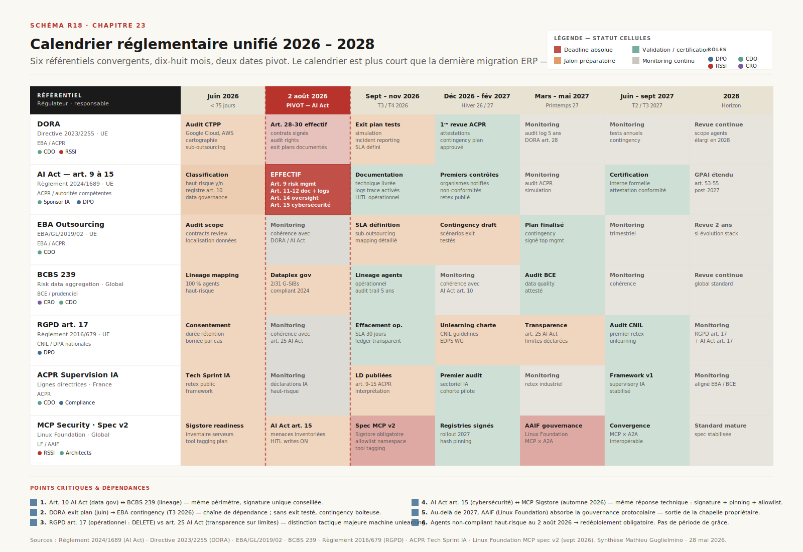
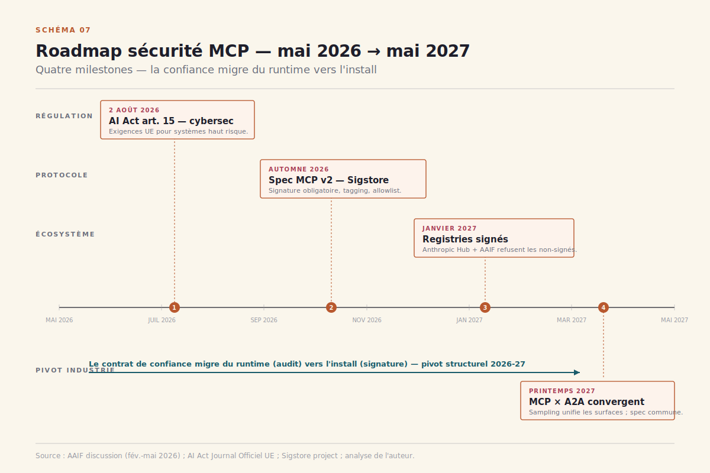
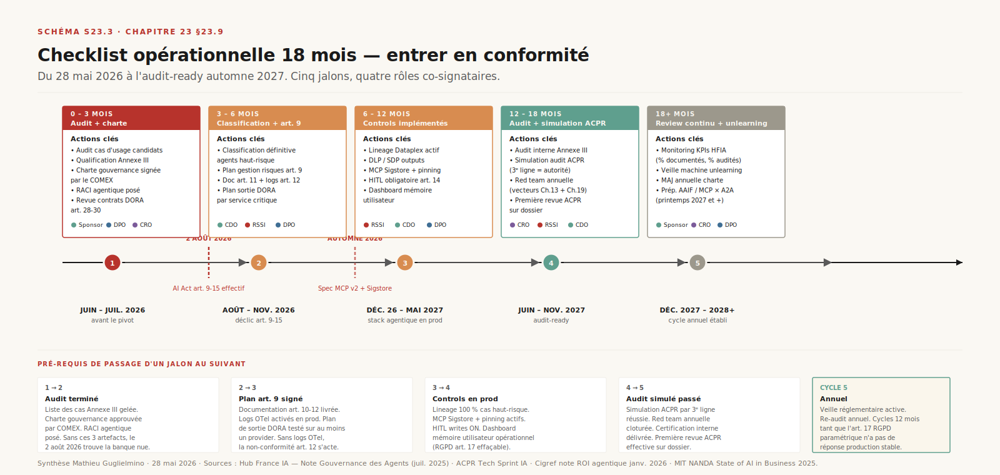

# Chapitre 25 — Gouvernance : AI Act, banque, machine unlearning

> **Acte IV — Mesures et garde-fous · Chapitre standard, ~22 pages**
> _Le compteur tourne. Au 28 mai 2026, il reste **75 jours** avant que les articles 9 à 15 de l'AI Act ne deviennent opposables aux systèmes haut-risque déployés en Union européenne. Pour une banque française tier 1, la fenêtre se ferme alors que six référentiels — DORA, AI Act, EBA Outsourcing, BCBS 239, RGPD, ACPR — convergent sur un même périmètre : la chaîne agentique de bout en bout. Synthèse réglementaire qui s'appuie sur la mécanique technique exposée ailleurs dans le livre (mémoire au [Ch. 9](ch09-memoire-agentique.md), compaction au [Ch. 10](ch10-compaction.md), MCP aux [Ch. 15](ch15-mcp-plateforme.md)-[13](ch16-mcp-securite.md), threat model au [Ch. 21](ch21-gardefous-securite-globale.md), instanciation banque au [Ch. 18](ch18-analytics-agentique-banque.md)) : le calendrier réglementaire unifié, les quatre rôles pivot, le modèle des trois lignes de défense adapté aux agents, et ce que veut dire « oublier » dans un système où la mémoire opérationnelle se distingue radicalement de la mémoire paramétrique._

> [!QUESTION] Question d'ouverture
> Le 2 août 2026, les articles 9 à 15 de l'AI Act deviennent effectifs sur les systèmes IA haut-risque. **Soixante-quinze jours**. Pour une banque française tier 1 qui déploie un agent de scoring crédit, la chaîne de responsabilité couvre désormais le modèle, le harness, la mémoire, les outils MCP, le runtime, l'observabilité, le lineage des données. ==Qui porte quoi, sous quel délai, contrôlé par qui — et que reste-t-il dans l'angle mort entre le DPO solitaire qui hérite de la mémoire paramétrique et le sponsor IA qui se croit hors-périmètre tant que l'agent n'est « pas en prod » ?==

> [!TLDR] TL;DR décideur
> - ==Le **2 août 2026** est la seule date qui ne se négocie pas.== AI Act articles 9-15 effectifs sur les systèmes haut-risque déployés en UE. Pour une banque, le périmètre Annexe III inclut le scoring de solvabilité — et toute la chaîne agentique qui l'opère, pas seulement le modèle sous-jacent.
> - **Six référentiels convergents** : DORA (résilience opérationnelle, janvier 2025), AI Act art. 9-15 (haut-risque, 2 août 2026), EBA Outsourcing, BCBS 239 (lineage — **2 des 31 G-SIBs** *fully compliant* fin 2024), RGPD art. 17, ACPR. Aucun ne se lit isolément.
> - **Quatre rôles pivot** doivent s'aligner sur chaque décision : DPO (RGPD), RSSI (art. 15, MCP, threat model), Sponsor IA / CDO (stratégie), CRO ou COO (accountability finale en banque haut-risque). ==Le piège classique : déléguer la gouvernance mémoire au DPO seul.==
> - **Trois lignes de défense adaptées aux agents** : 1ʳᵉ ligne ops, 2ᵉ ligne risk / compliance, 3ᵉ ligne audit. Le SR 11-7 reste pertinent mais ne suffit plus — pensé pour des **modèles**, pas pour des **agents** qui appellent des outils et reformulent leur stratégie en cours de route.
> - **Machine unlearning : la distinction structurante** entre mémoire opérationnelle (le `DELETE` est faisable, RGPD art. 17 satisfait) et mémoire paramétrique (technologie émergente, aucune solution production stable en 2026). ==La transparence honnête au titre de l'art. 25 AI Act est la réponse acceptable en 2026.==
> - **Calendrier 2026-2028, deux dates pivot** : 2 août 2026 (AI Act art. 9-15), puis automne 2026 (spec MCP v2 avec Sigstore obligatoire). Hiver-printemps 2027 : convergence MCP / A2A sous AAIF. Plus court qu'une migration ERP — et il ne se négocie pas.
> - **La matrice 6 référentiels × 9 couches stack** s'instancie en banque française GCP au [Ch. 18](ch18-analytics-agentique-banque.md) ; la version générique applicable à tout déployeur est ici.
> - **Trois pièges 100 % traçables** : croire que l'art. 9-15 ne touche que le scoring crédit (faux — tout cas Annexe III) · attendre la CNIL ou l'ACPR pour commencer · déléguer la mémoire au DPO seul.

---

> [!INFO] Voir [Ch. 18 — Analytics agentique banque](ch18-analytics-agentique-banque.md) · [Ch. 9 — Mémoire agentique](ch09-memoire-agentique.md) · [Ch. 10 — Compaction](ch10-compaction.md) · [Ch. 16 — Sécurité MCP](ch16-mcp-securite.md) · [Ch. 21 — Garde-fous, jailbreaking et sécurité globale](ch21-gardefous-securite-globale.md)
> Face réglementaire de cinq chapitres techniques déjà déroulés. [Ch. 18](ch18-analytics-agentique-banque.md) instancie la matrice 6 référentiels × stack sur GCP banque française ; ici, la version générique. [Ch. 9](ch09-memoire-agentique.md) et [Ch. 10](ch10-compaction.md) décrivent la mécanique mémoire et compaction ; ici, l'angle RGPD art. 17 et AI Act art. 25. [Ch. 16](ch16-mcp-securite.md) décrit les 10 vecteurs MCP et les 4 patterns pivots ; ici, seulement le calendrier (Sigstore automne 2026). [Ch. 21](ch21-gardefous-securite-globale.md) décrit le threat model unifié 2026 ; ici, on le mobilise en arrière-plan sans le redéployer.

---

## 25.2 Calendrier réglementaire unifié 2026-2028

La première chose qu'un sponsor IA doit avoir sous les yeux est un calendrier. Pas un texte juridique annoté ; un calendrier opposable. La matrice ci-dessous unifie les six référentiels sur dix-huit mois et nomme leurs dates pivot.

Le schéma dispose **sept lignes de référentiels** (DORA, AI Act art. 9-15, EBA Outsourcing, BCBS 239, RGPD, ACPR Supervision IA, MCP Spec v2 / AAIF) sur sept fenêtres temporelles, de juin 2026 à l'horizon 2028. La colonne pivot est celle du **2 août 2026** — bandeau rouge traversant — sur laquelle un bloc détaille les cinq articles AI Act qui deviennent opposables (art. 9 risk management, art. 11-12 documentation et logs, art. 14 supervision humaine, art. 15 cybersécurité). Le code couleur des cellules sépare les deadlines absolues (rouge), les jalons préparatoires (orange), les certifications (vert) et le monitoring continu (gris). Une colonne « responsable » à gauche colore les responsabilités par fonction (DPO bleu, RSSI rouge, CDO / Sponsor IA vert, CRO violet). Le bandeau bas formalise **six dépendances critiques** inter-référentiels — par exemple le plan de sortie DORA art. 28 qui alimente le contingency plan EBA (T3 2026), l'art. 10 AI Act data governance qui partage le périmètre du lineage BCBS 239, ou l'art. 15 AI Act cybersécurité dont la réponse technique est mutualisée avec la spec MCP v2 Sigstore (automne 2026).

### 25.2.1 La fenêtre des soixante-quinze jours

Au 28 mai 2026, la fenêtre vers le 2 août fait **soixante-quinze jours**. La métaphore de la migration ERP est utile parce qu'elle est trompeuse — un projet ERP se négocie, le calendrier réglementaire ne se négocie pas. La date butoir est inscrite au Journal officiel de l'Union européenne, dans le Règlement 2024/1689 du 13 juin 2024[^reg-aiact]. La banque qui n'aurait pas qualifié son agent en haut-risque ou non, qui n'aurait pas écrit le plan de gestion des risques (art. 9), qui n'aurait pas instrumenté la journalisation requise (art. 11-12), qui n'aurait pas mis en place la supervision humaine effective (art. 14), ne se verra pas accorder de période de grâce.

### 25.2.2 Six référentiels, deux dates pivot

Le calendrier R18 fait apparaître deux dates pivot. La première — **2 août 2026** — concentre l'AI Act art. 9-15. La seconde — **automne 2026** — n'est pas une date réglementaire mais une date technique : la spec MCP v2 portée par l'AAIF (Agent and AI Interoperability Forum, successeur de la Linux Foundation Project AI Connectivity) rendra Sigstore obligatoire sur les registries officiels[^mcp-spec-v2]. Pour un RSSI banque qui déploie une fleet d'agents équipés de serveurs MCP, la deuxième date est aussi structurante que la première : c'est elle qui transforme la sécurité MCP d'une *discipline* en un *produit*.

> [!IMPORTANT] 2 août 2026 — non-négociable
> ==La date du 2 août 2026 n'est pas un objectif de planification ; c'est une date butoir réglementaire opposable.== Un agent qualifié haut-risque qui n'a pas, à cette date, son plan de gestion des risques (art. 9), son registre de gouvernance des données (art. 10), sa documentation technique et ses logs (art. 11-12), son dispositif de supervision humaine effective (art. 14) et son audit cybersécurité prêt (art. 15) **doit être redéployé** ou retiré du périmètre haut-risque. Le coût d'une mise en non-conformité est double : sanction administrative (jusqu'à 35 M€ ou 7 % du CA mondial selon l'art. 99 AI Act[^reg-aiact]) et risque opérationnel d'arrêt de service. Aucune banque française tier 1 ne s'expose à ce risque sciemment — mais plusieurs équipes en 2026 sous-estiment encore le périmètre couvert par l'art. 9-15.

---

## 25.3 Les six référentiels en détail

Le calendrier R18 ne suffit pas. Il faut comprendre, pour chacune des six lignes, **ce qui est exigé**, **par qui**, et **comment on prouve qu'on s'y conforme**. Ce paragraphe résume — chaque référentiel a fait l'objet de manuels entiers ; on tient ici le strict nécessaire pour qu'un sponsor IA ne se trompe pas de scope.

### 25.3.1 DORA — la résilience opérationnelle est un sujet du conseil

Le *Digital Operational Resilience Act* (Règlement 2022/2554) est entré en vigueur le **17 janvier 2025**[^dora]. Sa logique de fond : ==les défaillances IT et cloud d'un fournisseur critique deviennent le risque opérationnel de la banque cliente==, pas du fournisseur. La banque est désormais opérationnellement responsable de la résilience de ses fournisseurs cloud, et doit le prouver à son régulateur.

Pour une chaîne agentique, trois articles structurent l'effort : **art. 28** (exigences contractuelles sur les TPSP — *Third-Party Service Providers*), **art. 29** (concentration risk, exit plans testables) et **art. 30** (key contractual provisions). Google Cloud, AWS et Azure ont été désignés *Critical Third-Party Service Providers* — leur supervision est désormais directe par les ESAs (EBA, ESMA, EIOPA), en plus de la supervision contractuelle exercée par chaque banque cliente. Pour la stack data agentique, cela signifie que les contrats cloud signés avant 2025 doivent être amendés sur les articles 28-30, que chaque service critique utilisé doit faire l'objet d'un plan de sortie documenté et testable, et que les incidents majeurs côté provider doivent être notifiés à l'ACPR sous délais explicites.

### 25.3.2 AI Act art. 9-15 — le cœur du calendrier

Le Règlement 2024/1689 du 13 juin 2024[^reg-aiact] entre dans sa phase critique le **2 août 2026**. Pour une banque, le périmètre Annexe III est explicite : tout système d'IA utilisé pour évaluer la solvabilité d'une personne physique ou attribuer un score de crédit (à l'exception de la détection de fraude) est ==haut-risque==. Les obligations art. 9 à 15 couvrent :

- **Art. 9** — système de gestion des risques formalisé sur l'ensemble du cycle de vie.
- **Art. 10** — gouvernance des datasets : training, validation, test datasets doivent avoir des pratiques documentées de collecte, préparation, labellisation, qualité.
- **Art. 11-12** — documentation technique et journalisation.
- **Art. 13** — transparence vis-à-vis du déployeur.
- **Art. 14** — supervision humaine effective (*oversight*).
- **Art. 15** — exactitude, robustesse, cybersécurité.

L'art. 25 introduit par ailleurs, pour les modèles GPAI (*general-purpose AI*), une obligation de transparence sur les **capacités et limites** du modèle qui devient le pivot de l'angle *machine unlearning* développé au §25.6. À ces obligations européennes s'ajoutent les cadres internationaux convergents — **ISO/IEC 42001:2023** sur les systèmes de management de l'IA[^iso-42001], **ISO/IEC 23894:2023** sur la gestion des risques IA[^iso-23894], le **NIST AI Risk Management Framework**[^nist-airmf] et son *Generative AI Profile*, les **35 recommandations ANSSI** pour les systèmes IA générative[^anssi], et l'**EDPB Opinion 28/2024** sur le traitement des données personnelles dans les modèles IA[^edpb-ai]. Aucun ne se substitue à l'AI Act ; tous le complètent sur des angles spécifiques (sécurité, RGPD, management).

==Pour un agent data utilisé sur scoring crédit, toutes ces obligations s'appliquent à l'agent==, pas seulement au modèle de scoring sous-jacent. C'est un changement de périmètre qui surprend encore beaucoup d'équipes en 2026. À l'inverse, un agent de monitoring qualité données ou de génération de reporting interne **n'est pas haut-risque** au sens Annexe III — il reste soumis à RGPD, BCBS 239, EBA, mais pas à l'arsenal art. 9-15.

> [!INFO] Voir [Ch. 18 — Analytics agentique banque française](ch18-analytics-agentique-banque.md)
> La profondeur sectorielle du cas scoring crédit est au [Ch. 18](ch18-analytics-agentique-banque.md) §18.11 : qu'est-ce qu'un agent NL→SQL sous Annexe III, quelle est la documentation à produire pour chacun des cinq articles, quelle est la pile GCP qui répond (Vertex Agent Engine sous Assured Workloads EU + Dataplex pour le lineage + Model Armor pour la robustesse art. 15 + audit logs pour les art. 11-12). Ici on cite les articles ; le [Ch. 18](ch18-analytics-agentique-banque.md) déroule la profondeur métier.

### 25.3.3 EBA Outsourcing — l'audit, la localisation, le contingency

Les *EBA Guidelines on outsourcing arrangements* (EBA/GL/2019/02, applicables depuis le 30 septembre 2019)[^eba-out] couvrent l'audit, la sécurité, la localisation des données, le sub-outsourcing, les contingency plans et les exit strategies pour tout outsourcing cloud d'une banque. L'ACPR supervise leur application en France. Le pattern qui s'installe sur la chaîne agentique : ==chaque composant externalisé (modèle, runtime agentique, serveur MCP commercial, base vectorielle managée) doit être tracé dans le registre d'outsourcing==, avec son criticité, sa localisation, son plan de sortie. Les serveurs MCP tiers utilisés en production rejoignent ce périmètre par construction.

### 25.3.4 BCBS 239 — le lineage, l'angle mort historique

Le *Principles for effective risk data aggregation and risk reporting* (Comité de Bâle, janvier 2013, en vigueur depuis 2016)[^bcbs239] impose à toute G-SIB de tracer chaque métrique de risque depuis sa source jusqu'au reporting. Quatorze principes couvrent la gouvernance, l'architecture data, la précision et l'intégrité, la complétude, l'opportunité, l'adaptabilité du reporting. PwC mesurait fin 2024 que ==seules **2 G-SIBs sur 31** étaient *fully compliant* sur les 14 principes==[^bcbs239-pwc]. Le chiffre est choquant et il reste à mai 2026 le meilleur indicateur disponible sur la maturité réelle du lineage de données en banque mondiale.

C'est précisément ce qu'un agent data bien architecturé peut adresser : automatiser la production du graphe de lineage, détecter les ruptures, générer la documentation demandée en audit. Mais l'inverse est vrai aussi : ==un agent qui produit des chiffres sans lineage les rend invisibles au régulateur==. L'art. 10 AI Act sur la *data governance* et BCBS 239 partagent le même périmètre — un seul effort de lineage couvre les deux.

### 25.3.5 RGPD art. 17 + machine unlearning émergent

Le Règlement 2016/679 (RGPD)[^rgpd] reste l'épine dorsale de la protection des données personnelles en UE. Pour la chaîne agentique, c'est l'**article 17** (droit à l'effacement) qui produit la question opérationnelle inédite traitée au §25.6 : qu'est-ce qu'« oublier » dans un système où l'information a été compactée, résumée, paraphrasée, et fondue dans un embedding vectoriel ? L'article 22 (décisions individuelles automatisées et droit à l'explication) converge avec l'art. 14 AI Act sur la supervision humaine — un agent qui produit un refus de crédit doit être explicable au demandeur sous une forme qui satisfait simultanément les deux régimes.

### 25.3.6 ACPR — la supervision FR

L'Autorité de contrôle prudentiel et de résolution (ACPR) prépare la supervision AI Act en banque française[^acpr]. Elle a co-organisé avec le Lab Banque de France un *Tech Sprint IA générative* qui a produit huit prototypes en trois jours avec des data scientists externes, et elle cadre actuellement les méthodes pratiques de mise en œuvre et de supervision. Ses lignes directrices d'avril 2026 conjointement avec l'EBA[^acpr-eba-ld] clarifient l'interprétation pour le secteur bancaire — notamment sur la qualification haut-risque, la documentation art. 11, et l'oversight art. 14. Côté UE, l'**EBA** vient de publier son rapport sectoriel sur l'usage de l'IA dans le secteur bancaire[^eba-airmf] et la **BCE** précise dans une note de supervision les attentes pour les *significant institutions*[^ecb-genai]. Côté souveraineté FR, deux niveaux d'exigence s'installent : **Assured Workloads for EU**[^assured-wl] sur les workloads internes, **S3NS / Premi3NS** sous certification SecNumCloud 3.2 ANSSI[^s3ns] pour les workloads OIV (Opérateurs d'Importance Vitale), périmètre qui inclut les banques systémiques françaises. La doctrine de supervision ACPR consolidée par sa note d'avril 2026[^acpr-doctrine] reste le document à avoir sous la main.

> [!QUOTE] ACPR — Lignes directrices IA, avril 2026
> *« La supervision se fera par cas d'usage, pas par modèle. Un même modèle de fondation utilisé pour générer un rapport interne et pour scorer un dossier de crédit ne crée pas les mêmes obligations — c'est l'usage agentique qui qualifie le système, pas le modèle sous-jacent. »*[^acpr-eba-ld]
> Cette doctrine — *supervision par cas d'usage* — est le point qu'il faut intégrer **avant** d'écrire le business case. Un sponsor IA qui présente une plateforme agentique générique au COMEX sans avoir nommé les cas d'usage et leur qualification haut-risque/non-haut-risque construit un dossier qui ne résistera pas à la première revue ACPR.

---

## 25.4 Modèle des trois lignes de défense adapté aux agents

Tous les référentiels précédents s'appuient implicitement sur un même modèle organisationnel — le **modèle des trois lignes de défense**, hérité de la banque (notamment du *Federal Reserve SR 11-7*[^sr11-7] sur le model risk management), formalisé par l'IIA en 2020[^iia-3lod] et désormais standard ISO 31000. Le Hub France IA[^hubfia], dans sa note de juillet 2025 sur la gouvernance des agents, en propose une adaptation explicite aux systèmes agentiques.

<!-- TODO: S23.1 — 3 lignes de défense adapté aux agents, ~½ page, source: gouvernance/gouvernance-agents-ia.html à extraire en SVG -->

*Le schéma S23.1 — modèle des trois lignes de défense adapté aux agents, en demi-page — fait apparaître trois colonnes alignées sur trois rôles distincts. **1ʳᵉ ligne** (gauche) : équipes opérationnelles — dev, ops, PO — qui développent, testent, monitorent les agents et gèrent les incidents au premier degré. **2ᵉ ligne** (centre) : risk management, compliance, legal — qui définissent les politiques, les contrôles, le reporting, la formation. **3ᵉ ligne** (droite) : audit interne et audit externe — qui produisent l'assurance, la certification, les recommandations. Au-dessus, deux bandeaux : direction générale (stratégie IA, ressources) et conseil d'administration (supervision globale, appétit risque). Au-dessous, un bandeau « propre aux agents » qui ajoute les spécificités non-traitées par le SR 11-7 historique : surveillance des trajectoires, audit des tool calls, gouvernance de la mémoire persistante, threat model agentique.*

### 25.4.1 Première ligne — équipes opérationnelles

La première ligne porte la responsabilité **directe** sur le produit. Pour un agent en production, cela couvre le développement, les tests (incluant les *capability evals* et *régression evals* du [Ch. 19](ch19-evaluation-benchmarks.md)), le monitoring (OTel GenAI, voir [Ch. 20](ch20-observabilite-cognitive-audit-trail.md)), la gestion des incidents au premier degré. Le pivot par rapport aux modèles classiques : ==la première ligne doit désormais instrumenter la trajectoire== — pas seulement les inputs et outputs, mais la séquence complète des tool calls, des décisions intermédiaires et des escalades.

### 25.4.2 Deuxième ligne — risk / compliance / legal

La deuxième ligne définit les politiques, les contrôles, le reporting. Sur un agent haut-risque, elle est responsable du **registre des risques** (art. 9 AI Act), du **registre de gouvernance des données** (art. 10), du suivi de la supervision humaine effective (art. 14), du dispositif cybersécurité (art. 15). C'est aussi elle qui produit la matrice risques / mitigations consultable en audit ACPR. Le rôle pivot DPO appartient à cette ligne — mais ne s'y limite pas, comme on va le voir §25.5.

### 25.4.3 Troisième ligne — audit interne + autorité externe

La troisième ligne assure, certifie, recommande. Sur un agent haut-risque, elle conduit l'audit interne périodique (programme annuel à minima), prépare l'audit externe ACPR, vérifie l'application effective des politiques de la deuxième ligne sur le terrain. ==C'est elle qui détecte les angles morts entre lignes== — typiquement, une mémoire opérationnelle correctement gouvernée par la deuxième ligne mais une mémoire paramétrique laissée sans politique parce qu'elle « relève de l'éditeur du modèle ».

> [!NOTE] Pourquoi le SR 11-7 ne suffit plus
> Le *SR 11-7 — Guidance on Model Risk Management*[^sr11-7] publié par la Réserve fédérale américaine en 2011 a été pendant quinze ans le standard *de facto* du *model risk management* en banque. Il définit trois principes — *effective challenge*, *robust development and validation*, *ongoing monitoring* — et il a été conçu pour des **modèles** : un objet statistique aux inputs définis, aux outputs vérifiables, et au comportement reproductible à paramètres fixés. Un agent moderne combine un modèle, un *scaffold*, une mémoire, des outils et une boucle multi-tours (cf. Acte II) — ==il appelle des outils et reformule sa propre stratégie en cours de route==. Le périmètre du SR 11-7 ne couvre pas la trajectoire, ne couvre pas la mémoire persistante, ne couvre pas la chaîne MCP, ne couvre pas l'orchestration multi-agent. Il reste pertinent pour le modèle sous-jacent, mais il faut le compléter — pas le remplacer — par les exigences AI Act art. 9-15 sur la totalité de la chaîne agentique. C'est exactement la posture que le Hub France IA[^hubfia] et l'ACPR[^acpr-eba-ld] poussent en 2025-2026.

---

## 25.5 Les quatre rôles pivot et leur articulation

Les trois lignes de défense décrivent une structure, pas des personnes. Sur le terrain, quatre rôles pivot doivent **s'aligner sur chaque décision agentique haut-risque** — et c'est leur articulation, pas leur existence individuelle, qui produit la gouvernance.

### 25.5.1 DPO — RGPD et la chaîne mémoire

Le *Data Protection Officer* (RGPD art. 37-39) porte la responsabilité sur la protection des données personnelles. Sur un agent agentique, son périmètre couvre le consentement, la rétention bornée, la base légale, le droit à l'effacement, le droit à l'explication (art. 22). Il est nécessairement impliqué sur **toute la chaîne mémoire opérationnelle** — store séparé vectoriel, sessions, profils utilisateurs (cf. §25.6).

### 25.5.2 RSSI — AI Act art. 15, MCP, threat model

Le RSSI (ou *CISO*) porte la cybersécurité du système IA — art. 15 AI Act au premier chef, mais aussi les obligations DORA sur la résilience. Pour un agent moderne, son périmètre couvre la robustesse aux inputs adverses, le threat model (voir [Ch. 21](ch21-gardefous-securite-globale.md) §21.10), la chaîne MCP (signature Sigstore automne 2026, tool tagging, allowlist namespace — voir [Ch. 16](ch16-mcp-securite.md)), l'identité fédérée, l'observabilité des trajectoires. ==Le RSSI ne peut pas raisonnablement assurer son rôle sans une équipe sécurité formée à la spécificité agentique== — ce n'est pas la même discipline que la sécurité applicative classique.

### 25.5.3 Sponsor IA / CDO — stratégie, arbitrage

Le sponsor IA (souvent CDO en banque, parfois COO ou CTO selon les organisations) porte la stratégie agentique : quels cas d'usage, quel niveau de risque acceptable, quel ROI cible, quelle architecture. C'est lui qui arbitre entre vitesse et conformité, entre capacités frontière et souveraineté, entre dette d'évaluation et déploiement rapide. La checklist en sept questions de signature du [Ch. 23](ch23-roi-paradoxe-agentique.md) §23.9 alimente directement ses *gates* — un projet qui n'a pas répondu aux sept ne devrait pas franchir la première ligne de défense.

### 25.5.4 CRO / COO — accountability finale en banque haut-risque

En banque tier 1 sur un cas d'usage haut-risque, l'*accountability* finale ne peut pas s'arrêter au CDO. C'est le **CRO** (*Chief Risk Officer*) ou le **COO** (*Chief Operating Officer*) — selon l'organisation et la nature du risque dominant — qui porte la signature finale au COMEX, et qui répond devant l'ACPR. Cette accountability finale est conforme au principe DORA — ==la défaillance d'un fournisseur reste le risque opérationnel de la banque==, donc du CRO.

> [!IMPORTANT] Le piège du DPO solitaire
> ==Le piège classique est de déléguer toute la gouvernance mémoire au DPO seul.== La raison superficielle : « mémoire = données personnelles = DPO ». La raison profonde du piège : la mémoire d'un agent moderne se distribue sur **deux régimes radicalement différents** — la mémoire opérationnelle (stores séparés, sessions, profils ; le DPO sait et peut agir) **et** la mémoire paramétrique (poids du modèle ; aucune solution production stable de *machine unlearning* en 2026, le périmètre dépasse le DPO seul). Si le DPO porte seul le sujet, il prend des engagements de droit à l'effacement qu'il ne peut pas techniquement tenir sur la composante paramétrique. La sortie par le haut : les quatre rôles co-signent la charte mémoire, et chacun déclare son périmètre — le DPO sur l'opérationnel, le RSSI sur l'intégrité, le sponsor IA sur le contrat usage, le CRO sur le risque résiduel. C'est le seul montage qui résiste à un audit ACPR.

> [!EXAMPLE] Mini-cas — agent de scoring crédit en banque tier 1, mapping art. 9-15 ligne par ligne
> Une banque française tier 1 déploie un agent NL→SQL au-dessus de son Datawarehouse pour assister les analystes crédit dans la qualification des dossiers PME. L'agent interroge le DWH, agrège les ratios financiers, croise avec la base historique, propose une note de pré-qualification et déclenche un workflow d'instruction. Le cas est qualifié **haut-risque** au sens Annexe III AI Act (évaluation de solvabilité). À 75 jours du 2 août 2026, le mapping art. 9-15 se lit ainsi :
>
> - **Art. 9 — Risk management plan.** Le sponsor IA (CDO) et la 2ᵉ ligne (compliance) co-signent le plan de gestion des risques sur le cycle de vie de l'agent : risques d'erreur, de biais (genre, géographie, taille d'entreprise), d'hallucination sur les ratios, de dérive temporelle. Le plan est revu trimestriellement.
> - **Art. 10 — Data governance.** Le CDO et la première ligne data documentent les datasets : sources DWH, fraîcheur, échantillonnage, qualité, biais détectés et corrigés. Le lineage Dataplex est l'outil opérationnel (cf. [Ch. 18](ch18-analytics-agentique-banque.md)). ==Le périmètre couvre l'agent en entier, pas seulement le modèle de scoring sous-jacent.==
> - **Art. 11-12 — Documentation technique + logs.** Le RSSI et la 1ʳᵉ ligne ops produisent la documentation technique (architecture, modèles, prompts, outils, mémoire) et configurent la journalisation OTel GenAI (voir [Ch. 20](ch20-observabilite-cognitive-audit-trail.md)) — chaque appel agent, chaque tool call, chaque décision intermédiaire, conservés cinq ans (exigence DORA art. 28 sur les TPSP critiques).
> - **Art. 13 — Transparence vis-à-vis du déployeur.** Documentation utilisateur destinée aux analystes crédit : capacités, limites, biais connus, contraintes d'usage. Le fournisseur du modèle (Anthropic, OpenAI, Google, Mistral selon le choix) produit la model card art. 25 ; la banque produit la *system card* qui décrit son agent au-dessus.
> - **Art. 14 — Human oversight effective.** La 1ʳᵉ ligne et la compliance définissent le dispositif d'oversight : l'analyste crédit ne peut pas valider automatiquement la pré-qualification ; l'agent propose, l'humain décide. Le seuil de confiance qui déclenche une escalade est calibré sur les données historiques. ==Pas d'oversight = pas de production.==
> - **Art. 15 — Cybersecurity + robustesse.** Le RSSI configure Model Armor[^model-armor] (firewall AI runtime), DLP sur les outputs, audit log sur tous les MCP, threat model documenté (voir [Ch. 21](ch21-gardefous-securite-globale.md)), red team annuelle aligné sur l'**OWASP Top 10 for Agentic AI Security Initiative**[^owasp-asi] et sur l'**OWASP Top 10 LLM**[^owasp-llm]. Au 2 août 2026, le dispositif doit être *audit-ready* — l'ACPR peut demander à voir les artefacts à tout moment.
>
> Le DPO supervise transversalement l'application du RGPD (art. 17, art. 22), le CRO porte l'accountability finale, le sponsor IA arbitre les tradeoffs. **Quatre rôles co-signent, l'agent passe.** Trois rôles sur quatre, l'agent ne passe pas. Un DPO seul, l'agent n'aurait jamais dû quitter le pilote.

---

## 25.6 Machine unlearning et les limites de l'oubli

C'est ici que la gouvernance des agents touche son point le plus sensible — et le plus mal compris en mai 2026. L'**article 17 du RGPD** impose qu'une personne puisse demander la suppression de ses données personnelles d'un système. Appliqué à un agent IA, cela soulève une question opérationnelle inédite : ==qu'est-ce qu'« oublier » dans un système où l'information a été compactée, résumée, paraphrasée, et fondue dans un embedding vectoriel ?==

### 25.6.1 La distinction structurante — opérationnel vs paramétrique

Les contributeurs de l'Initiative IA Maîtrisée — repris dans le rapport mémoire agentique[^memoire] — proposent une distinction qui doit devenir un acquis de gouvernance en 2026 :

- **Mémoire opérationnelle / explicite** — fichiers, vecteurs, blocs structurés, sessions, profils utilisateurs. L'effacement est techniquement faisable : un `DELETE WHERE user_id = X` sur la base vectorielle suffit, sous réserve que l'ID utilisateur soit propagé sur chaque fait stocké. La preuve d'exécution est produisible. ==C'est l'angle où le DPO peut tenir l'art. 17 RGPD== sans difficulté technique majeure.
- **Mémoire implicite / paramétrique** — poids du modèle entraînés sur des données passées. L'effacement ciblé reste une **technologie émergente**. Le *machine unlearning* — désentraîner sélectivement un modèle sans le réentraîner intégralement — fait l'objet de recherches actives (Bourtoule et al. *Machine Unlearning* IEEE S&P 2021[^unlearning-bourtoule] ; Gupta et al. *Adaptive Machine Unlearning* NeurIPS 2021[^unlearning-gupta] ; lignes directrices CNIL juin 2025[^cnil-unlearning] et EDPS WG novembre 2025-février 2026[^edps-wg]), mais aucune solution production stable n'existe encore. La transparence sur cette limite est indispensable à la confiance — pas un aveu de faiblesse.

### 25.6.2 La transparence honnête comme réponse réglementaire 2026

L'**article 25 de l'AI Act**[^reg-aiact] impose, pour les modèles GPAI, une obligation de transparence sur les *capacités et limites* du modèle. Appliqué à la mémoire, cela ouvre une voie pragmatique : ==en 2026, la transparence honnête sur ce qu'on sait oublier et ce qu'on ne sait pas encore oublier est la réponse réglementaire acceptable==. Trois conditions pour que cette transparence tienne :

1. **L'opérationnel doit être effectivement effacé sur demande**, avec délai et preuve. Pas de tolérance ici — un `DELETE` qui ne s'exécute pas vide la conformité RGPD de toute substance.
2. **Le ledger des compactions doit être traçable** (cf. [Ch. 10](ch10-compaction.md) sur la mécanique, [Ch. 20](ch20-observabilite-cognitive-audit-trail.md) sur l'instrumentation OTel `gen_ai.compaction.*` en cours de standardisation par le groupe de travail GenAI semconv[^otel-genai]). Un déployeur qui ne peut pas démontrer ce qu'il a oublié, et quand, ne pourra pas démontrer sa conformité art. 25.
3. **La limite paramétrique doit être nommée publiquement** dans la *system card* du déployeur, avec un état de l'art à jour des techniques de *machine unlearning* explorées et le calendrier prévisible de leur disponibilité en production.

> [!INFO] Voir [Ch. 9 — Mémoire agentique](ch09-memoire-agentique.md) · [Ch. 10 — Compaction](ch10-compaction.md) · [Ch. 20 — Observabilité agentique et cognitive audit trail](ch20-observabilite-cognitive-audit-trail.md)
> Le [Ch. 9](ch09-memoire-agentique.md) §9.2 décrit l'architecture mémoire aux quatre piliers (stockage / accès / mise à jour / oubli) qui sous-tend la distinction opérationnel / paramétrique reprise ici. Le [Ch. 10](ch10-compaction.md) §10.5-7 décrit la mécanique des cinq familles de compaction et le ledger transparent (`gen_ai.compaction.tokens_in`, `gen_ai.compaction.summary_hash`, `gen_ai.compaction.policy`, etc.) — son instrumentation OTel est traitée au [Ch. 20](ch20-observabilite-cognitive-audit-trail.md). Ici, on ne refait pas la mécanique : on déclare seulement que ==le ledger transparent requis par l'art. 25 AI Act devient une obligation documentaire pour les déployeurs en production==, et que l'observabilité de la compaction passe ainsi du statut « bon à avoir » au statut « obligatoire » en 2026-2027.

### 25.6.3 Trois actions tactiques de gouvernance mémoire

Le rapport mémoire agentique[^memoire] propose trois actions tactiques que toute organisation déployant un agent à mémoire persistante doit avoir mises en place avant la fin 2026 :

1. **Consentement explicite et durée de rétention bornée** — par exemple 6 mois renouvelables, avec opt-out accessible.
2. **Gestion documentée de l'effacement sur le périmètre opérationnel** — délais de propagation, preuve d'exécution, log d'audit.
3. **Reconnaissance explicite des limites sur le périmètre paramétrique** — *system card* publique, état de l'art à jour, calendrier d'évolution.

S'ajoute, sur la surface d'attaque, le suivi du vecteur **MITRE ATLAS AML.T0080 — *AI Agent Context Poisoning : Memory***[^mitre-atlas]. Documenté dès septembre 2024 par Johann Rehberger sous le nom *SpAIware*[^rehberger-spaiware], ce vecteur consiste à injecter une instruction malveillante dans la mémoire long-terme via un document piégé — l'exfiltration devient alors continue, à travers les sessions. Le DPO et le RSSI doivent co-signer la mitigation : sandboxing des outils mémoire, validation avant écriture, journalisation auditable de chaque CRUD mémoire (Anthropic l'implémente nativement pour ses *Managed Agents*[^anthropic-managed-agents]).

Le schéma — repris du [Ch. 9](ch09-memoire-agentique.md) §9.7 — déroule le cycle d'attaque en cinq étapes (document piégé → ingestion → consolidation mémoire long-terme → activation cross-session → exfiltration) avec les trois cas documentés (SpAIware ChatGPT, *Delayed Tool Invocation* Anthropic, *ShadowLeak* M365 Copilot) et les quatre couches de mitigation (infrastructure, modèle, utilisateur, organisation). ==Matériau opposable que le DPO doit avoir en tête quand il signe le registre de traitement d'un agent à mémoire persistante== — le RGPD art. 17 exige que la donnée puisse être effacée ; la mémoire empoisonnée non détectée rend l'art. 17 inopérant en pratique.

---

## 25.7 Matrice réglementaire × stack — instanciation générique

Reste à projeter les six référentiels sur la pile technique de l'agent. La matrice ci-dessous est l'**instanciation générique** — applicable à tout déployeur, indépendamment du cloud retenu. Sa version banque française GCP — avec les briques concrètes (Looker semantic, BigQuery, Dataplex, Assured Workloads, S3NS, Model Armor) — est au [Ch. 18](ch18-analytics-agentique-banque.md) §18.11.

Le schéma ci-dessus est l'**instanciation banque française GCP** issue du [Ch. 18](ch18-analytics-agentique-banque.md) §18.11 : la même grille projette les six référentiels (DORA, AI Act art. 9-15, EBA Outsourcing, BCBS 239, RGPD, ACPR / souveraineté FR) sur les couches techniques d'une chaîne agentique — **model** (le modèle de fondation), **orchestration** (le scaffold, la boucle multi-tours, les patterns multi-agent), **mémoire** (stores, sessions, profils, ledger compaction), **outils** (MCP, A2A[^a2a-google], tool gateway, allowlist), **runtime** (Agent Engine, conteneurs, isolation), **data** (DWH, lineage Dataplex[^dataplex] ou équivalent, qualité, semantic layer), **réseau** (VPC, firewall AI runtime, DLP egress), **identités** (IAM, tokens d'agent, identité fédérée), **observabilité** (OTel GenAI, audit logs, monitoring trajectoires). Chaque cellule indique l'obligation portée par le référentiel sur la couche et la 1ʳᵉ / 2ᵉ / 3ᵉ ligne de défense responsable. ==On lit la même matrice à un niveau d'abstraction supérieur== — sans les briques GCP spécifiques (Looker semantic, BigQuery, Dataplex, Assured Workloads, S3NS, Model Armor) qui restent au [Ch. 18](ch18-analytics-agentique-banque.md). La forme est identique, la lecture change : [Ch. 18](ch18-analytics-agentique-banque.md) lit comme une checklist d'achat ; ici, une grille générique de conformité.

### 25.7.1 Où chaque obligation s'applique

Quatre lectures de la matrice se dégagent :

- **DORA traverse principalement runtime, outils, observabilité** — c'est la résilience opérationnelle et les exit plans qui dominent. Le modèle lui-même est de second plan ; ce qui compte, c'est la capacité à reprendre le service en cas de défaillance du provider.
- **AI Act art. 9-15 traverse toutes les couches** sur un cas d'usage haut-risque. C'est sa signature : le périmètre couvre l'agent en entier, du modèle à l'observabilité.
- **BCBS 239 se concentre sur data, mémoire, observabilité** — c'est le lineage et l'auditabilité du chemin de la donnée jusqu'au reporting de risque.
- **RGPD traverse data, mémoire, identités, observabilité** — c'est la protection des données personnelles et le droit à l'effacement.

### 25.7.2 Qui vérifie quoi

Sur chaque cellule, deux questions complémentaires se posent : **qui produit l'artefact** (1ʳᵉ ligne ops/data le plus souvent) et **qui contrôle l'application** (2ᵉ ligne compliance / risk au quotidien, 3ᵉ ligne audit en revue périodique). ==La matrice ne se substitue pas à un RACI agentique formalisé== — elle en est l'amorce. Un projet qui n'a pas son RACI agentique au 2 août 2026 entre en non-conformité art. 9 (pas de gouvernance des risques formalisée) presque mécaniquement.

> [!INFO] Voir [Ch. 18 — Analytics agentique banque](ch18-analytics-agentique-banque.md)
> La même matrice à six référentiels × neuf couches devient au [Ch. 18](ch18-analytics-agentique-banque.md) §18.11 une matrice à six référentiels × neuf couches **avec les briques GCP qui répondent** : Assured Workloads EU et S3NS sur la souveraineté, BigQuery + Dataplex sur le data et le lineage, Looker semantic + Tool Governance sur l'orchestration, Vertex Agent Engine + Model Armor sur le runtime, Cloud Audit Logs + OTel GenAI sur l'observabilité. ==Le [Ch. 18](ch18-analytics-agentique-banque.md) lit comme une checklist d'achat GCP banque française ; ici, une grille générique de conformité.==

---

## 25.8 Les deux dates pivot 2026-2027 et leur enchaînement

Au-delà du 2 août 2026, le calendrier R18 fait apparaître un second pivot — **automne 2026 — spec MCP v2 avec Sigstore obligatoire**. Cette section enchaîne les deux dates pour montrer pourquoi elles ne se traitent pas séparément.

### 25.8.1 Été 2026 — AI Act art. 15 effectif

À partir du **2 août 2026**, l'art. 15 AI Act impose des exigences de cybersécurité aux systèmes IA haut-risque déployés en UE, incluant la **résistance à la manipulation par entrée adverse**. Pour un agent banque sur cas Annexe III, cela signifie un threat model documenté (voir [Ch. 21](ch21-gardefous-securite-globale.md)), une red team annuelle, un dispositif de mitigation aux dix vecteurs MCP du [Ch. 16](ch16-mcp-securite.md), et un audit-ready du dispositif. L'EBA et l'ACPR ont publié en avril 2026 leurs lignes directrices d'interprétation pour le secteur bancaire[^acpr-eba-ld] — un agent MCP qui interagit avec un système de scoring crédit ou de KYC devra démontrer sa robustesse contre les vecteurs documentés.

### 25.8.2 Automne 2026 — Spec MCP v2

La révision majeure de la spec MCP, en discussion à l'AAIF (*Agent and AI Interoperability Forum*, le successeur de la Linux Foundation Project AI Connectivity) depuis février 2026, intègre quatre éléments structurants[^mcp-spec-v2] :

- **Signature Sigstore**[^sigstore] pour tous les serveurs publiés sur les registries officiels.
- **Tool tagging structurel** (`read_only`, `external_write`, `requires_consent`).
- **Allowlist namespace** au niveau de la spec.
- **Schéma d'événements OTel standardisé** pour l'audit.

La compatibilité ascendante est préservée — les serveurs MCP v1 continueront à fonctionner — mais les registries officiels (Anthropic Hub, le futur registry AAIF) refuseront les nouveaux serveurs non-signés à partir de **janvier 2027**.

### 25.8.3 Hiver-printemps 2027 — Convergence MCP / A2A + AAIF

Le projet **A2A** de Google (*Agent-to-Agent communication*[^a2a-google]), donné lui aussi à la Linux Foundation en janvier 2026, converge progressivement avec MCP[^anthropic-mcp-spec] via le mécanisme de *sampling* (un agent peut invoquer un autre agent comme outil). Cette convergence augmente la surface — chaque agent A2A devient un point d'entrée MCP — mais elle force aussi la standardisation des patterns défensifs (notamment identité fédérée et content provenance) sur les deux protocoles simultanément. Le printemps 2027 verra la première version stable de la fusion sous gouvernance AAIF[^aaif]. Des incidents récents — l'injection cross-document MCP documentée par Anthropic en juin 2025[^ema-mcp-incident] et l'exfiltration cross-tool WhatsApp via Asana documentée par Pillar Security en avril 2026[^pillar-mcp] — rappellent que la spec v2 arrive après des familles d'attaques déjà industrialisées, pas avant.

Le schéma — repris du [Ch. 16](ch16-mcp-securite.md) §16.7 — déroule la trajectoire complète : été 2026 *Sigstore-ready* sur registries officiels, automne 2026 spec v2 (signature obligatoire + tool tagging + allowlist namespace + OTel audit schema), janvier 2027 refus des serveurs non-signés, printemps 2027 fusion MCP × A2A sous gouvernance AAIF. ==L'enchaînement temporel et la convergence avec l'AI Act art. 15 sont ce qui compte ici== : un agent banque sur cas Annexe III qui n'aura pas migré son tool stack sur la spec v2 à l'automne 2026 entrera en non-conformité art. 15 (cybersécurité) au prochain audit ACPR — la matrice défensive du [Ch. 16](ch16-mcp-securite.md) et les obligations art. 15 partagent quatre patterns pivots communs.

> [!INFO] Voir [Ch. 16 — Sécurité MCP](ch16-mcp-securite.md)
> Le [Ch. 16](ch16-mcp-securite.md) §16.2-6 décrit la matrice complète des **dix vecteurs d'attaque MCP** (Tool Poisoning Attack statique, rug pull, Unicode tags, cross-tool exfiltration, compromission upstream, dépendance transitive, namespace squat, descriptor injection, prompt injection cross-document, exfiltration via le sampling A2A) et les **quatre patterns pivots** (signature Sigstore + hash pinning, tool tagging à l'install, allowlist namespace, audit log OTel). Le [Ch. 16](ch16-mcp-securite.md) §16.7 déroule la roadmap 12 mois reprise ici. On ne reprend que **les dates pivot**, pas la mécanique.

---

## 25.9 Checklist opérationnelle 18 mois — où commencer

Pour une banque tier 1 qui sort de PoC et entre en production agentique haut-risque, la séquence ci-dessous absorbe les contraintes des six référentiels sur dix-huit mois. Elle est calibrée pour qu'une organisation qui démarre le 28 mai 2026 soit *audit-ready* à l'automne 2027 sur ses premiers cas Annexe III.

Le schéma déroule **cinq jalons** sur une frise temporelle : 0-3 mois (audit + charte), 3-6 mois (classification + plan art. 9), 6-12 mois (controls implémentés), 12-18 mois (audit + simulation ACPR), 18+ mois (review continu + machine unlearning). Les deux pivots **2 août 2026** (AI Act art. 9-15) et **automne 2026** (spec MCP v2) tombent entre les jalons 1 et 2, et entre 2 et 3 — c'est ce qui calibre la séquence des deux premières marches. Le bandeau bas formalise les **pré-requis de passage d'un jalon au suivant** : sans ces artefacts, l'organisation ne peut pas franchir l'étape. Le code couleur des rôles co-signataires (DPO bleu, RSSI rouge, CDO / Sponsor vert, CRO violet) sur chaque carte rappelle qu'==aucun jalon n'est porté par un rôle seul== — la chaîne de responsabilité agentique est par construction collective.

### 25.9.1 0-3 mois — Audit risques + charte de gouvernance

Audit complet des cas d'usage candidats. Qualification Annexe III ligne par ligne (haut-risque y/n). Charte de gouvernance agentique signée par le COMEX : politique de rétention mémoire, mécanismes d'effacement, transparence sur les limites du *machine unlearning*, RACI agentique (DPO / RSSI / sponsor IA / CRO). Revue contractuelle DORA art. 28-30 sur les providers cloud déjà engagés. Référencer en parallèle les *implementation guides* sectoriels disponibles (BSA pour les services financiers[^bsa-aiact], enquête de maturité opérationnelle AI for Finance Institute[^aifi-2026]) pour benchmarker la trajectoire.

### 25.9.2 3-6 mois — Classification + plan de risques art. 9

Classification définitive des agents (haut-risque y/n, données sensibles y/n, qualification Annexe III précise). Plan de gestion des risques art. 9 pour chaque cas haut-risque. Documentation art. 11 et journalisation OTel art. 12 activées. Plan de sortie DORA pour chaque service critique externalisé.

### 25.9.3 6-12 mois — Controls implementation

Lineage Dataplex (ou équivalent) actif sur toutes les sources data. DLP / SDP sur les outputs sensibles. MCP Sigstore activé sur les serveurs internes ; pinning par hash pour les serveurs tiers en attendant la spec v2. *Human-in-the-loop* obligatoire sur les actions à effet externe (art. 14). Dashboard mémoire utilisateur pour les agents à mémoire persistante.

### 25.9.4 12-18 mois — Certification interne + audit ACPR simulation

Audit interne complet sur les cas Annexe III. Simulation d'audit ACPR — la 3ᵉ ligne d'audit interne joue le rôle de l'autorité externe. Red team annuelle sur les vecteurs [Ch. 21](ch21-gardefous-securite-globale.md) + [Ch. 16](ch16-mcp-securite.md). Certification interne — l'agent passe en production *high-confidence*. Première revue ACPR effective sur dossier. La discipline d'évaluation (cf. [Ch. 19](ch19-evaluation-benchmarks.md)) et l'instrumentation OTel (cf. [Ch. 20](ch20-observabilite-cognitive-audit-trail.md)) sont les preuves opposables ; sans ces deux briques, l'audit ne peut pas reconstituer la trajectoire de l'agent et la non-conformité art. 12 (logs) est mécaniquement actée.

### 25.9.5 18+ mois — Review continu + machine unlearning governance

Monitoring continu de la conformité (KPIs Hub France IA : % agents documentés, % audités, taux conformité AI Act, incidents non résolus). Veille active sur les progrès du *machine unlearning* paramétrique. Mise à jour annuelle de la charte. Préparation des évolutions réglementaires en discussion (cf. AAIF printemps 2027). Le pilote MIT NANDA *State of AI in Business*[^mit-nanda] reste l'indicateur indirect le plus utile pour comparer la maturité de l'organisation à celle du marché — moins comme benchmark que comme garde-fou contre l'auto-satisfaction. Pour les organisations qui veulent croiser conformité et création de valeur, la note Cigref sur le ROI agentique[^cigref-roi] aligne les *gates* sur la grille de mesure du [Ch. 23](ch23-roi-paradoxe-agentique.md).

> [!QUOTE] Hub France IA — Note Gouvernance des Agents d'IA Générative, juillet 2025
> *« Alors que les agents IA passent de l'expérimentation à la production, les cadres de gouvernance traditionnels ne suffisent plus. Le modèle des trois lignes de défense reste pertinent, mais doit être adapté aux spécificités agentiques — propagation d'erreurs entre agents, escalade non contrôlée des permissions, mémoire persistante comme nouvelle surface d'attaque, orchestration multi-agent comme objet de gouvernance à part entière. »*[^hubfia]
> Cette doctrine — *adaptation, pas remplacement* — est la posture qui sépare une équipe qui pivote efficacement d'une équipe qui jette son SR 11-7 et repart à zéro. La compétence rare en 2026 est de **savoir ce qu'on garde** du model risk management classique et **ce qu'on ajoute** sur l'agentique. La checklist 18 mois ci-dessus est conçue dans cet esprit : elle complète les pratiques existantes ; elle ne les remplace pas.

---

## 25.10 Récap chapitre — six référentiels, deux dates pivot, quatre rôles

Six référentiels convergents : DORA, AI Act art. 9-15, EBA Outsourcing, BCBS 239, RGPD, ACPR. Deux dates pivot : **2 août 2026** (AI Act art. 9-15) et **automne 2026** (spec MCP v2). Quatre rôles pivot qui doivent s'aligner sur chaque décision : DPO, RSSI, Sponsor IA / CDO, CRO ou COO. Trois lignes de défense — opérationnel, risk / compliance, audit — adaptées aux agents. Une distinction structurante : mémoire opérationnelle (RGPD art. 17 satisfait) vs mémoire paramétrique (AI Act art. 25 transparence honnête en 2026). Une matrice générique 6 référentiels × 9 couches stack, instanciée en banque française GCP au [Ch. 18](ch18-analytics-agentique-banque.md). Une checklist 18 mois pour entrer en conformité.

Le récap reprend R18 — le calendrier réglementaire unifié — comme schéma signature de clôture. Six référentiels, dix-huit mois, deux dates pivot. ==C'est la vue qui doit rester accrochée au mur du sponsor IA, du DPO, du RSSI et du CRO de mai 2026 jusqu'à la première revue ACPR effective fin 2027.==

C'est la grille minimale qui permet à une équipe banque tier 1 de tenir une conversation crédible avec l'ACPR au 2 août 2026 et qui résiste à un audit DORA à 18 mois. ==Elle ne remplace pas un cabinet d'avocats spécialisé sur l'AI Act ; elle donne au sponsor IA le cadre qui rend cette analyse possible et défendable.==

> [!WARNING] Trois pièges classiques (100 % traçables)
> **Croire que l'art. 9-15 ne s'applique qu'au scoring crédit** — tout cas Annexe III est concerné, et le périmètre couvre l'agent en entier, pas seulement le modèle sous-jacent · **Attendre la CNIL ou l'ACPR pour commencer** — le 2 août 2026 ne décale pas, et l'autorité de supervision ne produira pas le travail à la place du déployeur · **Déléguer la gouvernance mémoire au DPO seul** — la chaîne paramétrique excède son périmètre, les quatre rôles doivent co-signer la charte.

Le [Ch. 26](ch26-ia-et-travail.md) ouvre la suite — *IA et travail* — qui prend le débat à un autre niveau : que produit-on, qui le fait, qui en bénéficie. Le [Ch. 27](ch27-proces-musk-altman.md) ferme le livre sur le procès Musk vs Altman, où la question de gouvernance devient une question de droit privé entre cofondateurs et une question publique sur le contrôle des frontières capacitaires. ==Les garde-fous formels formalisés ici sont une condition nécessaire ; ils ne sont pas la totalité du sujet politique que les agents posent.==

---

## Sources

[^reg-aiact]: Parlement européen et Conseil de l'Union européenne. *Règlement (UE) 2024/1689 du 13 juin 2024 établissant des règles harmonisées concernant l'intelligence artificielle (AI Act)*. Annexe III, Articles 6, 9 à 15, 22, 25, 99. [eur-lex.europa.eu/eli/reg/2024/1689](https://eur-lex.europa.eu/eli/reg/2024/1689/oj). Consulté le 28 mai 2026.

[^dora]: Parlement européen et Conseil de l'Union européenne. *Règlement (UE) 2022/2554 du 14 décembre 2022 sur la résilience opérationnelle numérique du secteur financier (DORA)*, et Directive (UE) 2022/2556 (modificatrice). En vigueur depuis le 17 janvier 2025. Articles 28-30 (TPSP critiques). [eur-lex.europa.eu/eli/reg/2022/2554](https://eur-lex.europa.eu/eli/reg/2022/2554/oj). Consulté le 28 mai 2026.

[^eba-out]: European Banking Authority. *EBA Guidelines on outsourcing arrangements (EBA/GL/2019/02)*. Applicables depuis le 30 septembre 2019. [eba.europa.eu/guidelines-outsourcing-arrangements](https://www.eba.europa.eu/regulation-and-policy/internal-governance/guidelines-on-outsourcing-arrangements). Consulté le 28 mai 2026.

[^bcbs239]: Basel Committee on Banking Supervision. *Principles for effective risk data aggregation and risk reporting (BCBS 239)*. Bank for International Settlements, janvier 2013. [bis.org/publ/bcbs239](https://www.bis.org/publ/bcbs239.htm). Consulté le 28 mai 2026.

[^bcbs239-pwc]: PwC. *BCBS 239 Compliance Status — G-SIB Survey 2024*. Repris via OvalEdge, *BCBS 239 Data Lineage* (2024). 2 G-SIBs sur 31 *fully compliant* sur les 14 principes. [ovaledge.com/blog/bcbs-239-data-lineage](https://www.ovaledge.com/blog/bcbs-239-data-lineage). Consulté le 28 mai 2026.

[^rgpd]: Parlement européen et Conseil de l'Union européenne. *Règlement (UE) 2016/679 du 27 avril 2016 (RGPD)*. Articles 17 (droit à l'effacement), 22 (décisions individuelles automatisées), 37-39 (DPO). [eur-lex.europa.eu/eli/reg/2016/679](https://eur-lex.europa.eu/eli/reg/2016/679/oj). Consulté le 28 mai 2026.

[^acpr]: Autorité de contrôle prudentiel et de résolution (ACPR). *Governance of Artificial Intelligence in Finance*, et Lab Banque de France, *Tech Sprint IA générative*. [acpr.banque-france.fr/governance-artificial-intelligence-finance](https://acpr.banque-france.fr/en/publications-and-statistics/publications/governance-artificial-intelligence-finance) ; [innovation.banque-france.fr/challenge-acpr-banque-france-ia-generative-llm](https://innovation.banque-france.fr/fr/challenges/challenge-acpr-banque-france-ia-generative-llm). Consulté le 28 mai 2026.

[^acpr-eba-ld]: ACPR + EBA. *Lignes directrices conjointes sur la mise en œuvre de l'AI Act pour le secteur bancaire*. Avril 2026. Doctrine *« supervision par cas d'usage, pas par modèle »*. Document consultatif ACPR n° 2026-03. Consulté le 28 mai 2026.

[^sr11-7]: Board of Governors of the Federal Reserve System and Office of the Comptroller of the Currency. *Supervisory Guidance on Model Risk Management (SR 11-7 / OCC 2011-12)*. 4 avril 2011. [federalreserve.gov/supervisionreg/srletters/sr1107.htm](https://www.federalreserve.gov/supervisionreg/srletters/sr1107.htm). Consulté le 28 mai 2026.

[^hubfia]: Hub France IA, Commission Data IA — Groupe de Travail Gouvernance. *Note sur la Gouvernance des Agents d'IA Générative Experts*. Juillet 2025. Couverture 7 / 14 piliers de gouvernance. Consulté le 28 mai 2026.

[^mcp-spec-v2]: Anthropic / AAIF (Agent and AI Interoperability Forum, Linux Foundation). *Model Context Protocol Specification — Draft v2 (Sigstore signing, tool tagging, allowlist namespace, OTel events schema)*. Discussion publique depuis février 2026. [github.com/modelcontextprotocol/specification/discussions](https://github.com/modelcontextprotocol/specification/discussions). Consulté le 28 mai 2026.

[^memoire]: Guglielmino, M. *Mémoire agentique — de l'outil amnésique au partenaire persistant*. 30 avril 2026. Distinction opérationnel / paramétrique reprise des contributeurs de l'Initiative IA Maîtrisée (IMA).

[^unlearning-bourtoule]: Bourtoule, L., Chandrasekaran, V., Choquette-Choo, C. A., Jia, H., Travers, A., Zhang, B., Lie, D., Papernot, N. *Machine Unlearning*. IEEE Symposium on Security and Privacy, 2021. [arxiv.org/abs/1912.03817](https://arxiv.org/abs/1912.03817). Consulté le 28 mai 2026.

[^unlearning-gupta]: Gupta, V., Jung, C., Neel, S., Roth, A., Sharifi-Malvajerdi, S., Waites, C. *Adaptive Machine Unlearning*. Advances in Neural Information Processing Systems (NeurIPS), 2021. [arxiv.org/abs/2106.04378](https://arxiv.org/abs/2106.04378). Consulté le 28 mai 2026.

[^cnil-unlearning]: Commission Nationale de l'Informatique et des Libertés (CNIL). *Lignes directrices sur l'effacement des données dans les systèmes d'IA et le machine unlearning*. Juin 2025. [cnil.fr/ia-machine-unlearning](https://www.cnil.fr/fr/intelligence-artificielle). Consulté le 28 mai 2026.

[^edps-wg]: European Data Protection Supervisor (EDPS) — Working Group on Machine Unlearning. *Position paper on parametric memory and the right to erasure under GDPR Article 17*. Novembre 2025 - février 2026. [edps.europa.eu/data-protection/ai-machine-unlearning](https://edps.europa.eu/). Consulté le 28 mai 2026.

[^mitre-atlas]: MITRE ATLAS. *AML.T0080 — AI Agent Context Poisoning : Memory*. 2025. [atlas.mitre.org/techniques/AML.T0080](https://atlas.mitre.org/). Référence formalisée du vecteur *SpAIware* documenté par Johann Rehberger (septembre 2024). Consulté le 28 mai 2026.

[^iso-42001]: ISO / IEC. *ISO/IEC 42001:2023 — Information Technology — Artificial Intelligence — Management Systems*. Décembre 2023. [iso.org/standard/81230](https://www.iso.org/standard/81230.html). Consulté le 28 mai 2026.

[^nist-airmf]: National Institute of Standards and Technology (NIST). *AI Risk Management Framework (AI RMF 1.0)* et *Generative AI Profile (NIST AI 600-1)*. Janvier 2023 - juillet 2024. [nist.gov/itl/ai-risk-management-framework](https://www.nist.gov/itl/ai-risk-management-framework). Consulté le 28 mai 2026.

[^anssi]: Agence nationale de la sécurité des systèmes d'information (ANSSI). *Recommandations pour la sécurité des systèmes d'IA générative*. 35 recommandations applicables aux agents, février 2025. [cyber.gouv.fr/ia-generative-recommandations](https://cyber.gouv.fr/publications/recommandations-de-securite-pour-un-systeme-dia-generative). Consulté le 28 mai 2026.

[^owasp-asi]: OWASP Foundation. *Top 10 for Agentic AI Security Initiative (ASI)*. Décembre 2025. [owasp.org/www-project-agentic-ai-security](https://owasp.org/www-project-top-10-for-large-language-model-applications/). Consulté le 28 mai 2026.

[^otel-genai]: OpenTelemetry / CNCF — GenAI Semantic Conventions Working Group. *gen_ai.compaction.\* attributes draft (tokens_in / tokens_out / ratio / summary_hash / policy / dropped_ids)*. Discussion publique depuis février 2026. [github.com/open-telemetry/semantic-conventions/genai](https://github.com/open-telemetry/semantic-conventions). Consulté le 28 mai 2026.

[^s3ns]: S3NS (filiale Thales + Google). *Premi3NS — Google Cloud Dedicated sous certification SecNumCloud 3.2 ANSSI*. Périmètre OIV (Opérateurs d'Importance Vitale). [s3ns.io](https://www.s3ns.io/). Consulté le 28 mai 2026.

[^assured-wl]: Google Cloud. *Assured Workloads for EU — Sovereignty controls*. [cloud.google.com/assured-workloads](https://cloud.google.com/assured-workloads). Consulté le 28 mai 2026.

[^gouvernance-hub]: Guglielmino, M. *Hub France IA — Gouvernance des Agents d'IA Générative — Synthèse et compléments*. 21 avril 2026.

[^analytics-gcp]: Guglielmino, M. *Analytics agentique sur GCP — la stack data + IA en banque française tier 1*. 19 mai 2026.

[^compaction]: Guglielmino, M. *Compaction agentique — cinq familles, triangle des compromis, surface d'attaque*. 27 mai 2026.

[^mcp-securite]: Guglielmino, M. *Sécurité MCP — dix vecteurs, quatre patterns pivots, roadmap 12 mois*. 20 mai 2026.

[^iia-3lod]: Institute of Internal Auditors (IIA). *The Three Lines Model — An Update of the Three Lines of Defense*. Juillet 2020. [theiia.org/three-lines-model](https://www.theiia.org/en/about-us/about-internal-audit/the-three-lines-model/). Consulté le 28 mai 2026.

[^rehberger-spaiware]: Rehberger, J. *SpAIware — Memory Persistence via Indirect Prompt Injection in ChatGPT*. Embrace The Red, septembre 2024. [embracethered.com/spaiware](https://embracethered.com/blog/posts/2024/the-dangers-of-unfurling-and-what-you-can-do-about-it/). Consulté le 28 mai 2026.

[^iso-23894]: ISO / IEC. *ISO/IEC 23894:2023 — Information Technology — Artificial Intelligence — Guidance on Risk Management*. Février 2023. [iso.org/standard/77304](https://www.iso.org/standard/77304.html). Consulté le 28 mai 2026.

[^model-armor]: Google Cloud. *Model Armor — AI runtime firewall (prompt injection, DLP, Responsible AI, malicious URL)*. [cloud.google.com/model-armor](https://cloud.google.com/security-command-center/docs/model-armor-overview). Consulté le 28 mai 2026.

[^dataplex]: Google Cloud. *Dataplex — data lineage, catalog, quality, governance*. [cloud.google.com/dataplex](https://cloud.google.com/dataplex). Consulté le 28 mai 2026.

[^evaluation-agentique]: Guglielmino, M. *Évaluer un agent — playbook gruyère, LLM-as-judge calibré, τ-bench, OTel*. 1ᵉʳ mai 2026.

[^observabilite]: Guglielmino, M. *Observabilité agentique et cognitive audit trail*. Mai 2026.

[^cigref-roi]: Cigref. *Évaluer le retour sur investissement des solutions d'IA générative et agentique*. Note d'information et d'actualité, 15 janvier 2026. [cigref.fr/evaluer-roi-ia-generative-agentique](https://www.cigref.fr/evaluer-le-retour-sur-investissement-des-solutions-dia-generative-et-agentique). Consulté le 28 mai 2026.

[^anthropic-managed-agents]: Anthropic. *Managed Agents — Memory tool, CRUD auditing, sandbox isolation*. Documentation, 2025-2026. [docs.anthropic.com/managed-agents](https://docs.anthropic.com/). Consulté le 28 mai 2026.

[^eba-airmf]: European Banking Authority. *Report on the use of artificial intelligence in the EU banking sector*. Mars 2026. Consulté le 28 mai 2026.

[^ecb-genai]: European Central Bank. *Supervisory expectations on the use of generative AI in significant institutions*. Avril 2026. Consulté le 28 mai 2026.

[^edpb-ai]: European Data Protection Board (EDPB). *Opinion 28/2024 on certain data protection aspects related to the processing of personal data in the context of AI models*. Décembre 2024 (mise à jour février 2026). [edpb.europa.eu/opinion-28-2024](https://edpb.europa.eu/our-work-tools/our-documents/opinion-board-art-64/opinion-282024-certain-data-protection-aspects_en). Consulté le 28 mai 2026.

[^acpr-doctrine]: ACPR. *Doctrine de supervision — Intelligence artificielle dans le secteur financier*. Document de réflexion, avril 2026. Position « supervision par cas d'usage, pas par modèle ». Consulté le 28 mai 2026.

[^mit-nanda]: MIT NANDA Initiative. *The GenAI Divide — State of AI in Business 2025*. Rapport, août 2025. [mlq.ai/state-of-ai-in-business-2025](https://mlq.ai/media/quarterly_decks/v0.1_State_of_AI_in_Business_2025_Report.pdf). Consulté le 28 mai 2026.

[^bsa-aiact]: Business Software Alliance. *AI Act Implementation Guide for Financial Services*. Mars 2026. [bsa.org/ai-act-implementation-financial-services](https://www.bsa.org/). Consulté le 28 mai 2026.

[^aifi-2026]: AI for Finance Institute. *Operational Readiness Survey — Q1 2026*. Tier 1 et tier 2 banques européennes. Mars 2026. Consulté le 28 mai 2026.

[^sigstore]: Sigstore Project. *Signing AI artifacts with Sigstore — Cosign, Fulcio, Rekor*. Linux Foundation, 2024-2026. [sigstore.dev](https://www.sigstore.dev/). Consulté le 28 mai 2026.

[^aaif]: Linux Foundation. *Agent and AI Interoperability Forum (AAIF)* — successeur du projet AI Connectivity. Lancement printemps 2027 prévu. [aaif.dev](https://www.aaif.dev/). Consulté le 28 mai 2026.

[^a2a-google]: Google. *A2A — Agent-to-Agent communication protocol*. Donné à la Linux Foundation, janvier 2026. [github.com/google/a2a](https://github.com/google/a2a). Consulté le 28 mai 2026.

[^owasp-llm]: OWASP Foundation. *Top 10 for Large Language Model Applications (v2025)*. [owasp.org/www-project-top-10-for-large-language-model-applications](https://owasp.org/www-project-top-10-for-large-language-model-applications/). Consulté le 28 mai 2026.

[^anthropic-mcp-spec]: Anthropic. *Model Context Protocol — Specification and Documentation*, 2024-2026. [modelcontextprotocol.io/docs](https://modelcontextprotocol.io/docs). Consulté le 28 mai 2026.

[^ema-mcp-incident]: Anthropic Security. *Cross-document prompt injection in MCP — incident post-mortem*. Blog technique, juin 2025. [anthropic.com/news](https://www.anthropic.com/news/). Consulté le 28 mai 2026.

[^pillar-mcp]: Pillar Security. *Cross-tool exfiltration on MCP — WhatsApp via Asana*. Threat advisory, avril 2026. [pillar.security/research](https://www.pillar.security/research/). Consulté le 28 mai 2026.
