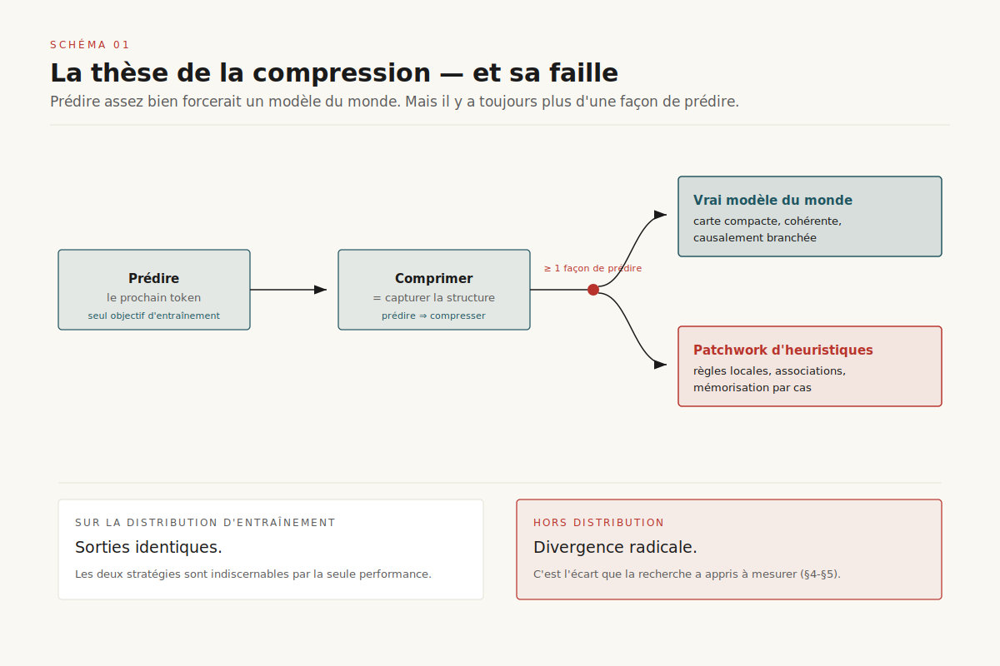
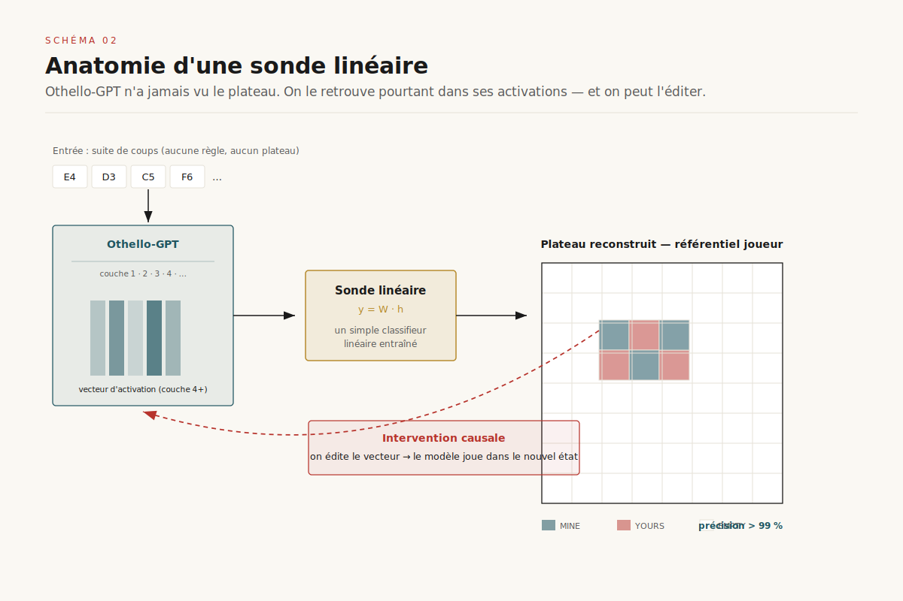
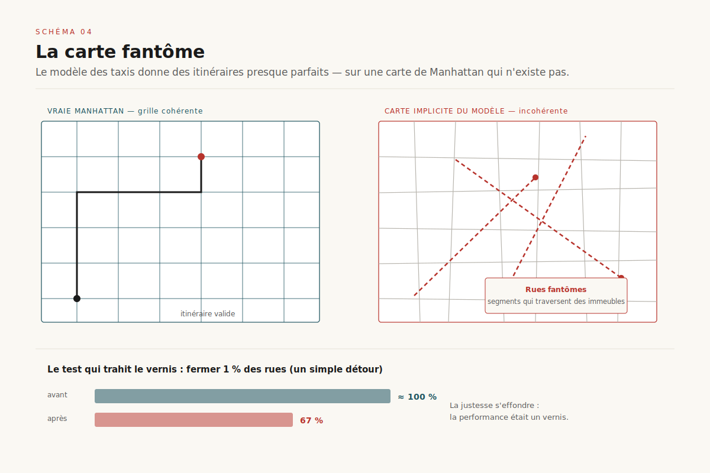
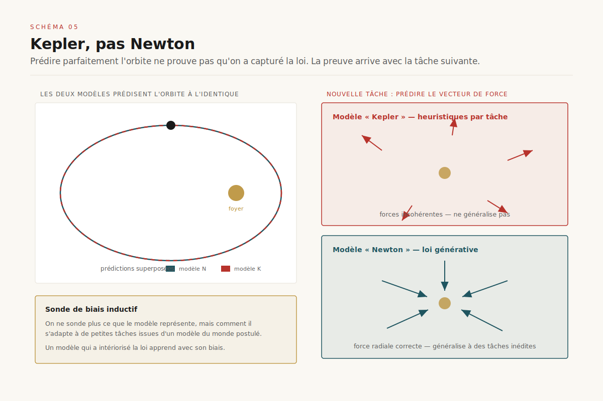
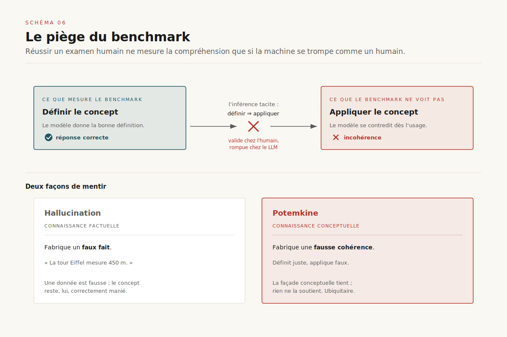
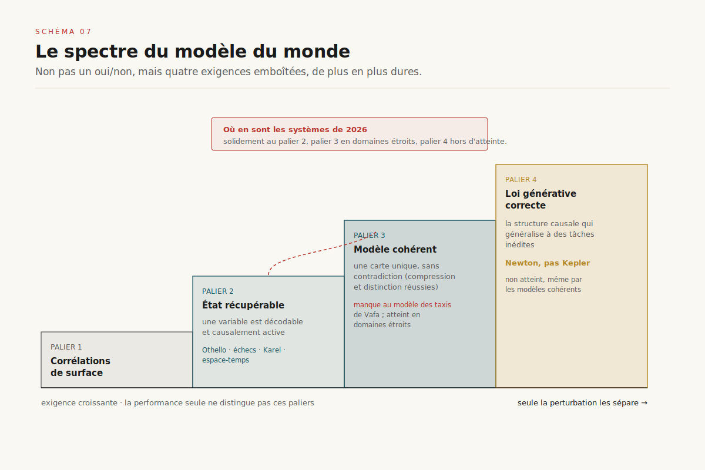

# Le modèle du monde caché dans le prédicteur de tokens

> **Prédire parfaitement le prochain token ne prouve pas qu'on ait induit le monde qui l'a généré. Les sondes montrent que des représentations structurées émergent vraiment — mais un excellent prédicteur peut tout aussi bien reposer sur un patchwork d'heuristiques qui s'effondre hors distribution. « Avoir un modèle du monde » n'est pas binaire : c'est une propriété mesurable, et la mesure sépare la performance de la compréhension.** — 13 juillet 2026, Mathieu Guglielmino

*Deep dive croisant les dossiers [World models](../world-models/) et [Modèles de raisonnement](../modeles-raisonnement/). Là où `world-models` traitait des modèles visuels — JEPA, diffusion, Genie — construits **explicitement** pour simuler une physique, celui-ci pose la question inverse et plus troublante : un prédicteur de séquence entraîné **sans aucune intention de modéliser le monde** en construit-il un par accident ?*

## 1. La question : pourquoi un prédicteur de tokens aurait-il un modèle du monde ?

Un grand modèle de langage n'a qu'un seul objectif d'entraînement : prédire le token suivant. Rien, dans cette tâche, n'exige explicitement qu'il se représente la géographie de Manhattan, l'état d'un échiquier ou les lois de la gravitation. Et pourtant l'intuition qui anime une part entière de la recherche depuis 2022 est la suivante : ==pour prédire assez bien, il faut finir par modéliser le processus qui génère les données==.

C'est la **thèse de la compression**, défendue de longue date par Ilya Sutskever et d'autres : prédire, c'est comprimer ; et comprimer une source au maximum, c'est en capturer la structure générative. Si un modèle prédit sans faute les coups d'une partie d'Othello, la façon la plus économique de le faire n'est-elle pas de se représenter le plateau ? Prédire la fin d'un roman policier suppose de « savoir » qui est le coupable ; prédire la trajectoire d'une planète suppose de « connaître » la mécanique céleste. La performance, poussée assez loin, forcerait l'émergence d'un modèle du monde (schéma 1).

Le problème est que cette thèse a une faille logique. **Il existe toujours plus d'une manière de prédire correctement.** Un modèle peut se représenter fidèlement le processus générateur — un vrai modèle du monde, compact et cohérent. Ou bien il peut mémoriser un immense patchwork de règles locales, d'associations statistiques et d'heuristiques par cas, qui reproduisent le comportement observé sans jamais en capturer la logique sous-jacente. ==Les deux stratégies donnent la même sortie sur la distribution d'entraînement ; elles divergent radicalement dès qu'on sort de cette distribution.== C'est précisément cet écart que la recherche des trois dernières années a appris à mesurer.

Ce rapport suit le fil de ce débat. D'abord les preuves que des modèles du monde émergent réellement (§2-§3). Puis le contre-feu : la démonstration qu'un prédicteur excellent peut n'avoir qu'une carte incohérente du monde (§4-§5). Enfin, pourquoi les benchmarks nous trompent sur cette question (§6), et ce que « avoir un modèle du monde » veut dire une fois qu'on cesse de le traiter comme un oui/non (§7).

## 2. La preuve par la sonde : Othello

Le cas fondateur est délibérément minuscule, pour être irréprochable. En 2022, Kenneth Li et ses coauteurs entraînent un transformeur — *Othello-GPT* — uniquement à prédire le prochain coup légal dans des parties d'Othello, sans jamais lui montrer le plateau ni les règles, rien que des séquences de coups[^1]. La question : le modèle a-t-il, quelque part dans ses activations, reconstruit l'état du plateau qu'aucune donnée ne lui a explicitement fourni ?

La méthode pour le savoir est le **probing** (sondage) : on entraîne un petit classifieur — une *sonde* — à prédire, à partir des activations internes du modèle à un instant donné, une variable du monde qu'on suppose « cachée » là-dedans (ici : chaque case est-elle noire, blanche ou vide ?) (schéma 2).

 Si la sonde y parvient avec une haute précision, c'est que l'information est bien présente et linéairement — ou non — accessible dans la représentation interne.

Li et al. trouvent que oui : l'état du plateau est récupérable. Mais leur sonde initiale devait être **non linéaire** pour bien fonctionner, ce qui laissait planer un doute — une sonde assez puissante peut extraire à peu près n'importe quoi, y compris des motifs que le modèle n'« utilise » pas vraiment. La clarification décisive vient de Neel Nanda en 2023[^2]. Son intuition : le modèle ne se représente pas le plateau en termes absolus « noir/blanc », mais **relativement au joueur dont c'est le tour** — « ma pièce / ta pièce / vide ». Une fois recodée dans ce référentiel {MINE, YOURS, EMPTY}, la représentation devient ==linéairement lisible : une simple sonde linéaire atteint plus de 99 % de précision à partir de la couche 4==.

Ce n'est pas une curiosité de vocabulaire. La linéarité change la portée du résultat, pour deux raisons. D'abord parce qu'une représentation linéaire est celle que le modèle peut réellement lire et exploiter dans ses propres calculs. Ensuite parce qu'elle rend possible l'**intervention causale** : en poussant les activations le long du vecteur de la sonde, on peut *éditer* l'état du plateau que le modèle « croit » voir — et le modèle se met alors à jouer des coups légaux dans le nouvel état, même s'ils étaient illégaux dans l'ancien. La représentation n'est donc pas un épiphénomène décoratif : elle est **causalement branchée** sur les prédictions. Othello-GPT n'a pas mémorisé des séquences ; il tient à jour un modèle de l'état du jeu.

## 3. Le faisceau converge : échecs, programmes, espace-temps

Un jouet synthétique ne prouve rien sur les vrais modèles. La force du dossier « émergence » tient à la convergence d'études indépendantes, dans des domaines de plus en plus réalistes (schéma 3).

**Les échecs.** Adam Karvonen entraîne un modèle sur des transcriptions de parties (notation textuelle brute, aucune règle fournie) et retrouve, par sonde linéaire, l'état de l'échiquier — validé, là encore, par intervention causale : on édite l'état interne, le jeu suit[^3]. Plus frappant : le modèle estime aussi une **variable latente qui n'apparaît nulle part dans le texte**, le niveau des joueurs. En extrayant ce « vecteur de niveau » et en le manipulant, Karvonen fait grimper le taux de victoire du modèle jusqu'à ×2,6. ==Le modèle n'a pas seulement reconstruit le plateau ; il a inféré une propriété du monde — la compétence — pour mieux prédire.==

**Les programmes.** Charles Jin et Martin Rinard entraînent un transformeur sur du code Karel (un langage de navigation en grille), à prédire du texte de programme[^4]. Une sonde extrait, avec une précision qui *croît au fil de l'entraînement*, la sémantique des **états intermédiaires du programme** — l'état de la grille après chaque instruction — alors même que ces états ne figurent jamais dans les données. Autrement dit : le modèle apprend à *interpréter* les programmes au sens formel, pas seulement à en imiter la syntaxe. La compréhension de la sémantique émerge comme sous-produit de la prédiction.

**L'espace et le temps, sur de vrais LLM.** Wes Gurnee et Max Tegmark quittent les jouets : ils sondent les activations de **Llama-2** sur des lieux (villes, monuments, à l'échelle du monde, des États-Unis, de New York) et des dates (personnages historiques, œuvres, titres de presse)[^5]. Ils trouvent des représentations linéaires des coordonnées spatiales et temporelles, robustes aux variations de formulation et **unifiées** entre types d'entités — et isolent même des « neurones d'espace » et « neurones de temps » individuels. Leur conclusion : à mesure que la taille augmente, le modèle n'améliore pas seulement sa prédiction, il **améliore aussi sa modélisation interne du monde**.

Quatre études, quatre domaines, un même signal : ==entraîné seulement à prédire, un transformeur construit spontanément des représentations structurées, linéaires et causalement actives de variables du monde qu'on ne lui a jamais montrées==. Le camp de la compression semble avoir gagné. Sauf que ces études partagent un angle mort.

## 4. Le contre-feu : un excellent prédicteur peut mentir

Toutes les études du §3 démontrent qu'*une partie* du monde est récupérable dans les activations. Aucune ne mesure si le modèle du monde ainsi extrait est **cohérent** — s'il forme une carte unique et sans contradiction, ou une mosaïque de fragments localement corrects mais globalement incompatibles. C'est le vide qu'attaque Keyon Vafa et ses coauteurs à NeurIPS 2024[^6].

Leur cadre : quand la réalité est gouvernée par un automate déterministe (un graphe d'états et de transitions), on peut définir rigoureusement ce que serait le « vrai » modèle du monde, et donc mesurer l'écart. Ils proposent deux métriques inspirées du **théorème de Myhill-Nerode** en théorie des langages (schéma 4) :

- la **compression de séquences** : deux historiques qui aboutissent au *même* état du monde doivent être traités comme équivalents par le modèle. S'il les distingue, il n'a pas compris qu'ils mènent au même endroit.
- la **distinction de séquences** : deux historiques qui aboutissent à des états *différents* doivent être distingués. S'il les confond, il ignore qu'ils divergent.

Un vrai modèle du monde réussit les deux. Un patchwork d'heuristiques peut réussir la tâche de prédiction tout en échouant massivement à l'une ou l'autre.

Le cas d'étude est un uppercut. Les auteurs entraînent un modèle sur des trajectoires de taxis new-yorkais, converties en suites d'ordres directionnels, et il apprend à donner des itinéraires **presque parfaits**. Mais quand on reconstruit la carte de Manhattan implicite dans ses prédictions, ce n'est pas Manhattan : ==c'est une ville impossible, striée de rues fantômes qui n'existent pas, de segments qui traversent des immeubles, d'orientations qui se contredisent==. Le modèle a mémorisé assez de trajets pour paraître compétent, sans jamais tenir de plan cohérent. Et la fragilité se révèle dès qu'on perturbe : **en fermant seulement 1 % des rues** — un détour, chose banale dans la vraie vie — la justesse des itinéraires s'effondre de près de 100 % à 67 %[^6]. La performance était un vernis. Le verdict des auteurs : un modèle génératif peut accomplir des tâches impressionnantes tout en s'appuyant sur un modèle du monde incohérent, et cette incohérence le rend fragile pour toute tâche voisine.

Le probing du §3 et l'évaluation de Vafa ne se contredisent pas : ils mesurent deux choses différentes. **L'état du monde peut être partiellement récupérable *et* la carte globale rester incohérente.** Récupérabilité n'est pas cohérence.

## 5. Kepler, pas Newton

Vafa pousse le raisonnement d'un cran en 2025, avec une question plus exigeante encore : même quand un modèle prédit parfaitement, a-t-il capturé la **loi** qui gouverne le phénomène, ou seulement des régularités de surface suffisantes pour la prédiction ?[^7] L'analogie est astronomique. Kepler a décrit les orbites planétaires avec une précision totale — mais ses lois sont descriptives ; il a fallu Newton pour la *cause*, la gravitation, qui généralise bien au-delà des orbites (schéma 5).

L'outil proposé est la **sonde de biais inductif** (*inductive bias probe*) : plutôt que de sonder ce que le modèle *représente*, on mesure comment il *s'adapte* à de petits jeux de données issus d'un modèle du monde postulé. Un modèle qui a réellement intériorisé la loi devrait apprendre les nouvelles tâches avec le biais de cette loi. Résultat : des modèles entraînés sur des **trajectoires orbitales** les prédisent impeccablement, mais lorsqu'on les adapte à une tâche physique nouvelle — par exemple prédire le vecteur de force — ==ils se comportent comme s'ils avaient développé des heuristiques propres à chaque tâche, sans jamais converger vers la mécanique newtonienne sous-jacente==. Ils sont Kepler, pas Newton. Une étude de suivi de février 2026 raffine le tableau : les biais inductifs de l'architecture et des données *guident* le modèle du monde appris, et déterminent s'il reste au stade descriptif ou bascule vers la loi générative[^8].

Ce résultat déplace la barre. Le §2-§3 montrait : *l'état* du monde est souvent récupérable. Le §4 ajoutait : cet état n'est pas forcément *cohérent* à l'échelle globale. Le §5 conclut : même cohérent, il n'est pas forcément *la bonne loi* — celle qui généralise à des tâches inédites. Trois exigences emboîtées, de plus en plus dures.

## 6. Potemkine : quand le benchmark ment

Reste une objection de bon sens : si ces modèles réussissent nos examens — y compris des examens conçus pour des humains — n'est-ce pas la preuve qu'ils comprennent ? La réponse tient dans un concept forgé par Marina Mancoridis, Keyon Vafa, Sendhil Mullainathan et Bec Weeks en 2025 : le **potemkine** (schéma 6)[^9].

Un village Potemkine est une façade sans bâtiment derrière. Un *potemkine de compréhension*, c'est ==une réponse correcte qui coexiste avec une incapacité à appliquer le concept d'une manière cohérente avec cette réponse==. Le modèle définit correctement un terme, puis se contredit dès qu'il faut l'utiliser. Les auteurs le formulent d'une phrase : *« les potemkines sont à la connaissance conceptuelle ce que les hallucinations sont à la connaissance factuelle — les hallucinations fabriquent de faux faits, les potemkines fabriquent une fausse cohérence conceptuelle. »*

L'argument sur la validité des benchmarks est le cœur du problème. Un examen conçu pour les humains n'est un test valide de la compréhension d'une IA **que si l'IA se trompe de la même façon que les humains**. Chez un humain, savoir définir un concept prédit fortement savoir l'appliquer ; on peut donc économiser en ne testant que la définition. Cette inférence ne tient plus pour un LLM, dont les modes d'échec ne recoupent pas les nôtres. Mesurer la définition surestime alors l'application. Les auteurs montrent que les potemkines sont **ubiquitaires**, à travers modèles, tâches et domaines : la performance benchmark et le modèle du monde sous-jacent sont deux choses distinctes.

C'est le point de rencontre avec la critique de fond portée par Subbarao Kambhampati : les LLM excellent en **récupération approximative** plus qu'en raisonnement ; ce sont, selon sa formule, de « gigantesques mémoires non-véridiques »[^10]. Sa position est plus dure que celle de Vafa — pour lui la planification robuste requiert un vérificateur externe (le cadre *LLM-modulo*) — mais elle converge sur le diagnostic : ne pas lire la fluidité comme une preuve de modèle du monde. Le lien avec le dossier [modèles de raisonnement](../modeles-raisonnement/) est direct : le RLVR récompense la *réponse correcte vérifiable*, pas la cohérence du modèle du monde — d'où le risque, déjà documenté pour les [process reward models](../process-reward-models/), qu'un modèle apprenne à produire le bon résultat par le mauvais chemin.

## 7. Ce que « avoir un modèle du monde » veut dire

La dispute « les LLM ont-ils un modèle du monde ? » est mal posée tant qu'on la traite en oui/non. Les résultats des sections précédentes dessinent en réalité un **spectre mesurable**, une échelle d'exigences emboîtées (schéma 7) :

1. **Corrélations de surface** — le modèle exploite des régularités statistiques sans variable latente structurée. Suffisant pour beaucoup de tâches, indétectable par la seule performance.
2. **État récupérable** — une variable du monde (plateau, échiquier, coordonnées) est linéairement décodable et causalement active dans les activations. C'est ce que prouvent Othello, les échecs, Karel, l'espace-temps de Llama-2.
3. **Modèle cohérent** — l'état récupérable forme une carte unique et sans contradiction, qui passe les tests de compression et de distinction de séquences. C'est ce qui *manque* au modèle des taxis de Vafa.
4. **Loi générative correcte** — le modèle a capturé la structure causale qui généralise à des tâches inédites (Newton, pas Kepler). Le palier que même les modèles cohérents n'atteignent pas encore.

Situés sur cette échelle, les systèmes de 2026 vivent surtout au **palier 2**, atteignent le **palier 3** dans des domaines étroits et bien structurés, et achoppent au **palier 4**. Ce cadrage a trois conséquences pratiques :

- **La sonde devient un instrument d'audit.** Le probing linéaire et l'intervention causale ne sont plus de simples curiosités d'interprétabilité : ce sont des tests de présence d'une variable, mobilisables pour vérifier qu'un système critique se représente bien ce qu'il est censé suivre. Le pont avec l'[observabilité des agents](../observabilite-agents-ia/) est naturel.
- **La robustesse hors-distribution est le vrai test.** La performance sur la distribution d'entraînement ne distingue pas les quatre paliers ; seule la perturbation — fermer 1 % des rues, changer de tâche physique — les sépare. Évaluer un modèle du monde, c'est le sortir de sa zone de confort.
- **Le pont avec `world-models` s'inverse.** Les architectures JEPA, diffusion et Genie construisent *délibérément* un modèle du monde cohérent et prédictif, avec objectifs et représentations pensés pour cela. Les LLM y accèdent *par accident*, sous la pression de la seule prédiction — et plafonnent au palier où l'accident cesse de payer. La question de la prochaine marche n'est peut-être pas « plus d'échelle » mais « quels biais inductifs font passer du palier 3 au palier 4 » — ce que suggère la lignée Kepler→Newton.

Un prédicteur de tokens n'est donc ni la boîte vide des sceptiques ni le petit physicien des enthousiastes. C'est un système qui, pour prédire, construit *juste assez* de monde — et pas un gramme de plus. Toute la difficulté d'ingénierie, et tout l'enjeu d'évaluation des prochaines années, tient dans cet écart entre « assez pour prédire » et « assez pour comprendre ».

## Sources

[^1]: Kenneth Li, Aspen Hopkins, David Bau, Fernanda Viégas, Hanspeter Pfister, Martin Wattenberg, *Emergent World Representations: Exploring a Sequence Model Trained on a Synthetic Task*, ICLR 2023. arXiv:2210.13382.

[^2]: Neel Nanda, Andrew Lee, Martin Wattenberg, *Emergent Linear Representations in World Models of Self-Supervised Sequence Models*, BlackboxNLP @ EMNLP 2023. arXiv:2309.00941 (et le billet « Actually, Othello-GPT Has A Linear Emergent World Representation »).

[^3]: Adam Karvonen, *Emergent World Models and Latent Variable Estimation in Chess-Playing Language Models*, 2024. arXiv:2403.15498.

[^4]: Charles Jin, Martin Rinard, *Emergent Representations of Program Semantics in Language Models Trained on Programs*, ICML 2024. arXiv:2305.11169.

[^5]: Wes Gurnee, Max Tegmark, *Language Models Represent Space and Time*, ICLR 2024. arXiv:2310.02207.

[^6]: Keyon Vafa, Justin Y. Chen, Ashesh Rambachan, Jon Kleinberg, Sendhil Mullainathan, *Evaluating the World Model Implicit in a Generative Model*, NeurIPS 2024 (spotlight). arXiv:2406.03689.

[^7]: Keyon Vafa, Peter G. Chang, Ashesh Rambachan, Sendhil Mullainathan, *What Has a Foundation Model Found? Using Inductive Bias to Probe for World Models*, ICML 2025. arXiv:2507.06952.

[^8]: *From Kepler to Newton: Inductive Biases Guide Learned World Models in Transformers*, 2026. arXiv:2602.06923.

[^9]: Marina Mancoridis, Bec Weeks, Keyon Vafa, Sendhil Mullainathan, *Potemkin Understanding in Large Language Models*, ICML 2025. arXiv:2506.21521.

[^10]: Subbarao Kambhampati, *Can Large Language Models Reason and Plan?*, Annals of the New York Academy of Sciences, 2024. DOI:10.1111/nyas.15125.

[^11]: Minyoung Huh, Brian Cheung, Tongzhou Wang, Phillip Isola, *The Platonic Representation Hypothesis*, ICML 2024. arXiv:2405.07987.

[^12]: MIT News, *Despite its impressive output, generative AI doesn't have a coherent understanding of the world*, 5 novembre 2024 (vulgarisation des travaux de Vafa et al.).
