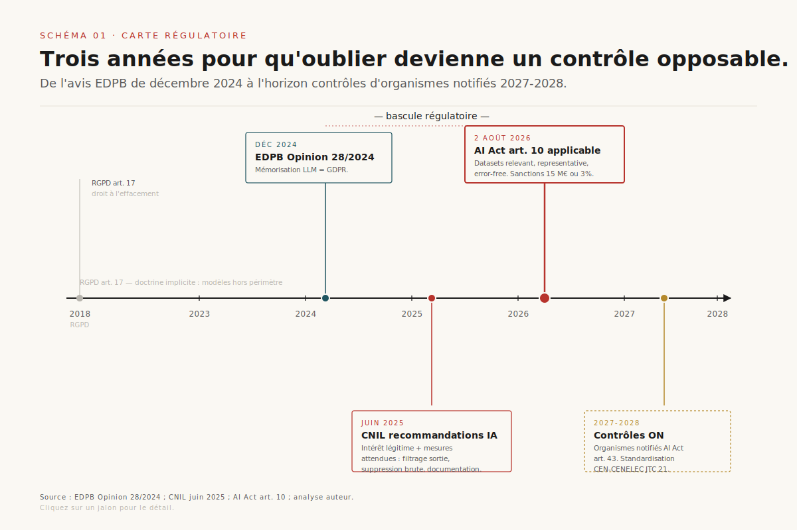
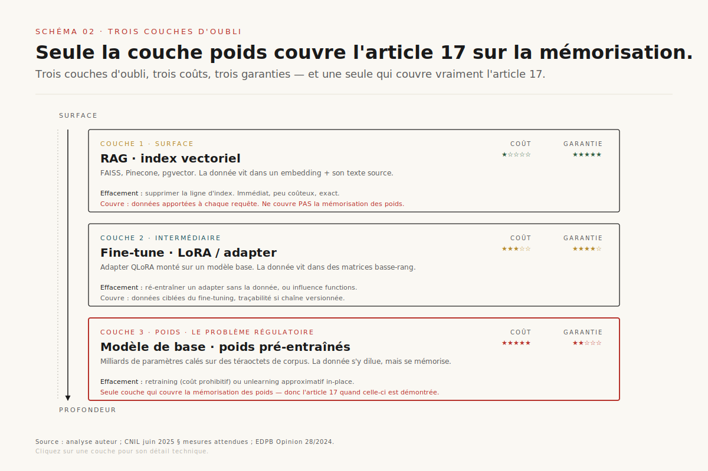
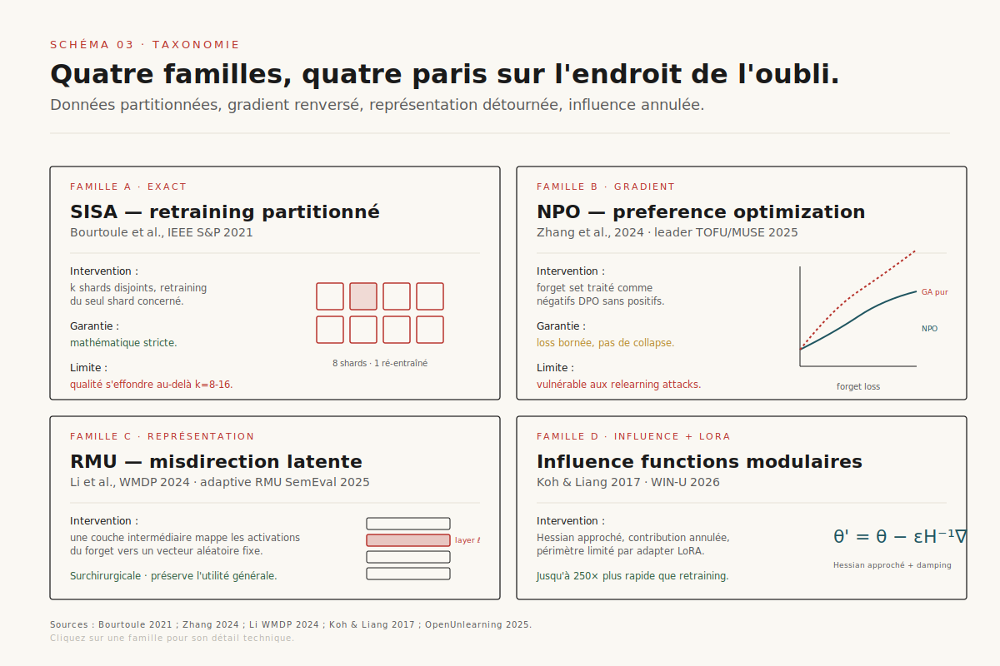
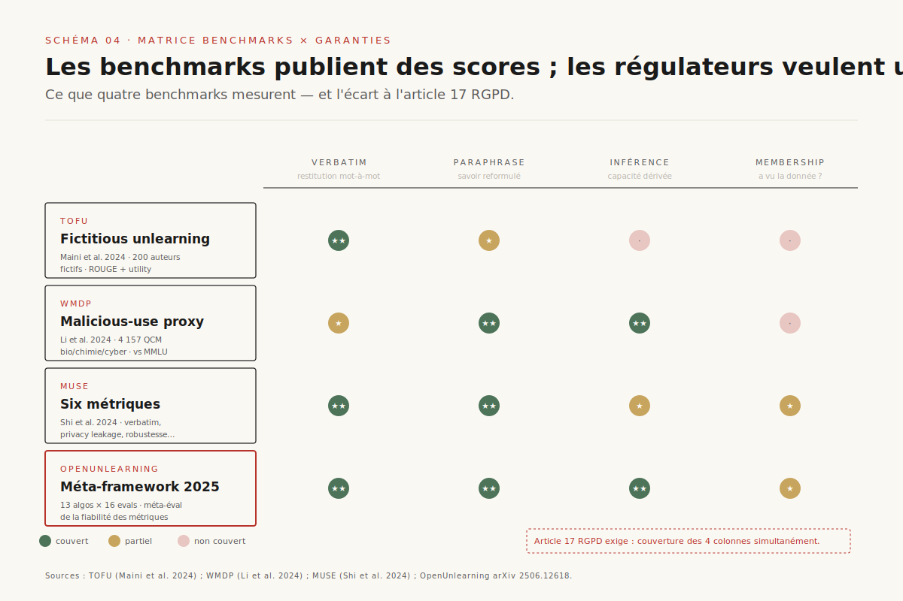

# Machine unlearning — l'oubli prouvable au niveau des poids

> **À partir d'août 2026, l'effacement RGPD article 17 cesse d'être une figure de style appliquée aux modèles d'IA : entre la jurisprudence européenne, l'AI Act article 10 et les recommandations CNIL de juin 2025, les déployeurs doivent désormais prouver qu'un modèle a oublié. Les méthodes 2023-2026 — NPO, RMU, SISA, influence functions — couvrent le besoin opérationnel mais s'effondrent sous les attaques de réveil bénin et les MIA statistiques. L'unlearning devient un sujet d'audit, pas seulement d'ingénierie.** — 3 juin 2026, Mathieu Guglielmino

L'oubli est devenu un objet régulatoire avant d'avoir épuisé son agenda de recherche. La séquence 2024-2026 enchaîne quatre marches institutionnelles — l'avis EDPB de décembre 2024 sur la mémorisation des LLMs[^11], les recommandations CNIL de juin 2025 sur l'intérêt légitime et les mesures attendues[^10], l'AI Act article 10 applicable au 2 août 2026[^12], et la veille EDPS qui classe le *machine unlearning* parmi les technologies émergentes prioritaires. Pendant ce temps, la communauté scientifique a livré quatre familles de méthodes, trois benchmarks de référence et une série d'attaques qui démontrent que la plupart des « oublis » publiés sont superficiels. Ce dossier articule les deux trajectoires.

Le sujet recoupe deux dossiers déjà publiés sur ce site : ==la compaction agentique adresse l'oubli **sélectif** dans le contexte d'une session, là où le *machine unlearning* vise l'oubli **structurel** dans les poids du modèle pré-entraîné==. Les données synthétiques, traitées sous l'angle du *model collapse*, partagent avec l'unlearning une parenté méthodologique inattendue : la dégradation contrôlée par auto-distillation devient ici une primitive d'oubli, pas un bug.

## 1. Pourquoi l'oubli devient un objet régulatoire

Le droit à l'effacement de l'article 17 du RGPD existe depuis 2018, mais sa transposition aux modèles d'IA est restée pendant cinq ans un terrain d'interprétation. La doctrine implicite — un modèle entraîné n'est pas une base de données, donc le droit à l'effacement ne s'y applique pas directement — n'a tenu que tant que les régulateurs n'avaient pas tranché.

L'**EDPB Opinion 28/2024** de décembre 2024 a fermé cette ambiguïté[^11]. Le Comité européen rappelle que les modèles d'IA entraînés sur des données personnelles tombent fréquemment sous le RGPD du fait de leurs capacités de mémorisation : un modèle qui peut restituer verbatim un nom, une adresse ou un numéro de téléphone vu en entraînement contient bien, du point de vue régulatoire, ces données. La conséquence est mécanique : le droit d'effacement s'applique aux poids quand la mémorisation est démontrée.

La **CNIL** a embrayé en juin 2025 avec deux recommandations publiées simultanément[^10]. La première reconnaît l'intérêt légitime comme base juridique la plus probable pour l'entraînement, à condition de respecter un faisceau de mesures préventives — critères de collecte précis, exclusion de catégories sensibles, suppression des données non pertinentes en temps utile. La seconde concerne l'exercice des droits par les personnes concernées. Le passage saillant : ==la CNIL reconnaît explicitement que l'effacement total des données dans les poids d'un modèle n'est pas toujours techniquement faisable==, mais attend en contrepartie des mesures d'atténuation — suppression des données brutes sources, filtrage des sorties pour bloquer la restitution, documentation tracée des mesures prises.

L'**AI Act article 10** entre en application le 2 août 2026 pour les systèmes haut-risque[^12]. Trois exigences structurantes :

- les datasets d'entraînement, validation et test doivent être *relevant*, *representative*, *error-free* et *complete* dans la mesure du possible ;
- le lignage des données (origine, transformations, agrégations) doit être documenté ;
- les biais doivent être identifiés, mesurés, mitigés.

Les sanctions sont calibrées : 15 millions d'euros ou 3 % du chiffre d'affaires mondial pour les violations de gouvernance des données, escalade à 35 millions ou 6 % en cas de non-conformité systémique. La superposition avec le RGPD est inévitable : un système haut-risque devra documenter la lignée *et* être en mesure de retirer une donnée à la demande, ce qui impose une forme d'oubli traçable.

Enfin, l'**EDPS** a inscrit le *machine unlearning* dans son TechSonar comme l'une des technologies émergentes à surveiller pour la conformité institutionnelle. La trajectoire est claire : l'oubli quitte le registre de la *best practice* pour celui du *contrôle*.

## 2. Trois couches d'oubli, et la frontière des poids

Avant de comparer des méthodes, il faut s'accorder sur ce que *oublier* veut dire dans un système IA. La confusion la plus fréquente — y compris dans certaines communications produit — consiste à présenter une purge de retrieval comme un *unlearning*. Elle ne l'est pas.

**Couche 1 — RAG / retrieval.** Une donnée vit dans un index vectoriel (FAISS, Pinecone, pgvector). La supprimer revient à supprimer un *embedding* et son texte source. C'est immédiat, peu coûteux, *exact*. Mais cette couche ne couvre que les données que le modèle ne connaît pas par lui-même — celles qu'on lui *donne* à chaque requête.

**Couche 2 — Fine-tune / adapter.** Une donnée vit dans les poids d'un LoRA ou d'un adapter QLoRA monté sur un modèle base. La supprimer revient à retirer cet adapter et à en ré-entraîner un sans la donnée, ou à recourir à des techniques d'*influence function* pour annuler son effet. Coût modéré, garanties partielles, traçabilité possible si la chaîne d'entraînement est versionnée.

**Couche 3 — Poids du modèle de base.** Une donnée a contribué au gradient descent qui a calé les milliards de paramètres du modèle pré-entraîné. La supprimer suppose soit de rejouer l'entraînement (coût prohibitif, plusieurs millions d'euros pour un modèle 70B), soit d'appliquer une méthode d'unlearning approximative qui modifie les poids in-place. C'est cette couche qui pose le problème réglementaire.

==La distinction load-bearing : seul l'oubli en couche 3 satisfait l'article 17 quand la donnée a été mémorisée par le modèle de base==. Un déployeur qui se contente de purger son RAG en réponse à une demande d'effacement ne couvre pas son obligation si le modèle peut encore restituer la donnée par ses propres moyens — ce qui est fréquemment le cas pour des données issues de corpus publics massifs (web scraping, archives, bases publiques).

## 3. Taxonomie : quatre familles, quatre paris

Le paysage 2024-2026 des méthodes d'unlearning au niveau des poids se structure en quatre familles, distinguées par l'endroit de la stack où elles interviennent[^7].

### Famille A — Exact retraining partitionné : SISA

Bourtoule et al. (IEEE S&P 2021) ont posé le cadre canonique de l'*exact unlearning*[^1]. Le modèle est entraîné sur des shards disjoints : si une donnée doit être supprimée, seul le shard contenant cette donnée est ré-entraîné, puis l'agrégation finale est recalculée. ==Pour AlexNet et VGG-16, SISA réduit le temps de retraining de 62 % et 58 %, au prix d'une perte d'exactitude d'environ 0,4 %==.

Atout : garantie mathématique stricte — la donnée n'a plus contribué au modèle final. Limite : le sharding multiplie la mémoire par k et fait s'effondrer la qualité au-delà de k = 8-16. Inapplicable tel quel aux LLMs frontière de 70B+ paramètres. La recherche 2024-2025 explore des variantes hybrides (SISA + LoRA) mais sans publication de production majeure à ce stade.

### Famille B — Gradient-based : Gradient Ascent et NPO

L'idée : augmenter la *loss* sur le *forget set* tout en préservant la *retain loss*. Le *Gradient Ascent* (GA) pur, le plus naïf, provoque rapidement un *catastrophic collapse* — le modèle se dégrade au-delà du périmètre ciblé.

**Negative Preference Optimization (NPO)** — Zhang et al. 2024[^4] — résout ce collapse en traitant le forget set comme des exemples négatifs dans un cadre DPO sans positifs. L'objectif est borné par construction, et la pondération adaptative des gradients ralentit l'apprentissage pour les samples déjà oubliés. ==NPO est devenu en 2025 le leader des leaderboards TOFU et MUSE==, et constitue aujourd'hui la baseline implicite contre laquelle toute nouvelle méthode est mesurée. Sa simplicité de mise en œuvre (quelques centaines de lignes au-dessus d'un loop DPO standard) explique son adoption rapide en recherche.

### Famille C — Representation engineering : RMU

Li et al. ont publié RMU (*Representation Misdirection for Unlearning*) en accompagnement du benchmark WMDP[^3]. Le principe est mécaniquement différent : à une couche intermédiaire choisie, on entraîne le modèle à mapper les activations des prompts du *forget set* vers un vecteur aléatoire fixe, tout en laissant inchangées les activations des autres prompts.

L'intuition : si le concept à oublier n'a plus de représentation cohérente dans l'espace latent, le modèle ne peut plus le restituer en aval. Variante 2025 : *Adaptive RMU* a obtenu la 4e place au SemEval-2025 task 4 sur l'unlearning factuel. Atout : surchirurgicale, préserve l'utilité générale. Limite : choix de la couche cible empirique, robustesse aux paraphrases discutée.

### Famille D — Influence functions + LoRA adapters

Le retour des *influence functions* de Koh & Liang (2017), revisitées avec damping adaptatif et estimateurs de Hessian approchés. L'approche : estimer la contribution d'un sample au modèle final, puis l'annuler par mise à jour des poids. Combinée à des adapters LoRA pour limiter le périmètre d'intervention, cette famille produit des accélérations spectaculaires — ==jusqu'à 250× plus rapide que le retraining sur des systèmes de recommandation==.

Une publication récente (*WIN-U*, arXiv 2604.13438) propose un cadre Newton-Woodbury *retain-free* qui démontre une robustesse supérieure aux *relearning attacks* face à NPO et RMU. C'est la famille la plus modulaire et la plus prometteuse en termes de ratio coût/qualité, mais aussi la moins mature en production.

## 4. La barre de preuve : benchmarks, métriques, et leurs limites

Trois benchmarks structurent l'évaluation académique de l'unlearning des LLMs.

**TOFU** (Maini et al. 2024)[^2] — 200 auteurs fictifs, 4 000 questions générées sur leurs « biographies ». Le modèle est fine-tuné sur ces données puis on lui demande d'en oublier une fraction. Métriques : *forget quality* (ROUGE, probabilités), *model utility* (préservation des capacités générales). C'est le bench le plus joué de 2024-2026.

**WMDP** (Li et al. 2024)[^3] — 4 157 questions à choix multiples sur les armes (chimiques, biologiques, cyber). Le modèle doit oublier les connaissances dangereuses sans perdre ses capacités générales mesurées par MMLU. Sert de proxy pour la mitigation de malveillance.

**MUSE** (Shi et al. 2024) — six métriques (mémorisation verbatim, paraphrase, privacy leakage, utilité, robustesse, équité), conçues pour mesurer l'écart résiduel entre modèle unlearned et modèle ré-entraîné from scratch.

**OpenUnlearning** (2025, arXiv 2506.12618)[^7] consolide ces trois benchmarks dans un framework unifié — 13 algorithmes × 16 évaluations — avec une couche méta-évaluation qui mesure la fiabilité des métriques elles-mêmes. C'est l'état de l'art 2025 pour comparer rigoureusement deux méthodes d'unlearning.

Le problème — celui que les régulateurs vont devoir trancher — est l'écart entre ce que ces benchmarks mesurent et ce que l'article 17 RGPD exige. ==Un score TOFU de 0,95 ne dit pas qu'un attaquant ne peut pas récupérer 60 % de la donnée par prompts adversaires==. La section suivante détaille cette faille.

## 5. La faille structurelle — pourquoi les méthodes actuelles n'oublient pas vraiment

Deux publications 2025 ont fait basculer le discours communautaire de l'optimisme méthodologique vers la prudence régulatoire.

[SCHEMA-05]

**Łucki et al., ICLR 2025** — *Machine Unlearning Fails to Remove Data Poisoning Attacks*[^5]. Les auteurs construisent un cadre d'évaluation adversaire (REBEL) qui utilise des *prompts évolutionnaires* pour sonder le modèle après unlearning. Le résultat est brutal : ==REBEL récupère jusqu'à 60 % du savoir TOFU « oublié » et 93 % du savoir WMDP==, sur des modèles ayant publié des scores forget quality > 0,9 par les méthodes standards. Même l'*exact unlearning* par retraining est vulnérable à des « difference attacks » qui comparent les sorties pré- et post-suppression.

**Hu et al., CMU 2025** — *Jogging the Memory of Unlearned LLMs via Benign Relearning*[^6]. Les auteurs montrent qu'un *fine-tuning* sur une petite quantité de données loosely related suffit à « réveiller » le savoir prétendument oublié. Exemple frappant : un modèle ayant prétendument oublié les connaissances WMDP sur les bio-armes, ré-entraîné sur des **articles médicaux publics**, restitue le savoir dangereux. Un modèle ayant oublié *Harry Potter*, ré-exposé à un résumé Wikipedia, restitue verbatim des passages mémorisés.

Côté audit, deux développements changent la donne :

- **Statistical MIA (SMIA)** — arXiv 2602.01150[^9] — propose un test statistique training-free qui compare les distributions de samples membres et non-membres post-unlearning. ==SMIA fournit à la fois un *forgetting rate* et un intervalle de confiance — première métrique avec garantie quantifiable==, défendable devant un régulateur.
- **Apollo** (arXiv 2506.09923) — une MIA *label-only* a posteriori spécifiquement conçue pour les modèles ayant subi un unlearning. Elle démontre qu'on peut détecter qu'une donnée a été *présente* dans le training set d'origine, même après un effacement déclaré.

L'enchaînement est gênant. Une méthode qui passe TOFU à 0,95 peut perdre 93 % de son oubli sous REBEL, et un audit MIA peut malgré tout détecter la donnée. Les déployeurs IA doivent donc choisir entre trois postures : (a) accepter cette faille et documenter sa portée auprès du régulateur, (b) ajouter une couche de défense post-hoc (distillation, filtrage), (c) renoncer à l'unlearning approximatif et budgéter le retraining complet pour les cas critiques.

## 6. Vers l'oubli prouvable : distillation, certification, pipeline d'audit

La voie de sortie communautaire qui se dessine en 2025-2026 ne consiste pas à inventer une cinquième famille de méthodes, mais à *robustifier* les méthodes existantes par une couche d'ingénierie de pipeline.

[SCHEMA-06]

**Distillation Robustifies Unlearning** (arXiv 2506.06278)[^8] est la publication-pivot. L'idée : après avoir appliqué NPO ou RMU, on distille un *student* depuis ce modèle *teacher* unlearned. Le student, n'ayant jamais vu la donnée d'origine, hérite d'une représentation déjà partiellement « oubliée » et résiste mieux aux relearning attacks. C'est une réutilisation élégante du *model collapse* — la dégradation par auto-distillation devient une primitive constructive d'oubli, comme l'a théorisé une publication arXiv 2507.04219 (« Model Collapse Is Not a Bug but a Feature in Machine Unlearning »).

Le pipeline d'audit canonique qui en découle s'articule en cinq étapes :

1. **Identification du forget set** — quelles données, quels critères de sélection, traçabilité versionnée.
2. **Unlearning** — application d'une famille (NPO, RMU, SISA-LoRA) calibrée sur le périmètre.
3. **Audit SMIA** — test statistique training-free avec rapport CI sur le *forgetting rate*.
4. **Relearning probe** — fine-tune adversaire sur données *loosely related* (style Hu et al.), mesure de la résilience.
5. **Distillation et certification** — distillation d'un student, re-audit, livrable conformité (rapport, hash du modèle, métriques).

La question ouverte : quelle reconnaissance par la CNIL et les organismes notifiés AI Act ? L'article 43 de l'AI Act impose des procédures d'évaluation de la conformité pour les systèmes haut-risque, mais ne mentionne pas explicitement l'unlearning. Le travail de standardisation côté CEN-CENELEC JTC 21 (groupe de travail Machine Learning) pourrait ancrer ce pipeline dans une norme harmonisée vers 2027-2028.

## 7. Trajectoires 2026-2028

Le passage de l'unlearning de l'objet de recherche à l'objet d'ingénierie réglementée n'est plus une projection : il est entamé. Quatre scénarios prospectifs structurent les 24-36 prochains mois.

**(a) Retrain-free certifié sous accréditation.** La voie réglementaire la plus probable. Un cadre méthodologique (probablement dérivé d'OpenUnlearning + SMIA + distillation) est consolidé par un travail conjoint EDPB-CNIL-organismes notifiés. Les déployeurs IA haut-risque doivent produire un dossier de conformité d'unlearning à chaque demande d'effacement majeure. Horizon : 2027.

**(b) Distillation robustifies devient pipeline standard.** Les frameworks open-source (vLLM, SGLang, voire Hugging Face TRL) intègrent une primitive d'unlearning-then-distill. Le coût marginal d'une opération d'oubli baisse d'un ordre de grandeur. Horizon : 2026 fin / 2027 début.

**(c) Oubli au niveau des poids exigé pour les systèmes haut-risque.** Dans le sillage d'une décision contraignante d'une autorité européenne (probablement CNIL ou Garante italienne), l'oubli purement RAG devient insuffisant pour les systèmes traitant des données personnelles sensibles. ==L'unlearning au niveau des poids passe du « bon à faire » au « obligation contractuelle » pour les contrats publics et bancaires==. Horizon : 2026-2027.

**(d) Émergence d'unlearning-as-a-service.** Un marché spécialisé apparaît, calqué sur le marché de l'évaluation tierce des LLMs. Des cabinets indépendants (ou la branche audit des cabinets conseil existants) certifient l'oubli pour le compte des déployeurs, contre rapport opposable. Horizon : 2027-2028.

Les implications pour les déployeurs IA en France et UE en 2026 sont concrètes. Premièrement, intégrer un *registre des demandes d'effacement* dans le data governance stack — il sera demandé en audit. Deuxièmement, documenter à l'avance la stratégie d'oubli par niveau de criticité (RAG-only / fine-tune / poids). Troisièmement, budgéter les opérations d'unlearning dans le coût total de possession — ==pour un modèle base 13-30B, un cycle complet unlearn+distill+audit peut dépasser le coût d'un mois d'inférence en production==. Quatrièmement, choisir des fournisseurs de modèles base qui exposent une API d'unlearning ou qui ont publié leur stratégie sur le sujet.

L'oubli prouvable a longtemps été une figure de style. En 2026, c'est un *contrôle*.

---

## Sources

[^1]: Bourtoule, L., Chandrasekaran, V., Choquette-Choo, C. A., et al. *Machine Unlearning*. IEEE Symposium on Security and Privacy, 2021. [arxiv.org/abs/1912.03817](https://arxiv.org/abs/1912.03817)

[^2]: Maini, P., Feng, Z., Schwarzschild, A., Lipton, Z. C., Kolter, J. Z. *TOFU: A Task of Fictitious Unlearning for LLMs*. arXiv:2401.06121, 2024. [arxiv.org/abs/2401.06121](https://arxiv.org/abs/2401.06121)

[^3]: Li, N., Pan, A., Gopal, A., et al. *The WMDP Benchmark: Measuring and Reducing Malicious Use With Unlearning*. arXiv:2403.03218, 2024. [arxiv.org/abs/2403.03218](https://arxiv.org/abs/2403.03218)

[^4]: Zhang, R., Lin, L., Bai, Y., Mei, S. *Negative Preference Optimization: From Catastrophic Collapse to Effective Unlearning*. arXiv:2404.05868, 2024. [arxiv.org/abs/2404.05868](https://arxiv.org/abs/2404.05868)

[^5]: Łucki, J., Wei, B., Huang, Y., et al. *An Adversarial Perspective on Machine Unlearning for AI Safety*. ICLR 2025. [proceedings.iclr.cc](https://proceedings.iclr.cc/paper_files/paper/2025/file/7e810b2c75d69be186cadd2fe3febeab-Paper-Conference.pdf)

[^6]: Hu, S., Fu, Y., Wu, S., Smith, V. *Unlearning or Obfuscating? Jogging the Memory of Unlearned LLMs via Benign Relearning*. CMU Machine Learning Blog, mai 2025. [blog.ml.cmu.edu](https://blog.ml.cmu.edu/2025/05/22/unlearning-or-obfuscating-jogging-the-memory-of-unlearned-llms-via-benign-relearning/)

[^7]: Dorna, V., Gupta, A., Jagielski, M., et al. *OpenUnlearning: Accelerating LLM Unlearning via Unified Benchmarking of Methods and Metrics*. arXiv:2506.12618, 2025. [arxiv.org/abs/2506.12618](https://arxiv.org/abs/2506.12618)

[^8]: *Distillation Robustifies Unlearning*. arXiv:2506.06278, 2025. [arxiv.org/abs/2506.06278](https://arxiv.org/abs/2506.06278)

[^9]: *Statistical MIA: Rethinking Membership Inference Attack for Reliable Unlearning Auditing*. arXiv:2602.01150, 2025. [arxiv.org/abs/2602.01150](https://arxiv.org/abs/2602.01150)

[^10]: CNIL. *AI system development: CNIL's recommendations to comply with the GDPR*. Juin 2025. [cnil.fr](https://www.cnil.fr/en/ai-system-development-cnils-recommendations-to-comply-gdpr)

[^11]: European Data Protection Board. *Opinion 28/2024 on certain data protection aspects related to the processing of personal data in the context of AI models*. Décembre 2024. [edpb.europa.eu](https://www.edpb.europa.eu/our-work-tools/our-documents/opinion-board-art-64/opinion-282024-certain-data-protection-aspects_en)

[^12]: European Union. *Artificial Intelligence Act, Article 10 — Data and Data Governance*. Application 2 août 2026. [artificialintelligenceact.eu/article/10](https://artificialintelligenceact.eu/article/10/)
