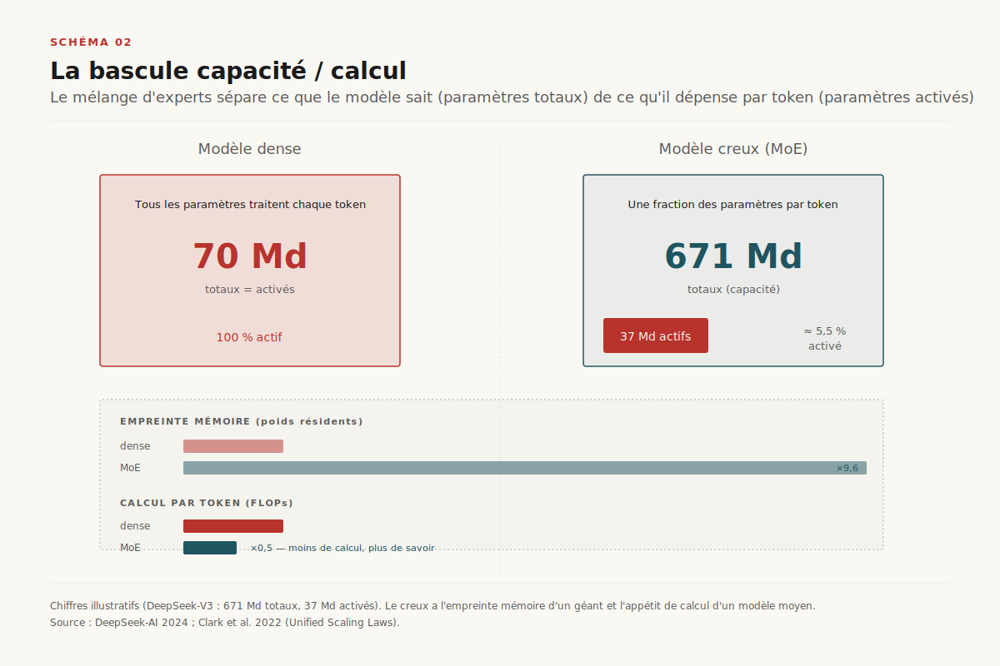
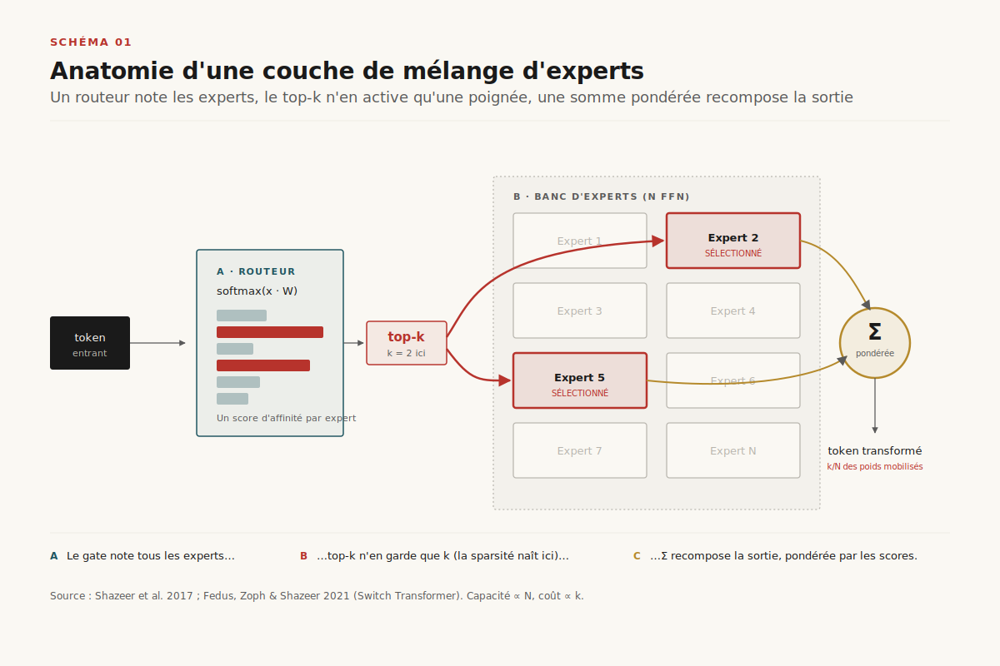
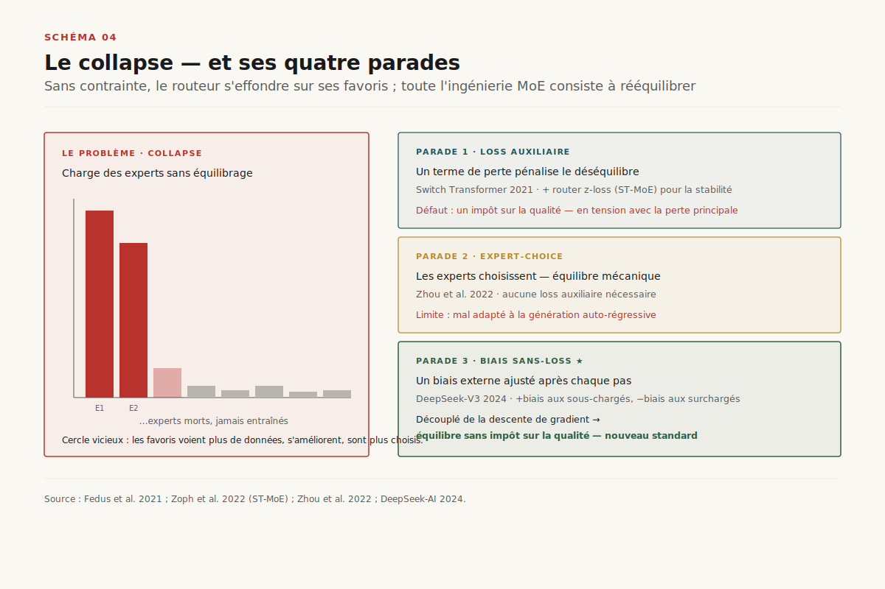
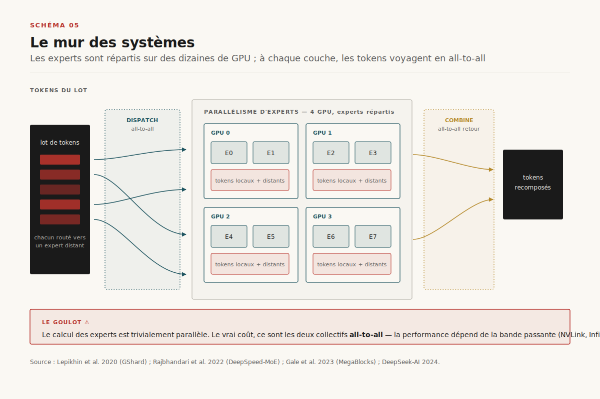
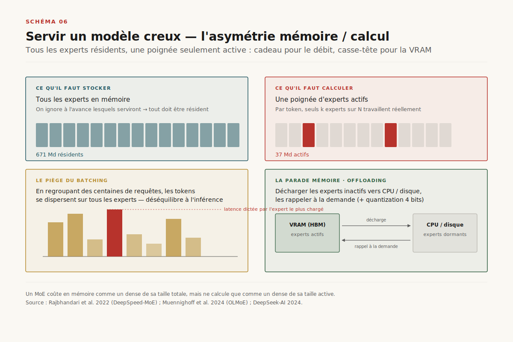
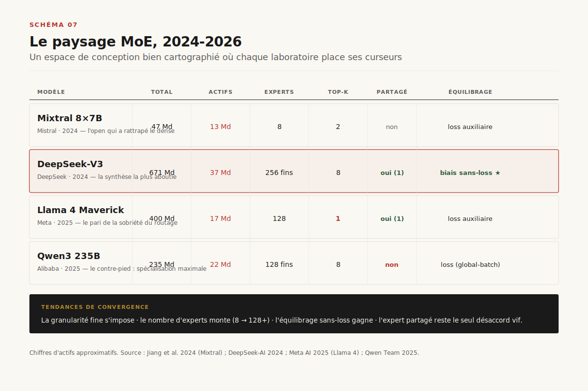

# Le mélange d'experts

> **Le mélange d'experts découple la capacité d'un modèle de son coût de calcul — mais il ne supprime pas la difficulté : il la déplace de l'architecture vers les systèmes distribués.** — 3 juillet 2026, Mathieu Guglielmino

Pendant presque une décennie, l'architecture des grands modèles de langage a obéi à un dogme simple : *chaque paramètre traite chaque token*. Un transformer dense de 70 milliards de paramètres mobilise ses 70 milliards de poids pour produire chaque mot, qu'il s'agisse de conjuguer un verbe ou de résoudre une intégrale. Cette uniformité a une conséquence économique brutale : la capacité (ce que le modèle *sait*) et le coût (ce qu'il *dépense* par token) sont soudés. Vouloir plus de connaissance, c'est payer plus de calcul, linéairement, sans échappatoire.

Le mélange d'experts — *Mixture of Experts*, MoE — est le levier qui brise cette soudure. L'idée, formalisée à l'échelle moderne par Noam Shazeer et ses collègues en 2017[^1], tient en une phrase : remplacer une grosse couche dense par un *banc* de sous-réseaux spécialisés, les experts, et n'en activer qu'une poignée pour chaque token. Un modèle peut alors porter 671 milliards de paramètres tout en n'en calculant que 37 milliards à la fois — c'est exactement le profil de DeepSeek-V3[^11]. La capacité gonfle ; le calcul reste sobre.

==Mais le mélange d'experts ne fait pas disparaître la difficulté ; il la déplace.== Là où le modèle dense n'avait qu'un problème d'algèbre linéaire, le modèle creux hérite de trois problèmes nouveaux, tous vicieux : *qui* décide quel token va à quel expert (le routage), *comment* empêcher le routeur de s'effondrer sur ses favoris (l'équilibrage de charge), et *où* placer physiquement des experts qui ne tiennent plus sur une seule puce (le parallélisme d'experts). Le troisième est décisif : à grande échelle, un modèle MoE cesse d'être un objet d'architecture pour devenir un objet de systèmes distribués, gouverné par la topologie du réseau autant que par la fonction de perte. Ce rapport suit cette bascule, de la couche élémentaire jusqu'aux modèles de frontière de 2026.

## 1. La bascule capacité / calcul

L'intuition creuse est ancienne — les mélanges d'experts remontent à Jacobs et Hinton en 1991 — mais elle est restée marginale jusqu'à ce que Shazeer et al. la rendent opérationnelle pour les réseaux de très grande taille[^1]. Leur couche « creusement activée » (*sparsely-gated*) insère, entre deux couches d'un réseau, jusqu'à des milliers d'experts, et un *réseau de gating* qui, pour chaque exemple, en sélectionne seulement deux ou quatre. Le résultat : des modèles de plusieurs dizaines de milliards de paramètres — colossaux pour 2017 — entraînés pour un coût de calcul comparable à celui de modèles bien plus petits.

L'argument théorique qui a scellé la légitimité de MoE est venu de DeepMind en 2022. Dans *Unified Scaling Laws for Routed Language Models*[^6], Aidan Clark et ses collègues montrent que le routage confère un gain de performance qui persiste sur trois ordres de grandeur de taille de modèle : ==à budget de calcul fixé, un modèle routé bat systématiquement le modèle dense de même coût==, et l'écart ne se referme qu'à des tailles extrêmes. Autrement dit, la sparsité n'est pas une astuce d'ingénierie marginale : c'est une dimension de scaling à part entière, orthogonale à l'augmentation classique de la taille et des données.

Le point de bascule industriel est venu plus tard. En 2024, Mistral publie Mixtral 8×7B[^9], un MoE ouvert de 47 milliards de paramètres au total mais ne mobilisant que ~13 milliards par token, qui égale ou dépasse un modèle dense de 70 milliards (Llama 2 70B) tout en étant six fois moins cher à l'inférence. Le signal est reçu : en dix-huit mois, la quasi-totalité des architectures de frontière bascule. DeepSeek-V3 (671B/37B)[^11], Llama 4[^13], Qwen3[^14], Grok, et les modèles fermés de la plupart des grands laboratoires adoptent le mélange d'experts. Le dense n'a pas disparu — il reste préférable pour les petits modèles *edge* où la mémoire prime — mais au sommet de l'échelle, ==le mélange d'experts est devenu l'architecture par défaut de la frontière==.

## 2. Anatomie d'une couche MoE

Concrètement, une couche MoE remplace le bloc *feed-forward* (FFN) d'un transformer — la partie qui, dans un modèle dense, contient l'essentiel des paramètres. Là où le bloc dense applique une seule grosse transformation, la couche MoE offre le choix entre plusieurs FFN plus petites, les experts, et confie à un *routeur* la décision d'aiguillage.

Le mécanisme se décompose en quatre temps. D'abord, le **routeur** (ou *gate*) : un simple produit matriciel suivi d'un softmax qui, pour le token entrant, attribue un score d'affinité à chacun des *N* experts. Ensuite, la sélection **top-k** : on ne garde que les *k* experts de plus haut score (typiquement *k* = 1, 2 ou 8), les autres sont ignorés — c'est ici que naît la sparsité. Puis le **calcul** : les *k* experts retenus traitent le token en parallèle. Enfin la **combinaison** : leurs sorties sont sommées, pondérées par les scores de gating renormalisés. Le token ressort transformé, mais n'a mobilisé qu'une fraction *k/N* des paramètres experts de la couche.

Deux quantités gouvernent tout le reste. Le nombre d'experts *N* fixe la capacité (plus d'experts = plus de paramètres stockés) ; le nombre d'activés *k* fixe le coût (plus d'activés = plus de calcul). Un troisième paramètre, le **facteur de capacité**, borne le nombre de tokens qu'un expert accepte par lot : au-delà, les tokens excédentaires sont *droppés* — ils sautent la couche via la connexion résiduelle, ce qui dégrade silencieusement la qualité. Toute l'ingénierie MoE consiste à naviguer ce triangle : maximiser *N*, minimiser *k*, et éviter que le facteur de capacité ne devienne une guillotine.

## 3. Le problème du routage

Le routeur est le cœur battant — et le talon d'Achille — d'un modèle creux. Sa conception se décline sur plusieurs axes, dont les combinaisons dessinent la diversité des architectures actuelles.

**Token-choice contre expert-choice.** Le schéma canonique est le *token-choice* : chaque token choisit ses *k* experts. C'est intuitif, mais rien ne garantit que la charge se répartisse — un expert populaire peut être submergé pendant qu'un autre chôme. En 2022, Zhou et al. proposent l'inversion : l'*expert-choice*[^5]. Ce sont les experts qui choisissent, chacun sélectionnant les tokens de plus haut score jusqu'à remplir sa capacité. L'équilibre devient garanti *par construction* — aucun expert n'est sur- ou sous-chargé — au prix d'une bizarrerie : certains tokens peuvent être traités par zéro expert, d'autres par plusieurs.

**Top-1 contre top-k.** Le Switch Transformer de Google[^3] a fait le pari radical du top-1 : un seul expert par token. La logique est de maximiser le nombre d'experts à budget de calcul égal, ce qui simplifie le routage et le rend moins coûteux en communication. Llama 4 reprend ce choix en 2025[^13]. À l'opposé, Mixtral utilise top-2[^9] et Qwen3 monte jusqu'à top-8 parmi 128 experts[^14], pariant qu'un mélange plus riche de spécialistes vaut le surcoût.

**Experts fins et experts partagés.** L'innovation de DeepSeekMoE[^10] a été double. D'abord, la *granularité fine* : au lieu de quelques gros experts, en découper beaucoup de petits, ce qui multiplie les combinaisons possibles (choisir 8 experts parmi 256 offre bien plus de spécialisations que 2 parmi 8) et permet une spécialisation plus nette. Ensuite, l'*expert partagé* : réserver un ou deux experts toujours actifs, chargés de capturer les connaissances communes, pendant que les experts routés se spécialisent sur le résiduel. ==La spécialisation des experts n'est pas décrétée : elle émerge de la structure du routage.== Ce couple — experts fins + experts partagés — est devenu la recette dominante, adoptée par DeepSeek-V3, même si Qwen3 a fait le choix inverse d'abandonner l'expert partagé[^14], pariant sur une spécialisation maximale.

## 4. L'équilibrage de charge — le collapse et ses parades

Laissé libre, un routeur token-choice s'effondre. C'est le **collapse** : dès l'entraînement, un cercle vicieux s'installe — les experts que le routeur privilégie s'améliorent plus vite (ils voient plus de données), donc le routeur les privilégie davantage, jusqu'à ce qu'une poignée d'experts absorbe tout le trafic et que les autres, jamais entraînés, deviennent des paramètres morts. Le modèle porte alors le coût mémoire de centaines d'experts sans en tirer la capacité. L'histoire de l'ingénierie MoE est en grande partie l'histoire des parades à ce collapse.

**La loss auxiliaire.** La première parade, popularisée par Switch[^3], ajoute à la fonction de perte un terme qui pénalise le déséquilibre : il pousse le routeur à répartir les tokens uniformément. Efficace, mais avec un défaut structurel — cette perte auxiliaire est en tension avec la perte principale (la qualité de prédiction). On force l'équilibre au détriment, léger mais réel, de la performance. ==Toute loss auxiliaire d'équilibrage est un impôt sur la qualité du modèle.==

**Le router z-loss.** ST-MoE[^4] ajoute un second terme, le *z-loss*, qui pénalise les logits de routage trop grands. Ce n'est pas directement de l'équilibrage mais de la stabilisation : les grands logits provoquent des instabilités numériques (le principal fléau de l'entraînement MoE à grande échelle). ST-MoE a rendu les MoE *entraînables de façon fiable et transférables* — une contribution moins spectaculaire mais décisive pour l'adoption industrielle.

**L'expert-choice.** Comme vu, l'expert-choice[^5] rend la loss auxiliaire inutile : l'équilibre est mécanique. C'est élégant, mais mal adapté à la génération auto-régressive (un expert ne peut pas choisir un token futur qu'il n'a pas encore vu), ce qui a limité son adoption dans les LLM décodeurs.

**Le biais sans-loss.** L'innovation la plus récente et la plus commentée vient de DeepSeek-V3[^11]. Plutôt qu'une loss auxiliaire qui pollue le gradient, il ajoute un *biais* aux scores d'affinité, ajusté après chaque pas d'entraînement : on incrémente le biais des experts sous-chargés, on décrémente celui des surchargés. L'équilibrage devient un contrôleur externe, découplé de la descente de gradient — donc sans impôt sur la qualité. Cette stratégie *auxiliary-loss-free*[^11] est en train de devenir un nouveau standard, précisément parce qu'elle résout la tension fondatrice entre équilibre et performance.

## 5. Le mur des systèmes

Voici la bascule annoncée. Tant que les experts tiennent sur une seule puce, MoE reste un objet d'architecture. Mais un modèle de 671 milliards de paramètres ne tient sur aucun GPU existant. Les experts doivent être *répartis* — placés sur des dizaines, voire des centaines d'accélérateurs. C'est le **parallélisme d'experts** (*expert parallelism*), formalisé par GShard[^2] : chaque GPU héberge un sous-ensemble d'experts.

Le problème, c'est que le routeur, lui, est global. Un token calculé sur le GPU 3 peut être routé vers un expert résidant sur le GPU 47. Il faut donc, à chaque couche MoE, une double chorégraphie de communication : un **all-to-all dispatch** qui envoie chaque token vers le ou les GPU hébergeant ses experts, puis, après calcul, un **all-to-all combine** qui rapatrie les résultats. Ces deux collectifs all-to-all sont, à grande échelle, le véritable goulot d'étranglement — pas le calcul des experts, qui est trivialement parallèle. ==Dans un MoE distribué, ce n'est plus le calcul qui coûte, c'est le déplacement des tokens entre GPU.== La performance dépend alors de la bande passante de l'interconnexion (NVLink, InfiniBand) autant que de la puissance de calcul brute.

Deux lignées de travaux ont attaqué ce mur. Côté systèmes de service, DeepSpeed-MoE[^7] a industrialisé la combinaison des parallélismes — expert, tenseur, données — et introduit des optimisations d'inférence dédiées, réduisant la latence et le coût des MoE en production. Côté noyaux de calcul, MegaBlocks[^8] a reformulé la couche MoE comme une multiplication *block-sparse*, éliminant le compromis honteux du token dropping : jusque-là, pour garder des tenseurs de forme régulière, on jetait les tokens excédentaires ; MegaBlocks permet de tout traiter sans gaspillage ni perte, en exploitant des noyaux GPU spécialisés. C'est l'illustration parfaite de la thèse : ==le progrès des MoE de frontière s'est joué autant dans les noyaux CUDA et la topologie réseau que dans la conception du routeur.==

DeepSeek-V3 pousse cette logique jusqu'à la co-conception matériel-modèle : son entraînement mobilise une communication all-to-all optimisée à la main sur l'interconnexion disponible, et une contrainte de routage limitant le nombre de nœuds qu'un token peut traverser — un choix d'architecture dicté directement par la topologie du cluster[^11]. L'architecture du modèle et l'architecture de la machine ne sont plus séparables.

## 6. Servir un modèle creux — l'asymétrie mémoire / calcul

Le mélange d'experts crée, à l'inférence, une asymétrie déroutante entre ce qu'il faut *stocker* et ce qu'il faut *calculer*.

Côté **mémoire**, tous les experts doivent être résidents : on ne sait pas à l'avance lesquels seront sollicités, donc les 671 milliards de paramètres de DeepSeek-V3 doivent tenir en VRAM (ou être prêts à y être chargés). Côté **calcul**, seuls les 37 milliards actifs travaillent par token. Le modèle creux a donc l'empreinte mémoire d'un géant et l'appétit de calcul d'un modèle moyen. ==Un MoE coûte en mémoire ce qu'un modèle dense de sa taille totale coûterait, mais ne calcule que comme un dense de sa taille active.== C'est un cadeau pour le débit (*throughput*) et une malédiction pour la mémoire.

Le batching complique encore le tableau. Sur une requête isolée, top-1 ou top-2 mobilise peu d'experts — efficace. Mais dès qu'on regroupe des centaines de requêtes pour saturer le GPU, les tokens du lot se dispersent sur *tous* les experts, et le déséquilibre de charge ressurgit à l'inférence : certains experts reçoivent des rafales, d'autres restent oisifs, et la latence est dictée par l'expert le plus chargé. Les serveurs modernes (vLLM, SGLang, TensorRT-LLM) déploient un arsenal — regroupement des tokens par expert, noyaux *grouped GEMM*, placement adaptatif — pour lisser ce déséquilibre.

Enfin, quand la VRAM manque, une famille de techniques *offloade* les experts inactifs vers la mémoire CPU ou le disque, les rappelant à la demande — au prix d'une latence supplémentaire. Combinée à la quantization (stocker les experts en 4 bits plutôt que 16), cette approche permet de faire tourner des MoE massifs sur du matériel modeste, transformant l'asymétrie mémoire/calcul en levier de déploiement plutôt qu'en obstacle. OLMoE[^12], en publiant l'intégralité de sa recette (données, code, checkpoints), a rendu ces arbitrages inspectables et reproductibles pour la communauté.

## 7. Le paysage 2024-2026

En deux ans, les choix d'architecture MoE ont convergé — non vers l'uniformité, mais vers un espace de conception bien cartographié où chaque laboratoire place ses curseurs.

**Mixtral 8×7B** (Mistral, 2024)[^9] est le jalon fondateur de l'ère ouverte : 8 experts, top-2, granularité grossière, pas d'expert partagé. Sa vertu fut de *prouver* qu'un MoE ouvert pouvait égaler un dense de référence, déclenchant la vague.

**DeepSeek-V3** (2024)[^11] incarne la synthèse la plus aboutie : 671B au total, 37B actifs, 256 experts routés fins + 1 expert partagé, équilibrage sans-loss par biais, co-conçu avec l'interconnexion. C'est le modèle qui a rendu explicite la thèse systèmes-distribués.

**Llama 4** (Meta, 2025)[^13] revient au top-1 (un seul routé + un partagé), en deux tailles : Scout (16 experts, 109B total) et Maverick (128 experts, 400B total, ~17B actifs). Meta parie sur la sobriété du routage et revendique un entraînement moins coûteux en calcul que Llama 3 malgré une échelle bien supérieure.

**Qwen3** (Alibaba, 2025)[^14] prend le contre-pied de DeepSeek : 235B et 30B, top-8 parmi 128 experts fins, *sans* expert partagé, misant sur une spécialisation maximale sans filet commun.

Les tendances de fond se lisent en négatif de ces divergences : la granularité *fine* s'impose partout, le nombre d'experts monte (de 8 à plus de 128), l'équilibrage sans-loss gagne du terrain, et l'expert partagé reste le seul point de désaccord vif. ==En 2026, la question n'est plus « dense ou creux ? » mais « quels curseurs de sparsité, et pour quelle machine ? »==

## 8. Trajectoires 2026-2028

Quatre directions structurent la suite.

**L'upcycling dense → creux.** Plutôt qu'entraîner un MoE de zéro, on *recycle* un modèle dense déjà entraîné en dupliquant sa FFN en plusieurs experts, puis en poursuivant l'entraînement. Cette technique amortit l'investissement dense colossal des années passées et devient une voie d'accès rapide au MoE — un pont entre les deux mondes.

**La co-conception avec l'attention.** DeepSeek a couplé son MoE à l'attention latente multi-tête (MLA), qui compresse le KV-cache. Ce n'est pas un hasard : les deux innovations attaquent la même contrainte — la mémoire — à deux étages différents du transformer. La prochaine génération d'architectures pensera vraisemblablement sparsité des experts et compression du cache comme un système couplé, non comme deux optimisations séparées.

**L'interprétabilité des experts.** Que capturent réellement les experts ? La spécialisation observée est souvent moins nette et moins interprétable qu'espéré — rarement « l'expert en syntaxe » ou « l'expert en code ». Comprendre la structure réelle de la spécialisation, et pouvoir la piloter, est un chantier ouvert qui pourrait transformer les experts en briques modulaires : ajouter, retirer, fusionner des experts pour composer des capacités à la carte.

**La co-conception matérielle.** Si le goulot est le all-to-all, alors la prochaine frontière est dans le silicium et l'interconnexion : accélérateurs pensés pour le routage creux, réseaux optimisés pour les collectifs all-to-all, placement hiérarchique des experts sur la mémoire. ==L'histoire du mélange d'experts n'est pas celle d'une astuce d'architecture, mais celle d'une renégociation permanente de la frontière entre le modèle et la machine.== Le routeur a fait entrer le réseau de neurones dans l'âge des systèmes distribués — et il n'en ressortira pas.

---

## Sources

[^1]: Noam Shazeer, Azalia Mirhoseini, Krzysztof Maziarz et al., « Outrageously Large Neural Networks: The Sparsely-Gated Mixture-of-Experts Layer », ICLR 2017. https://arxiv.org/abs/1701.06538 — L'acte fondateur du MoE moderne : le gating creux opérationnel à l'échelle de milliers d'experts.

[^2]: Dmitry Lepikhin, HyoukJoong Lee, Yuanzhong Xu et al., « GShard: Scaling Giant Models with Conditional Computation and Automatic Sharding », 2020. https://arxiv.org/abs/2006.16668 — Introduit le parallélisme d'experts et le sharding automatique jusqu'à 600 milliards de paramètres.

[^3]: William Fedus, Barret Zoph, Noam Shazeer, « Switch Transformers: Scaling to Trillion Parameter Models with Simple and Efficient Sparsity », JMLR 2022. https://arxiv.org/abs/2101.03961 — Le pari du top-1, la loss auxiliaire et le facteur de capacité ; premier MoE à 1,6 T paramètres.

[^4]: Barret Zoph, Irwan Bello, Sameer Kumar et al., « ST-MoE: Designing Stable and Transferable Sparse Expert Models », 2022. https://arxiv.org/abs/2202.08906 — Le router z-loss et les recettes de stabilité qui ont rendu les MoE fiablement entraînables.

[^5]: Yanqi Zhou, Tao Lei, Hanxiao Liu et al., « Mixture-of-Experts with Expert Choice Routing », NeurIPS 2022. https://arxiv.org/abs/2202.09368 — L'inversion du routage : les experts choisissent les tokens, équilibre garanti par construction.

[^6]: Aidan Clark, Diego de las Casas, Aurelia Guy et al., « Unified Scaling Laws for Routed Language Models », ICML 2022. https://arxiv.org/abs/2202.01169 — La démonstration que le routage bat le dense à budget de calcul fixé, sur trois ordres de grandeur.

[^7]: Samyam Rajbhandari, Conglong Li, Zhewei Yao et al., « DeepSpeed-MoE: Advancing Mixture-of-Experts Inference and Training to Power Next-Generation AI Scale », 2022. https://arxiv.org/abs/2201.05596 — Les systèmes d'inférence MoE : combinaison des parallélismes expert/tenseur/données.

[^8]: Trevor Gale, Deepak Narayanan, Cliff Young, Matei Zaharia, « MegaBlocks: Efficient Sparse Training with Mixture-of-Experts », MLSys 2023. https://arxiv.org/abs/2211.15841 — La reformulation block-sparse qui supprime le token dropping.

[^9]: Albert Q. Jiang, Alexandre Sablayrolles, Antoine Roux et al., « Mixtral of Experts », 2024. https://arxiv.org/abs/2401.04088 — Le MoE ouvert (8×7B, top-2) qui a égalé un dense 70B pour un sixième du coût d'inférence.

[^10]: Damai Dai, Chengqi Deng, Chenggang Zhao et al., « DeepSeekMoE: Towards Ultimate Expert Specialization in Mixture-of-Experts Language Models », 2024. https://arxiv.org/abs/2401.06066 — Experts fins + experts partagés : la recette de spécialisation devenue dominante.

[^11]: DeepSeek-AI, « DeepSeek-V3 Technical Report », 2024. https://arxiv.org/abs/2412.19437 — 671B/37B, équilibrage sans-loss par biais, co-conception avec l'interconnexion, 14,8 T tokens.

[^12]: Niklas Muennighoff, Luca Soldaini, Dirk Groeneveld et al., « OLMoE: Open Mixture-of-Experts Language Models », 2024. https://arxiv.org/abs/2409.02060 — Le MoE entièrement ouvert : données, code, checkpoints, arbitrages reproductibles.

[^13]: Meta AI, « The Llama 4 herd: The beginning of a new era of natively multimodal AI innovation », 2025. https://ai.meta.com/blog/llama-4-multimodal-intelligence/ — Scout (16 experts/109B) et Maverick (128 experts/400B/~17B actifs), routage top-1.

[^14]: Qwen Team, « Qwen3 Technical Report », 2025. https://arxiv.org/abs/2505.09388 — 235B et 30B en MoE, top-8 parmi 128 experts fins, abandon de l'expert partagé.
