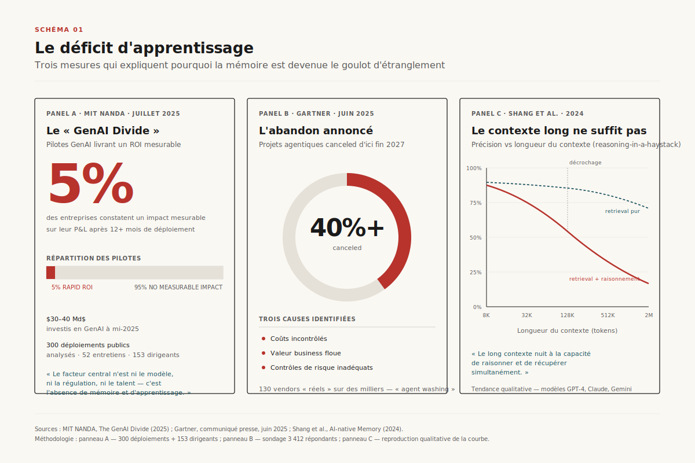
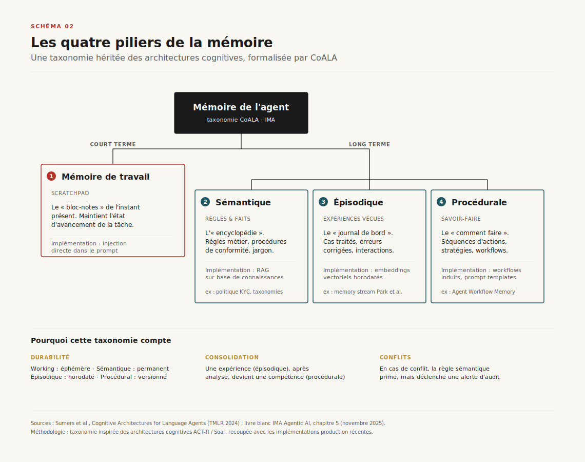
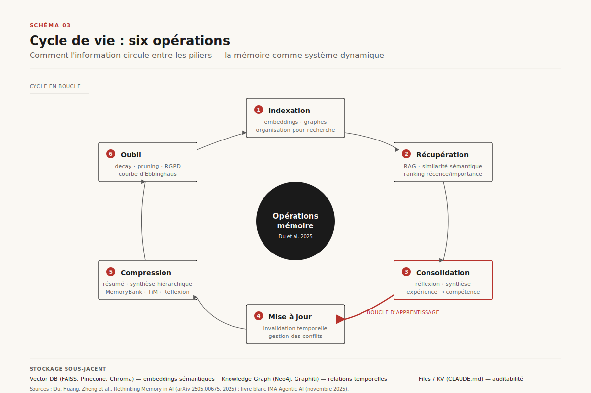
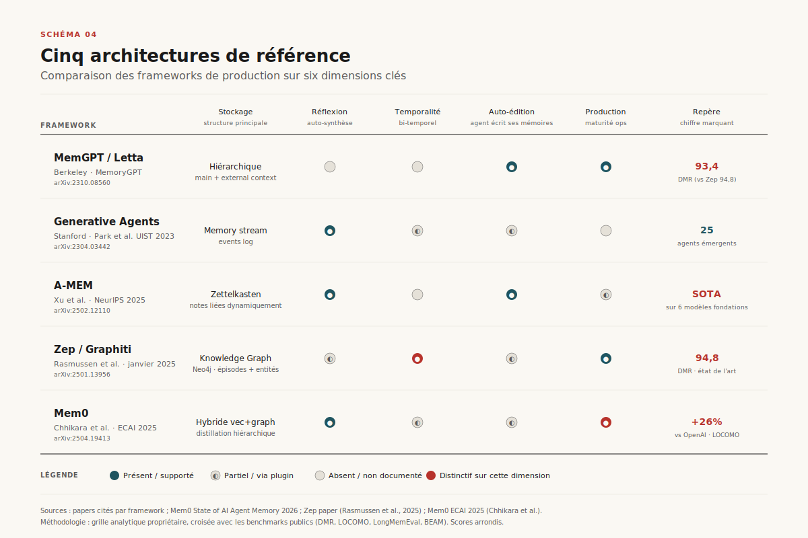
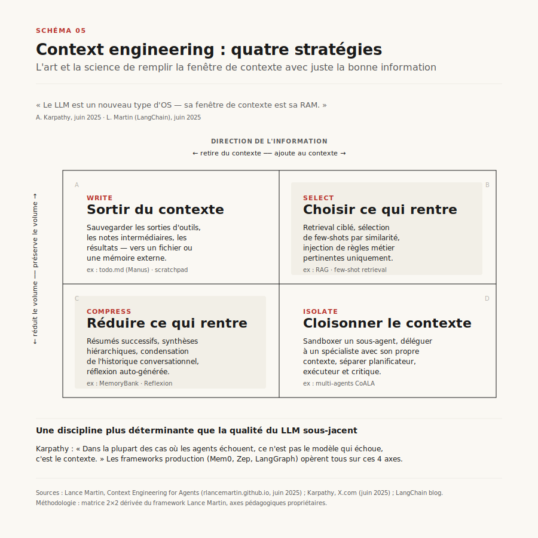
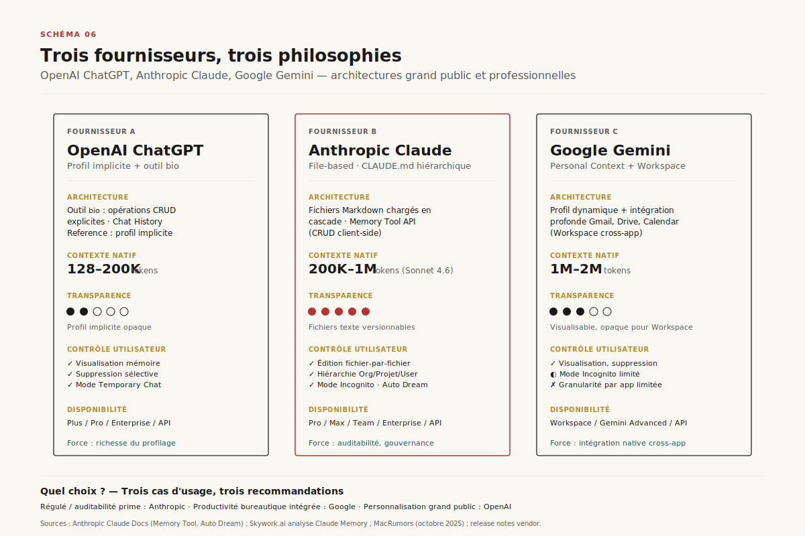
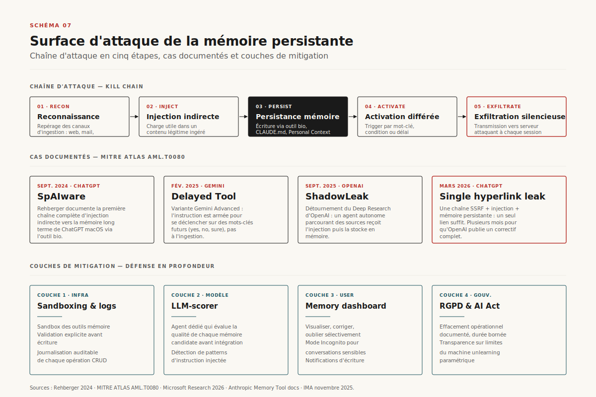
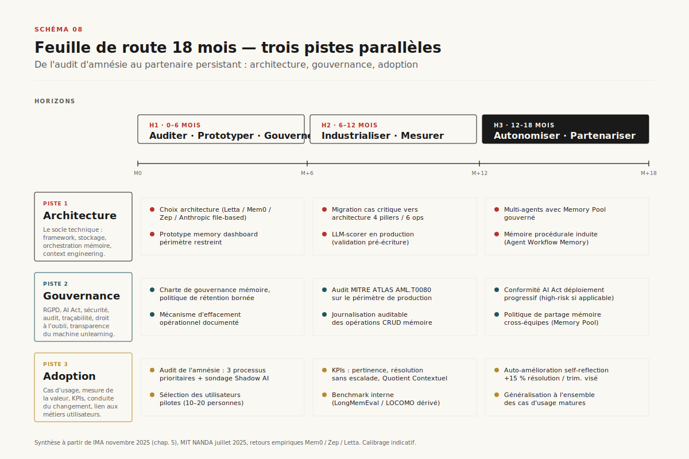

# La mémoire agentique

> **De l'outil amnésique au partenaire persistant : architectures, opérations, fournisseurs, sécurité et feuille de route opérationnelle.** — 30 avril 2026, Mathieu Guglielmino

## Synthèse exécutive

- **La mémoire est devenue le goulot d'étranglement de l'IA agentique.** Le rapport MIT NANDA *State of AI in Business 2025* attribue à un *learning gap* — l'incapacité des systèmes à retenir le feedback, s'adapter au contexte et s'améliorer dans le temps — l'échec mesuré de 95 % des pilotes GenAI en entreprise[^1]. Gartner anticipe l'abandon de plus de 40 % des projets agentiques d'ici fin 2027 pour les mêmes raisons structurelles[^2].
- **Le contexte long ne résout pas le problème.** L'expérience *reasoning-in-a-haystack* démontre que la performance des LLM les plus sophistiqués chute drastiquement à mesure que la longueur du contexte augmente, prouvant qu'un long contexte nuit à la capacité de raisonner et de récupérer simultanément[^3]. La mémoire externe structurée n'est pas concurrente du contexte long : elle en est la condition.
- **Une taxonomie stable s'est imposée**, articulée autour de quatre piliers (mémoire de travail, sémantique, épisodique, procédurale) et de six opérations clés (récupération, consolidation, mise à jour, indexation, compression, oubli)[^4][^5]. Le cadre CoALA (Princeton, TMLR 2024) en a fourni la formalisation académique de référence[^6].
- **Le paysage des architectures s'est cristallisé autour de cinq frameworks de production** — MemGPT/Letta (paradigme OS-like, hiérarchie de mémoire avec paging)[^7], A-MEM (Zettelkasten agentique, NeurIPS 2025)[^8], Zep/Graphiti (knowledge graph temporel)[^9], Mem0 (pipeline distillation, 26 % d'amélioration LLM-as-a-Judge sur LOCOMO vs. OpenAI)[^10], et les architectures *file-based* dérivées des Generative Agents de Stanford[^11].
- **Le *context engineering* est la discipline d'orchestration centrale.** Andrej Karpathy l'a défini comme « *l'art et la science de remplir la fenêtre de contexte avec juste la bonne information à chaque étape* »[^12]. Lance Martin (LangChain) en a structuré quatre stratégies — *Write, Select, Compress, Isolate* — qui constituent désormais le référentiel implicite des frameworks agentiques[^13].
- **La surface d'attaque est documentée et persistante.** L'attaque *SpAIware* de Johann Rehberger (septembre 2024) a démontré qu'une injection indirecte dans la mémoire de ChatGPT permet une exfiltration continue, à travers les sessions[^14]. La technique est désormais formalisée dans le cadre MITRE ATLAS sous la référence **AML.T0080 — *AI Agent Context Poisoning : Memory***[^15].
- **Pour les leaders Data & AI**, la mémoire n'est pas une fonctionnalité optionnelle : c'est l'élément qui sépare un assistant transactionnel d'un partenaire stratégique. Les acteurs qui investissent maintenant dans une architecture de mémoire gouvernée prennent une avance défensable, fondée sur la valeur accumulée par interaction[^16].

---

## 1. Le déficit d'apprentissage : pourquoi la mémoire est devenue le goulot d'étranglement

L'IA agentique est confrontée à un paradoxe documenté : potentiel élevé, taux d'échec élevé. Le rapport NANDA du MIT, fondé sur 52 entretiens d'organisations, 153 réponses de dirigeants et l'analyse de plus de 300 déploiements publics, conclut que malgré 30 à 40 milliards de dollars investis en GenAI, 95 % des entreprises ne constatent aucun retour mesurable sur leurs projets, le facteur central étant non la qualité des modèles ou la régulation, mais l'absence d'apprentissage et de mémoire dans les systèmes déployés[^1]. Gartner converge sur la même conclusion : les coûts incontrôlés, la valeur commerciale floue et les contrôles de risque inadéquats[^2] — autant de symptômes d'un même mal racine, l'amnésie numérique.

Cette amnésie a une signature opérationnelle reconnaissable. Un agent qui oublie le contexte oblige l'utilisateur à se répéter, casse le rythme de travail et entame la confiance. Surtout, il ne capitalise pas : chaque interaction redémarre à zéro. Dans le secteur financier, où le livre blanc IMA *Agentic AI* (novembre 2025, contributeurs : Société Générale, Crédit Agricole CIB, Natixis, La Banque Postale, Saint-Gobain) a documenté plusieurs cas d'usage critiques, l'image retenue est celle du *jour de la marmotte* : un opérateur KYC chevronné qui doit, chaque matin, redécouvrir les particularités des dossiers de la veille[^16].

*Schéma 1 — Le déficit d'apprentissage en chiffres : 95 % d'échec selon MIT NANDA, 40 % d'abandons projetés par Gartner, et la chute de précision en contexte long.*

L'objection commune selon laquelle les fenêtres de contexte longues — 1 M tokens chez Claude Sonnet 4.6, 2 M chez Gemini, 200 K chez Claude par défaut — rendraient la mémoire externe obsolète est démentie par l'expérimentation. Le travail *AI-native Memory* (Shang et al., 2024)[^3] introduit le test du *raisonnement dans une botte de foin* (*reasoning-in-a-haystack*) : on insère une information cruciale au milieu d'un texte extrêmement long et distrayant, puis on pose une question qui exige non seulement de retrouver cette information, mais de l'utiliser dans un raisonnement. Le verdict est sans équivoque : même les modèles les plus sophistiqués voient leur précision chuter à mesure que la longueur croît, prouvant que le long contexte nuit à la capacité de raisonner et de récupérer simultanément.

L'étude *Agent Hospital* (Li et al., 2024)[^17] et son successeur *MedAgentSim* (Almansoori et al., 2025)[^18] quantifient précisément ce coût dans un cadre médical critique. Sur le benchmark MIMIC-IV, des agents dotés de mécanismes de mémoire et d'auto-amélioration atteignent **79,5 % de précision diagnostique**, là où les modèles de base peinent à dépasser 40 %. L'écart n'est pas marginal : il définit la frontière entre un démonstrateur et un système déployable. La mémoire n'est pas un confort d'expérience utilisateur ; c'est le mécanisme par lequel un agent devient *intrinsèquement plus fiable*.

Le diagnostic s'étend au-delà des cas d'usage régulés. Les utilisateurs d'entreprise ont déjà rencontré la *bonne* IA dans leurs outils personnels : 90 % des employés utilisent quotidiennement ChatGPT, Claude ou des équivalents pour des tâches professionnelles, alors que seulement 40 % des entreprises ont des licences officielles[^1]. Cette économie *Shadow AI* signale deux choses : les utilisateurs reconnaissent la valeur de la mémoire, et leurs attentes envers les outils corporate s'alignent désormais sur celle des produits grand public. Un agent d'entreprise statique, qui n'apprend pas, se mesure à un benchmark qu'il ne peut pas atteindre.

---

## 2. Anatomie de la mémoire agentique : quatre piliers, six opérations

Le travail fondateur *Cognitive Architectures for Language Agents* (CoALA), publié dans *Transactions on Machine Learning Research* en 2024 par Sumers, Yao, Narasimhan et Griffiths (Princeton)[^6], a fixé le vocabulaire de référence. CoALA décrit un agent linguistique selon trois dimensions : une organisation modulaire de la mémoire (working / long-terme), un espace d'action structuré pour interagir avec la mémoire interne et l'environnement externe, et un processus de décision généralisé. La mémoire à long terme y est elle-même subdivisée en trois sous-types — **épisodique, sémantique, procédurale** — par analogie avec les architectures cognitives classiques (ACT-R, Soar). Ce découpage à quatre étages s'est imposé comme la grammaire commune des systèmes agentiques.

Le livre blanc IMA convergent reprend explicitement cette taxonomie[^16] :

- **Mémoire de travail** : le *bloc-notes* de l'instant présent, à très court terme, qui maintient l'état d'avancement d'une tâche en cours. Implémentation typique : injection directe dans le prompt sous forme de *scratchpad*. Sur des processus structurés, son architecture détermine la fiabilité — les agents avec mémoire de travail non structurée échouent dans la moitié des cas (50 %), contre 90 % de réussite pour ceux opérant avec un protocole structuré sur les mêmes tâches[^16].
- **Mémoire sémantique** : l'*encyclopédie* — règles métier, procédures de conformité, jargon, listes. Permanente et stable, elle est typiquement implémentée via RAG sur des bases de connaissances d'entreprise.
- **Mémoire épisodique** : le *journal de bord*, collection des expériences vécues. Chaque cas traité, chaque erreur corrigée est stockée comme un épisode horodaté. C'est la matière première du *few-shot learning* contextualisé : face à une situation nouvelle, l'agent y cherche des cas similaires.
- **Mémoire procédurale** : le *répertoire des savoir-faire* — pas des faits bruts, mais des séquences d'actions et des stratégies. C'est ce qui permet à un agent de savoir *comment traiter* une alerte de fraude, et pas seulement de savoir *ce qu'elle est*. L'approche *Agent Workflow Memory* (Wang et al., 2024) montre qu'un agent peut induire automatiquement de nouvelles procédures en observant des exemples, transformant une série d'actions passées en une compétence réutilisable[^19].

*Schéma 2 — Travail, sémantique, épisodique, procédurale : la grammaire CoALA appliquée au contexte d'entreprise.*

Comme l'illustre le Schéma 2, ces quatre piliers ne sont pas isolés : ils communiquent par des *opérations* qui régissent le cycle de vie de l'information. La synthèse récente *Rethinking Memory in AI* de Du, Huang, Zheng et al. (arXiv 2505.00675, 2025)[^4] en formalise six, qui correspondent étroitement à celles décrites par les contributeurs IMA[^16] :

1. **Récupération (*retrieval*)** — au cœur du paradigme RAG, l'agent interroge ses mémoires pour trouver les informations pertinentes. Techniquement : embeddings vectoriels et recherche par similarité, désormais standard.
2. **Consolidation** — le processus essentiel par lequel une information volatile devient pérenne. Une expérience (issue de la mémoire épisodique), après analyse, est transformée en compétence (stockée dans la mémoire procédurale). C'est le moteur de l'apprentissage. Les Generative Agents de Stanford l'implémentent via leur mécanisme de *réflexion*, qui synthétise les souvenirs en inférences de plus haut niveau dès qu'un seuil d'importance accumulée est franchi[^11].
3. **Mise à jour (*updating*)** — l'acte de modifier une information existante pour éviter d'appliquer une norme obsolète. Critique pour la gouvernance.
4. **Indexation** — l'organisation intelligente de la mémoire (typiquement via une base vectorielle) pour une récupération efficace fondée sur le sens, non les mots-clés.
5. **Compression** — le résumé d'information pour optimiser le stockage et l'usage du contexte. *MemoryBank* (Zhong et al., 2023) crée des résumés quotidiens de haut niveau ; *TiM* extrait les relations clés[^20].
6. **Oubli (*forgetting*)** — la capacité de supprimer des informations de manière ciblée, pour des raisons techniques (saturation), légales (RGPD) ou de pertinence (information périmée). *MemoryBank* incorpore explicitement un modèle de courbe d'oubli d'Ebbinghaus, qui imite la dégradation de la mémoire humaine[^20].

*Schéma 3 — Récupération, consolidation, mise à jour, indexation, compression, oubli : un cycle, pas une séquence.*

Ces six opérations forment un cycle, pas une séquence linéaire — chaque action peut déclencher les autres. Le **triage cognitif** introduit par les contributeurs IMA en donne une lecture opérationnelle utile[^16] : face à une requête, l'agent applique successivement *Garde-fou* (Terra Incognita — escalade si rien de pertinent), *Reconnaissance immédiate* (zero-shot via mémoire sémantique/procédurale), *Inspiration par l'exemple* (few-shot via mémoire épisodique), et *Application d'une leçon apprise* (auto-réflexion sur l'échec, pour traiter les cas inédits par raisonnement itératif). Cette discipline de triage transforme une mémoire brute en *intelligence appliquée*.

---

## 3. Architectures de référence : du scratchpad au knowledge graph temporel

Cinq familles d'architectures se sont stabilisées en moins de trois ans. Elles répondent à la même question — comment doter un LLM d'une mémoire à long terme cohérente — mais avec des paris d'ingénierie différents.

### 3.1 MemGPT / Letta — la mémoire comme système d'exploitation

Publié en octobre 2023 par Packer, Wooders, Lin et Patil au laboratoire Sky Computing de Berkeley[^7], MemGPT propose une analogie radicale : un LLM est un processeur, son contexte est sa RAM, la mémoire externe est son disque. Le système gère explicitement une hiérarchie à deux niveaux — *main context* (tokens visibles par le LLM) et *external context* (stockage persistant) — et utilise les *function calls* pour permettre au modèle de déplacer activement l'information entre les deux, comme un OS qui gère son *paging*. Le composant *recall memory* indexe l'historique conversationnel, l'*archival memory* sert de stockage long-terme étendu. Le projet MemGPT est devenu Letta en septembre 2024[^21] et a popularisé le concept de *memory blocks* : sections structurées du contexte (par exemple les blocs `human` et `persona`) que l'agent lit et réécrit lui-même via des outils dédiés[^22].

### 3.2 Generative Agents — le memory stream et la réflexion

L'article *Generative Agents : Interactive Simulacra of Human Behavior* (Park et al., Stanford × Google, UIST 2023)[^11] a démontré qu'on peut animer 25 agents dans un sandbox *à la Sims* en leur donnant trois mécanismes : un *memory stream* (journal exhaustif des expériences en langage naturel), un module de *reflection* (synthèse récursive en inférences de plus haut niveau lorsqu'un seuil d'importance est franchi) et un planificateur. Le retrieval combine trois critères pondérés : pertinence sémantique, récence (décroissance exponentielle), et importance (notée par le LLM lui-même de 1 à 10). Ce trio *recency / relevance / importance* est devenu un standard de fait. *Reflexion* (Shinn et al., 2023)[^23] a généralisé le mécanisme de réflexion en l'utilisant comme un signal de renforcement verbal pour l'apprentissage par essai-erreur.

### 3.3 A-MEM — la mémoire agentique inspirée du Zettelkasten

Présenté à NeurIPS 2025 par Xu, Liang, Mei et al.[^8], A-MEM s'inspire de la méthode *Zettelkasten* du sociologue Niklas Luhmann — un système de notes atomiques liées dynamiquement. Pour chaque nouveau souvenir, A-MEM construit une note structurée (description contextuelle, mots-clés, tags), analyse le dépôt historique pour identifier des connexions sémantiques, établit des liens, et — point clé — fait évoluer les notes existantes : intégrer un nouvel élément peut déclencher une mise à jour des descriptions et attributs des mémoires antérieures. Le réseau se raffine en continu. Empiriquement, A-MEM surpasse les baselines SOTA sur six modèles fondations.

### 3.4 Zep / Graphiti — le knowledge graph temporel

Publié en janvier 2025 par Rasmussen, Paliychuk, Beauvais, Ryan et Chalef (arXiv 2501.13956)[^9], Zep dépasse l'approche purement vectorielle. Son cœur, *Graphiti* (open-source, désormais ~20 000 étoiles GitHub)[^24], est un moteur de graphe de connaissances *temporellement conscient* : chaque arête possède des intervalles de validité (`t_valid`, `t_invalid`), un modèle bi-temporel qui sépare *quand un événement a eu lieu* de *quand il a été ingéré*. Lorsqu'une nouvelle information contredit une information existante, Zep n'écrase pas — il invalide, préservant l'histoire. Sur le benchmark Deep Memory Retrieval (DMR), Zep atteint **94,8 %** contre 93,4 % pour MemGPT[^9].

### 3.5 Mem0 — l'optimisation production

Le paper Mem0 *Building Production-Ready AI Agents with Scalable Long-Term Memory* (Chhikara et al., ECAI 2025, arXiv 2504.19413)[^10] documente le compromis production : précision élevée sous contrainte de tokens et de latence. Mem0 affiche **+26 %** d'amélioration LLM-as-a-Judge sur LOCOMO par rapport à OpenAI, **93,4** sur LongMemEval (+26 points), et **91,6** sur LOCOMO[^25]. La latence médiane reste sous la seconde, là où l'approche *full-context* atteint 9,87 s en médiane et 17,12 s au p95 — catégoriquement inutilisable en production temps réel. La version *graph memory* ajoute environ 2 % de gain.

*Schéma 4 — MemGPT/Letta, Generative Agents, A-MEM, Zep/Graphiti, Mem0 : cinq paris d'ingénierie pour la même question.*

Au-delà de ces cinq architectures, le panorama s'est densifié : LangMem (LangChain), MIRIX (multi-utilisateur), MemMachine (0,917 sur LOCOMO en mars 2026 avec gpt-4.1-mini)[^26], Memory-R1 (Yan et al., 2025 — opérations CRUD apprises par renforcement). La leçon transversale : **il n'y a pas une seule mémoire, mais une bibliothèque de patterns** dont le choix dépend de la criticité, du volume conversationnel et de la dépendance temporelle des cas d'usage.

---

## 4. Le context engineering : la discipline d'orchestration

Disposer d'une architecture de mémoire ne suffit pas — encore faut-il décider, à chaque étape, *ce que l'on présente exactement au LLM*. C'est la discipline du **context engineering**, qu'Andrej Karpathy a définie en juin 2025 comme *« l'art et la science délicats de remplir la fenêtre de contexte avec juste la bonne information à chaque étape »*[^12]. La métaphore qu'il déploie est éclairante : le LLM est un nouveau type de système d'exploitation, son contexte est la RAM, et le context engineering joue le rôle du gestionnaire de mémoire de l'OS.

Lance Martin (LangChain) a structuré le champ en quatre stratégies génériques[^13] :

- **Write** — *sortir l'information du contexte* : sauvegarder dans un scratchpad (TODO file, mémoire structurée), externaliser des résultats d'outils dans un système de fichiers. L'équipe Manus utilise cette approche pour atteindre des ratios de compression 100:1 en gardant la réversibilité (URL pour récupérer le contenu complet si nécessaire).
- **Select** — *choisir ce qui rentre* : retrieval ciblé (RAG), sélection de quelques exemples few-shot par similarité, inclusion de règles métier précises. C'est ici que la mémoire long-terme joue son rôle pivot.
- **Compress** — *réduire ce qui rentre* : résumés successifs, synthèses hiérarchiques, *condensation* de l'historique conversationnel. *MemoryBank* implémente la compression quotidienne ; *Reflexion* compresse les échecs en leçons.
- **Isolate** — *cloisonner* : sandboxer un sous-agent dans un contexte restreint pour éviter la pollution d'attention, déléguer une sous-tâche à un agent spécialisé qui aura son propre contexte. Le pattern *planner / executor / critic* en est l'incarnation classique[^6].

*Schéma 5 — Write, Select, Compress, Isolate : la grille Lance Martin pour piloter ce que voit le LLM à chaque étape.*

L'observation pratique des contributeurs IMA est cohérente avec ce cadre : le context engineering est *« la tâche principale des développeurs d'agents »*[^16]. Il sélectionne stratégiquement quelles opérations de mémoire utiliser — Récupération et Compression notamment — pour décider quels faits (sémantique), quelles expériences (épisodique) et quelles procédures incluront le contexte limité. C'est cette ingénierie précise qui transforme une mémoire brute en intelligence appliquée.

Une conséquence stratégique mérite d'être soulignée : la qualité du context engineering est devenue un déterminant de succès plus important que la qualité du LLM sous-jacent. Tobias Lütke (CEO Shopify) et Greg Brockman (OpenAI) l'ont publiquement formulé, Karpathy a renchéri[^27] : *« dans la plupart des cas où les agents échouent, ce n'est pas le modèle qui échoue, c'est le contexte »*. Pour un Practice Manager Data & AI, le déplacement est concret : ne pas s'enfermer dans la course aux modèles, investir dans la couche d'orchestration mémoire/contexte qui se place au-dessus.

---

## 5. Paysage fournisseurs : OpenAI, Anthropic, Google

Les trois grands fournisseurs grand public ont déployé des architectures de mémoire structurellement différentes. Comprendre ces différences est crucial pour choisir un fournisseur, mais aussi pour anticiper les patterns que les utilisateurs d'entreprise ramènent depuis leur usage personnel.

### 5.1 OpenAI ChatGPT — le couple `bio` + Chat History Reference

OpenAI a introduit la mémoire dans ChatGPT en deux phases : d'abord *Saved Memories* (avril 2024, gérée explicitement via l'outil `bio` que le modèle invoque pour persister une information), puis *Chat History Reference* (en 2024-2025, profil implicite construit en arrière-plan). Le contenu est rendu visible au modèle dans une section *Model Set Context* en début de conversation. Le système est puissant, mais opaque côté utilisateur : l'inférence implicite à partir de l'historique fonctionne, mais la traçabilité de chaque mémoire est limitée. L'opération `bio` peut être déclenchée par le modèle de sa propre initiative — surface d'attaque centrale documentée dans la section 6.

### 5.2 Anthropic Claude — l'architecture *file-based* hiérarchique

Anthropic a adopté un parti pris structurellement différent : la mémoire est stockée dans des fichiers Markdown (`CLAUDE.md`) organisés hiérarchiquement (Enterprise → Project → User), chargés en cascade dans le contexte. La mémoire conversationnelle automatique a été ouverte aux plans Pro et Max en octobre 2025[^28]. Le *Memory Tool* (API, Claude 4.7) expose une interface client-side : Claude appelle des opérations CRUD sur un répertoire `/memories`, l'application les exécute localement[^29]. Ce design — fichiers texte versionnables, opérations explicites, contrôle utilisateur granulaire — privilégie la transparence et l'auditabilité au prix d'une scalabilité moindre que les approches vectorielles. La feature *Auto Dream* (Claude Code) implémente un cycle de consolidation périodique inspiré du sommeil REM, qui revoit les notes accumulées, élague le périmé et réorganise[^30]. Anthropic a également introduit en avril 2026 la mémoire pour les *Managed Agents* du Claude Platform : stockage par fichiers exportables, journalisation de chaque écriture, permissions différenciées (read-only org, read-write user)[^31].

### 5.3 Google Gemini — Personal Context et 2 M tokens

L'approche Google combine un contexte natif extrêmement long (jusqu'à 2 M tokens) avec une intégration profonde dans Workspace (Gmail, Drive, Calendar, Docs). Le *Personal Context* fait évoluer un profil utilisateur que Gemini consulte par défaut. La force de l'approche tient à l'intégration cross-app — Gemini *voit* le calendrier, les emails et les documents, et peut s'y référer sans configuration. La faiblesse, que la section sécurité documente, est qu'elle élargit considérablement la surface d'injection indirecte.

*Schéma 6 — OpenAI ChatGPT, Anthropic Claude, Google Gemini : architectures grand public et professionnelles.*

| Dimension | OpenAI ChatGPT | Anthropic Claude | Google Gemini |
|---|---|---|---|
| **Architecture mémoire** | `bio` + Chat History Reference | `CLAUDE.md` hiérarchique + Memory Tool | Personal Context + intégration Workspace |
| **Contexte natif** | 128 K — 200 K tokens | 200 K — 1 M tokens (Sonnet 4.6) | 1 M — 2 M tokens |
| **Transparence côté utilisateur** | Faible (implicite) | Élevée (fichiers visibles, éditables) | Modérée (visualisable, éditable) |
| **Contrôle granulaire** | Visualisation, suppression | Édition fichier-par-fichier, hiérarchie | Visualisation, suppression |
| **Mode Incognito** | Oui (Temporary Chat) | Oui | Limité |

Le Schéma 6 formalise cette comparaison. Une lecture stratégique : pour des cas d'usage régulés où l'auditabilité prime (banque, santé, public), l'approche file-based d'Anthropic est plus défendable. Pour des cas d'intégration profonde (productivité bureautique), Gemini a un avantage natif. Pour des cas de personnalisation grand public à grande échelle, ChatGPT bénéficie de sa base installée et de la richesse de son profilage implicite.

---

## 6. Surface d'attaque et gouvernance : memory poisoning, RGPD, AI Act

Doter une IA d'une mémoire persistante crée une surface d'attaque qualitativement nouvelle. Une vulnérabilité d'injection dans une session classique disparaît à la fin de l'échange ; une vulnérabilité dans la mémoire persiste, par construction, à travers les sessions futures.

### 6.1 La famille des attaques : SpAIware, ZombieAgent, ShadowLeak

Le travail séminal de Johann Rehberger (Red Team Director, Electronic Arts) a documenté la chaîne d'attaque dès 2024[^14]. Son *SpAIware* (septembre 2024) a démontré qu'une instruction malveillante embarquée dans un site web ou un document — récupéré via la fonctionnalité de navigation de ChatGPT — peut déclencher l'outil `bio` et persister une instruction d'exfiltration dans la mémoire long-terme. Toute conversation future transmet alors, à l'insu de l'utilisateur, les inputs vers un serveur contrôlé par l'attaquant[^32]. L'attaque fonctionne sans interaction supplémentaire de la victime : un seul document piégé suffit.

En février 2025, Rehberger a publié une variante ciblant Gemini Advanced[^33] via la technique *delayed tool invocation* : l'instruction injectée n'est pas exécutée immédiatement, mais armée pour se déclencher sur des mots-clés futurs (*yes, no, sure*). Démonstration visuelle marquante : Gemini *se souvient* après ingestion d'un document piégé que l'utilisateur a 102 ans, croit que la Terre est plate et vit dans la Matrice. Au-delà du clin d'œil, la persistance est démontrée.

L'écosystème a formalisé la classe d'attaques. Microsoft Research la définit explicitement : *« AI Memory Poisoning occurs when an external actor injects unauthorized instructions or facts into an AI assistant's memory »*[^34]. Le cadre **MITRE ATLAS** la référence sous le code **AML.T0080 — *AI Agent Context Poisoning : Memory***[^15]. *ShadowLeak* (septembre 2025) a démontré une variante exploitant Deep Research d'OpenAI ; en octobre-février 2025, une chaîne plus subtile (SSRF + injection + mémoire persistante) a permis un compromission via un simple lien hypertexte, OpenAI mettant plusieurs mois à publier le correctif complet[^35].

*Schéma 7 — Chaîne d'attaque en cinq étapes, cas documentés (SpAIware, Delayed Tool, ShadowLeak) et quatre couches de mitigation.*

### 6.2 Le cycle d'attaque et les mitigations

La chaîne d'attaque suit un schéma reproductible en cinq étapes : (1) **Recon** — repérage des points d'ingestion (web, documents, emails, calendrier) ; (2) **Inject** — placement de l'instruction malveillante dans un contenu apparemment légitime ; (3) **Persist** — déclenchement de l'écriture en mémoire (souvent via un outil `bio` ou équivalent) ; (4) **Activate** — déclenchement par mot-clé ou condition ; (5) **Exfiltrate** — transmission silencieuse des données utilisateur.

Les mitigations connues couvrent plusieurs niveaux. Au niveau infrastructure : sandboxing des outils de mémoire, validation explicite avant écriture, journalisation auditable de chaque opération CRUD (Anthropic l'implémente nativement pour les Managed Agents)[^31]. Au niveau modèle : LLM-scorer qui évalue la qualité de chaque mémoire candidate avant intégration, comme proposé dans *Memory Sharing for Large Language Model based Agents* (Gao & Zhang, 2024)[^36]. Au niveau utilisateur : *tableau de bord mémoire* permettant de visualiser, corriger et oublier sélectivement, recommandé par les contributeurs IMA[^16] et désormais standard chez Anthropic et OpenAI ; mode Incognito pour les conversations sensibles. Au niveau organisationnel : audit régulier, purge périodique, sources de confiance documentées.

### 6.3 RGPD, AI Act, et le défi du *machine unlearning*

Sur le plan réglementaire, la mémoire persistante percute frontalement le **RGPD article 17** (*droit à l'effacement*). L'EU AI Act (entré en vigueur en 2024, déploiement progressif jusqu'en 2027) ne mentionne pas explicitement le droit à l'oubli, mais ses articles 2(7) et le considérant 69 imposent que les systèmes IA respectent le RGPD à travers tout leur cycle de vie, en particulier pour les usages classés *high-risk*[^37]. Le défi technique tient à ce qu'on appelle le *machine unlearning* : on peut effacer un fichier, mais on ne peut pas, à coût raisonnable, *désentraîner* un modèle dont les poids ont absorbé une donnée pendant l'entraînement initial.

Les contributeurs IMA distinguent à juste titre deux régimes[^16] :

- **Mémoire opérationnelle / explicite** (fichiers, vecteurs, blocs structurés) — l'effacement est techniquement faisable, doit être documenté avec des délais de propagation et une preuve d'exécution.
- **Mémoire implicite / paramétrique** (poids du modèle entraînés sur des données passées) — l'effacement ciblé reste une technologie émergente. La transparence sur cette limite est indispensable à la confiance.

La gouvernance tactique tient en trois actions : (1) **consentement explicite et durée de rétention bornée** (par exemple 6 mois renouvelables), (2) **gestion documentée de l'effacement** sur le périmètre opérationnel, (3) **reconnaissance explicite des limites** sur le périmètre paramétrique. Cette honnêteté technique est un déterminant de confiance, pas un aveu de faiblesse.

---

## 7. Feuille de route 6/12/18 mois pour les organisations

La transformation d'un agent amnésique en partenaire persistant est moins un *big bang* qu'une discipline progressive. À partir des sept piliers proposés par les contributeurs IMA[^16] et des retours empiriques des frameworks de production (Mem0, Zep, Letta), trois horizons se distinguent.

*Schéma 8 — Architecture, gouvernance, adoption : trois pistes parallèles synchronisées sur trois horizons.*

### 7.1 Horizon 0–6 mois : auditer, prototyper, gouverner

Les actions à conduire dans le semestre :

- **Auditer l'amnésie actuelle** : identifier les trois processus où vos agents existants forcent les utilisateurs à se répéter, et sonder l'usage *Shadow AI* (90 % des employés selon MIT NANDA) pour comprendre où la valeur est déjà perçue[^1]. Ce sont les cibles prioritaires.
- **Définir une charte de gouvernance** : politique de rétention, mécanismes d'effacement, transparence sur les limites du machine unlearning.
- **Prototyper un *tableau de bord mémoire*** sur un périmètre restreint : visualiser, corriger, oublier. Tester avec des utilisateurs pilotes.
- **Choisir une architecture de référence** : Letta pour les déploiements OS-like avec auto-édition ; Mem0 pour le compromis production ; Zep si la dimension temporelle prime ; *file-based* (Anthropic Memory Tool) si l'auditabilité prime.

### 7.2 Horizon 6–12 mois : industrialiser, mesurer

- **Migrer un cas d'usage critique** vers une architecture mémoire complète (4 piliers, 6 opérations). KYC, onboarding client, planification multi-fuseaux et support technique long terme sont les meilleurs candidats[^16].
- **Mettre en place les indicateurs de performance** : taux de pertinence de la mémoire, taux de résolution sans escalade, délai de mise à jour des connaissances, *Quotient Contextuel* (proportion de suggestions non sollicitées acceptées par l'utilisateur).
- **Évaluer rigoureusement** sur LongMemEval, LOCOMO ou un benchmark interne dérivé. La mesure quantifiée est la condition de la défense budgétaire.
- **Industrialiser le LLM-scorer** : un agent dédié qui valide les nouvelles mémoires avant intégration, contre la dérive[^36].

### 7.3 Horizon 12–18 mois : autonomiser, partenariser

- **Activer l'auto-amélioration** : la boucle *self-reflection* + *case-based reasoning* est documentée comme atteignant +15 % de résolution autonome par trimestre dans les déploiements optimisés[^16][^18].
- **Déployer en multi-agents** : partage de mémoire gouverné, *Memory Pool* avec scoring de qualité.
- **Mémoire procédurale induite** : *Agent Workflow Memory* permet à l'agent d'extraire automatiquement de nouveaux workflows à partir des trajectoires passées[^19], réduisant la maintenance manuelle des prompts complexes.

---

## 8. Conclusion

Trois prises de recul stratégiques.

La première : la mémoire n'est pas un *plus* de personnalisation, c'est le mécanisme par lequel une IA passe d'un *outil* à un *partenaire*. Les chiffres sont sans appel : 79,5 % de précision diagnostique avec mémoire vs. ~40 % sans (MedAgentSim) ; 90 % de réussite avec mémoire de travail structurée vs. 50 % sans ; +26 % LLM-as-a-Judge sur LOCOMO pour Mem0 vs. baseline. Aucun effet de cette ampleur ne s'obtient ailleurs dans la stack actuelle.

La deuxième : les frameworks ont mûri à un rythme remarquable en 24 mois. CoALA a fixé le vocabulaire en 2024, MemGPT a fait passer la mémoire d'une hypothèse de recherche à un produit, Zep et Mem0 ont franchi le seuil production en 2025, Anthropic, OpenAI et Google ont aligné leurs offres grand public. **Le coût d'attente d'un standard universel n'est plus pertinent.** Les acteurs qui investissent maintenant accumulent une valeur — celle des préférences apprises, des échecs analysés, des procédures induites — qui constitue un *coût de substitution* défendable au sens stratégique.

La troisième : la gouvernance et la sécurité ne sont pas des freins, ce sont des accélérateurs. Le memory poisoning est documenté, les vecteurs sont connus (MITRE ATLAS AML.T0080), les mitigations sont disponibles. Les organisations qui les implémentent dès le départ — journalisation, validation, audit, transparence sur les limites du machine unlearning — n'auront pas à rattraper leur dette technique sous pression réglementaire ou incident. Celles qui ne les implémentent pas verront leurs déploiements stoppés à la première brèche publique.

Pour un Practice Manager Data & AI ou un CDO, l'investissement de mémoire agentique aujourd'hui n'est pas une option technologique parmi d'autres. C'est l'arbitrage qui distingue, à 18 mois, ceux qui auront construit un vrai *partenaire persistant* de ceux qui auront accumulé une dette de prototypes amnésiques.

---

## Sources

[^1]: Challapally, A., Pease, C., Raskar, R., & Chari, P. (2025). *The GenAI Divide : State of AI in Business 2025*, MIT Project NANDA, juillet 2025. URL : https://nanda.media.mit.edu/. Consulté le 2026-04-30.

[^2]: Gartner, Inc. (2025). *Gartner Predicts Over 40 % of Agentic AI Projects Will Be Canceled by End of 2027*, communiqué de presse, 25 juin 2025. URL : https://www.gartner.com/en/newsroom/press-releases/2025-06-25-gartner-predicts-over-40-percent-of-agentic-ai-projects-will-be-canceled-by-end-of-2027. Consulté le 2026-04-30.

[^3]: Shang, J., Zheng, Z., Wei, J., et al. (2024). *AI-native Memory : A Pathway from LLM Towards AGI*. arXiv preprint. URL : https://arxiv.org/abs/2406.18312. Consulté le 2026-04-30.

[^4]: Du, Y., Huang, W., Zheng, D., et al. (2025). *Rethinking Memory in AI : Taxonomy, Operations, Topics, and Future Directions*. arXiv:2505.00675. URL : https://arxiv.org/abs/2505.00675. Consulté le 2026-04-30.

[^5]: Zhang, Z., Bo, X., Ma, C., et al. (2024). *A Survey on the Memory Mechanism of Large Language Model based Agents*. arXiv:2404.13501. URL : https://arxiv.org/abs/2404.13501. Consulté le 2026-04-30.

[^6]: Sumers, T. R., Yao, S., Narasimhan, K., & Griffiths, T. L. (2024). *Cognitive Architectures for Language Agents (CoALA)*. Transactions on Machine Learning Research. arXiv:2309.02427. URL : https://arxiv.org/abs/2309.02427. Consulté le 2026-04-30.

[^7]: Packer, C., Wooders, S., Lin, K., Fang, V., Patil, S. G., Sheth, I., & Gonzalez, J. E. (2023). *MemGPT : Towards LLMs as Operating Systems*. arXiv:2310.08560, UC Berkeley Sky Computing Lab. URL : https://arxiv.org/abs/2310.08560. Consulté le 2026-04-30.

[^8]: Xu, W., Liang, Z., Mei, K., Gao, H., Tan, J., & Zhang, Y. (2025). *A-MEM : Agentic Memory for LLM Agents*. NeurIPS 2025, arXiv:2502.12110. URL : https://arxiv.org/abs/2502.12110. Consulté le 2026-04-30.

[^9]: Rasmussen, P., Paliychuk, P., Beauvais, T., Ryan, J., & Chalef, D. (2025). *Zep : A Temporal Knowledge Graph Architecture for Agent Memory*. arXiv:2501.13956. URL : https://arxiv.org/abs/2501.13956. Consulté le 2026-04-30.

[^10]: Chhikara, P., Khant, D., Aryan, S., Singh, T., & Yadav, D. (2025). *Mem0 : Building Production-Ready AI Agents with Scalable Long-Term Memory*. ECAI 2025, arXiv:2504.19413. URL : https://arxiv.org/abs/2504.19413. Consulté le 2026-04-30.

[^11]: Park, J. S., O'Brien, J. C., Cai, C. J., Morris, M. R., Liang, P., & Bernstein, M. S. (2023). *Generative Agents : Interactive Simulacra of Human Behavior*. UIST '23, ACM. URL : https://dl.acm.org/doi/10.1145/3586183.3606763. Consulté le 2026-04-30.

[^12]: Karpathy, A. (2025). Tweet sur le *context engineering*, 25 juin 2025. URL : https://x.com/karpathy/status/1937902205765607626. Consulté le 2026-04-30.

[^13]: Martin, R. L. (2025). *Context Engineering for Agents*, blog personnel, 23 juin 2025. URL : https://rlancemartin.github.io/2025/06/23/context_engineering/. Consulté le 2026-04-30.

[^14]: Rehberger, J. (2024). *ChatGPT macOS Flaw Exposes Persistent Memory Risks (SpAIware)*, septembre 2024. Synthèse SC Media : https://www.scworld.com/brief/prolonged-spyware-injection-possible-with-chatgpt-macos-flaw. Consulté le 2026-04-30.

[^15]: MITRE ATLAS (2025). *AML.T0080 — AI Agent Context Poisoning : Memory*. URL : https://atlas.mitre.org/. Consulté le 2026-04-30.

[^16]: Gibert, L., Herbera, D., Arnaudy, A., Fournier, G., Dupouy, H., Meghara, L., Fournier, L., et al. (2025). *Agentic AI : Premiers retours terrain*, livre blanc, Innovation Makers Alliance (IMA), novembre 2025. Chapitre 5 « Prospective : gestion de la mémoire, la clé de la réussite ». URL : https://www.ima-dt.org/. Consulté le 2026-04-30.

[^17]: Li, J., Lai, Y., Li, W., et al. (2024). *Agent Hospital : A Simulacrum of Hospital with Evolvable Medical Agents*. arXiv preprint. Consulté le 2026-04-30.

[^18]: Almansoori, M., Kumar, K., & Cholakkal, H. (2025). *Self-Evolving Multi-Agent Simulations for Realistic Clinical Interactions (MedAgentSim)*. arXiv preprint. Consulté le 2026-04-30.

[^19]: Wang, Z. Z., Mao, J., Fried, D., & Neubig, G. (2024). *Agent Workflow Memory*. arXiv preprint. Consulté le 2026-04-30.

[^20]: Zhong, W., et al. (2023). *MemoryBank : Enhancing LLM with Long-Term Memory via Ebbinghaus-inspired Forgetting*. AAAI 2024. Consulté le 2026-04-30.

[^21]: Letta (2024). *MemGPT is now part of Letta*, billet de blog, septembre 2024. URL : https://www.letta.com/blog/memgpt-and-letta. Consulté le 2026-04-30.

[^22]: Letta Documentation. *Memory Blocks*. URL : https://docs.letta.com/. Consulté le 2026-04-30.

[^23]: Shinn, N., Cassano, F., Berman, E., Gopinath, A., Narasimhan, K., & Yao, S. (2023). *Reflexion : Language Agents with Verbal Reinforcement Learning*. NeurIPS 2023, arXiv:2303.11366. Consulté le 2026-04-30.

[^24]: Zep AI (2025). *Graphiti : Real-Time Temporal Knowledge Graph for AI Agents*. GitHub. URL : https://github.com/getzep/graphiti. Consulté le 2026-04-30.

[^25]: Mem0 (2026). *State of AI Agent Memory 2026*, blog Mem0. URL : https://mem0.ai/blog/state-of-ai-agent-memory-2026. Consulté le 2026-04-30.

[^26]: Hong, S., et al. (2026). *MemMachine : A Ground-Truth-Preserving Memory System for Personalized AI Agents*. arXiv preprint. Consulté le 2026-04-30.

[^27]: 36Kr (2025). *Context Engineering : The New Sensation in Silicon Valley*, juillet 2025. URL : https://eu.36kr.com/en/p/3366869315372801. Consulté le 2026-04-30.

[^28]: Anthropic (2025). *Anthropic Brings Automatic Memory to Claude Pro and Max Users*, octobre 2025. Couverture MacRumors : https://www.macrumors.com/2025/10/23/anthropic-automatic-memory-claude/. Consulté le 2026-04-30.

[^29]: Anthropic Claude Documentation (2026). *Memory Tool*. URL : https://docs.claude.com/en/docs/agents-and-tools/tool-use/memory-tool. Consulté le 2026-04-30.

[^30]: Claude Code Documentation (2026). *Auto Dream : Memory Consolidation for Long-Running Agents*. URL : https://claudefa.st/blog/guide/mechanics/auto-dream. Consulté le 2026-04-30.

[^31]: Anthropic (2026). *Memory in Managed Agents (Claude Platform)*. Consulté le 2026-04-30.

[^32]: Defensorum (2024). *ChatGPT macOS Flaw Exposes AI Memory Risks*, novembre 2024. URL : https://www.defensorum.com/chatgpt-macos-vulnerability-highlights-growing-risks-in-ai-memory-functionality/. Consulté le 2026-04-30.

[^33]: LastPass Blog (2025). *Prompt Injection Attacks in 2025 — Gemini delayed tool invocation*, octobre 2025. URL : https://blog.lastpass.com/posts/prompt-injection. Consulté le 2026-04-30.

[^34]: Microsoft Research / ALMcorp (2026). *AI Memory Poisoning : How Prompt Injection Attacks Hijack Copilot, ChatGPT & Claude*, février 2026. URL : https://almcorp.com/blog/ai-memory-poisoning-prompt-injection-attacks/. Consulté le 2026-04-30.

[^35]: WebProNews (2026). *A Single Hyperlink Broke ChatGPT's Memory — And OpenAI Took Months to Fix It*, mars 2026. URL : https://www.webpronews.com/a-single-hyperlink-broke-chatgpts-memory-and-openai-took-months-to-fix-it/. Consulté le 2026-04-30.

[^36]: Gao, H., & Zhang, Y. (2024). *Memory Sharing for Large Language Model based Agents*. arXiv preprint. Consulté le 2026-04-30.

[^37]: EMILDAI (2025). *What Happens to the Right to Be Forgotten When AI Never Forgets ?*, novembre 2025. URL : https://emildai.eu/what-happens-to-the-right-to-be-forgotten-when-ai-never-forgets-is-data-erasure-an-illusion/. Consulté le 2026-04-30.
