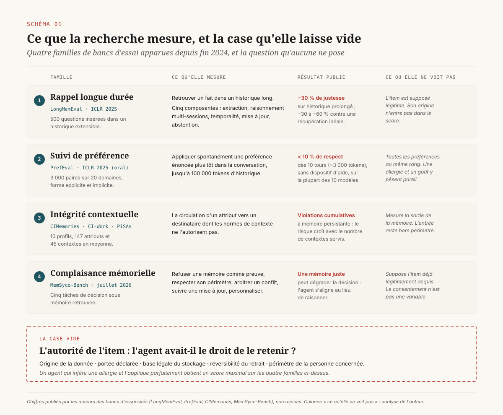
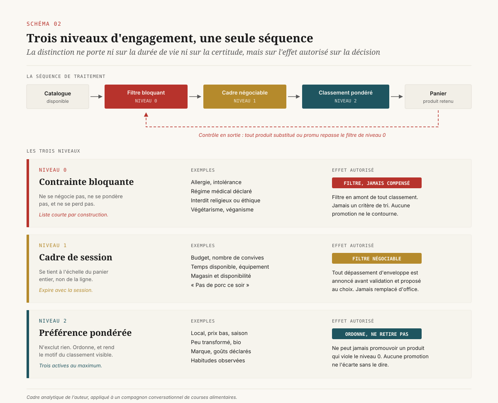
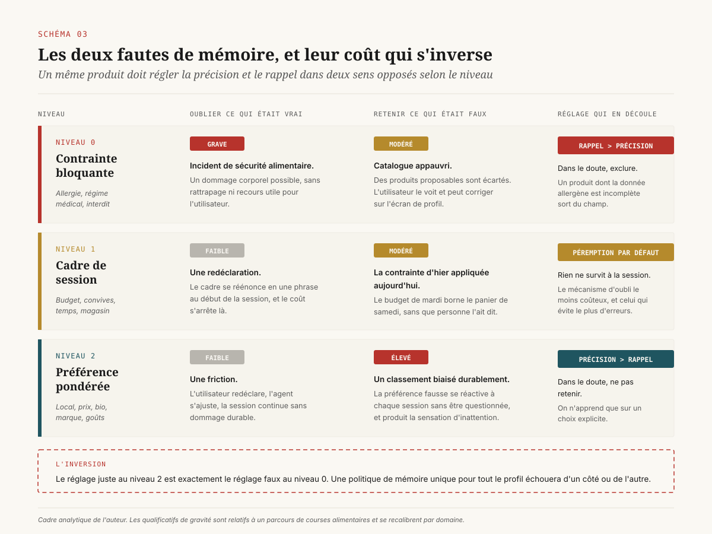
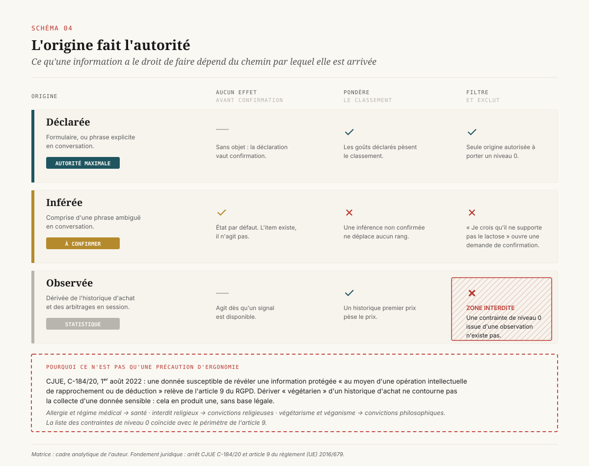
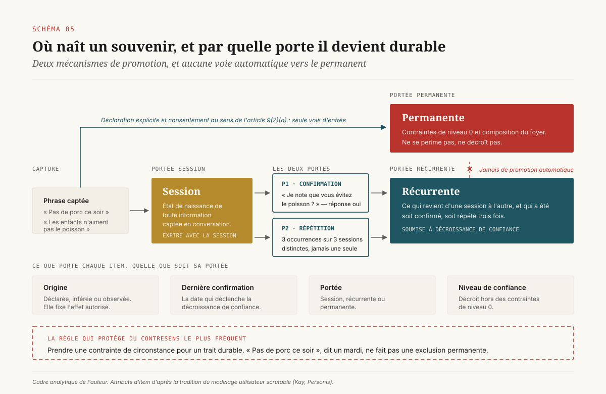
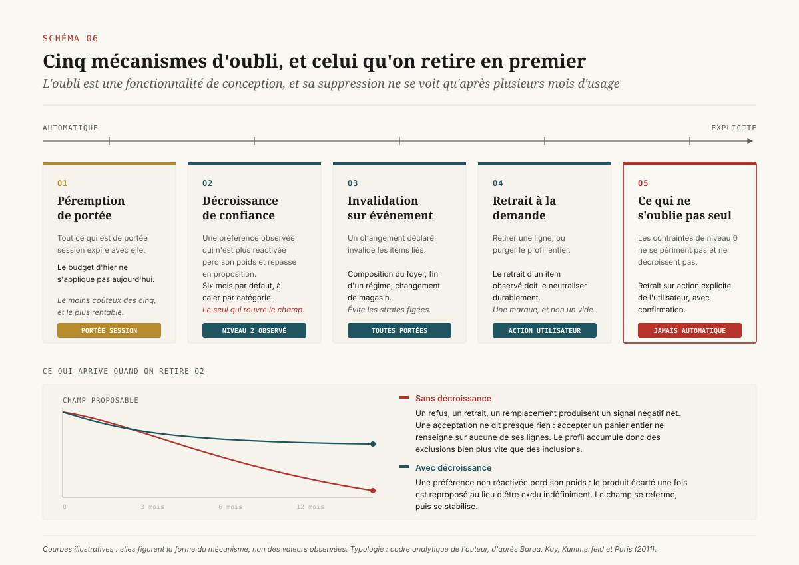
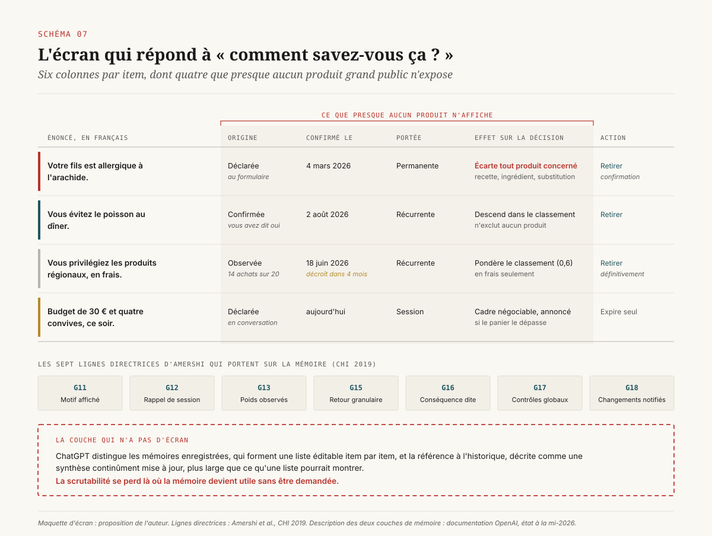
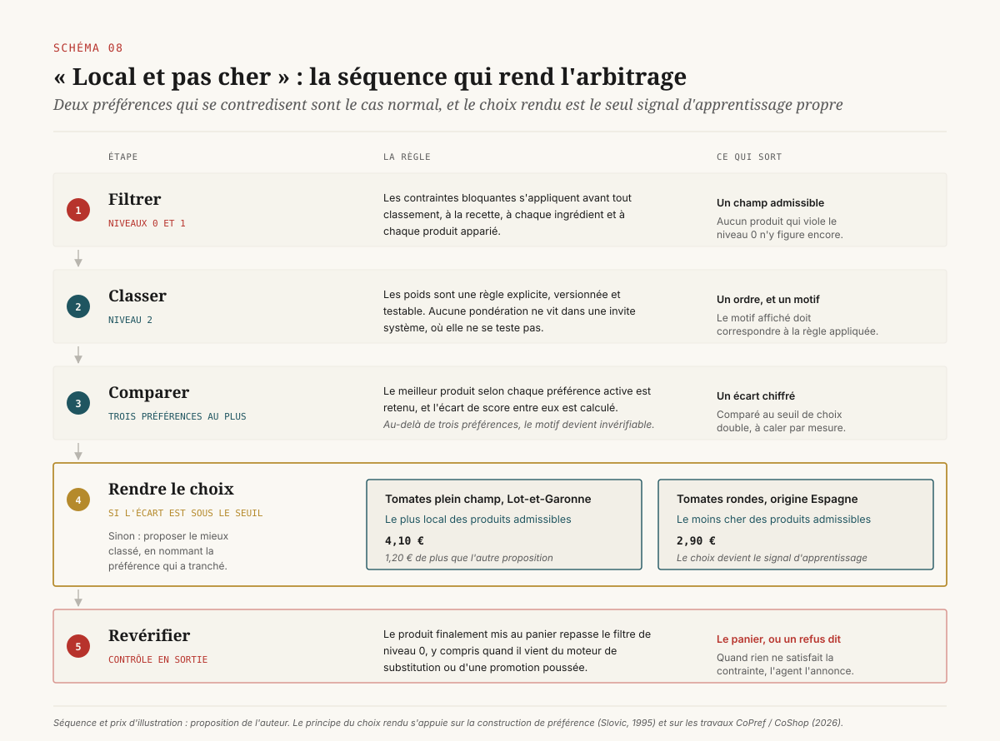

# Ce que l'agent a le droit de retenir

> **La mémoire d'un agent conversationnel est un régime d'autorités avant d'être un système de stockage : les informations dont il a le plus besoin pour ne pas nuire sont exactement celles que le droit lui interdit d'inférer.** — 19 août 2026, Mathieu Guglielmino

## Synthèse exécutive

- **La recherche mesure le rappel, pas le droit de retenir.** Les quatre familles de bancs d'essai apparues depuis fin 2024 (rappel longue durée, suivi de préférence, intégrité contextuelle, complaisance mémorielle) évaluent si l'agent retrouve, applique et ne surinterprète pas ce qu'il a stocké. Aucune ne vérifie qu'il avait le droit de le stocker. Cette case vide est le champ de conception qui reste ouvert aux équipes produit.
- **Les résultats disponibles sont mauvais et convergents.** Sur PrefEval (ICLR 2025), le taux de respect d'une préférence exprimée tombe sous 10 % après dix tours de conversation pour la plupart des modèles évalués[^1]. Sur LongMemEval, les assistants commerciaux perdent 30 % de justesse sur un historique prolongé, et jusqu'à 60 % par rapport à une récupération idéale[^2]. Un agent qui oublie une préférence de confort est agaçant ; le même mécanisme appliqué à une allergie est un incident.
- **Trois niveaux d'engagement, trois politiques d'erreur opposées.** Une contrainte bloquante filtre avant tout classement et ne se compense jamais. Un cadre de session (budget, convives, temps) se négocie et s'annonce. Une préférence pondérée ordonne sans retirer. Les régler avec la même politique de mémoire est la faute de conception la plus fréquente, parce que le coût d'un oubli et celui d'un faux souvenir s'inversent d'un niveau à l'autre.
- **L'origine d'une information détermine ce qu'elle a le droit de faire.** Le déclaré peut filtrer. L'observé pondère et ne filtre jamais. L'inféré n'a aucun effet avant confirmation. Ce n'est pas une précaution de conception : depuis l'arrêt C-184/20 de la Cour de justice de l'Union européenne (1ᵉʳ août 2022), déduire une donnée de l'article 9 par « comparaison ou déduction » revient à traiter une donnée de l'article 9[^7].
- **La liste des contraintes bloquantes coïncide avec l'article 9 du RGPD.** Allergie et régime médical relèvent de la santé ; interdit religieux, végétarisme et véganisme relèvent des convictions. Les items dont l'agent a le plus besoin sont ceux qui exigent un consentement explicite, séparé et spécifique. Le renversement est structurant pour le calendrier d'un projet : le niveau de mémoire le plus utile est le plus coûteux à obtenir légalement.
- **L'oubli est une fonctionnalité, avec cinq mécanismes distincts.** Péremption de portée, décroissance de confiance, invalidation sur événement, retrait à la demande, et une zone qui ne décroît jamais. Sans décroissance, un profil qui n'apprend qu'à exclure finit par ne plus rien pouvoir proposer.
- **La scrutabilité se perd là où la mémoire devient utile sans être demandée.** ChatGPT expose une liste éditable de mémoires enregistrées et, à côté, une synthèse continue de l'historique qui n'est pas énumérable[^19]. C'est cette seconde couche qui produit la question « comment savez-vous ça ? », et c'est elle qui n'a pas d'écran.

## 1. Le rappel est mesuré, l'autorité ne l'est pas

La mémoire des agents est devenue un objet de recherche autonome entre fin 2024 et 2026. Quatre familles de bancs d'essai coexistent, et elles ne se recouvrent pas.

La première mesure le **rappel sur longue durée**. LongMemEval (ICLR 2025) construit 500 questions insérées dans des historiques de conversation extensibles, et découpe la capacité en cinq composantes : extraction d'information, raisonnement multi-sessions, raisonnement temporel, mise à jour de connaissance, et abstention. Le résultat publié est une chute de 30 % de justesse pour les assistants commerciaux sur un historique prolongé, et un écart de 30 à 60 % par rapport à une condition de récupération idéale où seules les sessions pertinentes sont fournies[^2]. L'écart entre les deux chiffres dit où est la difficulté : trouver l'information dans le bruit, plus que la conserver.

La deuxième mesure le **suivi de préférence**. PrefEval (ICLR 2025, présenté en session orale) réunit 3 000 paires préférence-requête curées à la main sur 20 domaines, sous forme explicite et implicite, et teste dix modèles ouverts et propriétaires sur des conversations multi-sessions allant jusqu'à 100 000 tokens[^1]. Le chiffre à retenir pour un cadrage produit est le suivant : en configuration directe, sans dispositif d'aide, le taux de respect proactif d'une préférence énoncée passe sous 10 % dès dix tours, soit environ 3 000 tokens. Les auteurs testent des parades (invite enrichie, récupération augmentée, affinage) ; l'affinage sur le jeu améliore nettement, les deux autres ralentissent la dégradation sans l'annuler.

La troisième mesure l'**intégrité contextuelle**, au sens d'Helen Nissenbaum : une information circule correctement quand elle respecte les normes du contexte où elle a été partagée. CIMemories construit dix profils portant en moyenne 147 attributs et 45 contextes, et mesure l'accumulation des violations dans une mémoire persistante[^4]. CI-Work transpose la question aux agents d'entreprise branchés sur des messageries et des comptes rendus de réunion[^5], PiSAs aux systèmes multi-utilisateurs où la mémoire d'un collaborateur peut fuiter vers un autre[^6]. Ces trois bancs mesurent la circulation d'une information, non sa conservation.

La quatrième, apparue en juillet 2026, mesure la **complaisance mémorielle**. MemSyco-Bench part d'un constat que les trois familles précédentes laissaient de côté : une mémoire correctement stockée et correctement retrouvée peut quand même dégrader la décision, en poussant l'agent à s'aligner sur l'utilisateur au détriment de l'exactitude. Le banc décompose cinq tâches : refuser une mémoire comme preuve factuelle, respecter son périmètre d'application, arbitrer un conflit entre mémoire et évidence objective, suivre une mise à jour, et utiliser une mémoire valide pour personnaliser[^3].

*Schéma 1 — Quatre familles de bancs d'essai couvrent stocker, retrouver, appliquer et faire circuler. Aucune ne demande si l'agent avait le droit de retenir.*

Ces quatre familles couvrent le cycle stocker, retrouver, appliquer, circuler. La case vide est ailleurs. **Aucun de ces bancs d'essai ne vérifie que l'agent avait le droit de retenir ce qu'il a retenu.** Un modèle qui capte « je crois qu'il ne supporte pas le lactose » dans une phrase de conversation, en fait un attribut de profil permanent, et l'applique ensuite avec une fidélité parfaite obtiendra un score maximal sur LongMemEval et sur PrefEval. Il aura pourtant commis la faute de conception la plus lourde du dispositif : transformer une hypothèse en règle sans passer par l'utilisateur.

Cette absence n'est pas un oubli des chercheurs. Elle traduit une division du travail. Les bancs d'essai évaluent un composant technique dont l'entrée est un ensemble de faits supposés vrais. La question de savoir quels faits ont le droit d'entrer relève du modelage utilisateur et de l'interaction humain-machine, où elle est traitée depuis vingt-cinq ans sous le nom de **scrutabilité**, et sous une autre méthodologie : entretiens, sondes de conception, études de terrain. Les deux littératures se citent peu.

La conséquence pratique pour une équipe qui cadre un compagnon conversationnel : les métriques disponibles sur étagère mesurent le tiers du problème. Le reste se spécifie à la main, en écrivant des règles, et se vérifie sur un jeu d'évaluation construit pour le métier concerné.

## 2. Trois niveaux d'engagement

Une conversation de courses alimentaires produit, en quelques tours, des informations de nature radicalement différente. « Mon fils est allergique à l'arachide. » « Ce soir on est quatre, j'ai quarante minutes et trente euros. » « J'aime bien les produits locaux, et pas cher. » Un système qui les traite avec le même mécanisme de mémoire échouera sur les trois.

La distinction opérante porte sur **l'effet que l'information a le droit d'exercer sur la décision**, et non sur sa durée de vie ou son degré de certitude.

| Niveau | Nature | Exemples | Effet autorisé |
|---|---|---|---|
| **0** | Contrainte bloquante | Allergie, intolérance, régime médical, interdit religieux ou éthique déclaré, dont végétarisme et véganisme | Filtre en amont de tout classement, jamais compensé |
| **1** | Cadre de session | Budget, nombre de convives, temps disponible, équipement, magasin et disponibilité | Filtre négociable : tout dépassement est annoncé et proposé au choix |
| **2** | Préférence pondérée | Local, prix bas, peu transformé, bio, marque, goûts, saison | Ordonne le classement, ne retire rien du champ |

*Schéma 2 — Le filtre bloquant s'applique avant tout classement, et une seconde fois en sortie sur le produit réellement mis au panier.*

**Le niveau 0 filtre avant de classer.** Une contrainte bloquante n'est jamais un critère de tri, jamais compensée par un autre critère, jamais contournée par une mise en avant commerciale. Elle s'applique à la recette proposée, à chacun de ses ingrédients, au produit apparié, et au produit de remplacement suggéré en cas de rupture. Le contrôle vaut en sortie autant qu'en entrée : le produit finalement mis au panier est revérifié, y compris quand il vient d'un moteur de substitution automatique. C'est le point où la plupart des mises en œuvre cèdent, parce que le moteur de substitution est souvent un service antérieur au compagnon, appelé en aval, et jamais audité sous cet angle.

Quand aucune solution ne satisfait la contrainte, la réponse correcte est de le dire. Un agent qui dégrade une contrainte de niveau 0 pour produire une réponse a échangé une gêne contre un risque. La règle inverse, relâcher un critère de niveau inférieur et le dire, coûte une phrase.

**Le niveau 1 se tient à l'échelle du panier.** Le budget est une enveloppe : dépasser sur un article et rattraper ailleurs est un comportement souhaitable, à condition de l'énoncer. Un dépassement d'enveloppe, lui, se signale avant validation et propose un choix. Le remplacement d'office est la faute caractéristique de ce niveau, et elle détruit plus de confiance qu'elle n'en économise en fluidité.

**Le niveau 2 n'exclut rien.** Une préférence ordonne. Elle ne peut jamais promouvoir un produit qui viole une contrainte de niveau 0, et une mise en avant commerciale ne peut jamais écarter une préférence sans le dire.

La liste du niveau 0 est courte par construction. Tout ce qui y entre devient bloquant, donc tout ce qui y entre réduit le catalogue proposable. Le budget n'en fait pas partie. Le goût encore moins. Une équipe qui laisse le niveau 0 s'élargir au fil des ateliers obtiendra un compagnon qui ne propose plus rien, et qui aura l'air de mal fonctionner alors qu'il applique exactement ce qu'on lui a demandé.

## 3. Les coûts d'erreur ne sont pas symétriques

Deux fautes de mémoire existent : oublier ce qui était vrai, et retenir ce qui ne l'était pas. Leur coût s'inverse selon le niveau, et cette inversion commande deux réglages opposés dans le même produit.

*Schéma 3 — Le réglage juste au niveau 2 est le réglage faux au niveau 0. Une politique de mémoire unique pour tout le profil échouera d'un côté ou de l'autre.*

Au **niveau 2**, oublier une préférence coûte une friction. L'utilisateur redéclare, l'agent s'ajuste, la session continue. Retenir une préférence fausse coûte davantage : elle se réactive à chaque session, elle oriente le classement sans que personne ne la questionne, et elle produit la sensation caractéristique de ne pas être écouté. Le réglage correct privilégie donc la **précision** sur le rappel : dans le doute, ne pas retenir.

Au **niveau 0**, l'inversion est complète. Oublier une allergie est un incident de sécurité alimentaire. Retenir une contrainte bloquante fausse coûte un appauvrissement du catalogue et une demande de correction. Les deux ne sont pas comparables. Le réglage correct privilégie le **rappel** sur la précision : dans le doute sur la donnée produit, exclure.

Cette règle du doute a un coût commercial direct et mesurable. Un produit dont la donnée allergène est incomplète dans le référentiel est écarté du champ des propositions, et non proposé assorti d'un avertissement. La part des produits écartés pour donnée manquante devient alors un indicateur double : elle mesure la sélectivité du filtre et la qualité du référentiel produit, et elle donne à la direction de l'enseigne un chiffre pour arbitrer un investissement de complétude qu'aucun autre dispositif ne rendait visible.

Deux conséquences d'organisation en découlent.

La première touche à l'emplacement du contrôle. Un filtre de niveau 0 exprimé dans l'invite système du modèle est une préférence de génération et non une garantie. La littérature sur les garde-fous distingue nettement la validation déterministe, placée en amont et en aval de l'appel au modèle, du façonnage par invite qui oriente sans imposer de frontière de contrôle. Pour une contrainte dont l'échec produit un dommage corporel, seule la première convient. L'épisode de l'assistant de recettes d'un distributeur néo-zélandais, en août 2023, qui a proposé sous le nom d'« aromatic water mix » une préparation dégageant du chlore gazeux à partir d'eau, d'eau de Javel et d'ammoniaque, illustre le régime d'un dispositif dont les protections vivaient dans la génération[^22].

La seconde touche à la preuve. Un garde-fou de niveau 0 se démontre sur un jeu d'évaluation métier, construit avec les équipes de l'enseigne, rejoué à chaque livraison, avec un objectif de zéro défaut. Un jeu d'évaluation générique ne sert à rien ici : la difficulté porte sur des appariements produits, des dénominations commerciales et des traces d'allergènes propres au catalogue.

## 4. L'origine fait l'autorité

Une même phrase peut arriver à l'agent par trois chemins, et ces trois chemins ne confèrent pas les mêmes droits.

| Origine | Comment elle se capte | Autorité | Effet autorisé |
|---|---|---|---|
| **Déclarée** | Formulaire, ou phrase explicite en conversation | Maximale | Filtre et classement, niveau 0 compris |
| **Inférée** | Comprise d'une phrase ambiguë en conversation | Faible, à confirmer | Aucun avant confirmation |
| **Observée** | Dérivée de l'historique d'achat et des arbitrages en session | Statistique | Classement seulement, jamais filtre |

*Schéma 4 — L'observation pondère, elle n'exclut jamais. La zone interdite est aussi une règle de droit depuis l'arrêt C-184/20 de la CJUE.*

La règle porteuse tient en une phrase : **l'automatique n'a pas le droit d'exclure**. Il pondère, il propose, il ne retire rien du champ. Une contrainte de niveau 0 issue d'une observation n'existe pas. Un historique d'achat sans viande pendant six mois ne fait pas un végétarien : il fait une hypothèse, dont la confirmation appartient à l'utilisateur.

Cette règle est habituellement défendue comme une précaution d'ergonomie. Elle est d'abord une obligation.

### 4.1 Inférer une donnée sensible, c'est la traiter

Le 1ᵉʳ août 2022, la Cour de justice de l'Union européenne a jugé, dans l'affaire C-184/20 (*OT contre Vyriausioji tarnybinės etikos komisija*), que la publication de données révélant indirectement l'orientation sexuelle d'une personne constitue un traitement de catégories particulières de données au sens de l'article 9(1) du RGPD. Le raisonnement suivi porte tout l'effet : des données susceptibles de révéler une information protégée « au moyen d'une opération intellectuelle de rapprochement ou de déduction » relèvent de l'article 9, une lecture restrictive ne servant pas l'objectif de protection de la disposition[^7].

Transposé à un compagnon de courses, l'énoncé est direct. Dériver « végétarien » d'un historique d'achat n'est pas une manière d'éviter de collecter une donnée sensible. C'est une manière d'en produire une, sans base légale, sans information de la personne, et sans le consentement explicite que l'article 9(2)(a) exige.

### 4.2 La liste des contraintes bloquantes coïncide avec l'article 9

Le tableau du niveau 0 mérite une seconde lecture, juridique cette fois.

| Contrainte de niveau 0 | Catégorie de l'article 9 |
|---|---|
| Allergie, intolérance | Données concernant la santé |
| Régime médical déclaré | Données concernant la santé |
| Interdit religieux déclaré | Convictions religieuses |
| Végétarisme, véganisme | Convictions philosophiques |

La correspondance est complète. Elle n'a rien d'accidentel : ce qui rend une contrainte non négociable pour l'utilisateur est ce qui la rattache à son intégrité physique ou à ses convictions, soit les deux fondements de l'article 9. La CNIL retient d'ailleurs qu'un simple champ « régime alimentaire » sur un formulaire d'inscription relève de l'article 9, la qualification s'appréciant au regard de ce que la donnée révèle et non de son intitulé[^8].

Le renversement est structurant pour la conduite d'un projet. **Les items de mémoire dont l'agent a le plus besoin pour ne pas nuire sont exactement ceux qu'il n'a pas le droit de conserver par défaut.** Leur base légale est le consentement explicite au sens de l'article 9(2)(a), qui suppose un acte séparé et spécifique : une case décochée par défaut, une acceptation générale des conditions générales ou un silence ne valent pas consentement[^8].

Trois conséquences opérationnelles, à porter au cadrage plutôt qu'à la recette :

1. **Le formulaire de contraintes est un parcours de consentement**, avec sa propre information, sa propre trace, et son propre retrait. Il ne se glisse pas dans un écran de préférences.
2. **La capture conversationnelle d'une contrainte de niveau 0 ne peut pas être silencieuse.** « Je crois qu'il ne supporte pas le lactose » ouvre une demande de confirmation explicite avant tout enregistrement. Sans cette confirmation, l'agent n'a ni la donnée ni le droit.
3. **Un projet sans accès aux consentements n'a pas de niveau 0 persistant.** Il peut avoir un niveau 0 de session, déclaré au début de la conversation et détruit à la fin, ce qui suffit à démontrer l'expérience. Cette contrainte détermine le contenu d'un premier lot bien plus sûrement qu'un arbitrage d'ambition.

### 4.3 Le périmètre est le foyer, pas le compte

Une allergie porte sur un convive et non sur le titulaire du compte. Un agent qui ne sait pas pour qui il cuisine ce soir applique une contrainte au mauvais périmètre, dans un sens ou dans l'autre. Tant que la gestion par convive n'existe pas, la règle par défaut sûre est d'appliquer toutes les contraintes du foyer à toutes les sessions : le coût est un catalogue plus étroit, l'erreur inverse est un incident.

Cette question rejoint celle que PiSAs mesure sur les systèmes multi-utilisateurs[^6] : dès qu'une mémoire porte sur plusieurs personnes, savoir de qui parle un item devient une condition de correction, et pas seulement de confidentialité.

## 5. La portée, et le moment de la question

Chaque élément du profil porte quatre attributs : son origine, sa date de dernière confirmation, son niveau de confiance, et sa **portée**. La portée est le point de conception le plus rentable, parce qu'elle sépare ce qui vaut pour ce soir de ce qui vaut toujours.

- **Session** : le budget, le nombre de couverts, l'envie du jour, « pas de porc ce soir ». Ne survit pas à la session par défaut.
- **Récurrente** : ce qui revient, « les enfants ne mangent pas de poisson ». Persisté après confirmation ou répétition.
- **Permanente** : les contraintes de niveau 0 et la composition du foyer.

**Toute information captée en conversation naît en portée session.** Cette règle protège du contresens le plus fréquent en production : prendre une contrainte de circonstance pour un trait durable. « Pas de porc ce soir » énoncé un mardi de repas partagé devient, sans elle, une exclusion permanente que personne n'a demandée et que l'utilisateur découvrira des semaines plus tard, sans comprendre d'où elle vient.

*Schéma 5 — Toute information captée en conversation naît en portée session. Deux portes mènent au récurrent, et aucune ne mène automatiquement au permanent.*

Deux mécanismes seulement font sortir un item de la portée session.

**P1 — Promotion sur confirmation.** Une inférence devient récurrente quand l'utilisateur répond oui à une question posée en clair : « Je note que vous évitez le poisson ? » La question se pose en fin de session réussie, jamais en interruption d'un parcours d'achat.

**P2 — Promotion sur répétition.** À défaut de confirmation, trois occurrences sur trois sessions distinctes déclenchent la proposition de persistance. Trois occurrences dans une même session n'en font qu'une : la répétition intra-session mesure l'insistance sur un sujet et non la stabilité d'un trait.

### 5.1 Le moment de la question se calcule

Le placement de la question de confirmation est le point où la conception d'interaction apporte le plus, et où l'intuition trompe le plus. Eric Horvitz en a donné la formulation de référence en 1999 : une action automatique ne se justifie que si son utilité espérée dépasse celle de l'inaction, ce qui définit un seuil de probabilité au-delà duquel agir devient rationnel, et en deçà duquel la bonne conduite est de demander[^10]. Le coût de l'interruption entre dans le calcul au même titre que le bénéfice de la personnalisation.

Trois quantités gouvernent le seuil dans un compagnon de courses :

- la **probabilité** que l'inférence soit juste, estimée par le nombre et la nature des occurrences ;
- le **gain** attendu si elle est juste, qui dépend du niveau : nul au niveau 0, où seule la déclaration compte, et modéré au niveau 2, où une préférence de plus déplace un classement à la marge ;
- le **coût de l'interruption**, qui varie de un à dix selon l'endroit du parcours. Une question posée pendant la constitution du panier détourne d'une tâche en cours ; la même question posée après validation ne coûte presque rien.

Les lignes directrices d'Amershi et de ses coauteurs (CHI 2019), qui codifient plus de 150 recommandations antérieures en dix-huit règles validées auprès de 49 praticiens du design sur vingt produits, retiennent la même idée sous une forme utilisable en revue de conception : G3, « chronométrer les services en fonction du contexte », demande de choisir le moment d'agir ou d'interrompre en fonction de la tâche en cours[^9].

L'erreur de production correspondante est facile à nommer et fréquente à observer : poser la question de persistance au moment où l'agent capte l'information, parce que le code en dispose à cet instant. Le moment où le code dispose de l'information et le moment où l'utilisateur peut y répondre sans coût ne coïncident pas.

### 5.2 Aucune écriture invisible

Rien n'entre au profil sans que l'utilisateur puisse le voir, le corriger et le retirer. C'est une exigence des articles 15 et 16 du RGPD, et c'est aussi la condition de confiance dont un parcours transactionnel a besoin. La règle a une conséquence d'architecture qu'on découvre tard si on ne l'écrit pas au départ : **tout item de profil doit être formulable en français dans l'écran de profil**. Un attribut dérivé qu'on ne sait pas énoncer en une phrase compréhensible ne peut pas être exposé, donc ne peut pas être corrigé, donc ne devrait pas influencer une proposition.

Enfin, la réinjection des signaux conversationnels vers une plateforme de données clients relève d'une finalité distincte, soumise à un consentement dédié. Régime, budget, composition du foyer et contraintes de santé sont sensibles ou quasi sensibles. Le point de conception qui compte : ce consentement conditionne l'usage en activation marketing et non l'usage en session. Refuser l'activation ne doit pas dégrader le compagnon. Lier les deux transforme une préférence de confidentialité en péage, ce que la notion d'intégrité contextuelle décrit comme la violation type : une information partagée dans le contexte « je cuisine ce soir » circule vers le contexte « campagne de relance », où ses normes de circulation sont différentes[^4].

## 6. L'oubli est une fonctionnalité

L'oubli est traité, dans la plupart des systèmes en production, comme une défaillance à corriger. La recherche en interaction humain-machine le traite depuis longtemps comme un objet de conception à part entière. Barua, Kay, Kummerfeld et Paris ont proposé dès 2011 des fondements théoriques pour un oubli contrôlé par l'utilisateur dans les modèles utilisateurs de longue durée, en partant des formes de l'oubli humain pour en dériver des mécanismes de système[^12]. Un relevé récent de la littérature en IHM et en travail coopératif souligne que, même dans les travaux consacrés à l'oubli, la pente reste la conception pour la rétention, l'oubli étant fréquemment mis en scène plutôt qu'implémenté[^18].

Cinq mécanismes, du plus automatique au plus explicite.

*Schéma 6 — Du plus automatique au plus explicite. La décroissance de confiance est le seul mécanisme qui rouvre le champ des propositions.*

**O1 — Péremption de portée.** Tout ce qui est de portée session expire avec elle. Le budget d'hier ne s'applique pas à aujourd'hui. Mécanisme le moins coûteux et le plus rentable des cinq, parce qu'il évite la majorité des faux souvenirs sans aucune décision.

**O2 — Décroissance de confiance.** Une préférence observée qui n'est pas réactivée depuis un délai donné perd son poids et repasse en proposition. Six mois est une valeur de départ raisonnable pour l'alimentaire, à caler par catégorie : une préférence de produits frais se renouvelle plus vite qu'une préférence d'épicerie. La littérature sur la dimension temporelle des systèmes de recommandation documente ces schémas de pondération décroissante et leur effet sur la fraîcheur des propositions[^24].

**O3 — Invalidation sur événement.** Un changement déclaré, composition du foyer, fin d'un régime, changement de magasin, invalide les items qui en dépendent au lieu de les laisser coexister avec le nouveau. Sans ce mécanisme, un profil accumule des strates contradictoires dont aucune ne se sait périmée.

**O4 — Retrait à la demande, unitaire ou global.** Retirer une ligne, ou purger le profil. Le point qui décide de la crédibilité du dispositif : **le retrait unitaire d'un item observé doit le neutraliser durablement**. S'il se reforme à la prochaine occurrence parce que le mécanisme d'observation le redérive, l'utilisateur a la preuve que sa correction n'a servi à rien. Techniquement, cela impose de stocker une marque de retrait distincte de l'absence d'item, une distinction qu'on ne rattrape pas facilement après coup.

**O5 — Ce qui ne s'oublie jamais tout seul.** Les contraintes de niveau 0 ne se périment pas et ne décroissent pas. Elles ne se retirent que sur action explicite de l'utilisateur, avec confirmation. Une allergie oubliée par décroissance serait un défaut de sécurité produit par un mécanisme conçu pour la commodité.

### 6.1 Le cliquet d'exclusion

Le mécanisme O2 est celui qu'on retire en premier quand le calendrier se tend, et c'est une erreur qui ne se voit qu'après plusieurs mois d'usage.

Un profil apprend presque toujours de façon asymétrique. Un refus, un retrait de panier, un remplacement produisent un signal négatif net et facile à capter. Une acceptation ne dit presque rien : accepter un panier entier ne renseigne sur aucune de ses lignes en particulier. Le profil accumule donc des exclusions bien plus vite que des inclusions. À six mois, le champ des propositions s'est rétréci sans qu'aucune décision ne l'ait décidé, et le compagnon devient à la fois répétitif et pauvre. **La décroissance est le seul mécanisme qui rouvre le champ**, en reproposant un produit écarté une fois plutôt qu'en l'écartant indéfiniment.

Une règle d'apprentissage complète le dispositif : on n'apprend que sur un choix explicite. Un remplacement, un retrait ou un choix entre deux propositions ajustent les poids. L'acceptation d'un panier entier ne les ajuste pas.

## 7. La surface de contrôle

La question que redoute une équipe produit n'est pas « pourquoi ne vous souvenez-vous pas ? ». C'est « comment savez-vous ça ? ». La première coûte une redéclaration. La seconde coûte la confiance, et elle est provoquée par le mécanisme même qui rend la mémoire agréable : la capture implicite.

### 7.1 Scrutabilité

Judy Kay a introduit le terme de *scrutable user model* dans ses travaux de 1998, et l'a développé pendant vingt ans autour du cadre logiciel Personis. Le choix du mot est délibéré et vaut encore : *scrutable* décrit l'effort que la personne investit pour comprendre le système, là où *transparent* décrit une propriété que la machine s'attribue[^11]. Un profil scrutable s'interroge, se comprend et se corrige. Un profil dont on assure qu'il est ouvert ne permet aucun des trois.

Un travail de terrain récent montre l'écart qui subsiste. Jones et ses coauteurs (CHI 2025) ont interrogé des utilisateurs d'outils dotés de mémoire et analysé les discussions publiques sur ces usages : les modèles mentaux sont incomplets, les gens ne savent ni comment l'agent retient ni comment ses souvenirs modifient son comportement[^14]. Une étude par entretiens semi-directifs auprès de 40 participants aboutit au même diagnostic, avec deux résultats utilisables : la faible conscience du risque est le premier obstacle, et le contrôle proactif de la confidentialité est le besoin le plus souvent exprimé[^15].

Deux sondes de conception donnent le vocabulaire d'interface correspondant. Memory Sandbox (UIST 2023) traite les souvenirs comme des **objets manipulables** : visibles, éditables, ajoutables, supprimables, déplaçables d'une conversation à l'autre, de sorte que ce que l'utilisateur voit à l'écran corresponde à ce que le modèle voit en entrée[^13]. MemoAnalyzer y ajoute la détection et la visualisation de l'information sensible contenue dans les souvenirs accumulés, avec une invitation à modifier[^15].

*Schéma 7 — Six colonnes par item, dont quatre que presque aucun produit grand public n'expose. La couche implicite reste sans écran.*

### 7.2 Ce que les produits grand public exposent, et ce qu'ils n'exposent pas

L'état des trois assistants grand public, à la mi-2026, est instructif parce qu'il montre exactement où la scrutabilité se perd.

ChatGPT distingue deux couches. Les **mémoires enregistrées** forment une liste de faits que l'utilisateur peut ouvrir, éditer et supprimer un à un. La **référence à l'historique de conversation** est décrite par OpenAI comme une synthèse continûment mise à jour du contexte des échanges passés, plus large que ce qu'une liste d'items pourrait montrer, et dont les éléments évoluent avec le temps[^19]. Les deux couches se désactivent séparément dans les réglages. Une seule s'énumère.

Claude expose une mémoire cloisonnée par projet, un résumé de mémoire éditable présenté comme la synthèse réellement utilisée, et un mode de conversation qui n'écrit pas en mémoire[^20]. Le cloisonnement par projet est une réponse directe au problème d'intégrité contextuelle : il empêche par construction qu'un souvenir formé dans un contexte s'applique dans un autre.

La leçon de conception tient dans la comparaison. **La couche qui produit la question « comment savez-vous ça ? » est celle qui n'a pas d'écran**, parce qu'une synthèse continue ne s'énumère pas en items. Un compagnon de courses qui reprend l'architecture à deux couches sans traiter ce point hérite du problème sans hériter du volume d'usage qui, chez un assistant généraliste, le rend tolérable.

### 7.3 Les quatre écrans à spécifier

Les lignes directrices d'Amershi et de ses coauteurs fournissent la liste de contrôle la plus directement utilisable en revue de conception, et sept des dix-huit règles portent sur la mémoire et l'apprentissage[^9] :

| Règle | Énoncé | Traduction dans un compagnon de courses |
|---|---|---|
| G11 | Expliciter pourquoi le système a fait ce qu'il a fait | Le motif de classement affiché sur chaque proposition |
| G12 | Se souvenir des interactions récentes | Le rappel du cadre de session sans redéclaration |
| G13 | Apprendre du comportement de l'utilisateur | Les poids dérivés de l'historique, au niveau 2 seulement |
| G15 | Encourager un retour granulaire | Le remplacement et le retrait comme signaux, au lieu d'un pouce |
| G16 | Transmettre les conséquences des actions | « J'en tiens compte pour les prochaines fois » au moment du retrait |
| G17 | Fournir des contrôles globaux | L'écran de profil, et l'interrupteur de mémoire |
| G18 | Notifier les changements | La trace des items ajoutés depuis la dernière visite |

Un écran de profil qui satisfait ces règles porte six colonnes pour chaque item : l'énoncé en français, l'origine, la date de dernière confirmation, la portée, l'effet qu'il exerce, et l'action de retrait. Les trois colonnes du milieu sont celles que presque aucun produit n'affiche, et ce sont celles qui répondent à la question posée.

## 8. Rendre l'arbitrage visible

« Je veux des produits locaux, et pas cher. » Les deux ne désignent pas le même produit, et c'est le cas normal.

Un système qui tranche en silence produit une proposition correcte et une confiance nulle, parce que l'utilisateur ne peut ni vérifier ni contester. Un système qui rend l'arbitrage produit une occasion d'apprentissage : le choix de l'utilisateur entre deux propositions motivées est le signal le plus propre que le dispositif puisse récolter.

*Schéma 8 — Filtrer sur les niveaux bloquants, classer selon les poids, comparer, rendre le choix quand l'écart est serré, revérifier en sortie.*

La séquence tient en cinq temps : filtrer sur les niveaux 0 et 1, classer selon les poids du profil, comparer les meilleurs candidats de chaque préférence, rendre le choix quand l'écart passe sous un seuil, revérifier le produit retenu contre les contraintes bloquantes. Le quatrième temps est celui qui distingue un compagnon d'un moteur de recommandation : « le plus local, 1,20 € de plus » contre « le moins cher », avec l'écart chiffré et le motif de chaque option.

Trois règles encadrent le dispositif.

**Aucune pondération implicite.** Les poids sont une règle explicite, versionnée et testable, jamais une consigne laissée au modèle. C'est ce qui rend l'arbitrage explicable à l'utilisateur et vérifiable en interne. Un poids qui vit dans une invite système ne se teste pas et ne se justifie pas.

**Le motif affiché doit être vrai.** Un motif de classement qui ne correspond pas à la règle appliquée est un défaut au même titre qu'une erreur d'allergène. Il est plus difficile à détecter, parce qu'il ne produit ni plainte ni incident, et il détruit exactement la ressource que le dispositif cherche à construire.

**Le poids par défaut vient du comportement observé.** Un historique majoritairement premier prix pèse le prix ; un historique de produits régionaux pèse le local. À défaut d'historique exploitable, un jeu de poids par défaut d'enseigne s'applique, le même pour tous, ce qui est honnête et démontrable dans un premier lot sans donnée client.

### 8.1 Les préférences se construisent, elles ne se révèlent pas

Une hypothèse implicite traverse la plupart des dispositifs de personnalisation : l'utilisateur possède des préférences stables qu'il suffirait d'extraire. La recherche en décision comportementale a documenté le contraire depuis trente ans. Paul Slovic a montré que les gens ne disposent pas d'un ordre de préférences complet en attente de révélation, et qu'ils le construisent au moment où on les interroge, avec les éléments que la question rend saillants ; des méthodes d'élicitation normativement équivalentes produisent des réponses systématiquement différentes[^17].

Un travail de 2026 de Stanford transpose l'argument aux agents. Saracay, Schmidt et Guestrin partent du constat que l'hypothèse de l'utilisateur expert est irréaliste : sur un attribut qu'il ne connaît pas, l'utilisateur ne peut pas répondre avant que l'agent ne lui donne de quoi former une préférence, par exemples ou par explications. Ils formalisent un modèle de construction de préférence, CoPref, appuyé sur la distinction recherche / expérience / croyance issue de l'économie de l'information, et un banc d'essai interactif, CoShop. Le résultat mesuré : sur cinq modèles de pointe, aucun agent ne dépasse 56 % de justesse après cinq tours d'échange, et l'échec vient de ce que l'interaction n'élargit presque pas ce que l'utilisateur sait de ce qu'il veut[^16].

La conséquence pour la conception d'un compagnon de courses est directe et peu coûteuse. Une question de la forme « préférez-vous le local ou le prix ? » posée à froid produit une réponse construite sur place, instable, et souvent démentie par le comportement. Le même arbitrage rendu sur un choix concret, avec deux produits, deux motifs et un écart de prix chiffré, produit une réponse ancrée dans une situation. Le second dispositif coûte moins cher que le premier et vaut davantage.

### 8.2 Le nombre de préférences actives est un paramètre de lisibilité

Au-delà de trois préférences pondérées actives, le classement devient illisible et le motif affiché incompréhensible. Trois est une proposition de départ, à valider en atelier, mais l'ordre de grandeur importe : un dispositif qui laisse activer huit préférences produira des motifs que personne ne pourra vérifier, ce qui ramène au défaut décrit plus haut.

## 9. Ce qui se décide, et dans quel ordre

Les décisions de ce dossier ne se répartissent pas par difficulté technique. Elles se répartissent par **réversibilité**, et l'ordre correct commence par les moins réversibles.

### 9.1 Trois décisions peu réversibles

**La liste du niveau 0.** Elle détermine la base légale du produit, le parcours de consentement, et la largeur du catalogue proposable. Elle s'écrit une fois, avec la direction juridique, et elle se restreint plus difficilement qu'elle ne s'élargit. À instruire en particulier : le niveau de responsabilité assumé par le distributeur sur l'affichage allergène dans un parcours conversationnel, et le coût commercial assumé de la règle « doute égale exclusion ».

**Le modèle de portée.** Faire naître toute information captée en portée session est un choix d'architecture qui se paie au premier jour et se rattrape difficilement ensuite. Un système qui persiste par défaut et filtre après coup ne redevient pas un système qui persiste sur confirmation.

**La marque de retrait.** Distinguer « item absent » de « item retiré par l'utilisateur » coûte un champ au premier jour et une reprise de données ensuite.

### 9.2 Trois décisions réversibles, à caler par mesure

Le seuil d'écart qui déclenche le choix double, le délai de décroissance par catégorie, et le nombre de préférences actives simultanément se règlent par observation. Ils se posent en atelier et se tranchent sur données.

### 9.3 Trois paliers

| Palier | Mémoire | Ce qui se démontre |
|---|---|---|
| **Démonstration** | Profil de session seulement, rien de persisté | L'expérience complète, sans donnée client ni consentement |
| **Premier produit** | Profil persisté, promotion sur confirmation, écran de consultation et de retrait, consentement dédié pour la réinjection | La personnalisation, avec sa surface de contrôle |
| **Produit** | Poids observés, décroissance, invalidation sur événement, gestion par convive | La mémoire qui vieillit correctement |

Le palier de démonstration mérite d'être défendu. Un profil de session suffit à montrer l'intégralité de l'expérience conversationnelle, sans accès à l'historique d'achat, sans consentement, et sans authentification dans la conversation. Ce n'est pas une version dégradée : c'est la version qui ne dépend d'aucun prérequis non instruit.

### 9.4 Six mesures

1. **Défauts sur le jeu d'évaluation allergènes**, à chaque livraison. Cible : zéro.
2. **Part des produits écartés pour donnée manquante**, qui mesure la qualité du référentiel autant que la sélectivité du filtre.
3. **Nombre de redéclarations d'une information déjà connue**, indicateur d'échec direct de la mémoire.
4. **Taux de correction et de retrait sur l'écran de profil**, qui mesure la justesse de l'inférence. Un taux nul dit qu'aucun utilisateur n'ouvre l'écran.
5. **Taux de reprise de l'arbitrage rendu**, qui dit si le choix double sert ou s'il ralentit.
6. **Part des sessions qui repartent d'un profil non vide**, indicateur d'adoption de la mémoire elle-même.

## 10. Conclusion

Les benchmarks publiés entre fin 2024 et l'été 2026 disent une chose utile et une chose trompeuse. L'utile : la mémoire des agents actuels est fragile, et sa fragilité augmente avec la longueur de l'historique, de façon mesurée et reproductible. La trompeuse : ils suggèrent que le problème se résoudra par de meilleurs mécanismes de récupération.

Un compagnon qui atteindrait 100 % sur LongMemEval et 100 % sur PrefEval pourrait encore commettre chacune des fautes décrites dans ce dossier. Il pourrait inférer une allergie et l'appliquer, persister une contrainte de circonstance, accumuler des exclusions sans jamais les rouvrir, et ne rien exposer de tout cela dans un écran. Aucun de ces comportements n'est un défaut de rappel. Ce sont des défauts d'autorité, de portée, de décroissance et de scrutabilité, et ils se corrigent par des règles écrites en dehors du modèle.

L'échéance qui vient les rendra opposables. Le règlement européen sur l'intelligence artificielle entre en application par paliers d'ici 2027, et les obligations relatives aux données et à la transparence concernent le déployeur autant que le fournisseur du modèle. Une équipe qui aura écrit, versionné et testé son régime d'autorités mémorielles aura produit la documentation de conformité en même temps que le produit. Celle qui aura laissé ces règles vivre dans une invite système devra les reconstituer à partir d'un texte qu'aucun test ne couvre.

## Sources

[^1]: Siyan Zhao, Mingyi Hong, Yang Liu, Devamanyu Hazarika, Kaixiang Lin, « Do LLMs Recognize Your Preferences? Evaluating Personalized Preference Following in LLMs », ICLR 2025 (session orale), arXiv:2502.09597. https://arxiv.org/abs/2502.09597
[^2]: Di Wu et al., « LongMemEval: Benchmarking Chat Assistants on Long-Term Interactive Memory », ICLR 2025, arXiv:2410.10813. https://arxiv.org/abs/2410.10813
[^3]: « MemSyco-Bench: Benchmarking Sycophancy in Agent Memory », arXiv:2607.01071, juillet 2026. https://arxiv.org/abs/2607.01071
[^4]: « CIMemories: A Compositional Benchmark for Contextual Integrity of Persistent Memory in LLMs », arXiv:2511.14937, novembre 2025. https://arxiv.org/abs/2511.14937
[^5]: « CI-Work: Benchmarking Contextual Integrity in Enterprise LLM Agents », arXiv:2604.21308, 2026. https://arxiv.org/abs/2604.21308
[^6]: « PiSAs: Benchmarking Contextual Integrity in Multi-User Agentic Systems », arXiv:2607.05318, 2026. https://arxiv.org/abs/2607.05318
[^7]: Cour de justice de l'Union européenne, affaire C-184/20, *OT contre Vyriausioji tarnybinės etikos komisija*, arrêt du 1ᵉʳ août 2022 (EUR-Lex CELEX 62020CJ0184). https://eur-lex.europa.eu/legal-content/FR/TXT/?uri=CELEX:62020CJ0184
[^8]: CNIL, « Quelles formalités pour les traitements de données de santé ? » et article 9 du RGPD (catégories particulières de données, consentement explicite). https://www.cnil.fr/fr/quelles-formalites-pour-les-traitements-de-donnees-de-sante
[^9]: Saleema Amershi, Dan Weld, Mihaela Vorvoreanu, Adam Fourney, Besmira Nushi, Penny Collisson et al., « Guidelines for Human-AI Interaction », CHI 2019, DOI 10.1145/3290605.3300233. https://www.microsoft.com/en-us/research/publication/guidelines-for-human-ai-interaction/
[^10]: Eric Horvitz, « Principles of Mixed-Initiative User Interfaces », CHI 1999, p. 159-166. https://www.microsoft.com/en-us/research/publication/principles-mixed-initiative-user-interfaces/
[^11]: Judy Kay, travaux sur les *scrutable user models* et le cadre Personis (terme introduit en 1998). https://jkay-github.github.io/
[^12]: Debjanee Barua, Judy Kay, Bob Kummerfeld, Cécile Paris, « Theoretical foundations for user-controlled forgetting in scrutable long term user models », OzCHI 2011. https://dl.acm.org/doi/10.1145/2071536.2071560
[^13]: Ziheng Huang, Sebastian Gutierrez, Hemanth Kamana, Stephen MacNeil, « Memory Sandbox: Transparent and Interactive Memory Management for Conversational Agents », UIST 2023 Adjunct, arXiv:2308.01542. https://dl.acm.org/doi/10.1145/3586182.3615796
[^14]: Brennan Jones, Lena Stemmler, Yuan Su, Young-Ho Kim, Anastasia Kuzminykh, « Users' Expectations and Practices with Agent Memory », CHI 2025 Extended Abstracts, DOI 10.1145/3706599.3720158. https://dl.acm.org/doi/10.1145/3706599.3720158
[^15]: Shuning Zhang et al., « "Ghost of the past": identifying and resolving privacy leakage from LLM's memory through proactive user interaction » (MemoAnalyzer), arXiv:2410.14931. https://arxiv.org/abs/2410.14931
[^16]: Irena Saracay, Ludwig Schmidt, Carlos Guestrin, « Beyond expert users: agents should help users construct preferences, not just elicit them », arXiv:2606.30863, 2026. https://arxiv.org/abs/2606.30863
[^17]: Paul Slovic, « The Construction of Preference », *American Psychologist*, vol. 50, n° 5, 1995, p. 364-371. https://scholarsbank.uoregon.edu/items/8bfbe1ef-a008-470a-a730-625bfc00c192
[^18]: Sam Addison Ankenbauer, Robin N. Brewer, « Time's Sublimest Target: Practices of Forgetting in HCI and CSCW », *Proceedings of the ACM on Human-Computer Interaction*, janvier 2025, DOI 10.1145/3701211. https://dl.acm.org/doi/abs/10.1145/3701211
[^19]: OpenAI, « Memory FAQ » et « How does Reference saved memories work? », centre d'aide OpenAI. https://help.openai.com/en/articles/8590148-memory-faq
[^20]: Anthropic, « Bringing memory to teams », septembre 2025 (mémoire cloisonnée par projet, résumé éditable, conversation sans écriture en mémoire). https://claude.com/blog/memory
[^21]: Prateek Chhikara et al., « Mem0: Building Production-Ready AI Agents with Scalable Long-Term Memory », ECAI 2025, arXiv:2504.19413. https://arxiv.org/abs/2504.19413
[^22]: « Supermarket AI Gives Horrifying Recipes For Poison Sandwiches And Deadly Chlorine Gas », *Forbes*, 12 août 2023 (assistant de recettes Savey Meal-Bot, Foodstuffs Nouvelle-Zélande). https://www.forbes.com/sites/mattnovak/2023/08/12/supermarket-ai-gives-horrifying-recipes-for-poison-sandwiches-and-deadly-chlorine-gas/
[^23]: Microsoft, *HAX Toolkit* — bibliothèque de patrons de conception associés aux dix-huit lignes directrices. https://www.microsoft.com/en-us/haxtoolkit/
[^24]: Veronika Bogina, Tsvi Kuflik, Dietmar Jannach et al., « Considering temporal aspects in recommender systems: a survey », *User Modeling and User-Adapted Interaction*, 2023. https://link.springer.com/article/10.1007/s11257-022-09335-w
[^25]: Aarik Gulaya, « Beyond Recall: Behavioral Specification as an Interpretive Layer for AI Personalization », arXiv:2605.28969, mai 2026. https://arxiv.org/abs/2605.28969

---

*Format co-écrit avec l'aide d'une IA.*

**Note de méthode.** Plusieurs sources primaires (arxiv.org, openreview.net, openai.com, support.claude.com) sont inaccessibles depuis l'environnement de rédaction. Les contenus correspondants ont été recoupés sur au moins deux formulations indépendantes issues de résultats de recherche et de pages institutionnelles accessibles ; les chiffres cités sont ceux annoncés par les auteurs et n'ont pas été rejoués. Les affirmations relatives aux produits ChatGPT et Claude décrivent leur état à la mi-2026 et sont datées comme telles.
