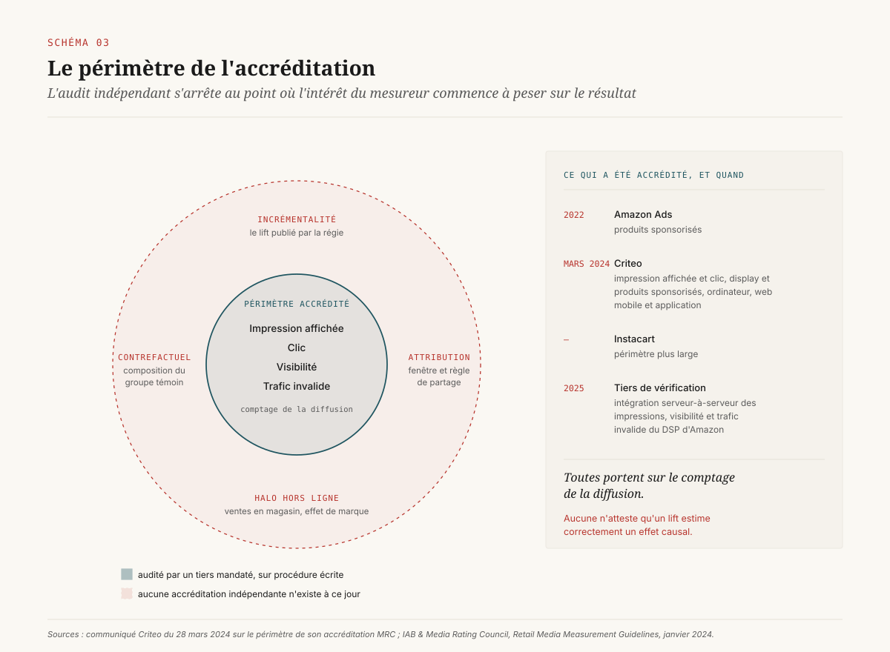

# Qui mesure, et pour le compte de qui

> **Le lift publicitaire vendu par les régies et les distributeurs n'est pas faux : il est invérifiable. L'accréditation indépendante s'arrête aux impressions, avant le seul chiffre qui justifie le budget.** — 12 août 2026, Mathieu Guglielmino

Un directeur marketing qui ouvre le tableau de bord de sa régie retail y lit un chiffre de ventes attribuées, un coût, un rapport entre les deux. Le chiffre est calculé sur des données qu'il ne possède pas, avec un contrefactuel qu'il ne peut pas reconstituer, par un acteur qui lui a vendu l'espace. Rien dans ce constat ne suppose de la mauvaise foi. La difficulté est structurelle : ==dans la publicité numérique, l'entité qui détient les moyens techniques de produire une mesure causale propre est presque toujours celle qui a intérêt au résultat==.

Ce dossier ne conclut pas qu'il faut refuser ces mesures. Il conclut qu'un annonceur qui les accepte sans dispositif de vérification arbitre à l'aveugle un budget qui se compte souvent en dizaines de millions, et qu'il existe trois leviers concrets pour reprendre la main : une capacité de test qu'on possède, une discipline de calibration, et des clauses contractuelles dont l'une est déjà exigible en droit européen sans qu'il soit besoin de négocier.

## 1. Le tableau de bord qui ne peut pas être vérifié

Le retail media est devenu une ligne budgétaire majeure sans que la question de sa mesure soit tranchée. L'ordre de grandeur communément avancé pour 2026 dépasse les 150 milliards de dollars de dépense mondiale[^10]. Cette croissance s'est faite sur la promesse d'une boucle fermée : le distributeur voit l'exposition publicitaire et voit la vente, donc il peut relier les deux. La boucle est réelle. Ce qu'elle produit n'est pas une mesure causale.

L'écart entre les deux tient dans un mot. Un chiffre de ventes *attribuées* répond à la question « combien de ventes ont suivi une exposition ». Un chiffre de ventes *incrémentales* répond à « combien de ventes n'auraient pas eu lieu sans elle ». Le premier est une jointure de tables. Le second exige un contrefactuel, c'est-à-dire une population comparable qui n'a pas été exposée et dont on observe le comportement.

L'état de la pratique côté annonceurs est documenté. Les enquêtes sectorielles de 2026 convergent sur un même diagnostic : la mesure et l'attribution arrivent en tête des difficultés citées face aux régies retail, l'incrémentalité est identifiée comme le point dur par une large majorité des répondants, et la part de ceux qui se déclarent réellement compétents pour la mesurer *et* l'exploiter reste marginale[^12]. Le mouvement d'internalisation qui s'amorce répond directement à ce constat.

Il faut nommer le mécanisme sans le dramatiser. La régie ne fabrique pas un chiffre. Elle applique une méthodologie qu'elle a choisie, sur un périmètre qu'elle a défini, avec une fenêtre d'attribution qu'elle a fixée, et elle publie le résultat. Chacun de ces choix est défendable isolément. ==Leur accumulation produit un chiffre dont l'annonceur ne peut réfuter aucune composante.==

*Voir Schéma 1 : les quatre niveaux de preuve, et le détenteur du contrefactuel à chaque marche.*

## 2. Ce que trente ans d'économétrie savent déjà

Le débat sur la mesure publicitaire n'est pas nouveau et il n'est pas ouvert. La littérature académique a tranché, avec des données que peu de praticiens peuvent égaler, et sa conclusion est inconfortable pour les tableaux de bord.

**Le cas eBay.** En 2015, Thomas Blake, Chris Nosko et Steven Tadelis publient dans *Econometrica* les résultats d'expériences de grande échelle menées chez eBay, dans lesquelles la plateforme a coupé ses achats de liens sponsorisés sur certains marchés géographiques et pas sur d'autres[^2]. Pour les requêtes contenant le terme « eBay », l'effet des annonces est quasi nul : environ 99,5 % du trafic que les liens sponsorisés semblaient apporter arrivait de toute façon sur le site, par le lien naturel situé juste en dessous. L'estimation non expérimentale, celle que produit n'importe quel outil d'attribution, créditait intégralement l'annonce. La nuance importe : les auteurs trouvent un effet réel des mots-clés génériques, mais concentré sur les nouveaux inscrits et les acheteurs occasionnels. La publicité fonctionnait sur une fraction de l'audience, et le système de mesure la créditait sur la totalité.

**L'écart mesuré à la source.** En 2019, Brett Gordon, Florian Zettelmeyer, Neha Bhargava et Dan Chapsky comparent, sur quinze expériences randomisées menées chez Facebook, les résultats expérimentaux et ceux qu'auraient produits les méthodes observationnelles usuelles appliquées aux mêmes utilisateurs[^3]. Le corpus dépasse les 500 millions d'observations utilisateur-expérience et 1,6 milliard d'impressions. Les méthodes observationnelles ne reproduisent pas les résultats expérimentaux, ==et dans la moitié des études l'écart sur l'augmentation d'achats atteint un facteur trois==, malgré un conditionnement sur des variables démographiques et comportementales riches.

**La réplication à grande échelle.** En 2023, Gordon, Robert Moakler et Zettelmeyer étendent l'exercice à 663 expériences[^4]. La conclusion est plus dure que celle de 2019 : même avec l'accès aux données propres de la plateforme, les approches non expérimentales ne parviennent pas à estimer de façon fiable l'effet causal d'une campagne. La raison tenant à la sélection : les systèmes de diffusion optimisent l'exposition en temps réel vers les utilisateurs les plus susceptibles de convertir, et cette optimisation est trop complexe et trop mouvante pour être « défaite » a posteriori par un modèle.

**La borne haute de ce qu'on peut savoir.** Randall Lewis et Justin Rao ont posé, dans le *Quarterly Journal of Economics*, la limite statistique de l'exercice[^1]. Sur vingt-cinq grandes expériences de terrain totalisant 2,8 millions de dollars d'investissement publicitaire, l'intervalle de confiance médian sur le retour sur investissement dépasse cent points de pourcentage. La variance individuelle des achats est telle qu'une expérience informative exige couramment plus de dix millions de personnes-semaines. Ce résultat vaut avertissement dans les deux sens : il disqualifie les estimations non expérimentales, et il disqualifie aussi les tests sous-dimensionnés qu'un annonceur monterait pour se rassurer.

*Voir Schéma 2 : les quatre travaux mis en vis-à-vis, avec l'ampleur de l'écart mesuré dans chacun.*

Ces quatre travaux dessinent la même figure. La mesure corrélationnelle surestime, l'ampleur de la surestimation n'est pas prévisible, et la seule correction connue est expérimentale. La question devient alors : qui peut exécuter l'expérience.

## 3. Le contrefactuel appartient à celui qui sert la publicité

Un test publicitaire propre exige de comparer des exposés à des non-exposés *comparables*. La difficulté est que l'exposition n'est pas assignée au hasard : elle est le produit d'une enchère et d'un modèle de ciblage. Un utilisateur exposé l'a été parce que le système l'a jugé intéressant. Le comparer à un utilisateur non exposé revient à comparer deux populations que le système a lui-même triées.

Trois protocoles répondent à ce problème, avec des propriétés très différentes.

L'**intent-to-treat** randomise l'éligibilité à la campagne en amont, puis compare les deux groupes entiers. Le protocole est correct mais coûteux en puissance statistique : le groupe traité contient tous ceux qui n'ont finalement jamais vu d'annonce, ce qui dilue l'effet mesuré.

Le **placebo publicitaire**, ou message d'intérêt général, sert au groupe témoin une annonce sans rapport commercial. Le protocole restaure la comparabilité mais impose de payer l'inventaire du groupe témoin, ce qui en fait un dispositif onéreux.

Les **publicités fantômes**, formalisées par Garrett Johnson, Randall Lewis et Elmar Nubbemeyer en 2017[^5], résolvent le problème autrement. Le système enregistre, dans le groupe témoin, l'identité des utilisateurs qui *auraient* remporté l'enchère et vu l'annonce, sans la leur servir. On obtient alors les contreparties exactes des exposés, sans acheter d'inventaire. Les auteurs rapportent que la variante prédictive de la méthode enregistrait déjà, à l'époque de la publication, plus de cent millions de publicités fantômes par jour. Le gain d'efficience est d'au moins un ordre de grandeur par rapport aux deux protocoles précédents.

C'est ici que se noue le problème de gouvernance, et il ne faut pas le manquer. ==Une publicité fantôme ne peut être enregistrée que par le système qui tient l'enchère.== Personne d'autre ne sait qui aurait gagné l'impression. Le protocole le plus rigoureux et le plus économique de la mesure publicitaire est, par construction, exécutable uniquement par le vendeur de l'espace. Un annonceur, un cabinet de mesure indépendant, un auditeur mandaté ne peuvent pas le reproduire, quel que soit leur budget.

Le conflit d'intérêt ne relève donc pas d'un défaut de déontologie que la profession corrigerait par un code de conduite. Il découle d'une asymétrie technique irréductible sur la ressource qui fonde toute la mesure causale : le contrefactuel.

## 4. L'accréditation s'arrête où commence le conflit

La profession dispose d'un mécanisme d'audit indépendant. Le Media Rating Council fait auditer les systèmes de mesure par un cabinet comptable indépendant qu'il mandate, puis soumet le rapport à un comité composé de représentants de ses membres. Le dispositif est sérieux et ancien. Sa portée exacte est rarement lue.

Le communiqué de Criteo de mars 2024 en donne le libellé précis[^10] : l'accréditation obtenue porte sur les métriques d'*impression affichée* et de *clic*, pour les formats display, sur ordinateur, web mobile et application mobile, pour les produits sponsorisés et le display sur ses plateformes retail. Instacart a obtenu une accréditation de périmètre plus large, Amazon détient depuis 2022 une accréditation sur les produits sponsorisés, et un tiers de vérification a obtenu en 2025 une accréditation pour l'intégration serveur-à-serveur des données d'impression, de visibilité et de trafic invalide du DSP d'Amazon.

Toutes ces accréditations portent sur la même famille d'objets : le comptage de la diffusion. Une impression a-t-elle été rendue. A-t-elle été visible. Le clic est-il humain. Ce sont des questions importantes, et il est bon qu'un tiers y réponde.

Aucune ne porte sur l'incrémentalité.

Il n'existe pas, à ce jour, d'accréditation indépendante attestant que le lift publié par une régie estime correctement l'effet causal de sa campagne. ==Le périmètre de l'audit s'arrête exactement au point où l'intérêt du mesureur commence à peser sur le résultat.== Un annonceur qui lit « accrédité MRC » sur un tableau de bord d'incrémentalité lit une garantie qui porte sur autre chose.

*Voir Schéma 3 : ce que couvre le noyau accrédité, et ce qui reste dans la couronne jamais auditée.*

La raison n'est pas conspirative, elle est méthodologique. Auditer un comptage, c'est vérifier une procédure déterministe contre une définition écrite. Auditer une estimation causale, c'est se prononcer sur le choix d'un contrefactuel, d'un modèle, d'une fenêtre, d'un traitement des valeurs manquantes, et sur la question de savoir si la population témoin était bien comparable. Un cabinet comptable ne fait pas cela. Une revue académique le fait, sur un article, en dix-huit mois. La cadence d'une campagne n'a rien à voir.

## 5. Ce que les guides de 2024-2025 ont réellement normalisé

Deux textes de référence encadrent aujourd'hui le sujet, et il faut lire ce qu'ils font plutôt que ce qu'on leur prête.

Les **IAB/MRC Retail Media Measurement Guidelines**, publiées en janvier 2024 après une phase de consultation publique, établissent le socle de vocabulaire et de comptage du retail media[^6] : définitions des formats, règles de comptage des impressions et des clics, traitement du trafic invalide, périmètres de reporting. Ce texte a réglé un problème réel, celui de l'incomparabilité des chiffres d'une régie à l'autre. Il porte sur la diffusion.

Les **Guidelines for Incremental Measurement in Commerce Media**, publiées en novembre 2025 par l'IAB et l'IAB Europe, s'attaquent au niveau au-dessus[^7]. Le document, produit par le conseil commerce de l'IAB et son groupe de travail sur l'incrémentalité, classe les approches en quatre familles : les expériences, les contrefactuels construits par modèle, les modèles économétriques, et les proxys hybrides. Il précise pour chacune les conditions d'emploi et les exigences de transparence sur la méthode retenue.

C'est un progrès substantiel, et il faut en mesurer la portée exacte. Un guide de méthodologie normalise le vocabulaire et fixe les conditions d'un bon usage. Il ne crée ni obligation de recours à un tiers, ni droit d'accès aux données sous-jacentes, ni mécanisme de contestation. Un annonceur peut désormais exiger de sa régie qu'elle *déclare* dans quelle famille tombe sa mesure, ce qui est utile. Il ne peut toujours pas la vérifier.

*Voir Schéma 4 : les quatre familles, avec pour chacune qui peut l'exécuter et ce que l'annonceur peut en réfuter.*

La déclaration a néanmoins une vertu opérationnelle immédiate, et c'est la première recommandation actionnable de ce dossier : la famille déclarée détermine le degré de confiance qu'on peut accorder au chiffre. Un lift issu d'une expérience avec publicités fantômes documentées, avec taille d'échantillon et intervalle de confiance publiés, se discute. Un lift issu d'un « contrefactuel modélisé » sans publication du modèle est une opinion de vendeur. Les deux arrivent aujourd'hui dans le même tableau de bord, dans la même colonne, sans distinction visuelle.

## 6. Le distributeur juge et partie

Le retail media pousse le problème d'un cran par rapport aux plateformes, et pour une raison qui tient à l'accumulation des rôles.

Une plateforme publicitaire classique vend l'inventaire et détient l'identité de l'utilisateur. Elle doit encore obtenir de l'annonceur la donnée de conversion pour boucler la mesure, ce qui laisse à ce dernier une prise résiduelle : il connaît son propre chiffre d'affaires.

Un distributeur qui exploite une régie détient l'inventaire, l'identité par la carte de fidélité, ==et la transaction elle-même==. Il vend l'espace publicitaire, il mesure l'effet de cet espace sur des ventes qui sont les siennes, et il en publie le résultat. Aucune des trois composantes ne dépend d'un tiers. L'annonceur n'a plus de prise résiduelle : le chiffre d'affaires qu'il cherche à influencer transite par le système d'information de son mesureur.

Cette accumulation de rôles n'est pas un procès d'intention. Le marché en a d'ailleurs conscience, et plusieurs régies ont amorcé des mouvements corrigeant les asymétries les plus visibles : rapport d'un chiffre de ventes incrémentales sur les campagnes programmatiques en libre-service chez certains distributeurs américains, ouverture d'interfaces permettant à l'annonceur de brancher ses propres modèles chez d'autres. Ces initiatives vont dans le bon sens et méritent d'être exigées ailleurs.

Le déplacement vers l'in-store, encadré depuis 2025 par un texte dédié de l'IAB et de l'IAB Europe, accentue la difficulté : les définitions de zone de magasin et d'opportunité de voir y sont par nature plus fragiles que le comptage d'une impression numérique, et le contrefactuel y est encore plus difficile à construire. Un annonceur qui accepte aujourd'hui un lift retail media sans clause de vérification s'engage sur un périmètre qui va s'étendre.

## 7. Le levier juridique que personne n'utilise

Il existe en droit européen une disposition qui répond directement au problème, elle est en vigueur, et elle est très peu invoquée par les annonceurs.

L'article 6, paragraphe 8, du règlement (UE) 2022/1925 sur les marchés numériques impose aux contrôleurs d'accès de fournir aux annonceurs et aux éditeurs, sur demande et **à titre gratuit**, l'accès à leurs outils de mesure de performance ainsi qu'aux informations nécessaires pour que ces derniers procèdent à leur **propre vérification indépendante** de l'inventaire publicitaire[^8]. Le texte précise que cela couvre les données agrégées comme les données non agrégées, et qu'elles doivent être fournies dans une forme permettant à l'annonceur de faire tourner ses propres outils de mesure. Le règlement impose par ailleurs, à l'article 5, une transparence sur les prix et les rémunérations de la chaîne publicitaire.

Trois précisions déterminent la portée pratique de cet article.

**Le périmètre.** L'obligation ne vise que les contrôleurs d'accès désignés par la Commission. Elle atteint donc les grandes plateformes publicitaires, et elle n'atteint pas la régie d'un distributeur européen de taille nationale. Un annonceur dispose du levier réglementaire sur une partie de son investissement seulement.

**La gratuité et sa limite.** L'accès de base est gratuit. Les prestations additionnelles, analyses spécialisées ou outils avancés, restent facturables. La frontière entre les deux est un enjeu de négociation qu'il vaut mieux traiter au contrat plutôt que d'en découvrir l'interprétation après coup.

**L'exercice du droit.** Le droit s'exerce sur demande. Un droit non demandé ne produit rien. C'est très exactement ce que le précédent britannique enseigne.

**Le précédent ISBA.** En 2020, l'étude de la chaîne d'approvisionnement programmatique menée par l'ISBA avec PwC laissait 15 % de la dépense publicitaire non attribuable, avec un taux d'appariement des impressions de 12 %. La deuxième édition, publiée en janvier 2023, ramène le delta inconnu à 3 % et le taux d'appariement à 58 %, et la durée de l'étude passe de dix-huit à neuf mois[^9]. Rien dans ce progrès ne relève d'une innovation technique. Il vient de ce qu'un collectif d'annonceurs a exigé les journaux, standardisé le format de la demande par une boîte à outils d'audit financier, et recommencé. ==La transparence n'est pas arrivée par la réglementation ni par la vertu des vendeurs : elle est arrivée parce qu'un acheteur organisé l'a réclamée dans un format que le vendeur pouvait produire.==

[SCHEMA-05]

## 8. Le dispositif d'un annonceur qui refuse d'arbitrer à l'aveugle

Rien de ce qui précède ne conduit à cesser d'acheter du retail media, ni à ignorer les mesures fournies par les régies. Ces mesures contiennent de l'information, et l'annonceur qui les jette n'a rien à mettre à la place. La position défendable consiste à les traiter comme des déclarations de partie intéressée, utiles et à recouper, et à construire les moyens du recoupement. Trois lignes de défense, par ordre de coût croissant et d'efficacité croissante.

### Première ligne : une capacité de test que l'on possède

L'expérimentation géographique est le seul protocole causal qu'un annonceur peut exécuter sans dépendre de la régie. On coupe ou on augmente l'investissement sur un ensemble de zones tirées au sort, on maintient sur les autres, on observe l'écart sur ses propres ventes. Le dispositif est lourd, il sacrifie délibérément du budget, et sa puissance statistique doit être calculée avant de lancer, faute de quoi il produira l'intervalle de confiance à cent points documenté par Lewis et Rao.

Il présente en contrepartie la propriété que rien d'autre n'a : l'annonceur détient le protocole, l'assignation, la donnée de résultat et l'analyse. Personne ne peut lui opposer une méthodologie qu'il ne connaît pas. La cadence recommandée est annuelle ou semestrielle par canal significatif, pas au coup par coup.

### Deuxième ligne : la calibration du modèle de mix par ses propres résultats

Les modèles de mix marketing bayésiens ont réintroduit une pratique qui change la nature de l'exercice : l'injection de résultats d'expérience comme *a priori* sur le retour par canal. La documentation de Meridian, le cadre ouvert de Google, est explicite sur ce point et présente les résultats d'incrémentalité comme la base la plus solide pour former ces *a priori*, devant le jugement d'expert et les références sectorielles[^11].

Cette mécanique est vertueuse et porte un risque de gouvernance qu'il faut nommer. Un *a priori* détermine largement la conclusion du modèle quand la donnée est peu informative, ce qui est le cas courant. ==Si l'annonceur calibre son modèle de mix avec les lifts fournis par ses régies, il n'a pas construit un contre-pouvoir : il a blanchi le chiffre du vendeur en le faisant ressortir d'un modèle qui porte son propre nom.== La règle est donc simple à formuler et exigeante à tenir : les *a priori* proviennent des tests que l'annonceur possède, ou ils sont documentés comme provenant du vendeur.

### Troisième ligne : le registre de mesure

Une capacité de test et un modèle calibré ne suffisent pas si les règles de décision se réécrivent après lecture des résultats. Le registre de mesure est l'objet de gouvernance qui verrouille cela, et il est peu coûteux. Il consigne, avant lancement, la règle de décision associée à chaque test (à partir de quel effet on réalloue, et de combien), l'origine documentée de chaque *a priori* injecté dans le modèle de mix, la famille méthodologique déclarée par chaque régie pour chacun de ses chiffres, et le taux de tests concluants sur l'année.

Ce dernier indicateur est le plus utile et le moins pratiqué. Un dispositif de mesure dont tous les tests concluent positivement est un dispositif sous-dimensionné ou lu avec complaisance. Le taux de tests non concluants est une donnée de pilotage, au même titre que le taux de projets arrêtés dans un portefeuille de cas d'usage.

[SCHEMA-06]

### Ce qu'on écrit au contrat

Les trois lignes de défense supposent des droits que l'annonceur doit obtenir en amont, au moment où il a encore un pouvoir de négociation. Six clauses, par ordre de difficulté d'obtention croissante.

1. **Déclaration de famille méthodologique.** Pour chaque métrique d'incrémentalité livrée, la régie déclare laquelle des quatre familles du guide IAB de novembre 2025 elle emploie, et documente la fenêtre d'attribution, le périmètre et la définition du groupe témoin.
2. **Publication de l'incertitude.** Tout lift livré s'accompagne de sa taille d'échantillon et de son intervalle de confiance. Un lift sans intervalle n'est pas une mesure.
3. **Droit au test.** L'annonceur peut demander l'exécution d'un test randomisé sur un périmètre qu'il définit, à une fréquence contractuelle, avec accès au protocole et à la donnée désagrégée du test.
4. **Accès aux journaux.** Livraison des journaux d'exposition et de conversion dans un format lisible par machine, dans un délai contractuel, dans un périmètre compatible avec le droit des données personnelles. C'est la clause qui a produit le résultat ISBA.
5. **Exercice du droit européen.** Pour les fournisseurs relevant du statut de contrôleur d'accès, invocation explicite de l'article 6(8) du règlement sur les marchés numériques, avec précision de ce qui est couvert par la gratuité et de ce qui ne l'est pas.
6. **Non-exclusivité de la mesure.** Droit de recourir à un tiers de vérification de son choix, et interdiction faite au fournisseur de conditionner un avantage commercial à l'usage exclusif de sa propre mesure.

Les deux premières s'obtiennent aujourd'hui sans rapport de force particulier. La troisième et la quatrième se négocient. La cinquième est un droit existant qu'il suffit d'exercer. La sixième est celle qui compte le plus et qui se refuse le plus souvent, ce qui est en soi une information sur le fournisseur.

## Conclusion

Le problème posé par ce dossier n'a pas de solution complète. Le contrefactuel restera la propriété technique de celui qui sert la publicité, et aucune clause ne transférera cette propriété. La littérature académique fixe par ailleurs une limite dure à ce qu'un annonceur peut espérer savoir, quel que soit son budget de mesure.

Ce qui est atteignable est plus modeste et parfaitement décidable. Un directeur data ou marketing peut, à l'échelle d'un exercice budgétaire, distinguer dans son tableau de bord les chiffres qu'il possède de ceux qu'il reçoit, se doter d'une capacité de test qui ne dépend de personne, refuser de calibrer ses modèles avec les résultats de ses vendeurs, et écrire six clauses dans son prochain contrat-cadre. Le coût de ce dispositif se compte en points de base de l'investissement média. ==Son absence se paie en arbitrages pris sur des chiffres dont on ne peut réfuter aucune composante.==

---

*Format co-écrit avec l'aide d'une IA.*

## Sources

[^1]: Randall A. Lewis, Justin M. Rao, « The Unfavorable Economics of Measuring the Returns to Advertising », *The Quarterly Journal of Economics*, vol. 130, n° 4, novembre 2015, p. 1941-1973. https://academic.oup.com/qje/article-abstract/130/4/1941/1914592 (consulté le 12 août 2026).

[^2]: Thomas Blake, Chris Nosko, Steven Tadelis, « Consumer Heterogeneity and Paid Search Effectiveness: A Large-Scale Field Experiment », *Econometrica*, vol. 83, n° 1, janvier 2015, p. 155-174. Version de travail : NBER Working Paper 20171. https://www.nber.org/papers/w20171 (consulté le 12 août 2026).

[^3]: Brett R. Gordon, Florian Zettelmeyer, Neha Bhargava, Dan Chapsky, « A Comparison of Approaches to Advertising Measurement: Evidence from Big Field Experiments at Facebook », *Marketing Science*, vol. 38, n° 2, mars 2019, p. 193-225. https://pubsonline.informs.org/doi/10.1287/mksc.2018.1135 (consulté le 12 août 2026).

[^4]: Brett R. Gordon, Robert Moakler, Florian Zettelmeyer, « Close Enough? A Large-Scale Exploration of Non-Experimental Approaches to Advertising Measurement », *Marketing Science*, vol. 42, n° 4, 2023, p. 768-793. Préprint : arXiv:2201.07055. https://arxiv.org/abs/2201.07055 (consulté le 12 août 2026).

[^5]: Garrett A. Johnson, Randall A. Lewis, Elmar I. Nubbemeyer, « Ghost Ads: Improving the Economics of Measuring Online Ad Effectiveness », *Journal of Marketing Research*, vol. 54, n° 6, décembre 2017, p. 867-884. https://journals.sagepub.com/doi/10.1509/jmr.15.0297 (consulté le 12 août 2026).

[^6]: IAB & Media Rating Council, *Retail Media Measurement Guidelines*, version finale, janvier 2024. https://www.iab.com/wp-content/uploads/2024/01/IAB_Retail_Media_Measurement_Guidelines_January2024.pdf (consulté le 12 août 2026).

[^7]: IAB & IAB Europe, *Guidelines for Incremental Measurement in Commerce Media*, novembre 2025. https://www.iab.com/guidelines/guidelines-for-incremental-measurement-in-commerce-media/ (consulté le 12 août 2026).

[^8]: Règlement (UE) 2022/1925 du Parlement européen et du Conseil du 14 septembre 2022 relatif aux marchés contestables et équitables dans le secteur numérique (règlement sur les marchés numériques), article 6, paragraphe 8. https://eur-lex.europa.eu/eli/reg/2022/1925/oj (consulté le 12 août 2026).

[^9]: ISBA & PwC, *Programmatic Supply Chain Transparency Study II*, janvier 2023. https://www.isba.org.uk/knowledge/second-programmatic-supply-chain-transparency-study (consulté le 12 août 2026).

[^10]: Criteo, « Criteo Secures Its First MRC Accreditation for Retail Media Measurement », communiqué de presse, 28 mars 2024. Donne le périmètre exact de l'accréditation obtenue (impression affichée et clic, display et produits sponsorisés) ainsi que la prévision GroupM de plus de 150 milliards de dollars d'investissement retail media mondial en 2026. https://www.criteo.com/news/press-releases/2024/03/criteo-secures-its-first-mrc-accreditation-for-retail-media-measurement/ (consulté le 12 août 2026).

[^11]: Google, *Meridian — ROI priors and calibration*, documentation développeur. https://developers.google.com/meridian/docs/advanced-modeling/roi-priors-and-calibration (consulté le 12 août 2026).

[^12]: eMarketer, « Advertisers have reasons for taking retail media measurement into their own hands », 2026, reprenant les enquêtes sectorielles sur l'état de la mesure retail media. https://www.emarketer.com/content/advertisers-have-reasons-taking-retail-media-measurement-their-own-hands (consulté le 12 août 2026).
