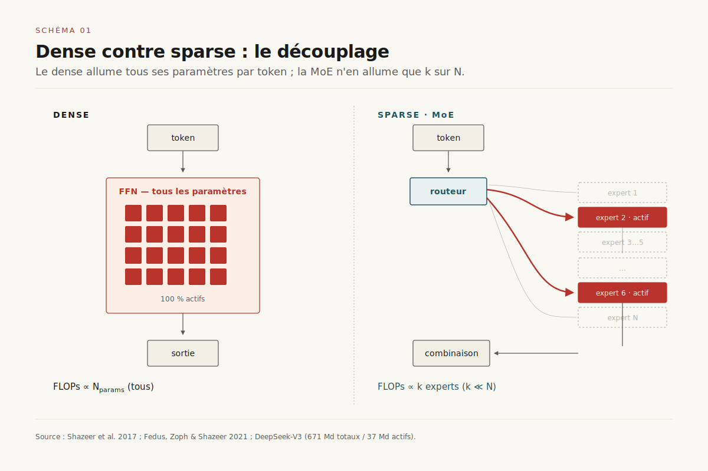
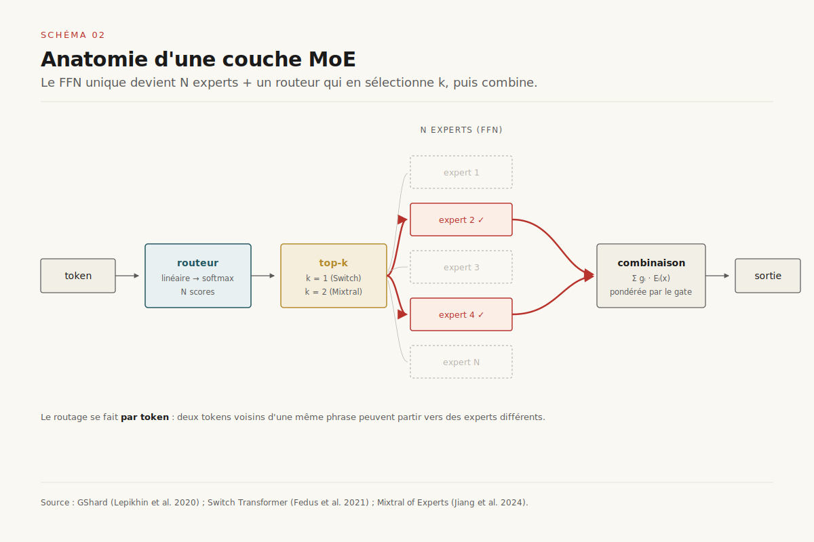
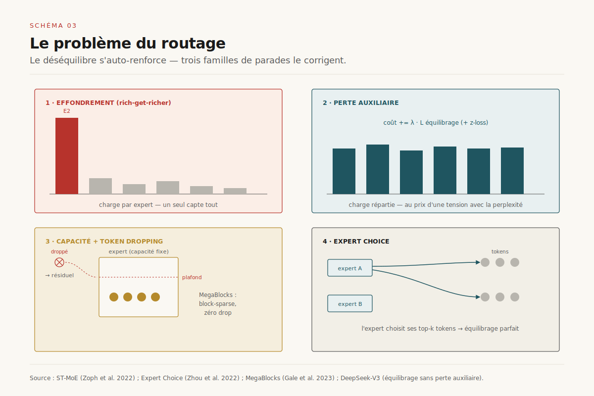
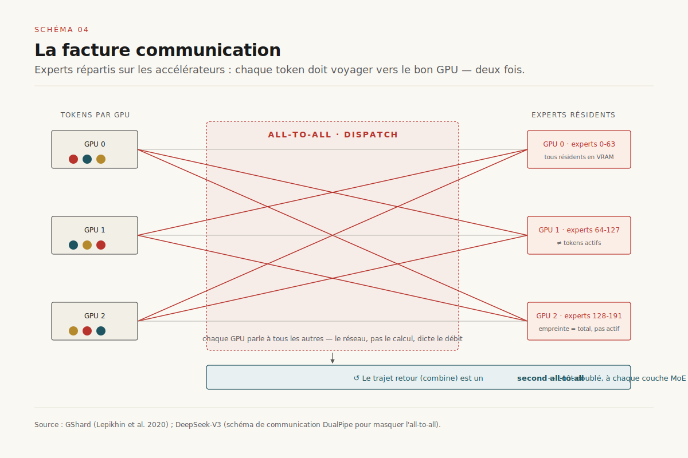

# La Mixture-of-Experts : payer le savoir, pas le calcul

> **La Mixture-of-Experts découple le nombre de paramètres — le savoir d'un modèle — du coût de calcul par token : elle laisse croître la capacité sans faire croître les FLOPs, en échange d'une facture mémoire et communication. C'est l'architecture qui a rendu les modèles de frontière économiquement soutenables, et la sparsité est devenue un troisième axe d'échelle à côté des paramètres et des données.** — 1er juillet 2026, Mathieu Guglielmino

Un modèle de langage dense paie deux fois le même prix : ==pour chaque token généré, il allume la totalité de ses paramètres==, qu'il s'agisse de décliner un verbe ou de démontrer un théorème. Le coût de calcul est proportionnel à la taille du modèle, et cette proportionnalité est le mur contre lequel bute le passage à l'échelle : doubler le savoir, c'est doubler la facture d'inférence et d'entraînement.

La Mixture-of-Experts (MoE) est la réponse architecturale à ce mur, et elle est ancienne : l'idée d'un *gating* sparse remonte à 2017[^1]. Mais c'est entre 2021 et 2025 qu'elle est passée du laboratoire à la quasi-totalité des modèles de frontière — Mixtral, DeepSeek-V3, Qwen3, Llama 4, DBRX, Grok. Ce dossier est un deep dive du dossier *économie de l'inférence* : il explique le mécanisme, ses pièges (le routage, la facture cachée de communication), l'état de l'art (les experts fins et partagés de DeepSeek), et pourquoi la sparsité s'est imposée comme une dimension d'échelle à part entière.

## 1. Le découplage fondamental

Dans un transformer dense, chaque couche applique à chaque token la même transformation : le bloc d'attention, puis un réseau *feed-forward* (FFN) qui concentre l'essentiel des paramètres. Le nombre d'opérations à virgule flottante par token est, à l'ordre un, proportionnel au nombre de paramètres actifs. C'est une loi d'airain : **plus de savoir = plus de calcul**, token par token, indéfiniment.

La MoE brise ce lien. Elle remplace le FFN unique par une collection de N FFN — les *experts* — et un petit réseau appelé *routeur* (ou *gate*) qui, pour chaque token, sélectionne seulement k experts parmi N (typiquement k=1 ou 2)[^1][^3]. Le token n'est traité que par ces k experts ; les N−k autres restent inertes pour ce token. ==La capacité du modèle (N experts, donc N fois plus de paramètres) croît, tandis que le calcul actif (k experts) reste constant.==

C'est le découplage central, et il est spectaculaire dans les chiffres : DeepSeek-V3 embarque 671 milliards de paramètres mais n'en active que 37 milliards par token[^8]. Le modèle « sait » comme un 671 Md, il « calcule » comme un 37 Md. Mixtral 8×7B totalise ~47 Md de paramètres mais n'en active que ~13 Md par token[^6]. On paie le savoir en mémoire, pas en calcul.

Cette bascule reconfigure toute l'économie du modèle. En entraînement, elle permet d'ingérer plus de connaissances à budget FLOPs fixe. En inférence, elle déplace le goulot d'étranglement du calcul (les FLOPs, ressource abondante sur GPU modernes) vers la mémoire et la bande passante — précisément là où la gestion du KV-cache avait déjà déplacé la contrainte. La MoE et le KV-cache racontent la même histoire sous deux angles : *sur une charge réelle, l'octet prime sur le FLOP*.

## 2. Anatomie d'une couche MoE

Concrètement, une couche MoE remplace le sous-bloc FFN d'un ou plusieurs blocs transformer par la structure suivante :

- **Un routeur** : une simple projection linéaire qui, à partir du vecteur d'un token, produit N scores (un par expert), suivie d'un *softmax*. Le routeur est minuscule devant les experts — quelques milliers de paramètres contre des milliards.
- **Une sélection top-k** : on retient les k experts aux plus hauts scores. Switch Transformer a montré que k=1 suffit et simplifie tout[^3] ; Mixtral et la plupart des modèles récents utilisent k=2.
- **N experts** : N FFN indépendants, chacun avec ses propres poids.
- **Une combinaison pondérée** : les sorties des k experts sélectionnés sont sommées, pondérées par les scores de gate (renormalisés).

Le point subtil, et souvent mal compris, est que ==le routage se fait au niveau du *token*, pas de la séquence ou de la requête==. Dans une même phrase, deux tokens consécutifs peuvent partir vers des experts complètement différents. Le routeur n'a aucune notion sémantique explicite : il apprend, par descente de gradient, une partition de l'espace des représentations qui minimise la perte — pas une partition en « domaines de connaissance » lisibles par un humain (on y revient en section 8).

GShard, chez Google, a été le premier à industrialiser ce schéma à grande échelle, avec un modèle de traduction à 600 milliards de paramètres et le vocabulaire d'ingénierie qui va avec — *expert parallelism*, *all-to-all*, capacité d'expert[^2]. Switch Transformer a poussé jusqu'à 1 600 milliards de paramètres en simplifiant à k=1[^3].

## 3. Le problème du routage

Le routage est le talon d'Achille de la MoE, et la source de la plupart de ses difficultés d'entraînement. Le problème fondamental est un cercle vicieux d'auto-renforcement : au début de l'entraînement, un expert légèrement favorisé reçoit plus de tokens, s'entraîne donc plus vite, devient meilleur, et se voit donc favorisé davantage. C'est ==l'effondrement du routage (*routing collapse*) : une poignée d'experts capte tout le trafic, les autres restent sous-entraînés et inutiles==. Le modèle a nominalement N experts mais n'en exploite réellement qu'une fraction.

Trois familles de parades coexistent :

**La perte auxiliaire d'équilibrage.** On ajoute à la fonction de coût un terme qui pénalise le déséquilibre de charge entre experts, poussant le routeur à répartir les tokens uniformément[^1][^3]. C'est efficace mais c'est un compromis : ce terme entre en tension avec l'objectif de perplexité — on force parfois un token vers un expert sous-optimal juste pour l'équilibre. ST-MoE a ajouté une seconde régularisation, le *router z-loss*, pour stabiliser les logits du routeur et éviter les débordements numériques qui rendaient l'entraînement fragile[^4].

**La capacité d'expert et le *token dropping*.** Pour paralléliser efficacement, on fixe une capacité maximale par expert (le nombre de tokens qu'il traitera dans un batch). Au-delà, les tokens excédentaires sont *droppés* — ils sautent la couche MoE via la connexion résiduelle, sans être traités[^2][^3]. C'est un mal nécessaire du placement statique en mémoire, que MegaBlocks a précisément cherché à supprimer avec un noyau *block-sparse* qui traite tous les tokens sans capacité fixe[^9].

**Le routage par les experts (*expert choice*).** Renversement du problème : au lieu de laisser chaque token choisir ses k experts, on laisse chaque expert choisir ses top-k tokens[^5]. L'équilibrage devient parfait par construction (chaque expert reçoit exactement sa capacité), au prix d'une bizarrerie : un token peut être choisi par zéro, un, ou plusieurs experts.

DeepSeek a apporté la contribution la plus élégante récemment : ==un équilibrage *sans perte auxiliaire*==, qui ajuste dynamiquement un terme de biais par expert (augmenté si l'expert est sous-chargé, diminué s'il est surchargé) sans polluer le gradient de la perte principale[^8]. On obtient l'équilibre sans sacrifier la qualité — une des clés de DeepSeek-V3.

## 4. La facture cachée : mémoire et communication

Le « déjeuner gratuit » de la MoE — plus de paramètres au même coût de calcul — n'est pas gratuit. Il se paie sur deux postes que la comptabilité en FLOPs ignore.

**La mémoire.** Même si un token n'active que k experts, *tous* les experts doivent résider en mémoire, prêts à être appelés. DeepSeek-V3 occupe l'empreinte VRAM d'un 671 Md, pas d'un 37 Md[^8]. C'est ce qui rend les MoE difficiles à servir localement : le grand public peut faire tourner un dense de 13 Md sur un GPU grand public, mais pas une MoE de capacité équivalente qui exigerait de charger 50 à 100 Md de poids — d'où l'intérêt des techniques d'*offloading* CPU/SSD des experts inactifs (section 8).

**La communication.** À l'échelle, les experts sont répartis sur plusieurs accélérateurs — c'est l'*expert parallelism*. Mais les tokens, eux, arrivent en batch sur chaque GPU. Il faut donc, à chaque couche MoE, **acheminer chaque token vers le GPU qui héberge son expert (opération *all-to-all* de *dispatch*), puis rapatrier les sorties (*all-to-all* de *combine*)**[^2]. Ces deux échanges collectifs, répétés à chaque couche, deviennent le goulot d'étranglement dominant sur les grands clusters : le réseau, pas le calcul, dicte le débit.

C'est pourquoi une part majeure de l'ingénierie MoE porte sur la communication : chevauchement calcul/communication, topologies de réseau optimisées, et — chez DeepSeek — un schéma de communication sur mesure (*DualPipe*) qui masque le coût all-to-all derrière le calcul[^8]. ==Servir une MoE, c'est d'abord un problème de plomberie réseau, pas d'algèbre linéaire.==

## 5. Les innovations DeepSeek : experts fins et partagés

L'architecture MoE canonique — quelques gros experts, top-2 — laisse deux inefficacités sur la table, que DeepSeekMoE a diagnostiquées puis corrigées[^7].

**Le savoir commun redondant.** Certaines connaissances (grammaire, structure syntaxique, faits ultra-fréquents) sont utiles à *tous* les tokens. Dans une MoE classique, chaque expert doit réapprendre ce socle commun, gaspillant de la capacité. DeepSeek isole ce socle dans un ou plusieurs **experts partagés (*shared experts*), toujours actifs**, qui traitent chaque token en plus des experts routés. Les experts routés se spécialisent alors sur le savoir différenciant.

**La granularité grossière.** Avec peu d'experts, le nombre de combinaisons possibles (quels k parmi N) est faible, ce qui limite la spécialisation. DeepSeek **découpe chaque expert en plusieurs experts plus petits (*fine-grained*)** à budget de paramètres et de calcul constant. En passant de 8 experts top-2 à, disons, 64 experts top-8, on multiplie le nombre de combinaisons de plusieurs ordres de grandeur — le modèle peut composer des « spécialistes » beaucoup plus finement[^7].

[SCHEMA-05]

DeepSeek-V3 est l'aboutissement de cette ligne : 256 experts routés fins + 1 expert partagé, 8 experts routés activés par token, équilibrage sans perte auxiliaire, 671 Md de paramètres totaux pour 37 Md actifs[^8]. Le tout combiné à la *Multi-head Latent Attention* (qui compresse le KV-cache) et à la prédiction multi-token. C'est aujourd'hui la référence de facto pour une MoE ouverte de frontière — et OLMoE a confirmé, en configuration 100 % ouverte et reproductible, que la combinaison *fine-grained + granularité élevée + expert partagé optionnel* domine les alternatives sur des ablations rigoureuses[^12].

## 6. La sparsité, troisième axe d'échelle

Les lois d'échelle classiques (Kaplan, Chinchilla) relient la perte à deux leviers : le nombre de paramètres et le volume de données, à budget de calcul donné. La MoE ajoute un troisième levier : ==la sparsité — le rapport entre paramètres totaux et paramètres actifs — devient une dimension d'optimisation à part entière==.

À budget de calcul (FLOPs) fixe, un modèle sparse bat systématiquement un modèle dense en perplexité : il « range » plus de paramètres pour le même coût par token[^3][^10]. La question n'est plus *dense ou sparse*, mais *quel degré de sparsité et quelle granularité* pour un budget donné.

[SCHEMA-06]

Krajewski et al. ont formalisé cette dimension supplémentaire — la *granularité* — et montré que les configurations MoE optimales pour un budget donné ont une granularité croissante avec l'échelle : plus le modèle est grand, plus il gagne à être découpé en experts fins et nombreux[^11]. C'est la justification théorique de la trajectoire DeepSeek. Les travaux antérieurs de DeepMind sur les *routed language models* avaient déjà esquissé des lois d'échelle unifiées pour la MoE, montrant que les gains persistent sur plusieurs ordres de grandeur avant de plafonner[^2].

Le *sparse upcycling* offre un raccourci économique : plutôt que d'entraîner une MoE de zéro, on part d'un modèle dense pré-entraîné et on « recycle » son FFN en plusieurs copies-experts, qu'on continue d'entraîner[^10]. On récupère l'investissement du dense et on gagne la capacité de la MoE pour une fraction du coût — une pratique désormais courante.

## 7. Le paysage MoE 2024-2026

La MoE est passée, en trois ans, du pari exotique au standard de fait pour les modèles de frontière.

[SCHEMA-07]

Quelques repères : **Mixtral 8×7B** (janvier 2024) a été le déclencheur grand public — la première MoE ouverte compétitive, 8 experts, top-2, ~13 Md actifs[^6]. **DeepSeek-V2 puis V3** ont établi la ligne fine-grained + shared, jusqu'à 671/37 Md[^7][^8]. **Qwen3**, **Llama 4** (Scout et Maverick), **DBRX** (132 Md, 16 experts) et **Grok-1** (314 Md) ont suivi. **OLMoE** (1,3 Md actifs / 6,9 Md totaux) fait figure d'exception précieuse : entièrement ouvert — poids, données, code, logs — il sert de banc d'essai reproductible pour la recherche MoE[^12]. Quant à **GPT-4**, une architecture MoE (rumeur persistante d'une seize-experts ou huit-experts) est largement supposée sans confirmation officielle — signe que même les acteurs fermés ont basculé.

Le motif est net : ==à l'échelle de frontière, la question n'est plus de savoir *si* on fait de la MoE, mais *comment* on la calibre==.

## 8. Tensions et horizon

La MoE n'est pas une solution sans coût, et trois tensions structurent son avenir.

**Servir une MoE reste dur.** Memory-bound à cause de l'empreinte totale, sensible à l'efficacité du batch (si les tokens d'un batch se dispersent sur trop d'experts, chaque expert traite peu de tokens et l'utilisation GPU chute), la MoE en production impose une ingénierie de service dédiée. L'*offloading* dynamique des experts inactifs vers la DRAM ou le SSD ouvre la MoE au matériel modeste, au prix de la latence — une piste active pour l'inférence locale.

**Le mythe des experts interprétables.** Une intuition tenace veut que les experts se spécialisent en domaines lisibles (un expert « code », un expert « français »…). Les analyses empiriques la démentent largement : ==les experts se spécialisent surtout sur des motifs syntaxiques de bas niveau — ponctuation, catégories grammaticales, tokens fréquents — pas sur des thèmes sémantiques==[^6][^12]. Le routage est un artefact d'optimisation, pas une taxonomie de la connaissance. En attendre de l'interprétabilité relève du contresens.

**Le réglage fin.** Adapter une MoE par *fine-tuning* est plus délicat qu'un dense : le routage figé peut mal généraliser au domaine cible, et l'équilibrage doit être maintenu. Les recettes se stabilisent, mais l'écart d'outillage avec le dense persiste.

À l'horizon 2026-2028, la trajectoire est claire : **granularité encore plus fine**, dans la ligne des lois d'échelle[^11] ; **MoE × quantization** pour comprimer l'empreinte mémoire dominante ; **offloading et service désagrégé** des experts pour le local comme pour le cloud ; et, plus spéculativement, la vision de **modèles modulaires composables** — des experts entraînés, ajoutés ou retirés à la carte, où la MoE cesserait d'être une simple optimisation de calcul pour devenir une architecture de connaissance modulaire. Le découplage params/FLOPs aura alors accouché d'un découplage plus radical : celui du savoir lui-même en briques recomposables.

## Sources

[^1]: Shazeer, Noam et al. *Outrageously Large Neural Networks: The Sparsely-Gated Mixture-of-Experts Layer*. arXiv:1701.06538, 2017. L'acte fondateur du gating sparse conditionnel dans les réseaux profonds.
[^2]: Lepikhin, Dmitry et al. *GShard: Scaling Giant Models with Conditional Computation and Automatic Sharding*. arXiv:2006.16668, 2020. Premier passage à l'échelle industrielle de la MoE (600 Md), expert parallelism et all-to-all.
[^3]: Fedus, William, Barret Zoph et Noam Shazeer. *Switch Transformers: Scaling to Trillion Parameter Models with Simple and Efficient Sparsity*. arXiv:2101.03961, 2021 (JMLR 2022). La simplification à k=1 et le modèle à 1,6 T de paramètres.
[^4]: Zoph, Barret et al. *ST-MoE: Designing Stable and Transferable Sparse Expert Models*. arXiv:2202.08906, 2022. Router z-loss et recettes de stabilisation de l'entraînement.
[^5]: Zhou, Yanqi et al. *Mixture-of-Experts with Expert Choice Routing*. arXiv:2202.09368, 2022. Le renversement du routage : les experts choisissent les tokens.
[^6]: Jiang, Albert Q. et al. *Mixtral of Experts*. arXiv:2401.04088, 2024. La MoE ouverte qui a fait basculer le grand public ; analyse de la spécialisation (non sémantique) des experts.
[^7]: Dai, Damai et al. *DeepSeekMoE: Towards Ultimate Expert Specialization in Mixture-of-Experts Language Models*. arXiv:2401.06066, 2024. Experts fins (fine-grained) et experts partagés.
[^8]: DeepSeek-AI. *DeepSeek-V3 Technical Report*. arXiv:2412.19437, 2024. Équilibrage sans perte auxiliaire, 671/37 Md, DualPipe, état de l'art MoE ouverte.
[^9]: Gale, Trevor et al. *MegaBlocks: Efficient Sparse Training with Mixture-of-Experts*. arXiv:2211.15841, 2023. Noyaux block-sparse supprimant le token dropping.
[^10]: Komatsuzaki, Aran et al. *Sparse Upcycling: Training Mixture-of-Experts from Dense Checkpoints*. arXiv:2212.05055, 2022. Recyclage d'un dense pré-entraîné en MoE.
[^11]: Krajewski, Jakub et al. *Scaling Laws for Fine-Grained Mixture of Experts*. arXiv:2402.07871, 2024. La granularité comme dimension d'échelle formalisée.
[^12]: Muennighoff, Niklas et al. *OLMoE: Open Mixture-of-Experts Language Models*. arXiv:2409.02060, 2024. MoE entièrement ouverte, ablations sur granularité et experts partagés.
