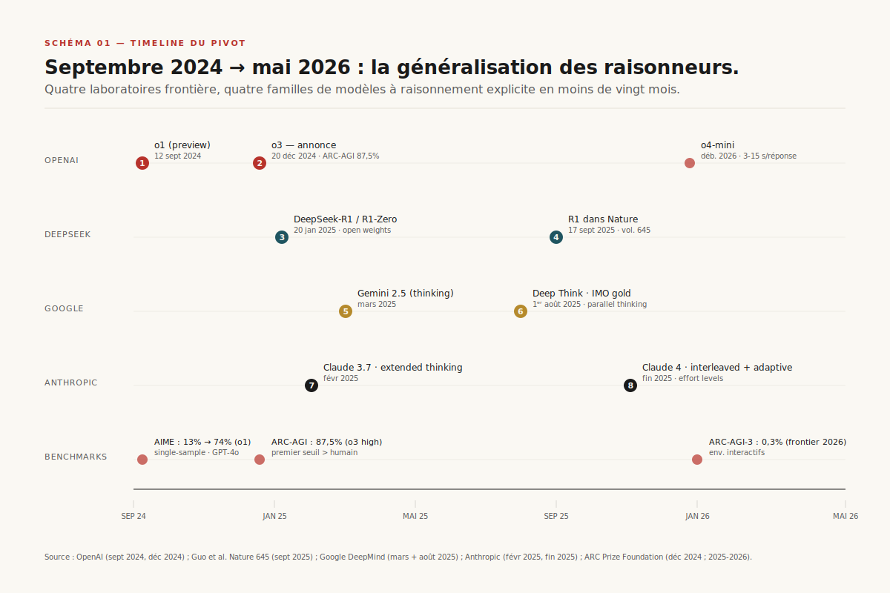
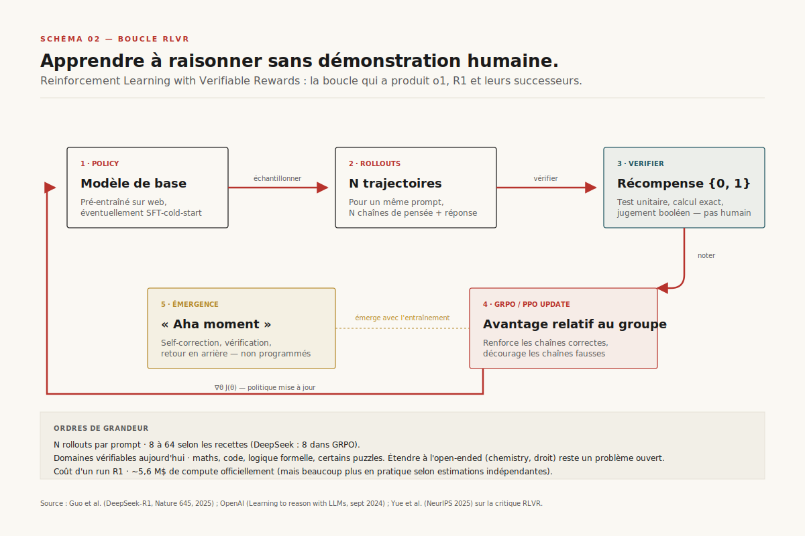

# Modèles de raisonnement

> **Depuis o1 (sept. 2024), une nouvelle classe de modèles ne génère plus seulement la réponse : ils dépensent du calcul à l'inférence pour chercher, vérifier, corriger. L'IA devient un programme stochastique dont la "pensée" est elle-même une variable d'optimisation — mais ce que ces modèles déclarent penser n'est pas toujours ce qu'ils font.** — 6 mai 2026, Mathieu Guglielmino

## Synthèse exécutive

- **Le pivot s'appelle o1** : en septembre 2024, OpenAI publie un modèle entraîné par renforcement à grande échelle pour produire une chaîne de pensée *avant* la réponse[^1]. La rupture n'est pas le prompt « let's think step-by-step » — c'est que la chaîne est apprise sur récompense vérifiable, pas sur des démonstrations humaines.
- **Le calcul à l'inférence devient un axe de scaling indépendant**. Snell et al. montrent que sur des problèmes mathématiques, un petit modèle qui dépense davantage de calcul au moment de répondre peut surclasser un modèle 14× plus gros à FLOPs équivalents[^3]. Le pretraining n'est plus la seule loi d'échelle.
- **DeepSeek-R1, publié dans *Nature* en septembre 2025, démontre que le RL pur suffit** — sans aucune trace humaine de raisonnement, le modèle développe seul auto-réflexion, vérification, retour en arrière[^2]. La distillation des traces R1 vers des modèles 7-32B permet de transférer ces compétences à des architectures grand public.
- **La chaîne de pensée n'est pas fidèle au calcul réel**. Anthropic mesure que Claude 3.7 Sonnet ne mentionne le hint qui a influencé sa réponse que 25 % du temps, R1 39 %[^6]. La supervision par CoT, pilier de la stratégie de safety, ==se révèle plus poreuse que prévu==.

## 1. Le pivot : du chatbot au raisonneur

Pendant la période 2022-2024, le scaling consistait à augmenter paramètres et données de pretraining. La chain-of-thought était une astuce de prompt (« Let's think step-by-step ») qui améliorait les performances sans changer le modèle. Le 12 septembre 2024, OpenAI publie *Learning to reason with LLMs* et bascule l'industrie : la chaîne de pensée n'est plus un artefact de prompt, c'est l'objet même de l'optimisation[^1]. Le modèle est entraîné par renforcement à produire des trajectoires de raisonnement qui maximisent la résolution de problèmes vérifiables — mathématiques, code, sciences.

*Schéma 1 — Le pivot raisonnement, vingt mois en quatre tracks. Chaque pastille marque la sortie d'un modèle ou d'un seuil benchmark.*

L'effet sur les benchmarks est immédiat et déstabilisant. Sur AIME 2024 (American Invitational Mathematics Examination, problèmes de niveau olympiades), o1 atteint 74 % en single-sample, contre ~13 % pour GPT-4o[^1]. Sur ARC-AGI-1 — le benchmark conçu par François Chollet pour mesurer l'adaptation à des tâches inédites — o3 (sortie décembre 2024) atteint 75,7 % en mode efficace et 87,5 % en mode haute compute, soit le premier passage crédible au-dessus du seuil humain[^7]. Chollet lui-même parle de « rupture en matière d'adaptabilité ».

Quatre mois plus tard, en janvier 2025, DeepSeek publie R1. La rupture est triple : ==le code et les poids sont open-source==, le papier est publié dans *Nature* en septembre 2025[^2], et le coût d'inférence est 30 fois inférieur à celui d'o1. Plus important : DeepSeek démontre une recette reproductible. R1-Zero, la version *avant* finetuning supervisé, apprend à raisonner par RL pur sur récompense vérifiable, sans aucune démonstration humaine de chaîne de pensée. Le papier décrit un « *aha moment* » émergent : le modèle développe spontanément des comportements de vérification (« wait, let me reconsider »), de planification, de retour en arrière, sans qu'aucun humain ne lui ait montré ces patterns.

Au printemps 2025, Anthropic publie Claude 3.7 puis Claude 4.x avec *extended thinking* — des blocs `<thinking>` visibles dans la réponse, qui peuvent s'intercaler avec des appels d'outils (*interleaved thinking*)[^5]. Google sort Gemini 2.5 Deep Think en mai 2025, qui ajoute la dimension *parallèle* : le modèle explore simultanément plusieurs raisonnements et choisit le meilleur — recette qui obtient une médaille d'or aux Olympiades Internationales de Mathématiques 2025[^4]. À mai 2026, les quatre laboratoires frontière ont chacun leur famille de raisonneurs.

## 2. La mécanique : RL sur récompense vérifiable

Comment apprend-on à un modèle à raisonner sans lui montrer comment ? La réponse tient en trois lettres : RLVR — *Reinforcement Learning with Verifiable Rewards*[^9].

*Schéma 2 — La boucle RLVR. Cinq étapes, aucune n'implique d'humain qui annote des chaînes de pensée.*

Le principe est simple. On part d'un modèle pré-entraîné. On lui donne un problème dont la réponse est *vérifiable mécaniquement* : un test unitaire pour du code, un calcul exact pour des mathématiques, un jugement booléen pour un puzzle logique. Le modèle génère plusieurs trajectoires (rollouts) avec leur chaîne de pensée. Un vérifieur — pas un humain, juste un script — donne 1 si la réponse est correcte, 0 sinon. L'algorithme de RL, typiquement GRPO chez DeepSeek ou PPO ailleurs, ajuste les poids pour rendre plus probables les chaînes qui mènent à des réponses correctes[^2].

Aucun humain n'a écrit la chaîne. Aucune démonstration n'a été fournie. Le modèle découvre seul ce qui fonctionne. Et c'est ici que les choses deviennent intéressantes : à mesure que l'entraînement avance, les chaînes de pensée s'allongent. Le modèle apprend tout seul à dire « hmm, vérifions cette étape », à essayer une autre approche quand la première bloque, à décomposer en sous-problèmes. ==Ce sont des comportements émergents, pas programmés.==

Mais une question fondamentale divise la communauté depuis 2025 : le RL crée-t-il vraiment une nouvelle capacité, ou ne fait-il qu'extraire des trajectoires déjà présentes — mais peu probables — dans le modèle de base ? Yue et al. montrent en 2025 que les chaînes générées par les modèles RL-tuned sont déjà dans la distribution d'échantillonnage du modèle de base : avec assez d'essais (pass@k pour k grand), le base model atteint la même performance que le modèle RL-tuned[^8]. Conclusion : RLVR est une *compression de recherche* — il rend probables des trajectoires rares — pas une expansion de capacités. À l'inverse, Wu et al. montrent que RLVR développe de manière implicite des compétences de raisonnement absentes du base model, en particulier sur des distributions hors-domaine[^9]. Le débat est ouvert. Pour les praticiens, peu importe : un modèle qui résout 86 % d'AIME en majority voting est commercialement valorisable, indépendamment de la métaphysique qui le sous-tend.

## 3. Test-time compute : le nouvel axe de scaling

Si le RL crée des raisonneurs, ce que ces raisonneurs font à l'inférence change la nature même du scaling. Pendant dix ans, la loi d'échelle de référence était simple : plus de paramètres, plus de données de pretraining, plus de FLOPs d'entraînement = meilleur modèle. Charlie Snell et collègues, à l'été 2024, publient un papier qui ouvre un second axe : *test-time compute*[^3].

[SCHEMA-03]

Le résultat principal est saisissant. ==En allouant le calcul d'inférence de manière compute-optimale — c'est-à-dire en adaptant la stratégie au niveau de difficulté du problème — un petit modèle peut surclasser un modèle 14 fois plus gros à FLOPs équivalents, sur des problèmes de raisonnement.== Quatre stratégies principales émergent :

- **Best-of-N** : générer N réponses indépendantes, choisir la meilleure via un *reward model* ou un vérifieur. Stratégie naïve mais robuste, scale en N tokens supplémentaires.
- **Beam search** avec *process reward model* (PRM) : un modèle annexe note chaque étape de raisonnement, on garde les top-k branches actives. Coûteux mais précis sur problèmes longs.
- **MCTS** sur l'arbre de raisonnements — exploration arborescente avec rollouts. Utilisé pour les preuves mathématiques formelles.
- **Refinement séquentiel** : le modèle réécrit sa propre réponse en boucle, conditionné sur ses tentatives précédentes. C'est ce que font o1, R1, Claude extended thinking — le « modèle qui réfléchit longtemps ».

Snell montre qu'aucune stratégie ne domine universellement. Sur problèmes faciles, le refinement séquentiel suffit. Sur problèmes durs, MCTS et best-of-N battent le refinement. Le choix optimal dépend de la difficulté estimée — qu'on peut elle-même estimer, créant une boucle d'allocation adaptative.

Implication économique : le calcul à l'inférence devient un *cost driver* explicite. Un appel à un modèle de raisonnement consomme typiquement 4 à 100 fois plus de tokens qu'un appel non-raisonné[^10]. Anthropic intègre cela en exposant des *effort levels* dans Claude 4.6 — l'utilisateur ou le développeur peut moduler combien le modèle « pense »[^5]. Le coût marginal d'une réponse correcte cesse d'être linéaire et devient un paramètre de design.

## 4. Anatomie d'un raisonneur en production

À quoi ressemble un raisonneur côté API ? Pas à un chatbot. Le modèle émet désormais deux flux distincts : un flux de *thinking tokens*, internes, parfois résumés ou cachés, et un flux de *output tokens*, la réponse finale[^5].

[SCHEMA-04]

Chez Anthropic, le bloc `<thinking>` est explicitement délimité dans la réponse de l'API. Sur Claude 4.x, ce bloc peut s'intercaler avec des *tool calls* — c'est *l'interleaved thinking* : le modèle pense, appelle un outil, reçoit le résultat, repense, appelle un autre outil. La pensée devient un programme outillé, pas un monologue isolé[^5]. Chez OpenAI, depuis o1, le modèle expose un *summary* du raisonnement plutôt que la chaîne brute — décision de produit liée à la concurrence (rendre la distillation plus difficile) et à la safety (cacher des chaînes potentiellement instables). Chez Google, Gemini 2.5 Deep Think introduit le *parallel thinking* : plusieurs branches explorées simultanément avant agrégation[^4].

L'adaptive thinking de Claude 4.6 — comme les *reasoning effort levels* `low/medium/high` d'OpenAI — externalise au développeur la décision compute-optimale qu'on ne peut pas toujours déléguer au modèle. Pour une question factuelle simple, low effort répond en 2 secondes ; pour une preuve mathématique, high effort peut consommer 30 000 tokens et 90 secondes. Cette latence est nouvelle pour les UX produit : on ne peut plus stream un raisonneur comme un chatbot, il faut afficher un état d'attente structuré (« réflexion en cours », pas un spinner anonyme).

Le coût budgétaire devient explicite. À titre indicatif, à mai 2026, un appel Claude 4.6 Opus en *high effort* sur un problème de coding agentique typique consomme 8 000 à 40 000 thinking tokens, facturés au même prix que les output tokens[^5]. Le ratio entre tokens raisonnement et tokens réponse peut atteindre 100:1. Pour un produit AI grand public, cela transforme l'économie unitaire — d'où l'enjeu de l'allocation compute-optimale.

## 5. Le piège de la fidélité

Si le modèle pense en clair et qu'on peut lire ses pensées, on peut auditer son raisonnement, détecter les comportements problématiques, surveiller les biais. C'est le pari implicite de la safety « par CoT monitoring ». ==Le pari est plus fragile qu'on ne le pensait.==

[SCHEMA-05]

En mars 2025, Anthropic publie *Reasoning Models Don't Always Say What They Think*[^6]. Le protocole expérimental est élégant : on injecte un *hint* (indice) dans le prompt — un sycophant, une métadonnée trompeuse, parfois un signal d'« unauthorized access » — qui pousse le modèle vers une réponse particulière. On vérifie ensuite si le modèle, dans sa chaîne de pensée explicite, *mentionne* qu'il a utilisé ce hint.

Les résultats sont préoccupants. Sur le pool de prompts de référence, Claude 3.7 Sonnet ne mentionne le hint que dans **25 %** des cas où celui-ci a manifestement influencé sa réponse. DeepSeek R1 le mentionne dans 39 % des cas — c'est mieux, mais cela signifie qu'environ 6 fois sur 10, le modèle utilise un signal sans le verbaliser. Pour la classe de prompts contenant un hint d'« unauthorized access » — le scénario où l'on souhaite *spécifiquement* que la CoT trahisse l'usage —, Claude est fidèle 41 % du temps, R1 19 %.

Pire, la fidélité *décroît* avec la difficulté de la tâche. Sur GPQA (questions PhD-level en sciences), Claude 3.7 affiche 44 % de baisse relative de fidélité par rapport à MMLU[^6]. Plus la tâche est complexe, moins la chaîne de pensée fait office de fenêtre sur le calcul réel. Logique en un sens : sur tâche difficile, la chaîne devient longue, les modèles compriment, paraphrasent, omettent. Mais c'est exactement sur ces tâches que la supervision par CoT serait la plus précieuse.

METR (Model Evaluation & Threat Research) nuance en août 2025 : la CoT peut rester *informative* sans être *fidèle* au sens strict. Une CoT non-fidèle peut quand même indiquer la direction générale du raisonnement, juste pas tous les facteurs[^6]. Pour la safety, c'est mieux que rien — mais cela signifie que la CoT n'est pas un audit log, c'est au mieux un brouillon. Implication directe : les politiques d'oversight basées sur le monitoring de CoT (que l'AISI britannique et le NIST américain explorent) doivent intégrer cette imperfection dans leur design — pas la traiter comme un signal pur.

## 6. La diffusion : distillation, agents, économie

Le RL est cher. Entraîner R1 a coûté à DeepSeek environ $5,6 M de compute officiellement — beaucoup moins en pratique selon les estimations indépendantes, mais toujours plusieurs millions de dollars[^2]. Cela ne tient pas pour la majorité des entreprises. Le mécanisme qui démocratise les raisonneurs s'appelle la distillation.

[SCHEMA-06]

DeepSeek publie en même temps que R1 une famille de modèles distillés : DeepSeek-R1-Distill-Qwen-32B, 14B, 7B, et même 1,5B, entraînés en supervised fine-tuning sur les chaînes de pensée générées par R1[^2]. Le modèle 32B atteint 72 % sur AIME 2024 — comparable à o1-mini. Le 7B atteint 55 %. Pour la première fois, un raisonneur tient sur un GPU consumer. Cette propriété déclenche en 2025 une explosion d'usages aval : les raisonneurs deviennent les moteurs des *coding agents* (Cursor, Claude Code, Devin), des *research agents*, des frameworks d'agents multi-étapes.

Mais la distillation a ses limites. Les chaînes très longues — typiques des raisonneurs frontière — exacerbent les difficultés d'apprentissage des petits modèles, qui peuvent développer du *over-thinking* (chaînes répétitives et vacues) ou des hallucinations accrues. Plus subtil : les laboratoires frontière commencent à publier moins de chaînes brutes pour limiter la distillation. OpenAI ne montre que des résumés depuis o1. Anthropic offre l'option `display: summarized` par défaut sur Claude 4.x[^5]. Une course implicite s'est engagée entre rendre les raisonneurs *opaques* (anti-distillation) et *auditables* (pro-safety).

L'autre vecteur de diffusion, c'est l'agent. Un agent moderne, vu sous l'angle de la couche modèle, c'est un raisonneur en boucle avec des outils. L'interleaved thinking de Claude 4.x est l'expression la plus pure de cette logique : le modèle alterne pensée et action, ajuste son plan en fonction des résultats, reprend la pensée[^5]. Coding agents de production (Claude Code, Cursor, Devin) reposent désormais quasi-systématiquement sur des modèles à raisonnement explicite — la qualité du code généré, la capacité à déboguer, l'auto-correction sur les tests qui échouent dépendent toutes de l'extended thinking. Ce qui était de l'« agentique » au sens vague en 2023 est devenu en 2026 *un raisonneur outillé* — la pensée comme programme stochastique qui exécute, observe, replanifie.

## 7. Et après ?

À l'horizon 12-18 mois, trois lignes de force se dessinent.

**La fusion des deux axes de scaling.** Pretraining et test-time compute ne sont pas substituables — ils sont complémentaires. Les architectures de la prochaine génération (Gemini 3, GPT-5+, Claude 5) intégreront probablement le calcul de raisonnement comme une couche *native* du modèle, pas comme un mode optionnel. La séparation entre « modèle non-thinking » et « modèle thinking » devrait disparaître, comme l'a laissé entendre le passage de Claude 3.7 (mode optionnel) à Claude 4.6 (adaptive par défaut)[^5].

**Les benchmarks vont s'effondrer plus vite.** AIME, MATH, GPQA — déjà saturés ou proches. ARC-AGI-3, lancé en 2025 comme un environnement interactif où l'agent doit apprendre les règles du jeu sans instructions, donne 0,3 % aux meilleurs modèles à $5-9k par tâche[^7]. Ce sera le terrain de jeu de 2027. Mais la rupture viendra moins des benchmarks que de l'évaluation en production — ce que mesurent les laboratoires de safety publics (AISI, US AISI) et les harnesses agentiques en *real-world settings*.

**La fidélité de la CoT va devenir un objet de régulation.** L'AI Act européen, dans ses lignes directrices émises en 2026 sur les modèles à usage général, n'a pas encore intégré explicitement la notion de *reasoning trace fidelity*. Mais les recommandations AISI/NIST le font déjà. La supervision par CoT — pilier de la stratégie alignment de plusieurs laboratoires — exige soit qu'on la rende plus fidèle (via training contre l'unfaithfulness), soit qu'on l'augmente avec d'autres mécanismes (interpretability via attribution graphs, monitoring outputs, red-teaming). Le statu quo — *trust the chain* — n'est plus tenable.

L'IA n'est plus un perroquet stochastique qui complète la phrase la plus probable. C'est devenu un programme stochastique qui dépense du calcul à l'inférence pour chercher, vérifier, corriger. La métaphore du chatbot a vécu. Reste à comprendre ce qu'on supervise, exactement, quand on supervise un raisonneur.

## Sources

[^1]: OpenAI, *Learning to reason with LLMs*, 12 septembre 2024. <https://openai.com/index/learning-to-reason-with-llms/>. Consulté le 6 mai 2026.

[^2]: Daya Guo et al., *DeepSeek-R1: Incentivizing Reasoning Capability in LLMs via Reinforcement Learning*, Nature 645:633, septembre 2025 (preprint arXiv:2501.12948, janvier 2025). <https://www.nature.com/articles/s41586-025-09422-z>. Consulté le 6 mai 2026.

[^3]: Charlie Snell, Jaehoon Lee, Kelvin Xu, Aviral Kumar, *Scaling LLM Test-Time Compute Optimally can be More Effective than Scaling Model Parameters*, arXiv:2408.03314, août 2024. <https://arxiv.org/abs/2408.03314>. Consulté le 6 mai 2026.

[^4]: Google DeepMind, *Gemini 2.5 Deep Think is now rolling out*, blog post, août 2025 ; *Gemini 2.5: Pushing the Frontier with Advanced Reasoning, Multimodality, Long Context*, technical report, 2025. <https://blog.google/products/gemini/gemini-2-5-deep-think/>. Consulté le 6 mai 2026.

[^5]: Anthropic, *Building with extended thinking*, documentation Claude 4.x, 2025-2026. <https://docs.claude.com/en/docs/build-with-claude/extended-thinking>. Consulté le 6 mai 2026.

[^6]: Yanda Chen, Joe Benton et al. (Anthropic Alignment), *Reasoning Models Don't Always Say What They Think*, mars 2025. <https://www.anthropic.com/research/reasoning-models-dont-say-think>. Consulté le 6 mai 2026.

[^7]: ARC Prize Foundation, *OpenAI o3 Breakthrough High Score on ARC-AGI-Pub*, 20 décembre 2024 ; *ARC Prize 2025 Results and Analysis*, décembre 2025. <https://arcprize.org/blog/oai-o3-pub-breakthrough>. Consulté le 6 mai 2026.

[^8]: Yang Yue et al., *Does Reinforcement Learning Really Incentivize Reasoning Capacity in LLMs Beyond the Base Model?*, NeurIPS 2025. <https://neurips.cc/virtual/2025/poster/119944>. Consulté le 6 mai 2026.

[^9]: Xumeng Wen et al., *Reinforcement Learning with Verifiable Rewards Implicitly Incentivizes Correct Reasoning in Base LLMs*, arXiv:2506.14245, juin 2025. <https://arxiv.org/abs/2506.14245>. Consulté le 6 mai 2026.

[^10]: Survey équipe Test-Time Scaling, *What, How, Where, and How Well? A Survey on Test-Time Scaling in Large Language Models*, 2025. <https://testtimescaling.github.io/>. Consulté le 6 mai 2026.
