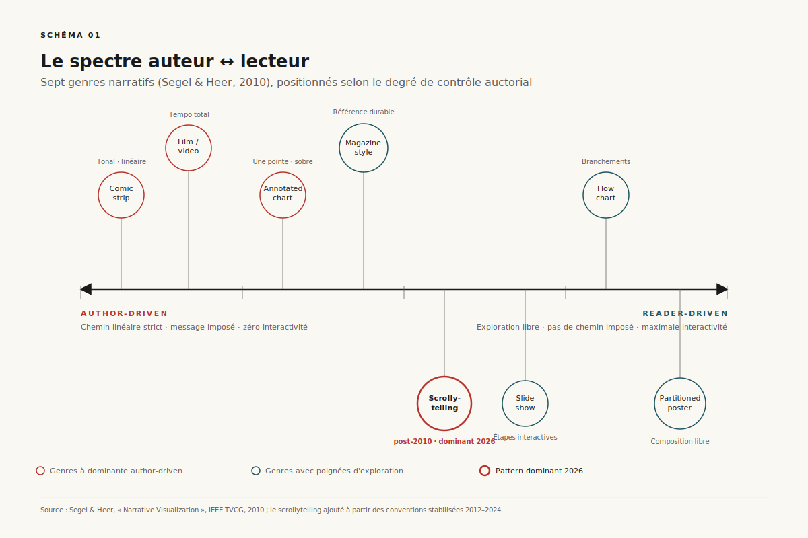
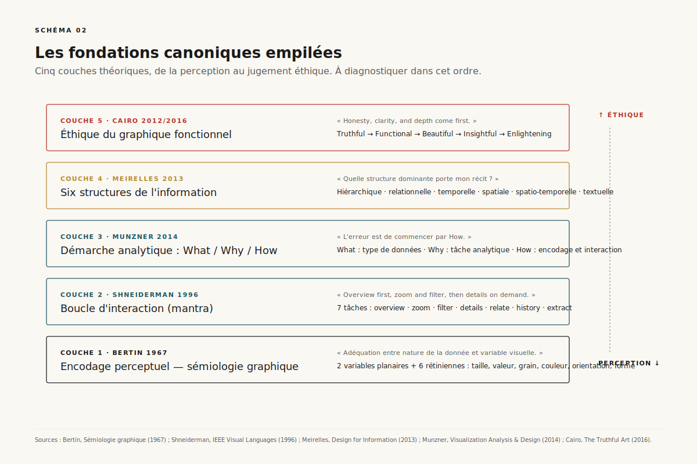
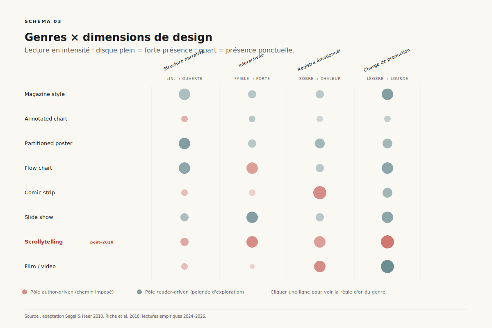
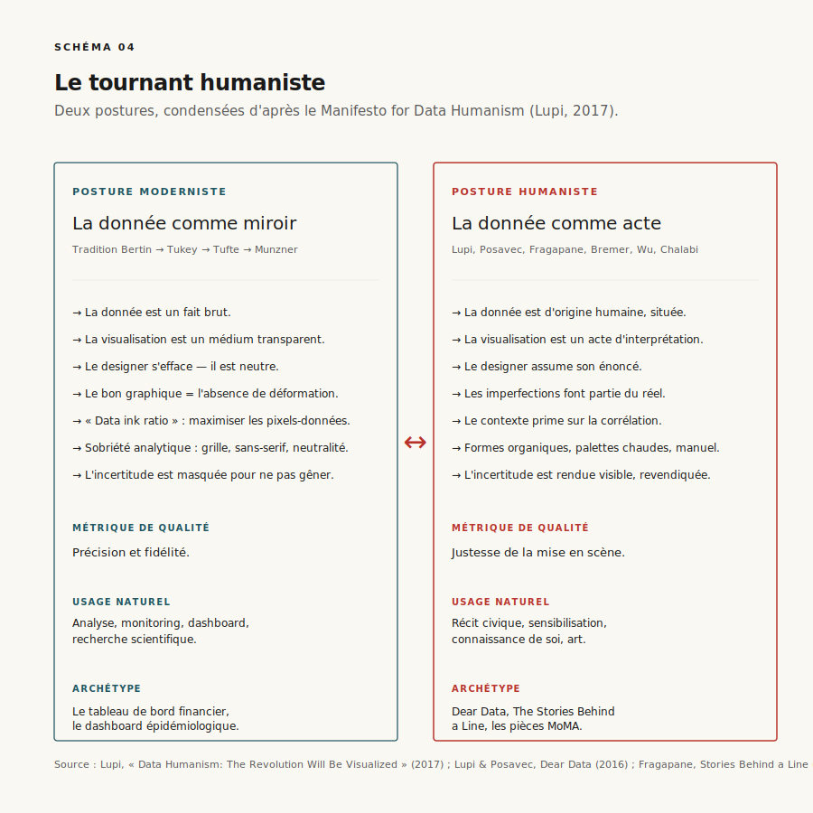
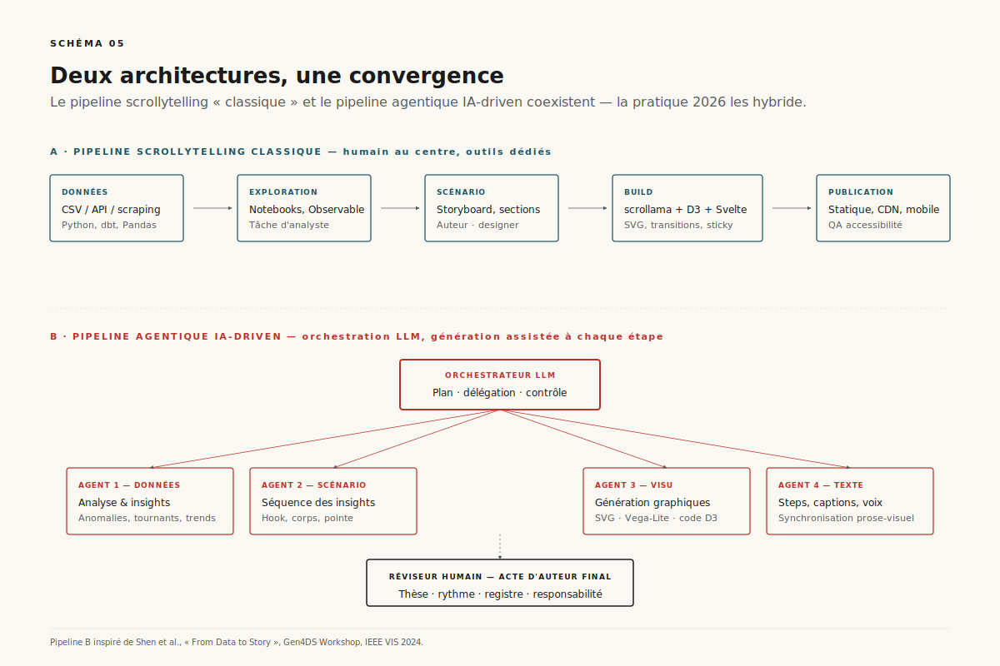
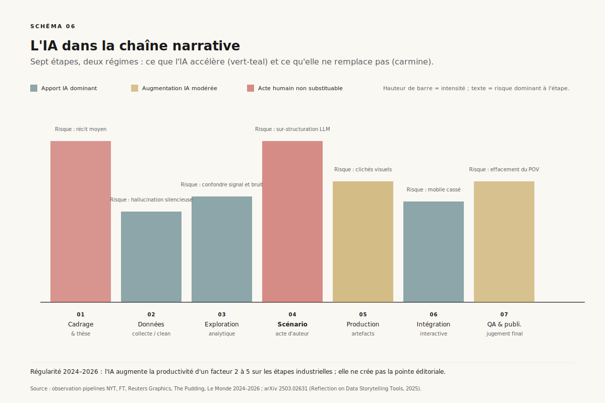
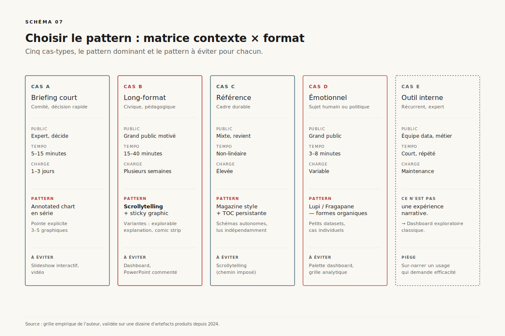

# Expériences narratives

> **Une expérience narrative n'est ni un graphique commenté, ni un tableau de bord déguisé : c'est une troisième voie qui impose une structure auctoriale aux données tout en préservant l'agence cognitive du lecteur. En 2026, l'IA générative ne tue pas ce métier — elle en redistribue la valeur.** — 5 mai 2026, Mathieu Guglielmino

*Format co-écrit avec l'aide d'une IA.*

---

## Lede — ce qu'il faut retenir en trois minutes

Depuis quinze ans, la communauté de la visualisation a forgé un vocabulaire stable pour parler de ce qu'on appelle, faute de mieux, *narrative visualization*, *data storytelling*, ou — formulation que je préfère et que j'adopte ici — **expériences narratives**. Ces objets ne sont pas des graphiques avec un titre éditorial : ce sont des dispositifs où **l'auteur impose une structure** (séquence, hiérarchie, points d'arrêt, registre émotionnel) à un matériau quantitatif, **tout en laissant au lecteur des poignées d'exploration** calibrées (zoom, filtre, branchement, scrollytelling).

Le canon académique tient en quatre références : Edward Segel et Jeffrey Heer ont défini le **spectre auteur ↔ lecteur** et identifié **sept genres** (2010)[^1] ; Tamara Munzner a posé le cadre **What/Why/How** qui sépare les questions de données, de tâches et d'encodages (2014)[^2] ; Robert Kosara et Jock Mackinlay ont fait du *storytelling* la « prochaine étape » de la recherche en visualisation (2013)[^3] ; et Nathalie Henry Riche, Christophe Hurter, Nicholas Diakopoulos et Sheelagh Carpendale ont compilé en 2018 le manuel de référence, *Data-Driven Storytelling*, intégrant scrollytelling, patterns narratifs, évaluation et éthique[^4].

À ce socle s'ajoutent les **fondations** : la sémiologie graphique de Jacques Bertin (huit variables visuelles, 1967)[^5], le mantra de Ben Shneiderman (« *overview first, zoom and filter, then details on demand* », 1996)[^6], la typologie de structures d'Isabel Meirelles (*Design for Information*, 2013, six structures)[^7], et la philosophie d'Alberto Cairo (« *honesty, clarity, and depth come first* »)[^8].

Et puis il y a le **tournant humaniste**, plus récent, qui refuse la promesse moderniste de neutralité : Giorgia Lupi avec son *Manifesto for Data Humanism* (2017)[^9], le projet *Dear Data* avec Stefanie Posavec (2014–2016, acquis par le MoMA en 2017)[^10], et le travail de Federica Fragapane — formes organiques, lignes-vies, refus de la propreté algorithmique (*The Stories Behind a Line*, 2017 ; trois pièces acquises par le MoMA en 2023)[^11]. Cette école dit une chose simple : **les données ne sont pas neutres, leur visualisation non plus, et la prétention à l'objectivité visuelle est une posture**.

Le pivot 2025–2026 introduit un cinquième acteur : **l'IA générative dans la chaîne de production narrative**. Gartner avait prédit en 2021 que **75 % des récits-données seraient générés automatiquement à l'horizon 2025**[^12]. La prédiction s'est révélée à la fois prématurée (les outils grand public n'y sont pas) et trop timide (les pipelines internes l'ont déjà dépassée pour les artefacts à faible enjeu). Le workshop IEEE VIS Gen4DS (2024) a institutionnalisé la question[^13] et une revue récente identifie quatre régimes de collaboration humain-IA : **IA-assistée**, **IA-collaboratrice**, **humain-réviseur**, **fully-automatic**[^14]. Aucun ne supprime l'auteur : ils déplacent son acte de valeur ajoutée — du tracé des courbes vers le **scénario, le rythme et le jugement éditorial**.

Ce dossier sert quatre objectifs : (1) clarifier ce qu'est une expérience narrative et ce qu'elle n'est pas ; (2) reconstituer la chaîne intellectuelle qui va de Bertin aux scrollytellers contemporains ; (3) cartographier les sept genres de Segel-Heer en 2026, en particulier après la généralisation du scrollytelling ; (4) poser un cadre praticien — architectures techniques, points d'insertion de l'IA, garde-fous, arbre de décision contexte → pattern. Il s'inscrit dans le prolongement de mes dossiers précédents — notamment l'[anatomie d'un système agentique](../anatomie/), l'[évaluation agentique](../evaluation-agentique/), et l'[IA et le travail](../ia-et-travail/) — qui partagent une obsession commune : ==donner une forme lisible à des objets que la presse traite par récits binaires==.

---

## 1. Définir : l'expérience narrative comme troisième régime

*Schéma 1 — Le spectre auteur ↔ lecteur de Segel-Heer (2010), avec les sept genres positionnés selon leur degré moyen de contrôle auctorial. Le scrollytelling, absent du papier original, s'insère entre slideshow et film.*

Il existe trois régimes principaux pour communiquer avec des données.

Le **régime exploratoire** est celui de l'analyste face à son tableau de bord : la donnée est exposée crue, l'utilisateur navigue à sa guise, l'auteur (s'il existe) se contente de poser des outils. C'est l'aire de Tableau, Power BI, Looker, des notebooks Jupyter exposés. La métrique de qualité est *la couverture* — combien de questions l'utilisateur peut-il poser ? — et l'expérience optimale est ==celle où l'utilisateur découvre quelque chose que l'auteur n'avait pas anticipé==.

Le **régime infographique classique** — la planche d'infographie statique du *National Geographic* ou d'une plaquette de cabinet — est à l'opposé : un seul écran, un seul plan de lecture, aucune interactivité. L'auteur fixe tout, le lecteur reçoit. Métrique de qualité : *la mémorisation* — qu'est-ce que le lecteur retient cinq minutes après ?

L'**expérience narrative** est la troisième voie. Elle préserve la structure auctoriale (l'auteur sait où il va, dans quel ordre, et avec quelle pointe) **et** confère au lecteur des poignées calibrées : un schéma fait remonter ses détails au survol, une étape exige un clic pour avancer, un graphique laisse explorer librement *à un endroit précis* du parcours. Cette dialectique n'est pas un compromis — c'est la spécification du genre.

### Le spectre Segel-Heer

Edward Segel et Jeffrey Heer, dans leur article fondateur de 2010 (déjà 2 600 citations en mai 2026), théorisent ce point central : il existe un **spectre continu entre auteur-driven et reader-driven**, et chaque artefact se positionne sur ce spectre[^1]. Le pôle author-driven impose un chemin linéaire strict, repose sur le message éditorial, n'offre aucune interactivité (pensez à un long-format texte avec figures fixes). Le pôle reader-driven offre une interactivité totale et aucun chemin imposé (un dashboard analytique). Entre les deux : tous les hybrides intéressants.

Trois patterns de balance sont récurrents :

1. **Martini glass** — début author-driven (introduction guidée, question posée, donnée présentée), puis ouverture en cône vers une exploration libre. Le lecteur entre par le pied du verre, sort par l'évasement.
2. **Interactive slideshow** — slideshow classique, mais chaque slide encapsule une mini-exploration (filtres, sélection d'une dimension). Le contrôle du tempo reste à l'auteur, l'approfondissement est délégué au lecteur.
3. **Drill-down story** — l'auteur expose la vue agrégée, le lecteur peut « plonger » dans une cellule pour en voir le détail (souvent un bouton « explorer » qui ouvre un dataviz exploratoire ad hoc).

Chacun de ces patterns implique un contrat de lecture différent — et le lecteur, formé par quinze ans de scrollytelling et de produits SaaS, lit ces conventions sans les nommer. ==Briser la convention sans signal explicite produit du désorientement, pas de la surprise==.

### Sept genres

Toujours dans le même article, Segel et Heer identifient sept genres récurrents à partir d'un corpus de 58 exemples : **magazine style**, **annotated chart**, **partitioned poster**, **flow chart**, **comic strip**, **slide show**, **film/video/animation**[^1]. Le scrollytelling, qui dominera la décennie suivante, n'apparaît pas — pour cause, il n'existait pas encore comme genre stabilisé. On peut aujourd'hui le placer entre slideshow et film : séquence imposée par le scroll, transitions animées, points d'ancrage textuels (*sticky steps*).

Ces genres ne sont pas des catégories analytiques étanches : un long-format narratif du *New York Times* peut traverser plusieurs genres en succession (annotated chart pour ouvrir, scrollytelling au milieu, comic strip pour boucler). L'apport de Segel-Heer est moins une taxonomie que **l'établissement d'un vocabulaire** — pour discuter de ces objets sans confondre ce que l'auteur veut faire et ce que le format permet.

### Démarcations

Trois démarcations utiles, pour fermer la définition :

- **Une expérience narrative n'est pas un dashboard avec un titre.** Si la séquence de lecture n'est pas inscrite dans le dispositif, ce n'est pas du *storytelling*, c'est de l'exploration avec une étiquette.
- **Une expérience narrative n'est pas un PowerPoint commenté.** Le slideshow est un genre légitime *quand il intègre des étapes interactives* (sélection, filtre, comparaison). Sinon c'est un slideshow.
- **Une expérience narrative n'est pas une animation décorative.** Si l'animation ne porte pas une charge cognitive (révéler une comparaison, comprimer une dimension temporelle, ancrer une transition), elle pollue.

---

## 2. Les fondations canoniques : Bertin → Shneiderman → Munzner → Cairo

*Schéma 2 — Les quatre couches théoriques sur lesquelles s'appuie toute expérience narrative sérieuse : encodage perceptuel (Bertin), boucle d'interaction (Shneiderman), démarche analytique (Munzner), éthique du graphique (Cairo).*

L'expérience narrative ne sort pas du néant : elle s'appuie sur quarante ans de théorie de la visualisation, dont les apports principaux peuvent être empilés en quatre couches, de la plus basse (perception) à la plus haute (éthique). Il est utile pour un praticien de connaître les noms et les décennies — non par fétichisme, mais parce que ces référents permettent de **diagnostiquer une expérience qui ne marche pas** sans s'en remettre à l'intuition.

### Couche 1 — Bertin (1967) : la sémiologie graphique

Jacques Bertin, cartographe français, publie en 1967 *Sémiologie graphique*[^5]. Il identifie **huit variables visuelles** : deux variables planaires (position en X, position en Y), et six **variables rétiniennes** — taille, valeur (clair/sombre), grain (texture), couleur (teinte), orientation, forme. Pour chaque variable, Bertin précise quels types de relations elle peut encoder : *associative* (montre des regroupements), *sélective* (permet d'isoler une catégorie), *ordonnée* (permet de classer), ou *quantitative* (permet de mesurer un rapport).

L'apport est radical : la qualité d'un graphique ne tient pas au goût mais à **l'adéquation entre la nature de la donnée et la variable visuelle choisie**. Encoder un nombre par une teinte (rouge/bleu) au lieu d'une longueur (barre) introduit un *handicap perceptuel* — le lecteur lit moins bien. Cette grille de lecture tient encore en 2026, et tout praticien sérieux la rejoue mentalement avant chaque encodage.

### Couche 2 — Shneiderman (1996) : le mantra et la taxonomie par tâche

Trente ans plus tard, Ben Shneiderman, à l'université du Maryland, publie *The Eyes Have It: A Task by Data Type Taxonomy for Information Visualizations*[^6]. Il y propose ce que la communauté retiendra sous le nom de **Visual Information-Seeking Mantra** :

> **« Overview first, zoom and filter, then details-on-demand. »**

Cette phrase, devenue loi non écrite de la visualisation interactive, structure aussi bien Tableau qu'un long-format du *Financial Times*. Elle dit que le bon ordre cognitif est : *vue d'ensemble* (situer), *zoom et filtre* (cibler), *détail* (consommer). Une expérience narrative qui inverse cet ordre — qui plonge le lecteur dans le détail avant d'avoir établi la vue d'ensemble — produit de la confusion, parfois utile dramatiquement (un long-format *True Detective-style*), souvent juste mauvaise.

Shneiderman propose aussi une **taxonomie par tâche** : sept tâches élémentaires que tout dispositif visuel peut supporter (overview, zoom, filter, details-on-demand, relate, history, extract). Cette taxonomie, encore largement utilisée pour évaluer un outil interactif, fournit une checklist tangible : qu'est-ce que mon expérience narrative permet de faire à chacune de ces étapes ?

### Couche 3 — Munzner (2014) : What/Why/How

Tamara Munzner, professeure à UBC Vancouver, publie en 2014 *Visualization Analysis and Design*[^2], devenu manuel de référence. Son apport central est un cadre tripartite — **What/Why/How** — qui sépare trois questions trop souvent confondues :

- **What** : *quel est le type de donnée ?* Tableau, réseau, arbre, géographique, temporelle ? Une, deux, plusieurs dimensions ? Données brutes ou dérivées ?
- **Why** : *quelle est la tâche analytique ?* Comparer, ordonner, identifier une corrélation, détecter une anomalie, raconter une trajectoire ? Découvrir vs présenter ?
- **How** : *quels sont les choix d'encodage et d'interaction qui répondent au What et au Why ?*

L'erreur la plus commune, écrit Munzner, est de **commencer par How** — choisir un type de graphique avant d'avoir clarifié ce qu'on doit encoder et pourquoi. Le cadre est **itératif** : pour une expérience complexe, on traverse plusieurs cycles What/Why/How (un par section, par schéma). Pour une expérience narrative, le **Why varie au fil de la séquence** — on ne pose pas la même question cognitive au lecteur dans le hook initial, dans le corps du raisonnement, et dans la conclusion. ==Le cadre Munzner permet de diagnostiquer un schéma raté en remontant la chaîne : si le How est confus, c'est presque toujours qu'un Why intermédiaire a été sauté.==

### Couche 4 — Cairo (2012, 2016) : l'éthique du graphique fonctionnel

Alberto Cairo, *Knight Chair in Visual Journalism* à l'université de Miami, ajoute une couche normative dans *The Functional Art* (2012) puis *The Truthful Art* (2016)[^8]. Sa thèse : la qualité d'une visualisation se hiérarchise en cinq niveaux successifs, et il faut les valider dans l'ordre.

1. **Truthful** — la visualisation représente fidèlement la donnée (pas d'axe trompeur, pas de cherry-picking).
2. **Functional** — elle permet effectivement la tâche pour laquelle elle est conçue.
3. **Beautiful** — elle est plaisante, lisible, éditorialement soignée.
4. **Insightful** — elle révèle quelque chose que le lecteur ignorait.
5. **Enlightening** — elle change la manière dont le lecteur pense au sujet.

L'ordre n'est pas négociable : *honesty, clarity, and depth come first*[^8]. Une expérience narrative *enlightening* mais pas *truthful* est une manipulation. Belle et fonctionnelle mais pas vraie : aussi. Ce hiérarchie sert de garde-fou contre la dérive éditoriale typique du data journalisme — courber la donnée pour servir le récit.

### Couche 5 (souvent oubliée) — Meirelles (2013) : les six structures

Isabel Meirelles, à Northeastern, publie *Design for Information* en 2013[^7]. Sa contribution discrète mais utile : une **typologie en six structures** que la donnée prend nécessairement quand on la visualise — *hierarchical* (arbres), *relational* (réseaux), *temporal* (timelines, flux), *spatial* (cartes), *spatio-temporal* (cartes animées, trajectoires), et *textual* (encodage du texte). Pour une expérience narrative, ce cadre force la question : ==quelle structure dominante porte mon récit ?== Une expérience qui mélange trois structures sans les hiérarchiser perd le lecteur ; une expérience qui fait dialoguer deux structures (par exemple temporel × spatial) bien orchestrées peut produire des moments mémorables (les cartes animées de migration des oiseaux, par exemple).

---

## 3. Sept genres, une grammaire vivante

*Schéma 3 — Les sept genres de Segel-Heer (plus le scrollytelling, ajouté post-2010), évalués selon quatre dimensions de design : structure narrative, niveau d'interactivité, registre émotionnel, charge de production.*

Le tableau Segel-Heer reste valide en 2026, mais quinze ans d'usage ont stabilisé des conventions qu'il est utile d'expliciter. Quatre dimensions permettent de comparer ces genres et de choisir celui qui sert le sujet.

### Dimension 1 — Structure narrative

Linéaire stricte (un seul chemin), branchante (le lecteur choisit une voie), parallèle (plusieurs récits simultanés sur un même objet), ouverte (exploration libre dans un cadre éditorialisé). Le **comic strip** et la **video** sont par construction linéaires ; le **partitioned poster** est parallèle (le lecteur compose son ordre) ; l'**annotated chart** est typiquement linéaire mais court ; le **slideshow** est linéaire avec interactivité locale.

Le **scrollytelling** mérite un traitement à part. Apparu vers 2012 avec « Snow Fall » du *New York Times*, il s'est codifié autour de quelques patterns techniques (scroll-driven steps, sticky graphic, animation fluide entre étapes) que la bibliothèque *scrollama* de Russell Goldenberg (The Pudding) a popularisée pour la plateforme web[^15]. Le scrollytelling est *quasi-linéaire* : le scroll impose l'ordre, mais le lecteur contrôle le tempo et peut revenir en arrière. C'est probablement la forme la plus mature de compromis auteur-lecteur sur le web.

### Dimension 2 — Niveau d'interactivité

De zéro (vidéo, comic strip imprimé) à maximal (slideshow où chaque étape est un mini-dashboard). Une heuristique : **plus l'interactivité est forte, plus l'auteur doit cadrer ce que le lecteur peut faire** — sinon il dérive. C'est la spécificité du *messaging* dans Segel-Heer : par *messaging* ils désignent les indices textuels et graphiques qui rappellent au lecteur où il est, ce qu'il vient de voir, ce qu'il peut faire ensuite. Une expérience interactive sans messaging est un dashboard. Avec messaging, c'est un récit.

### Dimension 3 — Registre émotionnel

Une dimension peu théorisée mais déterminante en pratique. Une **annotated chart** journalistique vise typiquement la sobriété — le récit ne doit pas surcharger la donnée. Un **comic strip** (par exemple *Parable of the Polygons* de Vi Hart et Nicky Case[^16]) joue de la chaleur, de l'humour, du ton conversationnel. Un **scrollytelling** peut être austère (FT, Reuters) ou émotionnel (les visualisations de migrants de Federica Fragapane ou des visualisations *Stories Behind a Line*[^11]). ==Le registre n'est pas un cosmétique : il signale au lecteur le type d'engagement qu'on attend de lui — analytique, civique, empathique.==

### Dimension 4 — Charge de production

Du *cheap* (annotated chart en dix minutes via Datawrapper) au *coûteux* (un long-format scrollytelling du *NYT* mobilise un journaliste, deux développeurs, un designer et plusieurs semaines). Cette dimension est souvent sous-estimée par les commanditaires : un projet ambitieux nécessite un *casting* qui n'existe pas toujours en interne. Les **outils IA-générative** rebattent partiellement les cartes en abaissant le coût marginal de certaines étapes (génération de schémas, code de scrollytelling, rédaction des steps) — point que je traite dans la section 6.

### La règle d'or

Pour chaque genre, une règle d'or, condensée d'expérience et de littérature :

| Genre | Règle d'or |
|---|---|
| Magazine style | Le texte porte la moitié de la charge ; les visuels doivent travailler en complément, pas en redondance. |
| Annotated chart | Une seule pointe par graphique ; si vous en avez deux, faites deux graphiques. |
| Partitioned poster | Hiérarchie forte (un point d'entrée évident, des satellites) ; sinon le lecteur est perdu. |
| Flow chart | Si la branche n'a pas une vraie conséquence sur la suite, c'est un slideshow qui se cherche. |
| Comic strip | Le ton est le facteur décisif ; un comic strip froid est un slideshow raté. |
| Slide show | Chaque slide doit faire avancer le récit *et* offrir une poignée d'exploration. |
| Scrollytelling | La mécanique du scroll est sacrée — pas de pop-ups, pas de modaux, pas d'appel à l'action qui interrompt le flux. |
| Film/video | Maîtrise du tempo ; chaque seconde ajoute ou rate. |

---

## 4. Le tournant humaniste : Lupi, Posavec, Fragapane

*Schéma 4 — Les principes du Data Humanism de Giorgia Lupi, condensés. À gauche, la posture moderniste (dataviz comme miroir neutre du réel) ; à droite, la posture humaniste (dataviz comme acte d'auteur revendiqué).*

Le récit linéaire de la visualisation — Bertin → Tukey → Tufte → Munzner — a longtemps tenu la promesse d'une **science visuelle**. Le bon graphique serait celui qui dit le vrai sans déformer, le designer un médiateur transparent. Cette promesse a tenu jusqu'à la fin des années 2010, où une école — surtout féminine, surtout européenne, surtout italienne — a commencé à dire l'inverse : ==la donnée n'est pas un fait brut, sa visualisation n'est pas un miroir, et la prétention à la neutralité est elle-même une posture==. C'est ce que Giorgia Lupi a appelé le **Data Humanism**.

### Lupi — Manifesto for Data Humanism (2017)

Giorgia Lupi, designer italienne, co-fondatrice d'Accurat puis partenaire de Pentagram à New York, publie en 2017 son *Manifesto for Data Humanism*[^9]. Treize principes, qui peuvent se condenser en cinq idées :

1. **Les données sont d'origine humaine.** Toute donnée est produite par un instrument (capteur, formulaire, algorithme) et un protocole (qui pose la question, comment, à qui ?). L'invisibilisation de cette origine est une fiction d'objectivité.
2. **Les imperfections font partie du réel.** Un dataset avec ses trous, ses biais, ses incertitudes est plus vrai qu'un dataset « lissé ». Le designer humaniste **montre l'incertitude** plutôt que de la masquer.
3. **Le contexte est plus important que la corrélation.** Un nombre seul est muet ; un nombre dans son histoire (qui l'a produit, dans quelles conditions, pour quel usage) parle.
4. **La visualisation est un acte d'interprétation.** L'illusion de neutralité doit céder la place à un *énoncé* assumé : l'auteur revendique son point de vue.
5. **Les données peuvent rendre les humains plus humains, pas moins.** Le but n'est pas l'efficacité analytique mais la connaissance de soi, des autres, des collectivités.

Cette posture a une histoire — elle s'inscrit dans la lignée de Donna Haraway (sciences situées) et de la philosophie féministe des sciences — et une portée pratique : ==elle légitime les choix éditoriaux explicites du designer narratif, alors que la tradition Tufte tendait à les disqualifier comme « non-data ink »==.

### Dear Data — Lupi & Posavec (2014–2016)

Le projet *Dear Data*[^10], co-conduit par Lupi et Stefanie Posavec sur 52 semaines, est l'incarnation du manifeste avant la lettre. Chaque semaine, les deux designers choisissent un thème (les sons entendus, les fois où elles ont été reconnaissantes, les sourires échangés, les fois où elles ont menti…) et collectent des données sur elles-mêmes pendant sept jours. Puis, sur une **carte postale dessinée à la main**, chacune visualise sa semaine et l'envoie à l'autre par la poste — Lupi à New York, Posavec à Londres. Au bout d'un an, 104 cartes échangées, ensuite acquises par le MoMA en 2017 pour sa collection permanente.

L'apport conceptuel de *Dear Data* tient en trois points :

1. **Petites données, grand sens.** Les datasets sont minuscules (parfois quelques dizaines de points), mais l'attention qui leur est portée — codification visuelle, légende manuscrite, choix d'un angle — produit des artefacts plus parlants que des dashboards à un million de lignes.
2. **L'analogique comme contrainte fertile.** Le dessin à la main interdit la précision pixel-perfect ; il force le designer à choisir, à éditer, à laisser des imperfections qui *signalent* l'humain.
3. **L'auto-documentation comme méthode.** Plutôt qu'un projet « sur le monde », *Dear Data* est un projet « sur soi-même comme source ». Le designer-narrateur est dans le récit. Cette posture est méthodologiquement proche du journalisme à la première personne.

### Fragapane — formes organiques et lignes-vies

Federica Fragapane, designer milanaise, prolonge cette école en l'orientant vers le **politique**. Sa série *The Stories Behind a Line* (2017)[^11] visualise les trajectoires de six demandeurs d'asile arrivés en Italie, à partir d'entretiens menés au CAS Migrantes de Vercelli. Pour chaque personne, une **ligne** déroulée à l'horizontale encode le voyage — kilomètres parcourus, heures de transport, jours d'attente — avec des marqueurs visuels pour le moyen de transport et des branches pour les épisodes (détention, hospitalisation, séparation familiale).

Le choix esthétique est délibéré : **formes organiques, courbes douces, palette à la fois vibrante et chaude**. Fragapane explique : *« I often choose this organic approach when I work with data that has a living presence »*[^17]. La sortie est aux antipodes du graphique de management : les données ne sont pas pliées dans une grille, elles **épousent** la matière humaine qu'elles encodent. Trois pièces de Fragapane sont entrées dans la collection permanente du MoMA en 2023.

Cette école — Lupi, Posavec, Fragapane, mais aussi Nadieh Bremer, Shirley Wu, Mona Chalabi — n'a pas tué le canon Tufte/Munzner. Elle a rouvert un espace : ==celui où l'auteur-narrateur ne s'efface pas derrière la donnée mais en assume la mise en scène==. Pour le praticien, cela veut dire que la palette stylistique est plus large qu'il y a dix ans — et que le choix entre sobriété analytique et chaleur narrative n'est plus une question de goût, c'est une question d'**adéquation au sujet**.

### Trois leçons portables

Pour intégrer cette école sans la singer, trois leçons utiles :

- **Énoncer le point de vue.** Une expérience narrative humaniste assume son auteur. Une légende qui dit « source : OCDE 2024 » est insuffisante ; *« cartographié par X à partir de l'OCDE 2024, avec le parti pris de mettre en évidence Y »* est plus honnête.
- **Montrer l'incertitude.** Bandes d'incertitude, échelles logarithmiques explicites, mention des données manquantes — tous ces gestes ralentissent la lecture mais protègent contre la sur-interprétation.
- **Calibrer le registre au sujet.** Les organes de contrôle d'une dictature ne se visualisent pas avec la même palette que la décarbonation d'un secteur industriel. Ce truisme reste enfreint quotidiennement.

---

## 5. Architectures techniques : du scrollytelling au pipeline agentique

*Schéma 5 — Deux architectures pour produire une expérience narrative en 2026 : le pipeline scrollytelling « classique » (humain au centre, outils manuels) vs le pipeline agentique (orchestration LLM, génération assistée à chaque étape).*

Le passage à la production exige de descendre dans la stack technique. Une expérience narrative web — celle qu'on déploie en 2026 — repose sur un assemblage de briques relativement standardisé.

### Le pipeline scrollytelling « classique »

Le pattern dominant depuis 2015 combine :

- **HTML/CSS sémantique** comme squelette — chaque étape narrative est un `<section>` ou `
` avec un texte ;
- **Une bibliothèque de scrollytelling** — *scrollama* (Russell Goldenberg, The Pudding) est devenue de facto le standard, parce qu'elle s'appuie sur l'API native `IntersectionObserver` plutôt que sur les événements de scroll, ce qui élimine la latence visible[^15] ;
- **Un graphique dynamique** rendu en SVG (généralement piloté par *D3.js* de Mike Bostock) ou en Canvas pour les volumes ;
- **Un système d'états** — chaque étape correspond à un state du graphique (filtre, échelle, sélection) ; les transitions entre états se font par animations courtes (200–800 ms).

Ce pattern produit le scrollytelling élégant qu'on voit au *NYT*, au *FT*, à *Reuters Graphics*, sur *The Pudding*. Il a deux propriétés cruciales : (1) il fonctionne sur tous les navigateurs modernes sans dépendance lourde, et (2) il est *imprimable mentalement* — un développeur expérimenté peut estimer le coût d'un projet en regardant les maquettes. Coût typique pour un long-format soigné : 3 à 8 semaines pour une équipe de 3–4 personnes (journaliste, designer, développeur, parfois data scientist).

### Le pipeline agentique IA-driven

Une seconde architecture émerge depuis 2024 : **un pipeline orchestré par un ou plusieurs LLM**, où chaque étape de la production traditionnelle est augmentée — ou parfois remplacée — par un agent. Le papier *From Data to Story* présenté à Gen4DS 2024 par Shen, Li, Wang et Qu en propose une instance complète[^18] : un système multi-agents qui prend en entrée un dataset et produit en sortie une vidéo animée narrée. Quatre agents spécialisés se coordonnent — un agent d'analyse (extrait les insights saillants), un agent de scénario (séquence les insights en récit), un agent de visualisation (génère les graphiques), un agent de narration (écrit la voix off et synchronise).

Cette architecture est encore largement expérimentale, mais ses points d'application immédiats en 2026 sont :

- **Briefing → premier draft.** Un brief de 200 mots produit un premier squelette d'expérience narrative en quelques minutes ;
- **Génération de schémas.** À partir d'un dataset et d'une intention (« montrer la divergence entre A et B »), un LLM produit un SVG raisonnable que le designer reprend ;
- **Rédaction des steps.** Pour un scrollytelling, écrire les 12 ou 15 paragraphes-steps est un travail typiquement assisté par LLM, avec relecture humaine ;
- **QA technique.** Vérifier qu'un schéma fonctionne sur mobile, que les contrastes sont accessibles, que les annotations ne se chevauchent pas — tâches que les agents code (type Claude Code, Cursor) prennent en charge avec un taux de succès raisonnable.

### Les deux pipelines coexistent — et fusionnent

La réalité opérationnelle en 2026 n'est ni « pipeline classique » ni « pipeline agentique » : c'est un **pipeline classique avec injection IA à des points précis**. Le designer reste maître du scénario et des choix esthétiques structurants ; l'IA prend en charge la production de masse (génération de variantes, rédaction de captions, code utilitaire). Ce hybride est ce que la littérature appelle l'**augmentation** par opposition à l'**automatisation** — distinction empruntée au débat plus large sur l'IA et le travail.

Sur les outils spécifiques, trois familles à connaître :

- **Outils end-to-end** : Flourish, Datawrapper, Infogram pour des visualisations rapides et standardisées ; Tableau Pulse et Power BI Copilot pour le data storytelling automatique en contexte BI.
- **Outils dev-friendly** : Observable Plot et Observable Notebooks de Mike Bostock, qui combinent code D3 et exécution réactive ; le couple *scrollama + d3* déjà mentionné ; Svelte (utilisé par *The Pudding* et le NYT pour son équilibre simplicité/performance).
- **Outils LLM-native** : les copilotes intégrés à VSCode/Cursor pour la production de code SVG/D3 ; les outils émergents type Vega-Lite + LLM (*Lida* de Microsoft, par exemple) qui prennent du langage naturel et produisent des spécifications de visualisation.

==Le bon réflexe en 2026 n'est pas de choisir un pipeline, c'est de cartographier la chaîne de valeur du projet et d'identifier où l'IA fait gagner de la qualité, où elle fait gagner du temps, et où elle introduit du risque (cf. section 7).==

---

## 6. L'IA générative dans la chaîne narrative : où elle aide, où elle nuit

*Schéma 6 — La chaîne de production d'une expérience narrative, en sept étapes, avec l'apport et le risque dominants de l'IA générative à chaque étape.*

Plutôt que débattre dans l'abstrait du « rôle de l'IA dans le data storytelling », il est plus utile de **décomposer la chaîne** et de localiser les points d'insertion. Une expérience narrative se produit en sept étapes typiques.

### Étape 1 — Cadrage du sujet et thèse

L'auteur identifie le sujet, la pointe éditoriale, le public visé, et **ce qu'il veut faire dire à la donnée**. Cette étape est la plus stratégique et la moins automatisable. Un LLM peut être utile en sparring partner — formuler des objections, proposer des angles non anticipés, vérifier qu'on n'oublie pas un cas — mais le **jugement éditorial reste humain**. Un cadrage déterminé par un LLM seul tend à produire des récits *moyens*, c'est-à-dire conformes à la moyenne du discours public sur le sujet.

### Étape 2 — Collecte et nettoyage des données

Étape ingrate, technique, fortement automatisable. Les LLM (Claude, GPT, Gemini en mode code) sont efficaces pour : écrire le scraping, parser des PDF tabulaires, géocoder, joiner des sources hétérogènes. **Le risque dominant ici est l'hallucination silencieuse** — un LLM qui invente une colonne ou fabrique une moyenne. Garde-fou : ==tout calcul produit par un LLM doit être reproduit par une trace explicite (code exécuté, formule documentée), jamais accepté comme oracle==.

### Étape 3 — Exploration analytique

L'auteur cherche dans la donnée les éléments saillants — anomalies, corrélations, tournants, contre-exemples. C'est ici que l'IA générative apporte le plus de valeur en 2026 : un agent capable de naviguer dans un dataset, de tester des hypothèses, de produire 30 visualisations exploratoires en quelques minutes, accélère cette phase d'un facteur 5 à 10. Le travail humain résiduel est de **trier ce qui est intéressant de ce qui est banal** — distinction que l'IA ne fait pas bien, parce qu'elle dépend du contexte éditorial et du public.

### Étape 4 — Scénarisation

Choisir l'ordre, le tempo, les ponts entre étapes, les moments où on relâche le lecteur, les moments où on serre. **Cette étape est l'acte d'auteur par excellence.** Un LLM peut proposer un plan, mais le plan qu'il propose est presque toujours *sur-structuré* (TLDR, intro, plan annoncé, conclusion télégraphiée) — tic propre à son entraînement. Un bon scénariste humain casse cette structure pour servir le sujet. C'est ici que la valeur ajoutée du métier se concentre, et c'est ici que les outils IA-natifs sont les moins matures.

### Étape 5 — Production des artefacts (texte, schémas, code)

Production de masse. L'IA est ici dominante depuis 2024 : rédaction des captions, premières versions des schémas, code de scrollytelling, layout responsive. La supervision humaine reste essentielle pour : (1) vérifier la **fidélité de l'encodage** (un LLM choisit souvent des encodages sous-optimaux par défaut), (2) corriger les **clichés visuels** (palette par défaut, polices génériques), et (3) imposer la **cohérence inter-artefacts** (un set de schémas doit lire comme une série, ce qu'un LLM ne fait pas spontanément). ==Le bon usage de l'IA à cette étape est de poser une base 70 %, que le designer porte à 100 %.==

### Étape 6 — Intégration interactive

Wiring du scrollytelling, modaux, tooltips, accessibilité, mobile. Étape technique, fortement automatisable. Les outils Claude Code, Cursor, GitHub Copilot atteignent une qualité opérationnelle en mai 2026 — un développeur senior peut produire en 2 jours ce qui demandait 5 jours en 2023.

### Étape 7 — QA et publication

Tests sur navigateurs, vérification d'accessibilité, relecture finale. L'IA peut accélérer (lint accessibilité, screenshots multi-navigateurs) mais le **jugement final** sur la cohérence éditoriale, la justesse du ton, la fidélité au brief, reste humain.

### Cartographie des risques

Quatre risques propres à l'IA dans la chaîne narrative, qu'aucun garde-fou ne supprime totalement :

1. **Hallucinations factuelles silencieuses.** Le LLM produit une donnée plausible mais fausse. Atténuation : vérification croisée systématique de tous les chiffres avec leur source primaire ; refuser tout chiffre dont le LLM ne fournit pas une trace de calcul reproductible.
2. **Conformisme stylistique.** L'IA produit ce que la moyenne de son corpus produirait — palettes consensuelles, tournures attendues, encadrements convenus. Atténuation : intervention éditoriale forte à l'étape 4 (scénario) et à l'étape 5 (cohérence visuelle).
3. **Effacement du point de vue.** L'IA est entraînée à éviter les positions tranchées — par défaut, elle adoucit. Pour un récit qui doit avoir une thèse, cet adoucissement est une **dilution**. Atténuation : poser explicitement la thèse en amont, la défendre contre les édulcorations du modèle.
4. **Détresponsabilisation.** Plus la chaîne est automatisée, plus la responsabilité éditoriale est diffuse. Quand un graphique trompe le lecteur, qui l'a produit ? Atténuation : ==traçabilité explicite — qui a validé quoi, à quelle étape, sur la base de quel jugement humain==. Cette traçabilité est aujourd'hui une *bonne pratique* ; elle deviendra probablement une obligation réglementaire dans le sillage de l'AI Act européen pour les contenus à enjeu public.

### La règle du *augmenté, pas remplacé*

Une régularité empirique stable sur 2024–2026, partagée par les équipes data viz du *NYT*, du *FT*, de Reuters Graphics, de The Pudding, de *Le Monde* : **les artefacts les plus marquants restent ceux où un humain a pris la responsabilité finale d'un point de vue**. L'IA augmente la productivité par un facteur 2 à 5 sur les étapes industrielles ; elle ne crée pas la pointe éditoriale qui transforme un graphique correct en pièce mémorable.

---

## 7. Patterns d'usage : choisir le bon genre pour le bon contexte

*Schéma 7 — Arbre de décision pratique : à partir du contexte (public, enjeu, tempo, charge de production tolérée), quel pattern narratif est dominant et quels patterns sont à éviter.*

Une expérience narrative bien choisie épouse son contexte. La matrice de décision suivante n'a pas la prétention d'être exhaustive — elle reflète une grille empirique que j'ai construite sur une dizaine d'artefacts produits depuis 2024.

### Cas A — Briefing court, public expert, enjeu stratégique

Public : un comité de direction, un client qui décide. Enjeu : trancher. Tempo : 5 à 15 minutes de lecture. Charge de production tolérée : 1 à 3 jours.

**Pattern dominant** : *annotated chart* en série, parfois mis en forme en *partitioned poster* d'une page. Une thèse explicite en *lede*, trois à cinq graphiques annotés qui la servent, une conclusion actionnable. Pas de scrollytelling — c'est de la sur-ingénierie pour ce contexte.

**Pattern à éviter** : le slideshow interactif, qui demande une attention continue qu'un comité n'a pas. La vidéo, qui prive le lecteur de l'option « relire un passage ».

### Cas B — Long-format public, enjeu civique ou pédagogique

Public : un lecteur grand public motivé, qui découvre un sujet. Enjeu : faire comprendre un mécanisme complexe. Tempo : 15 à 40 minutes. Charge tolérée : plusieurs semaines.

**Pattern dominant** : *scrollytelling* avec *sticky graphic* central. Le scroll impose le rythme, le graphique central reste à l'écran et évolue avec les étapes. Voir « Snow Fall » du *NYT* (2012) pour la matrice originelle, ou la couverture de Reuters sur les sanctions pétrolières iraniennes (2024) pour une version mature[^19].

**Variantes** : explorable explanation (*Parable of the Polygons*, *Evolution of Trust* de Nicky Case)[^16] quand le sujet contient un mécanisme qu'on peut simuler ; comic strip pour les sujets émotionnellement engageants.

### Cas C — Document structurant, public mixte, référence durable

Public : praticiens, étudiants, lecteurs qui reviendront. Enjeu : poser un cadre, établir un vocabulaire. Tempo : non-linéaire, lecteur revient par sections. Charge tolérée : élevée.

**Pattern dominant** : *magazine style* avec table des matières persistante et schémas récurrents. C'est le format de ce dossier — et celui de la plupart des contenus longs durables (rapports McKinsey/BCG, livres blancs Anthropic). La clé : ==des schémas qui peuvent être lus indépendamment du texte==, parce que le lecteur reviendra parfois sans relire la prose.

**Anti-pattern** : un scrollytelling pour ce contexte impose un chemin que le lecteur de référence ne veut pas. Il veut piocher.

### Cas D — Dispositif émotionnel, sujet humain ou politique

Public : grand public, enjeu de sensibilisation. Tempo : court (3 à 8 minutes). Charge tolérée : variable.

**Pattern dominant** : héritage Lupi/Fragapane — formes organiques, palette chaude, encodage qui *épouse* la matière humaine plutôt qu'il ne la rationalise. *The Stories Behind a Line*[^11] est l'archétype. Moins de chiffres, plus de récit individuel ; les datasets peuvent être minuscules (parfois quelques dizaines de cas) pourvu que chaque cas soit travaillé en profondeur.

**Anti-pattern** : la palette analytique grise/bleue d'un dashboard, qui désémantise le sujet et neutralise l'émotion.

### Cas E — Outil interne récurrent, lecteur expert répété

Public : équipe data, équipe métier qui consulte hebdomadairement. Enjeu : monitoring, alerte, exploration. Tempo : usages courts mais répétés.

**Pattern dominant** : ce **n'est pas une expérience narrative** — c'est un dashboard, et c'est très bien comme ça. Le risque ici est l'inverse : surinvestir un format narratif pour un usage récurrent qui demande de l'efficacité analytique. ==Se demander honnêtement : ai-je besoin d'un récit, ou d'un outil ?==

### Trois questions de pré-cadrage

Pour ne pas se tromper de pattern, trois questions à poser avant le brief :

1. **Le lecteur va-t-il lire ça une fois, ou plusieurs ?** Lecture unique → narratif imposé OK. Lecture répétée → laisser de la flexibilité.
2. **Le lecteur sait-il déjà ce qu'il cherche ?** Oui → exploration. Non → scénario.
3. **Le sujet a-t-il un *moment décisif* ?** Si oui, le récit doit le mettre en relief — annotated chart, scrollytelling avec une révélation, comic strip avec un punch. Si non, un format sans tension dramatique (magazine style, partitioned poster) sert mieux.

---

## 8. Feuille de route praticien

Pour un praticien (data analyst, designer, journaliste, manager qui commande) qui veut produire des expériences narratives en 2026, six gestes utiles, ordonnés du moins au plus engageant.

### Geste 1 — Verbaliser la thèse avant le format

Avant tout choix d'outil ou de genre, écrire **une seule phrase** qui dit ce qu'on veut faire comprendre, à qui, et pourquoi cela compte. Cette phrase est le test de cohérence du projet : à chaque arbitrage de production, revenir y et demander *est-ce que ce choix la sert, ou est-ce qu'il la dilue ?*

### Geste 2 — Cartographier les fondations applicables

Pour le projet courant, faire un passage What/Why/How de Munzner. Quelle est la structure dominante (Meirelles) ? Quel mantra s'applique (Shneiderman) ? Quels encodages perceptuels (Bertin) ? Cet exercice prend 30 minutes et évite des jours de bricolage.

### Geste 3 — Choisir le pattern, pas le genre

Plutôt que partir du genre (« je vais faire un scrollytelling »), partir du **pattern de balance auteur-lecteur** voulu (cf. matrice section 7). Le genre est une conséquence, pas une décision.

### Geste 4 — Décider du registre

Sobriété analytique (héritage Tufte/Munzner) ou chaleur narrative (héritage Lupi/Fragapane) ? Ce choix conditionne palette, typographie, ton du texte, et ne se rattrape pas en post-production. Il doit être posé au cadrage.

### Geste 5 — Localiser l'IA dans la chaîne

Pour chacune des sept étapes (cf. section 6), décider : *humain seul*, *IA-assisté*, *IA-dominant avec revue humaine*. Documenter ces choix — non pour la conformité, mais parce que les expliciter permet de les **revoir** quand le projet dérive.

### Geste 6 — Construire un garde-fou éditorial

Avant publication, faire passer trois tests :

1. **Test de Cairo.** L'artefact est-il truthful, functional, beautiful, insightful, enlightening — *dans cet ordre* ? Si une étape précédente cède, refaire.
2. **Test du lecteur naïf.** Donner l'artefact à quelqu'un qui ignore le sujet. Reformule-t-il la thèse comme on l'avait écrite (geste 1) ? Sinon, ce qui dérape n'est pas la lecture, c'est le récit.
3. **Test du contre-exemple.** Existe-t-il un dataset, un cas, une donnée qui contredirait la thèse ? Si oui, est-il évoqué ? Sinon, le récit est complaisant.

### Le métier en 2026

L'IA générative ne tue pas le métier d'auteur d'expériences narratives — elle redistribue sa valeur ajoutée. Le tracé manuel des courbes, la rédaction des steps de scrollytelling, le code de l'animation : tout ça est en train de devenir industrialisable. Ce qui ne l'est pas, et qui ne le sera pas avant longtemps, c'est : **le choix de la thèse, le rythme du récit, la justesse du registre, la responsabilité de la pointe éditoriale**. ==Le designer narratif de 2026 est moins un faiseur qu'un décideur — celui qui dit *voilà ce qu'on raconte, voilà comment on serre, voilà ce qu'on coupe*==. Cette transition n'est pas confortable pour les praticiens dont la valeur reposait sur l'exécution. Elle ouvre, en revanche, un espace pour ceux dont la valeur repose sur le jugement.

C'est, au fond, ce que disaient déjà Bertin, Shneiderman, Munzner, Cairo, Lupi, Fragapane — chacun à leur manière, chacun à leur époque. La donnée n'est pas le récit. Le récit n'est pas la vérité. L'auteur reste responsable. ==La technologie change ce qu'il faut savoir faire ; elle ne change pas ce qu'il faut savoir choisir.==

---

## Sources

[^1]: Segel, Edward et Jeffrey Heer. *Narrative Visualization: Telling Stories with Data*. IEEE Transactions on Visualization and Computer Graphics, vol. 16, n° 6, 2010. URL : http://vis.stanford.edu/files/2010-Narrative-InfoVis.pdf. Consulté le 5 mai 2026.

[^2]: Munzner, Tamara. *Visualization Analysis and Design*. CRC Press, AK Peters Visualization Series, 2014. URL : https://www.cs.ubc.ca/~tmm/vadbook/. Consulté le 5 mai 2026.

[^3]: Kosara, Robert et Jock Mackinlay. *Storytelling: The Next Step for Visualization*. IEEE Computer, vol. 46, n° 5, mai 2013. URL : https://kosara.net/papers/2013/Kosara-Computer-2013.pdf. Consulté le 5 mai 2026.

[^4]: Riche, Nathalie Henry, Christophe Hurter, Nicholas Diakopoulos et Sheelagh Carpendale (éd.). *Data-Driven Storytelling*. CRC Press, AK Peters Visualization Series, 2018. URL : https://www.routledge.com/Data-Driven-Storytelling/Riche-Hurter-Diakopoulos-Carpendale/p/book/9781138197107. Consulté le 5 mai 2026.

[^5]: Bertin, Jacques. *Sémiologie graphique : les diagrammes, les réseaux, les cartes*. Gauthier-Villars/Mouton, Paris, 1967 (rééd. EHESS, 2013). Synthèse pédagogique : *Visual variable*, Wikipedia. URL : https://en.wikipedia.org/wiki/Visual_variable. Consulté le 5 mai 2026.

[^6]: Shneiderman, Ben. *The Eyes Have It: A Task by Data Type Taxonomy for Information Visualizations*. Proceedings of the IEEE Symposium on Visual Languages, 1996. URL : https://www.cs.umd.edu/~ben/papers/Shneiderman1996eyes.pdf. Consulté le 5 mai 2026.

[^7]: Meirelles, Isabel. *Design for Information: An Introduction to the Histories, Theories, and Best Practices Behind Effective Information Visualizations*. Rockport Publishers, 2013. URL : https://isabelmeirelles.com/book-design-for-information/. Consulté le 5 mai 2026.

[^8]: Cairo, Alberto. *The Truthful Art: Data, Charts, and Maps for Communication*. New Riders, 2016. URL : https://www.amazon.com/Truthful-Art-Data-Charts-Communication/dp/0321934075. Voir aussi *The Functional Art* (2012). Consulté le 5 mai 2026.

[^9]: Lupi, Giorgia. *Data Humanism: The Revolution Will Be Visualized*. Manifesto, 2017, publié sur PrintMag puis sur le site personnel de Lupi. URL : http://giorgialupi.com/data-humanism-my-manifesto-for-a-new-data-wold/. Consulté le 5 mai 2026.

[^10]: Lupi, Giorgia et Stefanie Posavec. *Dear Data*. Princeton Architectural Press, 2016. Site projet : http://www.dear-data.com/. Acquisition MoMA (2017) : http://giorgialupi.com/dear-data. Consulté le 5 mai 2026.

[^11]: Fragapane, Federica. *The Stories Behind a Line: A Visual Narrative of Six Asylum Seekers' Routes*. 2017. URL : https://www.storiesbehindaline.com/. Récit méthodologique : https://medium.com/@federicafragapane/the-stories-behind-a-line-73a1bb247978. Consulté le 5 mai 2026.

[^12]: Gartner. *By 2025, Data Stories Will Be the Most Widespread Way of Consuming Analytics*, prédiction citée notamment dans Sloan Review et confirmée comme contexte par la littérature 2024–2025 sur la data storytelling. URL primaire d'origine : https://www.gartner.com/. Repris par MIT Sloan Management Review : https://sloanreview.mit.edu/article/the-enduring-power-of-data-storytelling-in-the-generative-ai-era/. Consulté le 5 mai 2026.

[^13]: Li, Haotian et al. *Gen4DS: Workshop on Data Storytelling in an Era of Generative AI*. IEEE VIS 2024 Workshop, octobre 2024. URL : https://gen4ds.github.io/gen4ds/. Article de cadrage : https://arxiv.org/abs/2404.01622. Consulté le 5 mai 2026.

[^14]: *Reflection on Data Storytelling Tools in the Generative AI Era from the Human-AI Collaboration Perspective*. Survey, 2025, arXiv 2503.02631. URL : https://arxiv.org/html/2503.02631v1. Consulté le 5 mai 2026.

[^15]: Goldenberg, Russell. *An Introduction to Scrollama.js*. The Pudding, 2017 (mis à jour). URL : https://pudding.cool/process/introducing-scrollama/. Bibliothèque : https://github.com/russellsamora/scrollama. Consulté le 5 mai 2026.

[^16]: Hart, Vi et Nicky Case. *Parable of the Polygons: A playable post on the shape of society*. 2014. URL : https://ncase.me/polygons/. Voir aussi *Evolution of Trust* (Case, 2017) : https://ncase.me/trust/. Concept *explorable explanation* : Bret Victor, *Up and Down the Ladder of Abstraction* (2011). Consulté le 5 mai 2026.

[^17]: Fragapane, Federica. *Data is Not Neutral*, entretien Designboom, juin 2025. URL : https://www.designboom.com/design/data-federica-fragapane-soft-forms-hard-facts-inequalities-shapes-triennale-milano-interview-06-08-2025/. Consulté le 5 mai 2026.

[^18]: Shen, Leixian, Haotian Li, Yun Wang et Huamin Qu. *From Data to Story: Towards Automatic Animated Data Video Creation with LLM-based Multi-Agent Systems*. IEEE VIS Gen4DS Workshop, 2024. URL : https://gen4ds.github.io/gen4ds/. Consulté le 5 mai 2026.

[^19]: Reuters Graphics. *How Iran Built a Multibillion-Dollar Global Oil Trade Despite Sanctions*. Reuters Special Report, 2024. URL : https://www.reuters.com/investigates/. Cité parmi les meilleures pièces de 2024 par GIJN. Consulté le 5 mai 2026.

[^20]: Kosara, Robert. *Storytelling Affordances*. Notes complémentaires sur eagereyes.org, prolongement de Kosara & Mackinlay 2013. URL : https://eagereyes.org/publications/Kosara-Computer-2013. Consulté le 5 mai 2026.
