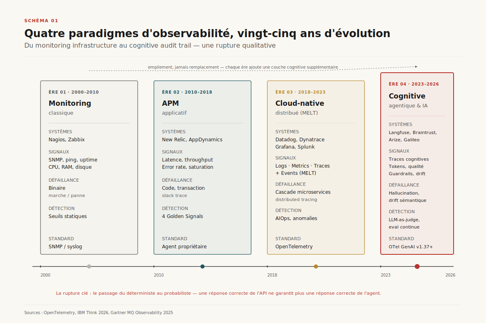
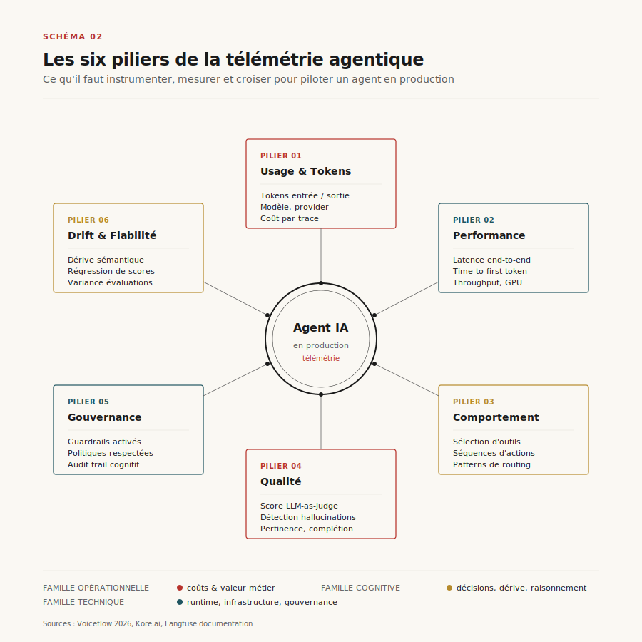
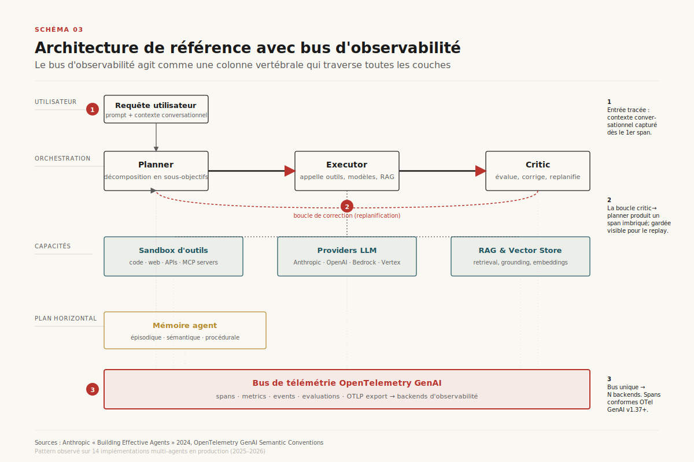
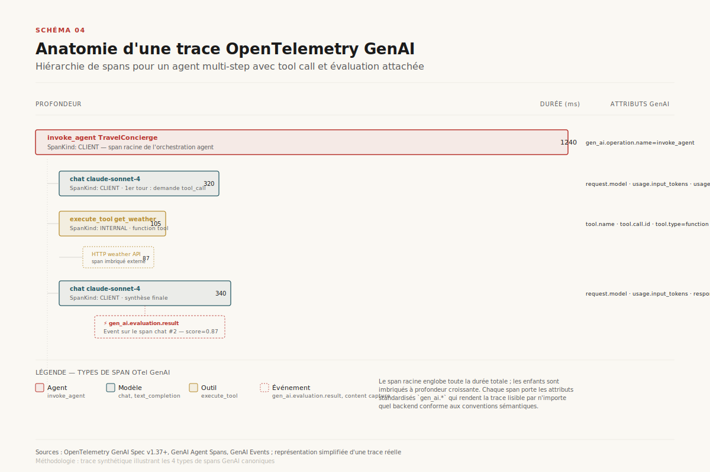
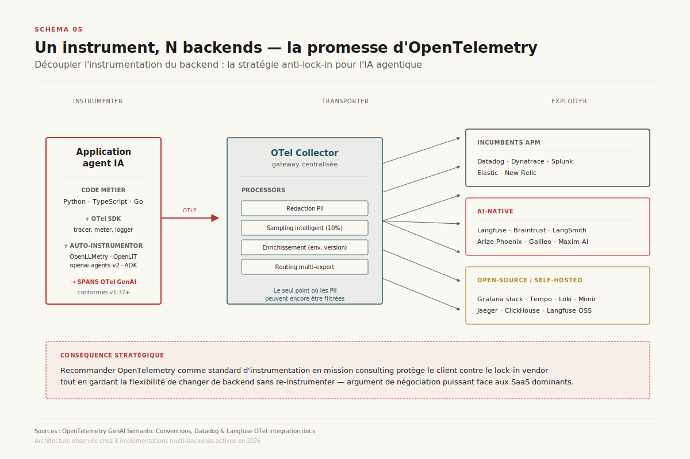
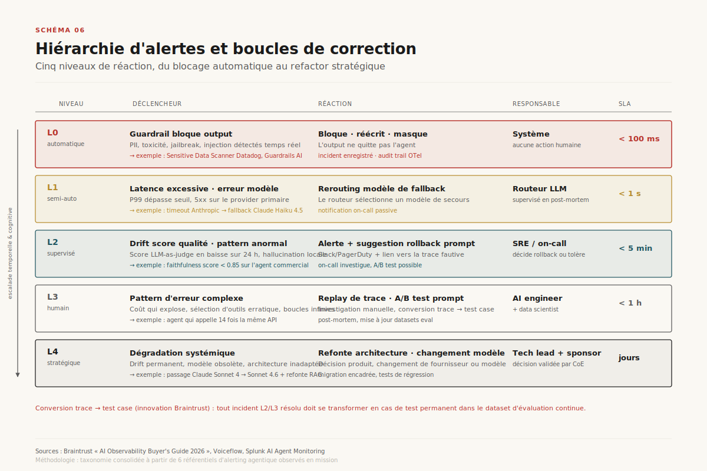
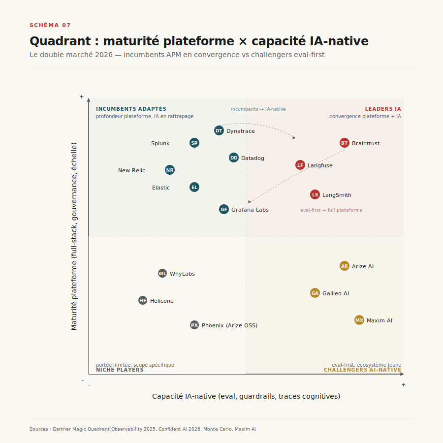
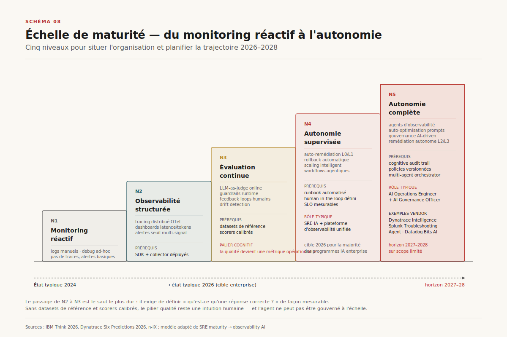

# Observabilité des agents IA — du monitoring au cognitive audit trail

> **En 2026, l'observabilité est devenue le goulot d'étranglement de l'IA agentique en production : sans elle, 40 % des projets sont annulés pour des raisons de fiabilité, et les organisations confondent « système qui répond » avec « système qui répond correctement ».** — Mathieu Guglielmino, 30 avril 2026

---

## Synthèse exécutive

Déployer un agent IA en 2026 sans observabilité revient à piloter un avion sans instruments. Cinq constats structurent ce rapport :

- **L'observabilité IA s'empile sur l'observabilité SI, elle ne la remplace pas.** Un agent en production exige les deux couches : infrastructure/applicative classique (latence API, disponibilité, GPU) ET cognitive (raisonnement, qualité d'output, conformité guardrails).
- **Le pivot technique de la décennie est OpenTelemetry GenAI** (v1.37+, statut expérimental en avril 2026, stabilisation prévue S2 2026). Les conventions sémantiques `gen_ai.*` standardisent quatre types de spans — agent, modèle, outil, événement — et rendent la télémétrie portable entre frameworks et backends.
- **Le marché se polarise.** Les incumbents APM (Dynatrace, Datadog, Splunk) intègrent à marche forcée des capacités IA mais restent en retrait sur l'évaluation qualité ; les challengers AI-native (Langfuse, Braintrust, Arize) dominent l'eval mais manquent de profondeur plateforme. La convergence est en cours mais loin d'être achevée.
- **La qualité devient une métrique opérationnelle.** Le saut de maturité le plus difficile (niveau 2 → niveau 3) consiste à définir « qu'est-ce qu'une bonne réponse ? » de façon mesurable, via des datasets de référence et des scorers (LLM-as-judge, heuristiques, custom).
- **La stratégie anti-lock-in passe par OpenTelemetry.** Recommander OTel comme standard d'instrumentation en mission consulting protège contre la facture explosive des SaaS dominants (un workload IA génère 10 à 50 fois plus de télémétrie qu'un service classique) et préserve la liberté de changer de backend sans réinstrumenter.

---

## 1. Du déterministe au probabiliste — la rupture paradigmatique

L'observabilité ne s'est pas inventée en 2023 avec les agents IA. Elle a traversé quatre paradigmes successifs depuis 2000, chacun ajoutant une couche au-dessus de la précédente sans remplacer les fondations[^1][^3].

*Schéma 1 — Évolution des paradigmes d'observabilité de 2000 à 2026 : monitoring infrastructure (Nagios/Zabbix), APM applicatif (New Relic/AppDynamics), observabilité cloud-native distribuée (MELT, OpenTelemetry), puis observabilité cognitive agentique (traces cognitives, LLM-as-judge, audit trail de raisonnement).*

Chaque ère répondait aux limites de la précédente. Le monitoring SNMP voyait le serveur mais pas la requête. L'APM voyait la transaction mais pas la cascade microservices. Le tracing distribué voyait la cascade mais pas le raisonnement. L'observabilité agentique voit le raisonnement — mais doit s'appuyer sur les trois couches précédentes pour le contextualiser.

La rupture véritable n'est ni technique ni outillée : elle est **épistémologique**. Pendant deux décennies, le système était déterministe — mêmes inputs, mêmes outputs, défaillance binaire (marche/panne) avec stack trace pour debug. Les agents IA introduisent un régime non-déterministe : même input, outputs variables, défaillance graduelle (drift, dégradation, hallucination), causalité indirecte (prompt + contexte + modèle + données). Un agent ne *crashe* pas — il *dérive*. Voir Schéma 1 pour la cartographie complète.

Quatre angles morts caractérisent l'incapacité de l'APM traditionnel à couvrir ce nouveau terrain[^2] :

- **Cécité comportementale** — l'APM suit requêtes et erreurs, mais pas les glissements comportementaux du modèle (sélection d'outils anormale, perte de contexte conversationnel).
- **Ignorance statistique** — incapacité à détecter des patterns probabilistes : scores bimodaux, drift de confiance, variance qui augmente sans déclencher de seuil.
- **Vide causal** — les outils déterministes supposent une causalité directe (stack trace → ligne de code) ; l'IA se dégrade par causalité indirecte et diffuse (un nouveau prompt subtilement biaisé, une source RAG actualisée, une version de modèle silencieusement mise à jour côté provider).
- **Absence de contexte** — inspection requête par requête sans vision des patterns séquentiels, alors que la chaîne de raisonnement est précisément ce qu'il faut observer.

Les chiffres parlent : 89 % des organisations ont implémenté une forme d'observabilité pour leurs agents[^9], 57 % ont des agents IA en production[^5], et Gartner prédit que **40 % des projets d'IA agentique seront annulés d'ici 2027 pour des raisons de fiabilité**[^4]. L'écart entre expérimentation et production enterprise — moins de 10 % des organisations ont scalé l'IA agentique au niveau fonctionnel[^3] — est avant tout un gap d'observabilité.

---

## 2. Les six piliers de la télémétrie agentique

L'instrumentation d'un agent en production exige une couverture sur six dimensions distinctes, qui doivent toutes être croisées dans le bus de télémétrie[^5][^6]. Aucune n'est suffisante seule.

*Schéma 2 — Cartographie des six piliers : usage & tokens, performance, comportement, qualité, gouvernance, drift & fiabilité. Chaque pilier produit ses propres signaux mais leur valeur se révèle à la croisée — un coût qui explose sans drift de qualité signale un problème de routing, un drift de qualité sans surcoût signale un problème de prompt ou de modèle.*

**Usage & tokens** est le pilier le plus opérationnel : tokens en entrée et en sortie pour chaque appel modèle, combinés au provider et au modèle utilisés. Cela révèle d'où viennent les coûts, quels agents ou routes sont onéreux, et comment l'usage évolue après modification du prompt ou du routing. La spec OTel GenAI v1.37+ standardise les attributs `gen_ai.usage.input_tokens` et `gen_ai.usage.output_tokens`[^11].

**Performance** couvre la latence de bout en bout, le TTFT, le throughput par agent, et la performance GPU pour les déploiements on-premise. Les métriques infrastructure classiques restent pertinentes mais ne suffisent plus.

**Comportement** est le cœur de l'observabilité agentique : quelles décisions l'agent prend-il ? Quels outils sélectionne-t-il ? Comment navigue-t-il entre ses étapes de raisonnement ? C'est ici que les traces distribuées prennent toute leur dimension, avec des spans hiérarchiques représentant chaque opération (voir Schéma 4).

**Qualité** déplace la question de « l'agent a-t-il répondu ? » vers « la réponse était-elle correcte, complète et alignée avec les politiques ? ». Les évaluations automatisées — LLM-as-judge, heuristiques, scorers custom — mesurent la qualité à l'échelle. Galileo annonce une précision de 93–97 % sur ses Luna-2 evaluators[^15] ; Braintrust intègre 25+ scorers built-in[^14].

**Gouvernance** documente ce qui a été activé : quels guardrails se sont déclenchés, ont-ils bloqué ou modifié des actions, quelles sources de données l'agent a-t-il interrogées. Essentiel pour l'audit, l'explication des blocages, et la traçabilité réglementaire (finance, santé, secteur public).

**Drift & fiabilité** capture l'évolution temporelle des scores d'évaluation pour détecter la dérive comportementale. Quand un nouveau prompt, modèle ou outil dégrade la fiabilité, le changement apparaît comme un *shift* dans les scores et les patterns d'erreur sur le trafic réel — pas comme une erreur runtime.

---

## 3. Architecture de référence — le bus d'observabilité comme colonne vertébrale

L'erreur la plus fréquente dans les premières implémentations consiste à traiter l'observabilité comme une couche de monitoring *en aval* du système agentique. La bonne abstraction est inverse : le bus d'observabilité est une **colonne vertébrale horizontale** que tous les composants traversent[^7].

*Schéma 3 — Architecture de référence pour un agent multi-step : couche orchestration (planner / executor / critic), couche capacités (sandbox d'outils, providers LLM, RAG), couche mémoire, et bus de télémétrie OpenTelemetry GenAI traversant l'ensemble. Les pointillés rouges signalent les flux de télémétrie vers le bus ; chaque composant émet des spans conformes aux conventions sémantiques.*

Trois choix de design méritent une attention particulière. Le premier est la **séparation orchestration/capacités** : le planner décompose en sous-objectifs, l'executor appelle outils et modèles, le critic évalue et replanifie si nécessaire. Cette séparation rend chaque rôle observable individuellement (Schéma 3, repère 2 : la boucle de correction critic→planner produit un span imbriqué visible dans les traces).

Le second est la **sandbox d'outils**, isolée du système de production. C'est elle qui exécute les actions de l'executor — appels API, requêtes vector store via MCP, exécution de code. L'isolation est à la fois sécuritaire (un agent compromis ne peut pas atteindre la prod directement) et observable (chaque appel produit un span `execute_tool` avec ses paramètres et son résultat capturés en option).

Le troisième est l'unification mémoire/télémétrie en un **plan horizontal**. La mémoire agent (épisodique, sémantique, procédurale) et le bus de télémétrie partagent la même position structurelle dans l'architecture : transverse à toutes les opérations, accessible en lecture/écriture par tous les agents, persistante au-delà d'une trace individuelle. Cette parité conceptuelle simplifie la gouvernance.

Le bus central — OpenTelemetry GenAI — exporte vers N backends via OTLP. C'est le point de découplage stratégique qui justifie l'effort d'instrumentation et qui constitue le sujet de la section suivante.

---

## 4. OpenTelemetry GenAI — le standard d'instrumentation

Le projet **GenAI Observability** au sein d'OpenTelemetry est porté par une coalition de contributeurs (Amazon, Elastic, Google, IBM, Langtrace, Microsoft, OpenLIT, Scorecard, Traceloop) et joue pour les agents IA le rôle qu'OpenTelemetry a joué pour les microservices : un vocabulaire commun qui rend l'instrumentation portable[^11][^7]. Les conventions sémantiques `gen_ai.*` (v1.37+ en avril 2026, statut expérimental, transition vers stable prévue S2 2026) définissent quatre types de spans canoniques.

*Schéma 4 — Hiérarchie de spans pour un agent multi-step : `invoke_agent` (racine, `SpanKind: CLIENT`) englobe deux appels `chat` au modèle et un `execute_tool`, complétés par un événement `gen_ai.evaluation.result` attaché au second `chat` pour le score de qualité.*

Les quatre types de spans GenAI[^12] :

- **Agent spans** (`invoke_agent`) — un span racine par invocation d'agent, portant `gen_ai.agent.name`, `gen_ai.agent.id`, `gen_ai.conversation.id`. Le `SpanKind` est `CLIENT` pour un agent distant et `INTERNAL` pour un agent in-process.
- **Model spans** (`chat`, `text_completion`) — un span par appel LLM, portant `gen_ai.request.model`, `gen_ai.response.model` (le modèle réellement utilisé peut différer du modèle demandé via aliasing/routing — un piège fréquent), `gen_ai.usage.input_tokens` et `gen_ai.usage.output_tokens`.
- **Tool spans** (`execute_tool`) — un span par invocation d'outil, avec `gen_ai.tool.name`, `gen_ai.tool.call.id`, et `gen_ai.tool.type` parmi `function` (outil côté client), `extension` (outil côté agent), `datastore` (RAG, grounding).
- **Events** — `gen_ai.client.inference.operation.details` capture les payloads en opt-in, `gen_ai.evaluation.result` attache un score de qualité directement au span de l'opération évaluée plutôt que de le stocker séparément.

Le déploiement opérationnel passe par le pattern **un instrument, N backends**. C'est la proposition de valeur fondamentale d'OTel pour l'IA : découpler l'instrumentation du backend d'observabilité.

*Schéma 5 — L'application instrumentée une fois (SDK OTel + auto-instrumentor) émet des spans conformes vers un Collector central qui applique les processors — redaction PII, sampling, enrichissement, routing — puis exporte vers les backends choisis : incumbents APM, AI-native, ou stack open-source self-hosted.*

Trois bonnes pratiques structurent un déploiement OTel GenAI mature[^13][^11]. **Premièrement**, activer le flag `gen_ai_latest_experimental` pour utiliser les conventions v1.37+ et anticiper la stabilisation. **Deuxièmement**, désactiver le content capture en production par défaut (`OTEL_INSTRUMENTATION_GENAI_CAPTURE_MESSAGE_CONTENT=false`) — les prompts contiennent souvent des données sensibles ; le Collector reste le seul endroit où les PII peuvent être redactées avant export. **Troisièmement**, utiliser le Collector OTel comme gateway centralisée : c'est le point unique de redaction, sampling et routing, et le seul moyen de déployer une politique homogène à travers les frameworks d'agents.

Côté écosystème, **OpenLLMetry** (Traceloop, en cours de donation à OpenTelemetry) couvre 44+ providers LLM et frameworks d'agents[^16]. **OpenLIT** propose une instrumentation en une ligne (`openlit.init()`) couvrant LLMs, vector DBs, GPUs[^17]. Les frameworks récents — PydanticAI, smolagents, Strands Agents, CrewAI, Google ADK — émettent nativement des traces OTel sans dépendance tierce.

> Recommander OpenTelemetry comme standard d'instrumentation en mission consulting protège le client contre le lock-in vendor tout en gardant la flexibilité de changer de backend sans re-instrumenter — un argument de négociation puissant face aux SaaS dominants dont la facture peut atteindre 40 à 200 % de surcoût après ajout du monitoring IA[^19].

---

## 5. Réactions et boucles de correction

Une plateforme d'observabilité qui ne déclenche aucune réaction n'est qu'un dashboard. La valeur opérationnelle vient des **boucles de correction** qu'elle orchestre, depuis le blocage automatique en moins de 100 ms jusqu'au refactor stratégique sur plusieurs jours.

*Schéma 6 — Cinq niveaux de réaction (L0 à L4) avec leurs déclencheurs, leurs réponses, leurs responsables et leurs SLA. La hiérarchie n'est pas une échelle de gravité mais une échelle de cognition requise : plus on monte, plus la décision exige du contexte humain.*

Trois bonnes pratiques structurent un alerting agentique mature[^14][^11] :

**Évaluations online continues** — scorer chaque interaction en production (pas seulement en offline) pour détecter les régressions en temps réel. Sans cela, le drift n'apparaît qu'au prochain audit batch, parfois plusieurs semaines après l'incident.

**Alertes multi-signal** — croiser latence + score qualité + coût pour éviter les faux positifs. Une latence élevée seule peut être un pic temporaire ; une latence élevée corrélée à un drop de score qualité ET un surcoût signale une régression réelle.

**Conversion trace → test case** (innovation Braintrust)[^14] — quand un problème est détecté en production, convertir la trace fautive en cas de test permanent dans le dataset d'évaluation. C'est le mécanisme qui transforme un incident isolé en immunité durable du système.

Pour les environnements régulés (finance, santé, assurance), un quatrième mécanisme s'ajoute : le **cognitive audit trail**[^5]. Chaque trace est enrichie avec métadonnées de versioning de modèle, tagging de politique, contrôle d'accès. Cela produit une lignée complète du raisonnement agent, permettant de répondre *a posteriori* à la question : « pourquoi cet agent a-t-il pris cette décision à ce moment-là, sur la base de quelles données ? »

---

## 6. Cartographie du marché — incumbents, challengers AI-native

Le marché de l'observabilité 2026, valorisé à environ 60 milliards de dollars[^4], se structure autour d'un **double marché** : incumbents APM (full-stack, gouvernance, échelle) et challengers AI-native (eval, guardrails, traces cognitives). La frontière s'estompe mais reste significative.

*Schéma 7 — Positionnement indicatif des principaux acteurs sur les deux axes critiques. Les flèches signalent les mouvements en cours : les incumbents montent en capacité IA-native via acquisitions et build (Datadog LLM Observability, Dynatrace AI Agent Monitoring), les AI-native étendent leur scope plateforme (Langfuse intègre infra metrics, Braintrust devient une plateforme de cycle de vie complet).*

**Dynatrace** (Leader Gartner, #1 Ability to Execute pour la 15e année consécutive[^18]) revendique le territoire premium avec trois différenciateurs uniques : Davis AI hypermodale (causale + prédictive + générative), Grail (data lakehouse unifié sans indexation), et Smartscape (graphe de dépendances temps réel). Depuis février 2026, Dynatrace Intelligence positionne la plateforme comme un « OS agentique » avec des Intelligence Agents spécialisés (SRE / Developer / Security) et un MCP Server pour l'interaction avec assistants IA externes[^20].

**Datadog** (Leader Gartner, 5e année[^18]) a la trajectoire de challenger la plus crédible : LLM Observability en GA, Bits AI assistant, support natif des conventions OTel GenAI v1.37+ depuis décembre 2025[^21], Experiments pour A/B testing de prompts, Sensitive Data Scanner inclus. Mais sa facturation cumule per-host APM + per-GB logs + per-span traces + per-LLM-span (8 $/10K spans annuel) — les workloads IA peuvent multiplier la facture par 2 à 3.

**Splunk/Cisco** mise sur la convergence sécurité-observabilité avec AI Agent Monitoring (GA Q1 2026), Cisco AI PODs pour le monitoring de l'infrastructure IA pré-validée (NVIDIA NIMs, Milvus, LiteLLM), un Troubleshooting Agent et le Splunk MCP Server. La complexité post-acquisition Cisco et la coexistence Splunk/AppDynamics restent des friction points.

**Grafana Labs** (Leader Gartner, #1 Completeness of Vision[^22]) capture le segment OTel-first / coût-conscient avec la stack LGTM (Loki/Grafana/Tempo/Mimir). Pas de capacité d'évaluation IA native, mais réception native des traces GenAI via Tempo et coût 10 à 50 fois inférieur aux solutions propriétaires.

**Elastic** (Leader Gartner, 2e année), **New Relic** (pricing transparent, pivot mid-market) complètent le paysage incumbent.

Côté challengers AI-native, le segment se structure autour de l'**évaluation comme primitive d'observabilité** — précisément le gap que les incumbents n'ont pas encore fermé[^14] :

- **Langfuse** (open-source MIT, OTel natif, self-hosted ou cloud) — le leader open-source de référence ; gratuit, communauté active, intégrations framework natives.
- **Braintrust** — plateforme intégrée eval-first, conversion traces → test cases en un clic, Loop AI pour scorers custom, 25+ scorers built-in ; utilisé par Notion, Stripe, Zapier.
- **Arize AI** + **Phoenix** (open-source) — rigueur statistique académique, embedding drift detection, pont entre ML traditionnel et LLM observability.
- **Galileo AI** — Luna-2 evaluators avec précision propriétaire 93-97 %, guardrails production[^15].
- **Maxim AI** — full lifecycle (simulation + évaluation + observabilité unifiées).

| Critère | Incumbents (Dynatrace, Datadog…) | AI-native (Langfuse, Braintrust…) |
|---|---|---|
| Latence, tokens, errors | Excellent | Bon |
| Topologie et dépendances | Excellent | Absent |
| Infrastructure monitoring | Complet | Absent |
| Évaluation qualité output | Basique | Excellent |
| LLM-as-judge automatisé | Limité | Natif |
| Guardrails runtime | Émergent | Intégré |
| Traces → test cases | Absent | Natif (Braintrust) |
| Prompt management | Absent | Natif (Langfuse) |
| Coût relatif | $$$$$ | $ à $$ |
| Self-hosted | Limité | Disponible (Langfuse MIT) |

Le choix n'est donc pas binaire. L'architecture mature en 2026 est typiquement **hybride** : un backend full-stack (Dynatrace, Datadog ou Grafana selon le profil) couplé à un outil AI-native (Langfuse ou Braintrust) pour la couche évaluation, le tout fédéré par OpenTelemetry comme protocole d'instrumentation unique.

---

## 7. Maturité organisationnelle et feuille de route

L'observabilité IA n'est pas un outil qu'on installe — c'est une capacité organisationnelle qu'on construit. Cinq niveaux de maturité, du monitoring réactif à l'autonomie complète, structurent la trajectoire 2026–2028.

*Schéma 8 — Cinq niveaux de maturité avec leurs prérequis, rôles typiques et exemples vendor. Le passage de N2 à N3 (le palier cognitif) est le saut le plus difficile : il exige de définir « qu'est-ce qu'une réponse correcte ? » de façon mesurable, via datasets de référence et scorers calibrés.*

Les organisations ne sautent pas directement à l'autonomie complète. Elles progressent par paliers, et chaque palier exige des prérequis qui le rendent possible[^3][^5] :

- **N1 — Monitoring réactif** : logs manuels, debug ad-hoc, pas de traces. État de la majorité des projets pré-production en 2024–2025.
- **N2 — Observabilité structurée** : tracing distribué OTel, dashboards latence/tokens, alertes seuil multi-signal. Prérequis : SDK + Collector déployés.
- **N3 — Évaluation continue** : LLM-as-judge online, guardrails runtime, feedback loops humains, drift detection. **Le palier cognitif** — la qualité devient une métrique opérationnelle. Prérequis : datasets de référence, scorers calibrés.
- **N4 — Autonomie supervisée** : auto-remédiation L0/L1, rollback automatique, scaling intelligent, workflows agentiques. Cible 2026 pour la majorité des programmes IA enterprise. Prérequis : runbooks automatisés, SLO mesurables, human-in-the-loop défini.
- **N5 — Autonomie complète** : agents d'observabilité, auto-optimisation des prompts, gouvernance AI-driven, remédiation autonome L2/L3. Horizon 2027–2028 sur scope limité. Exemples vendor : Dynatrace Intelligence, Splunk Troubleshooting Agent, Datadog Bits AI[^4][^20].

La tendance 2026 la plus forte est l'intégration d'**agents d'observabilité** — des agents IA spécialisés qui ingèrent les données d'observabilité pour diagnostiquer, corréler et remédier. Un agent spécialisé dans les logs analyse, extrait des patterns, trouve des anomalies puis collabore avec d'autres agents pour remédier et prévenir. Mais cette autonomie n'est ni gratuite ni sûre : elle dépend de l'observabilité de premier ordre (les agents observent ce que la plateforme leur donne à voir) et exige une gouvernance renforcée (qui supervise l'agent qui supervise les agents ?).

---

## 8. Conclusion stratégique

Trois recommandations pour les programmes IA agentique entrant en production en 2026 :

**Standardiser sur OpenTelemetry GenAI dès le premier sprint.** Le coût d'instrumentation est marginal au démarrage et asymptotique si on attend. Le choix de backend devient alors révisable, ce qui transforme la négociation commerciale et préserve la liberté architecturale.

**Investir le palier cognitif (N3) avant l'autonomie (N4).** Les organisations qui sautent cette étape construisent de l'auto-remédiation sur des signaux non calibrés et obtiennent une autonomie illisible. Constituer un dataset de référence et calibrer trois à cinq scorers de qualité sur les cas d'usage critiques reste la meilleure assurance contre la dérive silencieuse.

**Adopter une architecture hybride backend full-stack + AI-native.** Aucun acteur ne couvre seul l'ensemble du spectre en 2026. La combinaison Dynatrace ou Datadog ou Grafana (selon le profil budget/maturité) avec Langfuse ou Braintrust (selon le profil eval) couvre 95 % des besoins enterprise tout en limitant le lock-in.

L'observabilité des agents IA en 2026 n'est pas une catégorie d'outils — c'est une discipline en train de naître. Elle hérite de vingt-cinq ans de pratiques DevOps/SRE, qu'elle complète par une couche cognitive irréductible aux signaux infrastructure. Sa maturité, encore inégale, est désormais le facteur limitant de l'industrialisation de l'IA en entreprise.

---

## Sources

[^1]: OpenTelemetry, *AI Agent Observability Standards*, OpenTelemetry Blog, mars 2025. URL : https://opentelemetry.io/blog/2025/ai-agent-observability/. Consulté le 2026-04-30.

[^2]: InsightFinder, *AI Observability vs Traditional Monitoring*, décembre 2025. URL : https://insightfinder.com/blog/ai-observability-vs-traditional-monitoring/. Consulté le 2026-04-30.

[^3]: IBM Think, *Observability Trends 2026*, IBM Institute for Business Value, mars 2026. URL : https://www.ibm.com/think/insights/observability-trends. Consulté le 2026-04-30.

[^4]: Dynatrace, *Six Observability Predictions for 2026*, décembre 2025. URL : https://www.dynatrace.com/news/blog/six-observability-predictions-for-2026/. Consulté le 2026-04-30.

[^5]: Kore.ai, *AI Observability: Monitoring & Governing AI Agents*, mars 2026. URL : https://www.kore.ai/blog/what-is-ai-observability. Consulté le 2026-04-30.

[^6]: Voiceflow, *What Is AI Agent Observability? A 2026 Guide*, mars 2026. URL : https://www.voiceflow.com/blog/what-is-ai-agent-observability. Consulté le 2026-04-30.

[^7]: Anthropic, *Building Effective Agents*, whitepaper, décembre 2024. URL : https://www.anthropic.com/research/building-effective-agents. Consulté le 2026-04-30.

[^8]: Groundcover, *AI Agent Observability Guide: Telemetry, Traces, Metrics*, février 2026. URL : https://www.groundcover.com/learn/observability/ai-agent-observability. Consulté le 2026-04-30.

[^9]: N-iX, *AI Agent Observability: Practical Framework*, décembre 2025. URL : https://www.n-ix.com/ai-agent-observability/. Consulté le 2026-04-30.

[^10]: Langfuse, *AI Agent Observability, Tracing & Evaluation*, février 2026. URL : https://langfuse.com/blog/2024-07-ai-agent-observability-with-langfuse. Consulté le 2026-04-30.

[^11]: OpenTelemetry, *GenAI Semantic Conventions (specification)*, version 1.37, 2026. URL : https://opentelemetry.io/docs/specs/semconv/gen-ai/. Consulté le 2026-04-30.

[^12]: OpenTelemetry, *GenAI Agent Spans, Model Spans, Tool Spans, Events*, 2026. URL : https://opentelemetry.io/docs/specs/semconv/gen-ai/gen-ai-agent-spans/. Consulté le 2026-04-30.

[^13]: Datadog, *LLM Observability + OTel GenAI Semantic Convention support*, décembre 2025. URL : https://www.datadoghq.com/blog/llm-otel-semantic-convention/. Consulté le 2026-04-30.

[^14]: Braintrust, *AI Observability Tools: Buyer's Guide 2026*, janvier 2026. URL : https://www.braintrust.dev/articles/best-ai-observability-tools-2026. Consulté le 2026-04-30.

[^15]: GetMaxim, *Top 5 AI Agent Observability Platforms 2026*, décembre 2025. URL : https://www.getmaxim.ai/articles/top-5-ai-agent-observability-platforms-in-2026/. Consulté le 2026-04-30.

[^16]: Traceloop, *OpenLLMetry — auto-instrumentation OTel pour 44+ providers LLM*, GitHub, 2026. URL : https://github.com/traceloop/openllmetry. Consulté le 2026-04-30.

[^17]: OpenLIT, *OpenLIT SDK — auto-instrumentation 1 ligne LLMs/vector DBs/GPUs*, GitHub, 2026. URL : https://github.com/openlit/openlit. Consulté le 2026-04-30.

[^18]: Gartner, *Magic Quadrant for Observability Platforms 2025*, juillet 2025. URL : https://www.gartner.com/en/documents/6688834. Consulté le 2026-04-30.

[^19]: OneUptime, *AI Workloads Observability: Cost Crisis*, avril 2026. URL : https://oneuptime.com/blog/ai-workloads-observability-cost-crisis. Consulté le 2026-04-30.

[^20]: Dynatrace, *Dynatrace Intelligence — Agentic OS announcement at Perform 2026*, février 2026. URL : https://www.dynatrace.com/news/blog/dynatrace-intelligence-platform/. Consulté le 2026-04-30.

[^21]: Splunk, *Q1 2026 Observability Update — AI Agent Monitoring*, février 2026. URL : https://www.splunk.com/en_us/blog/observability/splunk-observability-ai-agent-monitoring-innovations.html. Consulté le 2026-04-30.

[^22]: Grafana Labs, *Leader Gartner Magic Quadrant Observability 2025 — #1 Completeness of Vision*, 2025. URL : https://grafana.com/about/press/2025/07/. Consulté le 2026-04-30.

---

*Rapport produit le 30 avril 2026 — Mathieu Guglielmino. Synthèse de trois rapports de recherche internes (3 et 7 avril 2026) consolidés et illustrés.*
