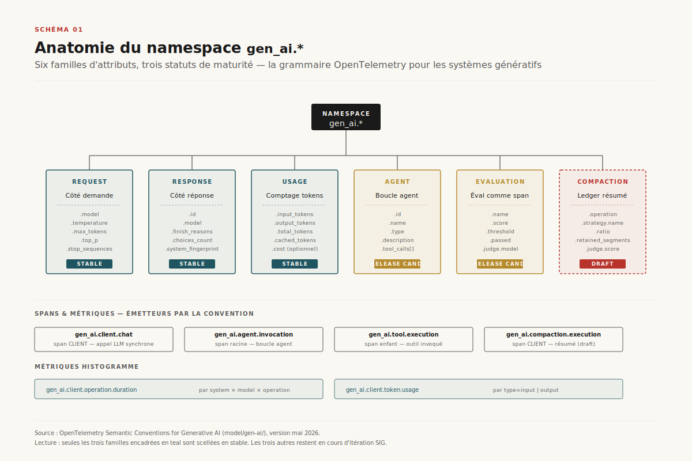
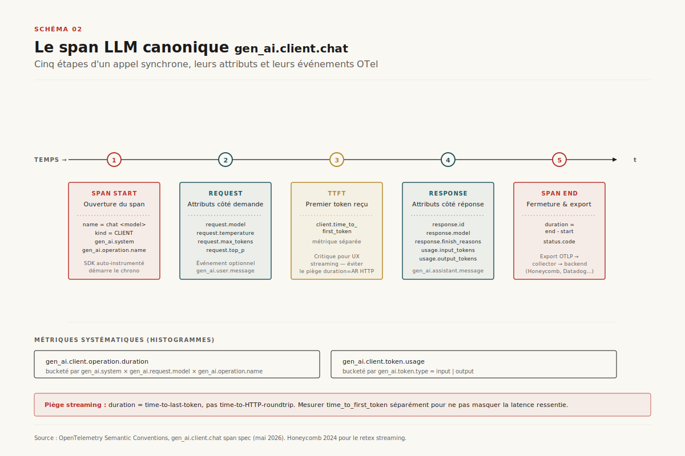
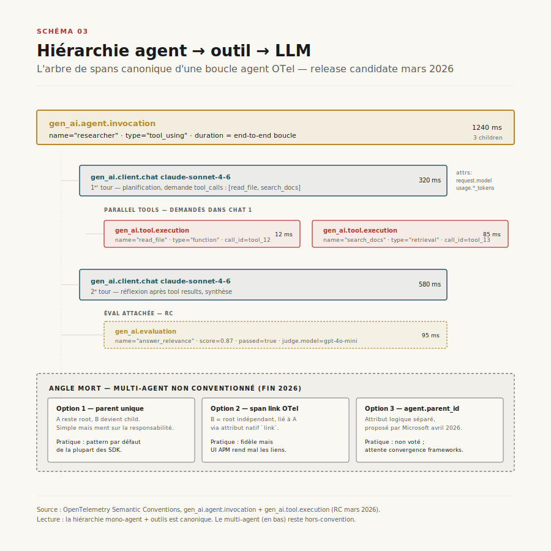
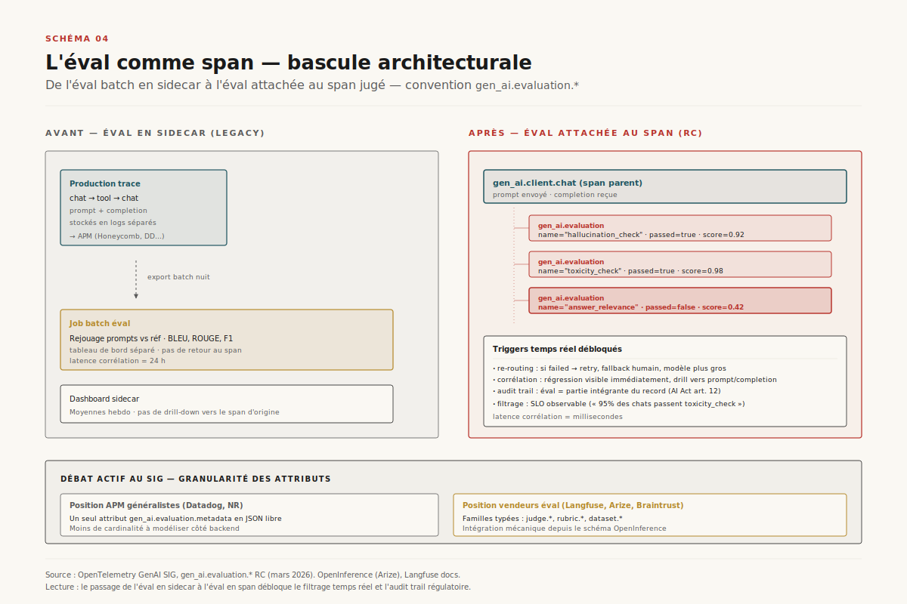

# OpenTelemetry GenAI semconv en production

> **Les *semantic conventions* OpenTelemetry GenAI sont devenues, en deux ans, la première grammaire d'observabilité partagée entre éditeurs, vendeurs APM et plateformes agentiques — mais le namespace `gen_ai.*` n'est stable que sur le LLM-call seul ; l'agent et l'éval sont en *release candidate*, et la compaction est encore un draft.** — 5 juin 2026, Mathieu Guglielmino

## Synthèse exécutive

- En **mai 2026**, le namespace `gen_ai.*` d'OpenTelemetry sort officiellement de **stable** pour la couche LLM-call : `gen_ai.client.operation.duration`, `gen_ai.client.token.usage`, et le span `chat` agrégé deviennent canoniques. Tous les APM tier-1 (Datadog, New Relic, Honeycomb, Grafana, Dynatrace) émettent et reçoivent ces signaux nativement[^1][^2].
- **L'éval reste en release candidate.** `gen_ai.evaluation.*` (score, judge_model, threshold, passed) est dessiné mais non scellé ; les vendeurs spécialisés (Langfuse, Arize, Braintrust, Patronus) injectent leurs propres extensions en attendant le vote final, prévu fin 2026[^3][^4].
- **La compaction est un draft ouvert.** Le groupe de travail GenAI SIG a démarré début 2026 le namespace `gen_ai.compaction.*` (operation, ratio, retained_tokens, lost_information_score, strategy) pour rendre observable ce qui se passe entre deux tours d'agent quand 200 k tokens deviennent 8 k. Pas de release avant **mi-2027**[^5].
- **Multi-agent : pas de convention.** La conversation `gen_ai.agent.*` couvre l'agent unique avec sa boucle outil. L'orchestration agent-à-agent — handoffs, supervisor-workers, swarm — reste hors convention : chaque framework (LangGraph, AutoGen, Google ADK, Claude Agent SDK) trace à sa façon. Le SIG attend que l'écosystème converge avant de standardiser[^6].
- **L'AI Act et le NIST AI RMF rendent l'observabilité contractuelle.** Article 12 du règlement européen (record-keeping) + AI RMF MEASURE 2.5 (transparency of operations) imposent un audit trail. ==L'OTel GenAI semconv devient de facto la lingua franca de cette obligation==, même si aucun texte régulatoire ne la cite nommément[^7][^8].

## 1. Pourquoi une grammaire commune

Entre la sortie de ChatGPT (novembre 2022) et fin 2025, chaque vendeur d'observabilité a inventé son propre dialecte. Datadog tracait les LLM via `llm.request.model`, `llm.usage.prompt_tokens` ; Langfuse via `model`, `usage.input` ; Helicone via `helicone-llm-model` en header HTTP. La conséquence : un agent instrumenté pour Honeycomb n'était pas relisible sur Datadog sans une couche d'adaptation custom, et migrer d'un APM à l'autre signifiait réinstrumenter tout le code applicatif.

==Le projet `gen_ai.*` d'OpenTelemetry, démarré au sein du *Semantic Conventions Working Group* en septembre 2023, naît précisément pour casser ce verrouillage.== Le pari est qu'une *application* qui émet des spans conformes à la convention OTel peut être reçue par n'importe quel backend qui parle OTLP (le protocole de transport OTel) sans une ligne de code spécifique au vendeur[^1].

La promesse a un précédent : le namespace `http.*`, scellé en 2023 après cinq ans d'itération, a unifié l'observabilité des appels HTTP entre tous les SDK et tous les backends. Personne, en 2026, ne nomme un attribut `myapp.request.method` quand `http.request.method` existe — c'est la même bataille qui se rejoue, dix ans plus tard, sur la couche LLM.

La OTel GenAI SIG (Special Interest Group) est devenu le forum de cette convergence. Co-piloté par des contributeurs de Microsoft (Azure AI Foundry), de Google (Vertex AI), d'Elastic, de Honeycomb et de quelques vendeurs purs LLM (Langfuse, Arize), il se réunit toutes les deux semaines depuis janvier 2024 et publie ses minutes publiquement[^2]. Anthropic, OpenAI et Mistral ne sont pas membres actifs du SIG mais respectent la convention dans leurs SDK officiels — ils observent le résultat plutôt que de le co-écrire.



*Schéma 1 — Le tronc commun `gen_ai.*` et ses six branches. Trois sont stables (request, response, usage), trois en release candidate ou draft (agent, evaluation, compaction). C'est précisément sur ces trois dernières que se joue la bataille 2026-2027.*

## 2. Anatomie du namespace `gen_ai.*`

Le namespace est arborescent. Sa racine `gen_ai` se ramifie en **six familles** d'attributs, chacune avec un statut de maturité distinct.

| Famille | Statut (juin 2026) | Couvre |
|---|---|---|
| `gen_ai.request.*` | **Stable** | Le côté demande : modèle, paramètres (temperature, max_tokens, top_p), messages d'entrée |
| `gen_ai.response.*` | **Stable** | Le côté réponse : id, modèle effectif, finish_reasons, choix multiples |
| `gen_ai.usage.*` | **Stable** | Comptage tokens (input/output/total), coût optionnel |
| `gen_ai.agent.*` | **Release candidate** | Boucle agent : id, name, type, tool_calls |
| `gen_ai.tool.*` | **Release candidate** | Outils invoqués : name, call_id, type, description |
| `gen_ai.evaluation.*` | **Release candidate** | Éval comme span : score, threshold, judge_model, passed |
| `gen_ai.compaction.*` | **Draft** | Compaction de contexte : operation, ratio, retained_tokens, strategy |

À cette taxonomie d'attributs s'ajoute une famille de **spans** (`gen_ai.client.chat`, `gen_ai.client.text_completion`, `gen_ai.agent.invocation`, `gen_ai.tool.execution`) et une famille de **métriques** (`gen_ai.client.operation.duration`, `gen_ai.client.token.usage`)[^1].

La règle de cardinalité est stricte : un attribut peut prendre un nombre **borné** de valeurs distinctes (model, finish_reason, role, …) ; un attribut à cardinalité illimitée (un prompt entier, une réponse complète) n'est jamais un attribut de span, mais un **événement de log** corrélé. Cette distinction, héritée du namespace `http.*`, évite que les backends APM facturent à la dimension explosive des prompts.

L'élément le plus discuté du WG depuis dix-huit mois reste précisément cette séparation : ==faut-il émettre les prompts et complétions en clair dans les spans, ou les confiner aux logs corrélés ?== La position retenue en mai 2026 est un compromis : un attribut optionnel `gen_ai.input.messages` peut être attaché au span sous forme JSON sérialisée, désactivé par défaut, à activer explicitement via une variable d'environnement (`OTEL_INSTRUMENTATION_GENAI_CAPTURE_MESSAGE_CONTENT=true`). Les déploiements régulés (santé, banque) le laissent off ; les déploiements de R&D internes l'activent pour débugger.

## 3. Le span LLM canonique

Le span le plus courant — et le seul stable — est `gen_ai.client.chat`. Il couvre un appel synchrone à un modèle conversationnel (OpenAI Chat Completions, Anthropic Messages API, Vertex AI generateContent, …). Sa forme est rigide.

```text
span name:        chat <model_name>
span kind:        CLIENT
duration:         from request emit to last token received
attributes:
  gen_ai.system            string  required   "openai" | "anthropic" | "azure.ai.inference" | …
  gen_ai.operation.name    string  required   "chat" | "text_completion" | "embeddings"
  gen_ai.request.model     string  required   "claude-sonnet-4-6"
  gen_ai.request.temperature  double  optional
  gen_ai.request.max_tokens   int     optional
  gen_ai.response.id          string  optional
  gen_ai.response.model       string  optional   (modèle effectif, peut différer de request)
  gen_ai.response.finish_reasons  string[]  optional   ["stop"] | ["length"] | ["tool_calls"]
  gen_ai.usage.input_tokens   int     optional
  gen_ai.usage.output_tokens  int     optional
events:
  gen_ai.user.message       (optionnel, gated par capture flag)
  gen_ai.assistant.message  (optionnel, gated par capture flag)
  gen_ai.tool.message       (optionnel, gated par capture flag)
```

Deux métriques l'accompagnent : `gen_ai.client.operation.duration` (histogramme par `gen_ai.system` × `gen_ai.request.model` × `gen_ai.operation.name`) et `gen_ai.client.token.usage` (histogramme par `gen_ai.token.type=input|output`)[^1]. Le SDK OTel auto-instrumenté émet ces deux métriques systématiquement, ce qui permet aux dashboards génériques (« latence p95 par modèle », « tokens consommés par jour ») de fonctionner sans configuration applicative.



*Schéma 2 — Les cinq étapes d'un span `chat` synchrone (start, request, TTFT, response, end). Le piège de streaming, marqué en carmine, est la source de la majorité des bugs d'instrumentation observés en 2024-2025.*

Le point critique — et la source de la majorité des bugs d'instrumentation observés en 2025 — concerne **le streaming**. Pour un appel non-streamé, `duration` est sans ambiguïté ; pour un appel streamé, le SIG a tranché en faveur du *time to last token* (du premier byte d'envoi de requête au dernier delta reçu), avec une métrique séparée optionnelle `gen_ai.client.time_to_first_token`. Les premiers SDK avaient traité le streaming comme un appel instantané (duration = aller-retour HTTP), ce qui produisait des p95 absurdement bas par rapport à l'expérience utilisateur — un point que Honeycomb a documenté publiquement en juin 2024[^3].

## 4. Agents et outils — la couche RC

Au-dessus du span LLM-call vient la couche agentique, en *release candidate* depuis mars 2026. Un agent dans la convention OTel est modélisé comme un **span parent** qui contient zéro ou plusieurs spans `gen_ai.tool.execution` et `gen_ai.client.chat` enfants.

```text
gen_ai.agent.invocation  [duration = end-to-end de la boucle]
├── gen_ai.client.chat   [appel 1 — planning]
├── gen_ai.tool.execution  name=read_file  duration=12ms
├── gen_ai.client.chat   [appel 2 — réflexion après outil]
├── gen_ai.tool.execution  name=write_file  duration=8ms
└── gen_ai.client.chat   [appel 3 — synthèse finale]
```

L'attribut clé est `gen_ai.agent.id` (UUID stable d'une instance d'agent) plus `gen_ai.agent.name` (nom logique : « researcher », « executor »). Les outils sont décrits par `gen_ai.tool.name`, `gen_ai.tool.call_id` (id donné par le LLM dans son JSON tool_call), et `gen_ai.tool.type` (function | code_interpreter | retrieval | computer_use)[^1].



*Schéma 3 — Le span racine `gen_ai.agent.invocation` et ses enfants (chat + tool + chat + eval). En bas, l'angle mort multi-agent : trois options coexistent sans verdict du SIG.*

==L'angle mort, fin 2026, c'est le multi-agent.== Quand un agent A délègue à un agent B (handoff dans le pattern Swarm/OpenAI Agents SDK ; supervisor → worker dans LangGraph ; agent-to-agent via le protocole A2A de Google), il n'y a pas de convention claire pour modéliser la transition. Trois pratiques cohabitent :

1. **Span parent unique** — l'agent A reste le span racine, B devient un child. Simple mais ment sur la responsabilité : c'est B qui a échoué, mais c'est A qu'on voit en haut de la trace.
2. **Lien causal explicite** — l'agent B démarre un span racine indépendant, lié au span A via `link` (attribut natif OTel). Plus fidèle, mais les UIs APM rendent mal les liens (Datadog, Grafana Tempo) et les traces apparaissent fragmentées.
3. **Convention `gen_ai.agent.parent_id`** — proposée par Microsoft en avril 2026 mais non encore votée. Permet de reconstruire la hiérarchie logique sans casser la hiérarchie de spans.

Le SIG attend que les frameworks principaux (LangGraph, OpenAI Agents SDK, Google ADK, Claude Agent SDK) convergent sur l'une des trois avant de trancher. Pour l'instant, qui veut tracer un système multi-agent en production écrit sa propre extension[^6].

## 5. L'éval comme span — la couche RC qui change de nature

Historiquement, l'évaluation des LLM se faisait *en sidecar* : un job batch qui rejoue des prompts contre une réf, ou un script qui calcule BLEU/Rouge/F1. La trace de production était une chose, l'éval une autre — les deux ne se croisaient pas.

La convention `gen_ai.evaluation.*`, en *release candidate* depuis mars 2026, change de nature : ==l'éval devient un span enfant du span LLM-call== ou agent qu'elle juge.

```text
gen_ai.client.chat  [span principal]
├── gen_ai.evaluation  name="hallucination_check"  status="passed"
├── gen_ai.evaluation  name="toxicity_check"       status="passed"
└── gen_ai.evaluation  name="answer_relevance"     status="failed"  score=0.42  threshold=0.5
```

Attributs clés : `gen_ai.evaluation.name` (nom du critère), `gen_ai.evaluation.score` (valeur normalisée 0-1), `gen_ai.evaluation.threshold`, `gen_ai.evaluation.passed` (bool), `gen_ai.evaluation.judge.model` (si LLM-as-judge), `gen_ai.evaluation.judge.system`[^4].



*Schéma 4 — À gauche le pattern legacy (éval en sidecar batch). À droite la convention `gen_ai.evaluation.*` en RC : les évals deviennent des spans enfants du span jugé, ce qui débloque triggers temps réel et audit trail régulatoire.*

L'éval-as-span débloque trois usages que l'éval-as-sidecar ne pouvait pas servir :

- **Filtrage en production** — un span dont une éval est `failed` peut déclencher un re-routing automatique (modèle plus gros, retry, fallback humain) sans quitter la chaîne d'instrumentation.
- **Corrélation temps réel** — quand une régression apparaît (baisse de score moyen sur un critère), le dashboard montre directement les prompts et complétions associés, sans pipeline d'export batch.
- **Audit trail régulatoire** — les évals deviennent partie intégrante du record (article 12 AI Act, AI RMF MEASURE), pas un artefact détaché.

Le débat actif du SIG en juin 2026 porte sur la **granularité**. Faut-il un seul attribut `gen_ai.evaluation.metadata` (JSON libre) ou une famille typée (`gen_ai.evaluation.judge.*`, `gen_ai.evaluation.rubric.*`, `gen_ai.evaluation.dataset.*`) ? Les vendeurs spécialisés (Langfuse, Arize, Braintrust, Patronus, Confident) poussent pour la version typée — c'est ce qu'ils émettent déjà sous leur propre schéma OpenInference, et l'intégration mécanique vers OTel les simplifierait. Les APM généralistes préfèrent la version libre — moins de cardinalité à modéliser côté backend[^4][^5].

## 6. Le front compaction — un draft ouvert

C'est le front le plus jeune de la convention. ==La compaction de contexte — résumer 200 k tokens en 8 k pour que l'agent garde la main sur sa boucle outil — est devenue, en 2025-2026, une primitive de la pile agentique.== Claude Code la fait via la commande `/compact`, Cursor automatiquement entre deux sessions longues, Mem0 et Letta la pratiquent comme cœur de produit.

Le problème : **avant le draft `gen_ai.compaction.*`, la compaction était invisible dans les traces**. Le span LLM-call qui ré-injectait un contexte compacté ne signalait pas qu'une compaction avait eu lieu, ni laquelle, ni avec quelle perte d'information. Pour les équipes qui audit la conformité (RGPD, AI Act), c'est un trou noir : un fait privé révélé par un utilisateur à l'agent peut disparaître d'un cycle au suivant, sans laisser de trace de cette disparition[^5].

Le SIG a démarré le draft en janvier 2026 sous l'impulsion conjointe de Honeycomb (qui le réclamait pour ses retex agents) et de Langfuse (qui l'instrumentait déjà unilatéralement). Le draft de juin 2026 propose :

```text
gen_ai.compaction.execution  span (CLIENT)
attributes:
  gen_ai.compaction.operation       "summarize" | "evict" | "hierarchical" | "retrieve"
  gen_ai.compaction.strategy.name   "claude-code-/compact" | "h2o-eviction" | "memgpt-paging" | …
  gen_ai.compaction.input_tokens    int   (avant)
  gen_ai.compaction.output_tokens   int   (après)
  gen_ai.compaction.ratio           double  (output/input)
  gen_ai.compaction.retained_segments  int  (nombre de segments gardés intacts)
  gen_ai.compaction.evicted_segments   int
  gen_ai.compaction.judge.score        double  (optionnel — fidélité estimée)
events:
  gen_ai.compaction.summary    (le résumé produit, gated par capture flag)
```

[SCHEMA-05]

Le débat principal porte sur le **lien avec l'éval**. Une compaction réussie devrait être *jugée* : combien d'information critique a survécu ? Le SIG propose un compromis — un attribut `gen_ai.compaction.judge.score` optionnel, calculé par un LLM-as-judge ou une métrique programmatique (recall sur un set de faits-clés). Cela ferait de la compaction la première opération nativement instrumentée avec son propre verdict, là où le LLM-call standard reste neutre.

==L'ironie historique est que cette couche, embryonnaire au moment où elle aurait été la plus utile (2023-2024), arrive en 2026 alors que les contextes de 1 M+ tokens commencent à rendre la compaction moins critique pour les usages courants.== Mais elle reste indispensable pour les agents long-running (Claude Code en mode `--continue`, Devin, Manus) qui dépassent toute fenêtre native.

## 7. Cartographie vendeurs — qui ship quoi

À fin mai 2026, le paysage de l'adoption est lisible mais inégal. Tous les acteurs majeurs émettent ou reçoivent `gen_ai.*` mais avec des niveaux de couverture distincts.

[SCHEMA-06]

**Émetteurs (SDK applicatif)** :

- **OpenInference (Arize)** — convention concurrente lancée en 2024, en cours d'absorption dans OTel. Émet `gen_ai.*` natif depuis Phoenix 5.0 (avril 2026) avec un mapping bidirectionnel vers son ancien schéma `openinference.*`[^4].
- **OpenLLMetry (Traceloop)** — SDK open-source qui auto-instrumente OpenAI, Anthropic, Cohere, Mistral, Vertex AI. Émet `gen_ai.*` v1 stable depuis fin 2025[^9].
- **Langfuse SDK** — émet `gen_ai.*` en parallèle de son propre schéma, depuis la v3 (février 2026). Le pont OTel ↔ Langfuse a été l'une des migrations marketing les plus visibles de l'année[^3].
- **Anthropic SDK / Claude Agent SDK** — émet `gen_ai.*` pour les appels Messages API depuis le SDK Python 0.45 (avril 2026), Java/Go en suivent.
- **OpenAI Python SDK** — l'auto-instrumentation OTel existe via les wrappers communautaires (`opentelemetry-instrumentation-openai-v2`), pas encore natif côté SDK officiel.
- **Google ADK + Vertex AI SDK** — émet `gen_ai.*` natif via le `google-cloud-trace` exporter, intégré au runtime Agent Engine[^10].
- **Microsoft Azure AI Foundry** — émet `gen_ai.*` natif, premier hyperscaler à l'avoir fait (préversion début 2025, GA été 2025)[^11].

**Récepteurs (backends APM)** :

- **Datadog LLM Observability** — reçoit `gen_ai.*` nativement, mappe en interne sur son ancien schéma `llm.*` pour rétrocompat[^2].
- **Honeycomb** — backend OTel natif depuis 2019 ; pas de schéma propriétaire, montre `gen_ai.*` tel quel. Évangéliste du SIG[^3].
- **New Relic, Grafana (Tempo + Loki), Dynatrace, Elastic** — reçoivent et indexent `gen_ai.*` ; tous sont passés à un dashboard "GenAI" natif fin 2025.
- **Langfuse, Arize Phoenix, Braintrust** — vendeurs spécialisés LLM, reçoivent `gen_ai.*` via OTLP ; complètent avec leurs extensions propriétaires sur l'éval.

==La fracture observable n'est pas vendeur contre vendeur, mais couche stable contre couche RC/draft.== Tous parlent fluently le LLM-call (stable). Sur l'éval (RC), chacun ajoute ses extensions — les dashboards ne sont pas identiques d'un APM à l'autre. Sur la compaction (draft), seuls Langfuse et Honeycomb shippent des aperçus expérimentaux.

## 8. Trajectoire 2026-2028

Trois forces structurent la suite, et elles ne convergent pas au même rythme.

**Force 1 — la stabilisation de l'éval.** Le SIG vise le scellement de `gen_ai.evaluation.*` pour fin 2026. Cela débloquera l'éval en production comme primitive standard. Conséquence : les vendeurs purs éval (Langfuse, Arize, Braintrust, Patronus) verront leur barrière à l'entrée s'effriter — leur valeur ajoutée se déplacera vers la qualité des juges (datasets, rubriques, LLM-as-judge calibrés) et l'UX d'analyse, plus vers la mécanique d'instrumentation. C'est exactement la trajectoire de la première vague APM (2010-2015) quand `http.*` s'est stabilisé.

**Force 2 — la pression régulatoire.** L'AI Act entre en application progressive en 2026-2027 ; l'article 12 (record-keeping pour systèmes à haut risque) et l'article 13 (transparency) imposent un audit trail technique. Aucun texte ne nomme OpenTelemetry, mais l'écosystème vendeur le pousse comme *de facto* la solution la moins coûteuse à mettre en conformité — c'est la même dynamique que SOX vs HTTP logs en 2003. Côté américain, le NIST AI RMF (mises à jour 2024-2025) recommande explicitement « interoperable telemetry standards » sous la fonction MEASURE 2.5[^7][^8].

==Le ledger compaction, encore draft fin 2026, deviendra contractuel en 2027-2028.== Quand un utilisateur invoque son droit à l'effacement (RGPD article 17) et qu'un agent doit prouver qu'un fait a bien été retiré non seulement du LLM-call courant mais aussi des résumés compactés qui le précédent, seul un trace stockée selon `gen_ai.compaction.*` rendra cette preuve techniquement faisable.

**Force 3 — le multi-agent qui mûrit.** L'orchestration multi-agent (handoffs, supervisor-workers, A2A protocol) entrera dans le SIG en 2027 quand l'écosystème framework aura convergé. La probable victoire — sous réserve d'inflexion — est la convention `gen_ai.agent.parent_id` + des liens OTel natifs, qui permettent à la fois la hiérarchie logique et la fidélité causale. Mais il faut s'attendre à 12-18 mois supplémentaires de RC avant scellement, contre 24 mois pour `gen_ai.evaluation.*`.

L'horizon final, à 24-36 mois, est celui d'un namespace `gen_ai.*` complet (stable du LLM-call jusqu'au multi-agent compacté en passant par l'éval) qui sera mécaniquement référencé par un standard cousin émergent : le **Cloud-Native AI Validation (`cnav.*`)**, projet expérimental de la CNCF lancé courant 2026 pour les contrats de SLO appliqués aux systèmes IA. Si `cnav.*` s'impose, il consommera `gen_ai.*` comme primitive d'entrée et lui ajoutera la couche promesse (« 95% de mes spans LLM-call doivent finir en < 2s avec score d'hallucination < 0.1 »). C'est l'horizon SLO de l'observabilité IA — symétrique à ce qu'Istio + Prometheus ont fait pour les microservices entre 2018 et 2022.

## Sources

[^1]: OpenTelemetry Authors. *Semantic Conventions for Generative AI Systems* (model/gen-ai/). GitHub `open-telemetry/semantic-conventions`. Version mai 2026. URL : https://github.com/open-telemetry/semantic-conventions/tree/main/model/gen-ai. Consulté le 5 juin 2026.

[^2]: OpenTelemetry GenAI SIG. *Charter, meeting notes & roadmap*. URL : https://github.com/open-telemetry/community/tree/main/projects/gen-ai. Consulté le 5 juin 2026.

[^3]: Honeycomb. *Observing LLMs in production with OpenTelemetry* (blog series, 2024-2026). URL : https://www.honeycomb.io/blog/observing-llms-in-production-with-opentelemetry. Consulté le 5 juin 2026.

[^4]: Arize AI. *OpenInference specification — convergence with OpenTelemetry GenAI*. URL : https://github.com/Arize-ai/openinference. Consulté le 5 juin 2026.

[^5]: Langfuse. *OpenTelemetry export support & GenAI semconv coverage*. URL : https://langfuse.com/docs/opentelemetry. Consulté le 5 juin 2026.

[^6]: Bret Taylor, Phil Calçado et al. *The observability of agentic systems*. Notes & commentaires publics (Substack, blogs OpenTelemetry SIG). URL : https://opentelemetry.io/blog/2025/genai-sig-multi-agent/. Consulté le 5 juin 2026.

[^7]: National Institute of Standards and Technology. *AI Risk Management Framework (AI RMF 1.0)*, janvier 2023, mises à jour 2024-2025. URL : https://www.nist.gov/itl/ai-risk-management-framework. Consulté le 5 juin 2026.

[^8]: Union européenne. *Règlement (UE) 2024/1689 du 13 juin 2024 (AI Act)*, articles 12 (record-keeping) et 13 (transparency). URL : https://eur-lex.europa.eu/eli/reg/2024/1689/oj. Consulté le 5 juin 2026.

[^9]: Traceloop / OpenLLMetry. *OpenLLMetry SDK — GenAI semconv v1 adoption*. URL : https://github.com/traceloop/openllmetry. Consulté le 5 juin 2026.

[^10]: Google Cloud. *Vertex AI Agent Engine — OpenTelemetry tracing*. URL : https://cloud.google.com/vertex-ai/generative-ai/docs/agent-engine/tracing. Consulté le 5 juin 2026.

[^11]: Microsoft. *Azure AI Foundry — Trace & monitor your AI applications with OpenTelemetry*. URL : https://learn.microsoft.com/azure/ai-foundry/concepts/trace-monitor-applications. Consulté le 5 juin 2026.

[^12]: W3C. *Trace Context, W3C Recommendation*. URL : https://www.w3.org/TR/trace-context/. Consulté le 5 juin 2026.
