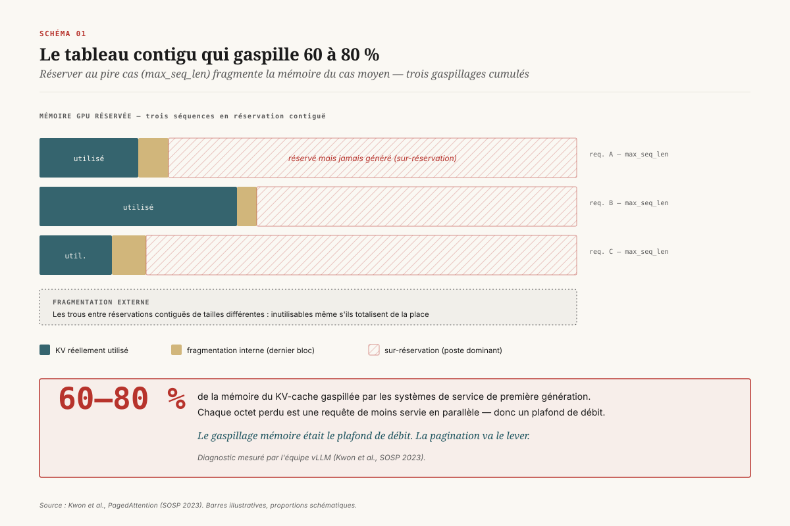
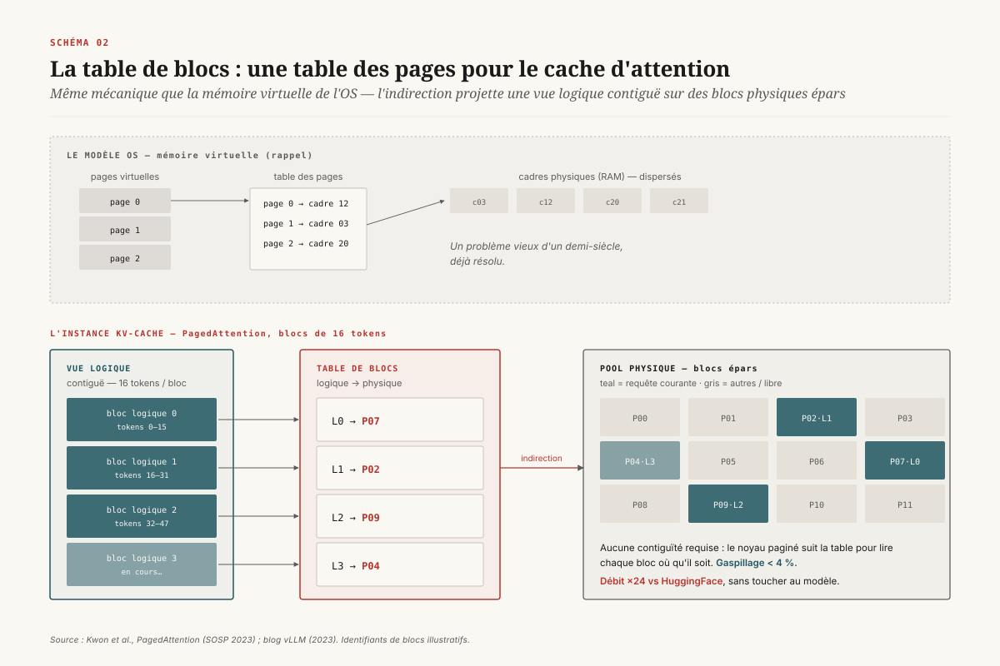

# Le KV-cache comme mémoire virtuelle

> **La gestion du KV-cache a cessé d'être de l'allocation mémoire pour devenir de la mémoire virtuelle : PagedAttention importe la pagination des systèmes d'exploitation, RadixAttention y ajoute le partage automatique de préfixes, et c'est ce substrat — pas une optimisation greffée après coup — qui a rendu possible le *prompt caching* facturé −90 % et qui bute aujourd'hui sur le mur du préfixe.** — 31 juillet 2026, Mathieu Guglielmino

Le dossier [`kv-cache`](../kv-cache/) posait le décor : la mémoire, pas le calcul, gouverne l'inférence des grands modèles de langage, et le cache des clés et valeurs (KV-cache) en est la ressource rare. Il citait PagedAttention et RadixAttention parmi une dizaine de mécanismes. Ce dossier-ci les lit ligne à ligne, parce qu'ils partagent une même idée qui n'a pas été assez soulignée : **on a cessé de gérer le KV-cache comme un tableau que l'on réserve, pour le gérer comme une mémoire virtuelle que l'on pagine, partage et duplique à la demande.** Cette bascule n'est pas cosmétique. Elle a fait passer le débit de service d'un facteur 2 à 24, elle a transformé la mémoire en une ligne de facturation (le *prompt caching* que vous payez chez Anthropic ou OpenAI), et elle a créé une limite structurelle nouvelle — le mur du préfixe — que la recherche 2025-2026 essaie de franchir.

## 1. Un tableau contigu qui gaspille 60 à 80 %

Rappelons le coût. Pour un modèle de type *transformer*, chaque token déjà vu laisse dans le cache un vecteur de clés et un vecteur de valeurs par couche et par tête d'attention. Générer le token suivant exige de relire tout ce cache. La taille du cache croît linéairement avec la longueur de séquence et le nombre de requêtes simultanées, et à contexte long elle domine largement la mémoire des poids du modèle. L'inférence en phase de génération est donc *bornée par la mémoire* : le goulot d'étranglement n'est pas le nombre d'opérations flottantes mais la bande passante et la capacité de la mémoire haute vitesse (HBM).

Le problème, jusqu'en 2023, était que cette mémoire précieuse était massivement gaspillée. Les systèmes de service de première génération réservaient pour chaque requête un bloc **contigu** de mémoire dimensionné sur la longueur maximale possible (`max_seq_len`, souvent 2 048 ou 4 096 tokens), avant même de savoir combien de tokens la requête allait réellement produire. ==Un tableau contigu réservé au pire cas, c'est la garantie de gaspiller la mémoire du cas moyen.== Trois formes de gaspillage se cumulaient :

- **la sur-réservation** — l'écart entre les tokens réservés (`max_seq_len`) et les tokens effectivement générés, de loin le poste dominant ;
- **la fragmentation interne** — le dernier bloc partiellement rempli d'une séquence ;
- **la fragmentation externe** — les trous inutilisables entre deux réservations contiguës de tailles différentes.

Le diagnostic mesuré par l'équipe vLLM est sévère : les systèmes existants gaspillaient **60 à 80 % de la mémoire du KV-cache**[^1]. Or chaque octet gaspillé est une requête de moins servie simultanément, donc un débit plus faible. Le gaspillage mémoire *était* le plafond de débit.

L'analogie qui va tout débloquer est déjà là, en creux : ce problème — allouer efficacement une ressource dont on ignore la taille finale, sans fragmenter, sans réserver au pire cas — les systèmes d'exploitation l'ont résolu il y a un demi-siècle. C'est la mémoire virtuelle.

## 2. PagedAttention : importer la mémoire virtuelle

PagedAttention, présenté par Woosuk Kwon et ses coauteurs à SOSP 2023[^1], part exactement de cette analogie. En mémoire virtuelle, un processus voit un espace d'adressage contigu (des *pages*) que le système d'exploitation projette, via une *table des pages*, sur des cadres physiques (*frames*) dispersés n'importe où dans la RAM. Le processus n'a jamais besoin que la mémoire physique soit contiguë ; l'indirection de la table des pages le lui fait croire.

PagedAttention applique cette mécanique au KV-cache. Le cache d'une séquence est découpé en **blocs de taille fixe** — 16 tokens par défaut chez vLLM, paramétrable via `--block-size`[^1][^2]. Chaque bloc contient les clés et valeurs de ces 16 tokens contigus *logiquement*. Mais physiquement, ces blocs sont dispersés dans un pool global de mémoire GPU, à des emplacements quelconques. Une **table de blocs** (l'équivalent de la table des pages) associe à chaque bloc logique de la séquence l'adresse de son bloc physique. ==Le cache d'attention n'est plus un tableau contigu réservé par requête : c'est un espace paginé, indexé par indirection.==

Le tour de force est que le noyau de calcul de l'attention est réécrit pour lire des clés et valeurs stockées dans un espace **non contigu**. C'est là toute la subtilité de « PagedAttention » : l'attention classique suppose des clés/valeurs contiguës en mémoire ; le noyau paginé, lui, suit la table de blocs pour aller chercher chaque bloc où qu'il soit. On récupère ainsi la flexibilité de la pagination sans renoncer à l'efficacité du noyau d'attention.

Les conséquences sont immédiates. Comme les blocs sont alloués à la demande, un bloc à la fois, il n'y a plus de sur-réservation : une requête qui génère 50 tokens occupe 4 blocs, pas 128. Le seul gaspillage résiduel est la fragmentation interne du dernier bloc — au pire 15 tokens sur 16 — soit **moins de 4 % de gaspillage**[^1], contre 60 à 80 % auparavant. Cette mémoire récupérée se traduit directement en requêtes simultanées supplémentaires, donc en débit. vLLM, le système qui a introduit et popularisé PagedAttention, revendiquait un débit **jusqu'à 24× supérieur à HuggingFace Transformers** et **2 à 4× supérieur** aux meilleurs systèmes de l'époque comme Orca, sans aucune modification de l'architecture du modèle[^1][^2].

Il faut mesurer ce que veut dire « sans modification de l'architecture ». À la différence de la quantification, du mélange d'experts ou de l'attention latente — traités dans [`quantification-llm`](../quantification-llm/), [`melange-experts`](../melange-experts/) et [`attention-latente`](../attention-latente/), qui touchent tous aux poids ou au graphe de calcul — la pagination est une pure innovation de **systèmes**. Elle ne change pas le modèle d'un octet ; elle change la manière dont on lui alloue de la mémoire. C'est ce qui explique son adoption fulgurante : n'importe quel modèle existant en bénéficie du jour au lendemain.

## 3. Copie-sur-écriture : partager puis diverger

La pagination ouvre une seconde possibilité, plus fine encore, que le tableau contigu interdisait : le **partage de blocs entre séquences**. Considérons un cas très courant — l'échantillonnage parallèle. On envoie un prompt unique et on demande *n* complétions différentes (pour en choisir la meilleure, pour du vote majoritaire, pour de la recherche arborescente). Les *n* séquences partagent exactement le même prompt : leurs clés et valeurs pour la partie prompt sont identiques.

Avec une réservation contiguë, on dupliquait *n* fois la mémoire du prompt — une aberration quand le prompt fait plusieurs milliers de tokens et la complétion quelques dizaines. Avec des blocs paginés, il suffit que les *n* séquences **pointent vers les mêmes blocs physiques** pour la partie partagée. On tient là exactement la *copie-sur-écriture* (*copy-on-write*) des systèmes d'exploitation, celle qui rend le `fork()` d'un processus quasi gratuit.

Le mécanisme repose sur un **compteur de références** par bloc physique. Tant que plusieurs séquences lisent le même bloc de prompt, le compteur est supérieur à 1 et le bloc reste partagé, en lecture seule. Au moment où une séquence doit **écrire** dans un bloc partagé — c'est-à-dire dès qu'elle génère son propre token et diverge des autres — le système détecte le compteur > 1, **copie** le bloc dans un nouvel emplacement, décrémente le compteur de l'original, et laisse la séquence écrire dans sa copie privée[^1][^2]. ==Les séquences partagent la mémoire du prompt jusqu'à l'instant précis où elles divergent, et pas une écriture plus tôt.==

Pour l'échantillonnage parallèle et la recherche en faisceau (*beam search*), où de nombreuses branches partagent de longs préfixes communs avant de bifurquer, l'économie de mémoire mesurée atteint **jusqu'à 55 %**[^1], ce qui se retraduit en débit. À ce stade, notons bien le périmètre : ce partage-là reste **intra-requête**. Il vit et meurt avec les *n* complétions d'un même appel. Ce que RadixAttention va apporter, c'est de faire déborder ce partage au-delà des frontières d'une requête.

## 4. RadixAttention : du partage intra-requête au partage inter-requêtes

Le partage par copie-sur-écriture de PagedAttention est éphémère : les blocs partagés existent le temps d'une requête, puis sont libérés. Mais dans la réalité d'un service, des requêtes **différentes, séparées dans le temps**, partagent elles aussi d'immenses préfixes communs : le même long prompt système en tête de chaque conversation, les mêmes exemples *few-shot*, le même document de contexte interrogé par dix utilisateurs, les tours successifs d'un même dialogue. Recalculer ces préfixes identiques à chaque requête, c'est refaire un travail déjà fait — et le jeter.

RadixAttention, introduit avec le système SGLang par Lianmin Zheng et ses coauteurs (blog LMSYS de janvier 2024[^4], papier NeurIPS 2024[^3]), rend ce partage **persistant et automatique**. L'idée : au lieu de libérer le KV-cache d'une requête à la fin de sa génération, on le **conserve** et on l'indexe dans un **arbre radix** (*radix tree*).

Un arbre radix est une version compacte de l'arbre préfixe (*trie*) où les arêtes portent des séquences de tokens de longueur variable plutôt qu'un token unique. Chaque chemin de la racine à un nœud représente une suite de tokens, et le KV-cache correspondant est attaché le long de ce chemin. Un préfixe partagé n'est donc stocké **qu'une seule fois** : toutes les requêtes dont le début coïncide empruntent le même chemin dans l'arbre et réutilisent les mêmes blocs de cache[^3][^4]. Quatre opérations suffisent à tout gérer : **recherche** du plus long préfixe déjà en cache pour une requête entrante, **insertion** du nouveau suffixe qu'elle génère, **réutilisation** des blocs trouvés, et **éviction** quand la mémoire manque.

L'éviction est le point délicat, et le choix fait est une **politique LRU sur les feuilles** : on évince d'abord la feuille la moins récemment utilisée (une génération ancienne, en bout de branche), ce qui libère de la mémoire tout en préservant les ancêtres — c'est-à-dire les préfixes partagés, les plus précieux, tant qu'ils restent utiles à d'autres branches. Un ancêtre ne devient candidat à l'éviction que lorsque toutes ses feuilles ont disparu et qu'il est lui-même devenu une feuille[^3]. À cette structure s'ajoute un **ordonnancement conscient du cache** (*cache-aware scheduling*) : le *scheduler* traite en priorité les requêtes qui partagent le plus de préfixe avec le contenu déjà en cache, maximisant le taux de réutilisation.

[SCHEMA-04]

Les gains dépendent entièrement de la structure du trafic, mais sur les charges où le partage de préfixe est massif — dialogues multi-tours, invites *few-shot* répétées, arbres de pensée, agents qui rejouent un long prompt système — SGLang mesurait un débit **jusqu'à 5× supérieur**, atteignant 6,4× sur certains programmes structurés, par rapport aux meilleurs systèmes de l'époque[^3][^4]. Point crucial pour l'adoption : RadixAttention est **compatible** avec la pagination, le *batching* continu et le parallélisme de tenseurs[^4]. Elle ne remplace pas PagedAttention ; elle s'empile dessus. La pagination fournit les blocs partageables ; l'arbre radix décide *quoi* partager entre requêtes et *quand* l'oublier.

## 5. APC en production : le hash chaîné

L'arbre radix est élégant, mais tous les systèmes de production ne parcourent pas un arbre à chaque requête. vLLM a popularisé une variante plus légère, l'**Automatic Prefix Caching** (APC), qui atteint le même but — réutiliser les blocs d'un préfixe déjà calculé — par un simple mécanisme de **hachage chaîné**[^5].

Le principe : chaque bloc du KV-cache reçoit un *hash* qui l'identifie de façon unique, et ce hash **chaîne** celui du bloc précédent. Concrètement, le hash d'un bloc est calculé à partir de trois ingrédients : le **hash du bloc parent** (le préfixe qui le précède), les **identifiants des tokens** du bloc lui-même, et un ensemble de **clés supplémentaires** (*extra keys*)[^5]. Comme le hash de chaque bloc dépend récursivement de tout ce qui le précède, deux requêtes obtiennent le même hash pour un bloc **si et seulement si** elles partagent exactement la même suite de tokens depuis le tout début. ==Un cache hit exige une correspondance token par token de tout le préfixe, jusqu'au bloc candidat inclus.== Retrouver le préfixe réutilisable devient une simple consultation de table de hachage, sans parcours d'arbre.

Les *extra keys* méritent l'attention, car elles encodent une contrainte de correction souvent négligée : deux prompts textuellement identiques peuvent produire des activations **différentes** si le contexte de calcul diffère. vLLM y range l'identifiant de l'adaptateur **LoRA** actif, le hash des **entrées multimodales** (une image change les activations même si le texte est identique), et un **`cache_salt`** par requête qui permet d'isoler délibérément le cache d'un client — parade minimale contre le partage de cache entre locataires[^5]. Sans ces clés, on servirait à une requête le cache d'une autre qui n'a de commun que les tokens visibles.

L'éviction, enfin, obéit à une heuristique fine : **le dernier bloc d'une requête est évincé en premier**. Pourquoi ? Parce qu'il hache le plus de tokens (tout le préfixe jusqu'à lui) et se trouve donc le moins susceptible d'être partagé par une autre requête — un préfixe court et générique (le prompt système) est réutilisé par tous, un suffixe long et spécifique par presque personne[^5]. La logique est exactement inverse de l'intuition « dernier entré, premier sorti » : on protège les préfixes courts et populaires, on sacrifie les suffixes longs et rares.

[SCHEMA-05]

Arbre radix ou hash chaîné, la sémantique est la même — réutiliser les blocs d'un préfixe partagé — et les deux approches coexistent dans l'écosystème (SGLang penche pour l'arbre, vLLM pour le hash ; NVIDIA TensorRT-LLM propose sa propre réutilisation de blocs avec éviction par priorité[^11]). Ce qui compte, c'est que ce substrat technique est devenu, en 2024, un **produit**.

## 6. L'économie du *prompt caching*

Quand une optimisation de mémoire fait économiser un travail de calcul réel et répétable, elle finit tôt ou tard sur une facture. Le *prompt caching* est la monétisation directe de RadixAttention et de l'APC.

Anthropic l'a lancé en bêta publique le **14 août 2024** et rendu généralement disponible le **17 décembre 2024**[^6]. Le modèle de tarification est instructif parce qu'il expose la mécanique sous-jacente. Écrire un préfixe dans le cache coûte **plus cher** qu'un token normal : **1,25× le prix d'entrée** pour une durée de vie (*TTL*) de 5 minutes, **2,0×** pour un *TTL* d'une heure — c'est le coût de calculer et de stocker le KV-cache. Mais **lire** ce préfixe depuis le cache, à toute requête ultérieure dans la fenêtre de validité, ne coûte que **0,1× le prix d'entrée** : ==une réduction de 90 % sur la portion mise en cache, qui est précisément le KV-cache qu'on n'a pas à recalculer.==[^6] OpenAI propose une mécanique voisine, entièrement automatique, avec une décote de l'ordre de 50 % sur les tokens d'entrée mis en cache[^7].

Deux détails de conception révèlent la nature du dispositif. D'abord, le minimum de contenu cacheable est de **1 024 tokens** chez Anthropic : en dessous, le jeu n'en vaut pas la chandelle, l'écriture coûterait plus que l'économie[^6] — on retrouve le seuil de rentabilité (*break-even*) d'un cache. Ensuite, **toute lecture réinitialise le *TTL*** : un préfixe fréquemment sollicité reste chaud indéfiniment et ne repaie jamais son écriture après le préchauffage initial[^6]. C'est le comportement d'un cache LRU, exposé tel quel au client.

[SCHEMA-06]

La conséquence stratégique est que **l'architecture du service devient l'architecture du prompt**. Parce que seul un *préfixe* stable se partage, l'ingénieur a désormais un intérêt économique direct à structurer ses requêtes du plus stable au plus variable : prompt système et définitions d'outils en tête (écrits une fois, lus des milliers de fois), documents de contexte au milieu, question spécifique de l'utilisateur en fin de prompt. Un ordre différent — mettre la question variable en tête — annule tout le bénéfice du cache. La discipline de *prompt engineering* n'est plus seulement affaire de qualité de réponse : elle est devenue affaire de coût d'inférence, et cette contrainte descend directement du mécanisme de partage de préfixe. On rejoint ici les préoccupations d'observabilité de [`observabilite-agents-ia`](../observabilite-agents-ia/) : le taux de succès du cache est devenu une métrique de coût à instrumenter au même titre que la latence.

## 7. Le mur du préfixe et la hiérarchie mémoire

Tout ce qui précède repose sur un mot : **préfixe**. On ne partage un bloc de KV-cache que si tout ce qui le précède est identique, token pour token. Cette contrainte n'est pas un détail d'implémentation ; elle est intrinsèque à la causalité de l'attention — la représentation d'un token dépend de tous les tokens qui le précèdent. Et elle crée une limite structurelle que l'on peut appeler le **mur du préfixe**.

Le cas où ce mur fait le plus mal est la génération augmentée par récupération (*RAG*). Une requête RAG concatène typiquement : un prompt système, puis plusieurs *chunks* de documents récupérés dynamiquement, puis la question. Le prompt système, en tête, se partage — mais les *chunks*, choisis à la volée et dans un ordre variable, ne sont **jamais un préfixe partagé** : dès le deuxième *chunk*, la suite diffère d'une requête à l'autre. Résultat mesuré sans détour par l'équipe de CacheBlend : dans un contexte RAG, ==la mise en cache de préfixe classique peut être presque aussi lente que l'absence totale de cache==, parce que tout sauf le premier *chunk* rate le cache[^8].

Deux familles de réponses émergent. La première recompute intelligemment. **CacheBlend** (Best Paper à ACM EuroSys 2025[^8]) part du KV-cache pré-calculé de chaque *chunk* pris isolément — donc réutilisable même hors préfixe — et ne **recalcule qu'un petit sous-ensemble de tokens critiques** (ceux dont les activations dépendent le plus fortement du contexte croisé entre *chunks*), environ 15 % des tokens. Il obtient un taux de succès de cache proche de **100 %** en RAG, réduit le temps jusqu'au premier token de **2,2 à 3,3×** et augmente le débit de **2,8 à 5×** par rapport au recalcul complet, sans dégrader la qualité[^8]. **Prompt Cache** (MLSys 2024[^12]) prend un autre angle : précalculer des *modules* d'invite réutilisables (des segments de texte fréquents) et les réassembler à des positions variables. La seconde famille déplace le cache dans une **hiérarchie mémoire** : **LMCache** transforme le KV-cache en une couche persistante, stockée au-delà de la seule HBM (DRAM, SSD, stockage distant), partagée entre plusieurs moteurs de service, et accélère le RAG d'un facteur **4,5×** en réutilisant les caches hors préfixe[^9]. **Mooncake**, le système derrière Kimi (Best Paper à FAST 2025[^10]), pousse la même logique à l'échelle d'un pool de KV-cache réparti sur DRAM et SSD, traité en détail dans [`desagregation-prefill-decode`](../desagregation-prefill-decode/).

[SCHEMA-07]

Cette hiérarchie mémoire ouvre deux frontières. La première est industrielle : le KV-cache comme **service** (*KV-cache-as-a-service*), une couche mutualisée entre applications et entre moteurs, ordonnancée de manière distribuée et consciente du cache — c'est la direction que prend le projet **llm-d** (CNCF), qui étend l'ordonnancement cache-aware de RadixAttention à une flotte de serveurs[^13]. La seconde est une frontière de **sécurité**, encore mal cartographiée : dès lors que des blocs de KV-cache sont partagés entre requêtes, entre utilisateurs, voire entre locataires (*tenants*), le cache devient une surface d'attaque. Le partage de préfixe peut fuir de l'information par canal temporel (une requête devine, à la latence, qu'un préfixe est déjà en cache donc déjà soumis par un autre) ; et des travaux récents montrent qu'un bloc de KV-cache partagé et corrompu (par exemple par une inversion de bit) peut empoisonner toutes les requêtes qui le réutilisent. L'isolation par `cache_salt` évoquée plus haut est la parade minimale, mais elle sacrifie précisément le partage qui faisait tout l'intérêt du cache. On retrouve la tension familière de [`mcp-securite`](../mcp-securite/) : la mutualisation qui donne l'efficacité est exactement ce qui crée la surface d'attaque.

## Conclusion

La trajectoire est nette. En 2023, PagedAttention règle la fragmentation en important la pagination des systèmes d'exploitation : le KV-cache devient un espace paginé, et la copie-sur-écriture fait du partage de prompt intra-requête un acquis. En 2024, RadixAttention et l'APC font déborder ce partage au-delà des requêtes, via un arbre radix ou un hash chaîné, et transforment le cache en un produit facturé — le *prompt caching* à −90 % qui a rendu économiquement viables les agents à long contexte. En 2025-2026, la recherche attaque le mur du préfixe (CacheBlend, Prompt Cache) et déploie le cache dans une hiérarchie mémoire distribuée (LMCache, Mooncake, llm-d), tout en découvrant que le partage est aussi une surface d'attaque.

Le fil conducteur ne varie pas : ==gérer le KV-cache, c'est faire de la mémoire virtuelle — pagination, indirection, partage, copie-sur-écriture, éviction, hiérarchie —, un demi-siècle d'informatique des systèmes rejoué sur le cache d'attention.== Ce qui a changé, ce n'est pas l'invention de ces idées, c'est de comprendre que le cache d'attention était le bon endroit pour les appliquer. C'est probablement la leçon la plus utile pour les optimisations à venir : la prochaine avancée de service ne sortira sans doute pas d'une nouvelle architecture de modèle, mais d'un vieux mécanisme de systèmes que personne n'avait encore pensé à porter jusqu'ici.

---

## Sources

[^1]: Kwon, Woosuk, Zhuohan Li, Siyuan Zhuang, et al. « Efficient Memory Management for Large Language Model Serving with PagedAttention ». *ACM SOSP 2023*. arXiv:2309.06180. Le papier fondateur : découpage en blocs, table de blocs, gaspillage < 4 %, débit ×24 vs HuggingFace, copie-sur-écriture et partage de préfixe.

[^2]: vLLM Team. « vLLM: Easy, Fast, and Cheap LLM Serving with PagedAttention ». Blog vLLM, 20 juin 2023. blog.vllm.ai. Vulgarisation officielle du mécanisme et de la copie-sur-écriture.

[^3]: Zheng, Lianmin, Liangsheng Yin, Zhiqiang Xie, et al. « SGLang: Efficient Execution of Structured Language Model Programs ». *NeurIPS 2024*. arXiv:2312.07104. RadixAttention : arbre radix, éviction LRU des feuilles, ordonnancement conscient du cache.

[^4]: LMSYS Org. « Fast and Expressive LLM Inference with RadixAttention and SGLang ». Blog LMSYS, 17 janvier 2024. lmsys.org. Chiffres de débit (jusqu'à 5×), charges bénéficiaires, compatibilité pagination / batching continu / parallélisme de tenseurs.

[^5]: vLLM Documentation. « Automatic Prefix Caching » (design v1). docs.vllm.ai. Hachage chaîné (hash parent + token_ids + extra_keys : LoRA, multimodal, cache_salt), correspondance exacte du préfixe, éviction du dernier bloc en premier.

[^6]: Anthropic. « Prompt caching ». Documentation développeur, docs.anthropic.com (bêta publique 14 août 2024, disponibilité générale 17 décembre 2024). Tarif : lecture 0,1× (−90 %), écriture 1,25× (TTL 5 min) / 2,0× (TTL 1 h), minimum 1 024 tokens, réinitialisation du TTL à chaque lecture.

[^7]: OpenAI. « Prompt caching ». Documentation plateforme, platform.openai.com. Mise en cache automatique des préfixes, décote de l'ordre de 50 % sur les tokens d'entrée mis en cache.

[^8]: Yao, Jiayi, Hanchen Li, Yuhan Liu, et al. « CacheBlend: Fast Large Language Model Serving for RAG with Cached Knowledge Fusion ». *ACM EuroSys 2025* (Best Paper). DOI 10.1145/3790254. Réutilisation du KV-cache hors préfixe par recalcul sélectif (~15 % des tokens critiques) ; TTFT −2,2-3,3×, débit ×2,8-5, taux de succès ~100 % en RAG.

[^9]: LMCache Team. « Beyond Prefix Caching: How LMCache Speeds Up RAG by 4.5× ». Blog LMCache, 9 octobre 2024. blog.lmcache.ai. Couche de KV-cache persistante (DRAM / SSD / distant), partagée entre moteurs, réutilisation hors préfixe.

[^10]: Qin, Ruoyu, Zheming Li, Weiran He, et al. « Mooncake: A KVCache-centric Disaggregated Architecture for LLM Serving ». *USENIX FAST 2025* (Best Paper). Pool de KV-cache réparti DRAM/SSD à l'échelle du service (Kimi).

[^11]: NVIDIA. « KV Cache Reuse » (TensorRT-LLM). Documentation NVIDIA. Réutilisation de blocs de KV-cache avec éviction par priorité.

[^12]: Gim, In, Guojun Chen, Seung-seob Lee, et al. « Prompt Cache: Modular Attention Reuse for Low-Latency Inference ». *MLSys 2024*. Précalcul et réassemblage de modules d'invite réutilisables hors préfixe.

[^13]: llm-d Project. « KV-Cache Wins You Can See: From Prefix Caching in vLLM to Distributed Scheduling with llm-d ». Blog llm-d (CNCF), 2026. llm-d.ai. Extension de l'ordonnancement conscient du cache à une flotte de serveurs.
