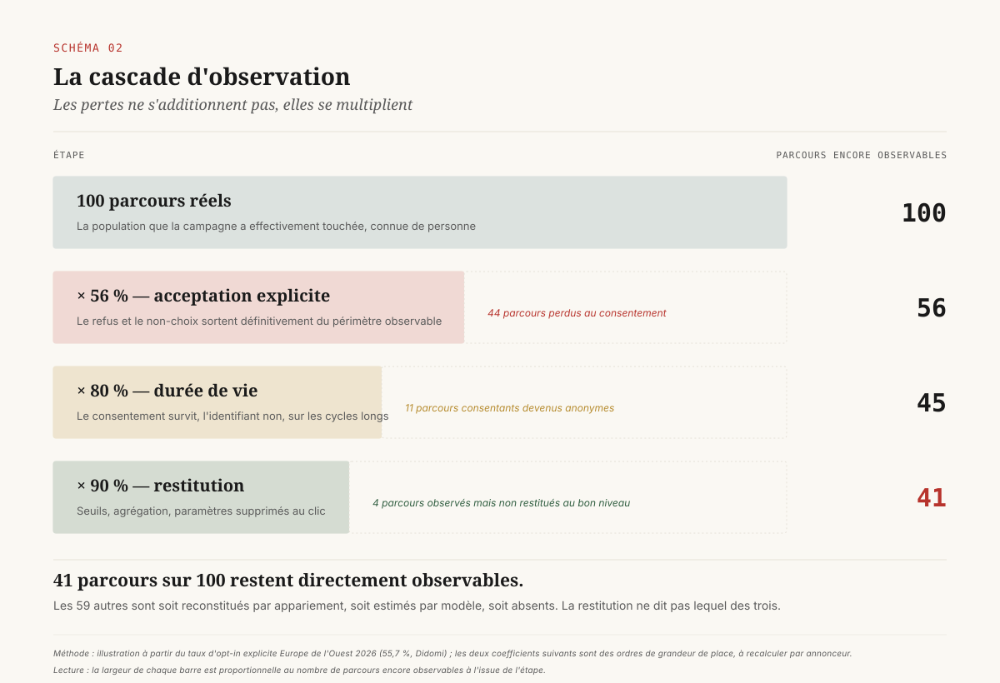
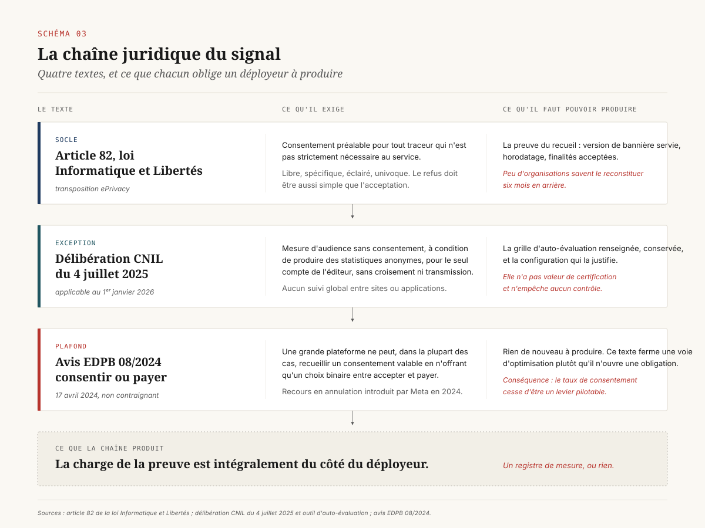

# Ce que la modélisation comble, et ce qu'elle maquille

> **La perte de signal n'a pas creusé un trou dans la mesure numérique : elle a changé son régime. Le chiffre qui remonte dans un tableau de bord média mélange désormais trois régimes empilés — observé, apparié, estimé — dont la proportion n'est jamais affichée. La question de direction n'est plus comment récupérer le signal perdu, mais quelle part d'estimation on accepte, sur quel périmètre, et contre quoi on la calibre.** — 14 août 2026, Mathieu Guglielmino

---

## 1. Le cookie survit, la mesure beaucoup moins

Pendant cinq ans, l'industrie de la mesure publicitaire a organisé sa transformation autour d'une date. Google avait annoncé la fin des cookies tiers dans Chrome, et tout le secteur a construit ses feuilles de route, ses budgets et ses argumentaires commerciaux sur cette échéance : plateformes de données clients, salles blanches, identifiants alternatifs, refonte du marquage côté serveur.

L'échéance n'est jamais tombée. En avril 2025, Google annonce que Chrome ne bloquera pas les cookies tiers par défaut et que le réglage restera à la main de l'utilisateur[^1]. Le 17 octobre 2025, le même Google retire dix des interfaces restantes du programme Privacy Sandbox — Attribution Reporting, Topics, Protected Audience, Protected App Signals, Private Aggregation, Shared Storage, On-Device Personalization, SelectURL, SDK Runtime, IP Protection — sur Chrome comme sur Android, en invoquant l'évaluation des retours de l'écosystème sur leur valeur attendue et leur faible niveau d'adoption[^2]. La dépréciation commence avec Chrome 144 en janvier 2026, le retrait complet est visé pour Chrome 150 en juillet 2026. Trois briques survivent, plus étroites : CHIPS pour les cookies partitionnés, FedCM pour l'authentification fédérée, Private State Tokens pour la lutte contre la fraude.

==Le cookie tiers a donc survécu, et pourtant la capacité de mesure des annonceurs a continué de se dégrader sans interruption pendant toute la période.== C'est le fait le plus mal digéré du dossier. Il signifie que la perte de signal n'était pas causée par la brique technique sur laquelle tout le monde avait les yeux. Elle venait de quatre robinets distincts, dont un seul dépendait de Chrome, et dont les trois autres se sont refermés indépendamment de la décision de Google.

Pour une direction data, la conséquence pratique est immédiate. Les investissements consentis depuis 2021 au titre du « futur sans cookie » n'ont pas été inutiles, mais ils ont été justifiés par une cause erronée. Ils doivent être réévalués sur leur vraie contribution : non pas remplacer un identifiant qui n'a pas disparu, mais compenser une perte d'observabilité qui, elle, est bien réelle et n'a rien à voir.

## 2. Où le signal part vraiment

Le taux d'observation d'un parcours numérique se dégrade en cascade. Chaque robinet se referme partiellement, et les pertes se multiplient au lieu de s'additionner. C'est la raison pour laquelle un annonceur qui estime perdre « environ 20 % » à chaque étape se retrouve en pratique à observer moins de la moitié de ses conversions.

**Le consentement.** Le référentiel européen 2026 de Didomi, construit sur plusieurs milliards de choix utilisateurs, situe le taux de consentement global entre 75,1 % et 89,3 % selon la région, l'Europe de l'Ouest fermant la marche à 75,1 %[^3]. Mais ce taux de consentement agrège deux populations très différentes : ceux qui acceptent explicitement et ceux qui ne répondent pas. Le taux d'opt-in réel — l'acceptation explicite, seule à autoriser le dépôt en droit européen — descend à 55,7 % en Europe de l'Ouest. La France est plus basse encore, autour de 71 % de taux de consentement, effet direct de la doctrine de la CNIL qui impose depuis 2020 un bouton de refus aussi accessible que le bouton d'acceptation. Le taux de non-choix, ces visiteurs qui quittent la bannière sans trancher, oscille entre 21,7 % et 24 %.

**Le navigateur.** Indépendamment du consentement, Safari applique depuis des années une limitation de la durée de vie des cookies déposés par script à sept jours, et à vingt-quatre heures pour les navigations identifiées comme provenant d'un site de suivi. Firefox applique un cloisonnement par site. Sur un cycle d'achat de trois semaines, un visiteur Safari qui a pourtant consenti devient invisible avant la conversion.

**Le système d'exploitation mobile.** Le cadre App Tracking Transparency d'Apple a ramené le taux d'acceptation du suivi inter-applications à des niveaux à un chiffre ou juste au-dessus, autour de 14 % au niveau mondial dans les relevés sectoriels de 2024. La chaîne d'attribution mobile est passée à des cadres agrégés — SKAdNetwork puis AdAttributionKit — qui livrent des messages de retour agrégés, sans identifiant utilisateur, avec un délai de vingt-quatre à quarante-huit heures et une fenêtre étalée sur trente-cinq jours[^4].

**La plateforme publicitaire.** Le dernier robinet est le moins discuté et le plus décisif. Même lorsque l'événement a été observé, la plateforme n'en restitue pas nécessairement le détail. Seuils de confidentialité qui suppriment les lignes trop peu peuplées, agrégation par campagne plutôt que par créa, fenêtres d'attribution non modifiables, suppression de paramètres d'URL au clic : la restitution est un choix éditorial du vendeur, pas une conséquence technique.

==La cascade se calcule. Sur un parcours desktop européen typique, avec 56 % d'opt-in explicite, une érosion navigateur de l'ordre de 20 % sur les parcours longs et une perte de restitution de 10 %, le taux d'observation brut tombe sous 41 %.== Ce n'est pas une estimation pessimiste : c'est l'ordre de grandeur qui explique pourquoi les plateformes ont dû inventer un mécanisme de comblement.

## 3. Le régime de déclaration : ce que le consentement a rendu opposable

Le premier changement de régime est juridique, et il est antérieur aux autres. Depuis l'entrée en application du RGPD et l'article 82 de la loi Informatique et Libertés, le dépôt d'un traceur non strictement nécessaire suppose un consentement préalable, libre, spécifique, éclairé et univoque. Ce qui a changé récemment, c'est la précision des critères et donc la difficulté à s'y soustraire.

**L'exemption de mesure d'audience s'est refermée.** Par une délibération du 4 juillet 2025, la CNIL a précisé les conditions dans lesquelles un traceur de mesure d'audience peut être déposé sans consentement[^5]. La finalité doit être strictement limitée à la mesure d'audience du site : mesure de performance, détection de problèmes de navigation, optimisation ergonomique, estimation de la charge serveur, analyse des contenus consultés. Le traitement doit être opéré pour le seul compte de l'éditeur, produire des statistiques anonymes, ne pas être croisé avec d'autres traitements, ne pas transmettre de données non anonymes à des tiers et ne permettre aucun suivi global de la navigation entre sites ou applications. La CNIL a publié en juillet 2025 une grille d'auto-évaluation destinée aux éditeurs de solutions[^6], applicable au 1ᵉʳ janvier 2026, en précisant qu'elle n'a pas valeur de certification et n'empêche aucun contrôle.

Pour une direction data, la lecture opérationnelle tient en une phrase : ==la mesure d'audience sans consentement redevient possible, mais uniquement au prix d'un périmètre analytique tellement réduit qu'il ne permet plus d'attribuer une conversion à un investissement média.== L'exemption sert à savoir combien de personnes ont vu une page, pas à savoir ce qui les a fait venir.

**Le taux de consentement a cessé d'être un levier pilotable.** L'avis 08/2024 de l'EDPB, adopté le 17 avril 2024, considère que dans la plupart des cas, une grande plateforme en ligne ne peut pas recueillir un consentement valable si elle confronte l'utilisateur à un choix binaire entre accepter le traitement à des fins de publicité comportementale et payer[^7]. L'avis précise que n'offrir qu'une alternative payante ne devrait pas être la voie par défaut. Meta a introduit un recours en annulation devant le Tribunal de l'Union en juin 2024. Quelle que soit l'issue, la direction est posée : les stratégies d'optimisation du taux de consentement par la contrainte du choix se heurtent désormais à une doctrine explicite.

La conséquence de gouvernance est simple à formuler et coûteuse à tenir. Un déployeur doit être capable de produire, sur demande, la preuve de ce qu'il a recueilli : version de la bannière servie, horodatage du choix, périmètre des finalités acceptées, chaîne de transmission aux partenaires. C'est un objet de conservation, au même titre qu'un registre de traitement. Peu d'organisations sont capables de le reconstituer six mois en arrière.

## 4. Le régime de reconstitution : l'appariement

Face à la cascade, la première réponse de l'industrie a été de reconstruire ce qui pouvait l'être légitimement. C'est le régime de l'appariement, et il repose sur une idée simple : lorsqu'un client s'identifie sur le site de l'annonceur, l'annonceur détient une donnée qu'aucun robinet navigateur ne peut lui retirer.

Les conversions améliorées de Google hachent en SHA-256 les identifiants de première partie fournis par l'utilisateur (adresse électronique, numéro de téléphone, nom, adresse postale) et les transmettent avec l'événement de conversion, où ils sont rapprochés des empreintes correspondantes de comptes Google connectés[^8]. L'API de conversions de Meta suit la même logique côté serveur. Depuis avril 2026, Google Ads accepte les données fournies par l'utilisateur indifféremment depuis le marqueur du site, depuis Data Manager ou depuis une connexion applicative, ce qui supprime le choix d'implémentation qui structurait auparavant les projets.

Les gains annoncés sont substantiels et doivent être lus avec prudence : Google avance un relèvement moyen des conversions de l'ordre de 17 % pour les annonceurs déployant les conversions améliorées, chiffre déclaré par le fournisseur, quand les retours de terrain se situent plus souvent dans le bas de la fourchette. Les architectures de marquage côté serveur revendiquent un recouvrement de 20 à 40 % des conversions perdues.

Ces chiffres méritent trois réserves, et ce sont elles qui intéressent une direction.

**Première réserve : l'appariement ne récupère que les clients identifiés.** Un site de commerce en ligne avec 30 % de commandes en compte connecté ne récupérera jamais que sur ces 30 %. Le levier réel est l'incitation à l'identification, qui est un sujet produit avant d'être un sujet mesure.

**Deuxième réserve : le mécanisme est indexé sur le consentement, pas sur la technique.** Transmettre à un tiers une adresse électronique hachée reste un traitement de données personnelles : le hachage réduit le risque, il ne rend pas la donnée anonyme, puisqu'il est justement conçu pour être rapproché. ==Un dispositif côté serveur qui transmet des identifiants de clients ayant refusé le suivi publicitaire ne récupère pas un signal perdu : il exécute un traitement refusé.== La ligne est nette et elle se contrôle : le déclencheur d'un appel côté serveur doit être conditionné à l'état du consentement, exactement comme un marqueur de navigateur.

**Troisième réserve : l'appariement transfère de la donnée client à la plateforme.** Chaque conversion améliorée enrichit le graphe d'identité du vendeur d'espace avec la base de l'annonceur. C'est une décision de patrimoine, et elle appartient au comité de direction plutôt qu'à l'équipe d'acquisition.

## 5. Le régime d'estimation : anatomie d'une conversion modélisée

Le troisième régime est celui qui pose la vraie question de direction, parce qu'il produit des chiffres qui ressemblent en tous points à des observations.

Lorsque Consent Mode est déployé, un visiteur qui refuse le suivi publicitaire ne dépose aucun identifiant, mais le marqueur envoie tout de même un signal sans cookie indiquant qu'un événement a eu lieu et qu'il n'est pas consenti. Google utilise ensuite les parcours observés — ceux des visiteurs consentants — pour estimer la relation entre trafic consenti et trafic non consenti, puis applique cette relation aux parcours non consentis afin de leur attribuer des conversions[^9]. Le résultat est intégré dans les rapports sans distinction visuelle par rapport aux conversions observées.

L'éligibilité est conditionnée à des seuils de volume. Pour Google Ads, il faut un minimum de 700 clics publicitaires sur sept jours, par pays et par groupement de domaines, et une implémentation correcte de Consent Mode ou du cadre de transparence et de consentement de l'IAB[^10]. Pour Google Analytics, la modélisation comportementale exige au moins 1 000 utilisateurs quotidiens avec `analytics_storage` accordé, pendant au moins 7 des 28 jours précédents. La validation revendiquée repose sur une technique de retenue : une fraction des conversions observées est mise de côté, le modèle prédit cette fraction, et l'écart entre prédiction et observation sert à mesurer l'erreur et à réajuster.

[SCHEMA-04]

Quatre propriétés structurent ce régime, et il faut les tenir ensemble.

1. **Le modèle produit un nombre, pas un intervalle.** Le rapport affiche « 1 240 conversions », jamais « 1 240 ± 180 ». L'incertitude existe côté fournisseur, elle n'est pas restituée côté acheteur.
2. **La part modélisée n'est pas isolable dans le rapport standard.** Selon la surface, l'annonceur peut connaître une estimation globale de la contribution modélisée, rarement sa ventilation par campagne, jamais son évolution jour par jour au niveau où se prennent les arbitrages.
3. **Le seuil de volume crée une asymétrie entre annonceurs.** Un annonceur qui ne franchit pas les 700 clics hebdomadaires sur un marché donné n'a pas de conversions modélisées : ses chiffres sont plus honnêtes et paraissent plus mauvais que ceux d'un concurrent plus gros sur le même marché. À performance réelle égale, la comparaison est faussée en faveur du volume.
4. **La retenue valide le modèle sur la population observée.** C'est le point dur de la section suivante.

## 6. Ce que la modélisation comble, ce qu'elle maquille

La modélisation des conversions est une réponse techniquement défendable à un problème réel. Elle devient un problème de gouvernance à cause de trois propriétés qui, prises ensemble, la rendent invérifiable par celui qui paie.

**L'hypothèse d'extrapolation n'est pas testable.** Le modèle est appris sur les parcours consentants et appliqué aux parcours refusants. Sa validité suppose que le comportement de conversion des refusants, conditionnellement aux variables observées, ressemble à celui des consentants. Or le refus n'est pas un tirage aléatoire. Refuser le suivi publicitaire est corrélé à l'âge, à l'équipement, au niveau de littératie numérique, au navigateur employé, souvent au niveau de revenu. La validation par retenue teste la capacité du modèle à prédire des consentants qu'on lui a cachés. Elle ne dit rien sur sa capacité à prédire des refusants, parce qu'aucune vérité terrain n'existe pour eux. ==Le dispositif de validation le plus mis en avant par le fournisseur porte sur la seule population où le problème ne se pose pas.==

**Le modélisateur est le vendeur.** C'est le prolongement direct du constat posé dans le dossier consacré à la mesure tenue par les régies : la partie qui estime la contribution de son propre inventaire a un intérêt structurel à ce que cette contribution soit élevée. Il n'y a pas besoin de supposer une intention pour que le biais opère. Un modèle réglé pour n'inclure des conversions modélisées que lorsque la confiance est élevée peut aussi bien être réglé dans l'autre sens, et l'acheteur n'a aucun moyen d'observer le réglage.

**L'écart entre corrélation et causalité reste entier.** La modélisation reconstitue des conversions attribuées, non des conversions incrémentales. La littérature sur ce point est ancienne et robuste : les méthodes observationnelles surestiment massivement l'effet causal de la publicité, avec des écarts qui atteignent un facteur proche de six par rapport aux estimations expérimentales dans les comparaisons documentées. Combler un trou d'observation avec un modèle attributif améliore la complétude du comptage sans améliorer d'un pouce la validité de la décision budgétaire qui s'appuie dessus.

[SCHEMA-05]

D'où la formulation utile pour un comité. La modélisation **comble** un déficit de comptage : elle rend un tableau de bord moins troué, elle stabilise des séries temporelles, elle évite qu'un basculement de consentement soit lu comme un effondrement de performance. Elle **maquille** trois choses : la part de l'estimation dans le total, l'incertitude autour de cette estimation, et le fait que la question posée — quel budget ai-je intérêt à déplacer — n'appartient de toute façon pas au domaine de validité d'une méthode attributive.

## 7. La calibration comme seule sortie

Si l'estimation est inévitable et invérifiable de l'intérieur, la seule stratégie défendable consiste à l'ancrer sur une mesure produite hors du système qui l'a fabriquée.

Le dispositif standard est aujourd'hui bien identifié et repose sur trois instruments joués ensemble : un modèle de mix marketing pour l'allocation stratégique, l'attribution pour l'optimisation tactique quotidienne, et l'expérimentation d'incrémentalité pour valider les deux autres. C'est l'expérimentation qui joue le rôle de référentiel : un test géographique trimestriel corrige les coefficients du modèle de mix et contrôle les hypothèses du modèle d'attribution.

Deux évolutions récentes rendent ce dispositif accessible. Meridian, le modèle de mix marketing ouvert publié par Google en 2025, intègre explicitement la calibration par des résultats de tests d'incrémentalité comme entrée du modèle, sous forme de distributions a priori sur les effets[^11]. La conséquence est structurante : le test cesse d'être un exercice ponctuel de validation et devient une donnée d'entrée récurrente. Côté plateformes, Meta a introduit une attribution incrémentale calibrée par des tests de contrôle continus.

La contrepartie est un mur de puissance statistique, et il faut le poser avant d'écrire un plan de mesure. Lewis et Rao ont montré que sur vingt-cinq grandes expériences publicitaires, l'intervalle de confiance médian sur le retour sur investissement dépassait cent points de pourcentage[^12]. Autrement dit, la plupart des dispositifs expérimentaux réellement finançables ne permettent pas de distinguer un investissement rentable d'un investissement destructeur de valeur. ==Un plan de mesure annuel honnête commence donc par la liste des questions auxquelles le budget de test ne permet pas de répondre.== Les travaux plus récents sur la mesure d'incrémentalité robuste à la perte de signal cherchent précisément à réduire la variance de ces estimateurs sous contrainte de données agrégées[^13], sans supprimer la contrainte de fond.

## 8. Ce qu'une direction data décide

Le dossier se referme sur sept décisions. Elles ne demandent aucun outil nouveau, elles demandent d'être écrites quelque part et tenues.

**1. Afficher le taux de modélisation.** Toute restitution de performance média présentée à un comité doit porter la part estimée du total, par canal et par période. Quand la plateforme ne la publie pas au niveau requis, la mention devient « part modélisée non communiquée par le fournisseur », ce qui est une information en soi.

**2. Fixer un plancher d'observation.** En dessous d'un seuil d'observation directe, par exemple 50 % des conversions du canal, le chiffre remonte avec une réserve explicite et ne peut plus fonder seul une réallocation. Le seuil se discute, son existence beaucoup moins.

**3. Délimiter un périmètre interdit à l'estimation.** Trois zones ne devraient jamais accepter une conversion modélisée : la facturation d'un prestataire à la performance, le calcul d'une part variable de rémunération, et toute donnée reprise dans une communication financière. Une estimation fournie par le vendeur ne peut pas servir de base à ce que l'on doit à ce vendeur.

**4. Écrire une clause de restitution.** Le contrat avec une régie ou une plateforme doit prévoir la communication, dans un format exploitable et un délai borné, de la méthodologie de modélisation, des seuils d'éligibilité appliqués et de la part modélisée par campagne. C'est le pendant, côté mesure, de la clause de communication fournisseur discutée en gouvernance agentique.

**5. Tenir un registre de mesure.** Versions de bannière, configuration de Consent Mode, périmètre des appariements côté serveur, dates de changement de méthodologie annoncées par les plateformes. Sans ce registre, aucune rupture de série ne pourra être expliquée, et chaque décrochage sera imputé au média.

**6. Fixer une cadence de calibration.** Au moins un test d'incrémentalité par semestre sur les deux canaux les plus dotés, avec pré-enregistrement de la règle de décision. Un test dont la règle de lecture est écrite après les résultats ne calibre rien.

**7. Publier ce que l'on renonce à mesurer.** La note de cadrage annuelle liste les questions hors d'atteinte au budget de test disponible. C'est la décision la moins spontanée et la plus protectrice : elle empêche qu'une estimation vienne occuper, par défaut, la place laissée vide.

[SCHEMA-06]

Le fil de tout le dossier tient dans une distinction que les tableaux de bord ont effacée. Un chiffre observé et un chiffre estimé n'engagent pas la même responsabilité, ne supportent pas les mêmes usages et ne se contestent pas de la même manière. Les rendre visuellement identiques était un choix de conception du fournisseur. Les redistinguer est une décision d'acheteur, et elle ne coûte qu'une colonne de plus.

---

## Sources

[^1]: Google, *Privacy Sandbox — next steps*, avril 2025. Chrome conserve les cookies tiers ; le réglage reste à la main de l'utilisateur. https://privacysandbox.com/news/privacy-sandbox-next-steps/

[^2]: Google, *Privacy Sandbox news — retiring technologies*, 17 octobre 2025. Retrait de dix interfaces (Attribution Reporting, Topics, Protected Audience, Protected App Signals, Private Aggregation, Shared Storage, On-Device Personalization, SelectURL, SDK Runtime, IP Protection) sur Chrome et Android ; dépréciation à partir de Chrome 144, retrait visé Chrome 150. https://privacysandbox.com/news/

[^3]: Didomi, *Data privacy benchmark 2026 — average consent rate in Europe*. Taux de consentement 75,1 % à 89,3 % selon la région ; opt-in explicite 55,7 % en Europe de l'Ouest ; non-choix 21,7 % à 24 %. https://www.didomi.io/blog/benchmark-average-consent-rate-europe

[^4]: Apple, *Measuring ad performance with AdAttributionKit*. Messages de retour agrégés, absence d'identifiant utilisateur, délais et fenêtres d'attribution. https://developer.apple.com/app-store/ad-attribution/

[^5]: CNIL, délibération du 4 juillet 2025 relative aux cookies de mesure d'audience exemptés de consentement au titre de l'article 82 de la loi Informatique et Libertés. https://www.cnil.fr/fr/cookies-et-autres-traceurs/regles/cookies-solutions-pour-les-outils-de-mesure-daudience

[^6]: CNIL, *Outil d'auto-évaluation — mise en œuvre d'une solution de mesure d'audience*, juillet 2025. Grille sans valeur de certification, applicable au 1ᵉʳ janvier 2026. https://www.cnil.fr/sites/default/files/2025-07/outil_d_auto-evaluation_mesure_d_audience.pdf

[^7]: EDPB, *Opinion 08/2024 on valid consent in the context of consent or pay models implemented by large online platforms*, 17 avril 2024. https://www.edpb.europa.eu/system/files/2024-04/edpb_opinion_202408_consentorpay_en.pdf

[^8]: Google Ads Help, *About enhanced conversions for web*. Hachage SHA-256 des identifiants de première partie, rapprochement avec les comptes connectés. https://support.google.com/google-ads/answer/13261987

[^9]: Google, *Conversion modeling through Consent Mode in Google Ads*, blog Marketing Platform. Description de la méthode d'estimation à partir des parcours consentants. https://blog.google/products/marketingplatform/360/conversion-modeling-through-consent-mode-google-ads/

[^10]: Google Ads Help, *About consent mode modeling*. Seuils d'éligibilité (700 clics sur 7 jours par pays et groupement de domaines ; 1 000 utilisateurs consentants quotidiens sur 7 des 28 derniers jours pour Analytics), validation par retenue. https://support.google.com/google-ads/answer/10548233

[^11]: Google, *Meridian — open-source marketing mix model*. Calibration explicite par tests d'incrémentalité injectés comme distributions a priori. https://developers.google.com/meridian

[^12]: Randall A. Lewis, Justin M. Rao, *The Unfavorable Economics of Measuring the Returns to Advertising*, Quarterly Journal of Economics, 2015. Intervalle de confiance médian sur le retour sur investissement supérieur à cent points de pourcentage sur 25 grandes expériences. https://academic.oup.com/qje/article/130/4/1941/1916640

[^13]: *Privacy-Robust Incrementality Measurement for Advertising Systems under Signal Loss*, arXiv:2606.03878. Estimation d'incrémentalité sous contrainte de données agrégées et de perte de signal. https://arxiv.org/abs/2606.03878

[^14]: Google Campaign Manager 360 Help, *About modeled conversions*. Restitution des conversions modélisées côté achat programmatique. https://support.google.com/campaignmanager/answer/11905523

---

*Format co-écrit avec l'aide d'une IA.*
