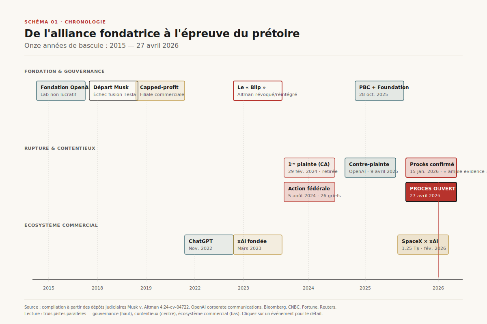
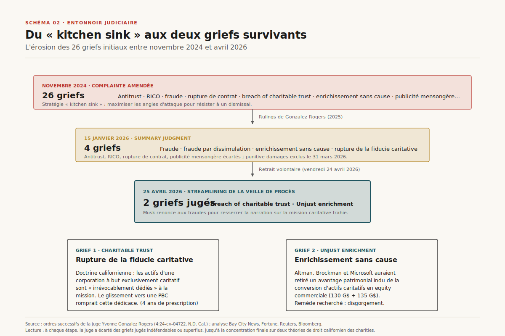
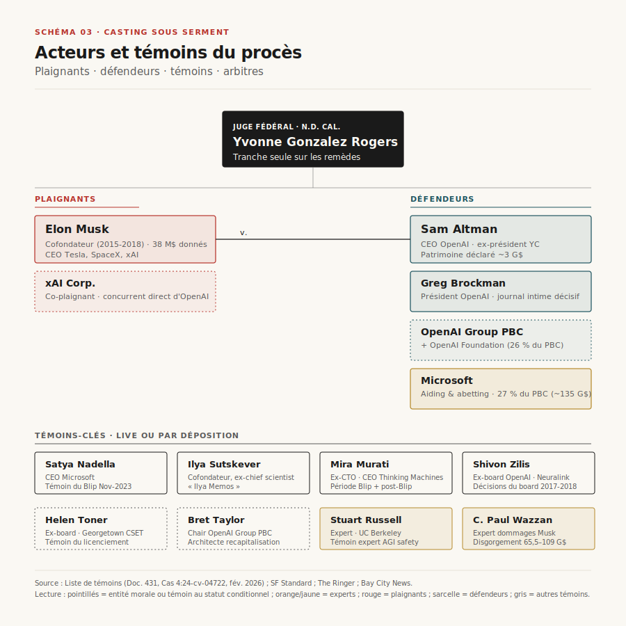
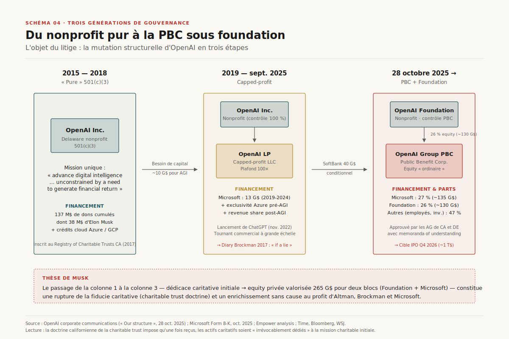
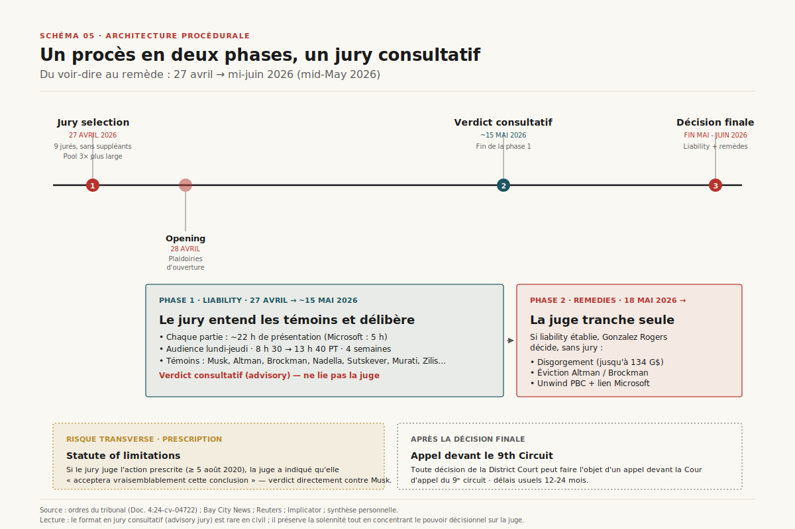
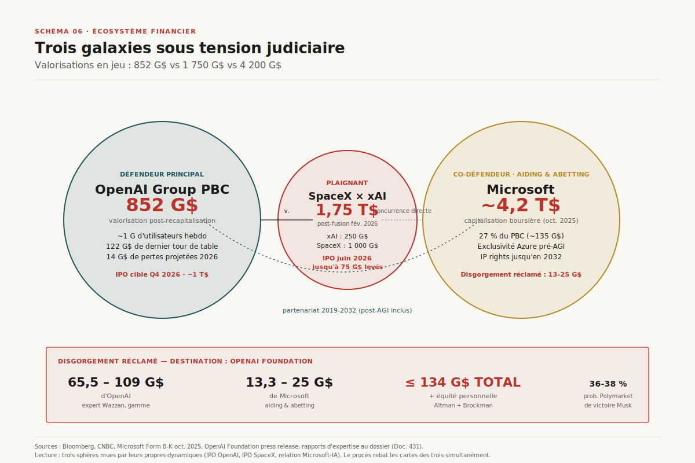
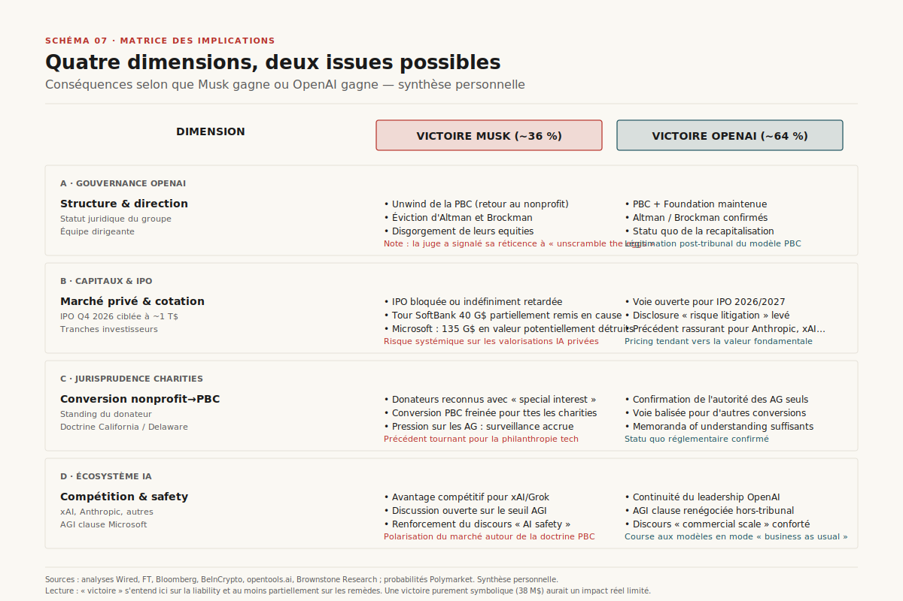

# Procès Musk v. Altman : la mission caritative d'OpenAI à l'épreuve du prétoire

> **Le 27 avril 2026, à Oakland, s'ouvre le procès qui décidera si la conversion d'OpenAI en société commerciale a trahi sa fiducie caritative — ou si Elon Musk poursuit une vendetta concurrentielle déguisée en croisade pour l'humanité.** — Mathieu Guglielmino, 27 avril 2026 · publié à titre personnel · format co-écrit avec l'aide d'une IA

## Synthèse exécutive

- **Démarrage immédiat.** Le voir-dire commence ce lundi 27 avril 2026 à Oakland devant la juge fédérale Yvonne Gonzalez Rogers (4:24-cv-04722) ; les plaidoiries d'ouverture sont attendues mardi, pour quatre semaines de procès[^1][^2].
- **Drastique resserrement des griefs.** Des 26 chefs initiaux de la complainte amendée de novembre 2024, seuls deux subsistent en jugement après le retrait volontaire des fraudes le 24 avril 2026 : *breach of charitable trust* et *unjust enrichment*[^3][^4].
- **Architecture inhabituelle.** Le jury de neuf personnes rend un verdict purement consultatif (advisory) ; la juge Gonzalez Rogers décide seule, en phase 2, des remèdes — disgorgement, éviction d'Altman et de Brockman, *unwinding* éventuel de la PBC[^4][^5].
- **Stakes de valorisation.** Musk réclame jusqu'à 134 G\$ — fléchés vers la fondation OpenAI, pas vers lui-même — sur un OpenAI valorisé 852 G\$, un Microsoft à 27 % du capital (135 G\$) et un IPO ciblé Q4 2026 à ~1 T\$[^6][^7][^8].
- **Précédent stratégique.** Au-delà de la querelle des cofondateurs, c'est la doctrine de la *charitable trust* californienne et la viabilité juridique de toute conversion nonprofit→PBC dans l'IA qui se jouent[^9][^10].

## 1. De l'idée commune à la rupture judiciaire (2015–2026)

L'histoire débute par un courriel du 25 mai 2015. Sam Altman, alors président de Y Combinator, écrit à Elon Musk : « Y a-t-il moyen d'empêcher l'humanité de développer l'IA ? Je pense que la réponse est non. Si elle doit advenir, mieux vaudrait que ce ne soit pas Google qui le fasse en premier. Et si YC démarrait un Manhattan Project pour l'IA ? »[^11]. Musk répond le soir-même : « Probablement la peine d'en discuter. » De cette correspondance naît, en décembre 2015, OpenAI Inc. — *Delaware nonprofit corporation* dont la charte stipule l'avancement de l'intelligence numérique « sans contrainte de retour financier »[^11][^12].

Musk apportera l'essentiel du capital initial : 38 millions de dollars de dons cumulés entre décembre 2015 et mai 2017, sur 137 millions levés par OpenAI à cette période[^13][^14]. Il joue aussi un rôle déterminant dans le recrutement d'Ilya Sutskever depuis Google Brain — qu'il qualifie alors de « pierre angulaire » du succès du laboratoire[^15].

*Schéma 1 — Onze années de bascule, du courriel fondateur d'Altman à l'ouverture du procès, sur trois pistes : gouvernance, contentieux et écosystème commercial.*

L'année 2017 est pivot. Musk, Altman et Brockman débattent de la nécessité de lever des fonds à une échelle incompatible avec un pur statut caritatif. Musk lui-même propose, en septembre 2017, la création d'une *public benefit corporation* qu'il aurait dirigée — un point que la défense d'OpenAI exploitera abondamment[^9][^16]. Mais quand sa demande de contrôle majoritaire est refusée, il claque la porte du conseil en février 2018, invoquant officiellement un risque de conflit d'intérêts avec Tesla[^17]. C'est dans cette même fenêtre que Greg Brockman consigne, dans son journal personnel, la phrase qui hante désormais la défense : *« Je ne peux pas croire que nous nous soyons engagés dans un nonprofit si trois mois plus tard nous faisons une b-corp — alors c'était un mensonge. »*[^18][^19].

En 2019, OpenAI crée OpenAI LP, sa filiale *capped-profit* à plafond de retour 100×, et signe le partenariat Microsoft (13 G\$ en cash et crédits cloud sur cinq ans, plus une exclusivité Azure pré-AGI)[^17][^20]. La machine commerciale s'emballe avec la sortie publique de ChatGPT en novembre 2022 — quatre ans après le départ de Musk. Lorsqu'Altman est briefly limogé puis réintégré en novembre 2023 (« le Blip »), c'est Microsoft qui orchestre le retour, scellant son emprise sur la trajectoire commerciale[^21][^22].

Musk dépose une première plainte en *California Superior Court* le 29 février 2024, puis la retire le 11 juin, à la veille de l'audience prévue sur la motion to dismiss[^21]. Il revient à la charge le 5 août 2024 devant la *U.S. District Court for the Northern District of California* — cette fois avec une équipe juridique reconstituée autour de Marc Toberoff, dont l'un des conseils a comparé la première plainte à un « poisson rouge » et la nouvelle à un « grand requin blanc »[^15].

## 2. Anatomie juridique : du « kitchen sink » aux deux griefs survivants

La complainte amendée de novembre 2024 ratisse large : 26 chefs incluant antitrust fédéral, RICO, fraude, rupture de contrat, concurrence déloyale, *false advertising*, *breach of fiduciary duty* et *breach of charitable trust*[^9][^23]. La logique est défensive — multiplier les angles pour résister au filtre des motions to dismiss — mais elle s'érode rapidement sous les rulings successifs de Gonzalez Rogers.

*Schéma 2 — La trajectoire des griefs, de la complainte « kitchen sink » de novembre 2024 au resserrement de la veille de procès le 25 avril 2026.*

L'attrition se déroule en trois temps. **Premier temps**, courant 2025 : la juge écarte les griefs antitrust, RICO, *false advertising* et rupture de contrat sur motions de rejet ou *summary judgment* partiel. **Deuxième temps**, le 15 janvier 2026 : dans une décision de 28 pages que les avocats d'OpenAI redoutaient depuis des mois, Gonzalez Rogers refuse de prononcer le *summary judgment* demandé conjointement par OpenAI et Microsoft — concluant qu'il existe « ample evidence » au dossier et que « des questions de fait pour le jury » subsistent[^4][^24]. Elle cite explicitement l'entrée du journal de Brockman comme indice circonstanciel d'une intention trompeuse[^4][^25]. Quatre griefs survivent : fraude, *constructive fraud*, enrichissement sans cause, *breach of charitable trust*. Le 31 mars 2026, elle exclut par ailleurs les *punitive damages*, jugés inadaptés au profil patrimonial des défendeurs et au type de remèdes recherchés[^9].

**Troisième temps**, vendredi 24 avril 2026 : Musk demande lui-même le retrait des deux griefs de fraude pour « streamliner » l'affaire. Cette manœuvre tactique est lue de deux manières. Du côté Musk, elle élimine la nécessité de prouver une intention dolosive — un seuil de preuve élevé qui aurait orienté le procès vers l'état d'esprit d'Altman plutôt que vers la mission caritative violée[^4][^26]. Du côté OpenAI, c'est une concession de faiblesse : « Musk fait semblant de changer d'angle alors qu'il s'agit toujours de pouvoir et d'argent »[^7].

Les deux griefs survivants sont enracinés dans le droit californien des organisations caritatives. Le *breach of charitable trust* repose sur la doctrine selon laquelle, dès leur réception, les actifs d'une corporation à but exclusivement caritatif sont « irrévocablement dédiés » à la mission de la charte — quand bien même le donateur n'aurait imposé aucune restriction explicite[^27][^28]. L'enrichissement sans cause vise plus directement les bénéficiaires individuels (Altman, Brockman) et institutionnels (Microsoft) du basculement structurel, à hauteur des avantages patrimoniaux indus.

Une particularité ajoute du sel : le *California Attorney General* Rob Bonta a été *involuntarily joined* à l'affaire après que Musk lui a demandé l'autorisation de poursuivre « au nom » d'OpenAI — sans réponse[^29]. Le Delaware AG Kathleen Jennings a, elle, déposé un *amicus brief* le 30 décembre 2024 reconnaissant que « un préjudice significatif et irréversible existe lorsque l'argent du public sert à convertir un nonprofit en for-profit »[^29]. Les deux AG ont néanmoins, en octobre 2025, validé la recapitalisation moyennant des memoranda of understanding — ce qui complique le récit de Musk.

## 3. Acteurs et témoins : un casting Silicon Valley sous serment

La salle d'audience d'Oakland va concentrer, durant quatre semaines, une densité rare de figures de l'industrie. Le procès est conduit par les meilleures *law firms* du pays — Toberoff & Associates, Cravath Swaine & Moore, Gibson Dunn — et chaque partie dispose d'un budget temps strict : environ 22 heures pour Musk et OpenAI, 5 heures pour Microsoft[^5].

*Schéma 3 — Plaignants, défendeurs, témoins et experts : qui dépose, qui contredit, qui arbitre.*

**Au banc des plaignants**, Elon Musk lui-même viendra témoigner — exposition à double tranchant pour un homme dont le mois précédent un autre jury l'a tenu pour responsable d'avoir trompé des investisseurs lors du rachat de Twitter en 2022, à hauteur de 44 G\$[^17]. La juge a interdit qu'on l'interroge sur sa consommation présumée de kétamine, mais autorise les questions sur sa présence à Burning Man en 2017 et sur sa relation avec Shivon Zilis, ex-board OpenAI et mère de plusieurs de ses enfants[^17][^30].

**Au banc des défendeurs**, Sam Altman (~3 G\$ de fortune personnelle déclarée) et Greg Brockman, dont le journal intime constitue, selon le journaliste Cristian Dina, « la pièce à conviction la plus dommageable »[^4]. OpenAI est représenté à la fois en tant qu'entité (la PBC et la Foundation, qui en contrôle 26 %) et en tant qu'individus à hauteur de leurs intérêts. Microsoft — *aiding and abetting* le breach de fiducie caritative — sera représenté par son CEO Satya Nadella en personne, dont le rôle dans la réintégration d'Altman lors du Blip de novembre 2023 sera examiné en détail[^31].

**La galerie des témoins** est révélatrice de l'ampleur de la fracture. Ilya Sutskever, cofondateur et ex-chief scientist, dépose de manière prévisible — ses « Ilya Memos » documentant méthodiquement les actes qu'il considérait comme des subterfuges corporatifs sont déjà partiellement entrés au dossier[^15]. Mira Murati, ex-CTO et désormais CEO de Thinking Machines, témoignera notamment sur le Blip et la période qui a suivi. Helen Toner, ex-board OpenAI désormais à Georgetown CSET, et Bret Taylor, chair actuel du board PBC, complètent le tableau côté gouvernance.

Les deux experts de Musk méritent attention. **Stuart Russell** (UC Berkeley), figure mondiale de la recherche AGI safety, témoignera que les sociétés d'IA « ont de très fortes incitations à poursuivre l'AGI malgré les risques de safety »[^32]. La juge a néanmoins exclu la portion de son rapport qui qualifiait ces risques de « catastrophiques pour l'humanité », jugée non quantifiée et préjudiciable[^32]. **C. Paul Wazzan** est l'expert dommages : son rapport de 59 pages chiffre le disgorgement à entre 65,5 et 109,4 G\$ pour OpenAI et entre 13,3 et 25 G\$ pour Microsoft[^9][^33]. Gonzalez Rogers a admis son témoignage tout en signalant publiquement, lors d'une audience préparatoire : « le jury comprendra que [l'expert de Musk] tire ces chiffres en l'air »[^9] — formule lourde de conséquence.

## 4. Le pivot de gouvernance : du nonprofit à la PBC

L'objet matériel du litige — ce que Musk veut « unwind » — c'est le passage d'OpenAI d'une corporation 501(c)(3) pure à une *Public Benefit Corporation* sous contrôle d'une fondation. Comprendre ce pivot exige de regarder trois générations de structure.

*Schéma 4 — Trois générations de structure OpenAI : 501(c)(3) pure (2015-2018), nonprofit + capped-profit subsidiary (2019-2025), Foundation + PBC (depuis octobre 2025).*

**Génération 1 (2015-2018) : la pureté caritative.** OpenAI Inc. est une *Delaware nonprofit corporation* unique, financée par dons (137 M\$ cumulés) et crédits cloud Azure et GCP. Elle est inscrite en 2017 au *Registry of Charitable Trusts* de Californie, ce qui la place sous l'autorité de surveillance de l'AG californien — élément central du grief actuel[^29].

**Génération 2 (2019-octobre 2025) : le capped-profit.** Devant l'évidence que l'AGI requerra des dizaines de milliards de capital, OpenAI crée OpenAI LP, *capped-profit limited partnership* à plafond de retour 100×. La nonprofit conserve le contrôle à 100 % et nomme le board ; les investisseurs (Microsoft en tête) prennent une part de l'upside, plafonné. Microsoft injecte 13 G\$ progressivement et obtient l'exclusivité Azure pré-AGI plus une licence IP qui se transforme en *non-exclusive* dès que la gouvernance déclare l'AGI atteinte — la fameuse « clause AGI »[^20][^34]. C'est dans cette génération que tombe la phrase de Brockman, c'est aussi dans cette génération qu'arrive ChatGPT, Sora, GPT-4 et la valorisation de 500 G\$+.

**Génération 3 (depuis le 28 octobre 2025) : la PBC sous Foundation.** Pressé par SoftBank (40 G\$ de financement conditionné à la conversion) et par les contraintes de recrutement face à Anthropic et xAI — toutes deux PBC — OpenAI annonce sa recapitalisation. L'ancien capped-profit devient *OpenAI Group PBC*, *Delaware Public Benefit Corporation* avec actions ordinaires. La nonprofit devient *OpenAI Foundation*, conserve le pouvoir de nomination du board et reçoit 26 % d'equity (~130 G\$). Microsoft passe à 27 % (~135 G\$, valorisation rapportée par son 8-K)[^7][^20]. Les 47 % restants sont répartis entre employés actuels et anciens, et autres investisseurs[^35]. Les AG de Californie et du Delaware, après des concessions sur la sécurité, la résidence californienne et le pouvoir de nomination du board, ont délivré leur *Statement of No Objection*[^36].

Le glissement total — colonne 1 → colonne 3 — produit la singularité juridique que Musk attaque : des actifs initialement dédiés à une mission caritative « par charte » se retrouvent transformés en equity privée dont la fraction « charitable » (la part de la Foundation, 130 G\$) ne dépasse plus celle de Microsoft (135 G\$). Il n'est plus question de « plafond » de retour : c'est de l'equity ordinaire à 100 % d'upside. C'est la base factuelle du grief de *breach of charitable trust* — et l'argument fondamental est désormais entre les mains du jury.

## 5. Architecture du procès : deux phases, un jury consultatif

La structure procédurale fixée par Gonzalez Rogers est inhabituelle pour une *civil action*. Elle bifurque le procès en deux phases distinctes, et — surtout — limite le rôle du jury à un avis consultatif.

*Schéma 5 — Du voir-dire au remède : la trajectoire des quatre semaines de procès et au-delà.*

**Phase 1 — *Liability* (27 avril → mi-mai 2026).** Le jury de neuf personnes (sans suppléants, ce qui est rare) entend les témoins et arguments des deux parties pendant quatre semaines, en sessions du lundi au jeudi de 8 h 30 à 13 h 40 PT[^5][^37]. Chaque partie dispose d'environ 22 heures pour ses présentations directe et croisée, Microsoft de 5 heures. À l'issue, le jury rend un *advisory verdict* sur deux questions : OpenAI a-t-elle violé sa fiducie caritative ? Altman, Brockman et Microsoft se sont-ils enrichis sans cause ?

La spécificité tient à ce verdict consultatif. La juge Gonzalez Rogers — connue pour mener une cour d'une rigueur exigeante, formée par sa présidence du procès Epic v. Apple — n'est pas liée par la décision du jury. Elle peut accepter, rejeter ou modifier les conclusions sur la liability, et trancher elle-même[^5]. Néanmoins, un verdict consensuel du jury aura un poids moral significatif dans sa délibération[^4].

**Phase 2 — *Remedies* (à partir du 18 mai 2026).** Si la liability est établie, la juge décide seule des remèdes. Trois grandes catégories sont sur la table : (1) le disgorgement monétaire (jusqu'à 134 G\$, fléché vers la Foundation OpenAI, pas vers Musk personnellement), (2) la restitution forcée de l'equity et autres bénéfices personnels reçus par Altman et Brockman, (3) la restoration injunctive — éviction des dirigeants concernés et *unwinding* complet de la PBC, ce qui annulerait la recapitalisation d'octobre 2025[^6][^38]. La juge a publiquement signalé sa réticence à ce dernier remède (« unscramble the eggs »), avertissant que la fenêtre d'intervention idéale était l'été 2025 — avant l'accord avec les AG[^14].

**Risque transverse : la prescription.** Les statutes of limitations vont de 2 à 4 ans selon le grief ; le breach of charitable trust dispose de la fenêtre la plus longue (4 ans). Musk ayant déposé l'action fédérale le 5 août 2024, toute conduite antérieure au 5 août 2020 est *a priori* prescrite. Or l'évolution de la structure d'OpenAI s'étale sur cette période. Musk argumente que ses dons ont continué jusqu'au 14 septembre 2020 et qu'il y a une théorie d'*ongoing breach* (chaque pas vers le for-profit redémarre l'horloge) — théorie acceptée par la juge en janvier 2026[^14][^39]. Mais Gonzalez Rogers a explicitement avisé : si le jury conclut à la prescription, « il est très probable que le tribunal acceptera cette conclusion et orientera le verdict vers les défendeurs »[^5].

Au-delà de la phase 2, toute partie perdante peut faire appel devant le 9th Circuit — délai usuel de 12 à 24 mois. Une victoire partielle de Musk en première instance, suivie d'un appel d'OpenAI, prolongerait l'incertitude bien au-delà de 2026.

## 6. L'écosystème financier en jeu : trois galaxies sous tension

Le procès n'est pas une affaire d'individus. Il met en relation trois écosystèmes corporatifs distincts, chacun engagé dans sa propre dynamique de capital, et dont les valorisations cumulent plus de 7 trillions de dollars.

*Schéma 6 — OpenAI, Microsoft, SpaceX/xAI : valorisations en jeu et flux financiers tendus par le procès.*

**OpenAI Group PBC : 852 G\$.** L'entreprise atteint près d'un milliard d'utilisateurs hebdomadaires actifs, vient de boucler un tour de 122 G\$, projette 14 G\$ de pertes pour 2026 et prépare une introduction en bourse au quatrième trimestre 2026 ciblant ~1 trillion de dollars[^4][^17]. Le procès est explicitement listé comme « risque significatif » dans les documents distribués aux investisseurs potentiels[^1]. Au moins douze cadres dirigeants ont quitté l'entreprise depuis la conversion — seuls deux cofondateurs originaux restent — et la dissolution d'OpenAI for Science et l'arrêt de Sora alimentent l'argument selon lequel la conversion a privilégié le commercial sur la recherche fondamentale[^4].

**Microsoft : ~4,2 T\$ de capitalisation boursière.** Co-défendeur sur le grief de *aiding and abetting* sa participation dans le PBC vaut ~135 G\$, soit 27 % du capital. Le partenariat — désormais étendu jusqu'en 2032 sur les IP rights et incluant les modèles post-AGI sous validation par un panel d'experts indépendants — représente l'un des plus gros engagements stratégiques de la firme[^20][^34]. Si le tribunal force le *unwinding*, c'est cette participation qui s'évanouit. Wazzan chiffre le disgorgement réclamé à Microsoft entre 13,3 et 25 G\$.

**SpaceX × xAI : 1,75 T\$.** En février 2026, Musk fusionne SpaceX (valorisée 1 trillion) avec xAI (250 G\$), créant la plus grande fusion de l'histoire — ouvertement préparée pour permettre une IPO en juin 2026 visant à lever jusqu'à 75 G\$ et à valoriser l'ensemble jusqu'à 1,75 T\$[^40][^41]. Cette dynamique alimente l'argument central de la défense : Musk ne poursuit pas pour réparer un préjudice subi, il poursuit pour ralentir un concurrent au moment précis où sa propre IPO est calibrée[^7]. OpenAI a déposé une contre-plainte en avril 2025 pour *unfair competition* et *tortious interference*, arguant notamment que l'offre Musk de 97,4 G\$ pour racheter les actifs nonprofit en février 2025 était un « sham bid » destiné à perturber le calendrier de la recapitalisation[^42][^43].

Les marchés de prédiction cotent la victoire de Musk autour de 36-38 % (Polymarket), reflétant une incertitude réelle. Une estimation alternative de Darrow AI — 20-38 millions de dollars, soit l'équivalent du don initial de Musk — illustre la dispersion des scénarios envisagés[^9].

## 7. Implications : précédent jurisprudentiel et écosystème IA

Quel que soit l'issue, le procès Musk v. Altman devient un cas d'école — le premier test contentieux à grande échelle de la question : *un nonprofit peut-il, après avoir levé des dizaines de millions au nom d'une mission charitable, se transformer en société commerciale valorisée en centaines de milliards en conservant l'essentiel de la valeur dans des mains privées ?*

*Schéma 7 — Quatre dimensions d'impact (gouvernance, capital, jurisprudence, écosystème IA) selon les deux issues principales.*

**Gouvernance d'OpenAI.** Une victoire Musk sur la liability et un *unwinding* complet annulerait la recapitalisation d'octobre 2025, évincerait Altman et Brockman, et restaurerait le statut nonprofit — bouleversement dont la juge a, à plusieurs reprises, signalé l'impraticabilité technique[^14]. Une victoire OpenAI consoliderait au contraire la légitimité jurisprudentielle du modèle PBC et son acceptabilité par les régulateurs californien et delawarien.

**Capitaux et marchés.** L'IPO d'OpenAI au Q4 2026 (cible ~1 T\$) est suspendue à l'issue du procès. Une victoire Musk la bloquerait probablement et ferait s'évaporer une part substantielle des 135 G\$ détenus par Microsoft. À l'inverse, une victoire OpenAI lèverait le facteur « risque litigation » que les banquiers d'investissement intègrent actuellement dans le pricing.

**Jurisprudence des charities.** C'est ici que se joue la dimension la plus structurante du procès. Le droit américain est traditionnellement restrictif sur le *standing* des donateurs : seuls les *Attorneys General* peuvent en principe poursuivre pour faire respecter les termes d'une fiducie caritative[^28][^44]. Musk plaide une exception — la doctrine du *special interest* — qui, si elle est validée à ce niveau, ouvrirait une voie d'action substantielle pour les donateurs majeurs des nonprofits américains. Une jurisprudence favorable à Musk modifierait profondément l'équilibre entre AG, donateurs et trustees dans toutes les charities, bien au-delà du domaine de l'IA.

**Écosystème IA.** Trois conséquences indirectes méritent attention. Premièrement, la *clause AGI* du contrat Microsoft-OpenAI — qui prévoyait la fin de l'exclusivité IP de Microsoft à la déclaration d'AGI par OpenAI — a été renégociée hors-tribunal en septembre/octobre 2025 pour confier la décision à un panel d'experts indépendants[^20][^45]. Le procès pourrait néanmoins forcer une discussion publique sur les seuils d'AGI, jusqu'ici opaques. Deuxièmement, une victoire Musk renforcerait la position concurrentielle de xAI et d'Anthropic, toutes deux PBC depuis l'origine et donc à l'abri du même grief. Troisièmement, le discours public sur l'« AI safety » et la responsabilité corporative trouverait dans le verdict — quel qu'il soit — une référence forte autour de laquelle se cristalliseraient les prochains débats réglementaires (EU AI Act, SB 1047 California, NIST AI RMF).

Pour les acteurs français de l'écosystème data & AI, le procès n'est pas qu'un fait divers américain. Il offre un précédent comparatif sur trois questions actives en Europe : la frontière entre intérêt général et profit dans les modèles hybrides (PBC, *société à mission* française, B Corp) ; la capacité d'un donateur structurant à enforcer les termes implicites d'une charte caritative ; et la prise en compte juridique des risques systémiques de l'AGI dans la gouvernance corporate.

## 8. Conclusion : ce que dira (et ne dira pas) le verdict

Le procès Musk v. Altman tranchera une question juridique précise : OpenAI a-t-elle, en convertissant sa structure et son capital, rompu la fiducie caritative qui pesait sur ses actifs initiaux, et certains acteurs en ont-ils été indûment enrichis ? Cette question a des réponses bornées par le droit californien des charities et les statutes of limitations applicables, et la juge Gonzalez Rogers a déjà signalé son scepticisme sur les chiffres de dommages avancés et sa réticence à un *unwinding* structurel.

Le procès ne tranchera pas, en revanche, des questions plus larges qui sous-tendent pourtant l'attention publique : la sécurité de l'AGI, la légitimité philosophique de la conversion d'idéaux fondateurs en capital privé, ou la concentration de pouvoir technologique dans une poignée d'acteurs corporatifs. Comme l'écrivait *WIRED* à la veille du procès, l'audience est « un rendez-vous longuement reporté avec la responsabilité des laboratoires d'IA quand les idéaux fondateurs entrent en collision avec l'échelle commerciale »[^46]. La distance entre la question juridiquement tranchée et la question publiquement attendue est au cœur de la frustration que beaucoup ressentiront — quel que soit le verdict — devant ce procès. Les manifestants prévus devant le tribunal d'Oakland en résument l'ambivalence sous un slogan : *« quel que soit le gagnant, c'est nous les perdants »*[^47].

Reste enfin la dimension proprement politique. Le procès se déroule à un moment où les deux protagonistes sont à des sommets de visibilité — Altman préparant l'IPO la plus attendue de la décennie, Musk préparant celle de SpaceX et conservant un rôle politique central. Que le verdict aboutisse à un compromis monétaire modéré, à une victoire éclatante de Musk, ou à une défense intégrale d'OpenAI, il sera lu — par le public, par les régulateurs, par les marchés — comme un signal sur l'équilibre de pouvoir dans une industrie dont les choix de gouvernance détermineront, durant la prochaine décennie, qui contrôle quoi sur les modèles les plus puissants jamais déployés.

---

## Sources

[^1]: Bertha Coombs, « Musk v. Altman heads to court next week. Here's what's at stake », *CNBC*, 24 avril 2026. URL : https://www.cnbc.com/2026/04/24/musk-v-altman-trial-openai-lawsuit-xai.html. Consulté le 27 avril 2026.

[^2]: Bobby Allyn, « Musk vs. Altman: Tech CEOs head to court Monday over fate of OpenAI », *NPR*, 27 avril 2026. URL : https://www.npr.org/2026/04/27/nx-s1-5795661/trial-openai-elon-musk-sam-altman. Consulté le 27 avril 2026.

[^3]: « Musk drops fraud claims against OpenAI, Altman ahead of trial », *Fortune* (via Bloomberg), 25 avril 2026. URL : https://fortune.com/2026/04/25/elon-musk-fraud-claims-openai-sam-altman-trial/. Consulté le 27 avril 2026.

[^4]: Cristian Dina, « Musk v. Altman trial begins with \$150B at stake over OpenAI's nonprofit-to-profit conversion », *The Next Web*, 26 avril 2026. URL : https://thenextweb.com/news/musk-altman-openai-trial-credibility-nonprofit. Consulté le 27 avril 2026.

[^5]: Marcus Schuler, « Musk v. Altman OpenAI Trial Opens With \$150B at Stake », *Implicator*, 26 avril 2026. URL : https://www.implicator.ai/musk-v-altman-trial-opens-monday-with-150-billion-and-openai-nonprofit-at-stake/. Consulté le 27 avril 2026.

[^6]: Jonathan Stempel, « Musk Wants OpenAI Nonprofit to Get Any Trial Winnings From Suit », *Bloomberg*, 7 avril 2026. URL : https://www.bloomberg.com/news/articles/2026-04-07/musk-wants-openai-nonprofit-to-get-any-trial-winnings-from-suit. Consulté le 27 avril 2026.

[^7]: « Elon Musk seeks ouster of OpenAI CEO Sam Altman as part of lawsuit », *CNBC*, 7 avril 2026. URL : https://www.cnbc.com/2026/04/07/elon-musk-seeks-ouster-of-openai-ceo-sam-altman-as-part-of-lawsuit.html. Consulté le 27 avril 2026.

[^8]: « Elon Musk and OpenAI CEO Sam Altman head to court in high-stakes showdown over AI », *Associated Press* (via ABC News), 27 avril 2026. URL : https://abcnews.com/Technology/wireStory/elon-musk-openai-ceo-sam-altman-head-court-132410963. Consulté le 27 avril 2026.

[^9]: « Musk v. OpenAI Trial Begins After Fraud Claims Dismissed », *Open Tools*, 26 avril 2026. URL : https://opentools.ai/news/musk-openai-trial-begins-after-fraud-claims-dismissed. Consulté le 27 avril 2026.

[^10]: Robert Henderson, « Elon Musk and Sam Altman are about to face off in court. Is an impartial jury even possible? », *CNN Business*, 27 avril 2026. URL : https://edition.cnn.com/2026/04/27/tech/elon-musk-sam-altman-openai-lawsuit. Consulté le 27 avril 2026.

[^11]: Andrew Tarantola, « What you need to know as Elon Musk's lawsuit against Sam Altman begins », *Engadget*, 25 avril 2026. URL : https://www.engadget.com/ai/what-you-need-to-know-as-elon-musks-lawsuit-against-sam-altman-begins-191500726.html. Consulté le 27 avril 2026.

[^12]: « Why OpenAI's structure must evolve to advance our mission », OpenAI, 27 décembre 2024. URL : https://openai.com/index/why-our-structure-must-evolve-to-advance-our-mission/. Consulté le 27 avril 2026.

[^13]: « Elon Musk wanted an OpenAI for-profit », OpenAI, communication corporative. URL : https://openai.com/index/elon-musk-wanted-an-openai-for-profit/. Consulté le 27 avril 2026.

[^14]: Joe Dworetzky & Jay Harris, « Musk v. Altman trial heads to court Monday », *Local News Matters / Bay City News*, 26 avril 2026. URL : https://localnewsmatters.org/2026/04/26/musk-altman-openai-trial-oakland/. Consulté le 27 avril 2026.

[^15]: Tyler Parker, « A Deep Dive Into the Elon Musk vs. Sam Altman Trial », *The Ringer*, 20 avril 2026. URL : https://www.theringer.com/2026/04/20/tech/sam-altman-elon-musk-trial-openai-primer. Consulté le 27 avril 2026.

[^16]: « OpenAI Cancels Its For-Profit Plans », *Marketing AI Institute* (Roetzer), 13 mai 2025. URL : https://www.marketingaiinstitute.com/blog/openai-for-profit-nonprofit. Consulté le 27 avril 2026.

[^17]: Daniel Cooper, « Elon Musk and OpenAI CEO Sam Altman head to court in high-stakes showdown over AI », *Associated Press / Daily Gazette*, 27 avril 2026. URL : https://www.dailygazette.com/leader_herald/ap/business/elon-musk-and-openai-ceo-sam-altman-head-to-court-in-high-stakes-showdown-over/article_5e382441-c7e6-5d02-98ba-dc4b6cf50abb.html. Consulté le 27 avril 2026.

[^18]: « OpenAI Lawsuit Exposed: The Private Diaries, Secret Texts, and \$500 Billion Fraud Case Going to Trial », *TechBuzz*, 16 janvier 2026. URL : https://www.techbuzz.ai/articles/open-ai-lawsuit-exposed-the-private-diaries-secret-texts-and-500-billion-fraud-case-going-to-trial-in-2026. Consulté le 27 avril 2026.

[^19]: Naomi Nix, « Elon Musk's court battle with Sam Altman exposes Silicon Valley secrets », *The Washington Post*, 23 avril 2026. URL : https://www.washingtonpost.com/technology/2026/04/23/musk-altman-lawsuit-trial-openai/. Consulté le 27 avril 2026.

[^20]: « The next chapter of the Microsoft–OpenAI partnership », *Microsoft Official Blog*, 28 octobre 2025. URL : https://blogs.microsoft.com/blog/2025/10/28/the-next-chapter-of-the-microsoft-openai-partnership/. Consulté le 27 avril 2026.

[^21]: Joe Dworetzky, « Musk v. Altman: How OpenAI's founders went from tech allies to bitter courtroom enemies », *Local News Matters / Bay City News*, 21 avril 2026. URL : https://localnewsmatters.org/2026/04/21/musk-v-altman-how-openais-founders-went-from-tech-allies-to-bitter-courtroom-enemies/. Consulté le 27 avril 2026.

[^22]: Karen Hao, *Empire of AI: Dreams and Nightmares in Sam Altman's OpenAI*, 2025 (cité dans Bay City News).

[^23]: « MUSK v. OPENAI INC (2025) », *FindLaw*, dossier 4:24-cv-04722. URL : https://caselaw.findlaw.com/court/us-dis-crt-n-d-cal/117603877.html. Consulté le 27 avril 2026.

[^24]: « Musk's Suit Over OpenAI's for-Profit Switch Headed to Trial », *PYMNTS*, 8 janvier 2026. URL : https://www.pymnts.com/legal/2026/musks-suit-over-openais-for-profit-switch-headed-to-trial. Consulté le 27 avril 2026.

[^25]: Joe Dworetzky, « Musk v. Altman: Trial date looms as judge hands wins and setbacks to both sides », *Local News Matters / Bay City News*, 23 avril 2026. URL : https://localnewsmatters.org/2026/04/23/musk-v-altman-trial-date-looms-as-judge-hands-wins-and-setbacks-to-both-sides/. Consulté le 27 avril 2026.

[^26]: « Judge drops Musk's fraud claims, trial to focus on nonprofit dispute », *AFP / MSN*, 26 avril 2026. URL : https://www.msn.com/en-us/news/other/judge-drops-musks-fraud-claims-in-openai-lawsuit/gm-GM412A26DB. Consulté le 27 avril 2026.

[^27]: Gene Takagi, « Charitable Trust Doctrine », *Nonprofit Law Blog*, 15 octobre 2005 (mise à jour 3 décembre 2020). URL : https://nonprofitlawblog.com/charitable_trus/. Consulté le 27 avril 2026.

[^28]: California Office of the Attorney General, « Charities ». URL : https://oag.ca.gov/charities. Consulté le 27 avril 2026.

[^29]: Joe Dworetzky, « Musk v. Altman: Inside the OpenAI shake-up that set the stage for next courtroom clash », *Local News Matters / Bay City News*, 22 avril 2026. URL : https://localnewsmatters.org/2026/04/22/musk-v-altman-inside-the-openai-shake-up-that-set-the-stage-for-next-courtroom-clash/. Consulté le 27 avril 2026.

[^30]: « Elon Musk vs Sam Altman Trial Kicks Off », *International Business Times Australia*, 27 avril 2026. URL : https://www.ibtimes.com.au/elon-musk-vs-sam-altman-trial-kicks-off-jury-selection-begins-high-stakes-openai-lawsuit-1867586. Consulté le 27 avril 2026.

[^31]: Jonathan Vanian & Stephanie Ferris, « Musk vs. Altman: The AI trial of the century comes to Oakland », *San Francisco Standard*, 24 avril 2026. URL : https://sfstandard.com/2026/04/24/elon-openai-trial/. Consulté le 27 avril 2026.

[^32]: Joe Dworetzky, « Musk v. Altman: Trial date looms… » op. cit. (sur le témoignage de Stuart Russell). *Local News Matters*, 23 avril 2026.

[^33]: « Doc 431, Joint Witness List », *Cas 4:24-cv-04722, N.D. Cal., 26 février 2026*. URL : https://storage.courtlistener.com/recap/gov.uscourts.cand.433688/gov.uscourts.cand.433688.431.0.pdf. Consulté le 27 avril 2026.

[^34]: « OpenAI and Microsoft Redraw AI Boundaries with Latest AGI Agreement », *The National CIO Review*, 28 octobre 2025. URL : https://nationalcioreview.com/articles-insights/extra-bytes/openai-and-microsoft-redraw-ai-boundaries-with-latest-agi-agreement/. Consulté le 27 avril 2026.

[^35]: « OpenAI's Shift to a Public Benefit Corporation, Explained », *Built In*, 29 octobre 2025. URL : https://builtin.com/articles/openai-new-corporate-structure. Consulté le 27 avril 2026.

[^36]: « An OpenAI Timeline: Musk, Altman, and the For-Profit Shift », *TIME*, 28 octobre 2025. URL : https://time.com/7328674/openai-chatgpt-sam-altman-elon-musk-timeline/. Consulté le 27 avril 2026.

[^37]: « OpenAI restructuring puts spotlight on public benefit corporations », *Empower*, 31 octobre 2025. URL : https://www.empower.com/the-currency/money/openai-restructuring-public-benefit-corporation-news. Consulté le 27 avril 2026.

[^38]: Joe Dworetzky, « Musk v. Altman: It's not about the money — Elon goes all-in with bid to reshape OpenAI », *Local News Matters / Bay City News*, 24 avril 2026. URL : https://localnewsmatters.org/2026/04/24/musk-v-altman-its-not-about-the-money-elon-goes-all-in-with-bid-to-reshape-openai/. Consulté le 27 avril 2026.

[^39]: « The Elon Musk and OpenAI Trial Can Expose Early Secrets », *BeInCrypto*, 26 avril 2026. URL : https://beincrypto.com/elon-musk-openai-lawsuit-trial-to-start/. Consulté le 27 avril 2026.

[^40]: Lora Kolodny, « Musk's xAI, SpaceX combo is the biggest merger of all time, valued at \$1.25 trillion », *CNBC*, 3 février 2026. URL : https://www.cnbc.com/2026/02/03/musk-xai-spacex-biggest-merger-ever.html. Consulté le 27 avril 2026.

[^41]: « Musk's \$1.75T SpaceX IPO », *TradingKey*, 26 mars 2026. URL : https://www.tradingkey.com/analysis/stocks/us-stocks/261723579-elon-musk-stock-spacex-ipo-space-ai-bitcoin-btc-llms-tradingkey. Consulté le 27 avril 2026.

[^42]: Matt O'Brien, « OpenAI Countersues Elon Musk », *Associated Press / U.S. News & World Report*, 10 avril 2025. URL : https://www.usnews.com/news/business/articles/2025-04-10/openai-countersues-elon-musk-in-legal-dispute-over-chatgpt-makers-business-ambitions. Consulté le 27 avril 2026.

[^43]: Kyle Wiggers, « OpenAI countersues Elon Musk, calls for enjoinment from 'further unlawful and unfair action' », *TechCrunch*, 9 avril 2025. URL : https://techcrunch.com/2025/04/09/openai-attorneys-call-for-musk-to-be-enjoined-from-further-unlawful-and-unfair-action/. Consulté le 27 avril 2026.

[^44]: Evelyn Brody, « The Conundrum of Charitable-Donor Standing », *Georgia Law Review*, 2005 (cité dans la doctrine appliquée). URL : https://ncpl.law.nyu.edu/wp-content/uploads/pdfs/2005/Conf2005_Brody-Ga-L-Rev-pub.pdf. Consulté le 27 avril 2026.

[^45]: « Microsoft and OpenAI Reach Tentative Agreement: The Dawn of Multi-Vendor Enterprise AI », *European AI & Cloud Summit*. URL : https://cloudsummit.eu/blog/microsoft-openai-agreement-dawn-multi-vendor-enterprise-ai. Consulté le 27 avril 2026.

[^46]: WIRED, citation rapportée par *Open Tools* op. cit. (note 9), 26 avril 2026.

[^47]: AFP / *France-Guyane*, « Genèse d'OpenAI : le duel judiciaire Musk-Altman s'ouvre en Californie », 27 avril 2026. URL : https://www.franceguyane.fr/actualite/international/genese-dopenai-le-duel-judiciaire-musk-altman-souvre-en-californie-1077172.php. Consulté le 27 avril 2026.
