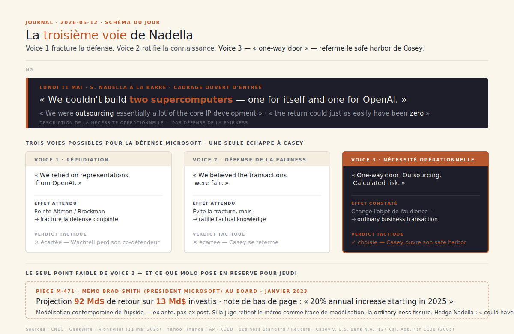
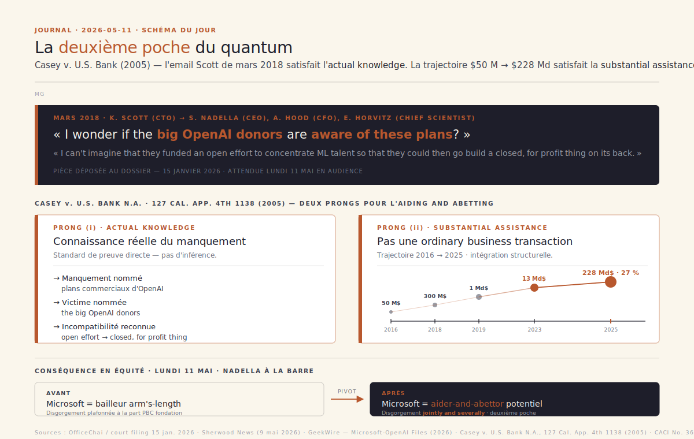
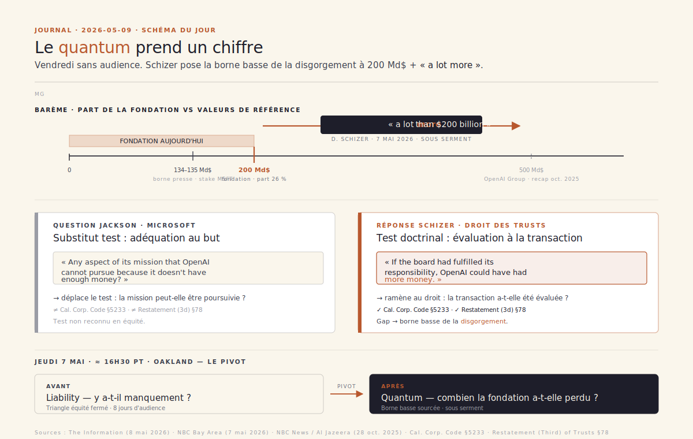
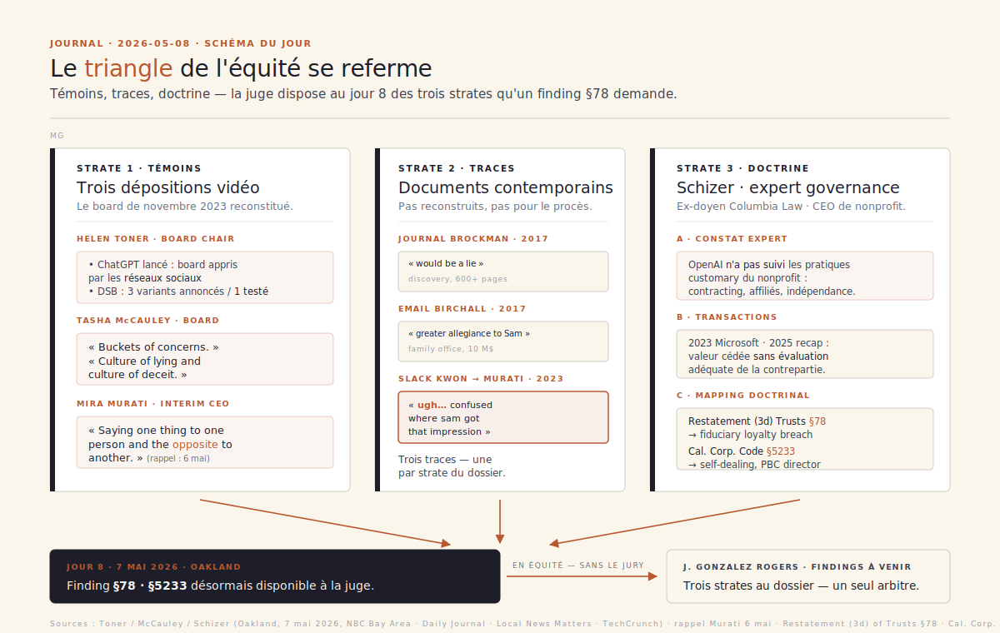
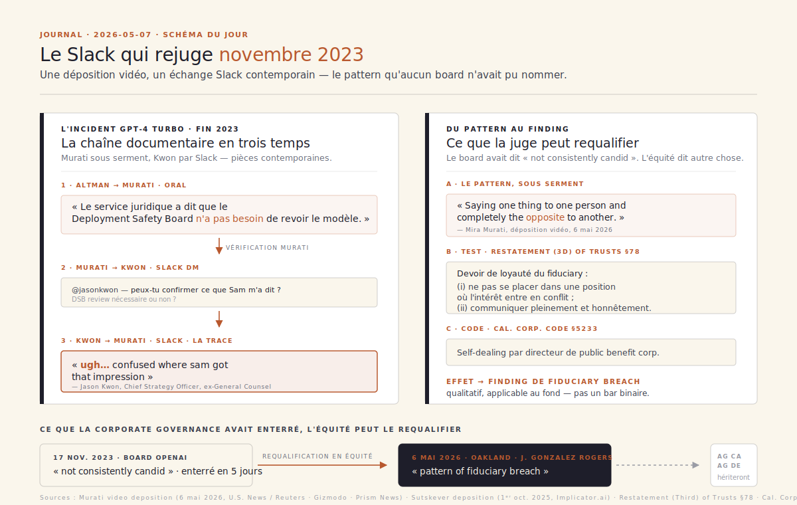
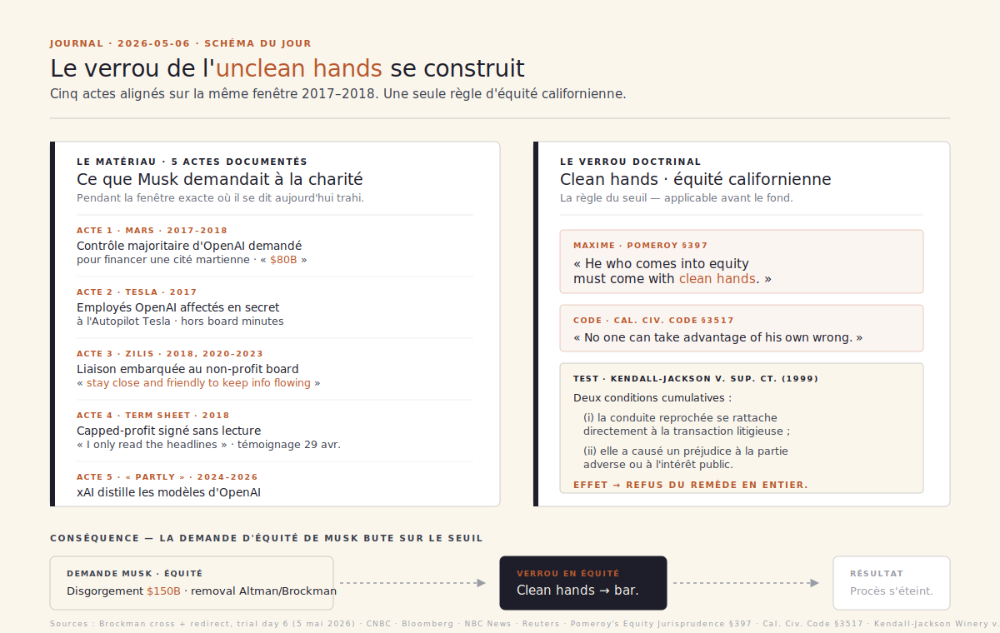
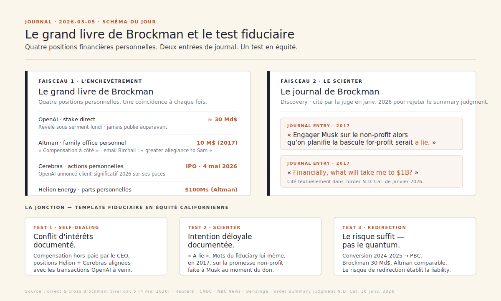
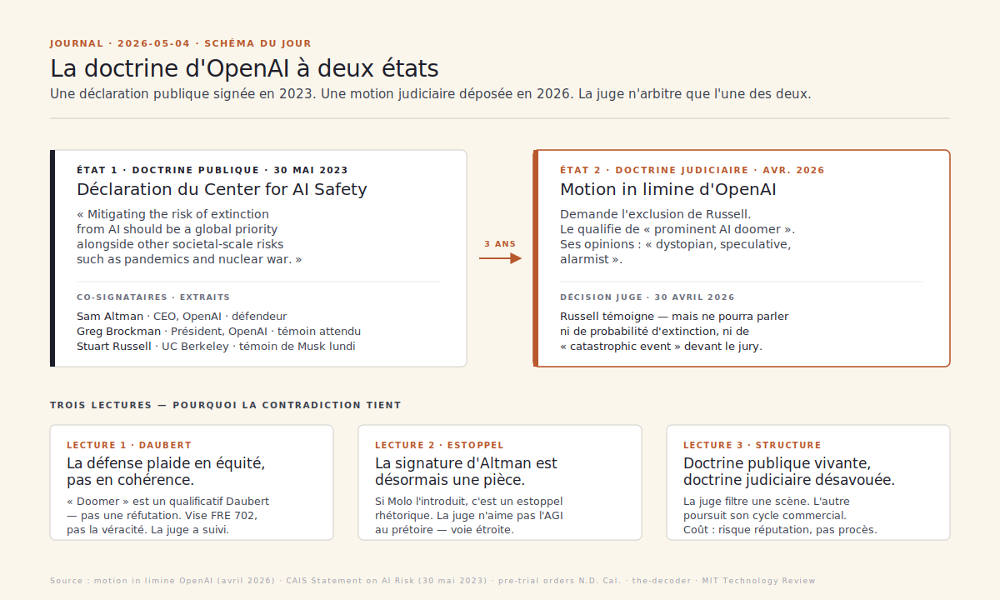

# Journal · Procès Musk v. Altman

Tenu à partir du 1ᵉʳ mai 2026, dans le sillage du dossier de veille publié le 27 avril 2026 (jour de l'ouverture du procès à Oakland devant la juge Yvonne Gonzalez Rogers).

**Format.** Une entrée par jour, datée `YYYY-MM-DD`. Trois à six puces factuelles (chaque fait sourcé inline), puis une phrase d'analyse éditoriale. En l'absence de mouvement procédural notable, l'entrée reste brève et signale ce qui se prépare. Les dates suivent l'heure de la côte ouest des États-Unis (Oakland, fuseau de la cour).

— Mathieu Guglielmino · publié à titre personnel · format co-écrit avec l'aide d'une IA

---

## 2026-05-12 — « One-way door. » Nadella choisit la troisième voie — celle que Casey n'attendait pas

**Exec sum**
- **Lundi 11 mai à Oakland, journée Nadella sur la quasi-intégralité de la séance.** Le CEO de Microsoft a témoigné plusieurs heures, costume bleu marine, conduite directe Russell Cohen puis contre-interrogatoire Steven Molo ([CNBC, 11 mai 2026](https://www.cnbc.com/2026/05/11/microsoft-ceo-satya-nadella-musk-altman-trial.html) ; [NBC News, 11 mai 2026](https://www.nbcnews.com/tech/elon-musk/microsoft-ceo-satya-nadella-testifies-musk-openai-trial-rcna344584)).
- **Le cadrage central, posé d'entrée par Nadella : « one-way door ».** Microsoft, dit-il, *« couldn't build two supercomputers — one for itself and one for OpenAI »*, et a accepté *« the opportunity cost of diverting computing resources »* parce que *« we were outsourcing essentially a lot of the core IP development »* ([GeekWire, 11 mai 2026](https://www.geekwire.com/2026/musk-v-altman-satya-nadella-was-worried-about-microsoft-being-the-next-ibm-in-openai-deal/) ; [AlphaPilot, 11 mai 2026](https://www.alphapilot.tech/discover/nadella-testifies-in-musk-v-openai-microsoft-ceo-defends-partnership-and-commercial-strategy)).
- **L'analogie IBM, en email interne pré-investissement avril 2022** : Nadella écrivait à son équipe ne pas vouloir que *« Microsoft becomes IBM while OpenAI becomes the next Microsoft »* — pièce introduite directe par Cohen pour ancrer la *risk-taking commercial partner* avant la cross ([GeekWire, 11 mai 2026](https://www.geekwire.com/2026/musk-v-altman-satya-nadella-was-worried-about-microsoft-being-the-next-ibm-in-openai-deal/)).
- **Cross-examination Molo : pièce centrale, un mémo Brad Smith de janvier 2023 au board Microsoft**, projetant **92 Md$ de retour sur les 13 Md$ cumulés** investis dans OpenAI, avec note de bas de page actant *« a 20% annual increase starting in 2025 »*. Nadella confirme les chiffres puis répond, avec une hedge que Molo n'a pas pu démonter en séance : *« the return could just as easily have been zero »* ([GeekWire, 11 mai 2026](https://www.geekwire.com/2026/musk-v-altman-satya-nadella-was-worried-about-microsoft-being-the-next-ibm-in-openai-deal/) ; [AlphaPilot, 11 mai 2026](https://www.alphapilot.tech/discover/nadella-testifies-in-musk-v-openai-microsoft-ceo-defends-partnership-and-commercial-strategy)).
- **Sur le firing de novembre 2023 — admission concédée par Nadella** : Microsoft a demandé une explication au board sortant et n'a *« never been given clarity »* sur les motifs ; Cohen a posé la pièce pour caractériser Microsoft comme **outsider à la gouvernance interne** d'OpenAI au moment décisionnaire ([Yahoo Finance / AP, 11 mai 2026](https://finance.yahoo.com/news/microsoft-ceo-says-he-was-never-given-clarity-on-why-altman-was-fired-from-openai-during-musk-trial-195321721.html) ; [AOL / AP, 11 mai 2026](https://www.aol.com/articles/microsoft-ceo-satya-nadella-defends-224118476.html)).
- **Bascule de fin d'après-midi : Sutskever en personne à la barre** (pas par déposition vidéo comme annoncé samedi). Confirme avoir compilé pendant *« about a year »* un document de plus de **50 pages** documentant un *« consistent pattern of lying »* d'Altman, à la demande du board ; qualifie la *removal* de novembre 2023 de *« Hail Mary »* ; reconnaît son vote de réintégration et son *« regret »* ultérieur ([KQED, 11 mai 2026](https://www.kqed.org/news/12083224/former-openai-exec-calls-decision-to-remove-sam-altman-a-hail-mary-during-musk-trial) ; [Business Standard / Reuters, 12 mai 2026](https://www.business-standard.com/technology/tech-news/gathered-proof-of-altman-s-dishonesty-for-a-year-ex-openai-exec-sutskever-126051200204_1.html) ; [Benzinga, 11 mai 2026](https://www.benzinga.com/markets/tech/26/05/52474926/ilya-sutskever-case-against-sam-altman-pattern-of-lying)).
- **Calendrier qui se resserre.** Altman attendu à la barre **mardi 12 mai** ; **closings jeudi 14 mai** confirmés par Gonzalez Rogers — séquence Sutskever passée du *winding-down* de fin de semaine au *front-loaded* de début de semaine 3 ([Washington Post, 12 mai 2026](https://www.washingtonpost.com/business/2026/05/12/altman-musk-openai-trial/d3c73adc-4db7-11f1-97e7-22c6c29ff0d8_story.html)).

**Angle du jour — La troisième voie. Nadella a tenu trois heures la voie médiane que je donnais hier pour intenable. Casey v. U.S. Bank trouve son safe harbor — et la « deuxième poche » se referme.**

Hier, j'ai écrit que Nadella avait deux voies, et que la voie médiane — *« nous étions un partenaire commercial, pas un gardien de la mission charitable »* — était *« techniquement plausible »* mais *« difficile à tenir trois heures sous le contre-interrogatoire de Molo »*. J'avais raison sur la difficulté ; j'avais tort sur l'issue. Nadella a tenu la voie médiane. Pas en distinguant son rôle de CEO ligne à ligne de celui de Kevin Scott CTO — ce que je donnais pour le piège — mais en **changeant l'objet de l'audience**. La défense Microsoft n'a pas plaidé la *fairness* des transactions ; elle a plaidé la *nécessité opérationnelle* du partenariat. Ce n'est pas la même équité.

**La pièce, en doctrine.** *« One-way door »* : Microsoft, en 2018-2019, ne pouvait pas construire *« two supercomputers — one for itself and one for OpenAI »* — la contrainte n'est pas un argument, c'est une description matérielle de la rareté du compute à l'époque. *« We were outsourcing essentially a lot of the core IP development »* : Microsoft décrit ici sa décision comme un **abandon de souveraineté sur le R&D**, pas comme une mainmise sur OpenAI. La syntaxe est précise — *outsourcing* est le verbe d'un client qui n'a pas d'option, pas d'un partenaire qui en a. Et le *« calculated risk »* qu'il ajoute lui sert de borne basse rhétorique : *« the return could just as easily have been zero »*. Ces trois phrases, prises ensemble, ne plaident pas l'innocence ; elles plaident la **nécessité**. C'est précisément ce que la doctrine *Casey* protège.

**Le safe harbor, relu.** *Casey v. U.S. Bank N.A.*, 127 Cal. App. 4th 1138 (2005), pose deux *prongs* pour l'*aiding and abetting* — connaissance réelle + assistance substantielle. Le bémol qui définit le *safe harbor* est dans le même arrêt : *« a bank's conduct in executing ordinary business transactions for a customer, even if the bank knows the customer is engaged in wrongdoing, does not constitute substantial assistance »*. ==C'est exactement le périmètre dans lequel Nadella a installé toute son audience : Microsoft a vendu du compute à un client, sous contrainte de rareté, en sachant que l'investissement pouvait aller à zéro==. La connaissance documentée par l'email Scott de mars 2018 — *« I wonder if the big OpenAI donors are aware of these plans? »* — n'est pas réfutée. Elle est **redéplacée** : la doctrine *Casey* admet la connaissance, à condition que l'assistance reste *ordinary*. Le débat n'est plus *« Microsoft savait-il ? »* — c'est *« Microsoft a-t-il fait autre chose que du business ordinaire ? »*. Pour la juge Gonzalez Rogers, la *ordinary-ness* d'une transaction se juge **ex ante**, au moment de la décision — pas *ex post*, à la lumière du retour 17×. Nadella a tenu l'*ex ante*.

**Le seul point faible — et il est sérieux.** Molo a déposé sur la barre le mémo Brad Smith de janvier 2023 au board Microsoft : projection de **92 Md$ de retour sur les 13 Md$ investis**, note de bas de page actant *« a 20% annual increase starting in 2025 »*. C'est la pièce qui contredit la *one-way door* : un mémo de gouvernance interne qui modélise précisément l'upside structurel de la conversion non-profit→capped-profit→PBC, **sept ans après le mail Scott et trois ans avant la recap PBC d'octobre 2025**. Si la juge retient ce mémo comme **trace contemporaine de modélisation de l'upside**, alors la doctrine *« ordinary business transaction »* se fissure : on ne peut pas, en équité, modéliser à 92 Md$ une participation dans une charité en cours de conversion et plaider ensuite la nécessité opérationnelle aveugle. Nadella le savait — d'où la hedge *« could have been zero »*, qui n'est pas une rétractation mais une couverture probatoire. Molo n'a pas démonté la hedge en séance ; il devra y revenir en *closing* jeudi.

**Et Sutskever, au même moment.** Pendant que Nadella refermait Casey à l'audience principale, Sutskever a déposé en personne — pas par vidéo comme annoncé — son document de 50+ pages compilé sur *« about a year »*, documentant un *« consistent pattern of lying »* d'Altman. C'est la pièce probatoire la plus directe que Molo ait obtenue depuis l'ouverture. Mais Sutskever est venu avec **son propre poison** : il a qualifié la *removal* de novembre 2023 de *« Hail Mary »*, reconnu son vote de réintégration, exprimé son *regret* ultérieur. ==Wachtell va exploiter la phrase « Hail Mary » en closing — un fiduciaire qui qualifie sa propre action de coup de désespoir n'est pas un témoin du manquement, c'est un témoin de l'erreur de jugement==. La 50-page deposition reste au dossier ; son poids en équité dépend désormais de l'arbitrage qualitatif que la juge fera entre le contenu (factuel, daté, contemporain) et le cadrage (rétrospectif, regretté, *Hail Mary*).

**Le pivot stratégique de la semaine 3.** En une journée, la défense conjointe a fait ce que ni Wachtell seul ni Microsoft seul n'avaient réussi en deux semaines : produire une lecture cohérente où **chaque co-défendeur prend la part du risque qui lui convient**. Microsoft = client sous contrainte, pas co-conspirateur. OpenAI = fiduciaire dont le board a, à un moment, paniqué (Sutskever *« Hail Mary »*) puis s'est rétracté (vote de réintégration). Reste Altman, qui prend la barre aujourd'hui. La trame que Wachtell va lui dérouler est désormais lisible : *je n'ai pas trahi, j'ai construit ; le board a paniqué, puis s'est repris ; Microsoft a investi à risque, pas à connaissance*. Le procès s'est joué hier, à mon sens, plus dans la doctrine que dans la dramaturgie.

**À suivre**
- **Mardi 12 mai · 8h00 PT** : Sam Altman attendu à la barre. Premières questions de Molo à surveiller — (a) si elles portent sur les *valuations* 2023-2025 (signal qu'il plaide déjà le quantum), (b) si elles introduisent le mémo Brad Smith comme pièce d'Altman (signal qu'il maintient le *aiding and abetting* contre Microsoft), (c) si elles s'appuient sur le 50-page Sutskever pour caractériser le *scienter* — ou si elles l'évitent, signal que la *« Hail Mary »* a déjà neutralisé la pièce.
- **Jeudi 14 mai** : closings confirmés. Calendrier exceptionnellement comprimé — Gonzalez Rogers veut clore la phase *liability* avant la fin de la semaine.

---

## 2026-05-11 — « I wonder if the big OpenAI donors are aware of these plans? » Nadella à la barre, et la deuxième poche du quantum

**Exec sum**
- **Lundi 11 mai à Oakland, reprise à 8h00 PT.** Satya Nadella attendu à la barre comme premier témoin de la troisième semaine — première fois qu'un dirigeant Microsoft témoigne en personne dans le procès (jeudi dernier, le VP Michael Wetter avait ouvert la séquence Microsoft par déposition vidéo) ([FMT / AFP, 11 mai 2026](https://www.freemalaysiatoday.com/category/business/2026/05/11/microsofts-ceo-to-testify-on-his-role-in-openais-founding)).
- **Cadrage attendu par la défense Microsoft** (Russell Cohen, lead counsel, Randall Jackson en appui) : limiter Nadella au rôle de partenaire commercial *arms-length* qui n'avait pas à arbitrer la gouvernance interne d'OpenAI ([Law.com — *The Lawyers Advising Elon Musk and Sam Altman at Trial*, 30 avr. 2026](https://www.law.com/americanlawyer/2026/04/30/the-lawyers-advising-elon-musk-and-sam-altman-at-trial-/)).
- **Pièce maîtresse attendue côté Molo : un thread d'e-mails internes Microsoft d'août 2017 à janvier 2018**, déposé sous scellés en *discovery* puis dévoilé dans une *court filing* du 15 janvier 2026. Nadella, CFO Amy Hood, CTO Kevin Scott, chief scientist Eric Horvitz y débattent d'un crédit Azure d'environ **300 M$** demandé par Altman après les premiers succès d'OpenAI sur Dota 2 ([Sherwood News, 9 mai 2026](https://sherwood.news/tech/emails-show-microsoft-was-unimpressed-with-openais-early-work-and-invested-to-keep-them-from-amazon/) ; [GeekWire, *The Microsoft-OpenAI Files*, 2026](https://www.geekwire.com/2026/the-microsoft-openai-files-internal-documents-reveal-the-realities-of-ais-defining-alliance/)).
- **Trois phrases dévastatrices dans le thread** : (a) Nadella — *« Overall I can't tell what research they are doing and how if shared with us it could help us get ahead »* ; (b) Horvitz — *« My worst case scenario is having them ditch Azure for AWS… bad-mouth then land with some big new innovation that is shared with our competition »* ; (c) Kevin Scott — *« treating us like a bucket of undifferentiated GPUs »* et *« highly skeptical of an imminent breakthrough in AGI »* ([Shopifreaks, 10 mai 2026](https://www.shopifreaks.com/microsoft-executives-in-2018-doubted-openais-ai-breakthroughs-but-feared-losing-the-lab-to-amazon-court-emails-reveal/)).
- **Le clou — mars 2018, Kevin Scott à Nadella et al.** après qu'Altman a partagé en interne les plans d'un bras commercial : *« **I wonder if the big OpenAI donors are aware of these plans?** I can't imagine that they funded an open effort to concentrate [machine learning] talent so that they could then go build a closed, for profit thing on its back »* ([OfficeChai — court documents reveal, 2026](https://officechai.com/ai/microsoft-cto-kevin-scott-questioned-openais-for-profit-plans-in-2018-email-court-documents-reveal/) ; [Sherwood News, 9 mai 2026](https://sherwood.news/tech/emails-show-microsoft-was-unimpressed-with-openais-early-work-and-invested-to-keep-them-from-amazon/)).
- **Sam Altman attendu mardi 12 ou mercredi 13 mai** — l'audience Nadella sert de mise en orbite, pas de fin en soi. Ilya Sutskever pour une trentaine de minutes en fin de semaine, puis *closings* la semaine du 18 mai ([FMT / AFP, 11 mai 2026](https://www.freemalaysiatoday.com/category/business/2026/05/11/microsofts-ceo-to-testify-on-his-role-in-openais-founding) ; [MIT Technology Review — *Week 2 retrospective*, 8 mai 2026](https://www.technologyreview.com/2026/05/08/1137008/musk-v-altman-week-2-openai-fires-back-and-shivon-zilis-reveals-that-musk-tried-to-poach-sam-altman/)).

**Angle du jour — La deuxième poche du quantum. Casey v. U.S. Bank fait de Kevin Scott le témoin le plus dangereux de Microsoft.**

Samedi, j'ai écrit que le procès avait changé d'unité de mesure : Schizer avait, sous serment jeudi en fin d'après-midi, posé une borne basse à la disgorgement — *« a lot more than $200 billion »*. La question qui suit, lundi 11 mai à 8h00 PT, n'est plus *« combien »* — elle est *« de la poche de qui »*. Et Microsoft, qui s'était jusqu'ici contenté d'un rôle de figurant en défense (déposition vidéo Wetter jeudi, cross de Schizer par Jackson, ouvertures de Russell Cohen le 28 avril), entre lundi sur scène. Pas par hasard : c'est la dernière fenêtre du calendrier de Gonzalez Rogers avant Altman mardi-mercredi et Sutskever en fin de semaine. La défense Microsoft ne pouvait plus attendre. Et la pièce qui attend Nadella à la barre est sans doute la plus structurellement gênante du procès pour la défense conjointe.

**La phrase, en doctrine.** Kevin Scott, CTO de Microsoft, écrit à Nadella et son équipe en mars 2018 — soit deux mois avant que Musk et Brockman ne signent le *term sheet* de mai 2018 que Musk a admis à la barre n'avoir pas lu en détail : *« I wonder if the big OpenAI donors are aware of these plans? I can't imagine that they funded an open effort to concentrate [machine learning] talent so that they could then go build a closed, for profit thing on its back. »* La phrase est rhétorique en surface ; elle est probatoire en droit. Sous la doctrine californienne de l'*aiding and abetting breach of fiduciary duty* — codifiée par *Casey v. U.S. Bank N.A.*, 127 Cal. App. 4th 1138 (Cal. Ct. App. 1st Dist., 2005) et reprise à la CACI No. 3610 — l'engagement d'un tiers dans la responsabilité d'équité d'un *fiduciary* exige deux éléments : ==(i) la **connaissance réelle** (« actual knowledge ») du manquement spécifique au moment où le tiers fournit son assistance, et (ii) une **assistance substantielle** (« substantial assistance ») à la réalisation du manquement==. Pas d'inférence, pas de constructive knowledge — un standard de preuve directe.

**Sur (i) — la connaissance réelle.** L'e-mail de Scott n'est pas un soupçon vague. Il identifie nommément le manquement (*« plans »* commerciaux), la victime probable (*« the big OpenAI donors »*), et l'incompatibilité avec l'engagement originel (*« an open effort… closed, for profit thing on its back »*). Il est daté, attribué, signé. Il circule auprès de Nadella, Hood, Horvitz — l'organe décisionnaire de la transaction qui suivra. En droit californien, c'est exactement le type de document que la juge en équité prend comme **trace doctrinale autonome** d'*actual knowledge* — par contraste avec l'inférence par circonstances (cf. *Casey*, 127 Cal. App. 4th à 1146, distinguant la *constructive knowledge* qui ne suffit pas, et l'*actual knowledge documentée* qui suffit). Le fait que Scott ait conclu en plaidant *pour* le deal — *« missing the AI wave would be a far costlier mistake than the subsidy »* — n'efface pas la connaissance ; il en aggrave le poids, parce qu'il caractérise la **conscience délibérée** du conflit de mission au moment de la décision.

**Sur (ii) — l'assistance substantielle.** Le bémol de *Casey* est connu : *« a bank's conduct in executing ordinary business transactions for a customer, even if the bank knows the customer is engaged in wrongdoing, does not constitute substantial assistance »*. C'est l'argument que Russell Cohen plaidera : Microsoft a vendu du compute Azure à un client comme à n'importe quel autre. Sauf que l'arithmétique du dossier dément cette qualification. ==De 50 M$ de crédit-cadeau en août 2016 (Altman à Musk : *« I have negotiated a $50 million compute donation »*), à 300 M$ de discount Azure en 2018, à 1 Md$ en 2019, à 13 Md$ cumulés, jusqu'à une participation de 27 % désormais valorisée 228 Md$ — soit 17 fois la mise — et à un *compute commitment* de 250 Md$ annoncé fin 2025, on ne décrit pas une *ordinary business transaction*.== On décrit une **intégration structurelle** dont chaque palier coïncide précisément avec un acte de gouvernance du *non-profit* (création du *capped-profit* 2019, transactions 2023, recap PBC 2025). La défense Microsoft devra démontrer non pas que ces deals étaient profitables — c'est trivialement vrai — mais qu'ils auraient existé à des conditions équivalentes auprès d'un autre client *for-profit* né de zéro. L'asymétrie de la *fairness* est précisément ce que Schizer a installé jeudi.

**Le pivot doctrinal.** Si Gonzalez Rogers retient (i) et (ii), une conséquence en équité s'ouvre que la presse n'a pas vue : la **disgorgement** ne se cantonne plus à la part de la fondation dans le PBC (≈ 200 Md$). Sous la doctrine *aiding and abetting*, le tiers participant au manquement répond *jointly and severally* du préjudice causé. La borne basse devient le *delta* entre la part actuelle de la fondation (200 Md$, ≈ 26 %) et la part qui aurait dû lui revenir si les transactions 2019, 2023 et 2025 avaient été conduites en *fair value* — borne pour laquelle Microsoft, sous *aiding and abetting*, devient un débiteur secondaire. La deuxième poche n'est pas hypothétique : c'est le bénéfice net que Microsoft a tiré de la transaction litigieuse, soit, en première approximation, **la différence entre le coût de l'investissement (13 Md$) et la valeur actuelle de la participation (228 Md$) ramenée à la part imputable à la transformation non-profit→PBC** — un calcul que l'expert Schizer ou son équivalent côté quantum sera capable de présenter en phase *remedies*.

**Pourquoi Nadella, et pourquoi lundi.** La défense Microsoft a deux voies, et chacune a son coût. Voie 1 : Nadella répudie l'e-mail Scott — *« we relied on representations from OpenAI »*. Cela revient à pointer du doigt Altman et Brockman, et fracture la défense conjointe : Wachtell perd son co-défendeur, qui devient de facto un témoin à charge. Voie 2 : Nadella défend la cohérence de la décision Microsoft 2018-2019 — *« we believed and still believe the transactions were fair »*. Cela évite la fracture mais ratifie la *actual knowledge* de Scott : Microsoft savait, et Microsoft a procédé quand même. C'est l'argument que Molo veut entendre. La voie médiane — *« nous étions un partenaire commercial, pas un gardien de la mission charitable »* — est techniquement plausible, mais elle suppose que Nadella distingue, ligne à ligne, son rôle de CEO et celui de Scott CTO. La cohérence interne est difficile à tenir trois heures sous le contre-interrogatoire de Molo.

**Le coût symétrique pour Wachtell.** Si Nadella prend la voie 1 — *« we relied on OpenAI's representations »* —, alors la défense Altman/Brockman se retrouve seule à porter le manquement fiduciaire, sans la couverture *« la transaction était fair, Microsoft l'avait validée »*. Si Nadella prend la voie 2, la *actual knowledge* de Microsoft devient documentée, et la doctrine §5233 + Restatement §78 + *aiding and abetting* se referme sur les deux co-défendeurs simultanément. C'est, à mon sens, le moment où la défense conjointe atteint son point de tension structurel maximal — et pourquoi Russell Cohen a multiplié, depuis jeudi, les *bench rulings* préparatoires pour limiter le périmètre de la cross de Molo.

La journée de mardi, où Altman est attendu à la barre, prendra son sens à partir de l'audience Nadella de lundi. Si Microsoft ouvre par la voie 1, Altman entre en cross avec la défense fissurée derrière lui. Si Microsoft ouvre par la voie 2, Altman entre en cross dans une défense unie mais doctrinalement exposée. Ce n'est pas le procès du jury que ces deux jours décideront — le jury n'est qu'*advisory* — c'est l'architecture de la *findings of fact and conclusions of law* que Gonzalez Rogers commencera à rédiger après les *closings*.

**À suivre**
- **Lundi 11 mai · 8h00–14h00 PT** : témoignage Nadella en direct. Surveiller (a) si Molo introduit l'e-mail de Scott en première heure (signal qu'il plaide déjà le *aiding and abetting* devant la juge) ; (b) toute *limiting instruction* préparée par Cohen pour cadrer le périmètre des e-mails Microsoft 2017-2019 ; (c) le ton du *redirect* — s'il vient de Wachtell ou de Microsoft, c'est le baromètre du verrou conjoint de défense.
- **Mardi-mercredi 12-13 mai** : Sam Altman attendu. Premier témoignage où la doctrine *« deux états »* (publique 2023 / judiciaire 2026) sera testée sous serment. Premières questions de Molo à surveiller : si elles portent sur les *valuations* des transactions 2023-2025 plutôt que sur la sincérité 2017, le procès est définitivement passé en phase *quantum*.
- **Jeudi 14 mai** : Ilya Sutskever par déposition vidéo (≈ 30 min, mémorandum de 52 pages d'octobre 2023 attendu en pièce). Sertit la séquence avant les *closings*.

---

## 2026-05-09 — « A lot more than $200 billion. » Vendredi sans audience, le procès change d'unité de mesure

**Exec sum**
- **Vendredi 8 mai à Oakland, audience sombre.** Le scheduling de la juge Gonzalez Rogers, confirmé sur le portail d'écoute live du tribunal fédéral du N.D. Cal., tient l'audience **du lundi au jeudi seulement, 8h00–14h00 PT** — vendredi est par défaut sans séance. Reprise lundi 11 mai ([N.D. Cal. — listen live, 1ᵉʳ mai 2026](https://cand.uscourts.gov/news/2026/05/01/musk-v-altman-trial-listen-live)).
- **Le contre-interrogatoire de Schizer s'est en fait tenu jeudi 7 mai en fin d'après-midi**, mené par **Randall Jackson, avocat de Microsoft, co-défendeur** depuis l'amendement de la plainte en février 2024. Première fois que la défense Microsoft prend la parole en *cross* d'un témoin majeur depuis l'ouverture. Stratégie : disqualifier Schizer sur la connaissance de l'IA et l'évaluation d'IP, défendre la *fairness* des transactions 2023 et 2025 ([NBC Bay Area, 7 mai 2026](https://www.nbcbayarea.com/news/local/jury-hears-testimony-openai-mission/4081478/)).
- **Pièce maîtresse de la cross**, devenue gros titre le vendredi 8 mai : interrogé sur l'adéquation de la dotation actuelle de la fondation — environ **200 Md$** (la part nonprofit ≈ 26 % dans le PBC OpenAI Group, la valorisation montant depuis la recap d'octobre 2025 à 500 Md$) —, Schizer répond que la fondation devrait avoir *« a lot more »* que ce chiffre ([The Information, 8 mai 2026](https://www.theinformation.com/briefings/musks-legal-expert-says-openai-foundation-lot-200-billion)). Question miroir de Jackson : *« any aspect of its mission that OpenAI cannot pursue because it doesn't have enough money? »* — Schizer : *« if the board had fulfilled its responsibility, OpenAI could have had more money. »*
- **Microsoft entre formellement au procès comme témoin** : la déposition vidéo du **VP Microsoft Michael Wetter** a démarré jeudi en fin d'après-midi avant la fin anticipée de l'audience. Wetter a confirmé qu'un accord de 2016 permettait à OpenAI d'utiliser gratuitement les outils Azure, *« même si cela pouvait coûter jusqu'à 15 M$ »* à Microsoft — pièce avancée par la défense pour étayer la *fairness* historique des relations Microsoft–OpenAI ([Slashdot — relayé du New York Ledger, 8 mai 2026](https://yro.slashdot.org/story/26/05/08/0339239/sam-altman-had-a-bad-day-in-court)).
- **Rosie Campbell**, ex-chercheuse safety OpenAI 2021–2024 (équipe *Readiness*, équipe *Superalignment*), a témoigné jeudi : à la fin 2024, les deux équipes ont été dissoutes ; un incident de **déploiement de GPT-4 par Microsoft via Bing en Inde avant revue par le Deployment Safety Board** entre en pièce — troisième occurrence documentée d'un contournement DSB après les versions Murati (6 mai) et Toner (7 mai) ([Shopifreaks, 7 mai 2026](https://www.shopifreaks.com/former-openai-employees-testify-at-musk-trial-that-company-prioritized-product-launches-over-safety-processes/)).
- **La presse de fin de semaine converge sur une lecture de symétrie managériale** : Bloomberg titre *« Musk, Altman Management Styles Come Under Fire »* ([Bloomberg, 8 mai 2026](https://www.bloomberg.com/news/articles/2026-05-08/musk-altman-management-styles-come-under-fire-at-openai-trial)) ; MIT Technology Review boucle sa rétrospective semaine 2 sur la révélation Zilis — Musk a tenté de débaucher Altman en 2018 — et les contre-feux d'OpenAI ([MIT Tech Review, 8 mai 2026](https://www.technologyreview.com/2026/05/08/1137008/musk-v-altman-week-2-openai-fires-back-and-shivon-zilis-reveals-that-musk-tried-to-poach-sam-altman/)).

**Angle du jour — Le procès change d'unité de mesure. La presse n'a pas vu le glissement.**

Hier, j'ai écrit que le triangle de l'équité s'était refermé jeudi : témoins, traces, doctrine convergent au dossier de la juge Gonzalez Rogers. Pour la première fois en huit jours, un *finding* §78 + §5233 est doctrinalement disponible. Vendredi, l'audience était sombre — la juge tient le procès du lundi au jeudi, et la presse a publié ses synthèses de semaine 2. Les deux pièces qui sortent du tribunal ce week-end ne portent pas, en apparence, sur la même chose. Bloomberg titre *« Musk, Altman Management Styles Come Under Fire »* ; The Information titre *« Musk's Legal Expert Says OpenAI Foundation Should Have 'A Lot More' Than $200 Billion »*. La symétrie de la première et la précision chiffrée de la seconde appartiennent à deux registres différents — le récit pour le jury, l'arithmétique pour la juge. Et c'est la seconde, pas la première, qui marque un basculement structurel du procès.

**Le glissement.** Pendant deux semaines, le procès s'est joué sur la **liability** : Altman et Brockman ont-ils manqué à leur devoir fiduciaire ? Les pièces se sont accumulées — *partly*, *advisory only*, *clean hands*, *compensation à côté*, *deux états*, *pattern Murati*, *triangle Schizer*. Le triangle de jeudi a achevé le cadrage. À partir de jeudi soir, la question qui suit n'est plus *« y a-t-il eu manquement ? »* mais *« combien la fondation a-t-elle perdu ? »*. Cette question, en équité, c'est le **quantum** — la mesure de la disgorgement éventuelle. Et le quantum a, jeudi 7 mai aux alentours de 16h30 PT, reçu sa première borne sourcée sous serment.

**La phrase Schizer, en arithmétique.** Pour comprendre ce que dit *« a lot more than $200 billion »*, il faut tenir trois chiffres à la fois. Premier chiffre : **200 Md$**, la valeur actuelle estimée de la part de la fondation OpenAI Foundation (≈ 26 % en titres) dans le PBC OpenAI Group. Cette part dérive de la *recap* d'octobre 2025, qui valorisait OpenAI Group à **500 Md$** ([NBC News, 28 oct. 2025](https://www.nbcnews.com/tech/tech-news/microsoft-openai-reach-new-deal-valuing-openai-500-billion-rcna240255) ; [Al Jazeera, 28 oct. 2025](https://www.aljazeera.com/economy/2025/10/28/openai-restructures-into-public-benefit-firm-microsoft-takes-27-stake)) — depuis, la valorisation de l'ensemble continue à progresser, et 200 Md$ correspond à la dotation actuelle de la fondation. Deuxième chiffre : la part Microsoft = **27 %** (≈ 135 Md$ à la *recap*). Troisième chiffre : la fourchette historique évoquée par les avocats de Musk en janvier 2026, **134 Md$**, qui n'était jusqu'ici qu'un argument de presse.

Schizer dit, sous serment : la fondation devrait avoir *a lot more*. Il ne quantifie pas. Mais il fixe un plancher doctrinal — le **gap** entre ce que la fondation détient et ce qu'elle aurait dû détenir si les transactions 2023 et 2025 avaient été conduites avec une *évaluation adéquate* de la contrepartie, au sens du Cal. Corp. Code §5233 (*self-dealing* d'un *director* d'une *public benefit corporation*) et du Restatement (Third) of Trusts §78 (loyauté du *fiduciary*). ==Ce gap est la borne basse de la disgorgement que la juge peut ordonner.== Le quantum cesse d'être une fourchette de presse ; il devient un calcul que la juge peut reproduire à partir des pièces du dossier.

**La question Jackson, ou comment un substitut de test échoue.** *« Any aspect of its mission that OpenAI cannot pursue because it doesn't have enough money? »* — la question de l'avocat de Microsoft est élégante. Elle déplace le test : non pas *« la fondation a-t-elle reçu la juste valeur ? »* (le test §5233) mais *« la fondation peut-elle remplir sa mission ? »* (un test d'**adéquation au but** que ni le Restatement §78 ni le Cal. Corp. Code §5233 ne reconnaissent en équité). Si Schizer avait répondu *« non, la mission peut être poursuivie »*, il aurait fourni à Microsoft la défense *« pas de préjudice »*. Schizer répond : ==si le board avait rempli ses responsabilités, OpenAI aurait pu avoir plus d'argent==. La phrase a l'air modeste — elle est cinglante. Elle refuse le test substitué et ramène à celui du droit : la mesure n'est pas l'adéquation au but, c'est l'**évaluation à la transaction**. La doctrine §5233 reste sur le pont.

**Microsoft entre dans le procès, à la mauvaise échelle.** C'était jusqu'ici la pièce manquante. Microsoft est co-défendeur depuis l'amendement de la plainte en février 2024, mais sa défense avait laissé le devant de la scène à Wachtell Lipton (qui défend OpenAI/Altman/Brockman). Jeudi soir, après le départ du jury, le VP Microsoft Michael Wetter a commencé sa déposition vidéo : il a confirmé un accord 2016 *« qui permettait à OpenAI d'utiliser les outils Azure gratuitement, même si cela pouvait coûter jusqu'à 15 M$ »*. C'est, au sens probatoire, la **pièce miroir** que la défense Microsoft veut produire — pour défendre la *fairness* historique des transactions, Microsoft commence par documenter un don de 2016. Mais 15 M$ de 2016 et 200 Md$ de fondation aujourd'hui n'appartiennent pas à la même unité de mesure. La défense Microsoft devra faire mieux ; elle a deux semaines.

**La presse n'a pas vu le glissement.** Bloomberg cadre la semaine 2 sur les *management styles* — un récit de symétrie qui donne aux lecteurs le confort d'un *both-sides bad*. C'est faux structurellement. La juge ne décide pas en équité sur la qualité managériale ; elle décide sur l'évaluation des transactions, sur la doctrine §5233, sur la borne de disgorgement. La symétrie médiatique est un **anesthésiant** : elle masque, exactement quand il fallait la voir, l'asymétrie doctrinale qui s'installe. ==Le procès n'est plus une compétition de styles ; il est devenu, jeudi 7 mai en fin d'après-midi, une question chiffrable.== Si Wachtell ou Microsoft veut démonter la phrase Schizer, il faudra produire un *fairness opinion* contemporaine des transactions 2023 et 2025 — la pièce qui aurait dû exister au moment des deals si l'évaluation avait été conduite. À ce stade, aucune pièce de cette nature n'est au dossier. Sa **non-production** est en train de devenir, par défaut, une **présomption** §5233 contre la défense.

**À suivre**
- **Lundi 11 mai · 8h00 PT** : Altman attendu à la barre. Premier témoignage où la doctrine *« deux états »* (publique 2023 / judiciaire 2026) sera testée sous serment, désormais avec en pièce le triangle équité fermé jeudi et la borne *« lot more than $200 billion »* installée vendredi en titre. Surveiller la première question de Molo : si elle porte sur l'évaluation des transactions plutôt que sur la sincérité 2017, c'est le signal que la phase *liability* est tactiquement classée — et que Molo plaide déjà le quantum.
- **Mardi-mercredi** : possible témoignage d'un expert en *fairness opinion* côté défense, Wachtell ou Microsoft. C'est la seule contre-pièce qui peut opposer un chiffre au gap Schizer. Son absence — comme sa présence — sera lue par la juge.

---

## 2026-05-08 — Le triangle de l'équité se referme. Témoins (Toner, McCauley), traces (rappel Murati), doctrine (Schizer) — un seul arbitre

**Exec sum**
- **Jeudi 7 mai à Oakland, journée à trois temps.** Le matin, **Helen Toner** (présidente effective du board nonprofit qui a voté la *removal* d'Altman le 17 novembre 2023) a témoigné par déposition vidéo. Trois incidents nouveaux entrent en pièce : (a) le board a appris **le lancement public de ChatGPT par les réseaux sociaux**, pas par Altman ; (b) Altman a affirmé que **trois variants de ChatGPT** avaient été soumis et testés au *Deployment Safety Board* — vérification faite, **un seul** l'avait été ; (c) Altman n'a pas divulgué au board sa **propriété personnelle de l'OpenAI Startup Fund** ([Daily Journal, 7 mai 2026](https://www.dailyjournal.com/article/391245-openai-board-learned-of-chatgpt-launch-on-social-media-former-director-testifies) ; [NBC Bay Area, 7 mai 2026](https://www.nbcbayarea.com/news/local/open-ai-trial-live-updates-musk-altman-brockman/4080610/)).
- **L'après-midi : déposition vidéo de Tasha McCauley**, directrice indépendante 2018–2023 et seconde voix favorable à la *removal* de novembre 2023. Sous serment, elle décrit *« buckets of concerns »* sur le leadership Altman, une *« culture of lying and culture of deceit »* descendue jusqu'à la direction, et *« repeated crisis events stemming from Sam's behavior »* ([Local News Matters — Day 8, 7 mai 2026](https://localnewsmatters.org/2026/05/07/musk-v-altman-day-8-witnesses-testify-openai-strayed-from-safety-nonprofit-ideals/) ; [NBC Bay Area, 7 mai 2026](https://www.nbcbayarea.com/news/local/jury-hears-testimony-openai-mission/4081478/)).
- **En fin d'après-midi, le pivot doctrinal : David Schizer prend la barre.** Ex-doyen de Columbia Law School, ex-CEO d'une *nonprofit* à plus de 1 000 employés, expert engagé par Molo. Sous serment, il rend une opinion en deux temps : (i) **OpenAI n'a pas suivi** les pratiques *customary* du *nonprofit* dans plusieurs domaines clés (contracting, relations avec affiliés, indépendance des directeurs, relations board-CEO) ; (ii) **les transactions Microsoft 2023 et la recap 2025** ont *« cédé une valeur significative »* à d'autres parties prenantes *« sans évaluation adéquate »* de la contrepartie, et leur *fairness* à la *nonprofit* est ouvertement questionnée ([TechCrunch, 7 mai 2026](https://techcrunch.com/2026/05/07/elon-musks-lawsuit-is-putting-openais-safety-record-under-the-microscope/) ; [Local News Matters — Day 8](https://localnewsmatters.org/2026/05/07/musk-v-altman-day-8-witnesses-testify-openai-strayed-from-safety-nonprofit-ideals/)).
- **Schizer sur le DSB-Turbo (rappel Murati du 6 mai)** : *« A board cannot accept that conduct, even if it were to turn out that the model was safe. »* Première fois qu'un expert nonprofit governance qualifie publiquement le contournement du DSB de manquement, indépendamment de son issue technique ([TechCrunch, 7 mai 2026](https://techcrunch.com/2026/05/07/elon-musks-lawsuit-is-putting-openais-safety-record-under-the-microscope/)).
- **Effet d'ensemble** : la défense Wachtell entre dans le dernier tiers de la phase liability avec un dossier Molo qui présente, pour la première fois en huit jours, **les trois strates qu'un finding §78 demande** — témoins indépendants (Toner, McCauley, Murati), traces contemporaines (Slack Kwon, journal Brockman, email Birchall), doctrine experte (Schizer). Synthèse publique chez DNyuz : *« Musk's lawyers landed 3 hits on Sam Altman »* ([DNyuz, 7 mai 2026](https://dnyuz.com/2026/05/07/elon-musks-lawyers-landed-3-hits-on-sam-altman-at-their-trial-today/)).
- **À l'arrière-plan, l'opinion publique pèse asymétriquement** : les marchés de prédiction continuent à coter la victoire de Musk autour de 5 % au plus haut. La presse couvre les *« 3 hits »* sans changer ses cotes. Rappel doctrinal — c'est la juge, pas le jury, qui décide ([CNBC, 6 mai 2026](https://www.cnbc.com/2026/05/06/elon-musk-odds-low-to-win-openai-suit.html)).

**Angle du jour — Le triangle se referme. Pour la première fois depuis l'ouverture, Molo a empilé devant la juge ce que le Restatement §78 exige.**

Hier, j'ai écrit que la défense avait posé un verrou (*unclean hands*) et que Molo, par la déposition Murati, avait posé le verrou miroir (*pattern of breach*). C'était vrai. Mais c'était une lecture à deux pièces — la phrase Murati, le Slack Kwon. La séquence du jeudi 7 mai change l'échelle. Toner et McCauley ont reconstitué, sous serment, le *finding* du board de novembre 2023 que le *corporate workaround* de cinq jours avait enterré. Et, plus structurellement encore, **David Schizer a fourni la grille**. C'est ce qui manquait à Molo depuis l'ouverture : un expert capable de mapper les anecdotes sur la doctrine. Un témoin qui ne témoigne pas du fait, mais du droit.

Trois strates dans le même dossier, et la jonction qui les soude.

**Strate 1 — les témoins.** Toner et McCauley ont voté la *removal* d'Altman le 17 novembre 2023. Elles ont démissionné cinq jours plus tard, après le retour d'Altman, sans avoir publiquement détaillé leurs motifs. Elles le font maintenant, par déposition vidéo, devant la juge Gonzalez Rogers. Toner décrit *« the pattern of behavior related to his honesty and candor, his resistance of board oversight, as well as the concerns that two of his inner management team raised to the board about his management practices, his manipulation of board processes »*. McCauley, sa voix concordante : *« buckets of concerns »*, *« culture of lying and culture of deceit »*. Aucune des deux n'est plaignante, ni concurrente, ni rémunérée par Musk — la défense ne peut pas les disqualifier sous l'angle du biais d'intérêt comme elle l'avait tenté avec Russell. La crédibilité, en équité, est à son plafond.

Le détail le plus brutal vient de Toner sur le ChatGPT-Turbo de fin 2023, qu'on croyait connu : *Altman a affirmé que trois variants avaient été soumis et testés au DSB ; vérification matérielle, un seul l'avait été*. Ce n'est plus le cas isolé du 6 mai (la version de Murati de l'incident GPT-4 Turbo) — c'est le **deuxième mensonge documenté** sur le passage par le DSB, dans la même fenêtre temporelle, à un autre interlocuteur du board. La doctrine du *pattern* sous Restatement §78 n'exige pas un volume — elle exige une **répétition empiriquement isolable** entre interlocuteurs distincts. Le seuil est franchi.

**Strate 2 — les traces.** Je n'ajoute presque rien à ce que j'ai écrit cette semaine. Le journal Brockman 2017 (*« would be a lie »*), l'email Birchall 2017 (*« greater allegiance to Sam »*), le Slack Kwon novembre 2023 (*« ugh… confused where sam got that impression »*) : trois pièces contemporaines, écrites pour rien d'autre que leur instant, exhumées par *discovery*. Mais aujourd'hui, elles cessent d'être lues isolément. Schizer les regroupe dans son rapport comme **manifestations matérielles de la même rupture** : un *fiduciary* qui rémunère son lieutenant en dehors du cadre, qui sait que sa parole publique sur le *non-profit* est mensongère, et qui contourne le sas de gouvernance interne par assertion non-vérifiée.

**Strate 3 — la doctrine.** Schizer est l'élément que je n'avais pas anticipé en début de semaine. Engagé par Molo, il a témoigné en fin d'après-midi sous le périmètre que la juge Gonzalez Rogers admet pour les experts en équité : opinion sur la *customary practice* du *nonprofit governance*, pas spéculation. Sa conclusion technique est binaire : ==assuming the facts are proven, OpenAI has not followed the customary practices of nonprofit corporations==. La phrase n'a l'air de rien — elle sort directement de la grammaire du *American Law Institute* (Restatement (Third) of Trusts §78) et du *California Corporations Code* §5233 (transactions intéressées d'un *director* d'une *public benefit corporation*). Elle convertit, en une phrase, un dossier d'anecdotes en **finding doctrinal disponible**.

Sa lecture des transactions Microsoft 2023 et de la recap 2025 est la pièce la plus immédiatement opératoire pour la phase *remedies*. Schizer dit, en substance : la *nonprofit* a cédé une valeur significative aux autres parties prenantes (Microsoft, le PBC en formation, les *executives* dont Altman et Brockman) **sans procédure d'évaluation adéquate** de ce qu'elle recevait en retour. Pour la juge, c'est exactement la mécanique du *unjust enrichment* — le second grief survivant. Pas besoin de prouver l'intention de léser ; il suffit de constater que la valeur a été transférée sans contrepartie évaluée. ==C'est l'écart entre la valeur cédée et la contrepartie reçue qui sert de borne basse à la disgorgement.== Le quantum, à partir d'aujourd'hui, n'est plus une fourchette journalistique de 134 Md$ — c'est un calcul qu'un expert pourrait reproduire devant la juge.

**La jonction.** Reprendre les trois strates dans l'ordre : un fait (Toner sur le DSB), une trace (Slack Kwon sur le même DSB), une doctrine (Schizer sur la fairness des transactions). Chacune, isolément, peut être recadrée par la défense — Wachtell le fera demain et lundi, en *cross-examination* de Schizer surtout. Empilées, elles forment un *finding* en équité que la juge peut adopter dans ses *findings of fact and conclusions of law*. Le mécanisme procédural est d'une simplicité presque déroutante : la juge n'a pas besoin de croire l'un plus que l'autre. Elle a besoin que les trois pointent dans la même direction. Or les trois sont, désormais, alignées sur la même phrase : ==Altman a manqué à sa loyauté envers la mission charitable au sens du §78, et la conversion 2024-2025 a opérationnalisé ce manquement sans procédure d'évaluation.==

Pour Wachtell, l'arithmétique est désormais asymétrique. Le verrou *unclean hands* tient toujours — Mars, Autopilot, Zilis, *partly*, term sheet 2018 non lu : ces cinq actes restent au dossier comme bar binaire opposable au demandeur. Mais le verrou ne joue qu'**en surimposition** du fond. Si la juge retient le *finding* §78 (loyauté), le *finding* §5233 (self-dealing PBC), et le *finding* d'enrichissement sans cause, alors la possibilité d'un dispositif aplatissant — *« demand barred by unclean hands ; finding of fiduciary breach néanmoins consigné »* — devient la voie la plus probable, parce que c'est la voie qui (a) protège l'autorité publique californienne et delawarienne sans la déposséder, (b) ne récompense pas un demandeur lui-même partial, (c) ne laisse pas pour autant Altman sans qualification doctrinale. C'est, à mon sens, le scénario que Gonzalez Rogers pré-rédige depuis ses *bench rulings* d'avril.

Schizer sera contre-interrogé probablement vendredi. La défense a deux voies. Soit elle attaque la qualification (sous Daubert : *speculative*, *not customary in this industry*), au risque d'enregistrer une seconde gaffe doctrinale après la motion *« doomer »* contre Russell. Soit elle accepte le périmètre et plaide la *contre-évaluation* — un autre expert, fin de semaine prochaine, qui dira que les transactions étaient *fair*. La première voie coûte en réputation procédurale, la seconde demande de produire un témoin que la défense n'a pas encore préparé. Les deux voies signalent que le centre de gravité est passé du jury à la juge, et de la croisade morale à la doctrine.

**À suivre**
- **Vendredi 8 mai** (jour J de cette publication, audience le matin à Oakland) : suite probable Schizer en *direct examination* puis ouverture de la *cross-examination* par Wachtell. Surveiller (a) les objections sur la *fairness* du périmètre Schizer ; (b) toute *limiting instruction* de la juge sur l'usage par les jurés du témoignage expert ; (c) la notice pour Sam Altman lui-même, désormais imminente.
- **Semaine du 11 mai** : Altman attendu. Premier témoignage où la doctrine *« deux états »* (publique 2023 / judiciaire 2026) sera testée sous serment, désormais avec en pièce le *triangle* qui s'est refermé jeudi.

---

## 2026-05-07 — « Ugh… confused where Sam got that impression. » Le Slack qui rejuge, à Oakland, novembre 2023

**Exec sum**
- **Mercredi 6 mai à Oakland, journée à deux temps.** Le matin, **Shivon Zilis** a clos plusieurs heures de contre-interrogatoire : elle a confirmé sous serment qu'autour de fin 2017, *« there was a time where that was on the table »* à propos d'un siège pour Sam Altman au board de Tesla, et qu'elle aurait préféré écrire « *trust framework* » plutôt que « *trust game* » dans un texto à Musk décrivant son positionnement vis-à-vis d'OpenAI ([NBC News, 6 mai 2026](https://www.nbcnews.com/tech/elon-musk/shivon-zilis-mother-elon-musk-children-testifies-openai-trial-rcna343862) ; [NBC Bay Area, 6 mai 2026](https://www.nbcbayarea.com/news/local/openai-trial-live-updates-wednesday-elon-musk-sam-altman/4080052/)).
- **Bloomberg recoupe la pièce du board Tesla** : Musk a sérieusement envisagé d'offrir à Altman un siège au board de Tesla en 2017 — détail nouveau qui finit de transformer la lecture *« deux concurrents commerciaux »* en *« deux co-fondateurs intriqués au point d'avoir négocié un siège mutuel »* ([Bloomberg, 6 mai 2026](https://www.bloomberg.com/news/articles/2026-05-06/musk-weighed-offering-altman-tesla-board-seat-openai-jury-told)).
- **Bascule de l'après-midi : la déposition vidéo de Mira Murati**, ex-CTO d'OpenAI et brièvement CEO par interim au moment du *firing* du 17 novembre 2023, est diffusée devant le jury. Sous serment, Murati décrit Altman comme *« creating chaos »* et, par moments, *« deceptive »* — *« My concern was about Sam saying one thing to one person and completely the opposite to another person »* ([U.S. News / Reuters, 6 mai 2026](https://www.usnews.com/news/top-news/articles/2026-05-06/in-openai-trial-former-technology-chief-says-altman-sowed-chaos-distrust-among-top-executives) ; [Gizmodo, 6 mai 2026](https://gizmodo.com/ex-openai-cto-mira-murati-testifies-about-sam-altman-allegedly-lying-to-her-2000755394)).
- **L'incident GPT-4 Turbo, en pièce.** Murati raconte qu'Altman lui a dit que le département juridique d'OpenAI (dirigé alors par Jason Kwon) avait jugé inutile la revue du modèle par le **Deployment Safety Board**. Vérification faite par Slack auprès de Kwon, sa réponse a été : *« **ugh… confused where sam got that impression** »*. Murati a forcé la revue, mais la trace contemporaine est en pièce ([Prism News, 6 mai 2026](https://www.prismnews.com/news/murati-says-altman-fostered-chaos-deception-at-openai-trial) ; [Let's Data Science, 6 mai 2026](https://letsdatascience.com/news/mira-murati-testifies-sam-altman-misled-her-82ce8a15)).
- **Effet de chaîne sur le mémorandum Sutskever.** La motion *in limine* d'OpenAI essayait d'isoler le mémorandum de 52 pages d'Ilya Sutskever (octobre 2023, deposition d'octobre 2025) au motif que *« most or all »* de ses captures provenaient de Murati sans vérification indépendante. La vidéo de Murati referme cette voie : c'est elle, sous serment, qui confirme la substance dont les captures n'étaient que la trace ([Implicator.ai, nov. 2025](https://www.implicator.ai/sutskever-deposition-details-52-page-memo-behind-altman-ouster/) ; [LessWrong — transcript déposition Sutskever](https://www.lesswrong.com/posts/9mp6vBwxitoZcvDmG/ilya-sutskever-deposition-transcript)).
- **Symétrie de la semaine** : Wachtell construit *unclean hands* contre le demandeur (Mars, Autopilot, Zilis, *partly*) ; Molo construit, via la vidéo Murati, *pattern of breach* contre le *fiduciary*. Deux grilles d'équité concurrentes, devant la même juge.

**Angle du jour — Le Slack de Jason Kwon ramène, à Oakland, le verdict que la corporate governance avait enterré en novembre 2023.**

Hier, j'ai écrit que la défense Wachtell avait posé sur la table le verrou de l'*unclean hands defense* : cinq actes documentés (Mars, Autopilot, Zilis, *partly*, term sheet 2018 non lu) qui, pris ensemble, fragilisaient la qualité de *settlor désintéressé* de Musk. Mercredi 6 mai, à 14h PT, Steven Molo — ou, plus exactement, Mira Murati par déposition vidéo interposée — a posé la pièce miroir : un *pattern of breach* documenté du *fiduciary* lui-même. La séquence est techniquement courte (l'extrait diffusé tient en quelques minutes), documentairement nucléaire. Et elle ne déplace pas le procès devant le jury — elle le déplace, là encore, devant la juge.

**Trois pièces dans la même séquence, et la jonction qui les soude.**

**Pièce 1 — la phrase.** *« My concern was about Sam saying one thing to one person and completely the opposite to another person. »* En français : « ce qui m'inquiétait, c'était que Sam disait une chose à une personne et l'inverse exact à une autre. » Ce n'est pas une accusation rhétorique. C'est la description d'un *pattern* sous serment, par la seule personne qui a tenu, simultanément, le rôle de **CTO sous Altman** et de **CEO en remplacement d'Altman** pendant les 72 heures du *firing* de novembre 2023. La crédibilité du témoin est, en équité, le premier facteur que la juge pèse. Elle est ici à son maximum théorique : ni Musk, ni xAI, ni concurrent commercial — Murati a fondé Thinking Machines Lab en 2024 sur des bases qui ne sont ni Musk ni OpenAI. La juge pourra retenir le témoignage sans avoir à arbitrer un biais d'intérêt.

**Pièce 2 — l'incident.** GPT-4 Turbo, fin 2023. Altman dit à Murati que le département juridique a déclaré la revue par le **Deployment Safety Board** inutile. Murati vérifie. Le DSB est exactement le genre d'instance que toute *Public Benefit Corporation* en cours de conversion (la PBC qui sortira de la séquence 2024-2025) doit traiter comme un sas non-négociable, parce que sa raison d'être charitable s'y joue. Si le CEO peut le contourner par une assertion non-vérifiée sur le service juridique, ==alors le contrôle interne charitable ne contrôle plus rien==.

**Pièce 3 — la trace.** *« ugh… confused where sam got that impression »* — Jason Kwon, sur Slack, en réponse à la vérification de Murati. Trois lettres d'interjection (*« ugh »*) suivies de neuf mots qui détruisent la couverture juridique. Pour la juge, c'est un document **contemporain** au sens probatoire le plus strict : ni reconstruit, ni rédigé pour le procès, ni même rédigé pour un audit interne. Un *back-channel* Slack, conservé par accident, exhumé par *discovery*. La juge sait que cette catégorie de pièce ne s'invente pas et ne se réfute pas.

**La jonction qui les soude — et qui rejuge novembre 2023.** Le 17 novembre 2023, le board d'OpenAI avait conclu qu'Altman *« was not consistently candid in his communications with the board »*. La formule, à la fois sèche et juridiquement habile, n'a jamais été testée en équité — elle a été enterrée par un *corporate workaround* en cinq jours (réintégration d'Altman, démission du board sortant, réorganisation de la gouvernance). Mercredi 6 mai à Oakland, la même phrase ressurgit, mais cette fois sous la grille du *charitable trust*. Le pattern documenté par Murati n'est pas qualifié de *pattern* en novembre 2023 (la résolution du board parle de communication, pas de fiduciary breach), parce que le board n'avait pas alors la juridiction d'équité. La juge Gonzalez Rogers, elle, l'a. Et elle peut **requalifier** ce que la corporate governance n'a pas pu nommer : un *pattern* de *self-dealing fiduciaire*, au sens où le *Restatement (Third) of Trusts* §78 le définit. La conséquence, en équité, n'est pas la *removal* d'Altman — c'est, plus modestement et plus durablement, la **fragilisation de la conversion** elle-même : on ne reconstitue pas une charité ; on examine si le pivot for-profit a été conduit avec la loyauté que la fiducie exigeait. Et ici, la réponse documentée est : non.

Symétrie procédurale, pour finir. Wachtell tient son verrou (*unclean hands* contre Musk). Molo tient son verrou (*pattern of breach* contre Altman). Les deux ne s'annulent pas ; ils s'empilent. La juge devra arbitrer non pas qui a raison, mais quelle grille d'équité prime. *Unclean hands* est un **bar binaire** appliqué avant le fond ; *pattern of breach* est un **finding qualitatif** appliqué au fond. Si Gonzalez Rogers retient les deux, elle peut, en théorie, ==refuser le remède à Musk tout en consignant un manquement fiduciaire à Altman==. Ce serait l'issue la plus aplatissante pour les deux camps, et la plus utile pour les AG californien et delawarien — qui hériteraient alors du *finding* sans avoir à plaider la *liability*.

**À suivre**
- **Jeudi 7 mai** : suite probable de la séquence dépositions vidéo. **Sutskever** est dans les *wings* (deposition du 1ᵉʳ octobre 2025 disponible) ; **Helen Toner** et **Tasha McCauley**, les deux *independent directors* qui ont voté la *removal* d'Altman, ont aussi été listés comme témoins de la partie demanderesse via vidéo. Surveiller toute objection d'OpenAI sur l'admissibilité du *finding* du board de novembre 2023 comme pièce.
- **Vendredi-semaine prochaine** : la notice pour Sam Altman lui-même reste attendue. Premier témoignage où la doctrine *« deux états »* (publique 2023 / judiciaire 2026) sera testée sous serment, désormais avec en pièce le pattern Murati.

---

## 2026-05-06 — « Clean hands ». Mars, Tesla, Zilis : la défense bâtit le verrou qui peut tout faire sauter

**Exec sum**
- **Greg Brockman a clos son témoignage mardi 5 mai en fin d'après-midi** après six heures cumulées en *cross-examination* Molo puis *redirect* Wilson — sans rétractation matérielle ([CNBC, 5 mai 2026](https://www.cnbc.com/2026/05/05/open-ai-altman-musk-trial-brockman-testimony.html) ; [Bloomberg, 5 mai 2026](https://www.bloomberg.com/news/articles/2026-05-05/brockman-says-musk-s-lack-of-ai-knowledge-was-concern-at-openai)).
- **Acte 1 — la cité martienne**. Interrogé sur les motifs de Musk dans la négociation de structure 2017–2018, Brockman a déclaré sous serment que Musk voulait le contrôle majoritaire d'OpenAI pour financer la construction d'une **« cité martienne »** : *« He said he needed $80 billion to create a city »* ([Reuters via Yahoo Finance, 5 mai 2026](https://finance.yahoo.com/sectors/technology/articles/musk-wanted-80-billion-colonize-191152487.html) ; [Union Leader, 5 mai 2026](https://www.unionleader.com/news/business/musk-wanted-80-billion-to-colonize-mars-openai-president-testifies-at-trial/article_af7e13e1-2637-5f18-9c09-aa6a5a193bf5.html)).
- **Acte 2 — le travail détourné vers Tesla**. Brockman a confirmé qu'à la demande de Musk, **plusieurs employés OpenAI ont travaillé secrètement sur l'Autopilot Tesla en 2017**, sans que cela ne figure aux *board minutes* d'OpenAI ([CNBC, 5 mai 2026](https://www.cnbc.com/2026/05/05/open-ai-altman-musk-trial-brockman-testimony.html)).
- **Tension humaine en pièce.** Brockman a déclaré avoir **craint en 2017 que Musk ne le frappe physiquement** lors d'une réunion sur la part majoritaire — *« I thought he was going to hit me »* ; Musk avait alors expliqué *« he didn't like »* l'expérience de ne pas avoir le contrôle ([NBC News, 5 mai 2026](https://www.nbcnews.com/tech/elon-musk/openai-co-founder-says-feared-musk-physically-attack-rcna343736)).
- **Chiffre nouveau pour calibrer le quantum** : OpenAI prévoit **50 Md$ de dépenses en compute en 2026**, contre 30 M$ en 2017 — l'ordre de grandeur que la juge devra peser pour borner une éventuelle disgorgement ([Bloomberg, 5 mai 2026](https://www.bloomberg.com/news/articles/2026-05-05/openai-to-spend-50-billion-on-computing-in-2026-brockman-says) ; [Yahoo Finance, 5 mai 2026](https://finance.yahoo.com/sectors/technology/articles/openai-spend-50-billion-computing-191336356.html)).
- **À 8h30 PT mercredi 6 mai** : **Shivon Zilis** prend la barre — *adviser* OpenAI dès 2016, directrice du *non-profit board* 2020–2023, *executive* longtime chez Musk via Excession LLC, mère de quatre des enfants de Musk. La défense annonce produire en pièce un texto Zilis-Musk de février 2018 : *« Do you prefer I stay close and friendly to OpenAI to keep info flowing or begin to disassociate? »* ([Let's Data Science, 5 mai 2026](https://letsdatascience.com/news/openai-lawyers-allege-shivon-zilis-served-as-musk-liaison-33ffe996)).

**Angle du jour — « Clean hands ». Le procès se dédouble : Wachtell ne plaide plus l'innocence d'OpenAI, il bâtit l'enrayage doctrinal du demandeur.**

Hier, je notais que la séquence Brockman du lundi avait remis le rapport de force documentaire à parité : *« partly »* à OpenAI, *« greater allegiance »* à Musk. Mardi, Wachtell a posé la pièce que je n'avais pas anticipée. Le second jour de Brockman n'a pas porté sur ce que **lui** avait fait — c'était l'angle de lundi. Il a porté sur ce que **Musk** avait demandé à OpenAI de faire pour lui, pendant la fenêtre exacte où Musk se présente aujourd'hui en *settlor* trahi. Trois actes alignés en une seule audience, un quatrième cadré pour mercredi, et le « partly » de la semaine précédente qui ferme le cycle. Cinq pièces, même fenêtre temporelle, même demandeur, même charité.

Ces cinq actes ne déplacent pas, à proprement parler, la *liability* d'Altman et Brockman. Ils font autre chose, plus subtil et plus dévastateur : ils bâtissent ce que la doctrine d'équité californienne appelle l'==unclean hands defense==. Le *Pomeroy's Equity Jurisprudence* §397 — référence canonique de tous les juges californiens en équité — la formule en une ligne : *« he who comes into equity must come with clean hands »*. Le *California Civil Code §3517* la code en règle de droit : *« No one can take advantage of his own wrong. »* La conséquence procédurale est binaire — un tribunal en équité peut **refuser le remède en intégralité** si le demandeur s'est lui-même livré, dans la même affaire, à des actes de mauvaise foi. Pas une réduction du quantum. Un refus pur. Le précédent californien de référence — *Kendall-Jackson Winery v. Superior Court* (Cal. Ct. App. 4th, 1999) — précise les deux conditions : la conduite reprochée au demandeur doit (i) **se rattacher directement à la transaction litigieuse** et (ii) avoir **causé un préjudice** à la partie adverse ou à l'intérêt public.

Lecture en surimposition.

**Sur (i) — le rattachement à la transaction litigieuse.** Mars, Autopilot, Zilis, *partly*, term sheet 2018 non lu : les cinq actes datent de la fenêtre 2017–2018, qui est précisément la période où Musk se présente aujourd'hui comme *settlor* d'une charité trahie. Si, au même moment, Musk demandait à cette charité (a) de servir d'instrument de financement à un projet privé Mars chiffré à 80 Md$, (b) de transférer du travail d'ingénieur à Tesla en off-the-books, (c) de tolérer une *liaison* qui alimentait Tesla en informations stratégiques d'OpenAI, et (d) servait de tremplin involontaire au futur Grok via la distillation, alors la qualité de *settlor désintéressé* — qui sous-tend l'invocation du *charitable trust* sous *special interest standing* — devient indéfendable. Pour invoquer la fiducie, il faut *avoir donné en fiduciaire* ; la défense est en train de soutenir que Musk a donné en *cross-funder* d'un écosystème privé Musk.

**Sur (ii) — le préjudice.** OpenAI plaidera que ces actes ont coûté à l'organisation à but non lucratif : temps d'ingénieurs détourné vers Autopilot, fuite d'information stratégique vers Tesla via Zilis, et distorsion des décisions de board sous menace implicite de retrait financier. Le *« I thought he was going to hit me »* de Brockman n'est pas un fait divers : il **caractérise une coercion exercée sur un dirigeant non-profit** au moment d'une décision structurante. C'est, en équité, un préjudice de gouvernance — la juge Gonzalez Rogers peut le retenir comme tel sans avoir besoin d'un expert pour le quantifier.

Pour la juge, le verrou doctrinal est élégant. Elle n'a pas besoin de se prononcer sur le fond du *charitable trust* — la sincérité d'Altman en 2017, les entrées du journal de Brockman, la conversion 2024-2025. Elle peut, en équité, s'arrêter en amont : ==le demandeur n'est pas recevable à demander la restauration d'une charité qu'il a lui-même utilisée comme outil d'intérêt privé pendant la fenêtre où elle prétendait être trahie==. L'effet est binaire : pas de disgorgement, pas de removal d'Altman et Brockman, pas de reconstitution. Le procès s'éteint sur le seuil de la *liability*.

Ce n'est pas une issue probable. La doctrine *unclean hands* est appliquée avec parcimonie en *charitable trust litigation*, parce qu'elle prive — par construction — l'autorité publique d'une possibilité de protéger la mission charitable. C'est précisément pour ça que les AG de Californie et du Delaware existent, et que la juge a déjà signalé cette voie en autorisant le *special interest standing* de Musk en janvier malgré l'accord d'octobre 2025. Mais c'est une issue **disponible**, et c'est la première fois depuis l'ouverture qu'elle est documentée en pièce. La défense l'a probablement préparée à fonds perdu, comme un filet : si tout le reste tient — *« partly »*, term sheet 2018 non lu, $30 Md$ Brockman recadrés —, elle servira de surbalance ; si rien ne tient, elle reste en réserve comme verrou doctrinal de dernier recours.

C'est à mon sens le mouvement tactique le plus important de Wachtell depuis l'opening statement. Et il restera invisible aux jurés, parce que le jury n'a aucune compétence sur l'équité. Il n'apparaîtra qu'au moment des *findings* de la juge — c'est-à-dire à la fin du procès, quand il sera trop tard pour Molo d'organiser une réplique structurée. La logique miroir avec le « advisory only » de dimanche est complète : la juge décide, elle entend une grille d'équité, et la défense l'alimente exactement dans cette grille pendant que la presse continue à compter les coups au jury.

**À suivre**
- **Mercredi 6 mai · 8h30 PT** : Zilis prend la barre. Surveiller (a) l'admission par la juge des textos *« stay close and friendly to OpenAI »* et *« move three or four people from OpenAI to Tesla »* ; (b) toute objection d'OpenAI sur la qualité de Zilis comme directrice indépendante du *non-profit board* entre 2020 et 2023 ; (c) tout *bench ruling* sur la pertinence d'une *unclean hands defense* — la défense pourrait choisir de la formaliser dès cette semaine plutôt qu'en *closing*.
- **Jeudi-vendredi** : créneau possible pour Sam Altman lui-même (notice à confirmer). Premier témoignage où la doctrine *« deux états »* (publique 2023 / judiciaire 2026) que j'analysais lundi sera testée sous serment.

---

## 2026-05-05 — « La compensation à côté ». Le jour où le procès a cessé d'être sur Musk

**Exec sum**
- **Greg Brockman a pris la barre lundi 4 mai à Oakland** comme premier témoin défense au sens strict, et a confirmé en début de cross-examination par Steven Molo que sa participation au capital d'OpenAI vaut **environ 30 milliards de dollars** — chiffre jamais publié auparavant ([NBC News, 4 mai 2026](https://www.nbcnews.com/tech/tech-news/musk-lawyer-hammers-openai-co-founder-30-billion-stake-rcna343518) ; [Reuters via FMT, 5 mai 2026](https://www.freemalaysiatoday.com/category/business/2026/05/05/openai-co-founder-discloses-nearly-us30bil-stake-financial-ties-to-altman)).
- Pièce produite par Molo : un **email de Jared Birchall daté de 2017** rapportant qu'Altman avait compensé Brockman *« à côté »* de sa rémunération OpenAI, en lui donnant **un pourcentage du family office personnel d'Altman** — valorisation d'alors 10 M$ — avec ce commentaire : *« Greg is going to have a greater allegiance to Sam as a result of this arrangement »* ([Benzinga, 4 mai 2026](https://www.benzinga.com/markets/tech/26/05/52271872/sam-altmans-financial-links-greg-brockman-face-scrutiny-openai-trial-elon-musk) ; [Reuters via FMT, 5 mai 2026](https://www.freemalaysiatoday.com/category/business/2026/05/05/openai-co-founder-discloses-nearly-us30bil-stake-financial-ties-to-altman)).
- Brockman a également révélé détenir des **actions de Cerebras** (chipmaker dont OpenAI s'est annoncé client significatif en 2026, et qui a déposé sa S-1 le même lundi pour une IPO à 3,5 Md$) et des **parts de Helion Energy** (fusion ; Altman a investi des centaines de millions en propre, et a quitté son board en mars 2026 quand les deux sociétés ont commencé à se rapprocher commercialement) ([CNBC, 4 mai 2026 — Cerebras IPO](https://www.cnbc.com/2026/05/04/cerebras-ipo-ai-chipmaker.html) ; [Yahoo Finance, 4 mai 2026](https://finance.yahoo.com/markets/stocks/articles/openai-co-founder-discloses-nearly-234848977.html)).
- Sur requête d'OpenAI déposée vendredi, la juge Gonzalez Rogers a refusé d'admettre en preuve les **textos de menace** envoyés par Musk à Brockman le 25 avril (deux jours avant l'ouverture) — *« By the end of this week, you and Sam will be the most hated men in America »* — mais le contenu est devenu public via la motion elle-même ([CNBC, 4 mai 2026](https://www.cnbc.com/2026/05/04/musk-altman-open-ai-settlement-trial-brockman.html) ; [TechCrunch, 4 mai 2026](https://techcrunch.com/2026/05/04/elon-musk-sent-ominous-texts-to-greg-brockman-sam-altman-after-asking-for-a-settlement-openai-claims/)).
- **Stuart Russell** a témoigné en seconde partie de journée sous le périmètre restreint annoncé : gouvernance, transparence, dynamique de course AGI, appel à une régulation publique du *frontier* — **pas de probabilité de *catastrophic event*, pas de chiffrage d'extinction**. Couverture presse : *« Musk's only AI expert witness fears an AGI arms race »* ([TechCrunch, 4 mai 2026](https://techcrunch.com/2026/05/04/elon-musks-only-expert-witness-at-the-openai-trial-fears-an-agi-arms-race/)).

**Angle du jour — « La compensation à côté ». Le jour où le procès a cessé d'être sur Musk.**

Pendant quatre jours, OpenAI a marqué des points sur le terrain narratif — le « partly » de jeudi, la lecture *Musk-est-le-protagoniste-de-sa-propre-chute*, la motion *doomer*, l'instruction de cadrage *« This is not a trial on the safety of AI »*. Lundi 4 mai, le procès a basculé sur un autre terrain. Pour la première fois depuis l'ouverture, la partie demanderesse a obtenu — par le témoin de la défense, sous serment, devant le jury — exactement la pièce que la doctrine du *charitable trust* exige et que les *opening statements* de Molo n'avaient jusqu'ici qu'esquissée : la **conjonction d'un conflit d'intérêts documenté et d'une intention déloyale documentée**. C'est-à-dire le squelette même de la rupture fiduciaire en équité.

Trois faisceaux à articuler.

**Un — l'enchevêtrement.** Brockman est, à OpenAI, le second décideur après Altman. Il a co-fondé la société en 2015, est devenu président, et tient ce rôle pendant tout le pivot 2018-2019 vers la structure capped-profit, puis pendant la conversion 2024-2025 vers la PBC. Lundi, sous le contre-interrogatoire de Molo, on apprend qu'en 2017 — pendant la fenêtre exacte où s'écrit le pivot — Altman a donné à Brockman, *à côté de sa rémunération OpenAI*, un pourcentage de son **family office personnel** valorisé alors à 10 M$. La somme n'est pas le sujet ; la structure l'est. Un dirigeant d'une organisation à but non lucratif rémunéré de la main à la main par le CEO de cette même organisation, sur des actifs appartenant en propre au CEO : c'est la définition manuelle du **conflit d'intérêts** au sens du *California Corporations Code* §5233 (transactions intéressées d'un *director* d'une *public benefit corporation*) et — *a fortiori* — au sens du *Restatement (Third) of Trusts* §78, qui énumère les *prohibited transactions* du *fiduciary*. Birchall l'avait écrit en 2017 dans une formule qu'aucun avocat de défense n'aurait voulu voir entrer en pièce : ==« Greg is going to have a greater allegiance to Sam as a result of this arrangement »==. Loyauté redirigée ; précisément ce que la fiducie interdit.

L'enchevêtrement ne s'arrête pas là. Brockman détient des parts de **Helion Energy**, où Altman a investi des centaines de millions de dollars en propre et qui s'apprête à fournir de l'énergie à OpenAI ; Altman a quitté le board de Helion en mars 2026, signe que la transaction s'approche. Brockman détient également des actions de **Cerebras**, qui a déposé sa S-1 lundi 4 mai pour une IPO à 3,5 Md$ et dont OpenAI a annoncé devoir devenir un client significatif en 2026. Trois angles, trois transactions : à chaque fois, une coïncidence de positions personnelles entre Altman et Brockman et une transaction commerciale OpenAI proche. Sous le régime du *self-dealing*, ce n'est pas le bilan de chaque transaction qui est en cause — c'est la **concentration** des intérêts.

**Deux — le *scienter*.** Quand la juge Gonzalez Rogers a rejeté en janvier 2026 la motion *summary judgment* d'OpenAI, elle s'est appuyée explicitement sur des entrées du **journal personnel de Brockman**, obtenues en *discovery*. Deux d'entre elles ont déjà circulé : *« Financially, what will take me to $1B? »* et l'autre, plus dévastatrice, où Brockman écrit qu'engager Musk en 2017 sur le maintien du modèle *non-profit*, alors qu'il est déjà entendu en interne avec Altman qu'une bascule *for-profit* suivra, ==« would be a lie »==, et que si la conversion se faisait plus tard, *« Musk's story would correctly be that we weren't honest with him »*. La juge avait qualifié ces passages de probants quant à l'**intention de tromper** sur la nature charitable de l'organisation. La défense a tenté lundi de les recontextualiser comme des fragments d'un journal réflexif mêlant doute, aspiration et introspection — *« staged for maximum misrepresentation »*, dit la motion. Rhétoriquement, c'est un argument de littérature ; juridiquement, c'est un argument faible. En droit californien des trusts, le *scienter* est un **fait**, pas une posture : si la phrase existe et qu'elle décrit l'intention au moment de l'engagement envers le donateur, elle vaut comme intention.

**Trois — la jonction.** Pris séparément, l'enchevêtrement (faisceau 1) est embarrassant ; le journal (faisceau 2) est embarrassant. **Pris ensemble**, ils forment exactement le test que la doctrine du *charitable trust* applique pour caractériser un *breach* en équité : (i) un *fiduciary* — Brockman, président d'une *non-profit* californienne en 2017–2018 ; (ii) un *self-dealing* documenté — la « compensation à côté », Helion, Cerebras ; (iii) une **intention de manquer au devoir** documentée par les écrits contemporains du *fiduciary* lui-même. Le quatrième élément — le *préjudice* à la *charitable purpose* — n'a même pas besoin d'être quantifié pour engager la responsabilité : il suffit d'un *risque* de redirection des bénéfices charitables vers les intérêts privés du *fiduciary*. La conversion 2024-2025, dont le résultat est précisément un transfert de valeur du *non-profit* vers une PBC où Brockman détient désormais 30 Md$ et Altman une participation comparable, fournit ce risque sans effort. Le **quantum** sera discuté en phase *remedies* ; la **liability**, elle, est désormais matériellement *sustainable*.

C'est à mon sens le tournant procédural de la semaine 1. Les défaites narratives de Musk côté demandeur — « partly », « advisory only », théâtre de prétoire, motion *doomer* — n'avaient jamais entamé la robustesse documentaire des deux griefs survivants ; elles avaient juste affaibli leur portée publique. La séquence Brockman de lundi remplit cette robustesse à un niveau qu'aucun autre témoin n'aurait pu apporter à la place de Brockman lui-même. Wachtell le savait : c'est pourquoi la défense a tenté samedi, via une motion déposée en urgence, d'introduire un grief séparé contre xAI portant sur la distillation — pour rééquilibrer en imposant le récit *« deux concurrents commerciaux »* avant la séquence Brockman. La juge n'a pas tranché à ce stade.

Russell, en seconde partie de journée, a tenu son rôle prévu : gouvernance, transparence, *misalignment*, appel à une régulation publique du frontier. Il n'a pas franchi le périmètre. La presse retient *« Musk's only AI expert witness fears an AGI arms race »* — angle utile à la couverture, accessoire au procès. Quant aux **textos de menace** que Musk a envoyés à Brockman le 25 avril (*« By the end of this week, you and Sam will be the most hated men in America »*), ils ont fini par sortir publiquement via la motion OpenAI, mais la juge a refusé l'admission en preuve. C'est un coût de **réputation** pour Musk, pas un coût de procès — la juge n'aura pas à les arbitrer.

À la fin de cette première journée de semaine 2, les deux camps ont chacun leur pièce maîtresse documentaire : *« partly »* pour OpenAI (Musk distille), *« greater allegiance to Sam »* pour Musk (Brockman compromis). Le rapport de force documentaire est revenu à parité. Reste la question structurelle dont je parlais dimanche : la juge Gonzalez Rogers, qui décide seule en équité, lit ces deux pièces avec des grilles différentes. Le « partly » sert à un futur litige de droit commun, hors de cette enceinte. Le « greater allegiance » sert au litige en cours, dans la chambre des *findings*.

**À suivre**
- **Mardi 5 mai** : suite Brockman, probable séquence sur les *board minutes* de la conversion 2018 puis 2024-2025. Surveiller si la défense demande une *limiting instruction* sur la présomption de *self-dealing*, et toute objection sur l'admissibilité des entrées de journal restantes (la *discovery* aurait porté sur plus de 600 pages).
- **Mercredi-jeudi** : entrée probable de témoins qualifiés en gouvernance d'organisation à but non lucratif. Première bataille experts attendue ici, autour de la doctrine du *special interest standing* et du quantum admissible en équité californienne.

---

## 2026-05-04 — « Doomer ». La motion d'OpenAI contre Russell — et la signature d'Altman en 2023

**Exec sum**
- **Reprise du procès lundi 4 mai à 8h30 PT à Oakland** : Jared Birchall poursuit son contre-interrogatoire (entamé jeudi par Bradley R. Wilson pour OpenAI), Stuart Russell (UC Berkeley) attendu en seconde partie de journée sous périmètre strictement restreint ([CNBC, 30 avr. 2026](https://www.cnbc.com/2026/04/30/openai-trial-elon-musk-sam-altman-live-updates.html)).
- Sur Birchall, la défense pousse trois faisceaux : **les dons monétaires (~38 M$ via 60 transactions entre 2016 et 2020), les paiements de loyer du Pioneer Building** (le siège SF d'OpenAI, loué partiellement à la charge de Musk), et **les Teslas offertes à Sam Altman et à d'autres** — l'objectif est de faire entrer un récit où la donation se mêle à la commodité personnelle, pour saper la pureté charitable du *trustee* qui s'est ensuite mué en *settlor* de bonne foi ([CNBC, 30 avr. 2026](https://www.cnbc.com/2026/04/30/openai-trial-elon-musk-sam-altman-live-updates.html) ; [Mendocino Voice, 30 avr. 2026](https://mendovoice.com/2026/05/musk-v-altman-day-4-cross-exam-of-musk-ends-as-lawyers-press-his-timeline-motives/)).
- **Russell ouvre sous bâillon** : la juge Yvonne Gonzalez Rogers a confirmé jeudi que l'expert AI safety ne pourra discuter ni la probabilité d'un *catastrophic event* ni la probabilité d'extinction — *« This is not a trial on the safety risks of artificial intelligence »* ([MIT Technology Review, 1ᵉʳ mai 2026](https://www.technologyreview.com/2026/05/01/1136800/musk-v-altman-week-1-musk-says-he-was-duped-warns-ai-could-kill-us-all-and-admits-that-xai-distills-openais-models/) ; [USA Herald, 1ᵉʳ mai 2026](https://usaherald.com/judge-halts-musks-ai-doomsday-warnings-as-testimony-wraps-in-high-stakes-openai-trial/)).
- **Détail réexposé ce week-end** par the-decoder : la motion *in limine* d'OpenAI demandant l'exclusion de Russell **le qualifie de « prominent AI doomer »** aux opinions « *dystopian, speculative, alarmist* » — alors que Sam Altman avait co-signé en mai 2023 la déclaration du CAIS *« Mitigating the risk of extinction from AI should be a global priority alongside other societal-scale risks »*, signée également par Russell, Hassabis, Hinton, Bengio ([the-decoder, 3 mai 2026](https://the-decoder.com/openai-calls-stuart-russell-a-doomer-in-court-after-its-ceo-co-signed-his-ai-extinction-warning/) ; [CAIS Statement on AI Risk, mai 2023](https://www.safe.ai/work/statement-on-ai-risk)).
- Greg Brockman attendu mardi ou mercredi — premier témoin de la séquence côté défense au sens strict, et le seul des deux co-fondateurs encore opérationnels chez OpenAI à pouvoir parler de la conversion de l'intérieur (notice de témoignage émise jeudi 30 avril selon CNBC).

**Angle du jour — La doctrine d'OpenAI a deux états : public (2023) et judiciaire (2026). La juge a retenu le second.**

L'analyse de la première semaine, je l'ai écrite samedi et dimanche : « partly » a déplacé le centre de gravité narratif ; la juridiction d'équité réduit le jury à un avis. Ce lundi, le procès rentre dans une phase moins télégénique mais plus structurante — la chaîne des témoins, et avec elle la mécanique des pièces que la défense laisse entrer ou pas. Le détail le plus brutal n'est pourtant pas dans la salle d'audience d'Oakland : il est dans une motion *in limine* déposée par OpenAI il y a trois semaines, et que the-decoder a remontée dimanche. La défense y qualifie Stuart Russell de **« prominent AI doomer »**, ses opinions de « dystopian, speculative, alarmist ». Russell est l'auteur du manuel de référence en IA (*Artificial Intelligence: A Modern Approach*, quatre éditions, plus d'un million d'exemplaires en circulation). Il est aussi co-fondateur du Center for Human-Compatible AI à Berkeley. Ce n'est pas la rhétorique qui frappe — c'est la signature.

Le 30 mai 2023, le Center for AI Safety publie une déclaration d'une phrase, signée par 350+ personnalités : *« Mitigating the risk of extinction from AI should be a global priority alongside other societal-scale risks such as pandemics and nuclear war. »* La liste des signataires est connue : Sam Altman (CEO d'OpenAI, le défendeur principal du procès en cours), Greg Brockman (président d'OpenAI, témoin attendu mardi), Ilya Sutskever (alors chief scientist d'OpenAI), Mira Murati (alors CTO). Et Stuart Russell. Et Geoffrey Hinton. Et Demis Hassabis. La déclaration n'engage personne juridiquement ; elle engage rhétoriquement. Trois ans plus tard, OpenAI demande au tribunal d'exclure Russell parce que ses positions sur le *catastrophic event* sont « speculative » et « alarmist ». Ce sont littéralement les positions de la phrase de 2023 — abrégées au point d'en être identiques.

Trois lectures, parce que la contradiction est trop grosse pour n'en avoir qu'une.

**Lecture 1 — la défense plaide en équité, pas en cohérence.** Les *motions in limine* sont des outils tactiques, pas des manifestes. Wachtell n'écrit pas l'épistémologie d'OpenAI ; il écrit ce que la juge Gonzalez Rogers est susceptible de retenir comme motif d'exclusion. *Doomer*, *speculative*, *alarmist* sont des qualificatifs Daubert — ils visent à disqualifier la fiabilité du témoin sous *Federal Rule of Evidence 702*, pas à réfuter sa thèse. La juge l'a en partie suivi : Russell témoignera, mais sans probabilité d'extinction et sans *catastrophic event*. **C'est la lecture que la défense voudrait qu'on retienne**. Elle est techniquement défendable et stratégiquement gagnante : la motion a fait son œuvre, le périmètre est rétréci.

**Lecture 2 — la signature d'Altman est désormais une pièce.** Si la défense Musk avait préparé son procès comme un procès, et non comme une croisade, elle aurait fait entrer la déclaration CAIS en pièce dès la *pre-trial conference* d'avril, avec un mémoire annexe listant en parallèle (i) les passages de la motion d'OpenAI traitant Russell de *doomer*, (ii) les déclarations publiques d'Altman entre 2023 et 2024 sur le risque AGI, et (iii) la signature CAIS de mai 2023. Cela aurait constitué un dossier en estoppel rhétorique : OpenAI ne peut pas, sans contradiction, avoir un président qui a co-signé une déclaration sur le *risque d'extinction* en 2023, puis demander l'exclusion d'un témoin qui dit la même chose en 2026 au motif que c'est *speculative*. Steven Molo n'a pas, à ma connaissance, déposé cette pièce. La voie reste ouverte au *redirect* de Russell, mais avec un risque : la juge a déjà signalé qu'elle ne veut pas du débat AGI dans son prétoire, et Wachtell objectera. Le mot de Brockman, mardi, sera observé de très près ici — il a co-signé, lui aussi.

**Lecture 3 — la doctrine d'OpenAI a deux états, et la juge n'arbitre que l'un.** C'est la lecture qui m'intéresse le plus, parce qu'elle est structurelle. OpenAI tient publiquement, depuis 2023, une doctrine de *risque d'extinction* qu'elle utilise dans ses propres communications produit (*model spec*, *preparedness framework*, *system card* de chaque release majeure depuis GPT-4) pour justifier sa position de *frontier lab* responsable. Cette doctrine est **commerciale** : elle alimente la demande pour les modèles d'OpenAI au motif que seuls des laboratoires « sérieux sur la safety » devraient pousser la frontière. Elle est aussi **politique** : Altman l'a portée au Sénat en mai 2023, devant la Maison-Blanche, à Bletchley Park, à Séoul. Elle est désavouée **judiciairement** depuis avril 2026, parce qu'elle gêne la défense d'OpenAI dans Musk v. Altman. La juge Gonzalez Rogers, ayant à arbitrer un grief en équité, n'a aucune raison procédurale d'unifier les deux états. *« This is not a trial on the safety of AI »* — c'est doctrinalement juste, et c'est précisément ce qui permet à OpenAI de garder ses deux corps. Le procès filtre la doctrine *judiciaire* ; la doctrine *publique* poursuit son cycle commercial sans réplique.

Le coût est asymétrique. La partie demanderesse — Musk — a un récit moral fragilisé par le « partly » de jeudi : il y a une asymétrie xAI/OpenAI sur le terrain commercial. La partie défenderesse — OpenAI — a une asymétrie symétrique sur le terrain doctrinal : sa parole publique de 2023 contredit sa motion judiciaire de 2026. Les deux asymétries ne pèsent pas pareil dans le procès en cours, parce que la juge n'a vocation à n'arbitrer qu'une scène. Mais à l'extérieur du prétoire — Sénat, FTC, AG californien qui a signé en octobre 2025 sous conditions — la deuxième asymétrie peut, en théorie, être réactivée. C'est un risque de réputation procédural, plus qu'un risque de procès.

L'ouverture de Russell ce lundi sera donc lue à deux niveaux. Au premier niveau (le seul qui compte juridiquement), Russell parlera de gouvernance, de transparence, de *misalignment*, de l'absence d'audit indépendant à la frontière. La juge prendra des notes pour ses *findings* en équité. Au second niveau (celui qui intéressera la presse), chaque phrase sera lue comme un commentaire en creux sur la motion *doomer* d'OpenAI. Russell est trop lettré pour jouer cette partition, mais Molo a tout intérêt à laisser la dissonance s'installer.

**À suivre**
- **Lundi soir** : suite Birchall, ouverture Russell. Surveiller les *bench rulings* sur les objections relatives à la déclaration CAIS si Molo tente de l'introduire en pièce.
- **Mardi-mercredi** : Brockman attendu. Co-signataire de la déclaration CAIS de 2023. À suivre : les questions de Molo sur ce qu'il pensait du risque d'extinction quand il signait, et ce qu'il en pense aujourd'hui que sa société y voit du *speculative alarmism*.

---

## 2026-05-03 — « Advisory only. » Le détail procédural qui pèse plus que le « partly »

**Exec sum**
- **Pas d'audience aujourd'hui** (dimanche, prétoire fermé) ; reprise lundi 4 mai à 09h00 PT à Oakland avec la suite du témoignage de Jared Birchall, puis ouverture vraisemblable de Stuart Russell sous périmètre restreint ([CNBC, 2 mai 2026](https://www.cnbc.com/2026/05/02/musk-testimony-dominated-first-week-musk-v-altman-trial-in-oakland.html)).
- Les Sunday papers convergent sur une lecture commune : **la première semaine s'est jouée à charge contre Musk lui-même**, plus que contre OpenAI ([Washington Post, 2 mai 2026](https://www.washingtonpost.com/technology/2026/05/02/musk-altman-openai-trial/) ; [Bloomberg, 2 mai 2026](https://www.bloomberg.com/news/articles/2026-05-02/musk-s-trial-against-openai-hits-some-rough-spots-in-first-week) ; [DNyuz, 2 mai 2026](https://dnyuz.com/2026/05/02/elon-musk-went-to-court-the-judge-wasnt-amused/)).
- Rappel doctrinal majeur, presque ignoré dans la couverture du jour : **le jury n'est qu'« advisory »**. La juge Yvonne Gonzalez Rogers tranchera seule la responsabilité comme le quantum, parce que les deux griefs survivants — *breach of charitable trust*, *unjust enrichment* — relèvent de la juridiction d'équité, pas du droit ([cnunezlaw, 2026](https://www.cnunezlaw.com/law/musk-v-altman-a-plain-english-guide-to-the-federal-civil-case-over-openai-s-restructuring) ; [allaboutlawyer, 2026](https://allaboutlawyer.com/musk-vs-altman-openai-breach-charitable-trust-lawsuit/)).
- En conséquence, **les dommages punitifs sont exclus** (ils n'existent pas en équité) et **la disgorgement éventuelle sera fixée par la juge**, pas par les neuf jurés tirés au sort le 27 avril.
- Les AG de Californie et du Delaware ont signé **en octobre 2025 un accord avec OpenAI** approuvant la nouvelle structure sous conditions de gouvernance — ce qui fragilise déjà la légitimité d'un ex-donateur à invoquer la fiducie en lieu et place de l'autorité publique ([CNN, 30 avr. 2026](https://www.cnn.com/2026/04/30/tech/takeaways-elon-musk-openai-sam-altman-lawsuit)).

**Angle du jour — « Advisory only ». Le détail procédural qui pèse plus que le « partly » d'hier**

Hier, j'écrivais que le « *partly* » de Musk allait reconfigurer la lecture du procès parce qu'il fragilisait la cohérence narrative devant le jury. C'est vrai. Mais c'est partiel. Dimanche, en reprenant les Sunday papers à froid — Washington Post (« *the case is all about him* »), Bloomberg (« *rough spots in first week* »), CNN (« *which billionaires deserve the keys to the god machine?* »), DNyuz (« *the judge wasn't amused* ») — un autre fait apparaît, plus structurel, presque caché à force d'être technique : **le jury qui écoute Musk depuis quatre jours ne décide pas le procès**. Il rend un avis. La juge Gonzalez Rogers tranchera seule.

C'est écrit noir sur blanc dans les pre-trial orders : des 26 griefs déposés en 2024, deux survivent — *breach of charitable trust* et *unjust enrichment*. Tous deux sont des griefs en équité, pas en droit (*at law*). Or l'équité, c'est par construction du juge, pas du jury. Quand Musk a choisi, comme remède, la **disgorgement** des « *ill-gotten gains* » plutôt que des dommages-intérêts au sens classique, il s'est lui-même placé sous cette juridiction. Conséquence directe : les dommages punitifs sont **exclus** par construction (l'équité ne connaît pas la peine privée), et le quantum d'une disgorgement éventuelle est **fixé par la juge**, pas par les neuf jurés (cnunezlaw, 2026).

Gonzalez Rogers a tout de même demandé un jury, dit *advisory*. Elle a indiqué aux conseils en *pre-trial conference* qu'elle suivrait probablement leur avis. Mais elle n'y est pas tenue. Et la lecture combinée des décisions de janvier (rejet partiel de *summary judgment* sur la doctrine du *special interest*) et d'avril (limitation drastique du périmètre admissible de Stuart Russell, refus de toute référence au *catastrophic event* en plaidoirie) trace une carte rhétorique cohérente : **la juge a déjà filtré ce qui peut entrer dans la délibération, et ce qu'elle prendra elle-même au sérieux**. Le « *This is not a trial on the safety risks of artificial intelligence* » lancé jeudi n'est pas un *bon mot* : c'est une instruction de cadrage.

Trois conséquences, toutes désagréables pour la partie demanderesse.

**Un**, les quatre jours passés à parler au jury ont été, juridiquement parlant, une *audience secondaire*. Les répétitions de « *you can't just steal a charity* » sont une trace publique forte mais une trace doctrinale faible, parce que la juge n'a pas besoin du sentiment moral du jury pour décider. La théâtralisation du procès — qu'elle a explicitement réprimandée plusieurs fois cette semaine — coûte plus cher à Musk qu'à OpenAI : Musk avait besoin d'un jury qu'il puisse galvaniser, parce que c'est sa seule prise sur l'opinion publique en l'absence de prise doctrinale forte. Wachtell Lipton n'avait, lui, qu'à éviter les fausses notes — et a placé son « *partly* » au passage.

**Deux**, l'absence de punitifs vide une partie du chiffre symbolique de la procédure. Les 134 milliards évoqués par les avocats de Musk en janvier sont une borne haute calculée sur une base disgorgement + valorisation post-conversion ; ce ne sont pas des punitifs. Quel que soit le verdict consultatif, la juge choisira un quantum sous contrainte d'équité, c'est-à-dire **proportionné au préjudice évité ou à l'enrichissement constaté**, pas à l'effet dissuasif. Cela rend l'écart possible entre verdict du jury et décision finale potentiellement abyssal — et c'est un risque que la couverture grand public n'a pas digéré.

**Trois**, le verrou de standing reste posé. *Typically, it's up to the attorneys general to bring such a claim to enforce the charitable purposes*, rappelait un universitaire cité par CNN cette semaine. Or l'AG de Californie et celui du Delaware — les deux autorités naturelles — ont signé en octobre 2025 un accord avec OpenAI approuvant la nouvelle structure sous conditions. Que la doctrine du *special interest* ait survécu à la motion de janvier ne signifie pas qu'elle sera retenue au fond : un juge en équité peut très bien estimer qu'un donateur historique avec sa propre société concurrente n'est pas le bon *trustee* du bien commun qu'il invoque. Le « *partly* » d'hier nourrit exactement cette lecture.

Au total : la victoire de Musk au jury, si elle vient, sera nécessaire mais largement insuffisante. La ligne de fracture du procès n'est pas dans la salle d'audience telle que la presse la filme — elle est dans la chambre où Gonzalez Rogers rédigera ses *findings of fact and conclusions of law*. Toute la stratégie défense d'OpenAI consiste précisément à parler à cette chambre-là, par-dessus le jury.

**À suivre**
- Lundi 4 mai · 09h00 PT : Birchall continue, puis Russell devrait ouvrir sous périmètre restreint. Surveiller les *bench rulings* en cours d'audience : tout *finding* préliminaire que la juge formule pèsera plus que n'importe quel mouvement du jury.
- Mardi-mercredi : Brockman attendu (notice de 48 h émise jeudi). Premier témoin défense côté OpenAI à parler de la conversion de l'intérieur — celui qui peut désamorcer la lecture *charitable trust* directement devant la juge.

---

## 2026-05-02 — « Partly. » Le mot que xAI ne peut plus reprendre

**Exec sum**
- **Pas d'audience hier ni aujourd'hui** : la juge Yvonne Gonzalez Rogers a renvoyé le jury jeudi 30 avril en fin d'après-midi ; reprise lundi 4 mai à 09h00 PT ([CNBC, 30 avr. 2026](https://www.cnbc.com/2026/04/30/openai-trial-elon-musk-sam-altman-live-updates.html)).
- La presse de fin de semaine a convergé sur **un échange de cinq secondes en contre-interrogatoire jeudi** : William Savitt demande à Musk si xAI a utilisé des techniques de distillation sur les modèles d'OpenAI pour entraîner Grok ; Musk élude (« *Generally AI companies distill other AI companies* »), Savitt insiste, Musk : « ***Partly.*** » ([TechCrunch, 30 avr. 2026](https://techcrunch.com/2026/04/30/elon-musk-testifies-that-xai-trained-grok-on-openai-models/) ; [The Information, 1ᵉʳ mai 2026](https://www.theinformation.com/briefings/musk-says-xai-distilled-openais-models)).
- **La distillation est explicitement interdite par les conditions générales d'OpenAI** — interroger massivement un modèle pour reconstituer un dataset synthétique d'entraînement viole les *Terms of Use* maintenues depuis 2024 ([MIT Technology Review, 1ᵉʳ mai 2026](https://www.technologyreview.com/2026/05/01/1136800/musk-v-altman-week-1-musk-says-he-was-duped-warns-ai-could-kill-us-all-and-admits-that-xai-distills-openais-models/)).
- Aucune contre-demande déposée à ce stade dans le procès en cours, mais **l'admission constitue une pièce probante préconstituée** pour un futur litige *breach of contract* / *unjust enrichment* hors de cette enceinte ([Benzinga, 1ᵉʳ mai 2026](https://www.benzinga.com/markets/prediction-markets/26/04/52189236/elon-musk-admits-xai-partly-distilled-openai-models-what-do-prediction-markets-say-about-the-lawsuit)).
- Les marchés de prédiction ont bougé vendredi : la cote de victoire d'OpenAI sur le grief *charitable trust* s'est légèrement raffermie à la lecture des comptes-rendus de fin de semaine 1 ([Benzinga, 1ᵉʳ mai 2026](https://www.benzinga.com/markets/prediction-markets/26/04/52189236/elon-musk-admits-xai-partly-distilled-openai-models-what-do-prediction-markets-say-about-the-lawsuit)).

**Angle du jour — « Partly » : l'aveu qui retourne le procès, et que le week-end ne suffira pas à neutraliser**

Pendant quatre jours, le procès s'est déroulé sur le terrain choisi par Musk : l'origine charitable d'OpenAI, la fiducie trahie, le risque AGI, l'admiration mal placée pour Sam Altman. Jeudi 30 avril en fin de matinée, William Savitt — l'avocat d'OpenAI chez Wachtell Lipton — a déplacé le point d'application sans préavis. Pas de pièce nouvelle, pas d'expert, pas de témoin surprise : une question. *Has xAI used distillation techniques on OpenAI's models?* La réponse de Musk a tenté l'esquive de principe, puis a calé sur un mot : « *Partly.* » Cinq secondes. La séquence est documentée par TechCrunch et The Information le jour même, consolidée vendredi par MIT Technology Review et Semafor ([Semafor, 1ᵉʳ mai 2026](https://www.semafor.com/article/05/01/2026/elon-musk-admits-xai-distilled-openai-models)). Plusieurs personnes dans la salle auraient eu un soupir audible.

Trois choses changent à partir de ce mot, et aucune ne joue dans le sens de la partie demanderesse.

D'abord, **la cohérence rhétorique de la croisade**. Le procès est cadré par Steven Molo, l'avocat de Musk, autour d'un récit moral : OpenAI a trahi un pacte — la fondation à but non lucratif vouée à servir l'humanité — et Musk vient le faire reconnaître par un jury californien. Ce récit n'est pas qu'une stratégie ; c'est la condition de survie de l'angle *special interest doctrine* qui a passé la motion de *summary judgment* ([FindLaw, 2026](https://caselaw.findlaw.com/court/us-dis-crt-n-d-cal/118202562.html)). Dès lors qu'on apprend, depuis la barre, que la société du même demandeur exploite — fût-ce *partly* — les outputs des modèles qu'elle prétend défendre comme bien commun, l'asymétrie morale qui structure tout l'argumentaire se brouille. Savitt n'a pas eu besoin d'aller plus loin : la séquence ne quantifie rien et ne prouve rien sur le quantum, mais elle déplace le centre de gravité narratif de *« Altman a volé une charité »* vers *« deux concurrents règlent leurs comptes via le tribunal »*. C'est exactement la lecture que Wachtell pousse depuis l'*opening statement* ([KQED, 27 avr. 2026](https://www.kqed.org/news/12081916/are-elon-musk-and-openai-fighting-an-ai-arms-race-sam-altmans-lawyers-think-so)).

Ensuite, **l'ouverture d'un second front juridique**. La distillation n'est pas illégale en soi — c'est une technique d'entraînement standard dans l'industrie, comme Musk l'a fait valoir avant de céder. Mais les *Terms of Use* d'OpenAI interdisent explicitement l'usage des outputs de l'API ou des produits ChatGPT pour développer un modèle concurrent. Une admission en *open court* sous serment, devant jury, transforme un soupçon journalistique — les rumeurs sur Grok et la « contamination » par GPT circulent depuis 2024 — en élément à valeur probante préconstitué pour un futur litige *breach of contract* ou *unjust enrichment*. Aucune contre-demande n'est portée dans la procédure en cours, ce qui obéit à une logique tactique simple : Wachtell ne veut pas embrouiller le jury, il veut juste que le mot existe au dossier. La pièce sera utilisable demain dans un autre forum.

Enfin, **la fragilisation de l'attendu sur le risque catastrophique**. La juge Gonzalez Rogers a déjà restreint pré-procès le périmètre admissible de la déposition de Stuart Russell (UC Berkeley), qui doit ouvrir lundi : pas de chiffrage des probabilités d'extinction, pas de référence au *catastrophic event* en plaidoirie. Elle l'a redit jeudi avec une formule qui circule : *« This is not a trial on the safety risks of artificial intelligence »* ([MIT Technology Review, 1ᵉʳ mai 2026](https://www.technologyreview.com/2026/05/01/1136800/musk-v-altman-week-1-musk-says-he-was-duped-warns-ai-could-kill-us-all-and-admits-that-xai-distills-openais-models/)). Le « partly » de Musk vient confirmer cette ligne. Difficile de soutenir que le demandeur agit pour limiter l'accélération AGI quand sa propre société est en train de bénéficier de la course en raccourcissant ses cycles via la distillation. Russell pourra parler de gouvernance et de transparence ; l'argument *« il y a urgence existentielle »* ne tiendra pas avec un demandeur qui, lui, ne semble pas pressé de freiner.

Le calendrier ne pardonne pas : la défense d'OpenAI a maintenant 48 heures pour préparer la séquence Brockman (notice de témoignage déjà émise selon CNBC) et la phase d'experts. La partie demanderesse a 48 heures pour reconstruire un dispositif rhétorique qui absorbe le « partly » sans concéder le procès. À ce stade, la voie qui reste à Molo est de scinder soigneusement la personne morale (xAI Holdings) du *settlor* (Musk en propre) : l'admission porterait sur les pratiques commerciales de la société, pas sur l'intégrité de la donation 2015–2018. C'est techniquement défendable. C'est narrativement perdant.

**À suivre**
- Lundi 4 mai 09h00 PT : reprise du jury, suite Birchall (notamment sur le partage de coûts de sécurité avec Neuralink dans le bâtiment OpenAI, sujet entamé jeudi par Savitt) puis probable ouverture Stuart Russell sous périmètre restreint.
- Mardi-mercredi : créneau possible pour Greg Brockman (notice de 48 h émise jeudi 30 selon CNBC) — premier test de la doctrine *« mission protégée vs. course concurrentielle »* sur un témoin qui a vécu la conversion de l'intérieur.

---

## 2026-05-01 — Fin du témoignage Musk, Birchall à la barre, jury renvoyé tôt

- Jeudi 30 avril, **Elon Musk a clos son contre-interrogatoire après deux jours et demi à la barre**, conduit côté OpenAI par William Savitt (Wachtell Lipton) puis côté Microsoft par Russell Cohen ([CNBC, 30 avr. 2026](https://www.cnbc.com/2026/04/30/openai-trial-elon-musk-sam-altman-live-updates.html) ; [Local News Matters, 30 avr. 2026](https://localnewsmatters.org/2026/04/30/musk-v-altman-day-4-cross-exam-of-musk-ends-as-lawyers-press-his-timeline-motives/)).
- Confronté au *term sheet* de 2018 actant la sortie d'OpenAI vers une structure capped-profit, Musk a reconnu **n'avoir lu que les titres** et pas les clauses détaillées — un aveu que Savitt a opposé à la thèse d'une trahison consciemment subie ([NPR, 29 avr. 2026](https://www.npr.org/2026/04/29/nx-s1-5803566/musk-continued-his-testimony-from-yesterday-in-lawsuit-against-openai)).
- En *redirect*, Steven Molo a fait dire à Musk sa réponse la plus nette de la semaine : interrogé sur l'absence de fondation à but non lucratif dédiée à l'AGI sous son nom, il a répliqué *« I did. I created OpenAI. »* ([NBC News, 29 avr. 2026](https://www.nbcnews.com/tech/tech-news/elon-musk-testimony-day-three-sam-altman-openai-trial-rcna342967)).
- **Jared Birchall**, *family officer* de Musk via Excession LLC et dirigeant chez xAI et Neuralink, a pris la barre comme deuxième témoin de la partie demanderesse ; sa déposition initiale a porté sur la traçabilité des dons de Musk à OpenAI et sur les *donor-advised funds* (Vanguard, Fidelity) auxquels Bradley R. Wilson l'a fait revenir ([CNBC, 30 avr. 2026](https://www.cnbc.com/2026/04/30/openai-trial-elon-musk-sam-altman-live-updates.html)).
- **Incident pendant que le jury était hors prétoire** : Birchall a répondu à une question sur l'offre xAI pour OpenAI alors que l'objection d'OpenAI venait d'être accueillie — la juge Gonzalez Rogers a indiqué qu'elle statuera dans les prochains jours sur la suite à donner ([Let's Data Science, 30 avr. 2026](https://letsdatascience.com/news/birchall-answers-off-limits-question-during-musk-v-altman-tr-2341ac58)).
- **Pas d'audience aujourd'hui** : la juge a renvoyé le jury en fin d'après-midi jeudi, repoussant le début de la déposition de Stuart Russell (UC Berkeley, expert AI safety) à la reprise. La phase liabilité reste calée pour boucler vers le 21 mai ([CNBC, 30 avr. 2026](https://www.cnbc.com/2026/04/30/openai-trial-elon-musk-sam-altman-live-updates.html)).

*Première semaine déjà tranchée par un effet de cadrage : Musk-fondateur-trahi tient à condition de ne pas détailler ce qu'il a signé en 2018 — tout l'enjeu de la semaine 2 sera de savoir si Russell réussit à déplacer l'attention de la lecture des contrats vers le risque existentiel, et si la dérive de Birchall jeudi laisse une trace sur l'admissibilité de la séquence xAI–OpenAI.*
