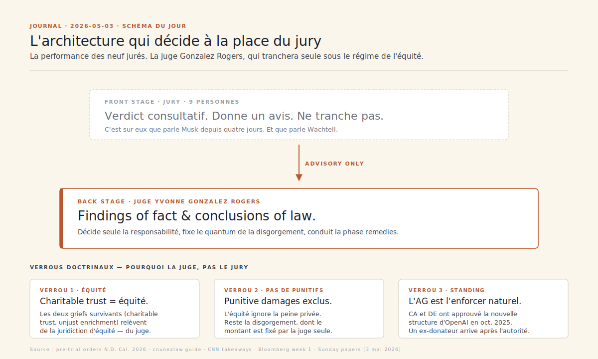
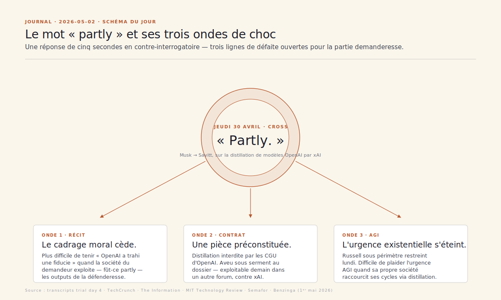

# Journal · Procès Musk v. Altman

Tenu à partir du 1ᵉʳ mai 2026, dans le sillage du dossier de veille publié le 27 avril 2026 (jour de l'ouverture du procès à Oakland devant la juge Yvonne Gonzalez Rogers).

**Format.** Une entrée par jour, datée `YYYY-MM-DD`. Trois à six puces factuelles (chaque fait sourcé inline), puis une phrase d'analyse éditoriale. En l'absence de mouvement procédural notable, l'entrée reste brève et signale ce qui se prépare. Les dates suivent l'heure de la côte ouest des États-Unis (Oakland, fuseau de la cour).

— Mathieu Guglielmino · publié à titre personnel · format co-écrit avec l'aide d'une IA

---

## 2026-05-03 — « Advisory only. » Le détail procédural qui pèse plus que le « partly »

**Exec sum**
- **Pas d'audience aujourd'hui** (dimanche, prétoire fermé) ; reprise lundi 4 mai à 09h00 PT à Oakland avec la suite du témoignage de Jared Birchall, puis ouverture vraisemblable de Stuart Russell sous périmètre restreint ([CNBC, 2 mai 2026](https://www.cnbc.com/2026/05/02/musk-testimony-dominated-first-week-musk-v-altman-trial-in-oakland.html)).
- Les Sunday papers convergent sur une lecture commune : **la première semaine s'est jouée à charge contre Musk lui-même**, plus que contre OpenAI ([Washington Post, 2 mai 2026](https://www.washingtonpost.com/technology/2026/05/02/musk-altman-openai-trial/) ; [Bloomberg, 2 mai 2026](https://www.bloomberg.com/news/articles/2026-05-02/musk-s-trial-against-openai-hits-some-rough-spots-in-first-week) ; [DNyuz, 2 mai 2026](https://dnyuz.com/2026/05/02/elon-musk-went-to-court-the-judge-wasnt-amused/)).
- Rappel doctrinal majeur, presque ignoré dans la couverture du jour : **le jury n'est qu'« advisory »**. La juge Yvonne Gonzalez Rogers tranchera seule la responsabilité comme le quantum, parce que les deux griefs survivants — *breach of charitable trust*, *unjust enrichment* — relèvent de la juridiction d'équité, pas du droit ([cnunezlaw, 2026](https://www.cnunezlaw.com/law/musk-v-altman-a-plain-english-guide-to-the-federal-civil-case-over-openai-s-restructuring) ; [allaboutlawyer, 2026](https://allaboutlawyer.com/musk-vs-altman-openai-breach-charitable-trust-lawsuit/)).
- En conséquence, **les dommages punitifs sont exclus** (ils n'existent pas en équité) et **la disgorgement éventuelle sera fixée par la juge**, pas par les neuf jurés tirés au sort le 27 avril.
- Les AG de Californie et du Delaware ont signé **en octobre 2025 un accord avec OpenAI** approuvant la nouvelle structure sous conditions de gouvernance — ce qui fragilise déjà la légitimité d'un ex-donateur à invoquer la fiducie en lieu et place de l'autorité publique ([CNN, 30 avr. 2026](https://www.cnn.com/2026/04/30/tech/takeaways-elon-musk-openai-sam-altman-lawsuit)).

**Angle du jour — « Advisory only ». Le détail procédural qui pèse plus que le « partly » d'hier**

Hier, j'écrivais que le « *partly* » de Musk allait reconfigurer la lecture du procès parce qu'il fragilisait la cohérence narrative devant le jury. C'est vrai. Mais c'est partiel. Dimanche, en reprenant les Sunday papers à froid — Washington Post (« *the case is all about him* »), Bloomberg (« *rough spots in first week* »), CNN (« *which billionaires deserve the keys to the god machine?* »), DNyuz (« *the judge wasn't amused* ») — un autre fait apparaît, plus structurel, presque caché à force d'être technique : **le jury qui écoute Musk depuis quatre jours ne décide pas le procès**. Il rend un avis. La juge Gonzalez Rogers tranchera seule.

C'est écrit noir sur blanc dans les pre-trial orders : des 26 griefs déposés en 2024, deux survivent — *breach of charitable trust* et *unjust enrichment*. Tous deux sont des griefs en équité, pas en droit (*at law*). Or l'équité, c'est par construction du juge, pas du jury. Quand Musk a choisi, comme remède, la **disgorgement** des « *ill-gotten gains* » plutôt que des dommages-intérêts au sens classique, il s'est lui-même placé sous cette juridiction. Conséquence directe : les dommages punitifs sont **exclus** par construction (l'équité ne connaît pas la peine privée), et le quantum d'une disgorgement éventuelle est **fixé par la juge**, pas par les neuf jurés (cnunezlaw, 2026).

Gonzalez Rogers a tout de même demandé un jury, dit *advisory*. Elle a indiqué aux conseils en *pre-trial conference* qu'elle suivrait probablement leur avis. Mais elle n'y est pas tenue. Et la lecture combinée des décisions de janvier (rejet partiel de *summary judgment* sur la doctrine du *special interest*) et d'avril (limitation drastique du périmètre admissible de Stuart Russell, refus de toute référence au *catastrophic event* en plaidoirie) trace une carte rhétorique cohérente : **la juge a déjà filtré ce qui peut entrer dans la délibération, et ce qu'elle prendra elle-même au sérieux**. Le « *This is not a trial on the safety risks of artificial intelligence* » lancé jeudi n'est pas un *bon mot* : c'est une instruction de cadrage.

Trois conséquences, toutes désagréables pour la partie demanderesse.

**Un**, les quatre jours passés à parler au jury ont été, juridiquement parlant, une *audience secondaire*. Les répétitions de « *you can't just steal a charity* » sont une trace publique forte mais une trace doctrinale faible, parce que la juge n'a pas besoin du sentiment moral du jury pour décider. La théâtralisation du procès — qu'elle a explicitement réprimandée plusieurs fois cette semaine — coûte plus cher à Musk qu'à OpenAI : Musk avait besoin d'un jury qu'il puisse galvaniser, parce que c'est sa seule prise sur l'opinion publique en l'absence de prise doctrinale forte. Wachtell Lipton n'avait, lui, qu'à éviter les fausses notes — et a placé son « *partly* » au passage.

**Deux**, l'absence de punitifs vide une partie du chiffre symbolique de la procédure. Les 134 milliards évoqués par les avocats de Musk en janvier sont une borne haute calculée sur une base disgorgement + valorisation post-conversion ; ce ne sont pas des punitifs. Quel que soit le verdict consultatif, la juge choisira un quantum sous contrainte d'équité, c'est-à-dire **proportionné au préjudice évité ou à l'enrichissement constaté**, pas à l'effet dissuasif. Cela rend l'écart possible entre verdict du jury et décision finale potentiellement abyssal — et c'est un risque que la couverture grand public n'a pas digéré.

**Trois**, le verrou de standing reste posé. *Typically, it's up to the attorneys general to bring such a claim to enforce the charitable purposes*, rappelait un universitaire cité par CNN cette semaine. Or l'AG de Californie et celui du Delaware — les deux autorités naturelles — ont signé en octobre 2025 un accord avec OpenAI approuvant la nouvelle structure sous conditions. Que la doctrine du *special interest* ait survécu à la motion de janvier ne signifie pas qu'elle sera retenue au fond : un juge en équité peut très bien estimer qu'un donateur historique avec sa propre société concurrente n'est pas le bon *trustee* du bien commun qu'il invoque. Le « *partly* » d'hier nourrit exactement cette lecture.

Au total : la victoire de Musk au jury, si elle vient, sera nécessaire mais largement insuffisante. La ligne de fracture du procès n'est pas dans la salle d'audience telle que la presse la filme — elle est dans la chambre où Gonzalez Rogers rédigera ses *findings of fact and conclusions of law*. Toute la stratégie défense d'OpenAI consiste précisément à parler à cette chambre-là, par-dessus le jury.

**À suivre**
- Lundi 4 mai · 09h00 PT : Birchall continue, puis Russell devrait ouvrir sous périmètre restreint. Surveiller les *bench rulings* en cours d'audience : tout *finding* préliminaire que la juge formule pèsera plus que n'importe quel mouvement du jury.
- Mardi-mercredi : Brockman attendu (notice de 48 h émise jeudi). Premier témoin défense côté OpenAI à parler de la conversion de l'intérieur — celui qui peut désamorcer la lecture *charitable trust* directement devant la juge.

---

## 2026-05-02 — « Partly. » Le mot que xAI ne peut plus reprendre

**Exec sum**
- **Pas d'audience hier ni aujourd'hui** : la juge Yvonne Gonzalez Rogers a renvoyé le jury jeudi 30 avril en fin d'après-midi ; reprise lundi 4 mai à 09h00 PT ([CNBC, 30 avr. 2026](https://www.cnbc.com/2026/04/30/openai-trial-elon-musk-sam-altman-live-updates.html)).
- La presse de fin de semaine a convergé sur **un échange de cinq secondes en contre-interrogatoire jeudi** : William Savitt demande à Musk si xAI a utilisé des techniques de distillation sur les modèles d'OpenAI pour entraîner Grok ; Musk élude (« *Generally AI companies distill other AI companies* »), Savitt insiste, Musk : « ***Partly.*** » ([TechCrunch, 30 avr. 2026](https://techcrunch.com/2026/04/30/elon-musk-testifies-that-xai-trained-grok-on-openai-models/) ; [The Information, 1ᵉʳ mai 2026](https://www.theinformation.com/briefings/musk-says-xai-distilled-openais-models)).
- **La distillation est explicitement interdite par les conditions générales d'OpenAI** — interroger massivement un modèle pour reconstituer un dataset synthétique d'entraînement viole les *Terms of Use* maintenues depuis 2024 ([MIT Technology Review, 1ᵉʳ mai 2026](https://www.technologyreview.com/2026/05/01/1136800/musk-v-altman-week-1-musk-says-he-was-duped-warns-ai-could-kill-us-all-and-admits-that-xai-distills-openais-models/)).
- Aucune contre-demande déposée à ce stade dans le procès en cours, mais **l'admission constitue une pièce probante préconstituée** pour un futur litige *breach of contract* / *unjust enrichment* hors de cette enceinte ([Benzinga, 1ᵉʳ mai 2026](https://www.benzinga.com/markets/prediction-markets/26/04/52189236/elon-musk-admits-xai-partly-distilled-openai-models-what-do-prediction-markets-say-about-the-lawsuit)).
- Les marchés de prédiction ont bougé vendredi : la cote de victoire d'OpenAI sur le grief *charitable trust* s'est légèrement raffermie à la lecture des comptes-rendus de fin de semaine 1 ([Benzinga, 1ᵉʳ mai 2026](https://www.benzinga.com/markets/prediction-markets/26/04/52189236/elon-musk-admits-xai-partly-distilled-openai-models-what-do-prediction-markets-say-about-the-lawsuit)).

**Angle du jour — « Partly » : l'aveu qui retourne le procès, et que le week-end ne suffira pas à neutraliser**

Pendant quatre jours, le procès s'est déroulé sur le terrain choisi par Musk : l'origine charitable d'OpenAI, la fiducie trahie, le risque AGI, l'admiration mal placée pour Sam Altman. Jeudi 30 avril en fin de matinée, William Savitt — l'avocat d'OpenAI chez Wachtell Lipton — a déplacé le point d'application sans préavis. Pas de pièce nouvelle, pas d'expert, pas de témoin surprise : une question. *Has xAI used distillation techniques on OpenAI's models?* La réponse de Musk a tenté l'esquive de principe, puis a calé sur un mot : « *Partly.* » Cinq secondes. La séquence est documentée par TechCrunch et The Information le jour même, consolidée vendredi par MIT Technology Review et Semafor ([Semafor, 1ᵉʳ mai 2026](https://www.semafor.com/article/05/01/2026/elon-musk-admits-xai-distilled-openai-models)). Plusieurs personnes dans la salle auraient eu un soupir audible.

Trois choses changent à partir de ce mot, et aucune ne joue dans le sens de la partie demanderesse.

D'abord, **la cohérence rhétorique de la croisade**. Le procès est cadré par Steven Molo, l'avocat de Musk, autour d'un récit moral : OpenAI a trahi un pacte — la fondation à but non lucratif vouée à servir l'humanité — et Musk vient le faire reconnaître par un jury californien. Ce récit n'est pas qu'une stratégie ; c'est la condition de survie de l'angle *special interest doctrine* qui a passé la motion de *summary judgment* ([FindLaw, 2026](https://caselaw.findlaw.com/court/us-dis-crt-n-d-cal/118202562.html)). Dès lors qu'on apprend, depuis la barre, que la société du même demandeur exploite — fût-ce *partly* — les outputs des modèles qu'elle prétend défendre comme bien commun, l'asymétrie morale qui structure tout l'argumentaire se brouille. Savitt n'a pas eu besoin d'aller plus loin : la séquence ne quantifie rien et ne prouve rien sur le quantum, mais elle déplace le centre de gravité narratif de *« Altman a volé une charité »* vers *« deux concurrents règlent leurs comptes via le tribunal »*. C'est exactement la lecture que Wachtell pousse depuis l'*opening statement* ([KQED, 27 avr. 2026](https://www.kqed.org/news/12081916/are-elon-musk-and-openai-fighting-an-ai-arms-race-sam-altmans-lawyers-think-so)).

Ensuite, **l'ouverture d'un second front juridique**. La distillation n'est pas illégale en soi — c'est une technique d'entraînement standard dans l'industrie, comme Musk l'a fait valoir avant de céder. Mais les *Terms of Use* d'OpenAI interdisent explicitement l'usage des outputs de l'API ou des produits ChatGPT pour développer un modèle concurrent. Une admission en *open court* sous serment, devant jury, transforme un soupçon journalistique — les rumeurs sur Grok et la « contamination » par GPT circulent depuis 2024 — en élément à valeur probante préconstitué pour un futur litige *breach of contract* ou *unjust enrichment*. Aucune contre-demande n'est portée dans la procédure en cours, ce qui obéit à une logique tactique simple : Wachtell ne veut pas embrouiller le jury, il veut juste que le mot existe au dossier. La pièce sera utilisable demain dans un autre forum.

Enfin, **la fragilisation de l'attendu sur le risque catastrophique**. La juge Gonzalez Rogers a déjà restreint pré-procès le périmètre admissible de la déposition de Stuart Russell (UC Berkeley), qui doit ouvrir lundi : pas de chiffrage des probabilités d'extinction, pas de référence au *catastrophic event* en plaidoirie. Elle l'a redit jeudi avec une formule qui circule : *« This is not a trial on the safety risks of artificial intelligence »* ([MIT Technology Review, 1ᵉʳ mai 2026](https://www.technologyreview.com/2026/05/01/1136800/musk-v-altman-week-1-musk-says-he-was-duped-warns-ai-could-kill-us-all-and-admits-that-xai-distills-openais-models/)). Le « partly » de Musk vient confirmer cette ligne. Difficile de soutenir que le demandeur agit pour limiter l'accélération AGI quand sa propre société est en train de bénéficier de la course en raccourcissant ses cycles via la distillation. Russell pourra parler de gouvernance et de transparence ; l'argument *« il y a urgence existentielle »* ne tiendra pas avec un demandeur qui, lui, ne semble pas pressé de freiner.

Le calendrier ne pardonne pas : la défense d'OpenAI a maintenant 48 heures pour préparer la séquence Brockman (notice de témoignage déjà émise selon CNBC) et la phase d'experts. La partie demanderesse a 48 heures pour reconstruire un dispositif rhétorique qui absorbe le « partly » sans concéder le procès. À ce stade, la voie qui reste à Molo est de scinder soigneusement la personne morale (xAI Holdings) du *settlor* (Musk en propre) : l'admission porterait sur les pratiques commerciales de la société, pas sur l'intégrité de la donation 2015–2018. C'est techniquement défendable. C'est narrativement perdant.

**À suivre**
- Lundi 4 mai 09h00 PT : reprise du jury, suite Birchall (notamment sur le partage de coûts de sécurité avec Neuralink dans le bâtiment OpenAI, sujet entamé jeudi par Savitt) puis probable ouverture Stuart Russell sous périmètre restreint.
- Mardi-mercredi : créneau possible pour Greg Brockman (notice de 48 h émise jeudi 30 selon CNBC) — premier test de la doctrine *« mission protégée vs. course concurrentielle »* sur un témoin qui a vécu la conversion de l'intérieur.

---

## 2026-05-01 — Fin du témoignage Musk, Birchall à la barre, jury renvoyé tôt

- Jeudi 30 avril, **Elon Musk a clos son contre-interrogatoire après deux jours et demi à la barre**, conduit côté OpenAI par William Savitt (Wachtell Lipton) puis côté Microsoft par Russell Cohen ([CNBC, 30 avr. 2026](https://www.cnbc.com/2026/04/30/openai-trial-elon-musk-sam-altman-live-updates.html) ; [Local News Matters, 30 avr. 2026](https://localnewsmatters.org/2026/04/30/musk-v-altman-day-4-cross-exam-of-musk-ends-as-lawyers-press-his-timeline-motives/)).
- Confronté au *term sheet* de 2018 actant la sortie d'OpenAI vers une structure capped-profit, Musk a reconnu **n'avoir lu que les titres** et pas les clauses détaillées — un aveu que Savitt a opposé à la thèse d'une trahison consciemment subie ([NPR, 29 avr. 2026](https://www.npr.org/2026/04/29/nx-s1-5803566/musk-continued-his-testimony-from-yesterday-in-lawsuit-against-openai)).
- En *redirect*, Steven Molo a fait dire à Musk sa réponse la plus nette de la semaine : interrogé sur l'absence de fondation à but non lucratif dédiée à l'AGI sous son nom, il a répliqué *« I did. I created OpenAI. »* ([NBC News, 29 avr. 2026](https://www.nbcnews.com/tech/tech-news/elon-musk-testimony-day-three-sam-altman-openai-trial-rcna342967)).
- **Jared Birchall**, *family officer* de Musk via Excession LLC et dirigeant chez xAI et Neuralink, a pris la barre comme deuxième témoin de la partie demanderesse ; sa déposition initiale a porté sur la traçabilité des dons de Musk à OpenAI et sur les *donor-advised funds* (Vanguard, Fidelity) auxquels Bradley R. Wilson l'a fait revenir ([CNBC, 30 avr. 2026](https://www.cnbc.com/2026/04/30/openai-trial-elon-musk-sam-altman-live-updates.html)).
- **Incident pendant que le jury était hors prétoire** : Birchall a répondu à une question sur l'offre xAI pour OpenAI alors que l'objection d'OpenAI venait d'être accueillie — la juge Gonzalez Rogers a indiqué qu'elle statuera dans les prochains jours sur la suite à donner ([Let's Data Science, 30 avr. 2026](https://letsdatascience.com/news/birchall-answers-off-limits-question-during-musk-v-altman-tr-2341ac58)).
- **Pas d'audience aujourd'hui** : la juge a renvoyé le jury en fin d'après-midi jeudi, repoussant le début de la déposition de Stuart Russell (UC Berkeley, expert AI safety) à la reprise. La phase liabilité reste calée pour boucler vers le 21 mai ([CNBC, 30 avr. 2026](https://www.cnbc.com/2026/04/30/openai-trial-elon-musk-sam-altman-live-updates.html)).

*Première semaine déjà tranchée par un effet de cadrage : Musk-fondateur-trahi tient à condition de ne pas détailler ce qu'il a signé en 2018 — tout l'enjeu de la semaine 2 sera de savoir si Russell réussit à déplacer l'attention de la lecture des contrats vers le risque existentiel, et si la dérive de Birchall jeudi laisse une trace sur l'admissibilité de la séquence xAI–OpenAI.*
