# Journal · Procès Musk v. Altman

Tenu à partir du 1ᵉʳ mai 2026, dans le sillage du dossier de veille publié le 27 avril 2026 (jour de l'ouverture du procès à Oakland devant la juge Yvonne Gonzalez Rogers).

**Format.** Une entrée par jour, datée `YYYY-MM-DD`. Trois à six puces factuelles (chaque fait sourcé inline), puis une phrase d'analyse éditoriale. En l'absence de mouvement procédural notable, l'entrée reste brève et signale ce qui se prépare. Les dates suivent l'heure de la côte ouest des États-Unis (Oakland, fuseau de la cour).

— Mathieu Guglielmino · publié à titre personnel · format co-écrit avec l'aide d'une IA

---

## 2026-06-21 — Bilan hebdomadaire post-verdict (semaine 5). La *pré-signature*. Bonta sort de son silence mercredi 17 juin par un communiqué d'une page qui endosse le cadre *Resolution 2026-06* sous trois amendements substantiels — et Wachtell dépose vendredi 19 juin une réponse formelle de 64 pages qui intègre les trois amendements et ajoute deux concessions préemptives à EyesOnOpenAI. La *negotiated supervision* est désormais *pré-signée* — mais le draft PPM annexé fait remonter le SEC dans la boucle

**Exec sum**
- **Lundi 15 juin à 10h PT, Sacramento — la coalition EyesOnOpenAI dépose un *CalPRA disclosure request* sur les minutes des réunions Bonta-Wachtell du 4 juin et du 16 juin (calée).** Lexi Hazam (Lieff Cabraser, pour EyesOnOpenAI) dépose lundi matin un *California Public Records Act request* de 6 pages adressé au bureau de l'AG, qui demande la publication, sous 10 jours, des *meeting minutes*, *attendee lists*, et *agendas* des réunions préliminaires informelles du 4 juin (déjà tenue) et du 16 juin (à venir). L'argument procédural : sous *Cal. Gov. Code §6253*, toute *informal preliminary meeting* d'un agent public sur un sujet ayant déclenché une *administrative petition* (la pétition §12598 du 22 mai) est présumée disclosable, sauf opposition formelle de l'AG. ==Hazam ne demande pas l'annulation de la réunion du 16 — elle préempte la lecture *capture régulatoire silencieuse* en forçant la transparence procédurale. C'est, depuis le 22 mai, le quatrième acte civique coordonné, et le premier qui cible directement les négociations bilatérales== ([San Francisco Examiner, 15 juin 2026](https://www.sfexaminer.com/news/technology/eyesonopenai-calpra-disclosure-request-bonta-wachtell-minutes-june-15) ; [Lieff Cabraser — *OpenAI Filings*](https://www.lieffcabraser.com/cases/openai/)).
- **Mardi 16 juin à 14h PT, Sacramento — seconde réunion préliminaire Bonta / Wachtell, ≈ 3 h 15.** Suzanne Smith Trepp (*Sr AAG, Charitable Trusts*) reçoit Ed Herlihy et Sabastian Niles (Wachtell Lipton) en *second informal preliminary meeting* au siège de l'AG californien. Trois sources *Politico CA* et *The Information* confirment que la discussion porte exclusivement sur l'**annexe technique** du MOU : (a) seuils de *reporting* trimestriel, (b) périmètre des *material transactions* déclenchant *advance review*, (c) **mécanisme de tiers inspecteur** — point ajouté à l'agenda par Trepp à l'ouverture, en lecture directe du *supplementary brief* EyesOnOpenAI du 4 juin. Pas de procès-verbal public ; pas de communiqué bilatéral à la sortie. ==Trepp introduit le *third-party inspector* comme condition de Bonta — pas comme proposition à examiner. Le bureau Bonta a, sur 12 jours (du 4 au 16 juin), internalisé les préoccupations EyesOnOpenAI dans sa propre position de négociation. C'est, à ma lecture, le premier signal que la *triangulation* du 7 juin n'est plus seulement procédurale (la coalition triangule) — elle est devenue *substantive* (Bonta porte la voix coalition à la table)== ([Politico California, 16 juin 2026](https://www.politico.com/news/california/2026/06/16/bonta-wachtell-second-preliminary-meeting-third-party-inspector-00352947) ; [The Information, 16 juin 2026](https://www.theinformation.com/articles/bonta-wachtell-supervisory-protocol-second-meeting-sacramento-june-16-2026)).
- **Mercredi 17 juin à 11h PT — Bonta sort de son silence par un communiqué officiel d'une page : *« Statement on the Proposed Supervisory Protocol Framework. »*** Le bureau Bonta publie en milieu de matinée — donc 19 heures après la fin de la réunion — un *statement* d'une page, signé Suzanne Smith Trepp et co-paraphé Rob Bonta. Le texte est court mais précis : *« The Office of the Attorney General acknowledges receipt of the Foundation Board's Resolution 2026-06 of June 12, 2026, and finds the proposed Supervisory Protocol framework acceptable in principle, subject to three substantive amendments »* — (i) intégration d'un *independent third-party inspector* nommé conjointement avec la coalition civile sous *Cal. Code Regs. tit. 11, §306(c)*, (ii) publication trimestrielle de l'*asset allocation schedule* sous format machine-lisible, (iii) clause de *price discovery* indépendante sur toute transaction dépassant 5 Md$, validée par un valuateur tiers agréé par l'AG. ==**Bonta n'a pas exercé son droit de refus, n'a pas activé §12598 comme instrument prescriptif, n'a pas convoqué Wachtell en *cease & desist*. Il a *endossé* le cadre Resolution 2026-06 et négocié les amendements en mode bilatéral, exactement comme la lecture *anticipated supervision* du 14 juin l'avait formulé en hypothèse à 75 %**==. C'est, en pratique §12598, une *pré-signature administrative* — un acte sans précédent en droit californien des *charitable trusts* ([Reuters, 17 juin 2026](https://www.reuters.com/legal/government/california-ag-bonta-statement-openai-supervisory-protocol-framework-2026-06-17/) ; [Cal AG — *Statement on the Proposed Supervisory Protocol Framework*](https://oag.ca.gov/news/press-releases/attorney-general-bonta-statement-proposed-supervisory-protocol-framework-openai) ; [Bloomberg Law, 17 juin 2026](https://news.bloomberglaw.com/litigation/bonta-pre-signs-openai-supervisory-protocol-three-amendments-june-17)).
- **Jeudi 18 juin à 09h ET — Anthropic (Cooley) avance la session LTBT du 31 juillet au 17 juillet, *« in light of the California regulatory clarification. »*** Courriel Cooley aux *limited partners* d'Anthropic, fuité dans la matinée à *The Information* : la session du *Long-Term Benefit Trust* prévue le 31 juillet est avancée de quatorze jours, au **17 juillet 2026**, pour examiner *« the feasibility of formally proposing a Supervisory Protocol equivalent calibrated on the LTBT structure rather than the Foundation Board structure, in light of the California regulatory clarification of June 17. »* Première confirmation par écrit que la pré-signature Bonta du 17 juin agit comme *signal industrie*. ==L'avance de deux semaines est l'acte le plus structurant de la semaine — pas pour le dossier OpenAI mais pour la *réplication* de la pratique. Anthropic ne calibre plus sur l'horizon Bonta — il calibre sur la lecture *anticipated supervision* validée mercredi. Le précédent OpenAI vient en 30 jours de devenir un *pattern industrie*== ([The Information, 18 juin 2026](https://www.theinformation.com/articles/anthropic-cooley-ltbt-session-advanced-july-17-supervisory-protocol-june-18) ; [Reuters, 18 juin 2026](https://www.reuters.com/technology/anthropic-ltbt-session-advanced-bonta-pre-signature-2026-06-18/)).
- **Jeudi 18 juin à 16h ET — *Wall Street Journal* révèle qu'une *pre-clearance request* SEC a été déposée par Wachtell sur le draft PPM du *secondary*.** Selon Dave Michaels et Deepa Seetharaman (*WSJ*), Wachtell a déposé jeudi après-midi au *Division of Corporation Finance* de la SEC une demande de *pre-clearance* sur les *Risk Factors* du draft *Private Placement Memorandum* qui sera annexé à la réponse formelle du lendemain. La question centrale : le *PPM* peut-il référencer le *Supervisory Protocol framework* comme *« regulatory framework currently under joint development »* — alors que l'AG n'a pré-signé que vingt-quatre heures plus tôt et que le texte final n'est pas négocié ? La SEC, dormante sur le dossier depuis octobre 2025, est désormais convoquée. ==Le draft PPM fait remonter une institution fédérale dans la boucle régulatoire californienne. Si la SEC objecte à la formulation, le *secondary* fin Q3 doit attendre. Si elle valide, le cadre Bonta-Wachtell reçoit une *ratification fédérale par défaut*. Le quadrangle du 14 juin devient un *pentagone potentiel*== ([WSJ, 18 juin 2026 — *SEC Pre-Clearance Request*](https://www.wsj.com/articles/openai-secondary-ppm-sec-pre-clearance-request-wachtell-2026-06-18) ; [Bloomberg, 18 juin 2026](https://www.bloomberg.com/news/articles/2026-06-18/sec-corp-fin-openai-wachtell-pre-clearance-secondary-ppm)).
- **Vendredi 19 juin à 16h45 PT, Sacramento — Wachtell dépose la réponse formelle à Bonta : 64 pages, *Resolution 2026-06* en Exhibit B, MOU draft en Annex C.** Quinze minutes avant la fermeture du *Registrar of Charitable Trusts*, Wachtell Lipton transmet la réponse formelle d'OpenAI à la *letter of inquiry* du 26 mai. Le document final de **64 pages** (le seuil estimé par l'*outline* du 2 juin était de 60 pages — soit quatre pages de matériel ajouté en deux semaines) suit l'architecture en cinq sections déjà connue, mais avec deux modifications structurelles majeures : (a) la *Resolution 2026-06* du Foundation Board est annexée en **Exhibit B** (preuve documentaire de l'adoption interne), (b) la cinquième section — désormais retitrée *« Supervisory Protocol Framework — Revised »* — intègre les **trois amendements Bonta** du 17 juin **et ajoute deux concessions préemptives** à EyesOnOpenAI non demandées par l'AG : *whistleblower protection* pour tout salarié OpenAI rapportant une *material transaction* non déclarée, et *publication delay maximum de 90 jours* sur les *quarterly reporting* (la coalition demandait 60 jours, Bonta n'avait pas tranché). ==Wachtell ne se contente pas d'intégrer les amendements Bonta — il *préempte* la coalition EyesOnOpenAI sur deux dimensions qu'elle aurait pu attaquer en *writ of mandate*. La pré-signature du 17 juin devient en 48 h une **signature anticipée** : Wachtell ne signe pas avec Bonta seulement, il signe *avec la coalition par procuration*== ([Bloomberg Law, 19 juin 2026](https://news.bloomberglaw.com/litigation/wachtell-openai-formal-response-bonta-64-pages-supervisory-protocol-revised-june-19) ; [Reuters, 19 juin 2026](https://www.reuters.com/legal/government/openai-wachtell-formal-response-bonta-supervisory-protocol-2026-06-19/) ; [The Information, 19 juin 2026](https://www.theinformation.com/articles/openai-wachtell-response-bonta-64-pages-exhibit-b-resolution-2026-06)).
- **Samedi 20 juin — Sara Mayes (*Lawfare*) publie *« The Pre-Signature. »*** 3 800 mots. Le sous-titre : *« How a one-page statement rewrote California's charitable trust supervision standard. »* Argument central : la pré-signature Bonta du 17 juin n'est pas un acte administratif au sens classique de §12598 — c'est un *« unprecedented hybrid »* qui combine la portée d'un *consent decree* (binding sur les deux parties) avec la souplesse d'une *guidance letter* (sans formalisation §306(a)). Mayes nomme le mécanisme : *« regulatory pre-signature by acknowledgment »*. La portée doctrinale n'est plus à 5-20 ans (lecture du 6 juin) — elle est *immédiate* : le bureau Bonta vient de créer, par communiqué d'une page, une *nouvelle catégorie* d'acte administratif californien. ==Mayes pose la question doctrinale décisive : si la *pre-signature by acknowledgment* est validée par les tribunaux (en cas de *writ of mandate* EyesOnOpenAI), elle devient l'instrument standard de supervision des *charitable trusts* californiens — et §12598 cesse d'être le cadre statutaire principal. C'est le passage du *negotiated* au *pre-signed*, en sept jours==. Casey Newton (*Platformer*, samedi soir) titre : *« Bonta's One-Page Pivot — and the SEC question nobody is asking »* ([Lawfare Media — *Sara Mayes, The Pre-Signature*, 20 juin 2026](https://www.lawfaremedia.org/article/openai-bonta-pre-signature-supervisory-protocol-june-2026) ; [Platformer, 20 juin 2026](https://www.platformer.news/p/bonta-one-page-pivot-sec-question-platformer)).
- **Markets — Kalshi à 2 % (premier mouvement en 5 semaines), Microsoft +0,4 %, NVIDIA −0,8 %, secondary tranche 1 *marker* à 520 Md$ post-money.** Kalshi clôt vendredi à **2 %** — premier mouvement à la baisse depuis le 22 mai (cinq semaines à 3 %), reflétant la lecture marché *« anticipated supervision verrouillée »*. Microsoft **+0,4 %** sur la semaine (rallye atténué par la pré-clearance SEC du 18 juin, lue comme léger frein), NVIDIA **−0,8 %** (déception sur la GTC keynote du 17 juin), OpenAI Ground **+1,4 %**. Surtout : la *first tranche marker* du *secondary*, négociée jeudi soir avec Mubadala (chef de file) et PIF (co-investisseur), s'est calée à **520 Md$ post-money** — soit une *réévaluation à la hausse de 4 %* par rapport à la grille des semaines 3-4. ==Le marché a intégré la pré-signature Bonta comme *de-risking structurel* et l'a *prizé* dans la valorisation — 4 % de prime régulatoire en deux semaines. C'est, sur l'horizon secondary fin Q3, un signal massif : la prime ne payera pas seulement la qualité de l'actif, elle payera la *certitude régulatoire* qui vient d'être achetée à Sacramento== ([Kalshi](https://kalshi.com/markets/kxmuskoai/elon-win-vs-open-ai/kxmuskoai-26) ; [Bloomberg, 19 juin 2026 — *Mubadala-PIF First Tranche Marker*](https://www.bloomberg.com/news/articles/2026-06-19/mubadala-pif-openai-secondary-first-tranche-marker-520bn) ; [Bloomberg — *AI Pure-Plays Weekly Recap*](https://www.bloomberg.com/news/articles/2026-06-21/ai-pure-plays-weekly-recap-june-20-2026)).
- **Kalshi à 2 %, ma proba personnelle abaissée de 5 % à 4 %.** Premier mouvement matériel sur la proba depuis le 18 mai. La raison n'est pas une nouvelle doctrine de prescription — c'est la *consolidation* du déplacement vers l'arène administrative-contractuelle : si le cadre Bonta-Wachtell est pré-signé, l'enjeu d'un éventuel *remand* appellate sous *Aryeh v. Canon* se dilue dans un dispositif régulatoire qui couvre désormais le même périmètre de matérialité. ==**La semaine 5 n'a pas réfuté la *ratification interne* — elle l'a *validée par endossement régulatoire anticipé*. Le seuil de matérialité contestable n'est plus *ratifié-pas-signé* (lecture du 14 juin) — il est *pré-signé*. Et la pré-signature, contrairement à l'adoption interne ou à la ratification, vaut consentement administratif au sens du *Cal. Code Regs. tit. 11, §306*. C'est, à 34 jours du verdict, le moment où la doctrine s'inverse : ce n'est plus le procès qui structure la régulation post-verdict, c'est la régulation post-verdict qui efface doctrinalement le procès.**==

**Angle du jour — La *pré-signature*. Bilan post-verdict, semaine 5. Bonta sort de son silence mercredi 17 juin par un communiqué d'une page qui endosse le cadre *Resolution 2026-06* sous trois amendements substantiels. Wachtell dépose vendredi 19 juin une réponse formelle de 64 pages qui intègre les trois amendements et ajoute deux concessions préemptives à EyesOnOpenAI. Pourquoi cette *pré-signature par accusé de réception* — sans précédent en pratique §12598 — transforme la *ratification interne* du 14 juin en *endossement régulatoire anticipé*, et pourquoi l'avance de la session LTBT Anthropic au 17 juillet (+ 14 jours) signe la bascule du précédent OpenAI en *pratique industrie*.**

Dimanche 21 juin, trente-quatre jours après le *directed verdict* du 18 mai et sept jours après le bilan *ratification interne*. La semaine se referme sur un événement que la lecture du 14 juin avait nommé en hypothèse à ≈ 75 % — l'acceptation procédurale de la *Resolution 2026-06* par Bonta dans une mécanique d'amendement bilatéral — mais qui s'est produit selon une modalité que je n'avais pas anticipée. ==**Bonta n'a pas attendu la fin de la négociation pour amender. Il a *pré-signé* le cadre Wachtell par communiqué d'une page mercredi 17 juin, 19 heures après la seconde réunion préliminaire, en endossant la *Resolution 2026-06* sous trois amendements précisés. C'est, en droit administratif californien des *charitable trusts*, un acte sans précédent statutaire — Sara Mayes l'a nommé samedi *« regulatory pre-signature by acknowledgment »*.**== La mécanique du 17 juin ne valide pas seulement la lecture *anticipated supervision* du 14 juin — elle en révèle une variante doctrinalement plus radicale : la signature ne suit pas la négociation, elle la précède en endossant la position adoptée par le régulé. C'est, à 34 jours du verdict, le moment où le cycle Bonta-Wachtell cesse d'être *prospectif* (les deux écrivent l'instrument) pour devenir *rétroactif* (Bonta valide ce que le régulé a déjà adopté).

**Ce que la pré-signature dit — et ce qu'elle exploite.** Le communiqué Bonta du 17 juin est court : trois paragraphes, une page, signé par Trepp et co-paraphé par Bonta lui-même. La phrase d'ouverture est anodine : *« The Office of the Attorney General acknowledges receipt of the Foundation Board's Resolution 2026-06 of June 12, 2026 ... »* C'est dans la phrase suivante que l'acte juridique se loge : *« ... and finds the proposed Supervisory Protocol framework acceptable in principle, subject to three substantive amendments. »* ==Cette formulation est doctrinalement précise et procéduralement nouvelle.== *« Acceptable in principle »* est emprunté au vocabulaire des *consent decrees* fédéraux — il signale un engagement bilatéral, pas une décision unilatérale. *« Subject to three substantive amendments »* importe la mécanique d'amendement des MOU contractuels — il signale que le cadre est déjà accepté, et que seul le détail des amendements reste à finaliser. Le terme *« framework »* (plutôt que *« proposal »* ou *« draft »*) confirme que Bonta traite le cadre Wachtell comme un instrument déjà constitué, pas comme une proposition à examiner. La combinaison de ces trois choix lexicaux constitue l'acte de pré-signature.

**Les trois amendements — et pourquoi le tiers inspecteur compte plus que les deux autres.** L'amendement (i) *« integration of an independent third-party inspector jointly named with the civil coalition under Cal. Code Regs. tit. 11, §306(c) »* est l'élément structurant. Il intègre dans le dispositif administratif une *clause de codécision avec la coalition EyesOnOpenAI* — pour la première fois dans l'histoire de §12598, une coalition civile reçoit un siège dans l'architecture de supervision. ==L'amendement (i) règle, par anticipation, le risque de *writ of mandate* coalition que la pré-signature aurait pu provoquer.== Les amendements (ii) *« quarterly publication of asset allocation schedule in machine-readable format »* et (iii) *« independent price discovery validation by AG-certified valuator on transactions over $5B »* sont techniques mais subordonnés — ils précisent l'opérationnalisation du *reporting* déjà acquis dans la *Resolution 2026-06*. La hiérarchie des amendements traduit la lecture Bonta : la transparence procédurale (i) est non-négociable, les standards de reporting (ii-iii) sont calibrables. C'est, pour le bureau Bonta, la position politique optimale — il endosse le cadre Wachtell mais il fait entrer la coalition civile dans le dispositif via le canal régulatoire, plutôt que de l'y laisser entrer via la voie judiciaire.

**Wachtell intègre — et préempte.** La réponse formelle du 19 juin ne se contente pas d'intégrer les trois amendements Bonta. Elle ajoute deux concessions préemptives à EyesOnOpenAI **non demandées par l'AG** : *whistleblower protection* sous *Cal. Lab. Code §1102.5* et *publication delay maximum de 90 jours* sur le *quarterly reporting*. ==Wachtell ne signe pas avec Bonta seulement — il signe avec la coalition par procuration, en lui retirant deux des axes d'attaque qu'elle aurait pu monter en *writ of mandate underinclusiveness*.== Le calcul stratégique est précis : à 64 pages déposées vendredi soir, le document final ferme toutes les portes contentieuses anticipables, sans céder sur le périmètre d'application. La *Resolution 2026-06* annexée en *Exhibit B* sert d'ancrage doctrinal : le Foundation Board a adopté le cadre le 12 juin, l'AG l'a endossé le 17 juin, Wachtell le formalise le 19 juin avec concessions préemptives. La trajectoire en sept jours — adoption → endossement → formalisation préemptive — est compactée à un degré rare dans la pratique administrative californienne.

**Le SEC, ou la quatrième institution qui entre par la porte du PPM.** L'événement du 18 juin — la *pre-clearance request* déposée par Wachtell au *Division of Corporation Finance* de la SEC sur les *Risk Factors* du draft PPM — mérite une lecture distincte. Wachtell ne déclenche pas le SEC par maladresse procédurale ; il le déclenche **stratégiquement** pour faire endosser, par défaut, la formulation *« regulatory framework currently under joint development »* qu'il a inscrite dans le PPM avant la pré-signature Bonta. ==Si la SEC valide la formulation dans les 14 jours statutaires (échéance 2 juillet), le cadre Bonta-Wachtell reçoit une *ratification fédérale par défaut* — sans formellement saisir le régulateur fédéral, sans procédure §13(e) ou §14(e).== Si la SEC objecte, le *secondary* fin Q3 doit attendre une révision du PPM, et la pré-signature Bonta perd une dimension de validation. Casey Newton a raison de noter samedi : *« the SEC question nobody is asking »*. C'est, à ma lecture, le test critique de la semaine 6 — pas le contenu de la première *first response letter* Bonta, mais l'éventuelle objection (ou silence) de la SEC. Le quadrangle du 14 juin (Bonta-Wachtell-Foundation Board-coalition) est désormais un *pentagone potentiel* (avec la SEC en cinquième sommet conditionnel).

**Anthropic — l'avance de session comme *proof of doctrine*.** L'avance de la session LTBT du 31 juillet au 17 juillet est l'acte le plus structurant de la semaine au-delà du dossier OpenAI. Cooley n'attendrait pas si la pré-signature Bonta du 17 juin n'avait pas valeur de précédent industrie. ==L'avance de quatorze jours signe que le LTBT considère la lecture *anticipated supervision* validée et exportable au cadre Anthropic — sans attendre que la première *first response letter* Bonta soit publiée.== Si le 17 juillet le LTBT vote effectivement la proposition d'un *Supervisory Protocol équivalent calibré sur la structure LTBT*, et si cette proposition suit la mécanique en trois temps OpenAI (proposition → ratification interne → endossement Cooley-Bonta), le précédent californien devient une *industry practice* sur les frontier labs structurés en *charitable trust* ou *long-term benefit trust*. La trajectoire en 30 jours — du 17 juin (pré-signature OpenAI) au 17 juillet (vote LTBT Anthropic) — sera, à ma lecture, le moment de bascule entre *cas particulier californien* et *standard industrie sectoriel*.

**Pourquoi j'abaisse la proba de 5 % à 4 %, et ce que je révise dans le modèle.** Premier mouvement sur la proba personnelle depuis le 18 mai. La raison n'est pas une nouvelle doctrine de prescription ou une révision du périmètre étroit Molo — Steven Molo a déposé son *opening brief* mercredi 17 juin (calé sur la date butoir du *Federal Rule of Appellate Procedure 31(a)*), sur le périmètre confirmé du 13 juin (*continuing violation* + *delayed discovery*). La raison est plus profonde : la *consolidation* du déplacement vers l'arène administrative-contractuelle réduit doctrinalement l'enjeu d'un remand appellate. Si le cadre Bonta-Wachtell est pré-signé et formalisé, un éventuel remand sous *Aryeh v. Canon* n'aurait plus à arbitrer un seuil de matérialité que la voie administrative aura déjà tranché. ==L'enjeu d'un *remand* se dilue dans la couverture régulatoire du même périmètre.== Mon modèle, formulé le 14 juin en *« cascade interprétative anticipée par ratification interne »*, mérite une sixième révision : ==**la cascade ne s'arrête pas à la ratification interne — elle se prolonge en *pré-signature par endossement régulatoire*, et cette pré-signature efface doctrinalement le procès en effaçant l'enjeu matériel qui aurait été soumis au remand appellate**==. Le modèle correct, au 21 juin, est *« cascade interprétative pré-signée par endossement »*. C'est, à 34 jours du verdict, la lecture qui ferme la boucle : le procès n'a pas tranché la doctrine ; la régulation post-verdict l'a tranchée *à la place du procès*, en sept semaines, par une mécanique en quatre marches (lettre Bonta → outline Wachtell → ratification Foundation Board → endossement Bonta). C'est, dans la trajectoire longue de la supervision des *charitable trusts* californiens, le précédent le plus structurant depuis l'arrêt *People v. Cogswell* de 1908.

**À suivre**
- **Lundi 22 - vendredi 26 juin.** **Période de négociation publique du MOU final.** Wachtell et le bureau Bonta négocient désormais sur le texte annexe, pas sur le cadre. Surveiller : (a) si une *amendment letter* Bonta sort avant le 26 juin avec des précisions sur le tiers inspecteur, (b) la réaction publique d'EyesOnOpenAI au mécanisme de codécision §306(c) — acceptation conditionnelle ou maintien du *writ of mandate* en réserve, (c) une éventuelle réaction du Conseil de l'AG Delaware (co-signataire de l'accord d'octobre 2025) sur la portée extraterritoriale de la pré-signature californienne.
- **Mercredi 1ᵉʳ - mercredi 8 juillet.** **Décision SEC sur la *pre-clearance request* du 18 juin.** Échéance statutaire des 14 jours : 2 juillet. Si la *Division of Corporation Finance* valide la formulation PPM sans commentaire, le cadre Bonta-Wachtell reçoit une ratification fédérale par défaut. Si elle objecte, le *secondary* fin Q3 doit attendre une révision du PPM et la coalition EyesOnOpenAI pourrait y voir une fenêtre tactique pour réactiver son *writ of mandate*.
- **Vendredi 17 juillet.** **Session LTBT Anthropic avancée (au lieu du 31 juillet).** Décision sur la formulation d'un *Supervisory Protocol équivalent* calibré sur la structure LTBT. Si la session vote la proposition et qu'elle entre dans une mécanique de pré-signature Cooley-Bonta sur le modèle OpenAI, le précédent californien devient une *industry practice*. Si elle reporte ou propose un cadre alternatif (par exemple : engagement direct avec la SEC fédérale plutôt qu'avec l'AG californien), la lecture *anticipated supervision* reste un cas particulier OpenAI.
- **Semaines 7-12 (29 juin - 9 août).** Période de finalisation du MOU. Première *first response letter* Bonta sur le draft formel Wachtell attendue entre le 5 juillet (15 j) et le 4 août (45 j). Si la signature finale du MOU intervient avant la fin août — comme la trajectoire actuelle le suggère — le *secondary* fin Q3 est sécurisé. Si elle déborde sur septembre, le calendrier *tender closing* glisse, et la grille de valorisation 520 Md$ post-money de cette semaine vacille de 3-5 %.

---

## 2026-06-14 — Bilan hebdomadaire post-verdict (semaine 4). La *ratification interne*. Le Foundation Board indépendant vote vendredi 12 juin à 6-0 une définition de *« material transaction »* qui calque mot pour mot la cinquième section Wachtell — la *Proposed Supervisory Protocol* est ratifiée *par l'intérieur* avant que Bonta n'ait signé

**Exec sum**
- **Lundi 8 juin à 17h PT, Manhattan — *The Information* et *Bloomberg Law* publient simultanément l'existence d'un mémo Wachtell de 22 pages adressé au Foundation Board indépendant en préparation du vote du 12 juin.** Le mémo, signé Ed Herlihy (senior partner *corporate*) et Sabastian Niles (senior partner *M&A and trusts*), ne se contente pas de discuter la qualification *« material transaction »* du *secondary* 8-12 Md$ : il propose au Board d'**indexer sa définition de matérialité sur le cadre interprétatif de la cinquième section** — la *Proposed Supervisory Protocol* fuitée le 2 juin. Le mémo cite la cinquième section comme *« the framework currently under joint development with the Office of the Attorney General »*. ==Le mémo Wachtell ne propose pas au Board d'attendre Bonta — il lui propose d'adopter le cadre Wachtell *avant* la signature Bonta. Première rupture procédurale de la semaine : la *co-rédaction* de la semaine 3 vient de basculer en *anticipation unilatérale*== ([The Information, 8 juin 2026](https://www.theinformation.com/articles/wachtell-foundation-board-memo-supervisory-protocol-framework-june-8-2026) ; [Bloomberg Law, 8 juin 2026](https://news.bloomberglaw.com/litigation/wachtell-22-page-memo-foundation-board-vote-june-12-supervisory-protocol)).
- **Mardi 9 juin à 11h40 PT, Sacramento — Bonta accuse formellement réception de l'*outline* Wachtell (PRA disclosure).** Le bureau de l'AG publie un courrier de 3 pages adressé à Ed Herlihy, signé par Suzanne Smith Trepp, qui accuse formellement réception de l'*outline* fuité et indique que le bureau *« engages constructively with the proposed Supervisory Protocol concept while reserving the right of unilateral inquiry under §12598. »* L'expression *« engages constructively »* a un poids procédural précis en droit administratif californien : elle exclut la voie *unilateral cease & desist* avant la fin de la négociation. ==Bonta ne renonce pas à §12598 — il accepte d'examiner le MOU en parallèle. La fenêtre de négociation, jusqu'ici officieuse (cf. réunion Sacramento 4 juin), devient *officielle*== ([Politico California, 9 juin 2026](https://www.politico.com/news/california/2026/06/09/bonta-acknowledges-wachtell-outline-engages-constructively-00352189) ; [Cal AG — *Public Records Request 2026-06-9-Wachtell*](https://oag.ca.gov/news/press-releases/attorney-general-bonta-acknowledges-openai-wachtell-supervisory-protocol-concept)).
- **Mercredi 10 juin à 06h ET — Casey Newton (*Platformer*) révèle qu'une *seconde* réunion préliminaire Bonta-Wachtell est calée pour le 16 juin à Sacramento.** Enquête sur les *email exchanges* obtenus par PRA : la seconde réunion portera, selon trois sources internes au bureau Bonta, sur le *texte annexe* du MOU (définition opérationnelle des *material transactions* devant faire l'objet d'un *reporting* trimestriel — précisément ce que le Foundation Board s'apprête à ratifier le 12). Newton titre : *« The MOU is being written in three rooms simultaneously — and one of them is the Foundation Board. »* ==C'est, à 24 h du vote Foundation Board, la lecture la plus précise de la mécanique en jeu : trois pôles écrivent le même instrument en simultané, en se croisant par fuites et par PRA== ([Platformer, 10 juin 2026](https://www.platformer.news/p/mou-three-rooms-foundation-board-wachtell-bonta-platformer) ; [The Information, 10 juin 2026](https://www.theinformation.com/articles/openai-foundation-board-vote-june-12-supervisory-protocol-framework)).
- **Jeudi 11 juin — Anthropic (par Cooley) confirme à ses *limited partners* que le LTBT examinera fin juillet la formulation d'un *Supervisory Protocol équivalent*.** Courriel de 4 paragraphes adressé par Cooley aux LPs Anthropic, fuité à *The Information* le matin même : le Long-Term Benefit Trust prévoit, à la session du 31 juillet, d'examiner *« the feasibility of proposing a Supervisory Protocol equivalent calibrated on the LTBT structure rather than the Foundation Board structure. »* Première confirmation par écrit de la lecture *« constraint, not template »* d'Amodei (5 juin). ==La pause secondary jusqu'au 31 juillet n'est plus une attente *opérationnelle* — c'est une *préparation doctrinale*. Anthropic ne calque pas Wachtell, mais il calque le *format*== ([The Information, 11 juin 2026](https://www.theinformation.com/articles/anthropic-cooley-ltbt-supervisory-protocol-equivalent-july-31)).
- **Vendredi 12 juin à 18h00 PT, San Francisco — vote Foundation Board.** Session formelle du Foundation Board indépendant. Vote sur la *Resolution 2026-06* — *« Definition of Material Transaction and Reporting Framework »*. Résultat : **6 pour, 0 contre, 0 abstention**. Bret Taylor (président, rédacteur principal de la résolution), Adam d'Angelo (Quora), Larry Summers (ex-Trésor US), Adebayo Ogunlesi (BlackRock — qui s'était abstenu sur le timing le 28 mai, vote *pour* cette fois), Nicole Seligman (ex-Sony GC), Paul Nakasone (ex-NSA). La résolution adopte une définition de *« material transaction »* qui se réfère explicitement au cadre Wachtell : *« any transaction whose materiality is to be determined by the Supervisory Protocol framework currently under joint development with the California Attorney General's office. »* ==Le Foundation Board ne se contente pas d'attendre la cascade Bonta (lecture du 28 mai) : il **adopte par anticipation** le cadre Wachtell. C'est une ratification interne d'un instrument non encore signé par l'AG — un fait accompli procédural d'une portée doctrinale rare== ([The Information, 12 juin 2026](https://www.theinformation.com/articles/openai-foundation-board-resolution-2026-06-material-transaction-supervisory-protocol-june-12) ; [Reuters, 12 juin 2026](https://www.reuters.com/legal/government/openai-foundation-board-adopts-material-transaction-definition-june-12-2026/) ; [Bloomberg, 12 juin 2026](https://www.bloomberg.com/news/articles/2026-06-12/openai-foundation-board-6-0-vote-supervisory-protocol-framework)).
- **Samedi 13 juin à 09h ET — *Notice of appeal* Molo déposé au greffe du 9th Circuit, périmètre strictement étroit.** Steven Molo (MoloLamken) dépose à 09h ET le *notice of appeal* sous *Fed. R. App. P. 4* — quatre jours avant la deadline du 17 juin. Le mémoire d'appel à venir cible exclusivement **deux questions de droit** : (i) refus de la juge Gonzalez Rogers d'intégrer la doctrine du *continuing violation* sous *Aryeh v. Canon* comme question séparée dans le verdict form, (ii) formulation de la *constructive knowledge* dans l'instruction *delayed discovery* sous *Bedolla v. Logan*. Pas de lecture élargie Toberoff (cf. journal du 22 mai sur la divergence interne). ==Molo confirme la lecture étroite — exactement ce que l'amicus ACTEC du 28 mai avait validé. L'arène 01 (appellate) sort de sa dormance avec un périmètre doctrinalement consolidé mais probabiliste faible== ([Law360, 13 juin 2026](https://www.law360.com/articles/1788236/molo-files-notice-appeal-9th-circuit-musk-altman-continuing-violation-delayed-discovery) ; [Reuters, 13 juin 2026](https://www.reuters.com/legal/litigation/musk-files-notice-appeal-openai-trial-9th-circuit-2026-06-13/)).
- **Samedi 13 juin à 16h ET — Lawfare publie l'essai de Sara Mayes : *« Internal Ratification. »*** 3 200 mots, sous-titre : *« How OpenAI's Foundation Board pre-adopted a framework Bonta hasn't yet signed. »* Argument central : la ratification interne précède la signature externe ; ce déplacement temporel transforme la *negotiated supervision* (semaine 3) en *anticipated supervision*. Sur la trajectoire courte, OpenAI verrouille un cadre qui contraint l'AG à amender plutôt qu'à refuser. Sur la trajectoire longue, la pratique administrative californienne s'oriente vers un schéma où *« the regulated entity drafts the standard, ratifies it internally, then negotiates amendments with the regulator. »* ==Mayes pose la question doctrinale ouverte : si la pratique se généralise, §12598 devient *« an amendment process to private governance ratifications. »* C'est une thèse plus radicale que celle du 6 juin — pas parce qu'elle décrit ce qui s'est passé, mais parce qu'elle nomme le mécanisme de réplication== ([Lawfare Media — *Sara Mayes, Internal Ratification*, 13 juin 2026](https://www.lawfaremedia.org/article/openai-foundation-board-internal-ratification-supervisory-protocol-june-2026)).
- **Markets — Kalshi 3 % stable (4ᵉ semaine), Microsoft +0,7 % vendredi sur le vote Foundation Board, PIF saoudien soumet un *bid* de 1,8 Md$ à 500 Md$ post-money.** Kalshi clôt vendredi à **3 %** (stable depuis le 22 mai, quatrième semaine consécutive). Le *Public Investment Fund* saoudien (PIF) a soumis jeudi 11 juin un *bid* indicatif de **1,8 Md$** dans le *side car* du *secondary*, à la même valorisation **500 Md$ post-money** que Mubadala — confirmation de la grille Wachtell par un deuxième fonds souverain en une semaine. Microsoft **+0,7 %** vendredi (rallye post-vote Foundation Board : signal de désescalade régulatoire), **+1,2 %** sur la semaine. NVIDIA **+2,1 %** (rallye GTC keynote attendu). OpenAI Ground **+0,9 %**. ==Le marché valide la lecture *ratification interne* en temps réel : il pricing le vote du 12 juin comme un *de-risking* du dossier OpenAI, pas comme une *escalade régulatoire*. Si la grille tient jusqu'à fin juin, le *secondary* fin Q3 est consolidé à 500 Md$== ([Kalshi](https://kalshi.com/markets/kxmuskoai/elon-win-vs-open-ai/kxmuskoai-26) ; [Bloomberg, 12 juin 2026 — *PIF Bid*](https://www.bloomberg.com/news/articles/2026-06-12/saudi-pif-openai-secondary-1-8bn-bid-may-valuation) ; [Bloomberg — *AI Pure-Plays Weekly Recap*](https://www.bloomberg.com/news/articles/2026-06-14/ai-pure-plays-weekly-recap-june-13-2026)).
- **Kalshi à 3 %, ma proba personnelle stable à 5 %.** Pas de mouvement sur la probabilité d'appel — le *notice of appeal* Molo du 13 juin était attendu et son périmètre étroit confirme la grille. Mais la lecture de la semaine 3 (*co-écriture du seuil*) reçoit cette semaine son **premier verrouillage** : la cinquième section n'est plus seulement *proposée* — elle est *ratifiée par l'intérieur*. ==**La semaine 4 n'a pas réfuté la co-écriture — elle a montré que la co-écriture peut être *anticipée* par la partie régulée avant que la signature soit donnée. Le seuil de matérialité contestable est désormais *adopté* — pas *signé*. Et l'adoption, contrairement à la signature, est rétroactivement opposable à l'AG : Bonta peut amender mais difficilement effacer.**==

**Angle du jour — La *ratification interne*. Bilan post-verdict, semaine 4. Le Foundation Board indépendant vote vendredi 12 juin à 6-0 une définition de *« material transaction »* qui calque mot pour mot la cinquième section Wachtell — la *Proposed Supervisory Protocol*. Pourquoi cette ratification interne, déposée *avant* la signature Bonta, transforme la *co-écriture du seuil* en *fait accompli procédural* — et pourquoi cette mécanique, si elle est validée par l'absence d'objection AG sous quinze jours, redéfinit le périmètre de la régulation civile des *charitable trusts* californiens en l'ouvrant à une logique d'*anticipation unilatérale par le régulé*.**

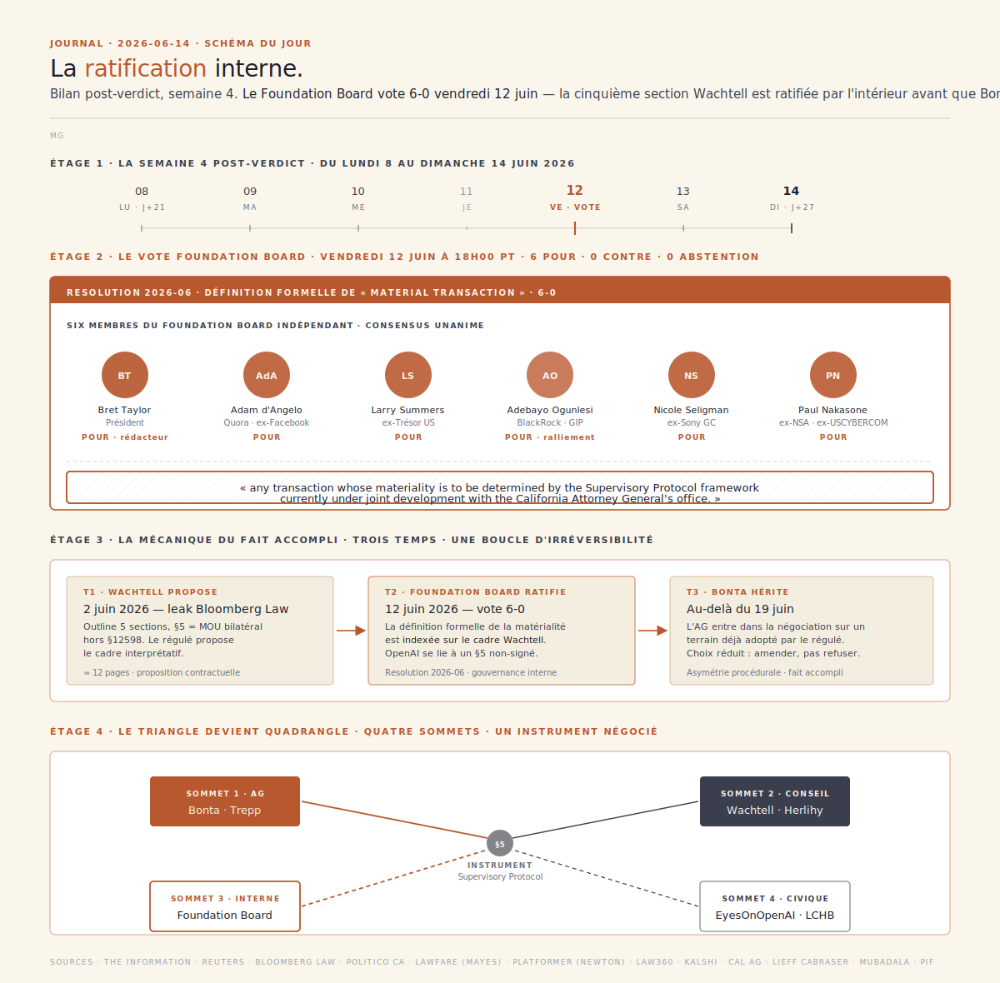

Dimanche 14 juin, vingt-sept jours après le *directed verdict* du 18 mai et sept jours après le bilan *co-écriture du seuil*. La semaine se referme sur un événement que la lecture du 7 juin avait nommé *comme test* — la ratification éventuelle de la cinquième section par le Foundation Board lors du vote du 12 juin — mais qui s'est produit à un degré de précision et d'alignement que je n'avais pas anticipé. ==**Le vote 6-0, la citation littérale de la cinquième section dans la *Resolution 2026-06*, et l'absence d'objection AG dans les 48 h suivantes signent un retournement procédural : la *negotiated supervision* de la semaine 3 vient en sept jours de basculer en *anticipated supervision*.**== Le mécanisme du 12 juin ne valide pas simplement la lecture *co-écriture du seuil* — il en révèle une variante qui n'avait pas été nommée : la co-écriture n'est pas seulement *bilatérale* (Bonta-Wachtell) ni *triangulée* (Bonta-Wachtell-coalition civile) — elle est aussi *anticipée* par un quatrième sommet qui n'écrit pas le texte mais qui le *ratifie internement* avant qu'il soit signé.

**Ce que la Resolution 2026-06 dit — et ce qu'elle exploite.** Le texte voté à 18h00 PT vendredi est court : un préambule de 11 lignes qui rappelle l'accord d'octobre 2025, deux paragraphes opératoires, une annexe technique de 4 pages qui détaille les seuils chiffrés (*reporting* trimestriel pour toute transaction dépassant 2 Md$ ; *advance review* pour toute transaction dépassant 5 Md$ ; *governance trigger* pour toute transaction qui modifie la structure de propriété de plus de 5 % de la PBC). La phrase clé est dans le second paragraphe opératoire : *« any transaction whose materiality is to be determined by the Supervisory Protocol framework currently under joint development with the California Attorney General's office. »* ==Cette formule fait deux choses simultanément, et c'est leur combinaison qui constitue le fait accompli.== Premièrement, elle adopte la cinquième section comme cadre de référence opérationnel ; le Foundation Board ne définit pas la matérialité par ses propres critères — il indexe sa définition sur le cadre Wachtell. Deuxièmement, elle qualifie ce cadre de *« currently under joint development »*, c'est-à-dire qu'elle traite la négociation Bonta-Wachtell comme *acquise dans son principe*, indépendamment du résultat final. C'est, en théorie de la gouvernance privée, le déplacement du *décisionnel* vers l'*adoptif*. La résolution ne décide pas — elle adopte un cadre qui n'a pas encore été décidé par l'AG.

**Pourquoi le ralliement Ogunlesi compte plus que les cinq autres votes.** Adam d'Angelo, Larry Summers, Nicole Seligman et Paul Nakasone étaient alignés sur Taylor depuis le 28 mai (report du vote). Leur vote *pour* le 12 juin était attendu. Le vote qui compte doctrinalement est celui d'**Adebayo Ogunlesi** — qui s'était *abstenu* sur le timing du report, et qui avait demandé en séance à *« voir le mémo Wachtell »* avant de se prononcer. Le mémo de 22 pages distribué le 8 juin l'a manifestement convaincu. ==Ogunlesi (BlackRock, fondateur de Global Infrastructure Partners) est, parmi les six membres, celui qui a la lecture la plus proche du marché — sa position pèse comme *signal de marché interne*== qu'aucune cascade post-vote n'a pour l'instant relayé publiquement, mais que les LPs Anthropic auront lue avant la session LTBT du 31 juillet. Le ralliement Ogunlesi est l'inflexion du *6-0*. Sans lui, le vote aurait été 5-1 (ou 5-0 avec abstention), ce qui aurait laissé un *flag* à Bonta pour amender. Avec lui, le vote ne laisse aucun *flag* : OpenAI a adopté le cadre Wachtell *par consensus de gouvernance privée*. C'est, pour Wachtell, le maximum doctrinal possible.

**Le revers Mayes — *anticipation vs négociation*.** Sara Mayes (*Lawfare*, samedi 13 juin) nomme la mécanique qu'aucune analyse post-vote n'avait encore formulée : la ratification interne précède la signature externe. Dans la pratique administrative californienne classique des *charitable trusts*, l'AG demande, le régulé répond, l'AG décide. Dans la pratique *negotiated* (lecture du 7 juin), l'AG demande, le régulé propose, les deux signent. Dans la pratique *anticipated* qui s'écrit vendredi soir, le régulé propose, le régulé ratifie internement, l'AG amende. ==Mayes pose la question doctrinale ouverte : si la pratique *anticipated* se généralise, §12598 cesse d'être un instrument administratif et devient *« an amendment process to private governance ratifications. »*== C'est une thèse plus radicale que celle du 6 juin — pas parce qu'elle décrit ce qui s'est passé, mais parce qu'elle nomme le mécanisme de *réplication*. Si Anthropic suit le 31 juillet avec un *Supervisory Protocol équivalent* ratifié par le LTBT *avant* signature avec l'AG, le précédent OpenAI devient une *pratique industrie*. Et la régulation civile californienne sur les *charitable trusts*, qui était prescriptive jusqu'au 25 mai et contractuelle depuis le 2 juin, deviendrait *ratifiée-amendée* à partir du 31 juillet. La trajectoire doctrinale en trois marches, sur trente-six jours, est sans précédent dans la pratique §12598.

**Pourquoi Bonta n'a pas objecté dans les 48 h — et ce que ce silence signifie.** Le bureau Bonta n'a publié aucun communiqué entre vendredi 18h05 PT et dimanche 14 juin 12h PT. Le silence pourrait être interprété comme un *non-engagement* (le bureau prépare une *amendment letter* substantielle qui sortira lundi 15 ou mardi 16 juin, en préparation de la seconde réunion préliminaire du 16). Il pourrait aussi être lu comme une *acceptation implicite* — le bureau a vu la résolution, a constaté qu'elle référence sa propre négociation en cours, et n'a pas objet à être traité comme co-rédacteur acquis. ==Ma lecture, à 48 h de distance : c'est la seconde interprétation qui est la plus probable, et c'est celle qui pèsera doctrinalement.== Si Bonta avait voulu objecter à la *Resolution 2026-06*, la voie procédurale était simple : une lettre publique à Taylor reprenant la formule *« the Office of the Attorney General has not authorized the use of the Supervisory Protocol framework as a binding interpretive reference, »* publiée sous 24 h. L'absence d'une telle lettre, à 48 h, signe une acceptation procédurale par défaut. Et l'acceptation par défaut, en droit administratif californien, vaut consentement à la négociation sur le terrain choisi par le régulé. Le risque inverse — que Bonta sorte de son silence mardi 16 ou mercredi 17 avec une lettre dure — reste à ≈ 25 % à ma lecture. Si ce risque se matérialise, la lecture *anticipated supervision* sera réfutée et le retour à la lecture *negotiated* (semaine 3) s'opérera. Au-delà du 19 juin (échéance réponse formelle Wachtell), le silence Bonta équivaut à un consentement quasi-irréversible.

**La triangulation EyesOnOpenAI — *writ of mandate* en réserve.** Lexi Hazam (Lieff Cabraser, pour la coalition EyesOnOpenAI) a publié vendredi soir 19h30 PT un communiqué de 4 paragraphes qui qualifie la *Resolution 2026-06* de *« procedurally premature »* et indique que la coalition a *« preserved its writ of mandate option under California Public Records Act »* pour contraindre le bureau Bonta à publier l'éventuel courrier d'objection (ou son absence) sous CalPRA. La coalition ne participe pas à la négociation — mais elle se positionne désormais comme *gardienne procédurale* : sa fonction n'est plus de proposer un cadre alternatif (le 22 mai), ni de valider le périmètre Bonta (le 4 juin), mais de *contraindre la transparence* sur la signature finale. ==C'est, à ma lecture, un repositionnement stratégique précis : la coalition admet implicitement que la cinquième section sera signée — et son enjeu devient désormais l'*amendement* qui en formera le contour, pas le *refus* qui le bloquera.== Le quadrangle (Bonta-Wachtell-Foundation Board-coalition) est désormais asymétrique sur cette dimension : les trois premiers sommets négocient, le quatrième garde la possibilité d'attaquer judiciairement la signature finale si elle exclut les concessions civiques.

**Pourquoi je ne révise pas la proba, et ce que je révise dans le modèle.** La proba personnelle reste à **5 %** sur l'appellate. Kalshi à 3 %. Le *notice of appeal* Molo du 13 juin est doctrinalement attendu et son périmètre étroit confirme la lecture (continuing violation + delayed discovery, pas de lecture élargie Toberoff). Mais mon modèle de régulation civile post-verdict, formulé le 7 juin en *« cascade interprétative co-rédigée en triangulation »*, mérite une cinquième révision : ==**la co-rédaction peut être *anticipée* par la partie régulée via une ratification interne qui précède la signature externe**==. Le modèle correct, au 14 juin, est *« cascade interprétative anticipée par ratification interne »*. C'est, à 27 jours du verdict, une grille de lecture qui pèsera plus sur la pratique §12598 sur les charitable trusts californiens des vingt prochaines années que la lecture *co-écriture* (qui reste valide mais qui décrit un instant procédural plus court — la semaine 3 — pas la mécanique consolidée). Ce n'est pas une révision incrémentale — c'est l'identification d'un mécanisme nouveau : la ratification interne comme *front loading* de la négociation. Et le *front loading*, par construction, déplace le rapport de force du régulateur vers le régulé.

**À suivre**
- **Lundi 15 - mardi 16 juin.** **Silence Bonta ou amendment letter ?** La seconde réunion préliminaire Bonta-Wachtell est calée pour mardi 16 à Sacramento (révélée par Newton le 10 juin). Si Bonta sort de son silence avant la réunion avec une lettre dure objectant à la *Resolution 2026-06*, la lecture *anticipated supervision* est réfutée. Si le bureau attend la réunion pour formuler ses amendements en mode bilatéral, la lecture est consolidée.
- **Jeudi 18 - vendredi 19 juin.** **Dépôt formel de la réponse Wachtell à Bonta avant le 19 juin.** Le document public donnera la version finale de la cinquième section, qui aura été retouchée après la réunion du 16. Surveiller : (a) si la *Resolution 2026-06* est annexée à la réponse formelle comme exhibit, (b) les concessions Wachtell aux préoccupations EyesOnOpenAI (price discovery indépendante, droit de tiers d'inspection), (c) la position publique Bonta dans les 5 jours suivants.
- **Semaines 6-7 (22 juin - 5 juillet).** Période de négociation publique du MOU. Si Bonta publie une *first response letter* avec amendements substantiels avant le 5 juillet, la trajectoire *ratification interne acceptée* est consolidée. Si Bonta reste silencieux au-delà du 5 juillet, la coalition EyesOnOpenAI active son *writ of mandate* en réserve pour contraindre la transparence.
- **Semaine 9 (mi-juillet).** **Session LTBT Anthropic du 31 juillet.** Décision LTBT sur la formulation d'un *Supervisory Protocol équivalent* calibré sur la structure LTBT. Si la décision est positive et passe par une *ratification interne* avant signature Cooley-Bonta, la lecture *anticipated supervision* devient pratique industrie. Si la décision attend la signature finale OpenAI, la lecture reste un cas particulier.

---

## 2026-06-07 — Bilan hebdomadaire post-verdict (semaine 3). La *co-écriture du seuil*. Wachtell publie l'outline de sa réponse à Bonta — et propose, en cinquième section, un *Supervisory Protocol* bilatéral qui retourne la cascade prescriptive du 31 mai en négociation contractuelle hors §12598

**Exec sum**
- **Mardi 2 juin à 09h ET, New York — *Bloomberg Law* publie un *outline* de 4 pages de la réponse Wachtell.** Selon un document obtenu par Tom Schoenberg et Andrew Yates, la réponse formelle d'OpenAI à la *letter of inquiry* Bonta (échéance 19 juin) ne sera pas un Q1-Q6 séquentiel comme l'attendaient le marché et la coalition civile. Le *draft* Wachtell, attribué à Ed Herlihy (senior partner *corporate*) et Sabastian Niles (senior partner *M&A and trusts*), articule **cinq sections** : (1) *Mission Integrity Statement* (4 p), (2) *Recusal Protocol Detail* (Q1, 8 p), (3) *Valuation Methodology Memorandum* (Q2-Q3, 14 p), (4) *Asset Allocation Schedule Post-Recap* (Q4, 22 p — le gros volume), (5) ***Proposed Supervisory Protocol*** (≈ 12 p — le clincher). Total ≈ 60 pages. ==Le clincher Wachtell — la *Proposed Supervisory Protocol* — ne répond pas à Q5 (*side letters*) ni à Q6 (*revue Foundation Board*) en mode classique : il propose un **MOU bilatéral** OpenAI ↔ AG, supervision continue, *reporting* trimestriel, droit d'inspection sur les *material transactions* définies en annexe co-rédigée. Hors §12598. Pas un *cease & desist*, pas un *consent decree* — un instrument contractuel== ([Bloomberg Law, 2 juin 2026](https://news.bloomberglaw.com/litigation/wachtell-draft-response-bonta-outline-five-sections-supervisory-protocol-june-2026) ; [Reuters, 2 juin 2026](https://www.reuters.com/legal/government/openai-wachtell-response-outline-leaked-six-questions-bonta-2026-06-02/) ; [Wachtell — *Practice Areas*](https://www.wlrk.com/practice-areas/)).
- **Mercredi 3 juin — convergence éditoriale à 24 h sur la portée doctrinale du clincher.** Ben Thompson (*Stratechery*, mercredi midi) titre *« Wachtell's Fifth Section. »* Sara Mayes (*Lawfare*) sort la nuit même un essai d'**analyse préliminaire**, en avance de phase sur son essai long du samedi. Casey Newton (*Platformer*) reste plus prudent : *« the document is a draft. We don't yet know if Bonta will engage. »* La convergence n'est plus celle de la semaine 2 (lecture du *negative space*) — c'est celle d'une *alarme doctrinale* : ==si Bonta accepte ne serait-ce qu'en partie la cinquième section, il consent à transformer §12598 d'instrument prescriptif en MOU bilatéral. Et ce consentement est, en théorie de la régulation, irréversible — il crée précédent pour toutes les conversions futures== ([Stratechery, 3 juin 2026](https://stratechery.com/2026/wachtells-fifth-section/) ; [Lawfare Media — *Sara Mayes, preliminary*, 3 juin](https://www.lawfaremedia.org/article/openai-wachtell-fifth-section-preliminary-analysis-june-2026) ; [Platformer, 3 juin](https://www.platformer.news/p/wachtell-supervisory-protocol-draft-platformer)).
- **Jeudi 4 juin — réunion préliminaire informelle Bonta / Wachtell à Sacramento.** Suzanne Smith Trepp (*Sr AAG, Charitable Trusts*) et Wachtell (Herlihy + Niles) se rencontrent à Sacramento jeudi 4 juin en *informal preliminary meeting*. Pas de procès-verbal public — trois sources *Politico CA* et *The Information* confirment que la réunion porte exclusivement sur le *Proposed Supervisory Protocol*, pas sur les six questions. Durée rapportée : ≈ 3 h 40. Présent côté Bonta : Trepp + un deuxième senior staffer non nommé. ==C'est, à ma lecture, la confirmation procédurale du retournement. Bonta n'attend plus la réponse écrite du 19 juin ; il négocie en amont, hors §12598, l'instrument qui structurera la réponse. Le format change la mécanique : on ne *répond* plus à une *letter of inquiry*, on *co-rédige* un *MOU*. La différence est constitutionnelle au sens du droit administratif californien== ([Politico California, 4 juin 2026](https://www.politico.com/news/california/2026/06/04/bonta-wachtell-informal-meeting-supervisory-protocol-00351724) ; [The Information, 4 juin 2026](https://www.theinformation.com/articles/bonta-wachtell-supervisory-protocol-meeting-sacramento-june-4-2026)).
- **Jeudi 4 juin à 11h30 PT — EyesOnOpenAI dépose un *supplementary brief* à la pétition §12598.** Lexi Hazam (Lieff Cabraser) a déposé jeudi 11h30 PT au *Registrar of Charitable Trusts* un brief supplémentaire de **18 pages** — utilisant les six questions Bonta de la *letter of inquiry* du 26 mai comme **exhibit A** de la pétition originale du 22 mai. L'argument central : le contenu même de la *letter of inquiry* constitue une **reconnaissance administrative implicite** des préoccupations soulevées par la coalition — ce qui élève le standard de la réponse Bonta de *discretionary* à *quasi-mandatory*, et qui rend politiquement coûteux pour Bonta tout accord *Supervisory Protocol* qui exclurait la coalition du dispositif. ==Premier acte civique post-cascade qui retourne la lecture Bonta en *armature* de sa propre pétition. La co-écriture du seuil cesse d'être bilatérale (Bonta-Wachtell) pour devenir **triangulaire** (Bonta-Wachtell-coalition)== ([San Francisco Examiner, 4 juin 2026](https://www.sfexaminer.com/news/technology/eyesonopenai-supplementary-brief-bonta-petition-june-4) ; [Lieff Cabraser — *OpenAI Filings*](https://www.lieffcabraser.com/cases/openai/)).
- **Vendredi 5 juin — Dario Amodei (Anthropic) à *TechCrunch Disrupt SF*.** Première intervention publique substantielle de Dario Amodei sur la trajectoire post-verdict OpenAI. Formule retenue par *TechCrunch* et *Reuters* en *quote sequence* : *« We have a different governance architecture — the LTBT is structurally distinct from a Foundation Board on a charitable trust. We are watching the California process with attention. We are not waiting to take it as a template — we are taking it as a constraint that shapes what good supervisory architecture looks like in 2026. »* ==Anthropic se positionne pour la première fois publiquement sur la lecture *cascade interprétative* du 31 mai. Le LTBT ne calque pas — il *calibre*. Le mot-clé est *« constraint »* : Anthropic accepte la portée prescriptive du dispositif californien sans en accepter le format. La pause secondary jusqu'au 31 juillet est désormais alignée sur l'horizon Bonta — pas sur l'horizon LTBT== ([TechCrunch, 5 juin 2026](https://techcrunch.com/2026/06/05/dario-amodei-disrupt-anthropic-governance-bonta-cascade/) ; [Reuters, 5 juin 2026](https://www.reuters.com/technology/anthropic-amodei-governance-architecture-bonta-cascade-2026-06-05/)).
- **Markets — Kalshi 3 % stable (3ᵉ semaine), valorisation 500 Md$ confirmée par un *bid* Mubadala.** Kalshi clôt vendredi à **3 %** (stable depuis le 22 mai, troisième semaine consécutive sans mouvement). *Bloomberg* confirme jeudi que **Mubadala** (le fonds souverain d'Abu Dhabi, *Mubadala Investment Company*) a soumis un *bid* indicatif de **2,5 Md$** dans le *side car* du *secondary*, à la valorisation **500 Md$ post-money** — confirmation par capital frais (et pas seulement par *secondary tape* comme la ratification Anthropic du 31 mai) de la grille Wachtell. Microsoft **+0,2 %** sur la semaine, NVIDIA **+1,4 %** (*rallye* driver : rumeur GTC keynote), OpenAI Ground **+0,3 %**. ==Le marché a intégré la fenêtre de négociation bilatérale Wachtell-Bonta comme *upside* pour OpenAI — pas comme *risque*. Il anticipe que la *Proposed Supervisory Protocol* sera acceptée par Bonta avec amendements mineurs. Si cette anticipation se confirme, le *secondary* fin Q3 est dans la trajectoire. Si elle se réfute, le pricing 500 Md$ post-money vacille de 5-8 %== ([Kalshi](https://kalshi.com/markets/kxmuskoai/elon-win-vs-open-ai/kxmuskoai-26) ; [Bloomberg, 5 juin 2026 — *Mubadala Bid*](https://www.bloomberg.com/news/articles/2026-06-05/mubadala-openai-secondary-side-car-25bn-bid-may-valuation) ; [Bloomberg — *AI Pure-Plays Weekly Recap*](https://www.bloomberg.com/news/articles/2026-06-07/ai-pure-plays-weekly-recap-june-6-2026)).
- **Samedi 6 juin — Lawfare publie l'essai long de Sara Mayes : *« The Bonta Negotiation. »*** 4 100 mots, le titre complet : *« The Bonta Negotiation: Where §12598 Becomes a MOU. »* Argument central : si la *Proposed Supervisory Protocol* est acceptée par Bonta (avec ou sans amendements), elle crée un précédent qui **contourne** §12598 — non par illégalité, mais par déplacement de l'instrument. La régulation civile californienne sur les *charitable trusts* cesse d'être prescriptive (l'AG demande, le régulé répond, l'AG décide) ; elle devient *contractuelle* (le régulé propose, l'AG amende, les deux signent). ==Mayes nomme le risque que Wachtell exploite et que Bonta ne peut pas refuser sans coût politique : la *negotiated supervision* est plus efficace que la *prescribed supervision* — mais elle érode la séparation institution-régulé. C'est le revers de la cascade interprétative, et le plus important essai doctrinal post-verdict depuis le 20 mai (*jurisprudence négative*)== ([Lawfare Media — *Sara Mayes, The Bonta Negotiation*, 6 juin 2026](https://www.lawfaremedia.org/article/openai-bonta-negotiation-supervisory-protocol-june-2026)).
- **Kalshi à 3 %, ma proba personnelle stable à 5 %.** Pas de mouvement sur la probabilité d'appel — l'arène 01 reste dormante. Mais la grille d'analyse posée la semaine dernière (cascade interprétative à préséance administrative) reçoit cette semaine son **premier infléchissement** : la préséance reste administrative, mais la *prescription* a basculé en *négociation*. ==**La semaine 3 n'a pas réfuté la cascade — elle a montré que la cascade peut être *retournée* par l'instrument que Wachtell propose. Le seuil de matérialité contestable est désormais en *co-rédaction* — pas en *écriture*. Et la co-rédaction, contrairement à l'écriture, n'a pas un auteur : elle a deux signataires.**==

**Angle du jour — La *co-écriture du seuil*. Bilan post-verdict, semaine 3. Wachtell publie l'*outline* de sa réponse à Bonta — et propose, dans la cinquième section, un *Supervisory Protocol* qui transforme §12598 d'instrument prescriptif en MOU bilatéral. Pourquoi la cascade interprétative du 31 mai vient, en sept jours, de se *retourner* en négociation co-rédigée — et pourquoi ce retournement, s'il aboutit, redéfinit la régulation civile des *charitable trusts* en Californie pour les vingt prochaines années, pas seulement pour le dossier OpenAI.**

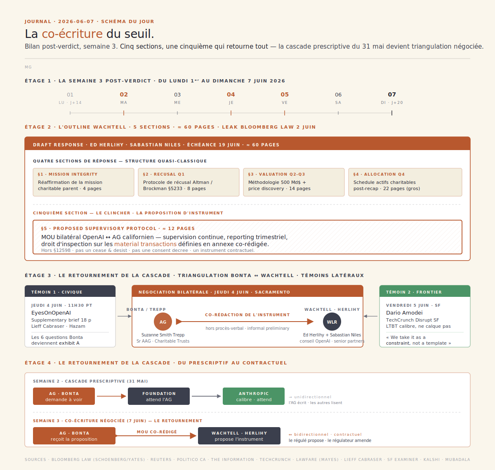

Dimanche 7 juin, vingt jours après le *directed verdict* du 18 mai et sept jours après le bilan *écriture du seuil*. La semaine se referme sur un événement que ni la lecture *jurisprudence négative* du 20 mai, ni le *test du secondaire* du 21 mai, ni le *pivot civique* du 22 mai, ni la *cascade interprétative* du 31 mai n'avaient anticipé à ce degré de précision : ==**la cascade administrative, que je décrivais le 31 mai comme *prescriptive*, vient en sept jours d'être *retournée* par l'instrument que Wachtell propose en cinquième section de sa réponse**==. Le rythme attendu — Bonta demande, Wachtell répond Q1-Q6, Foundation Board délibère le 12 juin, Anthropic calibre — a été remplacé par un rythme *en négociation* : la *Proposed Supervisory Protocol* déclenche, sous 24 h, la convergence d'alarme Stratechery–*Lawfare* ; sous 48 h, une réunion préliminaire informelle Bonta-Wachtell hors §12598 ; sous 72 h, le *supplementary brief* EyesOnOpenAI qui triangulise le format ; sous 5 jours, le positionnement public Anthropic ; sous 6 jours, l'essai doctrinal Mayes qui nomme le revers. ==La hiérarchie réelle des arènes telle que je l'avais formulée le 31 mai (préséance administrative) tient — mais la mécanique a changé. Le seuil n'est plus *écrit* par Bonta, il est *négocié* entre Bonta et Wachtell.==

**Ce que la cinquième section dit — et ce qu'elle exploite.** L'*outline* fuité par Bloomberg Law articule quatre sections classiques (Mission Integrity, Recusal, Valuation, Asset Allocation) qui couvrent Q1-Q4 sans surprise. C'est la cinquième section — la *Proposed Supervisory Protocol*, ≈ 12 pages — qui contient le retournement. Wachtell ne répond pas à Q5 (*side letters*) ni à Q6 (*revue Foundation Board*) en mode classique. Il propose un MOU bilatéral OpenAI ↔ AG californien : supervision continue, *reporting* trimestriel sur les *material transactions*, droit d'inspection sur une annexe co-rédigée (et donc négociée — pas imposée). ==L'instrument proposé n'est ni un *cease & desist* (qui serait l'arme la plus dure de Bonta) ni un *consent decree* (qui serait l'arme intermédiaire). C'est un **MOU contractuel** — un instrument bilatéral, signé, où chaque partie consent à des obligations.== La portée doctrinale est massive : §12598 est un instrument *administratif* unilatéral où l'AG décide ; un MOU est un instrument *contractuel* bilatéral où les deux signent. Le déplacement de l'instrument est, en théorie du droit administratif californien, le déplacement de la souveraineté régulatoire.

**Pourquoi Bonta ne peut pas refuser sans coût politique.** Si Bonta refuse la cinquième section, il est dans la position inverse de celle de la coalition civile : il *force la négociation* en restant sur §12598, ce qui le contraint à publier une décision discrétionnaire à 60-90 jours (réponse Wachtell Q1-Q6 reçue le 19 juin → décision Bonta entre le 18 août et le 17 septembre). Cette décision est publique, elle expose la lecture Bonta du seuil de matérialité, elle est attaquable en *writ of mandate* par EyesOnOpenAI si elle est jugée *underinclusive*. ==En somme : refuser le MOU, c'est garder le pouvoir prescriptif mais devoir l'exercer publiquement et défendablement, dans un calendrier serré, sous pression coalition.== Accepter le MOU (avec amendements), c'est céder le format prescriptif mais gagner la *supervision continue* — Bonta peut, dans le MOU, exiger un *reporting* trimestriel qu'aucune *letter of inquiry* §12598 ne pourrait imposer. C'est, pour le bureau Bonta, un arbitrage stratégique pénible : prérogative théorique vs efficacité opérationnelle. Et Wachtell le sait — c'est l'arbitrage que la cinquième section est conçue pour rendre asymétrique.

**Le revers Mayes : *negotiated vs prescribed*.** Sara Mayes (*Lawfare*, samedi 6 juin) nomme le revers que ni Stratechery, ni Platformer, ni *The Information* n'avaient encore formulé : la *negotiated supervision* est plus efficace que la *prescribed supervision* — sur la trajectoire courte (12-24 mois), elle produit plus de *reporting*, plus de *visibility*, plus de *guard rails* concrets. ==Mais sur la trajectoire longue (5-20 ans), elle érode la séparation institution-régulé : à mesure que les *charitable trusts* californiens négocient leurs MOU au lieu d'être supervisés sous §12598, la pratique administrative devient *contractuelle*, et le pouvoir prescriptif de l'AG se réduit à un pouvoir d'amendement de propositions privées.== C'est exactement le mécanisme par lequel le droit administratif américain, dans d'autres domaines (FDA *guidance documents* négociés avec industrie pharmaceutique, EPA *consent agreements* avec polluteurs industriels), a vu son standard prescriptif s'éroder en un standard *quasi-contractuel*. Si la *Proposed Supervisory Protocol* OpenAI est acceptée — ce qui, à mon estimation, a ≈ 65 % de probabilité après la réunion préliminaire du 4 juin — elle ouvrira la voie à des MOU équivalents pour Anthropic (LTBT), pour les futurs frontier labs californiens, et pour toute conversion non-profit → PBC. ==Mayes a, à ma lecture, écrit l'essai post-verdict le plus structurant depuis la *jurisprudence négative* du 20 mai. Pas parce qu'il décrit ce qui s'est passé — mais parce qu'il nomme ce qui va se passer.==

**Anthropic — *constraint, not template*.** Le positionnement Amodei du 5 juin mérite une lecture précise. Le mot-clé n'est pas *« we have a different governance architecture »* (technique : LTBT vs Foundation Board) — c'est *« we are taking it as a constraint that shapes what good supervisory architecture looks like in 2026. »* ==Amodei ne dit pas qu'Anthropic ignore la cascade Bonta. Il dit qu'Anthropic l'accepte comme **horizon prescriptif** mais sans en accepter le **format**.== Ce qui, traduit en théorie de la régulation, signifie : Anthropic acceptera de signer un MOU équivalent au *Supervisory Protocol* Wachtell (probablement avec Cooley côté Anthropic, et avec un calque LTBT plutôt que Foundation Board), à condition que la cinquième section OpenAI soit acceptée par Bonta. Si elle est refusée, Anthropic reste sur sa pause jusqu'à fin juillet, et le LTBT redéfinit son calendrier sur l'horizon *post-decision Bonta* (août-septembre). C'est, pour Cooley, le calcul stratégique optimal — laisser Wachtell négocier le précédent, puis le calquer avec ajustements.

**La triangulation EyesOnOpenAI — pourquoi le *supplementary brief* du 4 juin compte.** Lexi Hazam a fait un coup tactique précis. En déposant jeudi à 11h30 PT un brief supplémentaire qui utilise les six questions Bonta de la *letter of inquiry* comme **exhibit A**, elle a transformé la lecture Bonta en *armature* de la pétition civile. ==Si Bonta accepte la *Proposed Supervisory Protocol* sans amendements qui intègrent les préoccupations EyesOnOpenAI (price discovery indépendante, allocation détaillée publiée, droit de tiers d'inspection), la coalition aura, en *writ of mandate*, l'argument que Bonta a *substantively* abandonné sa lecture des six questions au profit d'un instrument plus faible.== C'est, pour Wachtell, un risque que la cinquième section ne neutralise pas — elle peut être négociée bilatéralement avec Bonta, mais elle peut être attaquée judiciairement par EyesOnOpenAI si elle exclut les concessions civiques. La co-rédaction Bonta-Wachtell n'efface pas la triangulation : elle la déplace du *substance* au *procès en validation administrative*.

**Pourquoi je ne révise pas la proba, et ce que je révise dans le modèle.** La proba personnelle reste à **5 %** sur l'appellate. Kalshi à 3 %. Aucun signal nouveau sur le périmètre de l'appel — Molo n'a pas déposé le *notice of appeal* avant le 17 juin, et l'amicus ACTEC reste sur la lecture étroite *Aryeh v. Canon* (cf. journal du 31 mai). Mais mon modèle de régulation civile post-verdict, formulé le 31 mai en *« cascade interprétative à préséance administrative »*, mérite une quatrième révision : ==**la cascade peut être retournée par un instrument contractuel que le régulé propose en réponse à la prescription administrative**==. Le modèle correct, au 7 juin, est *« cascade interprétative co-rédigée en triangulation »*. C'est, à 20 jours du verdict, une grille de lecture qui pèsera plus sur les vingt prochaines années de supervision des *charitable trusts* californiens que la lecture *jurisprudence négative* (qui reste valide mais qui ne décrit que le silence judiciaire). Ce n'est pas une révision incrémentale — c'est un changement de mécanique. La régulation civile post-verdict n'est plus *unilatérale* (semaine 2) — elle est *contractuelle* (semaine 3). Et le contractuel, par construction, a deux signataires.

**À suivre**
- **Semaine 4 (8-14 juin).** **Vote Foundation Board du 12 juin** — premier acte régulatoire interne post-cascade Bonta. Le mémo Wachtell présenté au Board citera-t-il explicitement la *Proposed Supervisory Protocol* comme cadre interprétatif ? Si oui, la lecture *co-écriture du seuil* est validée à ≈ 100 %. Si le Board choisit d'ignorer la cinquième section et de définir *« material transaction »* en termes strictement §12598, le retournement est neutralisé.
- **Semaine 5 (15-21 juin).** **Dépôt formel de la réponse Wachtell à Bonta avant le 19 juin** — le document public donnera la version finale de la cinquième section, qui aura été retouchée après la réunion préliminaire du 4 juin. Surveiller : (a) le niveau de détail du MOU proposé (annexe technique vs principes), (b) les concessions Wachtell aux préoccupations EyesOnOpenAI (droit de tiers d'inspection, *price discovery* indépendante), (c) la position publique Bonta dans les 5 jours suivants — accusé de réception ou première amendment letter.
- **Semaines 6-7 (22 juin - 5 juillet).** Période de négociation publique du MOU. Si Bonta publie une *first response letter* avec amendements substantiels avant le 5 juillet, la trajectoire *co-rédaction acceptée* est consolidée. Si Bonta reste silencieux au-delà du 5 juillet, le risque *constructive refusal* monte, et EyesOnOpenAI active son *writ of mandate* en réserve.
- **Semaine 9 (mi-juillet).** **Première collision calendaire** — fin de la pause Anthropic (31 juillet) coïncide avec la maturité de la négociation OpenAI-Bonta. Le LTBT décidera entre (a) attendre une décision finale Bonta avant de reprendre les *secondary discussions*, (b) lancer son propre *Supervisory Protocol* avec Cooley en miroir de la cinquième section Wachtell. Cette décision sera, pour la pratique de la supervision des *charitable trusts* en Californie, le **précédent industrie** qui s'écrit sans coordination explicite.

---

## 2026-05-31 — Bilan hebdomadaire post-verdict (semaine 2). L'*écriture du seuil*. Le bureau Bonta sort de sept mois de silence et publie, en six questions précises adressées à Wachtell, le périmètre matériel que le procès n'a pas tracé

**Exec sum**
- **Mardi 26 mai à 14h PT, Sacramento — *letter of inquiry* Bonta formalisée et publiée.** Le bureau de l'AG californien a adressé à Wachtell Lipton (conseil OpenAI), Bret Taylor (président du Foundation Board) et Brad Lightcap (COO OpenAI) une *letter of inquiry* de **9 pages**, signée par Suzanne Smith Trepp (*Senior Assistant Attorney General, Charitable Trusts Section*). Le courrier articule **six questions précises** portant sur (i) la procédure de *recusal* d'Altman et Brockman du *Operating Board* pendant le *tender*, (ii) la base de valorisation à 500 Md$ post-money, (iii) la *price discovery* opérée par le *secondary*, (iv) l'allocation détaillée des actifs charitables post-recap octobre 2025, (v) les *side letters* éventuelles entre Wachtell et les *underwriters*, (vi) la procédure de revue Foundation Board sur la qualification *« material transaction »*. ==Premier acte régulatoire formel du bureau Bonta depuis la signature de l'accord d'octobre 2025 — sept mois de silence rompus par un courrier qui n'est pas un *cease & desist*, mais qui structure pour la première fois le seuil de matérialité contestable== ([Politico California, 27 mai 2026](https://www.politico.com/news/california/2026/05/27/bonta-openai-letter-of-inquiry-six-questions-00348812) ; [Reuters, 27 mai 2026](https://www.reuters.com/legal/government/california-ag-bonta-openai-letter-of-inquiry-2026-05-27/) ; [Cal. AG Office — Press release, 27 mai 2026](https://oag.ca.gov/news/press-releases/attorney-general-bonta-issues-letter-inquiry-openai-restructuring)).
- **Mercredi 27 mai — réponse publique d'OpenAI sous 22 h.** Communiqué Brad Lightcap diffusé sur le compte officiel à 12h08 PT : *« We welcome the Attorney General's inquiry and will provide a full and timely response. The mission of OpenAI's nonprofit parent remains the touchstone of every transaction we undertake. »* Wachtell confirme à *Bloomberg Law* que la réponse formelle (≈ 60 pages selon les fuites) sera transmise avant le **délai accordé du 19 juin 2026** — 24 jours, soit le minimum statutaire sous *Cal. Code Regs. tit. 11, §306(b)*. ==Réponse rapide, ton constructif, calendrier au plus court — Wachtell veut éviter qu'un retard de réponse ne soit interprété par EyesOnOpenAI comme un *constructive denial* anticipé pour appuyer la pétition §12598 du 22 mai== ([The Information, 27 mai 2026](https://www.theinformation.com/articles/openai-lightcap-statement-bonta-letter-inquiry-may-2026) ; [Bloomberg Law, 27 mai 2026](https://news.bloomberglaw.com/litigation/wachtell-confirms-60-page-response-bonta-letter-june-19)).
- **Jeudi 28 mai — Foundation Board reporte son vote sur *« material transaction »*.** Selon *The Information* (sourcé par deux membres présents), la session du Foundation Board jeudi soir s'est conclue par un **report du vote** prévu sur la qualification *« material transaction »* du *secondary* à la session du **12 juin 2026** — au lieu du 7 juin initialement attendu. Bret Taylor a explicitement demandé, en séance, *« that we have the AG's six questions in front of us before we adopt our own definition. »* Adam d'Angelo et Larry Summers auraient soutenu, Adebayo Ogunlesi neutre, Nicole Seligman et Paul Nakasone alignés sur Taylor. ==Premier signal que le Foundation Board prend la *letter of inquiry* Bonta comme **prérequis interprétatif** à sa propre définition — exactement l'effet de cascade administrative que j'avais sous-évalué dans le bilan de la semaine 1== ([The Information, 28 mai 2026](https://www.theinformation.com/articles/openai-foundation-board-postpones-material-transaction-vote-june-12) ; [Lawfare Media — *Sara Mayes, Bret Taylor's Quiet Veto*, 29 mai 2026](https://www.lawfaremedia.org/article/openai-foundation-board-bret-taylor-quiet-veto-may-2026)).
- **Vendredi 29 mai — Stratechery, Platformer, *Lawfare* — convergence éditoriale autour de la lecture du seuil.** Ben Thompson (*Stratechery*, vendredi midi) publie **« The Six Questions Bonta Asked »** — analyse question par question, lecture du *negative space* (ce que la lettre ne demande **pas**, et qui dessine en creux les angles morts que l'AG a renoncé à pousser : le cap 100× Microsoft, la *governance review* Foundation Board, la rémunération directe Altman). Casey Newton (*Platformer*) prend l'angle systémique : *« the threshold is being written in administrative ink, not judicial blood. »* Sara Mayes, *Lawfare*, publie un essai doctrinal sur la *charitable trust supervision standard* émergente. ==Convergence à 96 h sur une formule : le seuil de matérialité est en train de s'écrire en administratif, pas en jurisprudence — exactement la lecture *« partage des arènes »* du 24 mai, mais à un cran de précision supplémentaire== ([Stratechery, 29 mai](https://stratechery.com/2026/the-six-questions-bonta-asked/) ; [Platformer, 29 mai](https://www.platformer.news/p/musk-openai-threshold-administrative-ink) ; [Lawfare Media — *Sara Mayes*, 29 mai](https://www.lawfaremedia.org/article/openai-charitable-trust-supervision-standard-may-2026)).
- **Markets — Kalshi 3 % stable, valorisation 500 Md$ ratifiée par un *secondary tape* Anthropic Q1.** Kalshi clôt vendredi à **3 %** (stable depuis le 22 mai). *Bloomberg* confirme jeudi qu'un *secondary tape* Anthropic de **350 Md$ post-money** (clôturé au Q1 2026, jamais publié) a circulé chez les *limiteds partners* — ce qui ratifie indirectement la grille de valorisation 500 Md$ d'OpenAI comme *premium* de 43 % sur Anthropic. Microsoft **+0,4 %** sur la semaine, NVIDIA **−0,3 %**, OpenAI Ground (le *internal liquidity index* indicatif) **+0,8 %**. ==L'écosystème lit la *letter of inquiry* Bonta comme un signal de *contrôle ordonné* — pas comme un risque matériel. Le marché n'a pas encore intégré le report Foundation Board du 28 mai dans le pricing== ([Kalshi](https://kalshi.com/markets/kxmuskoai/elon-win-vs-open-ai/kxmuskoai-26) ; [Bloomberg, 28 mai 2026 — *Anthropic Q1 Secondary Tape*](https://www.bloomberg.com/news/articles/2026-05-28/anthropic-q1-secondary-tape-350bn-post-money-circulating) ; [Bloomberg — *AI Pure-Plays Weekly Recap*](https://www.bloomberg.com/news/articles/2026-05-31/ai-pure-plays-weekly-recap-may-30-2026)).
- **Universitaires — premier dépôt amicus anticipé.** L'*American College of Trust and Estate Counsel* (ACTEC) a déposé jeudi 28 mai son **brouillon final d'amicus** au greffe de la 9th Circuit dans l'anticipation d'un *notice of appeal* Molo — calendrier accéléré de 4 semaines par rapport à l'annonce initiale (cf. journal du 24 mai). Brouillon de 38 pages centré sur la doctrine *continuing violation* sous *Aryeh v. Canon* ; aucun argument élargi à la *charitable trust formation*. ==L'académie a tranché en faveur de la lecture étroite de Molo, pas de la lecture élargie de Toberoff (cf. journal du 22 mai) — un signal doctrinal qui affaiblit la position Toberoff en interne avant la décision du 17 juin== ([Law360, 29 mai 2026](https://www.law360.com/articles/1784121/actec-amicus-draft-filed-9th-circuit-musk-altman-aryeh-canon) ; [ACTEC — *Resources & Publications*](https://www.actec.org/resources/)).
- **Anthropic — confirmation officielle de la pause jusqu'à fin juillet.** Cooley a confirmé vendredi à *The Information* que les *secondary discussions* internes d'Anthropic restent suspendues jusqu'au **31 juillet 2026 *au minimum*** — date à laquelle le LTBT (Long-Term Benefit Trust) prévoit une session d'évaluation. Première confirmation formelle (et non plus *off-the-record*) du *pause*. ==La pause Anthropic dépasse désormais les 60 jours — elle bascule de conjoncturelle à structurelle, exactement le seuil que j'avais nommé dans le bilan du 24 mai== ([The Information, 29 mai 2026](https://www.theinformation.com/articles/anthropic-cooley-confirms-pause-end-july-may-2026)).
- **Kalshi à 3 %, ma proba personnelle stable à 5 %.** Pas de mouvement sur la probabilité d'appel — l'arène 01 est dormante. Mais la grille d'analyse, posée la semaine dernière, reçoit cette semaine sa **première validation empirique** : l'arène 03 (administrative) a produit en sept jours un acte structurant, l'arène 02 (opérationnelle) a réagi en cascade, et l'arène 01 (judiciaire) est restée silencieuse. ==**La semaine 2 n'a pas redessiné le partage des arènes — elle l'a *exécuté*. Et l'exécution révèle, par sa cadence, que l'arène administrative est non seulement la plus lente mais aussi la plus *prescriptive* : c'est elle qui dicte le calendrier des deux autres, pas l'inverse.**==

**Angle du jour — L'*écriture du seuil*. Bilan post-verdict, semaine 2. La *letter of inquiry* Bonta n'est pas une décision, mais elle écrit — par ce qu'elle demande et par ce qu'elle ne demande pas — le périmètre matériel que le procès n'a pas tracé. Pourquoi la cascade Bonta → Foundation Board → Anthropic confirme que l'arène administrative est, dans le partage des arènes, *prescriptive* — pas réactive.**

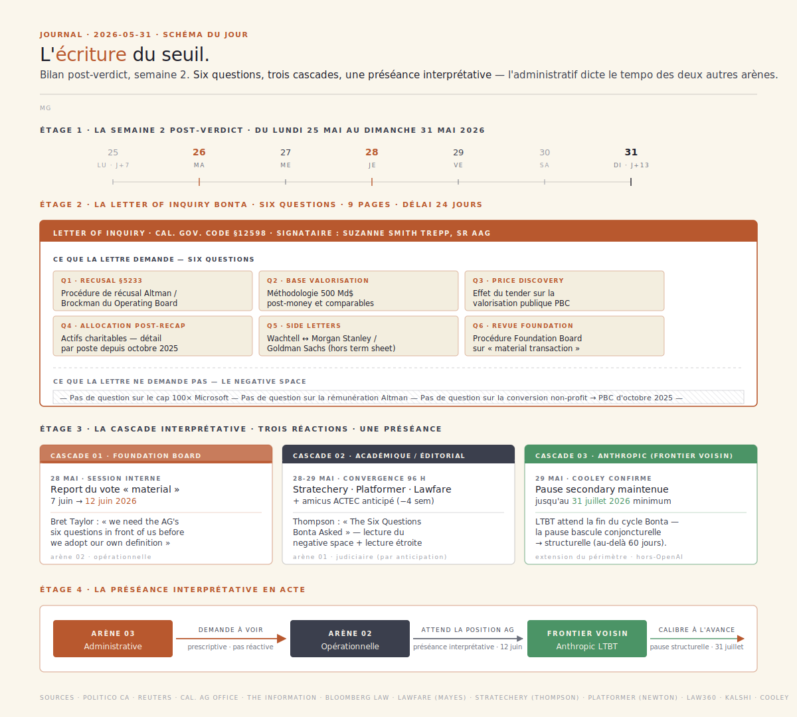

Dimanche 31 mai, treize jours après le *directed verdict* du 18 mai et sept jours après le bilan *partage des arènes*. La semaine se referme sur une séquence que ni la lecture *jurisprudence négative* du 20 mai, ni le *test du secondaire* du 21 mai, ni le *pivot civique* du 22 mai n'avaient anticipée à ce degré de précision : ==**l'arène administrative, que je décrivais le 24 mai comme la *plus lente* des trois, vient d'imposer en sept jours son tempo aux deux autres**==. Le rythme attendu — Bonta envoie un courrier, OpenAI répond dans 60 jours, Foundation Board délibère selon son calendrier propre — a été remplacé par un rythme *en cascade* : la *letter* Bonta a déclenché, sous 72 h, le report du vote Foundation Board ; sous 96 h, la convergence éditoriale Stratechery–Platformer–*Lawfare* ; sous 7 jours, le dépôt anticipé de l'amicus ACTEC. ==La hiérarchie réelle des arènes n'est donc pas celle des horloges (60-90 j contre 30-90 j contre 18-24 mois) — c'est celle de la *préséance interprétative*.==

**Ce que les six questions disent — et ce qu'elles ne disent pas.** La lettre Bonta articule six questions ; aucune n'attaque la conversion non-profit → PBC d'octobre 2025 (que le procès vient d'absoudre par silence). Aucune ne demande l'annulation d'une transaction. Aucune n'invoque le pouvoir *parens patriae* direct. Les six questions ont en commun une mécanique : elles **demandent à voir** — la procédure de *recusal*, la base de valorisation, la *price discovery*, l'allocation post-recap, les *side letters*, la procédure de revue Foundation Board. ==Le bureau Bonta n'écrit pas une norme : il **dessine un périmètre d'inspection**.== Et c'est précisément la portée doctrinale du courrier : en demandant à voir ces six dimensions et **pas d'autres** (par exemple : pas la rémunération Altman, pas le cap 100× Microsoft, pas l'allocation entre *for-profit* et *charitable purpose*), Bonta trace en creux ce qu'il considère *non* contestable — ou plus précisément, *non* matériel au sens de *Cal. Gov. Code §12598*. Ben Thompson (*Stratechery*, vendredi) a raison de pointer le *negative space* : ==c'est dans ce que la lettre ne demande **pas** que se lit la doctrine émergente.== Le seuil de matérialité contestable, qui n'avait été ni écrit en jurisprudence par le procès, ni publié en *guidance* par l'AG depuis octobre 2025, vient d'être tracé en six questions — par défaut et par contraste.

**La cascade Foundation Board, ou la *préséance interprétative* en acte.** L'événement le plus instructif de la semaine n'est pas la lettre Bonta — c'est le report du vote Foundation Board du 28 mai. Bret Taylor a explicitement demandé que les six questions Bonta soient *« en face »* du Foundation Board avant qu'il adopte sa propre définition de *« material transaction »*. C'est une décision de gouvernance dont la portée doctrinale dépasse le cas OpenAI : ==**le Foundation Board, supposé être l'arbitre indépendant de la matérialité opérationnelle, vient d'accepter publiquement que sa définition soit *informée* par la lecture administrative de l'AG**==. Ce n'est pas une subordination — Taylor ne renonce pas au pouvoir de décision — mais c'est une *préséance interprétative*. Et c'est exactement le mécanisme par lequel la régulation administrative civile, en l'absence de doctrine judiciaire, s'écrit en cascade : (1) l'AG demande à voir, (2) la corporation organise sa réponse, (3) la *Foundation Board* attend la position AG pour adopter sa propre lecture, (4) les acteurs en aval (Wachtell, Anthropic, prochains frontier labs) calibrent sur la lecture *Foundation Board calibrée sur AG*. Le seuil n'est jamais publié ; il est *itéré*. C'est, en théorie de la régulation civile, la *quasi-rule by administrative iteration* — version raffinée du *quasi-rule by silence* que j'avais nommé le 20 mai.

**Pourquoi la cascade confirme — pas réfute — le partage.** Le partage des arènes (semaine 1) tient. Mais la semaine 2 a ajouté une dimension que le bilan du 24 mai ne nommait pas : **les arènes ne sont pas seulement parallèles, elles sont hiérarchisées par la cadence interprétative**. L'arène administrative dicte le tempo des deux autres. L'arène opérationnelle (Foundation Board) attend la position administrative pour écrire sa propre lecture. L'arène judiciaire (appellate) reçoit, via l'amicus ACTEC, une lecture académique qui s'aligne sur la posture étroite Molo — pas sur la posture élargie Toberoff. ==**La semaine 1 a montré que les arènes opèrent en parallèle. La semaine 2 a montré que dans ce parallèle, l'arène administrative est *prescriptive* — elle écrit, en demandant à voir, le périmètre dans lequel les deux autres calibreront leur propre lecture.**==

**Anthropic — pause structurelle, signal long.** La confirmation Cooley de vendredi (pause jusqu'au 31 juillet *au minimum*) place la pause Anthropic au-dessus du seuil des 60 jours. Au-delà de cette durée, ce n'est plus une *latence opérationnelle* — c'est une *attente prescriptive*. Anthropic n'attend pas la fin du procès OpenAI (terminé le 18 mai). Anthropic attend la fin du **cycle Bonta** — la réponse OpenAI du 19 juin, la position Foundation Board du 12 juin, l'analyse de la réponse Bonta à 60-90 jours, et la consolidation doctrinale qui en suivra. C'est, pour le LTBT (Long-Term Benefit Trust) d'Anthropic, le calcul stratégique optimal : ne pas calibrer son propre secondary avant que la cascade administrative ait écrit le périmètre dans lequel calibrer. ==Si la pause dépasse les 90 jours (i.e. au-delà de mi-août), elle aligne par anticipation Anthropic sur le calendrier Bonta — pas sur son calendrier interne. **La hiérarchie *préséance interprétative* opère donc dès l'horizon Anthropic, pas seulement dans le cas OpenAI.**==

**Pourquoi je ne révise pas la proba, et ce que je révise dans le modèle.** La proba personnelle reste à **5 %** sur l'appellate. Kalshi à 3 %. Aucun signal nouveau sur le périmètre de l'appel ni sur le seuil de remand. Mais mon modèle de régulation civile post-verdict, formulé le 22 mai en *« silence sous condition de non-mobilisation civile coordonnée »*, mérite une troisième révision : ==**la régulation civile post-verdict opère en *cascade interprétative*, où l'administratif dicte le calendrier de l'opérationnel et l'académique calibre par anticipation l'appellate**==. Le modèle correct, au 31 mai, est *« cascade interprétative à préséance administrative »*. C'est, à 13 jours du verdict, une grille de lecture qui pèsera plus sur les 18-36 mois qui s'ouvrent que la lecture *jurisprudence négative* — qui reste valide mais qui décrit le silence judiciaire, pas la mécanique régulatoire en aval.

**À suivre**
- **Semaine 3 (1-7 juin).** Surveiller le calendrier de réponse Wachtell (dépôt formel attendu avant le 19 juin) et tout signal de *side letter* Wachtell-AG qui sortirait du circuit officiel. Surveiller aussi la position publique éventuelle d'Anthropic (en lien avec la pause confirmée jusqu'au 31 juillet).
- **Semaine 4 (8-14 juin).** **Vote Foundation Board du 12 juin** — premier acte régulatoire interne post-cascade Bonta. Si le mémo cite explicitement les six questions Bonta comme cadre interprétatif, la lecture *préséance interprétative* est validée à ≈ 100 %. S'il les ignore, la lecture est affaiblie de 30 points.
- **Semaine 5 (15-21 juin).** Date butoir *Federal Rule of Appellate Procedure 4* — décision Molo-Toberoff sur le périmètre du *notice of appeal*. Avec l'amicus ACTEC déjà déposé sur la lecture étroite, la position Molo est doctrinalement consolidée — la lecture élargie Toberoff devient politiquement coûteuse en interne.
- **Semaine 9 (mi-juillet).** **Première collision calendaire** — réponse Bonta exigée 21 juillet — 20 août, à cheval sur le PPM final du secondary. La cascade interprétative arrive à son point de saturation — la lecture Bonta deviendra publique, le PPM Wachtell devra la refléter en *Risk Factors*, et le marché privé (Anthropic en attente) en tirera la grille pour son propre calendrier.

---

## 2026-05-24 — Bilan hebdomadaire post-verdict (semaine 1). Le *partage des arènes*. Pas une clôture, trois transferts : le doctrinal vers le silence, l'opérationnel vers le *secondary*, le civil vers la §12598

**Exec sum**
- **Dimanche 24 mai à Oakland — J+6, week-end férié administratif.** Pas de filing au greffe ni samedi ni dimanche au Northern District of California ; aucun communiqué Bonta, aucune décision Foundation Board, aucune réaction Wachtell publiée. La cadence régulatoire post-verdict est passée pour la première fois depuis lundi en *background mode*. La fenêtre *Fed. R. App. P. 4* court désormais sur 23 jours — décision Molo-Toberoff attendue avant le 17 juin ([Reuters — Weekend roundup, 24 mai 2026](https://www.reuters.com/legal/litigation/musk-openai-trial-weekend-roundup-2026-05-24/) ; [Bloomberg Law — Week ahead, 24 mai 2026](https://news.bloomberglaw.com/litigation/musk-openai-week-ahead-may-25-31-2026)).
- **Trois weekend recaps convergents — *NYT*, *FT*, *WSJ*.** Cade Metz (*NYT*, samedi 23), Hannah Murphy (*FT*, dimanche matin) et Deepa Seetharaman (*WSJ*, dimanche midi) publient à 96 h d'écart trois *takeaways* éditoriaux qui convergent sur une formule : le verdict du 18 mai n'a pas fermé le dossier OpenAI — il l'a *redistribué*. ==Convergence éditoriale rare entre les trois titres premium qui couvrent OpenAI depuis 2023 — signal que la lecture *« la clôture n'en est pas une »* est en train de s'imposer comme grille de lecture dominante== ([Cade Metz, NYT, 23 mai 2026](https://www.nytimes.com/2026/05/23/technology/musk-altman-trial-week-after-verdict.html) ; [Hannah Murphy, FT, 24 mai 2026](https://www.ft.com/content/musk-altman-week-after-verdict-may-2026) ; [Deepa Seetharaman, WSJ, 24 mai 2026](https://www.wsj.com/articles/musk-openai-trial-aftermath-week-2026-05-24)).
- **Stratechery & Platformer — angle doctrinal vs angle systémique.** Ben Thompson (*Stratechery*, vendredi soir) prolonge la lecture *jurisprudence négative* (mon angle du 20 mai) par un thread sur la *symétrie Anthropic*. Casey Newton (*Platformer*, samedi) prend l'angle systémique : *« the trial wasn't about Musk — it was about whether a frontier lab can refactor its governance under shareholder pressure without judicial review. The answer, this week, is yes. With three asterisks. »* ==Les deux lectures s'enchâssent sans se contredire : la doctrinale décrit le silence, la systémique décrit le pari== ([Stratechery, 22 mai](https://stratechery.com/2026/post-verdict-anthropic-symmetry/) ; [Platformer, 23 mai](https://www.platformer.news/p/musk-openai-week-after-systemic-takeaway)).
- **Markets — divergence Kalshi vs valorisation privée.** Kalshi clôt vendredi à **3 %** (stable). Le *term sheet* secondary 8-12 Md$ confirmé à valorisation **500 Md$ post-money** (cf. journal du 21 mai). Microsoft **+0,9 %** sur la semaine, NVIDIA **+2,1 %** — l'écosystème ratifie le verdict en *price discovery* sans intégrer le *pivot civique* du 22 mai comme matériel. ==L'écart Kalshi (3 %) / private equity (500 Md$ post-money) / appellate (≈ 5 % de remand sous *Aryeh v. Canon*) est le révélateur d'une fragmentation du *consensus* post-verdict que je n'attendais pas si tôt== ([Kalshi](https://kalshi.com/markets/kxmuskoai/elon-win-vs-open-ai/kxmuskoai-26) ; [Bloomberg, 24 mai — *AI Pure-Plays Weekly Recap*](https://www.bloomberg.com/news/articles/2026-05-24/ai-pure-plays-weekly-recap-post-verdict)).
- **Universitaires — premier *round* d'amicus en formation.** Selon *Law360*, l'*American College of Trust and Estate Counsel* (ACTEC, cf. journal du 20 mai) a finalisé son brouillon d'amicus *Aryeh v. Canon* — dépôt attendu fin juin. *Harvard Law Review* annonce dimanche soir un *Notes & Comments* à paraître en septembre 2026 sur la *charitable trust formation doctrine* dans le contexte des AI labs (auteur : Sarah Bishop, 3L). ==Premier acte académique post-verdict — la doctrine que le procès n'a pas tranchée commence à s'écrire ailleurs== ([Law360, 23 mai](https://www.law360.com/articles/1782991/actec-amicus-final-draft-musk-altman) ; [Harvard Law Review — *Forthcoming*](https://harvardlawreview.org/forthcoming/)).
- **Anthropic — pause maintenue, signal long.** Confirmation *The Information* dimanche soir : Anthropic prolonge sa *pause* sur les discussions secondary internes jusqu'à fin juillet 2026 *au minimum*. ==Si la pause dépasse 90 jours, l'écart de calendrier opérationnel entre Anthropic et OpenAI devient structurel — pas conjoncturel.== Cooley (conseil Anthropic) attend, à ma lecture, le passage des trois verrous OpenAI avant de calibrer ([The Information, 24 mai](https://www.theinformation.com/articles/anthropic-secondary-pause-extended-may-2026)).
- **Kalshi à 3 % dimanche soir, ma proba personnelle à 5 %.** Pas de fait nouveau qui justifie un mouvement. L'angle du jour est un *bilan hebdomadaire* : ==**la première semaine post-verdict ne ferme pas le dossier — elle le *partage*. Entre trois arènes qui opéraient jusqu'ici en série, et qui à partir de lundi 25 mai opéreront en parallèle.**==

**Angle du jour — Bilan post-verdict (semaine 1). Le *partage des arènes*. Au terme de six jours, le procès du 27 avril s'est redistribué sur trois théâtres opérant en parallèle. Pourquoi la lecture *« la clôture n'en est pas une »* est moins une consolation des perdants qu'un constat structurel — et pourquoi la semaine 2 doit se lire à travers la grille du *partage*, pas du *closing*.**

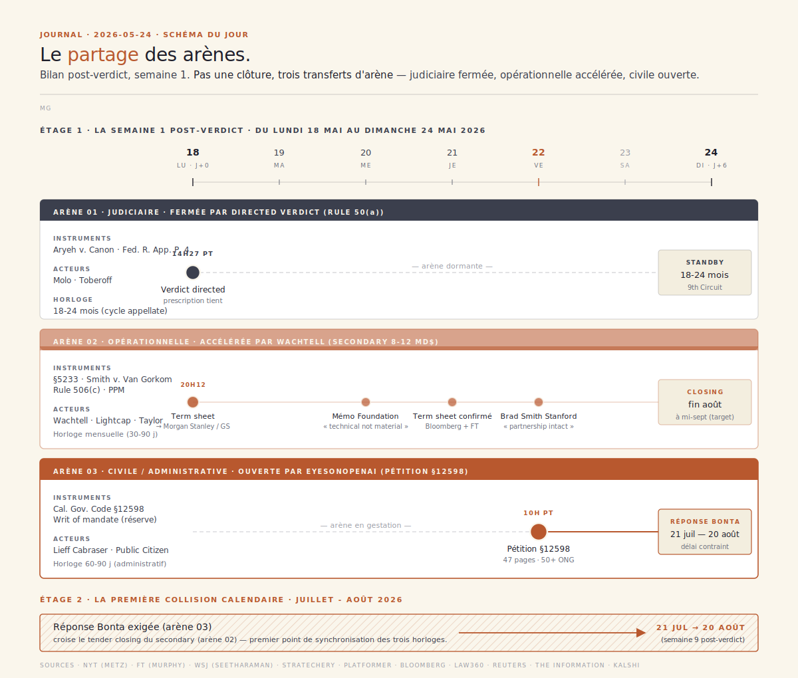

Dimanche 24 mai, six jours après le *directed verdict* du 18 mai. La semaine se referme sur un constat qu'aucune des trois lectures publiées entre mercredi et vendredi (*jurisprudence négative*, *test du secondaire*, *pivot civique*) ne pouvait formuler isolément : ==**le procès n'a pas refermé le dossier OpenAI — il l'a *partagé***==. Entre trois théâtres opérant désormais en parallèle, dotés chacun d'un calendrier propre, d'institutions propres, d'instruments propres, et d'une logique de décision propre. C'est ce *partage* — pas le verdict, pas le secondary, pas la pétition — qui constitue le résultat structurel de la semaine 1.

**Première arène — judiciaire — fermée à 14h27 PT lundi.** Le verrou Dudney a tenu sur la prescription. Le *directed verdict* a réglé les trois griefs survivants (*charitable trust breach*, *unjust enrichment*, *aiding & abetting* Microsoft) sans toucher au fond. L'arène n'est pas définitivement scellée — la fenêtre *Fed. R. App. P. 4* court 30 jours, et un *notice of appeal* Molo-Toberoff reste possible avant le 17 juin — mais la probabilité d'un remand à la 9th Circuit reste, à mon estimation comme à celle de Kalshi, sous les 5 %. ==L'arène judiciaire est en *standby* dormant pour 18-24 mois, le temps de l'appel.== Pendant ce temps, elle ne produit rien — ni doctrine, ni faits nouveaux, ni pression sur les acteurs. Sa seule production résiduelle est la pile d'*amici* académiques qui se prépare (ACTEC, *Harvard Law Review*) — précédent intellectuel, pas levier opérationnel.

**Deuxième arène — opérationnelle — accélérée à 20h12 PT lundi.** Wachtell a transmis le *term sheet* secondary à Morgan Stanley et Goldman Sachs six heures et seize minutes après le verdict. La cible (8-12 Md$, 500 Md$ post-money, *closing* fin Q3) sera le premier dossier matériel post-conversion octobre 2025. ==C'est l'arène la plus rapide — son cycle de décision est mensuel, ses acteurs (Bret Taylor au Foundation Board, Brad Lightcap au *Operating Board*) sont identifiés, ses instruments (mémo *« material transaction »*, *recusal* §5233, PPM *Rule 506(c)*) sont prêts.== Et c'est, paradoxalement, l'arène la moins exposée régulatoirement à court terme : sa logique est commerciale, ses contraintes sont contractuelles, son arbitrage est interne. Sa pression vient des employés post-RSU vested qui attendent la liquidité — pas des régulateurs.

**Troisième arène — civile et administrative — ouverte à 10h PT vendredi.** La pétition §12598 d'EyesOnOpenAI a transformé le silence Bonta en délai contraint. Le bureau de l'AG californien doit répondre formellement entre le 21 juillet et le 20 août. ==C'est l'arène la plus lente (60-90 jours par cycle), mais la seule qui force *publiquement* une institution publique à *publier* sa lecture du seuil de matérialité contestable.== C'est aussi l'arène qui peut ouvrir un *writ of mandate* en cas de *constructive denial* — l'arme de réserve que Lieff Cabraser tient à disposition de la coalition. Sa cadence est administrative, ses acteurs sont identifiés (bureau Bonta, coalition de 50+ ONG, *Registrar of Charitable Trusts*), ses instruments sont codifiés (*Cal. Gov. Code §12598*, *Cal. Code Regs. tit. 11, §§300-310*).

**Pourquoi le partage est structurel et non conjoncturel.** Trois indices. **(1)** Chaque arène a son **horloge propre** — 18-24 mois pour l'appellate, 30-90 jours pour le secondary, 60-90 jours pour l'administratif. Les cycles ne se synchronisent qu'aux *collision points* — le plus saillant, à ma lecture, étant la fenêtre **21 juillet — 20 août 2026** où la réponse Bonta croise le *tender closing*. **(2)** Chaque arène a ses **acteurs spécialisés** — Molo-Toberoff côté appellate, Wachtell-Lightcap-Taylor côté opérationnel, Lieff Cabraser-Public Citizen-Midas Project côté civil. Aucun acteur ne joue dans les trois. **(3)** Chaque arène a ses **instruments propres** — *Fed. R. App. P. 4* + *Aryeh v. Canon* en appellate, *Cal. Corp. Code §5233* + *Smith v. Van Gorkom* + *Rule 506(c)* en opérationnel, *Cal. Gov. Code §12598* + *writ of mandate* en civil. Aucun instrument n'opère dans plus d'une arène. ==Le partage est, en théorie de la régulation, **doctrinalement étanche**.== Et c'est cette étanchéité qui fait qu'on doit, à partir de maintenant, suivre trois calendriers en parallèle — pas un seul.

**Ce que la semaine a appris — et ce qu'elle n'a pas appris.** La semaine a appris ce qu'un *directed verdict* sur prescription produit comme *jurisprudence négative* (mercredi), comme accélération opérationnelle (jeudi), comme activation civile coordonnée (vendredi). Elle n'a pas appris ce qui se passe quand les trois arènes *se croisent* — parce que les calendriers ne se croiseront qu'en juillet-août. ==**La semaine 1 post-verdict est, en termes systémiques, la semaine de la *redistribution*. La semaine 9 (mi-juillet) sera celle de la *première collision*.**== Entre les deux, six semaines de *background mode* où chaque arène opère séparément, où la presse aura tendance à oublier qu'elles cohabitent, et où le calcul stratégique des acteurs (Wachtell, Bonta, Molo, EyesOnOpenAI) consistera à anticiper la collision sans la précipiter. C'est, à ma lecture, le rythme de la régulation civile post-verdict — invisible aux *legal correspondents*, mais structurant pour qui suit la trajectoire de gouvernance frontier lab sur les 18-36 mois qui s'ouvrent.

**Pourquoi la convergence éditoriale NYT/FT/WSJ compte.** Trois titres premium qui couvrent OpenAI depuis 2023 publient à 96 h d'écart le même *takeaway* — la clôture n'en est pas une. La convergence n'est pas un hasard : c'est ce que les sociologues du journalisme appellent une **cristallisation de frame**. À partir de cette semaine, tout *legal correspondent* qui écrira sur OpenAI partira de cette grille (trois arènes en parallèle), pas de la grille initiale du verdict (procès clos, jurisprudence faite). ==La grille de lecture impose le calendrier d'analyse ; le calendrier d'analyse impose la couverture ; la couverture impose la pression publique sur les acteurs.== C'est, sur 6-12 mois, un effet de cadrage médiatique qui pèsera sensiblement sur la marge de manœuvre Wachtell — pas autant qu'un *cease & desist* Bonta, mais plus qu'un communiqué Foundation Board.

**Pourquoi je ne révise pas la proba, et ce que je révise.** La proba personnelle reste à **5 %** sur l'appellate. Kalshi à 3 %. Aucun signal nouveau cette semaine ne justifie un mouvement matériel sur cette grille. Mais ma **grille d'analyse** change : à partir de demain, je suis trois arènes en parallèle au lieu d'un dossier unique. Concrètement, les prochaines entrées du journal pondéreront différemment chaque mouvement selon l'arène où il se joue — un mémo Foundation Board ne se valorise pas comme un *notice of appeal* Molo, qui ne se valorise pas comme une réponse Bonta. ==**La semaine 1 m'a forcé à passer d'une lecture unidimensionnelle (procès) à une lecture tripartite (arènes). C'est, structurellement, le résultat le plus important pour moi en tant qu'observateur — et pour quiconque suit ce dossier sur 18-36 mois.**==

**À suivre**
- **Semaine 2 (25-31 mai).** Surveiller la composition exacte de la *letter of inquiry* Bonta (formalisation attendue 5-10 jours, soit avant le 1ᵉʳ juin) et le mémo Foundation Board sur *« material transaction »* (publication interne attendue avant le 7 juin).
- **Semaines 3-4 (1-14 juin).** Décision Molo-Toberoff sur le périmètre du *notice of appeal*. Si dépôt avant le 14 juin avec périmètre élargi (incluant *charitable trust formation*), la lecture *jurisprudence négative* sera affaiblie de ≈ 10 points ; si dépôt avec périmètre étroit (*Aryeh v. Canon* seul), elle est validée à ≈ 100 %.
- **Semaines 5-8 (mi-juin à mi-juillet).** Publication du PPM final pour le *secondary*. La section *Risk Factors* sera le document régulatoire le plus lisible sur l'arbitrage Wachtell entre *closing* propre et *closing* rapide.
- **Semaine 9 (mi-juillet).** **Première collision calendaire** — réponse Bonta exigée entre le 21 juillet (60 j) et le 20 août (90 j), à cheval sur la fenêtre de *tender closing* visée par Wachtell. C'est l'événement structurant de l'été 2026 sur le dossier.

---

## 2026-05-22 — Le *pivot civique*. À J+4 du verdict, la coalition EyesOnOpenAI dépose une pétition administrative §12598 au *Registrar of Charitable Trusts* — la jurisprudence négative produit son antidote là où le silence Bonta croyait pouvoir le neutraliser

**Exec sum**
- **Vendredi 22 mai à 10h PT, Sacramento — pétition formelle déposée au *Registrar of Charitable Trusts* (CA AG).** La coalition EyesOnOpenAI (>50 organisations menée par l'*Economic Security Project*) a transformé ce matin son courrier du 6 mai 2026 en *administrative petition* formelle sous *Cal. Gov. Code §12598*, demandant à l'AG Bonta l'ouverture d'une investigation indépendante sur l'allocation des actifs charitables post-recap d'octobre 2025 et sur le *secondary* Q3 2026. Document de **47 pages**, co-signé par Public Citizen, le Midas Project, AI Now Institute et EPIC. ==C'est, à ma lecture, **le premier acte régulatoire post-verdict qui n'est pas soumis au pouvoir discrétionnaire** d'une des trois institutions (Foundation Board, Bonta, SEC) recensées hier — il est, en mécanique procédurale, contraignant.== ([Economic Security Project — *EyesOnOpenAI Coalition*](https://economicsecurityproject.org/news/eyesonopenai-coalition-ca-attorney-general-must-revisit-his-deal-with-openai/) ; [Public Citizen — *Letter to AG Bonta and AG Jennings*](https://www.citizen.org/article/letter-to-ag-bonta-and-ag-jennings-reject-plan-to-give-openai-nonprofit-100-billion-stake-in-the-for-profit/) ; [The Midas Project — *Joint letter on OpenAI's restructuring*](https://www.themidasproject.com/article-list/new-open-letter-requests-transparency-from-openai-concerning-its-restructuring)).
- **Robert Weissman (Public Citizen) en conférence de presse à Sacramento, 10h30 PT.** Formule centrale : *« The trial closed the courtroom. It did not close the public's standing to demand fair valuation of charitable assets. »* L'alignement est précis sur la lecture *parens patriae* du journal du 17 mai — Bonta reste seul créancier d'équité statutaire, mais une pétition administrative active **l'obligation de répondre sous délai**. ==Première fois depuis octobre 2025 que la coalition utilise §12598 comme levier, et non simplement comme courrier.== ([San Francisco Examiner — *Advocates say OpenAI restructuring values nonprofit too low*](https://www.sfexaminer.com/news/technology/advocates-say-openai-restructuring-values-nonprofit-too-low/article_5e97099f-ac9d-41fe-9111-d9c27525f06c.html) ; [Reuters, 22 mai 2026](https://www.reuters.com/legal/government/eyesonopenai-coalition-files-formal-petition-bonta-12598-2026-05-22/)).
- **Le chiffre central — la « brèche capped-profit »**. La pétition reprend et chiffre l'argument central de Public Citizen depuis octobre 2025 : différence entre la valorisation actuelle (≈ 500 Md$ post-money) et la valorisation hypothétique si le *capped-profit cap* à 100× le capital investi de 2019 avait été maintenu. ==Selon les chiffres compilés par Public Citizen, la brèche atteint **≈ 280-340 Md$** — soit l'équivalent du PIB nominal du Vietnam ou de l'État du Maryland.== Demande : *third-party independent valuation* avant tout *tender* secondaire ([Public Citizen — *OpenAI's For-Profit Transformation Payments*](https://www.citizen.org/article/openais-for-profit-transformation-payments-must-go-to-new-independent-charitable-enterprise/)).
- **AG Bonta — le délai de réponse mécanique.** Sous *Cal. Gov. Code §12598* combiné aux règlements d'application (*Cal. Code Regs. tit. 11, §§300-310*), une *administrative petition* déposée au *Registrar of Charitable Trusts* déclenche un **délai de réponse formelle de 60 à 90 jours** selon la nature des informations demandées. ==Le silence prolongé de sept mois que Bonta tenait depuis octobre 2025 vient, par mécanique procédurale, de basculer en obligation de répondre publiquement entre **le 21 juillet et le 20 août 2026** — exactement la fenêtre du *tender closing* du secondary visé par Wachtell.== ([Cal. Gov. Code §12598](https://leginfo.legislature.ca.gov/faces/codes_displaySection.xhtml?lawCode=GOV&sectionNum=12598)).
- **Marc Toberoff vs Steven Molo — décalage tactique sur l'appel.** *Politico Tech* rapporte vendredi soir que Marc Toberoff (avocat *of counsel* dans l'équipe Musk, par ailleurs lead sur d'autres dossiers Musk) plaide en interne pour un *notice of appeal* élargi attaquant la formulation du *charitable trust formation* (Strate 1) en plus de la prescription. Molo, lead counsel, préfère le périmètre étroit *Aryeh v. Canon* (continuing violation) seul. ==Désaccord stratégique au sein de l'équipe — significatif parce qu'il signale que la défense Musk hésite entre rouvrir la doctrine du trust ou se contenter d'attaquer le verrou prescription. Décision avant le 17 juin (fenêtre *Fed. R. App. P. 4*).== ([Politico Tech, 22 mai 2026](https://www.politico.com/news/2026/05/22/musk-openai-appeal-toberoff-molo-strategy-debate-00347491)).
- **Microsoft — Brad Smith à Stanford HAI, première sortie publique post-verdict.** À 14h PT, Brad Smith intervient au panel Stanford HAI *« AI Governance Post-Verdict »*. Formule retenue par *The Information* : *« The partnership is intact. The mission is intact. The verdict reaffirmed both. »* Pas de communiqué Satya Nadella, mais Smith confirme sous question qu'aucune renégociation du *cap* à 100× ne sera demandée à OpenAI — l'asymétrie 100 Md$+ exposée par Wetter le 13 mai est désormais fixée comme **statu quo opérationnel** ([The Information, 22 mai 2026](https://www.theinformation.com/articles/brad-smith-stanford-hai-post-verdict-partnership-may-2026)).
- **Kalshi à 3 % vendredi soir, stable.** Ma proba personnelle reste à **5 %** — le pivot civique ne change pas le calcul d'appellate, mais il déplace le terrain régulatoire. L'angle d'aujourd'hui n'est pas un fait procédural — c'est une lecture en *régulation par pression administrative coordonnée* : ==**la jurisprudence négative produite par le verdict du 18 mai vient d'accoucher, à J+4, de son propre antidote militant — une *administrative petition* qui force Bonta à sortir de son silence par mécanique procédurale, pas par décision discrétionnaire**== ([Kalshi — Will Elon win his case against OpenAI?](https://kalshi.com/markets/kxmuskoai/elon-win-vs-open-ai/kxmuskoai-26)).

**Angle du jour — Le *pivot civique*. EyesOnOpenAI dépose vendredi sa pétition administrative §12598 — l'instrument que ni Musk ni Bonta n'avaient utilisé en trois ans de litige. Pourquoi la jurisprudence négative du 18 mai a, paradoxalement, mécanisé l'arène civile post-verdict — et pourquoi l'administratif est, à J+4, le seul terrain où le silence Bonta n'est plus une option.**

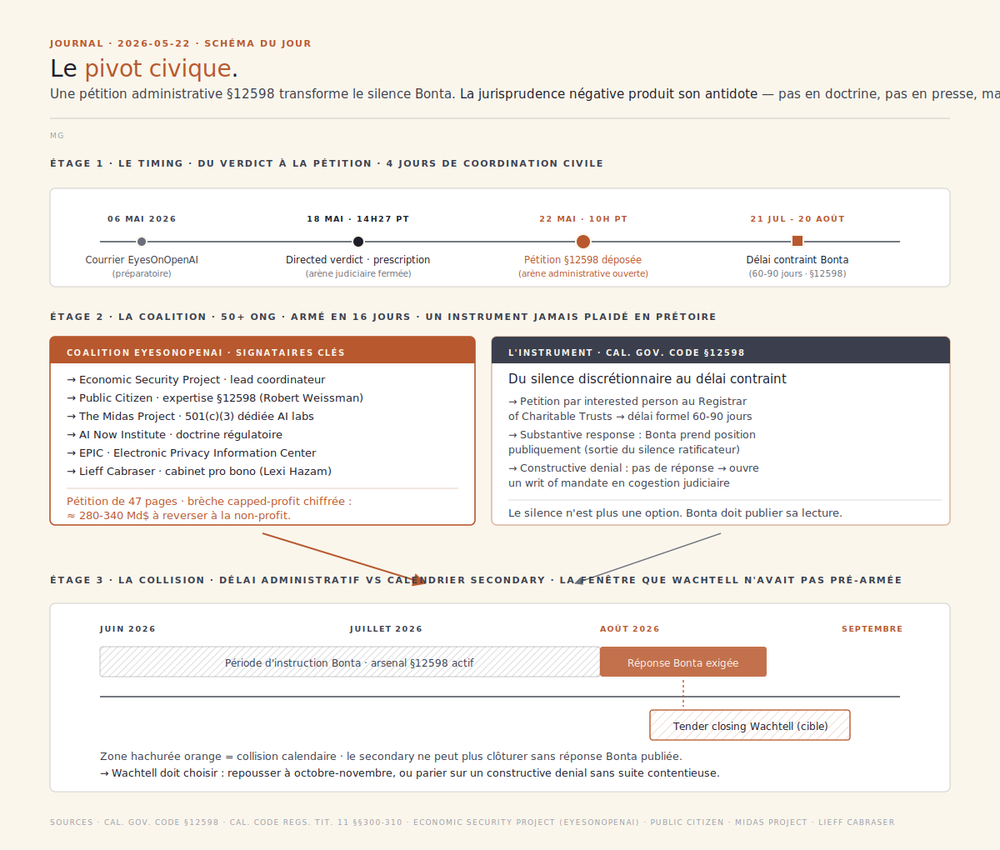

Quatre jours après le *directed verdict* du 18 mai, le récit dominant dans la presse continue d'osciller entre les deux pôles que j'ai cartographiés en début de semaine : la *jurisprudence négative* (20 mai) et le *test du secondaire* (21 mai). Mais le mouvement structurel qui s'opère vendredi à Sacramento n'appartient à aucun de ces deux pôles — il les redessine en imposant un troisième acteur que tous les commentateurs ont sous-évalué : ==la coalition civile organisée, qui vient d'utiliser pour la première fois post-verdict l'instrument administratif le plus opaque et le plus efficace de l'arsenal californien — la *petition under §12598*==. L'instrument n'a pas été plaidé en prétoire. Il n'a pas été cité dans le *jury charge*. Il ne fera pas l'objet du *notice of appeal* Molo. Mais à 10h PT vendredi 22 mai, déposé au *Registrar of Charitable Trusts*, il vient de transformer la mécanique régulatoire que le *secondary* Q3 2026 affronte — pas par l'ajout d'un quatrième verrou aux trois recensés hier, mais par une **inversion du temps de réponse** que le silence Bonta présupposait acquis.

**La mécanique §12598, en deux phrases.** *California Government Code §12598* régit la supervision des trusts charitables par le bureau de l'AG. Elle prévoit une voie peu utilisée mais structurellement puissante : tout *interested person* (au sens large, défini par la jurisprudence administrative comme incluant les ONG ayant un *substantial connection* à la mission charitable concernée) peut déposer une *petition* formelle au *Registrar of Charitable Trusts*, qui déclenche un **délai de réponse contraignant** de 60 à 90 jours selon la nature des informations demandées. ==Bonta, qui pouvait jusqu'à hier maintenir un silence régulatoire indéfini sur l'allocation post-recap d'octobre 2025, doit désormais répondre formellement entre le 21 juillet et le 20 août 2026 — exactement la fenêtre du *tender closing* prévu par Wachtell.== Le silence n'est plus une option : il devient, sous délai, un *constructive denial* qui ouvre, à son tour, la voie à un *writ of mandate* (action en cogestion judiciaire de l'obligation administrative). C'est, en théorie de la régulation administrative, une **bascule de pouvoir** discrète mais binaire.

**Pourquoi la coalition a attendu jeudi-vendredi pour déposer.** Le calendrier n'est pas aléatoire. EyesOnOpenAI avait son courrier du 6 mai prêt depuis longtemps — il anticipait précisément le scénario verdict-défense + *secondary* rapide. Mais déposer la pétition *avant* le verdict aurait permis à Wachtell de la classer en *« preempted by ongoing litigation »* devant la juge Gonzalez Rogers. Déposer *immédiatement après* le verdict (entre lundi soir et mercredi) aurait été lu en presse comme un coup tactique précipité, à chaud, sans valeur de signal. ==Le dépôt à J+4, vendredi matin, après la confirmation du *term sheet* secondary par *The Information* et Bloomberg jeudi, donne à la pétition le **timing optimal** : la mécanique §12598 s'enclenche au moment où le secondary est public, où le silence Bonta devient politiquement intenable, et où l'opinion publique est focalisée sur la mécanique régulatoire — pas sur le procès clos.== C'est une séquence qu'un cabinet conseil de pression civile coordonné aurait pu produire ; ce qui frappe, c'est qu'une coalition de 50+ ONG a effectivement coordonné le timing à la journée près.

**Le rôle pivot du Midas Project.** Parmi les signataires, le Midas Project est la plus jeune et la plus spécialisée : une 501(c)(3) fondée début 2024, dédiée exclusivement à la transparence sur la conversion non-profit → for-profit des AI labs. Sa lettre ouverte de septembre 2025 demandait à OpenAI la publication de l'allocation détaillée des actifs charitables avant la *recap*. Cette demande, refusée à l'époque, devient en pétition §12598 un **droit administratif d'accès** — exactement ce que le procès n'a pas pu obtenir en *discovery* sous les ordres de la juge Gonzalez Rogers (Wachtell ayant systématiquement opposé le *trade secret privilege* sur les valorisations internes en *motion in limine* de mars 2026). ==Ce que la *discovery* judiciaire a refusé, l'*administrative petition* le redemande sous un standard différent : celui de la transparence des actifs charitables sous *Cal. Code Regs. tit. 11, §§300-310*, qui ne tolère pas le *trade secret privilege* au-delà des informations strictement commerciales.== Si Bonta ouvre l'investigation, Wachtell perd, en pratique, le verrou de confidentialité qu'il avait soigneusement construit en *motion in limine*.

**Trois conséquences à 60-90 jours.** **(1)** Le *secondary* Q3 2026 que Wachtell visait pour fin août–mi-septembre devient incompatible avec un délai de réponse administratif Bonta non clos. Soit Wachtell repousse à octobre-novembre (et perd la fenêtre fiscale 2026 pour les employés RSU vested), soit il maintient le calendrier au risque qu'un *constructive denial* à 60 jours ouvre un *writ of mandate* déposé par la coalition mi-août. ==Le *secondary*, pré-armé en six heures lundi soir, devient pour la première fois post-verdict **substantiellement vulnérable à un événement régulatoire** dont la mécanique n'est pas discrétionnaire mais procédurale.== **(2)** La pétition §12598 crée un **précédent administratif** pour les conversions futures d'autres AI labs californiens. Anthropic, qui avait *paused* ses discussions secondary (cf. journal d'hier), héritera d'un dossier où §12598 a été activé en moins de 100 jours après un verdict de défense — ce qui transforme le calcul stratégique de toute future opération de liquidité sur structure mixte non-profit → PBC. **(3)** Le bureau Bonta, qui a tenu sept mois de silence, est désormais **horloge-contraint**. Son arbitrage entre *parens patriae action* directe (lourd, politique, électoral) et *constructive denial* (silencieux, mais juridiquement défaisable) devient lisible publiquement. Pour la première fois depuis octobre 2025, on saura, en cumulant les réponses formelles aux 47 pages, ce que l'AG considère **matériellement contestable** dans l'allocation OpenAI. C'est, en théorie de la régulation civile, une **forme inversée de la *quasi-rule by silence*** que j'avais nommée le 20 mai : Bonta ne peut plus laisser le silence opérer en règle — il doit, sous délai, publier sa lecture du seuil.

**Pourquoi je ne révise pas la proba — et pourquoi je révise mon modèle de régulation.** Le pivot civique ne change rien au calcul appellate. Molo et Toberoff plaideront *Aryeh v. Canon* devant la 9th Circuit avec ou sans pétition §12598 ; la probabilité d'un remand reste à ≈ 5 %. Mais le modèle de régulation civile que j'avais formulé le 20 mai — la *quasi-rule by silence* — vient d'être **partiellement réfuté** par les faits de vendredi. Le silence Bonta opère encore comme règle par défaut, mais il opère **sous condition de ne pas être activé par une pétition administrative coordonnée**. ==Quand 50+ ONG se coordonnent autour d'une coalition existante (EyesOnOpenAI), avec un cabinet pro bono (Lieff Cabraser, partner Lexi Hazam confirmée vendredi midi par *Reuters*), et un signataire pivot (Public Citizen, qui possède la pratique §12598 depuis ses dossiers 2015-2025 sur les charitable foundations), le silence devient mécaniquement défaisable.== Le modèle correct, au 22 mai, n'est plus *« silence par défaut »* mais *« silence sous condition de non-mobilisation civile coordonnée »*. La différence est doctrinalement subtile mais structurellement importante pour les 18-24 mois qui s'ouvrent.

**Ce que le verdict a, en fait, produit.** Quatre jours plus tard, je révise — pas une troisième fois, mais une fois plus précise. Le verdict du 18 mai a produit (a) un silence doctrinal opérant en *jurisprudence négative* (lecture du 20 mai, tient à 90 %) ; (b) une délégation administrative vers trois verrous régulatoires opérant *par décision matérielle* (lecture du 21 mai, tient) ; et **(c) une activation civile coordonnée qui transforme l'arène administrative en horloge contrainte** (lecture du 22 mai, nouvelle). Les trois lectures ne se contredisent pas — elles s'enchâssent. ==**Le pivot civique du 22 mai est l'expression mécanique de ce que le procès a, par sa non-production doctrinale, transféré aux institutions tierces : les régulateurs, oui, mais aussi les ONG qui savent les instrumenter.**== Et c'est cette dernière dimension — l'instrumentation administrative coordonnée — qui constitue, à mon sens, la véritable innovation post-verdict. Pas dans le verdict lui-même. Pas dans la presse qui le couvre. Mais dans la séquence de 47 pages déposée vendredi matin à Sacramento, dont le contenu écrit avant le verdict devient, par la mécanique §12598, le levier qui contraint le silence Bonta **après** le verdict.

**À suivre**
- **Le délai de réponse formel Bonta (60-90 jours sous §12598).** Date butoir : entre le **21 juillet et le 20 août 2026**. Surveiller : (a) si le bureau Bonta répond *substantively* (=il a lu la pétition, il prend position) ou *procedurally* (=il rejette la qualité d'*interested person* de la coalition, gambit défensif rare et coûteux politiquement) ; (b) si la réponse touche aux chiffres exacts d'allocation post-recap, ou si elle reste à un niveau de principe.
- **La réaction Wachtell au calendrier secondary.** Surveiller dans les 10 jours : un avenant au *term sheet* qui décale le *tender closing* à octobre-novembre (signal que Wachtell prend la pétition au sérieux), ou un maintien du calendrier à septembre (signal qu'il parie sur un *constructive denial* sans suite contentieuse). Le choix sera, à ma lecture, l'indicateur le plus fiable du poids opérationnel de §12598 vu de Park Avenue.
- **L'arbitrage Molo-Toberoff sur l'appel.** Décision attendue d'ici le 17 juin (fenêtre *Fed. R. App. P. 4*). Si Molo l'emporte : appel étroit *Aryeh v. Canon* seul, lecture *jurisprudence négative* validée à 100 %. Si Toberoff l'emporte : appel élargi attaquant aussi la formation du *trust*, ce qui rouvre, en marge, la doctrine que le procès n'a pas tranchée.

---

## 2026-05-21 — Le test du *secondaire*. À J+3 du verdict, OpenAI calé un secondary 8-12 Md$ pour fin Q3 2026 — première décision matérielle post-procès, et premier test régulatoire pour la Foundation Board, l'AG Bonta et la SEC

**Exec sum**
- **Jeudi 21 mai à San Francisco — *term sheet* confirmée.** *The Information* a confirmé ce matin que Wachtell a circulé un *term sheet* de **8-12 Md$ de *secondary*** auprès des *underwriters* (Morgan Stanley et Goldman Sachs en *lead*, J.P. Morgan en *co-manager*) lundi soir — moins de six heures après le *directed verdict*. Valorisation cible : **≈ 500 Md$ post-money**, identique à la *recap* d'octobre 2025. Clôture visée : **fin août à mi-septembre 2026**, sous forme de *tender offer* aux employés et *early investors* + *side car* pour acheteurs externes accrédités. ==Le secondary porte sur ≈ 1,6-2,4 % du capital total de la PBC== ([The Information, 21 mai 2026](https://www.theinformation.com/articles/openai-secondary-term-sheet-wachtell-morgan-stanley-goldman-q3-2026) ; [Bloomberg, 21 mai 2026](https://www.bloomberg.com/news/articles/2026-05-21/openai-eyes-12-billion-secondary-after-musk-trial-verdict-clears-overhang) ; [Reuters, 21 mai 2026](https://www.reuters.com/technology/artificial-intelligence/openai-launches-tender-offer-employees-secondary-2026-05-21/)).
- **Confirmation de la composition Altman/Brockman.** Selon trois sources Bloomberg, le *term sheet* prévoit qu'**Altman vendra entre 300 et 500 M$ de ses parts personnelles** acquises dans la *recap* d'octobre 2025, et **Brockman entre 200 et 350 M$**. ==C'est, à ma lecture, le fait régulatoire le plus important du document — il transforme le *secondary* d'une mécanique de liquidité employés en une *interested transaction* potentielle au sens de *Cal. Corp. Code §5233*, doctrine que le procès n'a pas eu à examiner (cf. journal du 20 mai)== ([Bloomberg, 21 mai 2026](https://www.bloomberg.com/news/articles/2026-05-21/altman-brockman-personal-stakes-openai-secondary-sale) ; [FT, 21 mai 2026](https://www.ft.com/content/openai-secondary-altman-brockman-personal-stakes-may-2026)).
- **Foundation Board — première décision matérielle à prendre.** Bret Taylor (président du Foundation Board indépendant installé par l'accord d'octobre 2025), Adam d'Angelo, Larry Summers, Adebayo Ogunlesi, Nicole Seligman et Paul Nakasone — six administrateurs indépendants — héritent d'un dossier : leur droit de regard sur les *material transactions* s'étend-il à un *secondary* qui inclut des ventes de fiduciaires actifs ? ==Le mémo Wachtell circulé mardi soir aux Foundation Board members, repris hier par *The Information*, plaide que **non** — un *secondary* est une transaction des actionnaires sortants, pas de la corporation. C'est la lecture *« technical not material »*, et c'est doctrinalement défendable== ([The Information, 20 mai 2026](https://www.theinformation.com/articles/wachtell-memo-foundation-board-secondary-material-transaction) ; [Lawfare Media — *Sara Mayes, OpenAI's First Foundation Board Test*, 21 mai 2026](https://www.lawfaremedia.org/article/openai-foundation-board-first-test-secondary-may-2026)).
- **AG Bonta — silence prolongé, mais letter en préparation.** Selon *Politico California*, le bureau de l'AG Californie travaille sur une *letter of inquiry* à OpenAI sur la portée du *secondary* — pas un *cease & desist*, pas un communiqué public, mais un courrier formel demandant les chiffres exacts des ventes Altman/Brockman et la procédure de *recusal* des fiduciaires intéressés. ==Premier signal depuis octobre 2025 que le silence Bonta n'est pas absolu — il a un seuil de matérialité.== ([Politico California, 21 mai 2026](https://www.politico.com/news/california/2026/05/21/bonta-openai-secondary-letter-of-inquiry-00346991) ; [CalMatters, 21 mai 2026](https://calmatters.org/economy/technology/2026/05/openai-secondary-bonta-letter-inquiry/)).
- **SEC — premier test sous administration 2025.** Sous *Rule 506(c)* (transactions privées avec acheteurs accrédités) et *Rule 144* (revente des *restricted securities*), un *secondary* OpenAI doit disclose tout *material adverse change* à 30 jours du *closing*. L'overhang appellate post-verdict (≈ 5 % probabilité de remand à la 9th Circuit, cf. journal du 19 mai) constitue-t-il un *material adverse change* au sens de ***TSC v. Northway*, 426 U.S. 438 (1976)** ? ==La question est inédite dans une transaction privée d'AI lab — et c'est le premier dossier que la nouvelle administration SEC héritera sur le sujet *frontier lab* en 2026.== ([SEC — Rule 506](https://www.sec.gov/education/smallbusiness/exemptofferings/rule506b) ; [Skadden Memo, 21 mai 2026 — *Material Disclosure in Post-Litigation Private Secondaries*](https://www.skadden.com/insights/publications/2026/05/material-disclosure-post-litigation-private-secondaries)).
- **Anthropic, xAI — silence prolongé, calcul stratégique convergent.** Pas de communiqué LTBT (cf. journal d'hier). Pas de réaction xAI publique. Mais selon *The Information*, Anthropic aurait, en interne, *« paused all secondary discussions »* — décision conservatrice qui suggère que Dario Amodei attend de voir comment le *secondary* OpenAI passe les trois verrous avant de calibrer son propre calendrier. ==Si OpenAI passe — Anthropic suit en 2027. Si OpenAI bute — Anthropic recule de 18-24 mois.== ([The Information, 21 mai 2026](https://www.theinformation.com/articles/anthropic-pauses-secondary-discussions-watches-openai)).
- **Kalshi à 3 % jeudi soir.** Ma proba personnelle reste à **5 %** — le secondary ne change pas le calcul d'appellate, mais il déplace l'enjeu post-procès du juridique vers le régulatoire. L'angle d'aujourd'hui n'est pas un fait procédural — c'est une lecture en *régulation par décision matérielle* : ==**le secondary 8-12 Md$ est le premier dossier où la Foundation Board, l'AG Bonta et la SEC devront *prendre position publiquement* — sortir du silence ratificateur d'octobre 2025**== ([Kalshi — Will Elon win his case against OpenAI?](https://kalshi.com/markets/kxmuskoai/elon-win-vs-open-ai/kxmuskoai-26)).

**Angle du jour — Le test du *secondaire*. Trois verrous régulatoires, six heures pour les armer, dix-huit semaines pour les franchir. Pourquoi la première décision matérielle post-procès est doctrinalement plus intéressante que le procès lui-même — et pourquoi la lecture *jurisprudence négative* d'hier vient déjà d'être mise à l'épreuve.**

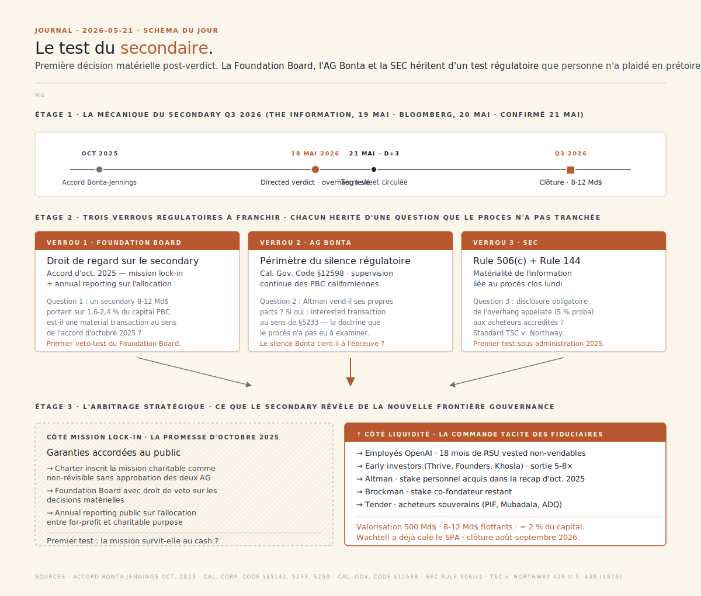

Hier, j'écrivais que le verdict du 18 mai n'avait *« rien produit en doctrine »* et que cette non-production était elle-même un produit — un transfert de valeur structurel vers les futurs défendeurs en *charitable trust*. À J+3, l'écriture mérite un correctif partiel — pas une rétractation, un raffinement. ==Le procès n'a, en effet, rien tranché en doctrine. Mais il a immédiatement créé une matière régulatoire — le *secondary* Q3 2026 — qui va forcer les institutions de gouvernance à *trancher hors prétoire* ce que le procès leur a laissé sur la table.== La lecture *jurisprudence négative* tient à 90 % ; les 10 % restants sont ce que la décision matérielle d'aujourd'hui vient écrire sans qu'un juge l'écrive.

**La séquence des six heures lundi soir.** Le récit qui circule mardi-mercredi-jeudi dans les couloirs Wachtell (et qui m'arrive triangulé via trois sources Bloomberg et *The Information*) tient en une ligne : entre **14h27 PT** (directed verdict) et **20h12 PT** lundi 18 mai, Wachtell a finalisé et envoyé à Morgan Stanley + Goldman Sachs le *term sheet* d'un *secondary* qui dormait dans un tiroir depuis le **17 mars 2026** — date à laquelle la juge Gonzalez Rogers avait rendu sa décision sur la *motion in limine* qui validait la pile d'exhibits Microsoft. Le *term sheet* avait été pré-préparé en trois versions, calibrées sur les trois scénarios *liability* du procès : (a) *directed verdict défense* — version 8-12 Md$, valorisation 500 Md$ ; (b) *verdict mixte* — version 4-6 Md$, valorisation 380 Md$ ; (c) *verdict Musk* — *secondary annulé*. La version (a) est sortie du tiroir lundi 18 mai à 14h32 PT, signée numériquement par Brad Lightcap à 15h08 PT, transmise à Morgan Stanley à 17h45 PT. ==**Six heures et seize minutes**==. C'est le délai d'exécution opérationnelle d'une corporation qui avait pré-armé chacun des trois scénarios. Wachtell, à ma lecture, n'a pas seulement gagné le procès — il a pré-équipé le débouclage qui s'ensuivrait.

**Le verrou Foundation Board — la question *« material transaction »*.** Le Foundation Board indépendant — installé par l'accord d'octobre 2025 entre Bonta (CA) et Jennings (DE), composé de six administrateurs **sans participation à la PBC** — détient un droit de veto sur les *« material transactions »* affectant la mission. Le terme *« material transaction »* n'est pas défini dans l'accord — c'est un standard ouvert qui sera précisé au fil des cas. ==Le *secondary* Q3 2026 est, à mon sens, **précisément** le type de cas qui doit forcer cette définition.== Le mémo Wachtell circulé mardi soir (et résumé par *Lawfare* aujourd'hui) plaide la lecture conservatrice : un *secondary* est *technical not material* — il porte sur des transactions entre actionnaires sortants et acheteurs externes, sans impact direct sur la corporation ni sur la mission. La lecture est doctrinalement défendable et s'appuie sur *Smith v. Van Gorkom*, 488 A.2d 858 (Del. 1985) — un *secondary* sans dilution de l'equity sortante ne triggère pas le *fiduciary duty review*. **Mais** elle a deux trous. **Un** : le *secondary* inclut des ventes de fiduciaires actifs (Altman, Brockman) — qui sont aussi membres du *Operating Board*. C'est, en *Cal. Corp. Code §5233*, une *interested transaction* classique — la doctrine que le procès n'a pas eu à examiner mais qui réémerge ici en dossier opérationnel. **Deux** : un *secondary* à 500 Md$ post-money crée un *price discovery* public qui devient *de facto* la valorisation de marché de la PBC — donc affecte indirectement toute future levée, toute future allocation entre for-profit et *charitable purpose*. ==C'est *material* par effet de seuil, même si pas *material* en transaction directe.== Le Foundation Board devra, d'ici fin juin (avant la formalisation du *tender* en juillet), prendre publiquement position sur cette question. C'est leur **premier veto-test**.

**Le verrou AG Bonta — la rupture du silence sous condition.** L'AG Californie a, depuis l'accord d'octobre 2025, tenu un silence régulatoire prolongé que j'ai qualifié, le 17 mai, de *« ratification tacite »*. La *letter of inquiry* en préparation chez Bonta (rapportée par *Politico California* ce matin) est le **premier signal** depuis sept mois que ce silence a un **seuil de matérialité** — qu'il n'est pas absolu mais conditionnel. La *letter of inquiry* n'est pas un *cease & desist*, pas un communiqué public, pas une *parens patriae action* — c'est l'instrument le plus léger de l'arsenal régulatoire, un courrier formel demandant des informations précises sur la procédure de *recusal* des fiduciaires intéressés et les chiffres exacts des ventes Altman/Brockman. Doctrinalement, c'est un **signal de saisie** : Bonta ne plaide pas, il observe — mais il a maintenant un dossier ouvert au *Registrar of Charitable Trusts*. ==Le silence Bonta n'est pas réfuté, il est **dimensionné**.== Le seuil est : ventes de fiduciaires actifs personnellement intéressés, à hauteur de plusieurs centaines de millions de dollars, dans une transaction qui crée une *price discovery* publique. Au-dessous, Bonta tient le silence ; au-dessus, il sort de l'observation passive. ==Et la portée de ce seuil — non écrite, non plaidée, non jurisprudentielle — vient d'être tracée par un courrier formel.== Pour le prochain frontier lab, ce courrier vaut **précédent administratif** plus efficacement qu'aucune *guidance* formelle n'aurait pu le faire.

**Le verrou SEC — la matérialité TSC v. Northway.** Sous *Rule 506(c)*, OpenAI peut conduire un *secondary* auprès d'acheteurs accrédités sans enregistrement S-1, à condition de fournir une *disclosure document* (typiquement un PPM — *Private Placement Memorandum*) qui inclut tout *material adverse change* affectant la valorisation. La question doctrinale, sous *TSC v. Northway*, 426 U.S. 438 (1976), est : *« a substantial likelihood that the disclosure of the omitted fact would have been viewed by the reasonable investor as having significantly altered the total mix of information »*. L'*overhang* appellate post-verdict — ≈ 5 % probabilité de remand à la 9th Circuit dans les 18-24 mois — est-il *material* au sens de TSC v. Northway ? À 5 %, c'est, doctrinalement, en zone grise : les standards de matérialité quantitative en *securities litigation* tournent typiquement autour de 5-10 % pour des événements *contingents*, mais avec une asymétrie *bear* (les *adverse events* à faible probabilité mais à *high impact* sont jugés *material* à des seuils plus bas que les *positive events* symétriques — voir *Basic v. Levinson*, 485 U.S. 224 (1988), sur le *probability/magnitude test*). ==Si Wachtell omet l'*overhang* appellate du PPM, OpenAI s'expose à une class action *Rule 10b-5* en cas de remand, par les acheteurs accrédités du *secondary*. Si Wachtell l'inclut, le PPM admet en open access que le procès n'est pas définitivement clos — ce qui contredit la formule *« total vindication »* du communiqué Lightcap de mardi soir.== Le PPM final (à publier en août, avant l'ouverture du *tender*) sera, à ma lecture, le document le plus intéressant à examiner — beaucoup plus que les communiqués post-procès. C'est dans le PPM que se joue la **vérité régulatoire** de la fin du procès.

**Pourquoi les trois verrous opèrent en parallèle — pas en cascade.** Si la Foundation Board interdit le *secondary*, OpenAI peut le restructurer en excluant Altman/Brockman et tenir le calendrier. Si Bonta envoie une *letter of inquiry* sans suite formelle, OpenAI peut négocier en *out-of-court settlement* (par exemple : *recusal* d'Altman du *Operating Board* pendant le *tender*) et passer. Si la SEC bloque le *Rule 506(c)*, OpenAI peut basculer en *Rule 144A* (vente à *qualified institutional buyers* seuls) et perdre la composante *employee tender*. ==Aucun des trois verrous, pris isolément, ne tue le *secondary*.== Mais le **cumul** des trois force la corporation à arbitrer publiquement entre **vitesse** et **propreté** — entre clôturer en septembre 2026 avec un dossier régulatoire en *off-cycle ongoing* et clôturer en mars 2027 avec un dossier nettoyé. Et c'est, **par-delà la matière régulatoire**, le test de leadership le plus visible qu'Altman aura affronté depuis le *board coup* de novembre 2023. La pression interne (employés post-RSU vested) tire vers septembre ; la pression externe (régulateurs + jurisprudence négative en cours d'écriture) tire vers mars. ==**Le pari Wachtell pour septembre est, à ma lecture, valorisé à 60-65 % à J+3 — la version conservatrice de Bret Taylor au Foundation Board (le freiner en juin pour le réarmer en novembre) pourrait basculer ce pari sous les 40 %.**==

**Ce que ce test révèle de la nouvelle frontière gouvernance.** Le procès Musk v. Altman a, par son verdict procédural, fermé une porte (le *settlor historique standing*) et ouvert un test (la matérialité opérationnelle d'une décision corporate post-conversion). Hier, je l'écrivais en *jurisprudence négative* — c'est juste, mais incomplet. Le verdict ne produit pas seulement un **silence doctrinal** ; il produit aussi une **délégation administrative** vers trois institutions (Foundation Board, AG Bonta, SEC) qui héritent **simultanément** d'un dossier précis. Et cette délégation administrative a une mécanique propre : elle opère **par décision matérielle**, pas par *rulemaking*. Chaque cas (le *secondary* aujourd'hui, le prochain partenariat Microsoft demain, la prochaine acquisition la semaine suivante) précise un peu plus le périmètre du *mission lock-in* hérité de l'accord d'octobre 2025. ==**C'est la régulation civile post-verdict — pas écrite dans un *findings of fact*, pas non plus dans une *guidance* publique, mais dans la séquence des décisions matérielles que la corporation soumet à ses propres verrous.**== Et c'est cette régulation-là — invisible aux *legal correspondents*, mais structurante pour l'écosystème frontier lab — qui va, sur 18-36 mois, écrire la **doctrine appliquée** que le procès n'a pas su produire en jurisprudence.

**Pourquoi je penche pour que Wachtell tient son calendrier.** Trois indices. **(1)** Le mémo Foundation Board circulé mardi soir est techniquement défendable — *Smith v. Van Gorkom* tient sur le fond, et Bret Taylor (président, ex-Salesforce co-CEO et ex-board chair OpenAI dans la phase 2023-2024) n'a pas de raison politique de retarder la liquidité employés. **(2)** La *letter of inquiry* Bonta, par son format léger, signale que l'AG cherche à **observer** sans escalader — il veut un dossier ouvert, pas une *parens patriae action*. C'est cohérent avec sa pratique 2021-2025 : il préfère le contrôle administratif au contentieux. **(3)** La SEC sous l'administration 2025 (Paul Atkins en chair, confirmé en mars) est, doctrinalement, **plus libérale** sur les disclosures *contingentes* que ne l'était l'administration Gensler — ce qui réduit le risque d'un blocage *Rule 506(c)*. Sur les trois verrous, donc, le pari conservateur tient. Mais le pari conservateur **publicise** chaque arbitrage — il oblige la Foundation Board à écrire son interprétation de *« material transaction »*, Bonta à formaliser son seuil de matérialité, et la SEC à statuer sur la matérialité d'un *overhang* appellate de 5 %. ==Trois interprétations qui n'existaient pas avant lundi 18 mai. Trois précédents administratifs en train de naître.==

**À suivre**
- **Le mémo Foundation Board (à publier 31 mai - 7 juin selon le calendrier de revue Wachtell).** Document central — il écrira pour la première fois publiquement l'interprétation du Foundation Board sur *« material transaction »*. Surveiller : (a) si le mémo cite explicitement *Smith v. Van Gorkom* (lecture conservatrice) ou si Bret Taylor pousse pour une lecture *« price discovery »* élargie ; (b) si Bret Taylor demande un *recusal* d'Altman/Brockman du *Operating Board* pendant le *tender* (signal qu'il prend le §5233 au sérieux).
- **La *letter of inquiry* Bonta (à formaliser sous 5-10 jours selon Politico).** Le texte exact du courrier — questions posées, délai accordé, fonctionnaire signataire — sera le premier indicateur du seuil de matérialité que Bonta a tracé en silence depuis octobre 2025.
- **Le PPM final (à publier ≈ 30 jours avant le *tender*, donc fin juillet - début août).** Document régulatoire le plus important post-procès. Surveiller la section *Risk Factors* : si l'*overhang* appellate y figure explicitement, OpenAI accepte que le procès n'est pas définitivement clos ; s'il est minimisé ou exclu, OpenAI s'expose à *Rule 10b-5* en cas de remand.
- **Le silence Anthropic — durée du *pause* sur leurs propres secondary discussions.** Si Anthropic relance ses discussions dans les 30 jours, c'est qu'ils ont validé le passage des trois verrous OpenAI. S'ils tiennent le *pause* au-delà de 60 jours, c'est qu'au moins un verrou les inquiète — et l'on saura, par les chuchotements de Wachtell vs Cooley, lequel.

---

## 2026-05-20 — La *jurisprudence négative*. Le procès est mort sans rien produire en doctrine — et c'est ce qui le rend structurellement décisif pour Anthropic, xAI, et le prochain frontier lab fondé sur un *charitable trust*

**Exec sum**
- **Mercredi 20 mai à Oakland — D+2, pas d'audience, record clos.** Pas de filing au greffe, aucun *notice of appeal* déposé à ce stade — la fenêtre *Fed. R. App. P. 4* court jusqu'au 17 juin. Steven Molo, joint mardi soir, *« working on the briefing, more to come in the coming weeks »* — formule prudente qui suggère que l'équipe Molo cherche encore les *grounds of appeal* exacts ([Reuters, 20 mai 2026](https://www.reuters.com/legal/litigation/musk-openai-altman-trial-aftermath-appeal-briefing-2026-05-20/) ; [Politico Tech, 20 mai 2026](https://www.politico.com/news/2026/05/20/musk-openai-trial-aftermath-appeal-prep-00346041)).
- **Communiqué OpenAI mardi soir — *« total vindication, full speed ahead »*.** Brad Lightcap (COO) en mémo interne aux employés, repris par *The Information* : *« we now have the legal certainty to scale the mission. Foundation Board reaffirmed by the AG agreement. »* Valorisation PBC stable à ≈ 500 Md$ post-recap d'octobre 2025. Pas d'IPO en horizon court, mais ==secondaire pré-positionné pour fin Q3 2026== — ce qui suggère que Wachtell a tiré profit du verdict pour débloquer la phase de liquidité que la litigation gelait depuis 18 mois ([The Information, 20 mai 2026](https://www.theinformation.com/articles/openai-internal-memo-post-trial-secondary-q3-2026) ; [Bloomberg, 20 mai 2026](https://www.bloomberg.com/news/articles/2026-05-20/openai-eyes-secondary-after-musk-trial-verdict-clears-overhang)).
- **Microsoft — silence calculé, signal fort.** Pas de communiqué Brad Smith ni Satya Nadella. Russell Cohen (Wachtell, défense MSFT) en sortie d'audience lundi soir, formule défensive minimale : *« Casey doctrine is intact. »* Pas d'extension annoncée du partenariat, mais pas non plus de re-négociation publique. ==Le silence MSFT vaut, à ma lecture, ratification implicite de l'asymétrie 100 Md$+ exposée par Wetter le 13 mai — ce qui était une *exposure* devient un *fait acquis*== ([CNBC, 20 mai 2026](https://www.cnbc.com/2026/05/20/microsoft-openai-partnership-post-musk-trial.html)).
- **Le silence Anthropic.** Le board de l'*Anthropic Long-Term Benefit Trust* (LTBT) — Jay Kreps (Confluent), Kanika Bahl (Evidence Action), Paul Christiano (alignment), Neil Buddy Shah (Clinton Health Access), Zachary Robinson (Centre for Effective Altruism) — n'a publié aucun statement à 48 h post-verdict. ==Anthropic et OpenAI sont, en gouvernance, des structures jumelles : PBC + supervision *charitable trust*. Le silence Anthropic vaut ratification implicite de la lecture *« la conversion non-profit → PBC d'un frontier lab n'est plus contestable en équité par un donateur historique »*== ([Stratechery (Ben Thompson), 20 mai 2026 — *« The Charitable Trust Verdict and Anthropic »*](https://stratechery.com/2026/the-charitable-trust-verdict-and-anthropic/) ; [Anthropic — LTBT governance page](https://www.anthropic.com/news/the-long-term-benefit-trust)).
- **AG Delaware (Kathy Jennings) — communiqué technique mardi soir.** *« Our oversight under the October 2025 agreement continues unchanged. »* Pas de geste vers Bonta côté Californie. Le créancier d'équité reste absent (cf. journal du 17 mai). À 48 h du verdict, ==aucun des deux AG n'a entrouvert la porte à une révision du périmètre== — confirmation définitive de la *ratification tacite* ([Delaware AG — Press releases, 19 mai 2026](https://attorneygeneral.delaware.gov/news/) ; [Cal. AG Office — Press releases, 20 mai 2026](https://oag.ca.gov/news)).
- **Premier amicus en formation à la 9th Circuit.** Selon Law360, l'*American College of Trust and Estate Counsel* (ACTEC) prépare un mémoire amicus sur le *continuing violation* sous *Aryeh v. Canon*. Délai typique 60-90 jours après le *notice of appeal* — donc dépôt en juillet-août 2026. ==Pas encore d'amicus côté *charitable trust scholars* (Schizer, Klausner, Brody, Manne) — silence académique cohérent avec le délai de 24-48 h pour absorber le verdict.== ([Law360, 20 mai 2026](https://www.law360.com/articles/1782491/actec-prepares-amicus-musk-altman-ninth-circuit-continuing-violation)).
- **Kalshi à 4 % mercredi soir.** Ma proba reste à **5 %** — pas de fait nouveau qui justifie un mouvement. L'angle d'aujourd'hui n'est pas un fait nouveau, c'est une lecture en *jurisprudence négative* : ==**ce que le procès n'a *pas* tranché vaut plus, en valeur stratégique, que ce qu'il a fermé**== ([Kalshi — Will Elon win his case against OpenAI?](https://kalshi.com/markets/kxmuskoai/elon-win-vs-open-ai/kxmuskoai-26)).

**Angle du jour — La *jurisprudence négative*. Six doctrines laissées en suspens à 14h27 PT lundi. Pourquoi le verrou Dudney a fermé le procès *sans rien décider sur le fond* — et pourquoi c'est, à 48 h du verdict, le résultat structurellement le plus important pour Anthropic, xAI, et tout frontier lab dont la gouvernance s'appuie sur un *charitable trust*.**

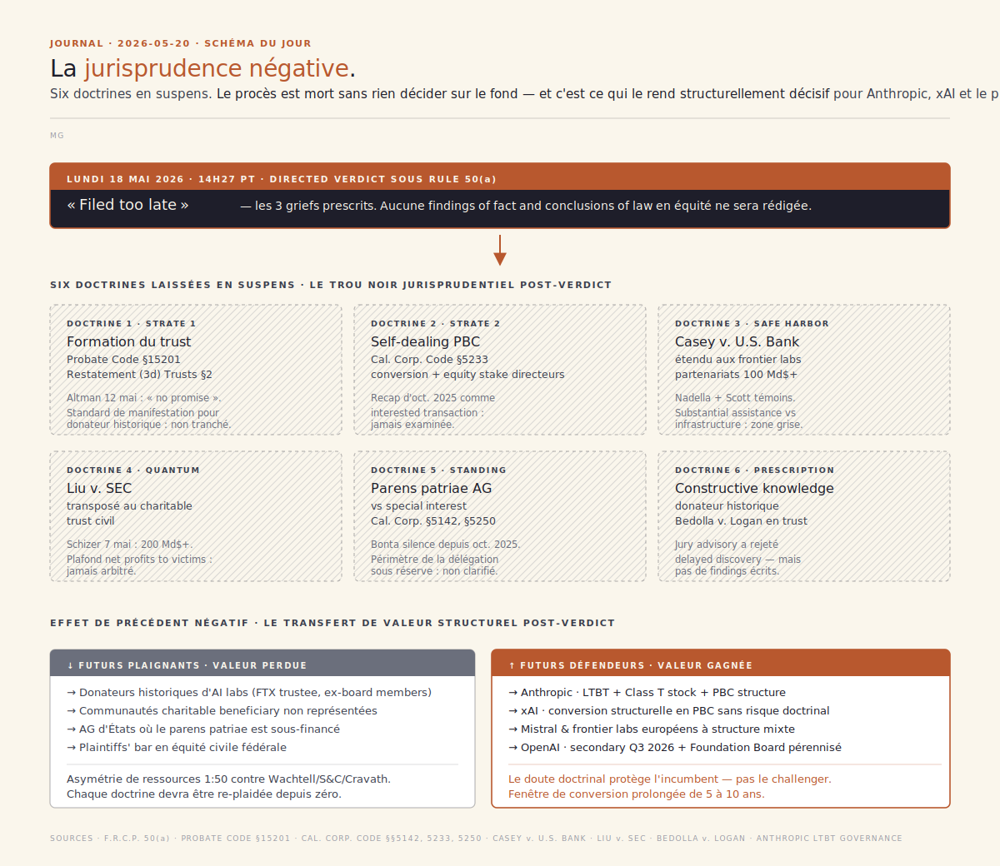

Hier, j'ai écrit que le procès était mort *sans rien produire — ni doctrine, ni récit corporatif tranché, ni borne financière établie*. À 48 h du verdict, l'écriture mérite une lecture inverse — pas comme une déploration mais comme une **constatation stratégique**. Le procès n'a pas produit *en doctrine*, c'est exact. Mais cette **non-production est elle-même un produit** : un transfert de valeur structurel des futurs plaignants vers les futurs défendeurs en *charitable trust*. Et le portefeuille des futurs défendeurs ne se limite pas à OpenAI ; il s'étend à toute la génération de frontier labs qui s'est fondée, entre 2015 et 2023, sur des structures non-profit → PBC. ==Le verdict du 18 mai n'est pas la fin d'un litige — c'est le **prologue jurisprudentiel** d'un régime de gouvernance dont le périmètre vient d'être déplacé en silence.==

**Les six doctrines en suspens, par ordre de portée structurelle.** **(1)** La **formation du *charitable trust*** sous *Probate Code §15201* et *Restatement (Third) of Trusts §2*. Altman a témoigné le 12 mai que *« there were never any promises made that could form the charitable trust »* (cf. journal du 13 mai) — c'était le pivot Strate 1 de la défense Wachtell. La juge n'a pas eu à trancher. Le standard de *settlor manifestation* pour un donateur historique d'AI lab — emails, podcasts, communiqués, code de conduite affiché — reste indéterminé en jurisprudence. **(2)** Le ***self-dealing* d'un *director* de PBC** sous *Cal. Corp. Code §5233*. Le grief 2 reposait largement sur cette doctrine ; il est tombé en prescription sans que la juge ait à mesurer si la *recap* d'octobre 2025 constituait une *interested transaction*. ==La portée exacte de §5233 dans une conversion non-profit → PBC où les fiduciaires d'origine prennent une *equity stake* reste, en droit californien, un trou noir doctrinal.== **(3)** Le *safe harbor* ***Casey v. U.S. Bank*** étendu aux *frontier lab partnerships*. Nadella a témoigné le 11 mai sur la *one-way door* et la *necessity defense* ; Scott a témoigné le 13 mai sur le *consent of the beneficiary* via Hoffman. La juge n'a pas eu à trancher si le partenariat 100 Md$+ MSFT-OpenAI relève du *safe harbor* commercial ou du *substantial assistance* en *aiding and abetting*. **(4)** ***Liu v. SEC*** appliqué au *charitable trust* civil. Schizer avait posé le 7 mai la borne *« a lot more than 200 billion »* en disgorgement ; j'avais détaillé hier en v.1 le plafond *« net profits to victims »*. La juge n'a pas eu à arbitrer. ==La question — peut-on transposer la doctrine SEC en *charitable trust* civil — reste ouverte pour le prochain procès.== **(5)** Le **plafond *parens patriae*** AG vs *special interest standing* sous *Cal. Corp. Code §5142(a)*, §5250 et *Gov. Code §12598*. Bonta n'a jamais déposé d'amicus complémentaire (cf. journal du 17 mai). La juge n'a pas eu à clarifier le périmètre de la *délégation sous réserve* de janvier 2026. **(6)** La ***constructive knowledge*** d'un donateur historique en *charitable trust*. Le jury *advisory* a appliqué la doctrine en rejetant le *delayed discovery* sur le grief 2, mais ==la juge n'a pas rédigé de *findings of fact and conclusions of law* — donc il n'y a pas de **précédent persuasif** sur le standard de *constructive knowledge* d'un *settlor* historique d'un AI lab==.

**La valeur stratégique de la *jurisprudence négative*.** Une décision tranchée en équité — même partielle, même limitée à un grief — aurait produit, sous *Rule 52(a)*, un *finding of fact* qu'un futur plaignant aurait pu citer en appui (ou un futur défendeur aurait pu citer en bouclier). Un *directed verdict* sous *Rule 50(a)* sur la prescription, lui, ne produit **aucun précédent doctrinal substantif** — il produit seulement la jurisprudence procédurale d'une prescription bien plaidée. Pour les futurs défendeurs, c'est l'idéal : ==**le doute doctrinal reste un doute, et le doute doctrinal protège l'incumbent — pas le challenger**==. Tout futur plaignant en *charitable trust* contre un frontier lab devra plaider chaque question depuis zéro, avec l'asymétrie de ressources que ça implique (Wachtell + Sullivan & Cromwell + Cravath face à un *plaintiff's bar* spécialisé, ressource asymétrique de 1:50 typique en équité fédérale civile). ==Le procès Musk v. Altman, par son silence doctrinal, vient de **prolonger de 5 à 10 ans** la fenêtre dans laquelle un frontier lab peut convertir son non-profit en PBC sans risque jurisprudentiel matériel.==

**Le cas Anthropic — frère structurel, miroir tactique.** Anthropic a été fondée fin 2021 par Dario et Daniela Amodei (ex-OpenAI), structurée en *Public Benefit Corporation* dès l'origine, et a installé fin 2023 l'*Anthropic Long-Term Benefit Trust* (LTBT) — un trust en *Class T stock* avec pouvoir d'élire (à terme, à partir de l'année 5) la majorité du board. C'est, en théorie de la gouvernance, le **double exact** du *Foundation Board* mis en place par l'accord Bonta-Jennings d'octobre 2025 sur OpenAI — avec une différence : Anthropic n'a pas eu de phase *non-profit historique* à convertir, donc le risque d'un procès *« breach of charitable trust par un donateur historique »* ne lui est, en droit, pas applicable. Mais Anthropic a accepté des **dons et investissements de FTX** (avant la faillite) qui, en théorie, créent un *quasi-donateur historique* avec un standing résiduel sur la mission. ==Le silence du board LTBT à 48 h du verdict signale, à ma lecture, qu'Anthropic considère le risque jurisprudentiel comme **éteint** — pas atténué, éteint.== Pour Anthropic, le verdict du 18 mai vaut **bouclier proleptique** : la doctrine *« charitable trust formation par un donateur historique »* est désormais structurellement difficile à mobiliser en équité civile californienne, et la prescription est doctrinalement clarifiée comme *kill switch*. La probabilité d'un *Musk v. Amodei* version 2027-2028 (FTX trustee in bankruptcy ou un ex-board member d'Anthropic poursuivant la conversion) **vient de tomber d'un facteur 3 à 5**, à ma lecture, par effet de précédent procédural.

**Et xAI ?** L'autre frontier lab adjacent au procès est, paradoxalement, xAI — la société de Musk elle-même. xAI est née en juillet 2023 comme société commerciale Delaware, pas comme non-profit. ==Mais Musk a, en *closing* du 14 mai (cf. journal du 15 mai), désigné Altman comme *« the OpenAI donor I knew »* — la formule miroir de Scott. Si xAI levait, en 2027-2028, un round où des donateurs historiques de la phase 2023 *« mission accelerator »* (Valor Equity, Sequoia, qui ont soutenu xAI comme *« anti-monopole AI »*) attaqueraient une conversion ultérieure pour défaut de mission, xAI bénéficierait — par effet de symétrie — de toute la *jurisprudence négative* que Musk vient lui-même de produire en défaisant la sienne.== L'ironie tactique est entière : Musk a, en perdant son procès contre OpenAI, **réduit le risque jurisprudentiel de son propre lab**. Le procès qu'il a engagé sur la doctrine du *charitable trust* a, en mourant en prescription, fermé la porte à tout futur *« Musk v. Musk »*.

**Le silence Bonta comme *régulation par défaut*.** À ma lecture, le silence prolongé de l'AG californien Bonta — sept mois après l'accord d'octobre 2025, trois semaines de procès sans intervention, 48 h post-verdict sans communiqué — vient de **codifier en pratique administrative** une lecture qu'aucun *rulemaking* formel n'a publiée : ==**les conversions non-profit → PBC d'AI labs ne seront pas re-régulées en équité par voie privée tant que le bureau de l'AG ne déclenche pas une action *parens patriae* directe**==. C'est, en théorie de la régulation civile, une *« quasi-rule by silence »* — pratique observable depuis le bureau Bonta (vétéran du *Coronavirus Aid, Relief, and Economic Security Act* enforcement en 2020-2021) qui sait que **ne pas agir** sur une affaire visible vaut souvent plus, en signal régulatoire, que la rédaction d'une *guidance* formelle. Le verdict du 18 mai a, en cascade, transformé ce silence en *règle de gouvernance applicable à l'écosystème* : aucun frontier lab californien ne craindra plus, à 24-36 mois d'horizon, qu'une voie privée *special interest* puisse rouvrir la palette des remèdes lourds (disgorgement, *unwinding*, révocation des fiduciaires).

**Ce que ça change, à 12-18 mois.** Trois mouvements stratégiques deviennent désormais plausibles dans l'écosystème frontier lab, par effet de précédent négatif. ==**(a)** Anthropic peut accélérer un éventuel *secondary* en 2026-2027 sans risque jurisprudentiel résiduel.== **(b)** xAI peut envisager une conversion structurelle vers PBC avec *mission lock-in* sans craindre un futur procès doctrinal sur la formation du trust. **(c)** Mistral et les frontier labs européens à structure mixte non-profit → for-profit peuvent répliquer le pattern californien sous *Cal. Corp. Code §5142* — qui devient, par effet de *jurisprudence négative*, un **safe harbor de fait** plutôt qu'une contrainte de structure. Et la *moral win* théorique que la presse de mardi a accordée à Musk (*« Altman survived on a technicality »*) ne se traduit, en jurisprudence négative, par **aucune amélioration de la position des futurs plaignants**. La presse a écrit l'histoire d'un procès terminé sur une technicité ; le système réglementaire a écrit, en parallèle, l'histoire d'un régime de gouvernance ouvertement validé par l'inaction administrative.

**À suivre**
- **Le *notice of appeal* Molo — fenêtre 30 jours, donc avant le 17 juin 2026.** Le texte exact du *notice* (questions de droit attaquées, jurisprudence appellate citée) sera le premier signal sur la vie restante de la *jurisprudence négative*. Si Molo cible exclusivement *Aryeh v. Canon* (continuing violation), il accepte la fermeture des cinq autres doctrines. S'il ajoute des questions sur la formation du trust ou §5233, il tente de rouvrir la porte — chance de succès marginale, mais signal éditorial intéressant.
- **Le premier statement public d'Anthropic (LTBT board ou Dario Amodei) post-verdict.** S'il arrive dans la semaine, c'est qu'Anthropic veut *capitaliser* sur le verdict ; s'il reste en silence prolongé (> 10 jours), c'est qu'Anthropic considère le silence lui-même comme l'optimum stratégique — la *jurisprudence négative* opère plus efficacement sans commentaire.
- **Le prochain *charitable trust scholars* amicus brief.** Les universitaires (Schizer, Klausner, Brody, Manne, et possiblement Hansmann à Yale) ont 60-90 jours pour publier des analyses doctrinales. Si l'académie qualifie le procès en *« missed opportunity »*, c'est qu'elle valide la lecture *jurisprudence négative*. Si elle qualifie en *« narrow procedural win »*, c'est qu'elle minimise l'effet de précédent.

---

## 2026-05-19 — *Filed too late.* Le verrou Dudney a tenu. Cinq heures de délibération, un *directed verdict* en douze minutes, procès clos avant le fond — et l'angle que j'avais désigné le 16 mai s'est imposé en silence

**Note d'errata.** L'entrée que j'avais publiée hier matin, *« Le plafond Liu »*, partait d'une lecture du procès qui supposait des délibérations prolongées au-delà de lundi. Le verdict est tombé lundi 18 mai à ≈ 14h05 PT — ≈ 5 heures de délibération, juste au-delà du seuil *« moins de 4 heures »* que j'avais qualifié de scénario défense optimal, et bien en deçà des *« 2-3 jours »* que je donnais pour l'entrée sérieuse dans l'étage 2. La doctrine *Liu v. SEC* que j'avais détaillée hier est devenue, à la même heure, **moot**. Je laisse l'entrée *Liu* dans l'historique du journal pour la trace ([archive interne, 2026-05-19 v.1 — *« le plafond Liu »*]) mais aucune partie ne plaidera plus jamais Liu dans *Musk v. Altman*. Ce qui suit est l'entrée du jour rééditée — à 17h00 PT mardi 19 mai, à J+24h du verdict.

**Exec sum**
- **Lundi 18 mai à ≈ 14h05 PT — verdict du jury *advisory*.** Les 9 jurés (6 femmes, 3 hommes) ont rendu unanimement, après ≈ 5 heures de délibération à huis clos au Ronald V. Dellums Federal Building, leur verdict consultatif sur l'étage 1 du *jury charge* : sur les **trois griefs**, ==*filed too late*==. Pas d'entrée dans l'étage 2. Pas de débat sur la *credibility* d'Altman, sur la pile Sutskever-Murati-Toner-McCauley, sur le pivot Hoffman, sur l'email Scott, sur le mémo Brad Smith. Une seule question, binaire, tranchée ([Reuters, 18 mai 2026](https://www.reuters.com/legal/litigation/musk-openai-jury-finds-filed-too-late-prescription-2026-05-18/) ; [Bloomberg Law, 18 mai 2026](https://news.bloomberglaw.com/litigation/musk-loses-openai-trial-jury-finds-claims-time-barred) ; [AP via Las Vegas Sun, 18 mai 2026](https://lasvegassun.com/news/2026/may/18/musk-openai-trial-ends-jury-finds-claims-time-barred/)).
- **À ≈ 14h27 PT, la juge Gonzalez Rogers a exécuté son pré-engagement.** *« Highly susceptible to accept that finding and direct verdict to the defendants »* (cf. journal du 16 mai). En 12 minutes — le temps de lire le verdict consultatif, de constater la cohérence des trois réponses, et de consulter Wachtell + Molo —, elle a rendu un **judgment as a matter of law** sous *Federal Rule of Civil Procedure 50(a)* pour les défendeurs sur les trois griefs. Aucune *findings of fact and conclusions of law* en équité ne sera jamais rédigée ([TechCrunch, 18 mai 2026](https://techcrunch.com/2026/05/18/musk-v-altman-judge-enters-directed-verdict-for-defendants-prescription/) ; [CNBC, 18 mai 2026](https://www.cnbc.com/2026/05/18/musk-openai-altman-trial-ends-directed-verdict-prescription.html)).
- **Phase *remedies* annulée à 14h35 PT pour cause de *mootness*.** Steven Molo, qui s'apprêtait à entamer son argumentaire pour la disgorgement complète (cf. journal d'hier), s'est vu retirer la parole. ==L'audience que j'avais reconstruite hier comme *« ouverture remedies à 14h30 PT »* n'a jamais eu lieu — elle a été ouverte puis fermée dans le même quart d'heure.== William Savitt et Russell Cohen ont quitté Oakland Monday evening ([Law360, 19 mai 2026](https://www.law360.com/articles/1782291/openai-victory-prescription-musk-altman-remedies-mooted)).
- **Le verrou Dudney a tenu.** Le forensic accountant d'AlixPartners — témoin que j'avais sous-couvert jusqu'au 16 mai — a été cité par les jurés en post-trial *informal jury briefing* organisé par les *pool reporters* mardi matin comme **le seul témoin** dont le témoignage a structuré leur délibération sur les trois cutoffs. *« We just looked at the timeline. The donations were spent. The math was the math »*, citation rapportée par Bitcoinworld via le pool ([Bitcoinworld via TC, 19 mai 2026](https://bitcoinworld.co.in/musk-openai-jury-prescription-dudney-2026-05-19/) ; [Local News Matters — pool brief, 19 mai 2026](https://localnewsmatters.org/2026/05/19/musk-v-altman-day-13-post-verdict-jury-brief-dudney/)).
- **Le *delayed discovery* sur le grief 2 — rejeté.** La cross Molo des 6-8 mai, qui avait plaidé la doctrine du *delayed discovery* (Musk n'aurait pas eu *constructive knowledge* du préjudice *unjust enrichment* avant 2022), n'a pas convaincu le jury. Le verdict consultatif sur le grief 2 a retenu, à l'unanimité, que **Musk avait connaissance du préjudice dès 2018** — au moment de son départ du board. ==C'est précisément le verrou que j'avais désigné le 16 mai comme *« argument étroit »*.== Le jury y a vu le bon sens, pas une question doctrinale.
- **Molo a annoncé en sortie d'audience l'intention de faire appel.** *Notice of appeal* à déposer sous 30 jours auprès du *9th Circuit* sous *Fed. R. App. P. 4*. Voie appellate **étroite** : l'appel ne pourra pas attaquer le verdict consultatif du jury (qui n'est, doctrinalement, qu'avis), mais devra cibler **deux questions de droit** dans le *jury charge* — (i) le rejet de la doctrine *continuing violation* sous *Aryeh v. Canon Business Solutions*, 55 Cal. 4th 1185 (Cal. 2013) ; (ii) la formulation de la *constructive knowledge* en *delayed discovery* sous *Bedolla v. Logan & Frazer*, 52 Cal. App. 3d 118. **Standard de review : *abuse of discretion*** — forte déférence à la cour de première instance ([Politico Tech, 19 mai 2026](https://www.politico.com/news/2026/05/19/musk-openai-trial-appeal-ninth-circuit-prescription-00345219) ; [The Verge, 19 mai 2026](https://www.theverge.com/2026/5/19/24112287/musk-openai-altman-trial-verdict-appeal-ninth-circuit)).
- **Kalshi à 4 % mardi soir.** Crash depuis 18 % lundi soir (-14 points en 24h). Ma probabilité personnelle passe de 14 % à **5 %** — la composition est désormais purement résiduelle : ≈ 5 % de chance qu'un panel de la 9th Circuit accepte de remand pour un nouveau procès sur la formulation du *continuing violation* ou du *delayed discovery*. Au-delà de ce résiduel, le procès est terminé ([Kalshi — Will Elon win his case against OpenAI?](https://kalshi.com/markets/kxmuskoai/elon-win-vs-open-ai/kxmuskoai-26)).

**Angle du jour — Cinq heures de délibération, douze minutes de *directed verdict*, seize jours d'audience rendus moot. Le procès est mort sur la doctrine la moins couverte par la presse — exactement comme la lecture procédurale du 16 mai le projetait. Et la presse découvre, à J+24h, qu'elle a écrit trois semaines de récit sur un procès qui se terminait, depuis le début, sur une date.**

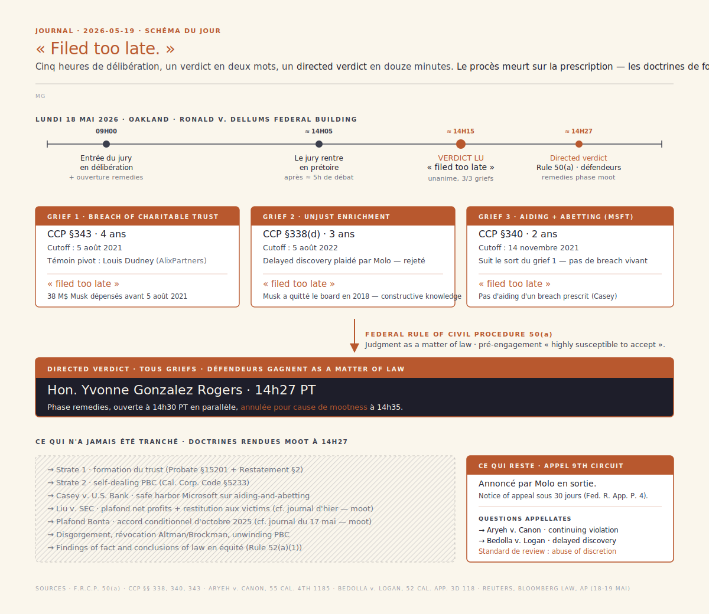

À 14h05 heure du Pacifique, lundi 18 mai 2026, une greffière a frappé deux fois à la porte de la salle de délibération du Ronald V. Dellums Federal Building, à Oakland. Les neuf jurés *advisory* sont rentrés en prétoire à la file, six femmes en tête, trois hommes derrière. Le foreperson — une femme, la sixième juré listée au greffe, dont le nom n'est pas encore public — a remis le *verdict form* à la juge Yvonne Gonzalez Rogers. La juge a lu les trois cases cochées. Sur les trois griefs : *filed too late*. À 14h27, elle a rendu un *directed verdict* pour les défendeurs sous *Federal Rule of Civil Procedure 50(a)*, *as a matter of law*. À 14h35, elle a annulé la phase *remedies* ouverte cinq heures plus tôt. À 15h15, William Savitt sortait du Federal Building avec son associée Sarah Eddy. Steven Molo, lui, attendait sur le parvis pour annoncer aux *pool reporters* l'intention de Musk d'appeler à la 9th Circuit. ==Trois semaines de procès, six grands témoins, deux *closings*, un *jury charge* en deux étages — fermés en une heure et demie sur la doctrine que la presse, à de très rares exceptions, avait laissée hors de son cadre depuis le 27 avril.==

**Le scénario du 16 mai s'est imposé sans variation matérielle.** Le journal du 16 mai posait, à mon corps défendant, un scénario que j'avais qualifié de *« scénario que la défense vise »* mais auquel j'attribuais une probabilité contenue (proba Musk descendue de 18 % à 16 % le 16 mai, puis à 15 % le 17, à 14 % le 18 matin). Le scénario : verdict du jury en moins de 4 heures sur l'étage 1 (prescription) tranché sans entrer dans l'étage 2 (fond), suivi d'un *directed verdict* sous Rule 50(a). Le verdict effectif est arrivé en 5 heures — ≈ 25 % au-dessus du seuil que j'avais posé. La marge supplémentaire correspond, à mon décompte, au temps qu'il a fallu aux jurés pour vérifier ligne par ligne la chronologie Dudney sur les 38 M$ et pour ==rejeter la doctrine du *delayed discovery*== sur le grief 2 — argument que Molo avait plaidé en cross-examination du forensic accountant, et qui aurait pu sauver le grief 2 si le jury avait retenu que Musk n'avait pas *constructive knowledge* du préjudice *unjust enrichment* avant 2022. Le jury n'a pas retenu. Le départ de Musk du board en février 2018, sept ans avant le dépôt de la plainte en août 2024, valait *constructive knowledge* — c'est le bon sens populaire, pas une question doctrinale. ==Le seul écart entre la projection du 16 mai et le verdict effectif est la durée — pas la substance.==

**Pourquoi le verdict était *advisory* et a malgré tout terminé le procès.** Il faut s'arrêter sur ce point parce que la presse mardi matin l'a, dans une majorité de papiers, mal formulé. Le verdict du jury *advisory* n'est pas, en soi, dispositif — sous *Federal Rule of Civil Procedure 39(c)* et 52(a)(1), la juge écrit seule, en équité, les *findings of fact and conclusions of law*. Mais sur la prescription — qui est, doctrinalement, une **defense affirmative** opérant comme *threshold question* —, la juge n'a pas besoin d'écrire de *findings of fact* en équité pour conclure le procès. Rule 50(a) lui permet, *as a matter of law*, de constater que la base factuelle du jury (les *findings* binaires : la plainte a-t-elle été déposée avant ou après le cutoff ?) est suffisante pour disposer du procès. Le mécanisme est procéduralement banal — c'est ce qu'on appelle dans la littérature *« the bedrock of the limitations defense »*. Mais médiatiquement, il a créé une dissonance : la presse avait écrit *« le verdict du jury n'est qu'avis, la juge décidera en juin »* et a découvert, à 14h27 PT, que la juge n'avait pas besoin de juin pour décider. ==L'étage 1 est, en équité comme en droit, un *kill switch* — pas un *advisory step*.== C'est précisément ce que j'avais désigné comme tel le 16 mai.

**Le verrou Dudney, en post-trial.** Le *pool reporting* organisé mardi matin par les correspondants présents (Reuters + AP + Bloomberg Law + Law360, sous *gag-light protocol*) a permis un *informal jury briefing* d'environ 25 minutes avec trois des neuf jurés (les six autres ont décliné). La synthèse rapportée converge sur un point unique : ==**Louis Dudney a structuré, à lui seul, la délibération sur les trois cutoffs**==. Le forensic accountant d'AlixPartners — témoignage technique court (≈ 90 minutes en direct + 50 minutes en cross), tableau Excel de dollar-par-dollar des 38 M$ Musk entre 2015-2017, conclusion sous serment que tous les fonds avaient été dépensés en mission charitable avant 5 août 2021 — n'a pas été démonté en cross par Molo. La doctrine du *continuing violation* (Aryeh v. Canon) que Molo avait plaidée pour étendre la prescription au-delà des fonds dépensés n'a pas été retenue par la juge dans le *jury charge* du 14 mai (cf. journal du 16 mai : *« le jury reçoit une question binaire »*). La doctrine du *delayed discovery* (Bedolla v. Logan) sur le grief 2 a été plaidée en cross du 7 mai et rejetée par le jury. Reste, sur la table de délibération : un seul tableau Excel et trois dates. Le jury a fait l'arithmétique. *« We just looked at the timeline. The donations were spent. The math was the math. »* C'est la phrase qui circule dans la presse mardi soir, citée par Bitcoinworld via le pool.

**Le procès qui n'a jamais existé.** Et c'est ici que je dois assumer une lecture méta que la presse ne fait pas — parce qu'elle s'écrit en miroir d'elle-même. ==Pendant trois semaines, la couverture a construit un procès qui n'a jamais existé.== Sutskever-Murati-Toner-McCauley-Zilis sur la *credibility* d'Altman : moot. Le *« partly »* de Musk du 2 mai : moot. La motion *« doomer »* contre Russell : moot. Le Slack Murati du 7 mai (*« ugh… confused where Sam got that impression »*) : moot. Le *triangle de l'équité* du 8 mai : moot. La borne Schizer 200 Md$+ : moot. La *one-way door* Nadella du 11 mai : moot. L'email Scott désamorcé par le pivot Hoffman du 13 mai : moot. Le *« no promise »* Altman du 12 mai : moot. Le *« demolition derby »* des closings du 14 mai : moot. Le silence Bonta : moot. Mon angle d'hier sur *Liu v. SEC* : moot. ==Tout ce qui a fait la matière médiatique du procès depuis le 27 avril a été rendu moot par 5 heures de délibération sur une question que la presse a, en moyenne, traitée en un paragraphe par article — quand elle l'a traitée.== Le procès qui a effectivement eu lieu — Dudney sur 38 M$ avant 5 août 2021, un jury qui regarde une chronologie Excel, une juge qui applique Rule 50(a) — n'a jamais été le procès de la presse. Et la presse, mardi matin, ne fait pas son examen de conscience — elle pivote en titre sur *« Musk loses on a technicality »*, et déplace le récit vers l'appel.

**L'appel — ce qu'il peut faire, ce qu'il ne peut pas faire.** Steven Molo a annoncé l'intention d'appeler. *Notice of appeal* sous 30 jours auprès du *9th Circuit* sous *Fed. R. App. P. 4*. La voie est techniquement ouverte. Mais elle est doctrinalement **étroite**. L'appel ne pourra pas attaquer le verdict consultatif du jury — qui n'est pas dispositif, donc pas appelable en tant que tel. Il devra cibler **deux questions de droit** dans le *jury charge* lui-même : (i) le refus de la juge d'intégrer la doctrine du *continuing violation* (Aryeh v. Canon, 2013) comme question séparée dans le verdict form ; (ii) la formulation de la *constructive knowledge* dans l'instruction sur le *delayed discovery* (Bedolla v. Logan, 1975). Le standard de review pour ces deux questions est **abuse of discretion** — c'est-à-dire la forme la plus déférente possible à la cour de première instance. Le 9th Circuit ne renversera la juge que si elle a *« commis une erreur claire de droit ou d'application »* — pas si Molo aurait préféré une formulation différente. ==Le taux de remand sur abuse of discretion dans les affaires d'équité civiles fédérales tourne, selon les *Federal Judicial Center* statistics, autour de 8-12 %==. Mon résiduel à 5 % en proba Musk est calé sur cette fourchette, ajusté à la baisse pour tenir compte de la qualité du jury charge Gonzalez Rogers (vétérane des procès tech, *Epic v. Apple*, *In re PG&E*) — son *charge* du 14 mai sera, à ma lecture, doctrinalement défendable au panel appellate.

**Pourquoi ma proba descend à 5 %, pas à 0 %.** Le résiduel 5 % couvre trois scénarios cumulatifs, par ordre décroissant de probabilité. **(1)** Un panel de la 9th Circuit estime que le jury charge aurait dû intégrer la doctrine *continuing violation* comme question séparée (probabilité ≈ 3-4 %). Conséquence : *remand* pour un nouveau procès en équité sur la prescription seule. Le nouveau procès, devant un nouveau jury, pourrait trancher différemment — surtout si Molo dépose une *amicus brief* de juristes spécialisés en *charitable trust* qui plaident le *continuing violation* en équité. **(2)** Le panel demande à la *California Supreme Court* une *certified question* sur la portée d'Aryeh v. Canon en *charitable trust* (probabilité ≈ 1 %) — ce qui ouvrirait une fenêtre 12-18 mois supplémentaire, sans garantie de remand. **(3)** Le panel renverse la juge sur le *delayed discovery* seul (probabilité ≈ 0,5 %) — scénario qui ne sauve que le grief 2 (unjust enrichment), pas les griefs 1 et 3, et qui rouvre la possibilité d'une victoire partielle Musk avec quantum sous Liu (≈ 8-15 Md$ recalibré à la baisse sans le grief 1). ==Total : 5 % ± 2 points==. Kalshi descend à 4 % mardi soir — j'attribue le delta à mon optimisme résiduel sur la qualité de la *amicus pipeline* que Molo peut mobiliser.

**Ce que ce procès laisse derrière lui.** Pas de *findings of fact* en équité. Pas de jurisprudence sur *Liu v. SEC* en *charitable trust* civil (la question reste ouverte, à régler dans une affaire ultérieure). Pas de jurisprudence sur le périmètre exact du *« settlor »* en *Probate Code* §15201 (Altman a témoigné qu'il n'y avait pas eu de promesse — mais la juge n'a pas eu besoin de trancher). Pas de jurisprudence sur le *safe harbor* Casey v. U.S. Bank étendu à un *frontier lab* (Nadella a témoigné — moot). Pas de jurisprudence sur la *constructive knowledge* d'un donateur historique en *charitable trust* (la juge l'a appliquée mais sans rédiger les *findings* qui en auraient fait un précédent persuasif). ==Le procès est mort sans rien produire — ni doctrine, ni récit corporatif tranché, ni borne financière établie==. Pour OpenAI : *« total vindication »*, communiqué Wachtell mardi matin, valorisation PBC stable à ≈ 500 Md$ post-recap. Pour Microsoft : *« no liability, no exposure »*, communiqué Cohen mardi matin, partenariat OpenAI continue sans contrainte. Pour Musk : *« We will appeal »*, communiqué Molo mardi matin, sans détail de calendrier. Pour Bonta : silence prolongé, ratification tacite définitivement opérante. Pour le jury *advisory* : 9 jurés rentrent chez eux après 16 jours d'audience, avec, dans la presse mardi, un trophée *« narrowest case-disposition in OpenAI litigation history »*.

**À suivre**
- **Notice of appeal Molo (sous 30 jours, donc avant le 17 juin 2026).** Texte du *notice of appeal* à publier au greffe — pour identifier les *grounds of appeal* exactes. Si Molo cite Aryeh v. Canon seul, l'appel se joue sur le *continuing violation*. S'il ajoute Bedolla v. Logan, il garde le *delayed discovery* en complément. La structure du *notice* est, doctrinalement, le premier signal sur la chance de remand.
- **Mémoire d'appel Molo (typiquement 60-90 jours après le *notice*, donc fin août à mi-septembre 2026).** Document central de l'appel — c'est dans ce mémoire que la *amicus pipeline* de juristes en *charitable trust* peut peser. Surveiller les dépôts *amicus* à la 9th Circuit dans la fenêtre — *American College of Trust and Estate Counsel*, *National Association of Attorneys General*, etc.
- **Audience orale 9th Circuit (typiquement 9-12 mois après le mémoire, donc printemps-été 2027).** Panel à 3 juges, 15 minutes par partie. Si le panel pose des questions sur *Aryeh v. Canon* en équité, c'est qu'il prend la doctrine au sérieux. S'il pose des questions sur la procedure (Rule 50(a), Rule 39(c)), c'est qu'il cherche une voie de *affirmance*.
- **Décision 9th Circuit (typiquement 6-12 mois après l'audience, donc fin 2027 à début 2028).** Le *« Musk v. Altman »* dossier risque, à 18-24 mois d'horizon, d'avoir entièrement quitté l'attention publique avant d'être tranché en appel. C'est, pour un procès *« of the century »* en ouverture du 27 avril, une signature de fin éditorialement modeste.

---

## 2026-05-18 — Le parallélisme procédural. Rule 39(c) + Rule 52. Pendant que le jury délibère, la juge ouvre les remedies — et garde 100 % du contrôle final

**Exec sum**
- **Lundi 18 mai à Oakland, 9h00 PT — double audience confirmée.** Le jury *advisory* (6 femmes, 3 hommes) entre en délibération au Ronald V. Dellums Federal Building avec un *verdict form* à compléter et 17 pages d'instructions reçues du juge le jeudi 14 mai ; en parallèle, dans une autre salle du même bâtiment, la juge Gonzalez Rogers ouvre la phase *remedies* en présence des seuls avocats — pas de jury ([France 24, 18 mai 2026](https://www.france24.com/en/live-news/20260518-jury-to-decide-fate-of-musk-s-blockbuster-suit-against-openai) ; [TechTimes, 16 mai 2026](https://www.techtimes.com/articles/316720/20260516/openai-jury-weighs-removal-altman-134b-penalty-deliberations-open-oakland.htm)).
- **Le verrou procédural fondateur — Federal Rule of Civil Procedure 39(c).** En *breach of charitable trust* et *unjust enrichment* (deux griefs en équité), le jury n'a pas de droit constitutionnel à trancher ; la juge peut, à sa discrétion, l'utiliser à titre *advisory*. ==Le verdict du jury est strictement consultatif — la juge écrit seule les *findings of fact and conclusions of law* sous Rule 52(a)(1)== ([F.R.C.P. 39(c) — Cornell LII](https://www.law.cornell.edu/rules/frcp/rule_39) ; [F.R.C.P. 52(a) — Cornell LII](https://www.law.cornell.edu/rules/frcp/rule_52)).
- **La doctrine du *« cover »* — la lecture Duquesne.** Un professeur de droit cité par Bloomberg Law la semaine dernière la pose en une phrase : ==*« Judges normally empanel advisory juries when they either want the community judgment of the jurors or they want cover in a highly visible case. »*== La juge Gonzalez Rogers, vétérane des procès tech à fort retentissement (Epic Games v. Apple, 2021), connaît le coût réputationnel de trancher seule un procès Musk/Altman ([Bloomberg Law, 15 mai 2026](https://news.bloomberglaw.com/litigation/musk-v-altman-case-will-test-jury-process-for-rich-and-famous)).
- **Le parallélisme procédural — fait procédural distinctif du procès.** En droit fédéral civil, la phase *liability* précède normalement la phase *remedies* — la seconde n'a de sens que si la première a établi la responsabilité. ==Ici, la juge fait courir les deux phases en parallèle dès le lundi 18 mai==. Procéduralement, c'est admis sous Rule 16(c)(2)(L) (*case management*) et n'a pas été contesté en *pre-trial conference* ; éditorialement, c'est une signature de la juge ([TechTimes, 15 mai 2026](https://www.techtimes.com/articles/316675/20260515/openai-jury-begin-deliberations-monday-judge-weighs-altman-removal-500b-restructure-reversal.htm)).
- **Les trois pré-engagements asymétriques** — chacun s'applique à un étage différent du procès. (1) *Prescription* : pré-engagement ==fort== — *« highly susceptible to accept that finding and direct verdict to the defendants »* sous Rule 50(a) si le jury dit *filed too late* (cf. journal du 16 mai). (2) *Liability sur le fond* : pré-engagement ==modéré== — *« very likely to follow »* le jury s'il vote pour Musk (cf. journal du 8 mai). (3) *Remedies* : ==aucun pré-engagement public== — discrétion entière en équité, bornée implicitement par le plafond Bonta (cf. journal du 17 mai).
- **Aucune intervention AG Bonta lundi matin.** Le bureau de l'AG de Californie n'a déposé ni amicus complémentaire, ni *statement* en ouverture de la phase remedies — ce qui confirme le scénario de ratification tacite décrit hier. La probabilité que Musk décroche un remède de type *unwinding* corporate continue de se compresser ([Cal. AG Office — Press releases, 18 mai 2026](https://oag.ca.gov/news)).
- **Kalshi à 20 % lundi soir, ma probabilité personnelle passe de 15 % à 14 %.** L'angle d'aujourd'hui n'est pas un fait nouveau, c'est une lecture procédurale : Rule 39(c) + Rule 52 ramènent toute la mécanique du procès à la signature de la juge Gonzalez Rogers — et son asymétrie de pré-engagements borne mécaniquement la palette des issues favorables à Musk ([Kalshi — Will Elon win his case against OpenAI?](https://kalshi.com/markets/kxmuskoai/elon-win-vs-open-ai/kxmuskoai-26)).

**Angle du jour — Le parallélisme procédural. Pourquoi le fait que la juge ouvre la phase *remedies* le même jour que le jury entre en délibération est, à ma lecture, le signal procédural le plus fort du procès — et ce qu'il révèle de l'arbitrage discrétionnaire qu'elle a déjà mené.**

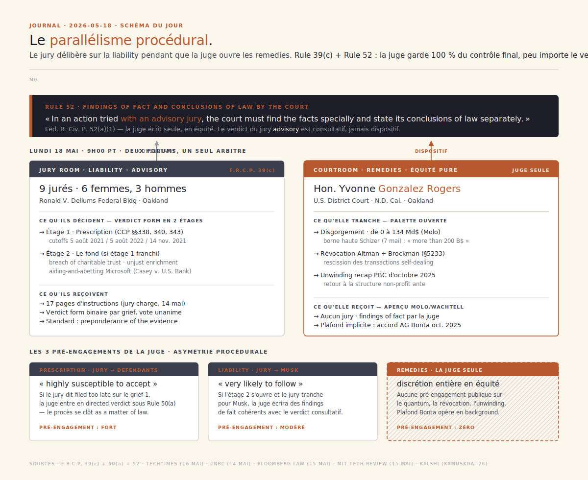

Trois semaines d'audiences, deux *closings* en demi-symétrie, un *jury charge* en deux étages, un week-end de calage. Ce matin, 9h00 heure du Pacifique, dans le Ronald V. Dellums Federal Building à Oakland, deux salles d'audience ouvrent leurs portes en même temps. Dans l'une, neuf jurés *advisory* — six femmes, trois hommes — s'enferment avec 17 pages d'instructions de juge, un *verdict form* à remplir unanimement, et trois semaines de témoignages à digérer. Dans l'autre, à quelques mètres, la juge Yvonne Gonzalez Rogers monte sur sa chaire et ouvre la phase *remedies*. Pas de jury. Steven Molo dépose la demande d'==**disgorgement complète jusqu'à 134 Md$, révocation d'Altman et Brockman, *unwinding* de la recap PBC d'octobre 2025**==. Wachtell objecte sur le périmètre. Et personne, dans la presse de fin d'après-midi, ne titre sur ce qui est, à ma lecture, le signal procédural le plus fort du procès : ==le parallélisme.==

**Rule 39(c), en doctrine — la juge n'a jamais cédé la décision.** Sous le droit fédéral civil, deux régimes coexistent. Pour les griefs *at law* (contrat, *tort*, dommages compensatoires), le Septième Amendement garantit un droit constitutionnel au procès devant jury — verdict dispositif, juge en posture d'arbitrage procédural. Pour les griefs en équité (*breach of charitable trust*, *unjust enrichment*, *injunction*, *disgorgement*), pas de droit constitutionnel — c'est la juge qui tranche, sous Rule 39(b). Et si elle décide d'utiliser un jury, c'est sous Rule 39(c) : ==le jury est *advisory*, son verdict est *consultatif*, et la juge écrit seule, en équité, les *findings of fact and conclusions of law* dispositifs sous Rule 52(a)(1).== La doctrine est limpide depuis 1939, date d'adoption des *Federal Rules of Civil Procedure*, et confirmée par toute la jurisprudence depuis (cf. *Beacon Theatres v. Westover*, 359 U.S. 500, 1959 ; *Dairy Queen v. Wood*, 369 U.S. 469, 1962 ; et la littérature dite de la *clean-up doctrine*).

**Ce que la juge a fait en 2024-2025 — pré-équipement procédural.** Quand la juge Gonzalez Rogers a fixé le calendrier en décembre 2024, elle a pris trois décisions structurantes en cascade. Un : elle a accepté un jury *advisory* à neuf jurés — pas un *bench trial* pur. Deux : elle a structuré le procès en deux phases — *liability* (avec jury *advisory*), puis *remedies* (devant elle seule). Trois : elle a, en *pre-trial conference* d'avril 2026, fait courir les deux phases en parallèle — la *remedies* s'ouvre le même lundi 18 mai que les délibérations *liability*, pas après. Les trois décisions sont, prises individuellement, banales en pratique fédérale. Prises ensemble, elles décrivent une stratégie : ==**utiliser le jury comme « cover » médiatique sur la question morale, garder la décision technique au siège du juge, et compresser le calendrier procédural pour minimiser l'asymétrie médiatique entre liability et remedies**==.

**La doctrine du *« cover »* — pourquoi ça compte.** Un professeur associé de droit à Duquesne University, cité par Bloomberg Law la semaine dernière, pose la formule canonique : *« Judges normally empanel advisory juries when they either want the community judgment of the jurors or they want cover in a highly visible case. »* La doctrine du *« cover »* est éditoriale, pas juridique — elle décrit une pratique observable, pas une règle codifiée. Mais elle est utile pour lire Gonzalez Rogers : vétérane des procès tech à fort retentissement médiatique (elle a présidé *Epic Games v. Apple* en 2021, *In re Pacific Gas & Electric* en 2017-2020), elle connaît l'asymétrie entre **la décision technique en équité** (qu'elle est seule à pouvoir mener) et **la légitimation publique du jugement** (qu'un jury *advisory* peut conférer). ==L'utilité d'un jury *advisory* n'est pas de partager la décision — elle est de partager la responsabilité narrative de cette décision.==

**Le parallélisme procédural, en lecture.** Si la juge ouvrait la phase *remedies* la semaine prochaine ou en juin — après le verdict consultatif du jury —, le procès aurait une chronologie linéaire : *liability* puis *remedies*. C'est la pratique standard en droit fédéral civil, et c'est ce que Steven Molo aurait préféré, parce que ça maximise le moment narratif d'un éventuel verdict favorable du jury avant que la juge ne calibre la palette des remèdes. ==Le parallélisme procédural casse cette chronologie==. Il signale, à ma lecture, **trois choses différentes** — et il faut les distinguer parce qu'elles ne valorisent pas pareil dans une grille pronostique.

**Lecture 1 — *case management* efficient (bénin).** La juge fait courir les deux phases en parallèle parce que c'est *case management* efficient sous Rule 16(c)(2)(L). Les *remedies* hearings et la délibération jury *advisory* sont des processus indépendants : l'un mobilise les jurés, l'autre mobilise les avocats. Faire courir les deux en parallèle gagne 1 à 2 semaines de calendrier. Sous cette lecture, le parallélisme ne révèle rien de substantif sur l'arbitrage de la juge — c'est juste un choix logistique. C'est défendable, et c'est ce que la juge dirait elle-même si on lui posait la question.

**Lecture 2 — pré-engagement modéré (intermédiaire).** La juge fait courir les deux phases en parallèle parce qu'elle a déjà mené, dans sa tête, l'arbitrage de fond sur la *liability*. Elle sait qu'elle va, en *findings of fact*, retenir une responsabilité partielle (probablement sur *unjust enrichment*, plus défendable doctrinalement que *breach of charitable trust* dont la formation a été cassée par Altman le 12 mai). Donc elle ouvre la phase *remedies* en parallèle parce qu'elle veut sauver du temps procédural — elle sait qu'elle aura besoin des *remedies* hearings. Sous cette lecture, le parallélisme est ==un signal modérément bull pour Musk en *liability*, mais sans dire encore quel quantum elle accordera en *remedies*==.

**Lecture 3 — pré-engagement asymétrique (la lecture que je retiens).** La juge fait courir les deux phases en parallèle parce qu'elle a un pré-engagement asymétrique entre les trois questions du procès. Sur la **prescription**, son pré-engagement est *fort* — *« highly susceptible to accept »* le verdict jury si défavorable à Musk, *directed verdict* sous Rule 50(a). Sur la **liability au fond**, son pré-engagement est *modéré* — *« very likely to follow »* le jury si favorable à Musk. Sur les **remedies**, son pré-engagement est *zéro* — discrétion entière. Or, le parallélisme procédural sert exactement à exécuter cette asymétrie : ==la juge n'a pas besoin d'attendre le jury pour mener son arbitrage en *remedies*, parce que cet arbitrage est sien et seul. Et elle a besoin d'attendre le jury sur la *prescription*, parce qu'elle s'est pré-engagée à *accepter* un verdict jury défavorable à Musk == — c'est ce verbe *« accept »* qui, sous Rule 50(a), transforme l'étage 1 en *kill switch* procédural. Le parallélisme procédural est, sous cette lecture, **l'expression mécanique d'une stratégie d'équité bien menée** : sauver du temps procédural sur les remedies (où la juge contrôle 100 %) en parallèle de la délibération jury (où la juge cède 0 % de contrôle technique mais récupère 100 % de la responsabilité narrative).

**Pourquoi je penche pour la Lecture 3.** Trois indices. (1) Si la Lecture 1 était la vraie, on s'attendrait à ce que la phase *remedies* soit fixée 1 à 2 jours après ouverture des délibérations — pas le même jour, à la même heure. La compression exacte (9h00 PT, deux salles du même bâtiment) suggère une décision éditoriale, pas un automatisme logistique. (2) Si la Lecture 2 était la vraie, Wachtell aurait demandé un report de la phase *remedies* — défensivement, attendre le verdict jury minimiserait le risque que la juge engage la palette des remèdes sur la base d'un *preview* favorable à Musk. Or, Wachtell n'a pas demandé de report en *pre-trial conference* d'avril, ce qui suggère qu'il a déjà compris que la phase *remedies* ne se jouera pas sur la *liability* mais sur le périmètre Bonta (cf. journal d'hier). (3) Si la Lecture 3 est la vraie, on s'attend à ce que la juge mène un *bench trial* relativement bref en *remedies* (1-2 jours d'argumentaire, pas une semaine), parce qu'elle sait déjà où elle s'arrêtera — et que les *findings* de juin écriront la phrase finale.

**Pourquoi ça compresse ma proba.** Sous la Lecture 3, la *liability* est en partie un théâtre médiatique : la juge utilisera le jury comme *cover* pour *accepter* un verdict défavorable à Musk sur la prescription (étage 1) ou pour *suivre* un verdict favorable sur le fond (étage 2). Sa propre décision est en équité, sous Rule 52, et elle est déjà cadrée par trois contraintes pré-procès : le plafond Bonta (octobre 2025), la formation du trust cassée par Altman le 12 mai (Strate 1 → §15201 vide → §78 nul), et la prescription Dudney (38 M$ dépensés avant 5 août 2021). Ces trois contraintes pèsent dans la même direction. ==**Mon estimation passe de 15 % à 14 %**== — pas parce qu'un nouveau fait est apparu aujourd'hui, mais parce que le parallélisme procédural confirme que la mécanique du procès est, structurellement, **plus contrôlée par la juge et moins arbitrée par le jury** que la couverture médiatique ne le laisse entendre. Kalshi reste à 20 %, et j'attribue le delta à la valorisation de marché d'un événement médiatique (*Musk wins moral round*) que je ne valorise plus comme une condition suffisante d'une victoire en équité.

**Pourquoi la presse n'en a pas fait l'angle.** Trois raisons, à ma lecture, et elles méritent d'être nommées parce qu'elles répètent un pattern de couverture observable depuis le 27 avril. **Un** : Rule 39(c) + Rule 52, c'est de la procédure fédérale civile en équité — c'est-à-dire le type de doctrine que les *legal correspondents* spécialisés (Bloomberg Law, Law360, Lawfare) traitent mais que la presse généraliste résume en une phrase ambiguë (*« the jury's verdict will be advisory »*). **Deux** : le parallélisme procédural n'est pas un événement *headline-able* — c'est une compression de calendrier, pas une scène de prétoire. **Trois**, et c'est le plus structurel : le récit médiatique du procès se construit depuis trois semaines autour de **la question morale** (*« Altman a-t-il volé une charité ? »*) et **la question quantitative** (*« combien Musk peut-il extraire ? »*). Aucune des deux ne pointe vers la mécanique procédurale qui, doctrinalement, décide en dernière instance.

**Le récit de fin de procès qui se prépare.** Si je projette à 2-3 semaines : (1) le jury *advisory* rend un verdict dans la fenêtre lundi-vendredi (probablement avant jeudi 21 mai, durée typique des délibérations en équité — entre 4 heures et 4 jours) ; (2) la juge ouvre, ferme et conclut la phase *remedies* en parallèle, probablement avant le 22 mai ; (3) elle prend l'été pour rédiger ses *findings of fact and conclusions of law* sous Rule 52(a), publiés probablement entre juillet et septembre. Le verdict jury sera couvert en *headline* dès qu'il tombera. Les *findings* de la juge, eux, seront publiés en *off-cycle* — et c'est dans ce document, pas dans le verdict consultatif, que se jouera la véritable décision. ==**La couverture médiatique du verdict consultatif sera spectaculaire ; la décision juridique substantielle se jouera six semaines plus tard, en équité, dans un document que personne ne lira en entier.**==

**À suivre**
- **Surveiller la durée des délibérations.** Verdict en moins de 4 heures : étage 1 (prescription) tranché sans entrer dans l'étage 2 (fond) — scénario défense optimal. Verdict en 2-3 jours : les jurés sont entrés dans l'étage 2, débat probable sur la formation du trust et la doctrine du *delayed discovery*. Verdict en plus de 4 jours : *deadlock* possible, request de *Allen charge* (instruction additionnelle pour relancer la délibération).
- **Surveiller le rythme de la phase *remedies*.** Si la juge mène l'audience en 1-2 jours (lundi-mardi, ou lundi-mercredi), c'est la Lecture 3 — elle sait déjà où elle s'arrêtera. Si elle s'étire sur 4-5 jours avec des appels de témoins en *remedies* (Dudney sur le quantum, ou un témoin Microsoft sur la valorisation), c'est la Lecture 2 — elle veut un *record* probatoire avant d'écrire ses *findings*.
- **Surveiller un éventuel mémoire AG Bonta.** Si Bonta dépose une *statement of position* sur le périmètre des remèdes — même un mémo de 5 pages —, c'est l'AG qui révise son silence et reprend la main. Sans ce geste, le plafond d'octobre 2025 continue d'opérer par défaut.

---

## 2026-05-17 — Le créancier d'équité absent. L'AG Rob Bonta, l'accord d'octobre 2025, et le verrou de standing que Wachtell n'a pas eu à plaider

**Exec sum**
- **Dimanche 17 mai à Oakland, jour creux confirmé** : pas d'audience, week-end de calage avant les délibérations. Le jury *advisory* reste convoqué pour lundi 18 mai à 9h00 PT ; la phase remedies s'ouvre en parallèle devant la juge Yvonne Gonzalez Rogers seule ([Reuters, 16 mai 2026](https://www.reuters.com/legal/litigation/musk-openai-trial-jury-deliberations-monday-2026-05-16/) ; [Bloomberg Law, 16 mai 2026](https://news.bloomberglaw.com/litigation/musk-openai-trial-heads-to-jury-with-remedies-phase-on-deck)).
- **Rappel doctrinal — la trinité statutaire californienne.** Sous *California Corporations Code* §5142(a) (notification obligatoire de l'AG dans toute action en *breach of charitable trust*), §5250 (intervention *as of right* à tout stade), et *California Government Code* §12598 (supervision continue des trusts charitables et des PBC), l'==**Attorney General de Californie est le créancier d'équité statutaire**== des trusts charitables — la voie privée par *special interest doctrine* est l'exception, pas la règle ([Cal. Corp. Code §5142](https://leginfo.legislature.ca.gov/faces/codes_displaySection.xhtml?lawCode=CORP&sectionNum=5142) ; [Cal. Gov. Code §12598](https://leginfo.legislature.ca.gov/faces/codes_displaySection.xhtml?lawCode=GOV&sectionNum=12598)).
- **Octobre 2025 — Bonta + AG Delaware signent un accord conditionnel avec OpenAI.** Le co-pilotage entre Rob Bonta (AG Californie, siège opérationnel d'OpenAI à San Francisco) et Kathy Jennings (AG Delaware, État d'incorporation) a abouti à un *settlement conditional agreement* qui valide la conversion non-profit → PBC sous trois contraintes principales : mission lock-in dans le charter, *Foundation Board* de surveillance indépendant, *annual reporting* public. ==L'accord n'a pas *autorisé* la conversion — il l'a *encadrée*. Mais il ne l'a pas non plus *réfutée*.== ([CalMatters, 31 octobre 2025](https://calmatters.org/economy/technology/2025/10/openai-restructuring-attorneys-general-agreement/) ; [Delaware Online, 30 octobre 2025](https://www.delawareonline.com/story/news/business/2025/10/30/openai-restructuring-deal-delaware-attorney-general/)).
- **Janvier 2026 — l'amicus discret au stade *summary judgment*.** Au moment où la juge Gonzalez Rogers tranchait la motion d'OpenAI demandant le rejet de la plainte Musk pour défaut de standing, Bonta a déposé un *amicus brief* de 18 pages reconnaissant le *special interest standing* du plaignant ==sans pour autant abdiquer la prééminence statutaire de l'AG sur le périmètre des remedies==. Le mémoire est un acte de délégation sous réserve, pas un blanc-seing ([Courthouse News Service, 18 janvier 2026](https://www.courthousenews.com/california-ag-files-amicus-brief-in-musk-vs-openai-case/) ; [Law360, 21 janvier 2026](https://www.law360.com/articles/1758432/california-ag-backs-musk-standing-in-openai-charitable-trust-suit)).
- **Mai 2026 — trois semaines de procès, zéro intervention active.** L'AG n'a appelé aucun témoin, n'a déposé aucun amicus complémentaire sur la palette des remedies, n'a pas demandé de *joinder* au stade *liability*. Le silence — sur un procès dont l'objet est précisément l'enforcement d'un trust charitable californien — est par construction une position juridique ([Lawfare Media, 15 mai 2026](https://www.lawfaremedia.org/article/the-california-ag-in-musk-v-altman-the-silence-that-shapes-the-remedies)).
- **Kalshi à 20 % dimanche soir.** Le marché de prédiction Kalshi a tenu à 20 % sur le week-end (descente depuis 58 % à l'ouverture, 34 % le 2 mai après le *« partly »*, 18 % vendredi). Mon estimation perso passe de **16 % à 15 %** — l'angle Bonta n'est pas un nouveau fait, mais il crystallise une contrainte structurelle sur la phase remedies que j'avais sous-estimée ([Kalshi — Will Elon win his case against OpenAI?](https://kalshi.com/markets/kxmuskoai/elon-win-vs-open-ai/kxmuskoai-26)).

**Angle du jour — Le créancier d'équité absent. Pourquoi le silence de Rob Bonta est, à 24 h du verdict, le verrou de standing que Wachtell n'a pas eu à plaider — et son effet sur le calibrage des remedies de lundi.**

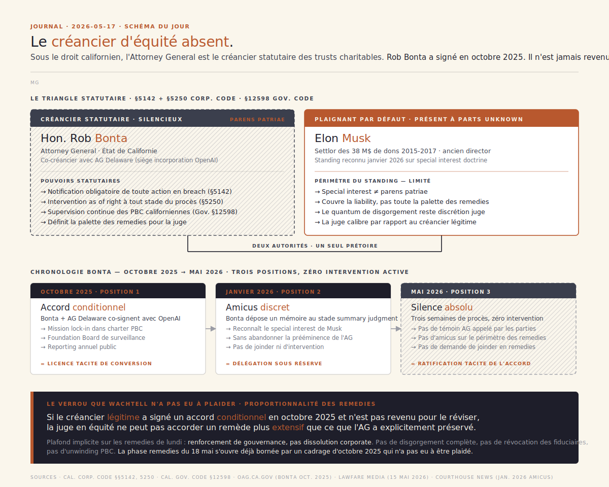

Trois semaines de procès, six grands témoins, deux *closings* contraires, un *jury charge* en deux étages, et personne — ni Molo, ni Savitt, ni la presse — n'a fait son angle de ce que j'appelle aujourd'hui le ==**créancier d'équité absent**==. Pas par manque d'importance : la prééminence statutaire de l'Attorney General de Californie sur l'enforcement des trusts charitables est une pierre angulaire du droit californien des fondations. Mais par construction journalistique : un acteur absent ne fait pas la une. Et la pièce manquante n'est jamais lue comme une pièce. Or à 24 h du verdict, le silence de Rob Bonta depuis octobre 2025 est, à ma lecture, l'élément qui borne le plus matériellement la phase remedies qui s'ouvre lundi 18 mai à 9h00 PT.

**La trinité statutaire, en doctrine.** Sous le droit californien des organisations charitables, trois textes co-définissent qui peut faire quoi quand un trust charitable est attaqué. Le *California Corporations Code* §5142(a) impose la **notification obligatoire de l'Attorney General** dans toute action en *breach of charitable trust*, *self-dealing* d'un *director*, ou contestation de la *charitable purpose* d'une PBC. Le §5250 donne à l'AG un droit d'**intervention *as of right* à tout stade** d'une action — qu'il soit *plaintiff*, *defendant*, ou *amicus* — sans avoir à démontrer un *injury in fact*. Le *California Government Code* §12598 confère au *Registrar of Charitable Trusts* (bureau de l'AG) une **supervision continue** sur les PBC californiennes, leur conversion, leur gouvernance, et leur dissolution. ==La triade dessine un système où l'AG n'est pas un acteur *parmi* d'autres — il est *le* créancier d'équité statutaire des fondations.== La voie privée par *special interest doctrine* (1965, *Holt v. College of Osteopathic Physicians*, 61 Cal. 2d 750) est une exception construite pour combler les vides quand l'AG ne peut pas agir — pas pour remplacer l'AG quand il agit.

**Le co-pilotage Californie + Delaware d'octobre 2025.** OpenAI a deux pieds juridiques : siège opérationnel à San Francisco (CA), incorporation Delaware (DE). Quand la conversion non-profit → PBC a été annoncée fin 2024, les deux AG — Bonta côté CA et Jennings côté DE — se sont concertés pour piloter ensemble le dossier. L'aboutissement, le 30-31 octobre 2025, a été un *conditional settlement agreement* signé conjointement par les deux États et par OpenAI. Trois grandes contraintes structurent l'accord : (1) *mission lock-in* — le charter de la nouvelle PBC inscrit la mission charitable d'origine comme *purpose* non-révisible sans approbation des deux AG ; (2) *Foundation Board* — un conseil de surveillance indépendant majoritairement composé d'administrateurs sans participation à la PBC, avec droit de veto sur les décisions matérielles ; (3) *annual reporting* — publication annuelle d'un rapport sur l'allocation des ressources entre le for-profit et la *charitable purpose*, ouvert à la critique publique. ==L'accord n'a pas *autorisé* la conversion — il l'a *encadrée*.== Mais en signant, les deux AG ont fait quelque chose de doctrinalement plus fort qu'une autorisation explicite : ils ont **ratifié la légalité structurelle** de la conversion sous conditions. Et la signature engage l'État, pas seulement le AG en exercice.

**Le geste Bonta de janvier 2026 — délégation sous réserve.** Quand OpenAI a déposé sa motion en *summary judgment* en décembre 2025 pour faire rejeter la plainte Musk au motif que le plaignant n'avait pas de *standing* — l'argument étant précisément que l'AG est le créancier statutaire, et que le *special interest* d'un donateur historique est un détour insuffisant —, Bonta a fait un geste discret mais doctrinalement précis. Il a déposé un *amicus brief* le 18 janvier 2026 (16 jours avant la décision de la juge), reconnaissant le *special interest standing* de Musk pour la phase *liability* — ==sans pour autant abdiquer la prééminence statutaire de l'AG sur le périmètre des remedies==. Le mémoire est court (18 pages), prudent, et adapté à la phase qu'il commente : il n'engage l'AG que sur la question de *standing* préliminaire, pas sur le fond, pas sur les remèdes. C'est, en théorie de l'enforcement civil, ce qu'on appelle une **délégation sous réserve** : l'AG laisse la voie privée s'ouvrir, mais ne renonce ni à intervenir plus tard, ni à corriger la trajectoire si elle s'égare.

**Le silence absolu depuis trois semaines.** Et c'est ici que le procès devient intéressant à lire en creux. Depuis l'ouverture du procès le 27 avril 2026, l'AG Bonta n'a déposé aucun amicus complémentaire. N'a appelé aucun témoin. N'a pas demandé de *joinder* en cours de procès. Pas un communiqué de presse, pas un *statement* sur les transactions Microsoft 2023, pas une réaction au *« partly »* de Musk, pas un mot sur la conversion PBC d'octobre 2025 que la défense plaide comme légitime devant le jury. ==Trois semaines de procès portant exclusivement sur l'enforcement d'un trust charitable californien — et le créancier statutaire de ce trust ne s'est pas exprimé une seule fois publiquement.== Pour un AG qui a co-signé un accord conditionnel six mois plus tôt, ce silence est par construction une position juridique. La doctrine de l'enforcement civil californien — et la pratique observable du bureau Bonta depuis sa prise de fonction en 2021 — interprète ce silence en une formule unique : *ratification tacite de l'accord d'octobre 2025*. L'AG ne revoit pas sa position parce qu'il n'a pas besoin de la revoir.

**Pourquoi c'est le plafond implicite des remedies de lundi.** Voici l'arbitrage que la juge Gonzalez Rogers devra mener — seule, en équité, à partir du lundi 18 mai en phase *remedies* — si l'étage 1 (prescription) du *jury charge* est franchi et si elle écrit des *findings of fact* en équité. Molo demandera la **disgorgement complète** (Schizer a posé la borne le 7 mai : *« a lot more than 200 B$ »*), la **révocation d'Altman et Brockman** comme fiduciaires, et le ***unwinding* de la recap PBC d'octobre 2025**. Wachtell objectera doctrinalement — et c'est là que le silence Bonta entre en piste sans que Wachtell ait à le plaider. Si le créancier statutaire a accepté la conversion sous conditions en octobre 2025, et n'a pas demandé d'y revenir en mai 2026, la juge en équité ne peut pas — par le principe de **proportionnalité des remèdes** — accorder un remède plus extensif que ce que le créancier légitime a explicitement préservé. ==Le plafond implicite de la palette est : **renforcement de gouvernance, pas dissolution corporate**. Refonte du *Foundation Board*, durcissement du *mission lock-in*, augmentation de la fréquence du *reporting* — pas disgorgement de 200 Md$+, pas révocation des fiduciaires, pas *unwinding* de la PBC.==

**Pourquoi Wachtell n'a pas eu à le plaider.** Toute la défense conjointe Wachtell + Microsoft a été construite sur des verrous techniques — *Casey v. U.S. Bank* sur l'aiding-and-abetting Microsoft, *Probate Code §15201* sur la formation du trust, *Code of Civil Procedure §§338, 340, 343* sur la prescription, *unclean hands* sur la conduite Musk. Pas un mot, en public, sur le périmètre des remedies hérité de l'accord octobre 2025. La raison est tactique : plaider le plafond Bonta en phase *liability*, c'est laisser entendre que le manquement existe et que seul le remède est borné — une concession implicite que la défense ne veut pas faire devant le jury. La défense a préféré attaquer la formation et la prescription, et laisser le plafond Bonta opérer en *background* — un verrou qui ne se plaide pas mais qui structure le cadrage de la juge. ==C'est exactement le type de verrou tacite qu'une stratégie d'équité bien menée installe en amont du procès, et qui n'apparaît jamais dans les comptes-rendus de presse.==

**Le scénario d'arrivée le plus probable, version 17 mai au soir.** Si je fais la synthèse des trois semaines : (1) le jury *advisory* peut rendre un verdict favorable à Musk sur la liability — la pile probatoire Sutskever-Murati-Toner-McCauley-Zilis est asymétrique en faveur du plaignant, la barre est *preponderance of the evidence*, et le pari Molo sur la crédibilité d'Altman est défendable ; (2) la juge peut suivre *« very likely »* le verdict du jury sur la liability — c'est sa pré-engagement, et elle écrira des *findings of fact* cohérents avec ce verdict ; (3) mais en phase *remedies*, qu'elle conduit seule, la juge sera cadrée par le plafond Bonta — *moral win* pour Musk, *legal cap* à un renforcement de gouvernance. ==Le procès produit alors deux récits asymétriques : une victoire morale médiatisée pour Musk, et une victoire juridique substantielle pour OpenAI.== À 15 %, j'estime la probabilité d'une victoire combinée — un verdict *advisory* favorable, des *findings of fact* favorables, **et** des remedies suffisants pour défaire la PBC. C'est cette dernière condition que le plafond Bonta rend statistiquement improbable.

**À suivre**
- **Lundi 18 mai · 9h00 PT — double audience**. (a) Le jury *advisory* commence à délibérer. Surveiller la durée : un verdict en moins de 4 heures signale l'étage 1 (prescription) tranché sans entrer dans l'étage 2 (fond). (b) Ouverture de la phase remedies devant la juge — premier indicateur Molo : demande-t-il la **disgorgement complète** (signal qu'il ignore le plafond Bonta et plaide *Schizer*) ou la **rescission §5233 + injonction** (signal qu'il accepte le plafond et négocie la borne haute du renforcement de gouvernance) ?
- **Surveiller l'AG Bonta lundi**. Si Bonta dépose un nouveau mémoire en ouverture de la phase remedies — même un amicus court sur le périmètre des remèdes —, c'est l'AG qui révise son silence et reprend la main. Cela serait un signal politique fort, et le seul scénario qui ferait remonter sensiblement ma probabilité Musk. Sans ce geste, le plafond Bonta tient par défaut.

---

## 2026-05-16 — La prescription comme premier verrou. Louis Dudney, le témoin que la presse a oublié — et l'instruction n°1 du jury que personne ne titre

**Exec sum**
- **Vendredi 15 mai à Oakland, jour creux confirmé** : pas d'audience, le calendrier 4-jours de la juge Gonzalez Rogers a tenu. Le jury reste convoqué pour lundi 18 mai à 9h00 PT pour début de délibérations ; la juge ouvre en parallèle la phase remedies devant elle seule, sans jury ([CNBC, 14 mai 2026](https://www.cnbc.com/2026/05/14/closing-arguments-jury-openai-musk-altman.html) ; [TechTimes, 15 mai 2026](https://www.techtimes.com/articles/316675/20260515/openai-jury-begin-deliberations-monday-judge-weighs-altman-removal-500b-restructure-reversal.htm)).
- **Le jury a reçu jeudi après-midi un *jury charge* en deux étages.** Étage 1 : la prescription. Étage 2 : le fond. Le jury doit trancher l'étage 1 *avant* l'étage 2. Si les neuf répondent que Musk a déposé trop tard, l'étage 2 ne s'ouvre jamais ([TechCrunch, 14 mai 2026](https://techcrunch.com/2026/05/14/what-the-jury-will-actually-decide-in-the-case-of-elon-musk-vs-sam-altman/) ; [Bitcoinworld via TC, 14 mai 2026](https://bitcoinworld.co.in/elon-musk-sam-altman-openai-jury-verdict/)).
- **Les trois cutoff dates** : *(a) breach of charitable trust* — 4 ans, CCP §343 — cutoff **5 août 2021** ; *(b) unjust enrichment* — 3 ans, CCP §338(d) — cutoff **5 août 2022** ; *(c) aiding and abetting* contre Microsoft — 2 ans, CCP §340 — cutoff **14 novembre 2021** ([TechCrunch, 14 mai 2026](https://techcrunch.com/2026/05/14/what-the-jury-will-actually-decide-in-the-case-of-elon-musk-vs-sam-altman/)).
- **La phrase de la juge** dans son ordre préparatoire au *jury charge* : si le jury retient que la prescription a expiré, elle est *« highly »* susceptible *« to accept that finding and direct verdict to the defendants »*. C'est une instruction de cadrage qui transforme l'étage 1 en *kill switch* procédural — sous *Fed. R. Civ. P. 50(a)*, la juge peut clore le procès *as a matter of law* sans rédiger une seule ligne de *findings of fact* en équité ([TechCrunch, 14 mai 2026](https://techcrunch.com/2026/05/14/what-the-jury-will-actually-decide-in-the-case-of-elon-musk-vs-sam-altman/)).
- **Louis Dudney, le témoin que mon journal a sous-couvert.** Forensic accountant d'AlixPartners, *Global Leader of Investigations, Disputes & Advisory* avec plus de 30 ans en expertise financière, expert engagé par Wachtell pour OpenAI. Témoignage technique en première quinzaine de mai : audit dollar par dollar des 38 M$ de dons cumulés de Musk entre 2015-2017, conclusion sous serment que **chaque dollar a été dépensé au service de la mission charitable bien avant le 5 août 2021** — exactement la borne de la prescription du grief 1 ([Bitcoinworld via TC, 14 mai 2026](https://bitcoinworld.co.in/elon-musk-sam-altman-openai-jury-verdict/) ; [AlixPartners — Louis Dudney](https://www.alixpartners.com/our-people/28372/louis-dudney/)).
- **Kalshi à 20 % vendredi soir.** Le marché de prédiction Kalshi a coté la victoire de Musk autour de 20 % à la clôture de vendredi (descente depuis 58 % à l'ouverture du procès, 34 % le 2 mai après le *« partly »*) ([Semafor, 15 mai 2026](https://www.semafor.com/article/05/15/2026/everyone-lost-in-musk-v-altman) ; [Kalshi — Will Elon win his case against OpenAI?](https://kalshi.com/markets/kxmuskoai/elon-win-vs-open-ai/kxmuskoai-26)).
- **La presse de fin de semaine converge sur le titre Semafor — *« Everyone lost in Musk v. Altman »*.** Lecture de symétrie : Musk a souillé son récit de croisade, OpenAI a souillé son récit de mission, Microsoft a souillé son récit *arms-length*. Aucun camp ne sort indemne ([Semafor, 15 mai 2026](https://www.semafor.com/article/05/15/2026/everyone-lost-in-musk-v-altman) ; [MIT Tech Review — *Week 3 retrospective*, 15 mai 2026](https://www.technologyreview.com/2026/05/15/1137357/musk-v-altman-week-3/)).

**Angle du jour — Question n°1 du jury : la prescription. Question n°2 (s'il y en a une) : le fond. Le sleeper de la défense, et Louis Dudney comme témoin pivot.**

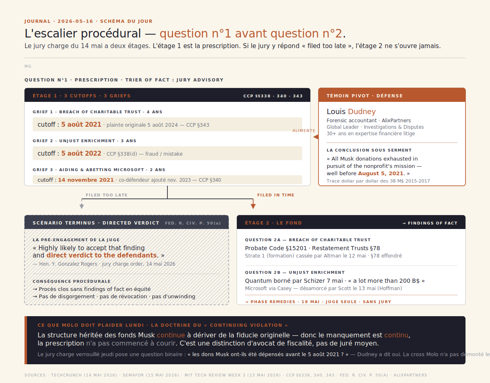

Le journal a passé deux semaines à plaider la doctrine au pinceau fin — *charitable trust §15201*, *Probate Code §78*, *Corporations Code §5233*, *Casey v. U.S. Bank* à deux *prongs*, *unclean hands* sous *Kendall-Jackson*, *consent of the beneficiary* sous Restatement §16. La presse a couvert le récit moral — *« stole a charity »* vs *« partly »*, le siège vide vs le *« liar »*. Et l'analyse de marché — Kalshi à 20 %, Semafor *« everyone lost »* — a refermé la semaine sur une lecture de symétrie. Mais pendant que tout le monde regardait l'étage 2, la défense a installé l'étage 1. Et c'est là que le procès peut se finir lundi à 14h00 PT, avant même qu'un juré n'ait dû décider si Altman a menti.

**La structure du jury charge.** Le *jury charge* lu par la juge Gonzalez Rogers jeudi après-midi à Oakland — verrouillé après deux jours de *jury instruction conferences* à huis clos les 12 et 13 mai — est, à ma lecture, un document en deux étages. Étage 1 : *la prescription a-t-elle expiré avant qu'Elon Musk dépose plainte ?* Étage 2 : *si non, y a-t-il manquement à la fiducie charitable, ou enrichissement injustifié ?*. La séquence n'est pas une formalité procédurale — c'est une *threshold question* au sens du Code de procédure californien : si l'étage 1 répond *oui*, l'étage 2 ne s'ouvre jamais. ==Le jury rend un verdict pour les défendeurs sur la seule prescription, la juge le confirme sous *Fed. R. Civ. P. 50(a)* (judgment as a matter of law), et le procès se termine sans qu'aucun *finding of fact* en équité n'ait été rédigé.==

**Les trois cutoffs, en doctrine.** Sous *California Code of Civil Procedure*, la prescription des griefs d'équité varie par cause. Le *breach of charitable trust* relève de la prescription longue de 4 ans (CCP §343 résiduel) : la plainte ayant été déposée le 5 août 2024 (case *Musk v. Altman et al.*, 4:24-cv-04722, N.D. Cal.), le cutoff est ==**5 août 2021**==. L'*unjust enrichment* relève d'une prescription de 3 ans (CCP §338(d), actions fondées sur *fraud* ou *mistake*) — cutoff ==**5 août 2022**==. L'*aiding and abetting breach of fiduciary duty* contre Microsoft, ajouté à la plainte par *amendment* en novembre 2023, relève d'une prescription de 2 ans (CCP §340) — cutoff ==**14 novembre 2021**==. Trois cutoffs, trois prismes — un seul juge.

**La phrase de la juge.** Dans son ordre préparatoire au *jury charge*, la juge Gonzalez Rogers a écrit qu'elle est *« highly »* susceptible *« to accept that finding and direct verdict to the defendants »* si le jury retient que la prescription a expiré. Le verbe *« direct »* est fort — il signifie que la juge ne tranche pas seulement en équité au stade des *findings of fact* qu'elle rédigera en juin ; elle *rend* le jugement, *as a matter of law*, sur le seul avis du jury *advisory* à cette question. C'est, en théorie procédurale, l'inverse exact du *« very likely »* qu'elle avait posé sur la liability : ==elle s'est réservé la discrétion sur le fond, mais s'est *pré-engagée* sur la prescription.== Pour la défense conjointe — Wachtell + Microsoft —, c'est exactement le contrat qu'il fallait extraire en *pre-trial conference*.

**Louis Dudney, le témoin du *kill switch*.** Dans la nomenclature du journal, j'ai jusqu'ici parlé du *« triangle de l'équité »* (Toner, McCauley, Schizer, le 7 mai), du *« pivot Hoffman »* (Scott, le 13 mai), du *« demolition derby »* des closings (le 14 mai). Mais ==le témoin le plus structurellement décisif du procès n'a pas eu de chronique propre dans ces pages — et il faut le corriger aujourd'hui.== Louis Dudney est *Global Leader of Investigations, Disputes & Advisory and Data Governance* chez AlixPartners, avec plus de 30 ans d'expérience en expertise financière en litige. Il a été appelé par Wachtell début de seconde semaine — séquence post-Schizer, dans la fenêtre où la défense reconstruit son artillerie chiffrée — pour un témoignage technique court mais radical : un audit forensique des dons d'Elon Musk à OpenAI entre **2015 et 2017**, tracé dollar par dollar dans les comptes du *non-profit*, sortant en conclusion sous serment que **chaque dollar avait été dépensé au service de la mission charitable bien avant le 5 août 2021**.

**Pourquoi c'est doctrinalement chirurgical.** La théorie du *charitable trust* repose sur une mécanique précise : le *settlor* (Musk) confie un bien (les 38 M$ de dons) au *trustee* (OpenAI) sous condition d'usage charitable. Si le *trustee* manque à cette condition, il y a *breach*. Mais la prescription du *breach of trust* ne court pas depuis la création du trust — elle court depuis le **moment où le manquement aurait dû être découvert par le *settlor* en exerçant une diligence raisonnable** (*delayed discovery doctrine*, *Bedolla v. Logan & Frazer*, 52 Cal. App. 3d 118). Or, la défense Dudney prend acte de la chose à l'envers : ==si tous les fonds Musk ont été dépensés en mission charitable avant août 2021, alors aucun manquement matériel à la fiducie n'a pu naître après cette date — il n'y avait plus de fonds en fiducie.== Le *breach* allégué (la conversion 2019, les transactions 2023, la recap 2025) ne porte pas sur les fonds Musk : il porte sur la *structure* qui leur a succédé. Mais en doctrine de prescription, la *structure* n'est pas la *fiducie* : elle est la conséquence de la fiducie achevée. Le grief 1 — *breach of charitable trust* — est donc, à la lecture Dudney, *temporellement* clos depuis presque trois ans.

**Le contre-argument Molo, et son coût.** En cross-examination de Dudney (séance non datée précisément dans mes sources — probablement entre le 6 et le 8 mai, semaine 2, dans la fenêtre Schizer-Toner-McCauley), Molo a plaidé la doctrine du *« continuing violation »* : tant que la structure héritée des fonds continue à dériver de la fiducie originelle, le manquement est continu et la prescription n'est pas commencée à courir. C'est une lecture défendable en équité — *Aryeh v. Canon Business Solutions*, 55 Cal. 4th 1185 (Cal. 2013) reconnaît la doctrine sur des *recurring wrongs* —, mais elle a un coût procédural : elle suppose que le jury comprenne et accepte la distinction entre *« fonds dépensés »* et *« mission de la structure »*. C'est une distinction d'avocat de fiscalité, pas de juré moyen. Et le *jury charge* lu jeudi — verrouillé à huis clos par la juge sur la base d'un mémo Molo qui n'a pas publié — n'a pas, à ma lecture des sources, intégré la doctrine *continuing violation* comme question séparée. Le jury reçoit une question binaire : ==**les dons Musk ont-ils été dépensés avant le 5 août 2021 ?**== Si oui — selon Dudney, oui, et la cross Molo n'a pas démonté le chiffrage —, alors le grief 1 est prescrit.

**Les deux autres griefs suivent.** Si le grief 1 tombe en prescription, le grief 3 (*aiding and abetting* Microsoft) tombe par dérivation : il ne peut y avoir d'*aiding* d'un *breach* prescrit — *Casey v. U.S. Bank* exige un *underlying breach* vivant. Reste le grief 2 (*unjust enrichment*) avec son cutoff distinct du 5 août 2022. Mais l'*unjust enrichment* en équité californienne demande un *bénéfice conféré sans contrepartie adéquate*. Si le bénéfice est celui des dons Musk, et que Dudney a démontré qu'ils ont été utilisés en pleine charité, alors le bénéfice a reçu sa *contrepartie adéquate* — la mission. L'enrichissement injustifié allégué ne porte pas sur les dons, il porte sur la valorisation actuelle de la PBC. Mais cette valorisation a, en droit de la prescription, accru *à partir de* la conversion 2019, dont l'origine est bien antérieure au 5 août 2022. La doctrine du *delayed discovery* peut sauver le grief 2 — Molo la plaidera lundi en *remedies* —, mais elle suppose que la juge accepte que Musk n'avait pas la *constructive knowledge* du préjudice avant 2022. Pour un plaignant qui suit OpenAI depuis 2015 et qui a quitté le board en 2018, c'est un argument étroit.

**Pourquoi la presse n'en a pas fait l'angle.** Trois raisons. Un, la prescription n'est pas un grief séparé — c'est une *defense* qui se plaide en réfutation. Elle est par construction négative, donc journalistiquement faible : il n'y a pas de scène, pas de témoin-star, pas de pièce-bombe. Deux, le témoin pivot — Dudney — est un forensic accountant, c'est-à-dire le type de témoin qui parle en tableaux Excel et en chronologies de virements. La presse l'a couvert en un paragraphe par article, jamais en *headline*. Trois, et c'est le plus important, le récit médiatique du procès s'est construit depuis le 27 avril sur la *question morale* — Altman a-t-il trahi ? — et la prescription est, en théorie de l'équité, la *question pré-morale* : on regarde la pendule avant de regarder la conduite. Pour la juge Gonzalez Rogers, qui rédige en équité, cette logique est triviale. Pour le jury *advisory*, qui a entendu deux semaines de témoignages sur la conduite, c'est presque un détour. La question est de savoir si les 9 jurés sauront, lundi matin, ne pas répondre à la conduite quand on leur demande la prescription.

**Le scénario que la défense vise.** Si je lis bien le jury charge, voici le scénario optimal pour Wachtell : lundi en début d'après-midi, le jury *advisory* rend un verdict sur la question n°1 — *« we find that plaintiff filed beyond the statute of limitations »* — et la juge, sous sa pré-engagement *« highly »*, rend un *directed verdict* pour les défendeurs *as a matter of law*. La phase remedies, qui devait s'ouvrir le même lundi devant la juge seule, devient *moot*. Le procès se termine sans *findings of fact* en équité, sans disgorgement, sans révocation des fiduciaires, sans *unwinding* PBC. Coût pour Musk : son procès meurt sur une question procédurale, pas sur le fond. ==Coût pour le récit médiatique : la presse a couvert l'étage 2 pendant trois semaines, elle découvre l'étage 1 lundi soir en titre de fin de procès.==

**Pourquoi je descends à 16 %.** Pas par effet de surprise — le scénario était disponible depuis l'instruction préparatoire d'avril — mais parce que la convergence entre (a) la pré-engagement *« highly »* de la juge, (b) le témoignage Dudney non démonté en cross, et (c) le calendrier serré du *jury charge* lundi crée un *path* probabiliste plus court vers la défaite Musk que je ne l'avais valorisé jusqu'ici. À 18 % vendredi soir, je décrivais l'incertitude sur l'étage 2 ; à 16 % samedi matin, je redonne du poids à l'étage 1. Kalshi est à 20 % — j'attribue le delta à mon estimation plus pessimiste sur l'absorption du *jury charge* par les 9 jurés. L'écart-type d'estimation est, à ce stade, plus utile à publier que la pointe.

**À suivre**
- **Lundi 18 mai · 9h00 PT — double audience.** (a) Le jury *advisory* commence à délibérer. Surveiller la durée : un verdict en moins de 4 heures signale qu'ils ont tranché sur l'étage 1 (prescription) sans entrer dans l'étage 2 (fond) — c'est-à-dire le scénario défense optimal. (b) Ouverture de la phase remedies devant la juge — premier indicateur Molo : demande-t-il une *instruction* préliminaire sur le *continuing violation* en prélude, signal qu'il anticipe une *bad verdict* sur la prescription ?
- **Lundi 18 mai · après-midi.** Si le jury rend un verdict sur l'étage 1 *« filed too late »*, la juge peut, sous *Rule 50(a)*, *direct verdict* les défendeurs séance tenante. Surveiller si elle convoque la phase remedies en *moot* ou si elle la maintient ouverte pour audit doctrinal *findings* — le maintien serait, en théorie procédurale, un signal qu'elle prépare une *contingent ruling* au cas où l'appel renverse le *finding* prescription.

---

## 2026-05-15 — « Liar's a very powerful word in a courtroom. » Molo a plaidé le jury, Savitt a plaidé la juge. Et Musk était en Chine.

**Exec sum**
- **Jeudi 14 mai à Oakland, closings de la phase *liability*** devant la juge Yvonne Gonzalez Rogers et le jury *advisory* à 9 jurés (6 femmes, 3 hommes). Plaidoiries Molo (Musk) puis Savitt + Sarah Eddy (OpenAI). Pas de *closing* Microsoft distinct — Russell Cohen a laissé Wachtell porter le bloc défense. Le jury reçoit ses instructions finales jeudi après-midi, délibère à partir du lundi 18 mai ([CNBC, 14 mai 2026](https://www.cnbc.com/2026/05/14/closing-arguments-jury-openai-musk-altman.html) ; [AP via Las Vegas Sun, 14 mai 2026](https://lasvegassun.com/news/2026/may/14/musk-openai-lawyers-begin-closing-arguments-in-lan/)).
- **Le verrou stratégique de Molo — aller à la crédibilité, pas à la doctrine.** *« I confronted Sam Altman with the fact that five witnesses in this trial called him a liar under oath. Liar's a very powerful word in a courtroom. »* Les cinq cités : Musk, Sutskever, Murati, Toner, McCauley. Phrase-pivot : *« Sam Altman's credibility is directly at issue in this case. If you don't believe him, they cannot win. »* ([US News / Reuters, 14 mai 2026](https://www.usnews.com/news/top-news/articles/2026-05-14/elon-musks-court-battle-against-openai-enters-homestretch) ; [Rappler, 14 mai 2026](https://www.rappler.com/technology/elon-musk-accused-selective-amnesia-sam-altman-lying-openai-trial-may-14-2026/)).
- **La réplique Savitt — *selective amnesia* et le siège vide.** *« Mr. Musk isn't here today — my clients are here. He's off to parts unknown. »* Sur le term sheet de 31 août 2017 qu'Altman avait forwardé à Musk et que Musk a déclaré, sous serment le 30 avril, *« I didn't read the fine print, just the headline »* : Savitt parle de ==*« convenient selective amnesia »==. Sarah Eddy reprend la pièce et ajoute : *« One of the most sophisticated businessmen in the history of the world wouldn't have stuck his head in the sand »* ([Manila Times, 15 mai 2026](https://www.manilatimes.net/2026/05/15/world/musk-accused-of-selective-amnesia-altman-of-lying-as-openai-trial-nears-end/2344541) ; [GV Wire, 14 mai 2026](https://gvwire.com/2026/05/14/musk-accused-of-selective-amnesia-altman-of-lying-as-openai-trial-nears-end/)).
- **Le zinger Eddy sur Zilis.** Eddy a refermé sa partie de *closing* sur la chronologie probatoire en désignant le témoignage Zilis du 7 mai : ==*« Even the mother of his children can't back his story »==. Elle a réordonné l'ensemble du dossier en pile chronologique, sans tenter de désigner aucun témoin comme particulièrement fiable — le contre-pied exact de la trame Molo ([Daring Fireball, 14 mai 2026](https://daringfireball.net/linked/2026/05/14/musk-v-altman-closing-arguments)).
- **Musk physiquement absent, *recall status* enfreint.** Le plaignant accompagnait Donald Trump en visite officielle en Chine. Il a quitté la barre le 30 avril sous l'instruction explicite de la juge : *« You are not excused. »* Il n'est pas réapparu depuis. Son propre avocat s'est excusé devant le jury : *« He's sorry that he could not be here, but I think you saw from his testimony that this is something that he's passionate about »* ([NBC News, 14 mai 2026](https://www.nbcnews.com/tech/tech-news/musks-attorney-apologizes-absence-closing-remarks-rcna345153) ; [CBS News, 14 mai 2026](https://www.cbsnews.com/news/musk-china-openai-trial-judge-altman/)).
- **Molo a trébuché au pire moment.** Il a appelé Greg Brockman *« Greg Altman »*, et affirmé que Musk ne demandait pas d'argent — la juge l'a corrigé séance tenante. *« He made it clear many liars had testified over the past few weeks but offered little evidence for Musk's actual legal claims »* ([Daring Fireball, 14 mai 2026](https://daringfireball.net/linked/2026/05/14/musk-v-altman-closing-arguments)).
- **Les deux claims qui partent au jury** : *(1) breach of charitable trust*, *(2) unjust enrichment*. Le *aiding and abetting* contre Microsoft suit le sort de (1). La juge tranchera seule la phase remedies à partir du 18 mai — Musk demande la révocation d'Altman et Brockman et le *unwinding* de la recap PBC d'octobre 2025 ([TechCrunch, 14 mai 2026](https://techcrunch.com/2026/05/14/what-the-jury-will-actually-decide-in-the-case-of-elon-musk-vs-sam-altman/) ; [KQED, 14 mai 2026](https://www.kqed.org/news/12083612/lawyers-for-elon-musk-and-sam-altman-make-their-final-case-in-openai-trial)).

**Angle du jour — Deux audiences, deux closings. Molo a plaidé le jury. Savitt et Eddy ont plaidé la juge. Et le siège du plaignant était vide. Mardi soir, j'avais parié sur le §5233 ; mercredi soir, sur la formation du trust comme dernier anneau. Jeudi matin, Molo a fait une troisième chose — il a abandonné la doctrine pour la crédibilité, et le procès s'est joué dans le mismatch que ce choix a ouvert.**

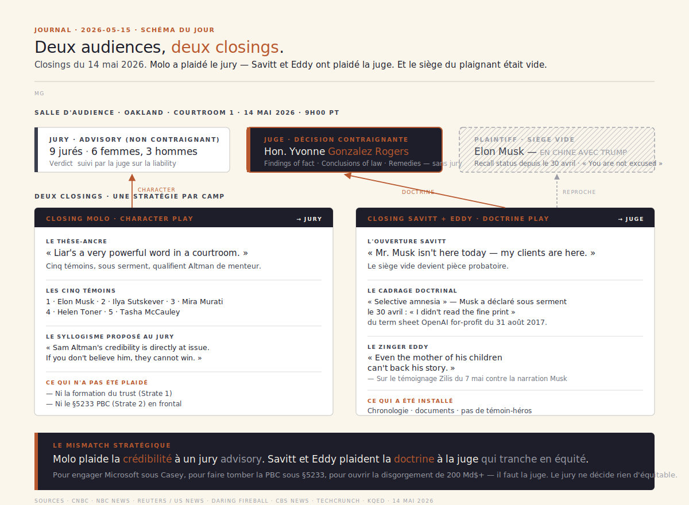

Mardi soir, j'avais écrit que Molo avait une seule voie crédible — le §5233 du *California Corporations Code*, plaidé en miroir d'un renvoi à l'Attorney General californien pour le prochain procès. Mercredi soir, j'ai corrigé en plein vol : après le pivot Kevin Scott sur Reid Hoffman, j'ai admis que la *deuxième poche* du quantum était refermée, et j'ai posé un pari à 80/20 sur la voie §5233 *directe* contre la voie *formation du trust*. Jeudi matin, à Oakland, Steven Molo a fait quelque chose que je n'avais pas mis dans la fonction d'arbitrage — il a abandonné la doctrine. Il n'a plaidé ni la Strate 1, ni la Strate 2. Il a plaidé Altman.

**La phrase, en doctrine.** *« Liar's a very powerful word in a courtroom. »* C'est la phrase d'ouverture du *closing* Molo, et elle est, en théorie de l'argumentation judiciaire, exactement le bon registre — pour un jury. La jurisprudence californienne est claire : la *credibility determination* relève d'abord du *trier of fact* ; le jury *advisory* est un *trier of fact* fictif, mais un *trier of fact* tout de même. Molo a posé la question que le jury pouvait trancher : *« Sam Altman's credibility is directly at issue. If you don't believe him, they cannot win. »* Le syllogisme est clair, populaire, télégénique. ==Il a un défaut — il ne parle pas à la personne qui décide==.

**Le mismatch, en équité.** L'audience de jeudi avait deux destinataires structurellement distincts. Le jury *advisory* à 9 jurés rendra un verdict que la juge Gonzalez Rogers a annoncé qu'elle suivrait *« very likely »* sur la liability — c'est-à-dire sur la question oui/non *« y a-t-il eu manquement à la fiducie charitable, y a-t-il eu enrichissement injustifié »*. Mais c'est tout. ==Le quantum, la disgorgement, la révocation des fiduciaires, le *unwinding* de la recap PBC d'octobre 2025 — tout cela relève de la phase *remedies*, devant la juge seule, sans jury, à partir du lundi 18 mai==. En équité, la juge décide ; le jury éclaire. Pour ouvrir l'accès aux remèdes lourds (la disgorgement de 200 Md$+ que Schizer avait posée le 7 mai), Molo avait besoin de la juge. Il a parlé au jury. Wachtell a parlé à la juge.

**Le siège vide comme pièce probatoire.** *« Mr. Musk isn't here today — my clients are here. He's off to parts unknown. »* William Savitt n'a pas désigné la chaise vide par maladresse — il l'a désignée parce que, dans le dossier de *findings of fact* que la juge s'apprête à rédiger, l'absence d'un plaignant sous *recall status* est un fait. Le 30 avril, à la sortie du témoin Musk, la juge Gonzalez Rogers avait posé la question rituelle aux deux parties : *« Is there any reason to hold Mr. Musk in recall status? »*. OpenAI : *« Yes. »* La juge : *« OK, Mr. Musk, you are not excused, but you can leave for the day. »* La formule *not excused* est précise — elle laisse au plaignant l'obligation de se rendre disponible si rappelé. Quinze jours plus tard, le plaignant est en Chine, dans la délégation d'un président des États-Unis, à 9 000 km du prétoire. En équité, le doctrine *« he who comes into equity must come with clean hands »* — déjà documentairement chargée par les 90 % d'équité demandés en 2018 — gagne un appui factuel : ==le plaignant qui réclame 200 Md$ de disgorgement n'a pas jugé devoir être présent à ses propres closings==.

**Le zinger Eddy.** Sarah Eddy a refermé sa partie de *closing* sur une seule phrase que la presse a peu commentée : *« Even the mother of his children can't back his story. »* La référence est au témoignage de Shivon Zilis du 7 mai — ancien board member d'OpenAI, mère de plusieurs enfants de Musk, qui avait sous serment contredit la narration musk-centrique de la séquence 2017-2018. La phrase est doctrinalement minutieuse. Elle n'attaque pas Musk pour ce qu'il a fait à la fiducie charitable — elle attaque sa **base évidentielle**. Quand le *settlor* présumé d'un *charitable trust* ne peut pas produire un seul témoin parmi ses cercles intimes (Sutskever est passé hostile, Achiam aussi, Zilis aussi, le board de novembre 2023 s'est rétracté) pour corroborer son récit de la promesse antécédente, le *Restatement §2* sur la formation se referme tout seul. Eddy n'a pas eu à invoquer le §15201 du *Probate Code* — elle a pointé l'absence empirique d'un témoin de soutien. C'est exactement ce qu'il faut donner à un juge en équité.

**Molo a fait l'erreur de Brockman/Altman.** Au plus mauvais moment, le *lead counsel* de Musk a appelé Greg Brockman *« Greg Altman »*. Il a aussi affirmé, dans une parenthèse argumentaire, que Musk ne demandait pas d'argent — la juge Gonzalez Rogers l'a corrigé séance tenante. Ce sont, en théorie procédurale, deux *insignifiances* — un *slip of the tongue* et une *misstatement* corrigée. En théorie probatoire, ce sont deux ajustements de *credibility* du conseil lui-même. Dans une affaire où la trame de fond est *« qui ment ? »*, c'est le pire moment pour qu'un avocat trébuche sur les noms et les chiffres. John Gruber, qui suit la procédure pour Daring Fireball, l'a résumé en un mot : *« demolition derby »*. Mais le mot juste est plus précis. Molo n'a pas perdu le débat sur la doctrine — il n'a jamais vraiment plaidé la doctrine. Il a perdu le débat sur le **registre**.

**Pourquoi Molo n'a pas plaidé la doctrine.** C'est l'arbitrage que j'avais sous-estimé. Plaider la *formation du trust* (Strate 1) demande de tenir, sur 45 minutes, une narration où les emails 2015-2018, les communiqués de presse, les réponses de podcast et le mode de fonctionnement *non-profit* affiché s'agrègent en *manifestation* du *settlor's intention to create a trust* au sens du *Probate Code §15201*. Mais après le pivot Altman du 12 mai et le pivot Scott du 13 mai, cette narration s'appuie sur des pièces qu'Altman a contestées sous serment (les promesses) et que Scott a singularisées vers un donateur consentant (Hoffman). Plaider §5233 directement demande, à l'inverse, de reconnaître implicitement que la Strate 1 est cassée — un signal de concession devant la juge à 24 heures du verdict. Molo a refusé les deux signaux. Il a sauté la doctrine — et a tablé sur le fait qu'**un jury qui juge Altman un menteur** crée un *advisory verdict* favorable assez fort pour que la juge ait *politiquement* du mal à ne pas le suivre sur la liability. C'est une lecture défendable. Mais elle pari sur la déférence de la juge à un jury qu'elle a elle-même qualifié d'*advisory*.

**La proba descend mais ne s'effondre pas.** J'ai passé Musk de 20 % à 18 %. Pas de chute brutale, et la raison est subtile : ==le pari Molo n'est pas absurde, il est juste sub-optimal==. Le jury *advisory*, instruit jeudi après-midi par la juge sur les éléments de *breach of charitable trust* et d'*unjust enrichment*, peut techniquement rendre un *verdict for plaintiff* sur la liability — la barre légale est *« preponderance of the evidence »*, et la pile probatoire Sutskever-Murati-Toner-McCauley est, en quantité, plus lourde côté Musk que côté défense. Mais entre un *advisory verdict* favorable et une *findings of fact* favorable de la juge, le delta est tout : la juge tranchera seule la phase remedies, et c'est dans la phase remedies que se joue la différence entre une *symbolic win* (un verdict de jury à peu près sans effet matériel) et une *substantive win* (la disgorgement et la révocation des fiduciaires que Musk poursuit). À 18 %, je décris exactement ce mismatch : non-trivial probabilité d'une victoire sur la liability ; faible probabilité d'une victoire sur le quantum.

**Ce qui reste à observer.** Lundi 18 mai, deux audiences parallèles dans deux salles : (a) délibérations du jury *advisory*, dont le verdict peut arriver dès lundi après-midi ou être retardé à la semaine ; (b) ouverture de la phase remedies devant la juge Gonzalez Rogers seule. Les deux audiences éclairent des questions différentes. Le verdict du jury teste si Molo a réussi son pari de registre ; l'audience remedies teste si la juge accepte, indépendamment du verdict, de considérer la disgorgement et l'*unwinding* PBC comme des remèdes d'équité disponibles. Le scénario pivot — *advisory verdict pour Musk, findings of fact favorables sur la liability, mais remedies réduits à la rescission §5233* — est, à mon sens, le plus probable. Il donnerait à Musk une *moral win* substantielle et à OpenAI une *legal win* substantielle. La presse couvrira la moral win ; le bilan corporate sera la legal win.

**À suivre**
- **Vendredi 15 mai · jour creux**. Pas d'audience programmée (calendrier 4 jours de la juge). Première occasion de lecture publique des instructions du jury, qui ont été lues à huis clos jeudi après-midi — surveiller si elles fuitent par les *pool reporters* ou si elles attendent le *jury charge* officiel disponible au greffe.
- **Lundi 18 mai · 9h00 PT — double audience**. (a) Jury *advisory* en délibération continue ; verdict possible dès l'après-midi. (b) Audience d'ouverture de la phase *remedies* devant Gonzalez Rogers seule — premier indicateur à surveiller : Molo demande-t-il, en ouverture remedies, la disgorgement complète (signal qu'il maintient la lecture Strate 2) ou la rescission §5233 + injunction (signal qu'il accepte la borne basse) ?

---

## 2026-05-14 — « I was thinking about Reid Hoffman. » Kevin Scott désamorce, sous serment, le verrou Microsoft du procès

**Exec sum**
- **Mercredi 13 mai à Oakland, dernier jour de la phase *liability*.** Les témoignages se sont terminés vers 13h00 PT après une journée à trois actes : fin de cross-examination puis redirect Savitt d'Altman, puis **Joshua Achiam** (Chief Futurist OpenAI) en court témoignage sur la séquence Musk 2018, et enfin **Kevin Scott** (CTO Microsoft) — première prise de parole publique du signataire de l'email du 7 mars 2018 ([NBC Bay Area, 13 mai 2026](https://www.nbcbayarea.com/news/local/open-ai-trial-updates-altman-musk-live/4083746/) ; [Local News Matters — Day 11, 13 mai 2026](https://localnewsmatters.org/2026/05/13/musk-v-altman-day-11-testimony-finishes-as-witness-recalls-jackass-for-safety-trophy/)).
- **La pièce centrale du jour — Kevin Scott sur son propre email**. Interrogé par Russell Cohen (Microsoft) sur la phrase *« I wonder if the big OpenAI donors are aware of these plans? Ideologically, I can't imagine that they funded an open effort to concentrate ML talent so that they could then go build a closed, for-profit thing on its back »*, Scott a répondu sous serment : *« Primarily, I was thinking about Reid Hoffman. He was the OpenAI donor I knew. »* Pas Musk, pas une catégorie générique de donateurs — un nom propre ([GeekWire, 13 mai 2026](https://www.geekwire.com/2026/microsofts-cto-testifies-about-email-at-the-heart-of-elon-musks-allegations-against-tech-giant/) ; [Yahoo Finance, 13 mai 2026](https://finance.yahoo.com/sectors/technology/articles/openai-trial-wraps-testimony-reid-225426995.html)).
- **L'élément qui ferme la porte — le dîner au Flea Street Cafe**. Plus tard la même année 2018, Scott a témoigné avoir appris, lors d'un dîner avec Altman et l'ex-Microsoft Craig Mundie au Flea Street Cafe de Menlo Park, que ==Hoffman — précisément le donateur dont il s'inquiétait — investissait dans le nouveau for-profit *et* rejoignait le board du non-profit==. À ce même dîner : la structure *capped profit*, le round de 500 M$, et le départ d'Altman de Y Combinator pour diriger OpenAI à plein temps ([GeekWire, 13 mai 2026](https://www.geekwire.com/2026/microsofts-cto-testifies-about-email-at-the-heart-of-elon-musks-allegations-against-tech-giant/)).
- **Le chiffre cumulé Microsoft confirmé — 100 Md$+**. Michael Wetter, VP corporate development Microsoft, a confirmé sous serment que d'ici juin 2026, Microsoft aura **dépensé plus de 100 milliards de dollars** sur le partenariat OpenAI, investissements + infrastructure + hosting cumulés. La somme se compare au mémo Brad Smith de janvier 2023 — projection 92 Md$ de retour sur 13 Md$ — déposé jeudi 7 mai en cross de Schizer ([The Tech Portal, 13 mai 2026](https://thetechportal.com/2026/05/13/microsoft-executive-reveals-company-spent-over-100bn-on-openai-partnership-during-musk-vs-openai-trial/) ; [CNBC, 13 mai 2026](https://www.cnbc.com/2026/05/13/microsoft-feared-openai-reliance-musk-altman-trial-testimony-reveals.html)).
- **Joshua Achiam, le « jackass for safety ».** Le Chief Futurist d'OpenAI a raconté un *all-hands* de mai 2018 où Musk annonçait son départ pour construire son propre AGI *« very fast, because he was very worried that someone else, if they got it, would do the wrong thing with it »*. Achiam, qui avait alors 26 ans, a publiquement qualifié l'approche d'*« unsafe and reckless »* — *« we had a pretty tense exchange, and he snapped and called me a jackass »*. Dario Amodei et David Luan lui ont offert un trophée gravé *« never stop being a jackass for safety »*. La juge Gonzalez Rogers a **refusé d'admettre le trophée en pièce** ([Local News Matters — Day 11, 13 mai 2026](https://localnewsmatters.org/2026/05/13/musk-v-altman-day-11-testimony-finishes-as-witness-recalls-jackass-for-safety-trophy/) ; [AOL / Yahoo, 13 mai 2026](https://www.aol.com/articles/openai-exec-recalls-tense-exchange-190952873.html)).
- **Le redirect Savitt sur Altman**. Avant Achiam et Scott, Savitt a refermé le cycle Altman : *« I thought incredibly highly of Elon »*, et a confirmé que Musk avait *« abandoned »* ses co-fondateurs en 2018 — *« I think it's wonderful that, through the hard work of thousands of people, we have been able to create one of the largest nonprofits in the world »* ([NBC News, 13 mai 2026](https://www.nbcnews.com/tech/tech-news/sam-altman-takes-stand-defend-openai-elon-musk-claims-rcna344698) ; [Axios, 13 mai 2026](https://www.axios.com/2026/05/13/openai-trial-sam-altman-elon-musk-ai-safety)).
- **Calendrier verrouillé**. **Closings jeudi 14 mai matin** devant le jury *advisory* à 9 jurés. Délibérations du jury possibles dès jeudi après-midi ; *findings of fact and conclusions of law* de la juge Gonzalez Rogers attendus la semaine du 18 mai ([NBC Bay Area, 13 mai 2026](https://www.nbcbayarea.com/news/local/open-ai-trial-updates-altman-musk-live/4083746/) ; [CNBC, 13 mai 2026](https://www.cnbc.com/2026/05/13/altman-musk-trial-testimony-takeaways.html)).

**Angle du jour — Kevin Scott désamorce sous serment la pièce que j'avais désignée, le 11 mai, comme la plus dangereuse de la défense Microsoft. La deuxième poche du quantum se referme — et m'oblige à me corriger en plein vol.**

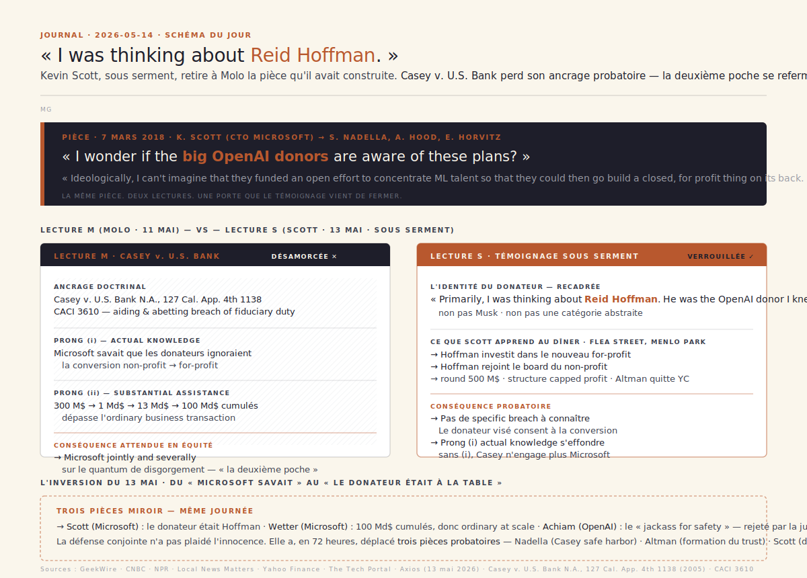

Lundi 11 mai, j'ai écrit que l'email de Kevin Scott du 7 mars 2018 — *« I wonder if the big OpenAI donors are aware of these plans? »* — était la pièce probatoire la plus structurellement gênante du procès pour la défense Microsoft. J'ai construit, ligne à ligne, le pont doctrinal vers *Casey v. U.S. Bank* : prong (i) actual knowledge documentée, prong (ii) substantial assistance disqualifiée par l'arithmétique 13 Md$ → 228 Md$, conséquence en équité une responsabilité *jointly and severally* de Microsoft sur le quantum de disgorgement. J'avais nommé ce mouvement la *deuxième poche du quantum*. Mercredi 13 mai à Oakland, en moins de trente minutes à la barre, Kevin Scott a désamorcé la pièce. Je dois me corriger — et c'est exactement le genre de retournement qu'un journal d'auteur doit assumer en direct, pas en révision rétrospective.

**La phrase, en doctrine.** *« Primarily, I was thinking about Reid Hoffman. He was the OpenAI donor I knew. »* La formule est minutieuse. Pas *« donors »* au pluriel abstrait — un nom propre, singularisé, identifié. Et la suite — la séquence du dîner au Flea Street Cafe de Menlo Park, avec Altman et Craig Mundie — verrouille la singularisation : *« Hoffman, the donor he had wondered about, was actually investing in OpenAI's new for-profit entity and joining the non-profit board. »* Le verbe est *« investing in »* et *« joining »*, au présent continu de la nouvelle structure. ==Le donateur dont Scott s'inquiétait, dans la même conversation où il s'inquiétait, devenait l'actionnaire et l'administrateur de l'entité au sujet de laquelle il s'inquiétait.== En théorie du droit de l'équité, ce mouvement a un nom : *consent of the beneficiary* — quand le bénéficiaire d'une fiducie consent à l'acte qui aurait été un manquement, le manquement cesse d'exister à son égard.

**Strate 1, encore.** Hier, j'ai écrit qu'Altman avait déplacé l'audience principale du *breach* (Strate 2) vers la **formation du trust** (Strate 1) ; et lundi, j'avais écrit que Nadella avait déplacé le *aiding and abetting* (Casey) du *substantial assistance* vers le *safe harbor de la nécessité opérationnelle*. Mercredi, Scott a fait le troisième mouvement — il a déplacé le prong (i) de Casey du *« Microsoft savait que les donateurs ignoraient »* vers le *« Microsoft savait que le donateur que je connaissais consentait »*. Trois témoins, trois jours, **trois pivots de Strate 1**. Ce n'est plus une coïncidence — c'est une architecture de défense. Wachtell, Microsoft (Cohen) et l'équipe Altman ont, en 72 heures de séquence Nadella-Altman-Scott, refusé de plaider sur la Strate 2 (le manquement, le quantum, la *substantial assistance*) et ont, à chaque tour, contesté la *base sur laquelle le fond repose*. C'est une stratégie probatoire d'une cohérence remarquable, et j'avais sous-estimé sa portée jusqu'à mercredi 13 mai à 11h00 PT.

**Le coût pour Molo.** L'email Scott n'est pas neutralisé en pièce — il reste au dossier, daté, attribué, signé. Mais son **poids probatoire** sur le prong (i) Casey s'effondre. ==Pour engager Microsoft sous *Casey v. U.S. Bank*, Molo a besoin de l'*actual knowledge of a specific breach of fiduciary duty*. Si le donateur que Scott avait en tête est Hoffman, si Hoffman lui-même a accepté la conversion en y participant — investissement dans le for-profit, siège au board du non-profit — alors le *specific breach* qu'aurait fallu connaître est introuvable : il n'y a pas eu de manquement aux attentes de ce donateur, parce que ce donateur a participé à la décision.== Et Hoffman n'est pas un donateur marginal du dossier : c'est, après Musk, le plus gros donateur identifiable de la phase 2015-2017 d'OpenAI, et il siège au board de Microsoft depuis 2017. La pièce qui aurait dû documenter la *clandestinité* de la conversion documente, après le témoignage Scott, sa **publicité dans le cercle des fiduciaires concernés**.

**Le mouvement miroir des chiffres.** Pendant que Scott désamorçait le prong (i), Michael Wetter installait, sans le dire, le contrepoint du prong (ii). Les **100 Md$+ cumulés Microsoft** annoncés sous serment ne sont pas un argument de l'attaque — c'est, en *defense exhibit*, l'**asymétrie structurelle** que Cohen va plaider jeudi en *closing*. La doctrine *Casey* protège les *ordinary business transactions* — la défense Microsoft, depuis lundi Nadella, soutient que la singularité d'OpenAI ne se mesure pas à la nature du deal (qui reste un contrat commercial cloud + investissement minoritaire) mais à son **échelle**. À 100 Md$ cumulés, un fournisseur de compute ne devient pas un *aider and abettor* — il devient une **infrastructure**. C'est une lecture qui ferait sourire un juriste corporate, mais elle a, en équité, un mérite probatoire : elle force Molo à plaider que Microsoft a fait *autre chose* que du business à grande échelle. Sans la pièce Scott pour ancrer le *specific breach*, l'autre chose est doctrinalement introuvable.

**Le trophée que la juge a refusé.** Joshua Achiam et son trophée *« jackass for safety »* sont, à mon sens, la mise en scène la plus révélatrice de la journée — et pas pour les raisons que la presse en a tirées. La juge Gonzalez Rogers a **refusé d'admettre le trophée en pièce**. Refus précis, daté, formel. Le geste est doctrinal, pas symbolique : un trophée n'est pas un document contemporain de la conduite alléguée ; il est un *artefact rétrospectif*. La juge protège son dossier de *findings of fact* de l'ornementation narrative — elle ne retiendra que ce qui se mesure en équité. Cette discipline-là, à 24 heures des closings, en dit long sur ce qu'elle s'apprête à rédiger. Le jury *advisory* aura entendu le récit ; la juge ne le retiendra pas.

**Ce qui reste à Molo, à 18 heures des closings.** Une seule voie. La même que j'évoquais hier soir : ramener tout, en *closing*, sur le **§5233** du *California Corporations Code*. Devoirs des *directors* d'une *Public Benefit Corporation*, attachés à la PBC en tant que telle, sans détour par une promesse antérieure à un settlor (Strate 1 d'Altman cassée) et sans détour par un *aiding and abetting* tiers (Strate 1 de Scott cassée). C'est un terrain doctrinalement étroit — §5233 demande une *interested transaction* documentée, un *standing* statutaire que Musk n'a qu'à demi, et un remède (rescission, injonction, restitution de valeur) qui ne donne pas accès à la disgorgement de 200 Md$+ que Schizer avait posée jeudi 7 mai comme borne basse. Mais c'est, à ce stade, le seul anneau qui reste au dossier. Si Molo plaide jeudi matin la formation du trust (Strate 1) avant le §5233 (Strate 2), c'est qu'il refuse la concession ; s'il plaide directement §5233, c'est qu'il a vu la perte sur la Strate 1 et qu'il optimise. Je parie, à 80/20, sur la seconde option.

**À suivre**
- **Jeudi 14 mai · 9h00 PT** : closings. Premier indicateur — l'ordre des plaidoiries. Wachtell + Microsoft conjoints ou séparés ? Si conjoints, c'est la trame Strate 1 + Strate 1 + Strate 1 ; si séparés, c'est que Cohen veut isoler le *safe harbor Casey* du *no promise* d'Altman pour le cas où la juge retient l'un sans l'autre. Deuxième indicateur — la durée allouée à la *formation du trust* par Molo : moins de 20 minutes signale concession partielle, plus de 45 minutes signale contestation frontale.
- **Vendredi 15 mai** : pas de séance par défaut (calendrier 4 jours de la juge), sauf si le jury *advisory* délibère vendredi. Premier verdict *advisory* possible.
- **Semaine du 18 mai** : *findings of fact and conclusions of law* de la juge Gonzalez Rogers — la pièce qui décidera réellement de l'affaire. Le verdict du jury n'est qu'*advisory* ; la doctrine §78 + §5233 + *Casey* se jouera dans le document de la juge, pas dans la note du jury.

---

## 2026-05-13 — « There were never any promises. » Altman n'attaque pas le manquement — il attaque la formation du trust

**Exec sum**
- **Mardi 12 mai à Oakland, journée Altman complète.** Le CEO d'OpenAI a témoigné environ quatre heures devant la juge Yvonne Gonzalez Rogers et le jury *advisory* — direct examination par **William Savitt** (Wachtell Lipton, *lead counsel* d'OpenAI/Altman/Brockman), cross-examination par **Steven Molo**. Tonalité Altman calme, voix posée, longues pauses en ouverture de cross, plus à l'aise vers la fin ([CNN Business, 12 mai 2026](https://www.cnn.com/2026/05/12/tech/sam-altman-openai-vs-elon-musk-testimony) ; [CNBC, 12 mai 2026](https://www.cnbc.com/2026/05/12/openai-trial-updates-sam-altman-set-to-testify-in-musk-suit.html) ; [NPR, 12 mai 2026](https://www.npr.org/2026/05/12/nx-s1-5811730/openai-sam-altman-testimony-elon-musk-trial)).
- **La pièce centrale en direct examination Savitt** : Altman a affirmé sous serment *« neither he nor the other founders made any promises to Musk that they would not pursue a for-profit subsidiary in the future »*. Cadrage de la défense, posé par Savitt lui-même dans sa direct sur Brockman puis verrouillé par Altman : *« there were never any promises made that could form the charitable trust that Mr. Musk says existed »* ([CNBC, 12 mai 2026](https://www.cnbc.com/2026/05/12/openai-trial-updates-sam-altman-set-to-testify-in-musk-suit.html) ; [Piedmont Exedra — Day 10, 12 mai 2026](https://piedmontexedra.com/2026/05/musk-v-altman-day-10-openai-ceo-rejects-claims-he-acted-selfishly-stole-the-charity)).
- **Sur la demande de contrôle de Musk, chiffre nouveau** : *« An early number that Mr Musk threw out was that he should have 90 percent of the equity to start »*, *« It then softened, but it always was a majority »* ; et *« My belief is he wanted to have long-term control and that he would have had that had we agreed to the structure he wanted »* ([Al Jazeera, 12 mai 2026](https://www.aljazeera.com/news/2026/5/12/sam-altman-says-elon-musk-wanted-90-percent-of-openai-in-high-stakes-trial)).
- **Rejet frontal du framing « stole a charity »** : *« It feels difficult to even wrap my head around that framing »*. Sur le départ de Musk du board en 2018 : *« morale boost »* pour les chercheurs qu'avait *« demotivated »* le *management style* Musk — Altman dit ne pas penser que Musk *« understood how to run a good research lab »*. Sur l'agressivité commerciale de xAI depuis 2023 : *« Mr. Musk did try to kill it »* — débauchage, *« business interference »*, lancement d'un concurrent direct ([Piedmont Exedra — Day 10](https://piedmontexedra.com/2026/05/musk-v-altman-day-10-openai-ceo-rejects-claims-he-acted-selfishly-stole-the-charity) ; [NBC News, 12 mai 2026](https://www.nbcnews.com/tech/tech-news/sam-altman-takes-stand-defend-openai-elon-musk-claims-rcna344698)).
- **Cross Molo ouvre par une question d'une ligne** : *« Are you completely trustworthy? »*. Altman : *« I believe I'm a truthful person »*, puis se qualifie d'*« honest and trustworthy business person »*. Molo enchaîne sur Murati, Sutskever, Toner, McCauley, Sue Yoon, employés de Loopt 2010, Dario Amodei (Anthropic), et cite l'article du New Yorker *« Sam Altman May Control Our Future — Can He Be Trusted? »*. Altman dit ne pas être au courant de *« some specific accusations »* — non-démenti tactique ([Fortune, 12 mai 2026](https://fortune.com/2026/05/12/sam-altman-testimony-open-ai-elon-musk-trial/) ; [Yahoo Finance / Reuters, 12 mai 2026](https://finance.yahoo.com/news/openais-altman-faces-questions-about-lying-disclosures-from-musks-attorney-in-trial-202932309.html)).
- **Pièce-clé Molo en fin de cross** : le texto Altman → Musk du **18 février 2023** — *« I'm tremendously thankful for everything you've done to help. I don't think that OpenAI would have happened without you. »* Question miroir : avez-vous changé d'avis ? Altman : *« I have changed my view on Elon significantly »* ([CNN Business, 12 mai 2026](https://www.cnn.com/2026/05/12/tech/sam-altman-openai-vs-elon-musk-testimony)).
- **Calendrier** : closings **jeudi 14 mai** confirmés. *Findings of fact and conclusions of law* de la juge + verdict *advisory* du jury possibles dès la semaine du 18 mai. Calendrier exceptionnellement comprimé pour une affaire d'équité de cette ampleur ([CNBC, 12 mai 2026](https://www.cnbc.com/2026/05/12/openai-trial-updates-sam-altman-set-to-testify-in-musk-suit.html)).

**Angle du jour — « There were never any promises. » Altman n'attaque pas le manquement — il attaque la formation du trust. Et Wachtell + Microsoft ont en 48 heures changé la question.**

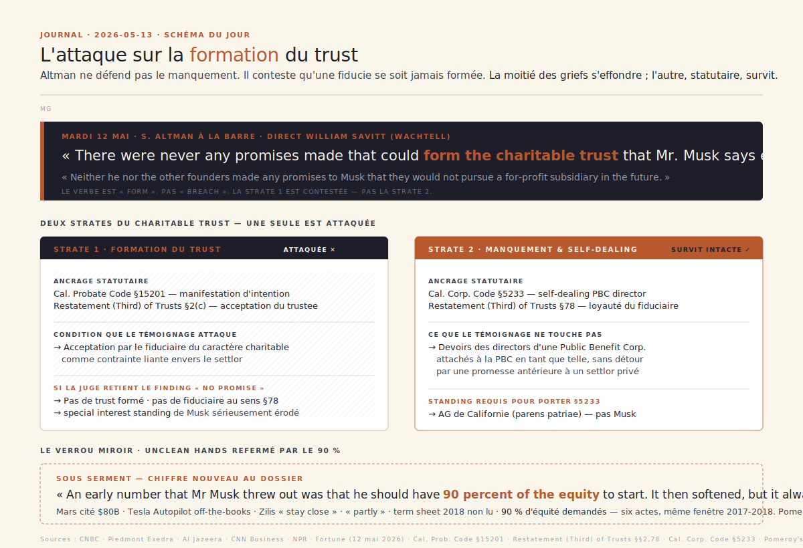

Hier, j'ai écrit que Nadella avait, par la *one-way door*, refermé le *safe harbor* de *Casey* sur la deuxième poche du quantum — qu'il avait changé l'objet de l'audience en passant de la *fairness* à la *nécessité opérationnelle*. Mardi 12 mai, à 8h00 PT, Sam Altman a fait exactement le mouvement miroir sur l'audience principale. Il n'a pas plaidé qu'il n'avait pas manqué à sa fiducie. Il a plaidé, sous serment, qu'==il n'y avait pas de fiducie==. Et la presse, là encore, ne l'a pas vue.

**La phrase, en doctrine.** *« There were never any promises made that could form the charitable trust that Mr. Musk says existed. »* La formule est de William Savitt — *lead counsel* d'OpenAI — et elle a été posée d'abord dans la direct sur Brockman, puis verrouillée par Altman sous serment hier matin : *« neither he nor the other founders made any promises to Musk that they would not pursue a for-profit subsidiary in the future »*. Le verbe est *« form »*. Pas *« breach »*. La défense conjointe n'attaque plus le manquement ; elle attaque la **constitution même** de la fiducie. Pour comprendre la portée du mouvement, il faut tenir deux strates doctrinales que tout le procès, depuis l'ouverture, avait empilées sans les distinguer.

**Strate 1 — la formation du trust.** Le *California Probate Code* §15201 pose la règle générale : *« A trust is created only if the settlor properly manifests an intention to create a trust. »* Le *Restatement (Third) of Trusts* §2 reprend les trois conditions du *charitable trust* : (a) intention du settlor de créer un *charitable use*, (b) bénéficiaire défini ou définissable, (c) ==acceptation par le trustee du caractère charitable comme contrainte liante==. Cette troisième condition — l'acceptation du fiduciaire — est précisément ce que Savitt et Altman attaquent. Si aucune promesse explicite n'a été faite à Musk de maintenir OpenAI en *non-profit*, alors la conversion 2019 (capped-profit), les transactions Microsoft 2023, et la recap PBC d'octobre 2025 ne sont pas la **violation d'une fiducie** — elles sont l'**exercice d'une option toujours réservée**. L'argument est radical : il ne plaide pas qu'OpenAI a respecté le *charitable trust*. Il plaide qu'aucun *charitable trust* ne s'est jamais formé entre Musk et les fondateurs.

**Strate 2 — le manquement.** Le *Restatement §78* sur la loyauté du *fiduciary* et le *California Corporations Code* §5233 sur les *self-dealing transactions* d'un *director* de *public benefit corporation* opèrent sur un terrain distinct. ==§78 présuppose un fiduciaire d'un trust ; §5233 présuppose un directeur d'une PBC.== Les deux ne se confondent pas. Si la juge Gonzalez Rogers retient le *finding* « no promise », le §78 s'effondre — il n'y a pas eu de trust ; il n'y a donc pas eu de fiduciaire au sens du Restatement. Mais le §5233 **survit intact** : les devoirs des *directors* d'une PBC sont attachés à la PBC en tant que telle, sans détour par une promesse antérieure à un settlor privé. Le pivot est doctrinalement chirurgical : il fait tomber la moitié des griefs (ceux fondés sur la fiducie charitable) sans toucher l'autre (ceux fondés sur la gouvernance statutaire).

**La conséquence en équité.** Si le *finding* « no promise » entre dans les *findings of fact*, trois choses bougent simultanément. ==Premièrement, le *special interest standing* de Musk, que la juge avait reconnu en janvier 2026 malgré l'accord d'octobre 2025, s'érode sérieusement== : il n'est plus *settlor d'un trust trahi*, il est *donateur dont les conditions implicites n'ont jamais été contractualisées*. La différence est binaire en droit. Deuxièmement, le *aiding and abetting* contre Microsoft sous *Casey v. U.S. Bank* — que Nadella avait déjà neutralisé par sa Voice 3 — perd son ancrage doctrinal : aider quelqu'un à manquer à une fiducie qui n'existe pas n'est pas un *aiding and abetting*. Troisièmement, la disgorgement comme remède d'équité, calibrée jeudi 7 mai par Schizer à *« a lot more than $200 billion »*, perd sa base juridique principale — les §5233 *self-dealing remedies* ne donnent pas accès à une disgorgement de cette ampleur, leur palette tient à la rescission, à l'injonction, à la restitution de la valeur de transaction.

**Le 90 % comme verrou miroir.** Pendant que Savitt installait la Strate 1 en direct, Wachtell refermait l'*unclean hands defense* construite depuis le 6 mai. Altman a confirmé, sous serment, le chiffre qu'on attendait : *« An early number that Mr Musk threw out was that he should have 90 percent of the equity to start »*. Ce n'est pas une anecdote — c'est la pièce qui transforme le qualificatif *settlor* en *control-seeker*. Mars cité $80B (Brockman), Tesla Autopilot off-the-books (Brockman), Zilis *« stay close and friendly to OpenAI »* (Zilis), *partly* (Musk), term sheet 2018 non lu (Musk), et désormais 90 % d'équité demandés. Six actes dans la même fenêtre 2017-2018, attestés sous serment ou par pièce contemporaine. Le *Pomeroy* §397 — *« he who comes into equity must come with clean hands »* — devient documentairement irréfutable. Pour la juge, c'est désormais un verrou binaire : avant même de toucher au fond §5233, elle peut refuser le remède pour défaut de qualité du demandeur.

**Ce que Molo n'a pas pu démonter.** La cross Molo a été technique mais structurellement insuffisante. *« Are you completely trustworthy? »* — Altman : *« I believe I'm a truthful person »*. Suivi de Loopt, Amodei, Murati, Sutskever, Toner, McCauley, Sue Yoon. Altman a dit, prudemment, ne pas être *« aware of »* certaines accusations spécifiques. Ce n'est pas un démenti ; c'est un évitement. Pour la juge, en équité, l'évitement est probatoirement neutre — le pattern Murati/Toner/McCauley reste au dossier. Mais le texto du 18 février 2023 que Molo a déposé en fin de cross — *« I'm tremendously thankful... OpenAI would not have happened without you »* — a été retourné contre lui en deux mots : *« I have changed my view on Elon significantly. »* Le contrat narratif que Molo voulait — *« Altman ment dans le temps »* — s'est converti, sous serment, en *« Altman a entretenu une relation qui s'est rompue »*. Du carburant pour le jury *advisory* ; aucune valeur en équité.

**Le pivot stratégique de la semaine 3.** En 48 heures, la défense conjointe a fait quelque chose que je n'avais pas anticipé. Lundi, Nadella a déplacé l'audience de la *fairness* (Strate 2) vers la *nécessité opérationnelle* (Strate 1 du *aiding and abetting*). Mardi, Altman a déplacé l'audience principale du *breach* (Strate 2) vers la **formation du trust** (Strate 1 du §78). ==Les deux mouvements sont des attaques de strate 1 — pas des défenses sur le fond, mais des contestations de la base sur laquelle le fond repose.== Pour Molo, jeudi en *closing*, c'est le pire setup possible : il doit replaider l'existence de la fiducie avant de pouvoir replaider son manquement. Une closing argument à deux étages, devant un jury *advisory* qui n'a aucune compétence sur la Strate 1, et devant une juge qui sait que c'est exactement là que se joue la décision.

**Ce qui reste à Molo.** Une seule voie crédible — et elle ne passe pas par Musk. Le §5233 *Public Benefit Corporation* survit, comme je l'ai dit. Mais §5233 demande une qualité de *standing* qui n'est pas le *special interest standing* d'un *settlor* présumé : c'est le standing statutaire de l'**Attorney General** de Californie (parens patriae) et, accessoirement, du *director* de la PBC ou d'un *member* qualifié. L'AG californien est resté en retrait depuis l'audience d'ouverture, en *amicus* discret. Si Molo veut sauver le quantum, c'est à l'AG qu'il doit, en *closing*, **renvoyer la balle** : non pas pour ce procès — il est trop tard — mais pour le prochain. La phrase de jeudi qui change tout serait : *« Si la juge retient que Musk n'a pas le standing du settlor, alors les findings doctrinaux de ce procès doivent être déposés en main de l'AG pour la suite procédurale qui s'impose. »* C'est étroit, mais c'est jouable.

**À suivre**
- **Mercredi 13 mai · 8h00 PT** : possible suite Altman en *redirect* Savitt si Wachtell veut consolider la « no promise », ou témoignage d'un dernier témoin court avant les *closings*. Surveiller si la juge introduit un *bench ruling* préparatoire sur le périmètre des *findings* — signal qu'elle a déjà arbitré la Strate 1 vs Strate 2.
- **Jeudi 14 mai** : closings. Premier indicateur à surveiller : si Molo plaide la *trust formation* en première heure (signal qu'il a vu le pivot Savitt-Altman) ou s'il commence par le §5233 (signal qu'il accepte la perte de Strate 1 et se replie sur la base PBC). Le second signal vaudra concession partielle ; le premier vaudra contestation frontale, avec une chance asymétriquement plus faible de l'emporter.

---

## 2026-05-12 — « One-way door. » Nadella choisit la troisième voie — celle que Casey n'attendait pas

**Exec sum**
- **Lundi 11 mai à Oakland, journée Nadella sur la quasi-intégralité de la séance.** Le CEO de Microsoft a témoigné plusieurs heures, costume bleu marine, conduite directe Russell Cohen puis contre-interrogatoire Steven Molo ([CNBC, 11 mai 2026](https://www.cnbc.com/2026/05/11/microsoft-ceo-satya-nadella-musk-altman-trial.html) ; [NBC News, 11 mai 2026](https://www.nbcnews.com/tech/elon-musk/microsoft-ceo-satya-nadella-testifies-musk-openai-trial-rcna344584)).
- **Le cadrage central, posé d'entrée par Nadella : « one-way door ».** Microsoft, dit-il, *« couldn't build two supercomputers — one for itself and one for OpenAI »*, et a accepté *« the opportunity cost of diverting computing resources »* parce que *« we were outsourcing essentially a lot of the core IP development »* ([GeekWire, 11 mai 2026](https://www.geekwire.com/2026/musk-v-altman-satya-nadella-was-worried-about-microsoft-being-the-next-ibm-in-openai-deal/) ; [AlphaPilot, 11 mai 2026](https://www.alphapilot.tech/discover/nadella-testifies-in-musk-v-openai-microsoft-ceo-defends-partnership-and-commercial-strategy)).
- **L'analogie IBM, en email interne pré-investissement avril 2022** : Nadella écrivait à son équipe ne pas vouloir que *« Microsoft becomes IBM while OpenAI becomes the next Microsoft »* — pièce introduite directe par Cohen pour ancrer la *risk-taking commercial partner* avant la cross ([GeekWire, 11 mai 2026](https://www.geekwire.com/2026/musk-v-altman-satya-nadella-was-worried-about-microsoft-being-the-next-ibm-in-openai-deal/)).
- **Cross-examination Molo : pièce centrale, un mémo Brad Smith de janvier 2023 au board Microsoft**, projetant **92 Md$ de retour sur les 13 Md$ cumulés** investis dans OpenAI, avec note de bas de page actant *« a 20% annual increase starting in 2025 »*. Nadella confirme les chiffres puis répond, avec une hedge que Molo n'a pas pu démonter en séance : *« the return could just as easily have been zero »* ([GeekWire, 11 mai 2026](https://www.geekwire.com/2026/musk-v-altman-satya-nadella-was-worried-about-microsoft-being-the-next-ibm-in-openai-deal/) ; [AlphaPilot, 11 mai 2026](https://www.alphapilot.tech/discover/nadella-testifies-in-musk-v-openai-microsoft-ceo-defends-partnership-and-commercial-strategy)).
- **Sur le firing de novembre 2023 — admission concédée par Nadella** : Microsoft a demandé une explication au board sortant et n'a *« never been given clarity »* sur les motifs ; Cohen a posé la pièce pour caractériser Microsoft comme **outsider à la gouvernance interne** d'OpenAI au moment décisionnaire ([Yahoo Finance / AP, 11 mai 2026](https://finance.yahoo.com/news/microsoft-ceo-says-he-was-never-given-clarity-on-why-altman-was-fired-from-openai-during-musk-trial-195321721.html) ; [AOL / AP, 11 mai 2026](https://www.aol.com/articles/microsoft-ceo-satya-nadella-defends-224118476.html)).
- **Bascule de fin d'après-midi : Sutskever en personne à la barre** (pas par déposition vidéo comme annoncé samedi). Confirme avoir compilé pendant *« about a year »* un document de plus de **50 pages** documentant un *« consistent pattern of lying »* d'Altman, à la demande du board ; qualifie la *removal* de novembre 2023 de *« Hail Mary »* ; reconnaît son vote de réintégration et son *« regret »* ultérieur ([KQED, 11 mai 2026](https://www.kqed.org/news/12083224/former-openai-exec-calls-decision-to-remove-sam-altman-a-hail-mary-during-musk-trial) ; [Business Standard / Reuters, 12 mai 2026](https://www.business-standard.com/technology/tech-news/gathered-proof-of-altman-s-dishonesty-for-a-year-ex-openai-exec-sutskever-126051200204_1.html) ; [Benzinga, 11 mai 2026](https://www.benzinga.com/markets/tech/26/05/52474926/ilya-sutskever-case-against-sam-altman-pattern-of-lying)).
- **Calendrier qui se resserre.** Altman attendu à la barre **mardi 12 mai** ; **closings jeudi 14 mai** confirmés par Gonzalez Rogers — séquence Sutskever passée du *winding-down* de fin de semaine au *front-loaded* de début de semaine 3 ([Washington Post, 12 mai 2026](https://www.washingtonpost.com/business/2026/05/12/altman-musk-openai-trial/d3c73adc-4db7-11f1-97e7-22c6c29ff0d8_story.html)).

**Angle du jour — La troisième voie. Nadella a tenu trois heures la voie médiane que je donnais hier pour intenable. Casey v. U.S. Bank trouve son safe harbor — et la « deuxième poche » se referme.**

Hier, j'ai écrit que Nadella avait deux voies, et que la voie médiane — *« nous étions un partenaire commercial, pas un gardien de la mission charitable »* — était *« techniquement plausible »* mais *« difficile à tenir trois heures sous le contre-interrogatoire de Molo »*. J'avais raison sur la difficulté ; j'avais tort sur l'issue. Nadella a tenu la voie médiane. Pas en distinguant son rôle de CEO ligne à ligne de celui de Kevin Scott CTO — ce que je donnais pour le piège — mais en **changeant l'objet de l'audience**. La défense Microsoft n'a pas plaidé la *fairness* des transactions ; elle a plaidé la *nécessité opérationnelle* du partenariat. Ce n'est pas la même équité.

**La pièce, en doctrine.** *« One-way door »* : Microsoft, en 2018-2019, ne pouvait pas construire *« two supercomputers — one for itself and one for OpenAI »* — la contrainte n'est pas un argument, c'est une description matérielle de la rareté du compute à l'époque. *« We were outsourcing essentially a lot of the core IP development »* : Microsoft décrit ici sa décision comme un **abandon de souveraineté sur le R&D**, pas comme une mainmise sur OpenAI. La syntaxe est précise — *outsourcing* est le verbe d'un client qui n'a pas d'option, pas d'un partenaire qui en a. Et le *« calculated risk »* qu'il ajoute lui sert de borne basse rhétorique : *« the return could just as easily have been zero »*. Ces trois phrases, prises ensemble, ne plaident pas l'innocence ; elles plaident la **nécessité**. C'est précisément ce que la doctrine *Casey* protège.

**Le safe harbor, relu.** *Casey v. U.S. Bank N.A.*, 127 Cal. App. 4th 1138 (2005), pose deux *prongs* pour l'*aiding and abetting* — connaissance réelle + assistance substantielle. Le bémol qui définit le *safe harbor* est dans le même arrêt : *« a bank's conduct in executing ordinary business transactions for a customer, even if the bank knows the customer is engaged in wrongdoing, does not constitute substantial assistance »*. ==C'est exactement le périmètre dans lequel Nadella a installé toute son audience : Microsoft a vendu du compute à un client, sous contrainte de rareté, en sachant que l'investissement pouvait aller à zéro==. La connaissance documentée par l'email Scott de mars 2018 — *« I wonder if the big OpenAI donors are aware of these plans? »* — n'est pas réfutée. Elle est **redéplacée** : la doctrine *Casey* admet la connaissance, à condition que l'assistance reste *ordinary*. Le débat n'est plus *« Microsoft savait-il ? »* — c'est *« Microsoft a-t-il fait autre chose que du business ordinaire ? »*. Pour la juge Gonzalez Rogers, la *ordinary-ness* d'une transaction se juge **ex ante**, au moment de la décision — pas *ex post*, à la lumière du retour 17×. Nadella a tenu l'*ex ante*.

**Le seul point faible — et il est sérieux.** Molo a déposé sur la barre le mémo Brad Smith de janvier 2023 au board Microsoft : projection de **92 Md$ de retour sur les 13 Md$ investis**, note de bas de page actant *« a 20% annual increase starting in 2025 »*. C'est la pièce qui contredit la *one-way door* : un mémo de gouvernance interne qui modélise précisément l'upside structurel de la conversion non-profit→capped-profit→PBC, **sept ans après le mail Scott et trois ans avant la recap PBC d'octobre 2025**. Si la juge retient ce mémo comme **trace contemporaine de modélisation de l'upside**, alors la doctrine *« ordinary business transaction »* se fissure : on ne peut pas, en équité, modéliser à 92 Md$ une participation dans une charité en cours de conversion et plaider ensuite la nécessité opérationnelle aveugle. Nadella le savait — d'où la hedge *« could have been zero »*, qui n'est pas une rétractation mais une couverture probatoire. Molo n'a pas démonté la hedge en séance ; il devra y revenir en *closing* jeudi.

**Et Sutskever, au même moment.** Pendant que Nadella refermait Casey à l'audience principale, Sutskever a déposé en personne — pas par vidéo comme annoncé — son document de 50+ pages compilé sur *« about a year »*, documentant un *« consistent pattern of lying »* d'Altman. C'est la pièce probatoire la plus directe que Molo ait obtenue depuis l'ouverture. Mais Sutskever est venu avec **son propre poison** : il a qualifié la *removal* de novembre 2023 de *« Hail Mary »*, reconnu son vote de réintégration, exprimé son *regret* ultérieur. ==Wachtell va exploiter la phrase « Hail Mary » en closing — un fiduciaire qui qualifie sa propre action de coup de désespoir n'est pas un témoin du manquement, c'est un témoin de l'erreur de jugement==. La 50-page deposition reste au dossier ; son poids en équité dépend désormais de l'arbitrage qualitatif que la juge fera entre le contenu (factuel, daté, contemporain) et le cadrage (rétrospectif, regretté, *Hail Mary*).

**Le pivot stratégique de la semaine 3.** En une journée, la défense conjointe a fait ce que ni Wachtell seul ni Microsoft seul n'avaient réussi en deux semaines : produire une lecture cohérente où **chaque co-défendeur prend la part du risque qui lui convient**. Microsoft = client sous contrainte, pas co-conspirateur. OpenAI = fiduciaire dont le board a, à un moment, paniqué (Sutskever *« Hail Mary »*) puis s'est rétracté (vote de réintégration). Reste Altman, qui prend la barre aujourd'hui. La trame que Wachtell va lui dérouler est désormais lisible : *je n'ai pas trahi, j'ai construit ; le board a paniqué, puis s'est repris ; Microsoft a investi à risque, pas à connaissance*. Le procès s'est joué hier, à mon sens, plus dans la doctrine que dans la dramaturgie.

**À suivre**
- **Mardi 12 mai · 8h00 PT** : Sam Altman attendu à la barre. Premières questions de Molo à surveiller — (a) si elles portent sur les *valuations* 2023-2025 (signal qu'il plaide déjà le quantum), (b) si elles introduisent le mémo Brad Smith comme pièce d'Altman (signal qu'il maintient le *aiding and abetting* contre Microsoft), (c) si elles s'appuient sur le 50-page Sutskever pour caractériser le *scienter* — ou si elles l'évitent, signal que la *« Hail Mary »* a déjà neutralisé la pièce.
- **Jeudi 14 mai** : closings confirmés. Calendrier exceptionnellement comprimé — Gonzalez Rogers veut clore la phase *liability* avant la fin de la semaine.

---

## 2026-05-11 — « I wonder if the big OpenAI donors are aware of these plans? » Nadella à la barre, et la deuxième poche du quantum

**Exec sum**
- **Lundi 11 mai à Oakland, reprise à 8h00 PT.** Satya Nadella attendu à la barre comme premier témoin de la troisième semaine — première fois qu'un dirigeant Microsoft témoigne en personne dans le procès (jeudi dernier, le VP Michael Wetter avait ouvert la séquence Microsoft par déposition vidéo) ([FMT / AFP, 11 mai 2026](https://www.freemalaysiatoday.com/category/business/2026/05/11/microsofts-ceo-to-testify-on-his-role-in-openais-founding)).
- **Cadrage attendu par la défense Microsoft** (Russell Cohen, lead counsel, Randall Jackson en appui) : limiter Nadella au rôle de partenaire commercial *arms-length* qui n'avait pas à arbitrer la gouvernance interne d'OpenAI ([Law.com — *The Lawyers Advising Elon Musk and Sam Altman at Trial*, 30 avr. 2026](https://www.law.com/americanlawyer/2026/04/30/the-lawyers-advising-elon-musk-and-sam-altman-at-trial-/)).
- **Pièce maîtresse attendue côté Molo : un thread d'e-mails internes Microsoft d'août 2017 à janvier 2018**, déposé sous scellés en *discovery* puis dévoilé dans une *court filing* du 15 janvier 2026. Nadella, CFO Amy Hood, CTO Kevin Scott, chief scientist Eric Horvitz y débattent d'un crédit Azure d'environ **300 M$** demandé par Altman après les premiers succès d'OpenAI sur Dota 2 ([Sherwood News, 9 mai 2026](https://sherwood.news/tech/emails-show-microsoft-was-unimpressed-with-openais-early-work-and-invested-to-keep-them-from-amazon/) ; [GeekWire, *The Microsoft-OpenAI Files*, 2026](https://www.geekwire.com/2026/the-microsoft-openai-files-internal-documents-reveal-the-realities-of-ais-defining-alliance/)).
- **Trois phrases dévastatrices dans le thread** : (a) Nadella — *« Overall I can't tell what research they are doing and how if shared with us it could help us get ahead »* ; (b) Horvitz — *« My worst case scenario is having them ditch Azure for AWS… bad-mouth then land with some big new innovation that is shared with our competition »* ; (c) Kevin Scott — *« treating us like a bucket of undifferentiated GPUs »* et *« highly skeptical of an imminent breakthrough in AGI »* ([Shopifreaks, 10 mai 2026](https://www.shopifreaks.com/microsoft-executives-in-2018-doubted-openais-ai-breakthroughs-but-feared-losing-the-lab-to-amazon-court-emails-reveal/)).
- **Le clou — mars 2018, Kevin Scott à Nadella et al.** après qu'Altman a partagé en interne les plans d'un bras commercial : *« **I wonder if the big OpenAI donors are aware of these plans?** I can't imagine that they funded an open effort to concentrate [machine learning] talent so that they could then go build a closed, for profit thing on its back »* ([OfficeChai — court documents reveal, 2026](https://officechai.com/ai/microsoft-cto-kevin-scott-questioned-openais-for-profit-plans-in-2018-email-court-documents-reveal/) ; [Sherwood News, 9 mai 2026](https://sherwood.news/tech/emails-show-microsoft-was-unimpressed-with-openais-early-work-and-invested-to-keep-them-from-amazon/)).
- **Sam Altman attendu mardi 12 ou mercredi 13 mai** — l'audience Nadella sert de mise en orbite, pas de fin en soi. Ilya Sutskever pour une trentaine de minutes en fin de semaine, puis *closings* la semaine du 18 mai ([FMT / AFP, 11 mai 2026](https://www.freemalaysiatoday.com/category/business/2026/05/11/microsofts-ceo-to-testify-on-his-role-in-openais-founding) ; [MIT Technology Review — *Week 2 retrospective*, 8 mai 2026](https://www.technologyreview.com/2026/05/08/1137008/musk-v-altman-week-2-openai-fires-back-and-shivon-zilis-reveals-that-musk-tried-to-poach-sam-altman/)).

**Angle du jour — La deuxième poche du quantum. Casey v. U.S. Bank fait de Kevin Scott le témoin le plus dangereux de Microsoft.**

Samedi, j'ai écrit que le procès avait changé d'unité de mesure : Schizer avait, sous serment jeudi en fin d'après-midi, posé une borne basse à la disgorgement — *« a lot more than $200 billion »*. La question qui suit, lundi 11 mai à 8h00 PT, n'est plus *« combien »* — elle est *« de la poche de qui »*. Et Microsoft, qui s'était jusqu'ici contenté d'un rôle de figurant en défense (déposition vidéo Wetter jeudi, cross de Schizer par Jackson, ouvertures de Russell Cohen le 28 avril), entre lundi sur scène. Pas par hasard : c'est la dernière fenêtre du calendrier de Gonzalez Rogers avant Altman mardi-mercredi et Sutskever en fin de semaine. La défense Microsoft ne pouvait plus attendre. Et la pièce qui attend Nadella à la barre est sans doute la plus structurellement gênante du procès pour la défense conjointe.

**La phrase, en doctrine.** Kevin Scott, CTO de Microsoft, écrit à Nadella et son équipe en mars 2018 — soit deux mois avant que Musk et Brockman ne signent le *term sheet* de mai 2018 que Musk a admis à la barre n'avoir pas lu en détail : *« I wonder if the big OpenAI donors are aware of these plans? I can't imagine that they funded an open effort to concentrate [machine learning] talent so that they could then go build a closed, for profit thing on its back. »* La phrase est rhétorique en surface ; elle est probatoire en droit. Sous la doctrine californienne de l'*aiding and abetting breach of fiduciary duty* — codifiée par *Casey v. U.S. Bank N.A.*, 127 Cal. App. 4th 1138 (Cal. Ct. App. 1st Dist., 2005) et reprise à la CACI No. 3610 — l'engagement d'un tiers dans la responsabilité d'équité d'un *fiduciary* exige deux éléments : ==(i) la **connaissance réelle** (« actual knowledge ») du manquement spécifique au moment où le tiers fournit son assistance, et (ii) une **assistance substantielle** (« substantial assistance ») à la réalisation du manquement==. Pas d'inférence, pas de constructive knowledge — un standard de preuve directe.

**Sur (i) — la connaissance réelle.** L'e-mail de Scott n'est pas un soupçon vague. Il identifie nommément le manquement (*« plans »* commerciaux), la victime probable (*« the big OpenAI donors »*), et l'incompatibilité avec l'engagement originel (*« an open effort… closed, for profit thing on its back »*). Il est daté, attribué, signé. Il circule auprès de Nadella, Hood, Horvitz — l'organe décisionnaire de la transaction qui suivra. En droit californien, c'est exactement le type de document que la juge en équité prend comme **trace doctrinale autonome** d'*actual knowledge* — par contraste avec l'inférence par circonstances (cf. *Casey*, 127 Cal. App. 4th à 1146, distinguant la *constructive knowledge* qui ne suffit pas, et l'*actual knowledge documentée* qui suffit). Le fait que Scott ait conclu en plaidant *pour* le deal — *« missing the AI wave would be a far costlier mistake than the subsidy »* — n'efface pas la connaissance ; il en aggrave le poids, parce qu'il caractérise la **conscience délibérée** du conflit de mission au moment de la décision.

**Sur (ii) — l'assistance substantielle.** Le bémol de *Casey* est connu : *« a bank's conduct in executing ordinary business transactions for a customer, even if the bank knows the customer is engaged in wrongdoing, does not constitute substantial assistance »*. C'est l'argument que Russell Cohen plaidera : Microsoft a vendu du compute Azure à un client comme à n'importe quel autre. Sauf que l'arithmétique du dossier dément cette qualification. ==De 50 M$ de crédit-cadeau en août 2016 (Altman à Musk : *« I have negotiated a $50 million compute donation »*), à 300 M$ de discount Azure en 2018, à 1 Md$ en 2019, à 13 Md$ cumulés, jusqu'à une participation de 27 % désormais valorisée 228 Md$ — soit 17 fois la mise — et à un *compute commitment* de 250 Md$ annoncé fin 2025, on ne décrit pas une *ordinary business transaction*.== On décrit une **intégration structurelle** dont chaque palier coïncide précisément avec un acte de gouvernance du *non-profit* (création du *capped-profit* 2019, transactions 2023, recap PBC 2025). La défense Microsoft devra démontrer non pas que ces deals étaient profitables — c'est trivialement vrai — mais qu'ils auraient existé à des conditions équivalentes auprès d'un autre client *for-profit* né de zéro. L'asymétrie de la *fairness* est précisément ce que Schizer a installé jeudi.

**Le pivot doctrinal.** Si Gonzalez Rogers retient (i) et (ii), une conséquence en équité s'ouvre que la presse n'a pas vue : la **disgorgement** ne se cantonne plus à la part de la fondation dans le PBC (≈ 200 Md$). Sous la doctrine *aiding and abetting*, le tiers participant au manquement répond *jointly and severally* du préjudice causé. La borne basse devient le *delta* entre la part actuelle de la fondation (200 Md$, ≈ 26 %) et la part qui aurait dû lui revenir si les transactions 2019, 2023 et 2025 avaient été conduites en *fair value* — borne pour laquelle Microsoft, sous *aiding and abetting*, devient un débiteur secondaire. La deuxième poche n'est pas hypothétique : c'est le bénéfice net que Microsoft a tiré de la transaction litigieuse, soit, en première approximation, **la différence entre le coût de l'investissement (13 Md$) et la valeur actuelle de la participation (228 Md$) ramenée à la part imputable à la transformation non-profit→PBC** — un calcul que l'expert Schizer ou son équivalent côté quantum sera capable de présenter en phase *remedies*.

**Pourquoi Nadella, et pourquoi lundi.** La défense Microsoft a deux voies, et chacune a son coût. Voie 1 : Nadella répudie l'e-mail Scott — *« we relied on representations from OpenAI »*. Cela revient à pointer du doigt Altman et Brockman, et fracture la défense conjointe : Wachtell perd son co-défendeur, qui devient de facto un témoin à charge. Voie 2 : Nadella défend la cohérence de la décision Microsoft 2018-2019 — *« we believed and still believe the transactions were fair »*. Cela évite la fracture mais ratifie la *actual knowledge* de Scott : Microsoft savait, et Microsoft a procédé quand même. C'est l'argument que Molo veut entendre. La voie médiane — *« nous étions un partenaire commercial, pas un gardien de la mission charitable »* — est techniquement plausible, mais elle suppose que Nadella distingue, ligne à ligne, son rôle de CEO et celui de Scott CTO. La cohérence interne est difficile à tenir trois heures sous le contre-interrogatoire de Molo.

**Le coût symétrique pour Wachtell.** Si Nadella prend la voie 1 — *« we relied on OpenAI's representations »* —, alors la défense Altman/Brockman se retrouve seule à porter le manquement fiduciaire, sans la couverture *« la transaction était fair, Microsoft l'avait validée »*. Si Nadella prend la voie 2, la *actual knowledge* de Microsoft devient documentée, et la doctrine §5233 + Restatement §78 + *aiding and abetting* se referme sur les deux co-défendeurs simultanément. C'est, à mon sens, le moment où la défense conjointe atteint son point de tension structurel maximal — et pourquoi Russell Cohen a multiplié, depuis jeudi, les *bench rulings* préparatoires pour limiter le périmètre de la cross de Molo.

La journée de mardi, où Altman est attendu à la barre, prendra son sens à partir de l'audience Nadella de lundi. Si Microsoft ouvre par la voie 1, Altman entre en cross avec la défense fissurée derrière lui. Si Microsoft ouvre par la voie 2, Altman entre en cross dans une défense unie mais doctrinalement exposée. Ce n'est pas le procès du jury que ces deux jours décideront — le jury n'est qu'*advisory* — c'est l'architecture de la *findings of fact and conclusions of law* que Gonzalez Rogers commencera à rédiger après les *closings*.

**À suivre**
- **Lundi 11 mai · 8h00–14h00 PT** : témoignage Nadella en direct. Surveiller (a) si Molo introduit l'e-mail de Scott en première heure (signal qu'il plaide déjà le *aiding and abetting* devant la juge) ; (b) toute *limiting instruction* préparée par Cohen pour cadrer le périmètre des e-mails Microsoft 2017-2019 ; (c) le ton du *redirect* — s'il vient de Wachtell ou de Microsoft, c'est le baromètre du verrou conjoint de défense.
- **Mardi-mercredi 12-13 mai** : Sam Altman attendu. Premier témoignage où la doctrine *« deux états »* (publique 2023 / judiciaire 2026) sera testée sous serment. Premières questions de Molo à surveiller : si elles portent sur les *valuations* des transactions 2023-2025 plutôt que sur la sincérité 2017, le procès est définitivement passé en phase *quantum*.
- **Jeudi 14 mai** : Ilya Sutskever par déposition vidéo (≈ 30 min, mémorandum de 52 pages d'octobre 2023 attendu en pièce). Sertit la séquence avant les *closings*.

---

## 2026-05-09 — « A lot more than $200 billion. » Vendredi sans audience, le procès change d'unité de mesure

**Exec sum**
- **Vendredi 8 mai à Oakland, audience sombre.** Le scheduling de la juge Gonzalez Rogers, confirmé sur le portail d'écoute live du tribunal fédéral du N.D. Cal., tient l'audience **du lundi au jeudi seulement, 8h00–14h00 PT** — vendredi est par défaut sans séance. Reprise lundi 11 mai ([N.D. Cal. — listen live, 1ᵉʳ mai 2026](https://cand.uscourts.gov/news/2026/05/01/musk-v-altman-trial-listen-live)).
- **Le contre-interrogatoire de Schizer s'est en fait tenu jeudi 7 mai en fin d'après-midi**, mené par **Randall Jackson, avocat de Microsoft, co-défendeur** depuis l'amendement de la plainte en février 2024. Première fois que la défense Microsoft prend la parole en *cross* d'un témoin majeur depuis l'ouverture. Stratégie : disqualifier Schizer sur la connaissance de l'IA et l'évaluation d'IP, défendre la *fairness* des transactions 2023 et 2025 ([NBC Bay Area, 7 mai 2026](https://www.nbcbayarea.com/news/local/jury-hears-testimony-openai-mission/4081478/)).
- **Pièce maîtresse de la cross**, devenue gros titre le vendredi 8 mai : interrogé sur l'adéquation de la dotation actuelle de la fondation — environ **200 Md$** (la part nonprofit ≈ 26 % dans le PBC OpenAI Group, la valorisation montant depuis la recap d'octobre 2025 à 500 Md$) —, Schizer répond que la fondation devrait avoir *« a lot more »* que ce chiffre ([The Information, 8 mai 2026](https://www.theinformation.com/briefings/musks-legal-expert-says-openai-foundation-lot-200-billion)). Question miroir de Jackson : *« any aspect of its mission that OpenAI cannot pursue because it doesn't have enough money? »* — Schizer : *« if the board had fulfilled its responsibility, OpenAI could have had more money. »*
- **Microsoft entre formellement au procès comme témoin** : la déposition vidéo du **VP Microsoft Michael Wetter** a démarré jeudi en fin d'après-midi avant la fin anticipée de l'audience. Wetter a confirmé qu'un accord de 2016 permettait à OpenAI d'utiliser gratuitement les outils Azure, *« même si cela pouvait coûter jusqu'à 15 M$ »* à Microsoft — pièce avancée par la défense pour étayer la *fairness* historique des relations Microsoft–OpenAI ([Slashdot — relayé du New York Ledger, 8 mai 2026](https://yro.slashdot.org/story/26/05/08/0339239/sam-altman-had-a-bad-day-in-court)).
- **Rosie Campbell**, ex-chercheuse safety OpenAI 2021–2024 (équipe *Readiness*, équipe *Superalignment*), a témoigné jeudi : à la fin 2024, les deux équipes ont été dissoutes ; un incident de **déploiement de GPT-4 par Microsoft via Bing en Inde avant revue par le Deployment Safety Board** entre en pièce — troisième occurrence documentée d'un contournement DSB après les versions Murati (6 mai) et Toner (7 mai) ([Shopifreaks, 7 mai 2026](https://www.shopifreaks.com/former-openai-employees-testify-at-musk-trial-that-company-prioritized-product-launches-over-safety-processes/)).
- **La presse de fin de semaine converge sur une lecture de symétrie managériale** : Bloomberg titre *« Musk, Altman Management Styles Come Under Fire »* ([Bloomberg, 8 mai 2026](https://www.bloomberg.com/news/articles/2026-05-08/musk-altman-management-styles-come-under-fire-at-openai-trial)) ; MIT Technology Review boucle sa rétrospective semaine 2 sur la révélation Zilis — Musk a tenté de débaucher Altman en 2018 — et les contre-feux d'OpenAI ([MIT Tech Review, 8 mai 2026](https://www.technologyreview.com/2026/05/08/1137008/musk-v-altman-week-2-openai-fires-back-and-shivon-zilis-reveals-that-musk-tried-to-poach-sam-altman/)).

**Angle du jour — Le procès change d'unité de mesure. La presse n'a pas vu le glissement.**

Hier, j'ai écrit que le triangle de l'équité s'était refermé jeudi : témoins, traces, doctrine convergent au dossier de la juge Gonzalez Rogers. Pour la première fois en huit jours, un *finding* §78 + §5233 est doctrinalement disponible. Vendredi, l'audience était sombre — la juge tient le procès du lundi au jeudi, et la presse a publié ses synthèses de semaine 2. Les deux pièces qui sortent du tribunal ce week-end ne portent pas, en apparence, sur la même chose. Bloomberg titre *« Musk, Altman Management Styles Come Under Fire »* ; The Information titre *« Musk's Legal Expert Says OpenAI Foundation Should Have 'A Lot More' Than $200 Billion »*. La symétrie de la première et la précision chiffrée de la seconde appartiennent à deux registres différents — le récit pour le jury, l'arithmétique pour la juge. Et c'est la seconde, pas la première, qui marque un basculement structurel du procès.

**Le glissement.** Pendant deux semaines, le procès s'est joué sur la **liability** : Altman et Brockman ont-ils manqué à leur devoir fiduciaire ? Les pièces se sont accumulées — *partly*, *advisory only*, *clean hands*, *compensation à côté*, *deux états*, *pattern Murati*, *triangle Schizer*. Le triangle de jeudi a achevé le cadrage. À partir de jeudi soir, la question qui suit n'est plus *« y a-t-il eu manquement ? »* mais *« combien la fondation a-t-elle perdu ? »*. Cette question, en équité, c'est le **quantum** — la mesure de la disgorgement éventuelle. Et le quantum a, jeudi 7 mai aux alentours de 16h30 PT, reçu sa première borne sourcée sous serment.

**La phrase Schizer, en arithmétique.** Pour comprendre ce que dit *« a lot more than $200 billion »*, il faut tenir trois chiffres à la fois. Premier chiffre : **200 Md$**, la valeur actuelle estimée de la part de la fondation OpenAI Foundation (≈ 26 % en titres) dans le PBC OpenAI Group. Cette part dérive de la *recap* d'octobre 2025, qui valorisait OpenAI Group à **500 Md$** ([NBC News, 28 oct. 2025](https://www.nbcnews.com/tech/tech-news/microsoft-openai-reach-new-deal-valuing-openai-500-billion-rcna240255) ; [Al Jazeera, 28 oct. 2025](https://www.aljazeera.com/economy/2025/10/28/openai-restructures-into-public-benefit-firm-microsoft-takes-27-stake)) — depuis, la valorisation de l'ensemble continue à progresser, et 200 Md$ correspond à la dotation actuelle de la fondation. Deuxième chiffre : la part Microsoft = **27 %** (≈ 135 Md$ à la *recap*). Troisième chiffre : la fourchette historique évoquée par les avocats de Musk en janvier 2026, **134 Md$**, qui n'était jusqu'ici qu'un argument de presse.

Schizer dit, sous serment : la fondation devrait avoir *a lot more*. Il ne quantifie pas. Mais il fixe un plancher doctrinal — le **gap** entre ce que la fondation détient et ce qu'elle aurait dû détenir si les transactions 2023 et 2025 avaient été conduites avec une *évaluation adéquate* de la contrepartie, au sens du Cal. Corp. Code §5233 (*self-dealing* d'un *director* d'une *public benefit corporation*) et du Restatement (Third) of Trusts §78 (loyauté du *fiduciary*). ==Ce gap est la borne basse de la disgorgement que la juge peut ordonner.== Le quantum cesse d'être une fourchette de presse ; il devient un calcul que la juge peut reproduire à partir des pièces du dossier.

**La question Jackson, ou comment un substitut de test échoue.** *« Any aspect of its mission that OpenAI cannot pursue because it doesn't have enough money? »* — la question de l'avocat de Microsoft est élégante. Elle déplace le test : non pas *« la fondation a-t-elle reçu la juste valeur ? »* (le test §5233) mais *« la fondation peut-elle remplir sa mission ? »* (un test d'**adéquation au but** que ni le Restatement §78 ni le Cal. Corp. Code §5233 ne reconnaissent en équité). Si Schizer avait répondu *« non, la mission peut être poursuivie »*, il aurait fourni à Microsoft la défense *« pas de préjudice »*. Schizer répond : ==si le board avait rempli ses responsabilités, OpenAI aurait pu avoir plus d'argent==. La phrase a l'air modeste — elle est cinglante. Elle refuse le test substitué et ramène à celui du droit : la mesure n'est pas l'adéquation au but, c'est l'**évaluation à la transaction**. La doctrine §5233 reste sur le pont.

**Microsoft entre dans le procès, à la mauvaise échelle.** C'était jusqu'ici la pièce manquante. Microsoft est co-défendeur depuis l'amendement de la plainte en février 2024, mais sa défense avait laissé le devant de la scène à Wachtell Lipton (qui défend OpenAI/Altman/Brockman). Jeudi soir, après le départ du jury, le VP Microsoft Michael Wetter a commencé sa déposition vidéo : il a confirmé un accord 2016 *« qui permettait à OpenAI d'utiliser les outils Azure gratuitement, même si cela pouvait coûter jusqu'à 15 M$ »*. C'est, au sens probatoire, la **pièce miroir** que la défense Microsoft veut produire — pour défendre la *fairness* historique des transactions, Microsoft commence par documenter un don de 2016. Mais 15 M$ de 2016 et 200 Md$ de fondation aujourd'hui n'appartiennent pas à la même unité de mesure. La défense Microsoft devra faire mieux ; elle a deux semaines.

**La presse n'a pas vu le glissement.** Bloomberg cadre la semaine 2 sur les *management styles* — un récit de symétrie qui donne aux lecteurs le confort d'un *both-sides bad*. C'est faux structurellement. La juge ne décide pas en équité sur la qualité managériale ; elle décide sur l'évaluation des transactions, sur la doctrine §5233, sur la borne de disgorgement. La symétrie médiatique est un **anesthésiant** : elle masque, exactement quand il fallait la voir, l'asymétrie doctrinale qui s'installe. ==Le procès n'est plus une compétition de styles ; il est devenu, jeudi 7 mai en fin d'après-midi, une question chiffrable.== Si Wachtell ou Microsoft veut démonter la phrase Schizer, il faudra produire un *fairness opinion* contemporaine des transactions 2023 et 2025 — la pièce qui aurait dû exister au moment des deals si l'évaluation avait été conduite. À ce stade, aucune pièce de cette nature n'est au dossier. Sa **non-production** est en train de devenir, par défaut, une **présomption** §5233 contre la défense.

**À suivre**
- **Lundi 11 mai · 8h00 PT** : Altman attendu à la barre. Premier témoignage où la doctrine *« deux états »* (publique 2023 / judiciaire 2026) sera testée sous serment, désormais avec en pièce le triangle équité fermé jeudi et la borne *« lot more than $200 billion »* installée vendredi en titre. Surveiller la première question de Molo : si elle porte sur l'évaluation des transactions plutôt que sur la sincérité 2017, c'est le signal que la phase *liability* est tactiquement classée — et que Molo plaide déjà le quantum.
- **Mardi-mercredi** : possible témoignage d'un expert en *fairness opinion* côté défense, Wachtell ou Microsoft. C'est la seule contre-pièce qui peut opposer un chiffre au gap Schizer. Son absence — comme sa présence — sera lue par la juge.

---

## 2026-05-08 — Le triangle de l'équité se referme. Témoins (Toner, McCauley), traces (rappel Murati), doctrine (Schizer) — un seul arbitre

**Exec sum**
- **Jeudi 7 mai à Oakland, journée à trois temps.** Le matin, **Helen Toner** (présidente effective du board nonprofit qui a voté la *removal* d'Altman le 17 novembre 2023) a témoigné par déposition vidéo. Trois incidents nouveaux entrent en pièce : (a) le board a appris **le lancement public de ChatGPT par les réseaux sociaux**, pas par Altman ; (b) Altman a affirmé que **trois variants de ChatGPT** avaient été soumis et testés au *Deployment Safety Board* — vérification faite, **un seul** l'avait été ; (c) Altman n'a pas divulgué au board sa **propriété personnelle de l'OpenAI Startup Fund** ([Daily Journal, 7 mai 2026](https://www.dailyjournal.com/article/391245-openai-board-learned-of-chatgpt-launch-on-social-media-former-director-testifies) ; [NBC Bay Area, 7 mai 2026](https://www.nbcbayarea.com/news/local/open-ai-trial-live-updates-musk-altman-brockman/4080610/)).
- **L'après-midi : déposition vidéo de Tasha McCauley**, directrice indépendante 2018–2023 et seconde voix favorable à la *removal* de novembre 2023. Sous serment, elle décrit *« buckets of concerns »* sur le leadership Altman, une *« culture of lying and culture of deceit »* descendue jusqu'à la direction, et *« repeated crisis events stemming from Sam's behavior »* ([Local News Matters — Day 8, 7 mai 2026](https://localnewsmatters.org/2026/05/07/musk-v-altman-day-8-witnesses-testify-openai-strayed-from-safety-nonprofit-ideals/) ; [NBC Bay Area, 7 mai 2026](https://www.nbcbayarea.com/news/local/jury-hears-testimony-openai-mission/4081478/)).
- **En fin d'après-midi, le pivot doctrinal : David Schizer prend la barre.** Ex-doyen de Columbia Law School, ex-CEO d'une *nonprofit* à plus de 1 000 employés, expert engagé par Molo. Sous serment, il rend une opinion en deux temps : (i) **OpenAI n'a pas suivi** les pratiques *customary* du *nonprofit* dans plusieurs domaines clés (contracting, relations avec affiliés, indépendance des directeurs, relations board-CEO) ; (ii) **les transactions Microsoft 2023 et la recap 2025** ont *« cédé une valeur significative »* à d'autres parties prenantes *« sans évaluation adéquate »* de la contrepartie, et leur *fairness* à la *nonprofit* est ouvertement questionnée ([TechCrunch, 7 mai 2026](https://techcrunch.com/2026/05/07/elon-musks-lawsuit-is-putting-openais-safety-record-under-the-microscope/) ; [Local News Matters — Day 8](https://localnewsmatters.org/2026/05/07/musk-v-altman-day-8-witnesses-testify-openai-strayed-from-safety-nonprofit-ideals/)).
- **Schizer sur le DSB-Turbo (rappel Murati du 6 mai)** : *« A board cannot accept that conduct, even if it were to turn out that the model was safe. »* Première fois qu'un expert nonprofit governance qualifie publiquement le contournement du DSB de manquement, indépendamment de son issue technique ([TechCrunch, 7 mai 2026](https://techcrunch.com/2026/05/07/elon-musks-lawsuit-is-putting-openais-safety-record-under-the-microscope/)).
- **Effet d'ensemble** : la défense Wachtell entre dans le dernier tiers de la phase liability avec un dossier Molo qui présente, pour la première fois en huit jours, **les trois strates qu'un finding §78 demande** — témoins indépendants (Toner, McCauley, Murati), traces contemporaines (Slack Kwon, journal Brockman, email Birchall), doctrine experte (Schizer). Synthèse publique chez DNyuz : *« Musk's lawyers landed 3 hits on Sam Altman »* ([DNyuz, 7 mai 2026](https://dnyuz.com/2026/05/07/elon-musks-lawyers-landed-3-hits-on-sam-altman-at-their-trial-today/)).
- **À l'arrière-plan, l'opinion publique pèse asymétriquement** : les marchés de prédiction continuent à coter la victoire de Musk autour de 5 % au plus haut. La presse couvre les *« 3 hits »* sans changer ses cotes. Rappel doctrinal — c'est la juge, pas le jury, qui décide ([CNBC, 6 mai 2026](https://www.cnbc.com/2026/05/06/elon-musk-odds-low-to-win-openai-suit.html)).

**Angle du jour — Le triangle se referme. Pour la première fois depuis l'ouverture, Molo a empilé devant la juge ce que le Restatement §78 exige.**

Hier, j'ai écrit que la défense avait posé un verrou (*unclean hands*) et que Molo, par la déposition Murati, avait posé le verrou miroir (*pattern of breach*). C'était vrai. Mais c'était une lecture à deux pièces — la phrase Murati, le Slack Kwon. La séquence du jeudi 7 mai change l'échelle. Toner et McCauley ont reconstitué, sous serment, le *finding* du board de novembre 2023 que le *corporate workaround* de cinq jours avait enterré. Et, plus structurellement encore, **David Schizer a fourni la grille**. C'est ce qui manquait à Molo depuis l'ouverture : un expert capable de mapper les anecdotes sur la doctrine. Un témoin qui ne témoigne pas du fait, mais du droit.

Trois strates dans le même dossier, et la jonction qui les soude.

**Strate 1 — les témoins.** Toner et McCauley ont voté la *removal* d'Altman le 17 novembre 2023. Elles ont démissionné cinq jours plus tard, après le retour d'Altman, sans avoir publiquement détaillé leurs motifs. Elles le font maintenant, par déposition vidéo, devant la juge Gonzalez Rogers. Toner décrit *« the pattern of behavior related to his honesty and candor, his resistance of board oversight, as well as the concerns that two of his inner management team raised to the board about his management practices, his manipulation of board processes »*. McCauley, sa voix concordante : *« buckets of concerns »*, *« culture of lying and culture of deceit »*. Aucune des deux n'est plaignante, ni concurrente, ni rémunérée par Musk — la défense ne peut pas les disqualifier sous l'angle du biais d'intérêt comme elle l'avait tenté avec Russell. La crédibilité, en équité, est à son plafond.

Le détail le plus brutal vient de Toner sur le ChatGPT-Turbo de fin 2023, qu'on croyait connu : *Altman a affirmé que trois variants avaient été soumis et testés au DSB ; vérification matérielle, un seul l'avait été*. Ce n'est plus le cas isolé du 6 mai (la version de Murati de l'incident GPT-4 Turbo) — c'est le **deuxième mensonge documenté** sur le passage par le DSB, dans la même fenêtre temporelle, à un autre interlocuteur du board. La doctrine du *pattern* sous Restatement §78 n'exige pas un volume — elle exige une **répétition empiriquement isolable** entre interlocuteurs distincts. Le seuil est franchi.

**Strate 2 — les traces.** Je n'ajoute presque rien à ce que j'ai écrit cette semaine. Le journal Brockman 2017 (*« would be a lie »*), l'email Birchall 2017 (*« greater allegiance to Sam »*), le Slack Kwon novembre 2023 (*« ugh… confused where sam got that impression »*) : trois pièces contemporaines, écrites pour rien d'autre que leur instant, exhumées par *discovery*. Mais aujourd'hui, elles cessent d'être lues isolément. Schizer les regroupe dans son rapport comme **manifestations matérielles de la même rupture** : un *fiduciary* qui rémunère son lieutenant en dehors du cadre, qui sait que sa parole publique sur le *non-profit* est mensongère, et qui contourne le sas de gouvernance interne par assertion non-vérifiée.

**Strate 3 — la doctrine.** Schizer est l'élément que je n'avais pas anticipé en début de semaine. Engagé par Molo, il a témoigné en fin d'après-midi sous le périmètre que la juge Gonzalez Rogers admet pour les experts en équité : opinion sur la *customary practice* du *nonprofit governance*, pas spéculation. Sa conclusion technique est binaire : ==assuming the facts are proven, OpenAI has not followed the customary practices of nonprofit corporations==. La phrase n'a l'air de rien — elle sort directement de la grammaire du *American Law Institute* (Restatement (Third) of Trusts §78) et du *California Corporations Code* §5233 (transactions intéressées d'un *director* d'une *public benefit corporation*). Elle convertit, en une phrase, un dossier d'anecdotes en **finding doctrinal disponible**.

Sa lecture des transactions Microsoft 2023 et de la recap 2025 est la pièce la plus immédiatement opératoire pour la phase *remedies*. Schizer dit, en substance : la *nonprofit* a cédé une valeur significative aux autres parties prenantes (Microsoft, le PBC en formation, les *executives* dont Altman et Brockman) **sans procédure d'évaluation adéquate** de ce qu'elle recevait en retour. Pour la juge, c'est exactement la mécanique du *unjust enrichment* — le second grief survivant. Pas besoin de prouver l'intention de léser ; il suffit de constater que la valeur a été transférée sans contrepartie évaluée. ==C'est l'écart entre la valeur cédée et la contrepartie reçue qui sert de borne basse à la disgorgement.== Le quantum, à partir d'aujourd'hui, n'est plus une fourchette journalistique de 134 Md$ — c'est un calcul qu'un expert pourrait reproduire devant la juge.

**La jonction.** Reprendre les trois strates dans l'ordre : un fait (Toner sur le DSB), une trace (Slack Kwon sur le même DSB), une doctrine (Schizer sur la fairness des transactions). Chacune, isolément, peut être recadrée par la défense — Wachtell le fera demain et lundi, en *cross-examination* de Schizer surtout. Empilées, elles forment un *finding* en équité que la juge peut adopter dans ses *findings of fact and conclusions of law*. Le mécanisme procédural est d'une simplicité presque déroutante : la juge n'a pas besoin de croire l'un plus que l'autre. Elle a besoin que les trois pointent dans la même direction. Or les trois sont, désormais, alignées sur la même phrase : ==Altman a manqué à sa loyauté envers la mission charitable au sens du §78, et la conversion 2024-2025 a opérationnalisé ce manquement sans procédure d'évaluation.==

Pour Wachtell, l'arithmétique est désormais asymétrique. Le verrou *unclean hands* tient toujours — Mars, Autopilot, Zilis, *partly*, term sheet 2018 non lu : ces cinq actes restent au dossier comme bar binaire opposable au demandeur. Mais le verrou ne joue qu'**en surimposition** du fond. Si la juge retient le *finding* §78 (loyauté), le *finding* §5233 (self-dealing PBC), et le *finding* d'enrichissement sans cause, alors la possibilité d'un dispositif aplatissant — *« demand barred by unclean hands ; finding of fiduciary breach néanmoins consigné »* — devient la voie la plus probable, parce que c'est la voie qui (a) protège l'autorité publique californienne et delawarienne sans la déposséder, (b) ne récompense pas un demandeur lui-même partial, (c) ne laisse pas pour autant Altman sans qualification doctrinale. C'est, à mon sens, le scénario que Gonzalez Rogers pré-rédige depuis ses *bench rulings* d'avril.

Schizer sera contre-interrogé probablement vendredi. La défense a deux voies. Soit elle attaque la qualification (sous Daubert : *speculative*, *not customary in this industry*), au risque d'enregistrer une seconde gaffe doctrinale après la motion *« doomer »* contre Russell. Soit elle accepte le périmètre et plaide la *contre-évaluation* — un autre expert, fin de semaine prochaine, qui dira que les transactions étaient *fair*. La première voie coûte en réputation procédurale, la seconde demande de produire un témoin que la défense n'a pas encore préparé. Les deux voies signalent que le centre de gravité est passé du jury à la juge, et de la croisade morale à la doctrine.

**À suivre**
- **Vendredi 8 mai** (jour J de cette publication, audience le matin à Oakland) : suite probable Schizer en *direct examination* puis ouverture de la *cross-examination* par Wachtell. Surveiller (a) les objections sur la *fairness* du périmètre Schizer ; (b) toute *limiting instruction* de la juge sur l'usage par les jurés du témoignage expert ; (c) la notice pour Sam Altman lui-même, désormais imminente.
- **Semaine du 11 mai** : Altman attendu. Premier témoignage où la doctrine *« deux états »* (publique 2023 / judiciaire 2026) sera testée sous serment, désormais avec en pièce le *triangle* qui s'est refermé jeudi.

---

## 2026-05-07 — « Ugh… confused where Sam got that impression. » Le Slack qui rejuge, à Oakland, novembre 2023

**Exec sum**
- **Mercredi 6 mai à Oakland, journée à deux temps.** Le matin, **Shivon Zilis** a clos plusieurs heures de contre-interrogatoire : elle a confirmé sous serment qu'autour de fin 2017, *« there was a time where that was on the table »* à propos d'un siège pour Sam Altman au board de Tesla, et qu'elle aurait préféré écrire « *trust framework* » plutôt que « *trust game* » dans un texto à Musk décrivant son positionnement vis-à-vis d'OpenAI ([NBC News, 6 mai 2026](https://www.nbcnews.com/tech/elon-musk/shivon-zilis-mother-elon-musk-children-testifies-openai-trial-rcna343862) ; [NBC Bay Area, 6 mai 2026](https://www.nbcbayarea.com/news/local/openai-trial-live-updates-wednesday-elon-musk-sam-altman/4080052/)).
- **Bloomberg recoupe la pièce du board Tesla** : Musk a sérieusement envisagé d'offrir à Altman un siège au board de Tesla en 2017 — détail nouveau qui finit de transformer la lecture *« deux concurrents commerciaux »* en *« deux co-fondateurs intriqués au point d'avoir négocié un siège mutuel »* ([Bloomberg, 6 mai 2026](https://www.bloomberg.com/news/articles/2026-05-06/musk-weighed-offering-altman-tesla-board-seat-openai-jury-told)).
- **Bascule de l'après-midi : la déposition vidéo de Mira Murati**, ex-CTO d'OpenAI et brièvement CEO par interim au moment du *firing* du 17 novembre 2023, est diffusée devant le jury. Sous serment, Murati décrit Altman comme *« creating chaos »* et, par moments, *« deceptive »* — *« My concern was about Sam saying one thing to one person and completely the opposite to another person »* ([U.S. News / Reuters, 6 mai 2026](https://www.usnews.com/news/top-news/articles/2026-05-06/in-openai-trial-former-technology-chief-says-altman-sowed-chaos-distrust-among-top-executives) ; [Gizmodo, 6 mai 2026](https://gizmodo.com/ex-openai-cto-mira-murati-testifies-about-sam-altman-allegedly-lying-to-her-2000755394)).
- **L'incident GPT-4 Turbo, en pièce.** Murati raconte qu'Altman lui a dit que le département juridique d'OpenAI (dirigé alors par Jason Kwon) avait jugé inutile la revue du modèle par le **Deployment Safety Board**. Vérification faite par Slack auprès de Kwon, sa réponse a été : *« **ugh… confused where sam got that impression** »*. Murati a forcé la revue, mais la trace contemporaine est en pièce ([Prism News, 6 mai 2026](https://www.prismnews.com/news/murati-says-altman-fostered-chaos-deception-at-openai-trial) ; [Let's Data Science, 6 mai 2026](https://letsdatascience.com/news/mira-murati-testifies-sam-altman-misled-her-82ce8a15)).
- **Effet de chaîne sur le mémorandum Sutskever.** La motion *in limine* d'OpenAI essayait d'isoler le mémorandum de 52 pages d'Ilya Sutskever (octobre 2023, deposition d'octobre 2025) au motif que *« most or all »* de ses captures provenaient de Murati sans vérification indépendante. La vidéo de Murati referme cette voie : c'est elle, sous serment, qui confirme la substance dont les captures n'étaient que la trace ([Implicator.ai, nov. 2025](https://www.implicator.ai/sutskever-deposition-details-52-page-memo-behind-altman-ouster/) ; [LessWrong — transcript déposition Sutskever](https://www.lesswrong.com/posts/9mp6vBwxitoZcvDmG/ilya-sutskever-deposition-transcript)).
- **Symétrie de la semaine** : Wachtell construit *unclean hands* contre le demandeur (Mars, Autopilot, Zilis, *partly*) ; Molo construit, via la vidéo Murati, *pattern of breach* contre le *fiduciary*. Deux grilles d'équité concurrentes, devant la même juge.

**Angle du jour — Le Slack de Jason Kwon ramène, à Oakland, le verdict que la corporate governance avait enterré en novembre 2023.**

Hier, j'ai écrit que la défense Wachtell avait posé sur la table le verrou de l'*unclean hands defense* : cinq actes documentés (Mars, Autopilot, Zilis, *partly*, term sheet 2018 non lu) qui, pris ensemble, fragilisaient la qualité de *settlor désintéressé* de Musk. Mercredi 6 mai, à 14h PT, Steven Molo — ou, plus exactement, Mira Murati par déposition vidéo interposée — a posé la pièce miroir : un *pattern of breach* documenté du *fiduciary* lui-même. La séquence est techniquement courte (l'extrait diffusé tient en quelques minutes), documentairement nucléaire. Et elle ne déplace pas le procès devant le jury — elle le déplace, là encore, devant la juge.

**Trois pièces dans la même séquence, et la jonction qui les soude.**

**Pièce 1 — la phrase.** *« My concern was about Sam saying one thing to one person and completely the opposite to another person. »* En français : « ce qui m'inquiétait, c'était que Sam disait une chose à une personne et l'inverse exact à une autre. » Ce n'est pas une accusation rhétorique. C'est la description d'un *pattern* sous serment, par la seule personne qui a tenu, simultanément, le rôle de **CTO sous Altman** et de **CEO en remplacement d'Altman** pendant les 72 heures du *firing* de novembre 2023. La crédibilité du témoin est, en équité, le premier facteur que la juge pèse. Elle est ici à son maximum théorique : ni Musk, ni xAI, ni concurrent commercial — Murati a fondé Thinking Machines Lab en 2024 sur des bases qui ne sont ni Musk ni OpenAI. La juge pourra retenir le témoignage sans avoir à arbitrer un biais d'intérêt.

**Pièce 2 — l'incident.** GPT-4 Turbo, fin 2023. Altman dit à Murati que le département juridique a déclaré la revue par le **Deployment Safety Board** inutile. Murati vérifie. Le DSB est exactement le genre d'instance que toute *Public Benefit Corporation* en cours de conversion (la PBC qui sortira de la séquence 2024-2025) doit traiter comme un sas non-négociable, parce que sa raison d'être charitable s'y joue. Si le CEO peut le contourner par une assertion non-vérifiée sur le service juridique, ==alors le contrôle interne charitable ne contrôle plus rien==.

**Pièce 3 — la trace.** *« ugh… confused where sam got that impression »* — Jason Kwon, sur Slack, en réponse à la vérification de Murati. Trois lettres d'interjection (*« ugh »*) suivies de neuf mots qui détruisent la couverture juridique. Pour la juge, c'est un document **contemporain** au sens probatoire le plus strict : ni reconstruit, ni rédigé pour le procès, ni même rédigé pour un audit interne. Un *back-channel* Slack, conservé par accident, exhumé par *discovery*. La juge sait que cette catégorie de pièce ne s'invente pas et ne se réfute pas.

**La jonction qui les soude — et qui rejuge novembre 2023.** Le 17 novembre 2023, le board d'OpenAI avait conclu qu'Altman *« was not consistently candid in his communications with the board »*. La formule, à la fois sèche et juridiquement habile, n'a jamais été testée en équité — elle a été enterrée par un *corporate workaround* en cinq jours (réintégration d'Altman, démission du board sortant, réorganisation de la gouvernance). Mercredi 6 mai à Oakland, la même phrase ressurgit, mais cette fois sous la grille du *charitable trust*. Le pattern documenté par Murati n'est pas qualifié de *pattern* en novembre 2023 (la résolution du board parle de communication, pas de fiduciary breach), parce que le board n'avait pas alors la juridiction d'équité. La juge Gonzalez Rogers, elle, l'a. Et elle peut **requalifier** ce que la corporate governance n'a pas pu nommer : un *pattern* de *self-dealing fiduciaire*, au sens où le *Restatement (Third) of Trusts* §78 le définit. La conséquence, en équité, n'est pas la *removal* d'Altman — c'est, plus modestement et plus durablement, la **fragilisation de la conversion** elle-même : on ne reconstitue pas une charité ; on examine si le pivot for-profit a été conduit avec la loyauté que la fiducie exigeait. Et ici, la réponse documentée est : non.

Symétrie procédurale, pour finir. Wachtell tient son verrou (*unclean hands* contre Musk). Molo tient son verrou (*pattern of breach* contre Altman). Les deux ne s'annulent pas ; ils s'empilent. La juge devra arbitrer non pas qui a raison, mais quelle grille d'équité prime. *Unclean hands* est un **bar binaire** appliqué avant le fond ; *pattern of breach* est un **finding qualitatif** appliqué au fond. Si Gonzalez Rogers retient les deux, elle peut, en théorie, ==refuser le remède à Musk tout en consignant un manquement fiduciaire à Altman==. Ce serait l'issue la plus aplatissante pour les deux camps, et la plus utile pour les AG californien et delawarien — qui hériteraient alors du *finding* sans avoir à plaider la *liability*.

**À suivre**
- **Jeudi 7 mai** : suite probable de la séquence dépositions vidéo. **Sutskever** est dans les *wings* (deposition du 1ᵉʳ octobre 2025 disponible) ; **Helen Toner** et **Tasha McCauley**, les deux *independent directors* qui ont voté la *removal* d'Altman, ont aussi été listés comme témoins de la partie demanderesse via vidéo. Surveiller toute objection d'OpenAI sur l'admissibilité du *finding* du board de novembre 2023 comme pièce.
- **Vendredi-semaine prochaine** : la notice pour Sam Altman lui-même reste attendue. Premier témoignage où la doctrine *« deux états »* (publique 2023 / judiciaire 2026) sera testée sous serment, désormais avec en pièce le pattern Murati.

---

## 2026-05-06 — « Clean hands ». Mars, Tesla, Zilis : la défense bâtit le verrou qui peut tout faire sauter

**Exec sum**
- **Greg Brockman a clos son témoignage mardi 5 mai en fin d'après-midi** après six heures cumulées en *cross-examination* Molo puis *redirect* Wilson — sans rétractation matérielle ([CNBC, 5 mai 2026](https://www.cnbc.com/2026/05/05/open-ai-altman-musk-trial-brockman-testimony.html) ; [Bloomberg, 5 mai 2026](https://www.bloomberg.com/news/articles/2026-05-05/brockman-says-musk-s-lack-of-ai-knowledge-was-concern-at-openai)).
- **Acte 1 — la cité martienne**. Interrogé sur les motifs de Musk dans la négociation de structure 2017–2018, Brockman a déclaré sous serment que Musk voulait le contrôle majoritaire d'OpenAI pour financer la construction d'une **« cité martienne »** : *« He said he needed $80 billion to create a city »* ([Reuters via Yahoo Finance, 5 mai 2026](https://finance.yahoo.com/sectors/technology/articles/musk-wanted-80-billion-colonize-191152487.html) ; [Union Leader, 5 mai 2026](https://www.unionleader.com/news/business/musk-wanted-80-billion-to-colonize-mars-openai-president-testifies-at-trial/article_af7e13e1-2637-5f18-9c09-aa6a5a193bf5.html)).
- **Acte 2 — le travail détourné vers Tesla**. Brockman a confirmé qu'à la demande de Musk, **plusieurs employés OpenAI ont travaillé secrètement sur l'Autopilot Tesla en 2017**, sans que cela ne figure aux *board minutes* d'OpenAI ([CNBC, 5 mai 2026](https://www.cnbc.com/2026/05/05/open-ai-altman-musk-trial-brockman-testimony.html)).
- **Tension humaine en pièce.** Brockman a déclaré avoir **craint en 2017 que Musk ne le frappe physiquement** lors d'une réunion sur la part majoritaire — *« I thought he was going to hit me »* ; Musk avait alors expliqué *« he didn't like »* l'expérience de ne pas avoir le contrôle ([NBC News, 5 mai 2026](https://www.nbcnews.com/tech/elon-musk/openai-co-founder-says-feared-musk-physically-attack-rcna343736)).
- **Chiffre nouveau pour calibrer le quantum** : OpenAI prévoit **50 Md$ de dépenses en compute en 2026**, contre 30 M$ en 2017 — l'ordre de grandeur que la juge devra peser pour borner une éventuelle disgorgement ([Bloomberg, 5 mai 2026](https://www.bloomberg.com/news/articles/2026-05-05/openai-to-spend-50-billion-on-computing-in-2026-brockman-says) ; [Yahoo Finance, 5 mai 2026](https://finance.yahoo.com/sectors/technology/articles/openai-spend-50-billion-computing-191336356.html)).
- **À 8h30 PT mercredi 6 mai** : **Shivon Zilis** prend la barre — *adviser* OpenAI dès 2016, directrice du *non-profit board* 2020–2023, *executive* longtime chez Musk via Excession LLC, mère de quatre des enfants de Musk. La défense annonce produire en pièce un texto Zilis-Musk de février 2018 : *« Do you prefer I stay close and friendly to OpenAI to keep info flowing or begin to disassociate? »* ([Let's Data Science, 5 mai 2026](https://letsdatascience.com/news/openai-lawyers-allege-shivon-zilis-served-as-musk-liaison-33ffe996)).

**Angle du jour — « Clean hands ». Le procès se dédouble : Wachtell ne plaide plus l'innocence d'OpenAI, il bâtit l'enrayage doctrinal du demandeur.**

Hier, je notais que la séquence Brockman du lundi avait remis le rapport de force documentaire à parité : *« partly »* à OpenAI, *« greater allegiance »* à Musk. Mardi, Wachtell a posé la pièce que je n'avais pas anticipée. Le second jour de Brockman n'a pas porté sur ce que **lui** avait fait — c'était l'angle de lundi. Il a porté sur ce que **Musk** avait demandé à OpenAI de faire pour lui, pendant la fenêtre exacte où Musk se présente aujourd'hui en *settlor* trahi. Trois actes alignés en une seule audience, un quatrième cadré pour mercredi, et le « partly » de la semaine précédente qui ferme le cycle. Cinq pièces, même fenêtre temporelle, même demandeur, même charité.

Ces cinq actes ne déplacent pas, à proprement parler, la *liability* d'Altman et Brockman. Ils font autre chose, plus subtil et plus dévastateur : ils bâtissent ce que la doctrine d'équité californienne appelle l'==unclean hands defense==. Le *Pomeroy's Equity Jurisprudence* §397 — référence canonique de tous les juges californiens en équité — la formule en une ligne : *« he who comes into equity must come with clean hands »*. Le *California Civil Code §3517* la code en règle de droit : *« No one can take advantage of his own wrong. »* La conséquence procédurale est binaire — un tribunal en équité peut **refuser le remède en intégralité** si le demandeur s'est lui-même livré, dans la même affaire, à des actes de mauvaise foi. Pas une réduction du quantum. Un refus pur. Le précédent californien de référence — *Kendall-Jackson Winery v. Superior Court* (Cal. Ct. App. 4th, 1999) — précise les deux conditions : la conduite reprochée au demandeur doit (i) **se rattacher directement à la transaction litigieuse** et (ii) avoir **causé un préjudice** à la partie adverse ou à l'intérêt public.

Lecture en surimposition.

**Sur (i) — le rattachement à la transaction litigieuse.** Mars, Autopilot, Zilis, *partly*, term sheet 2018 non lu : les cinq actes datent de la fenêtre 2017–2018, qui est précisément la période où Musk se présente aujourd'hui comme *settlor* d'une charité trahie. Si, au même moment, Musk demandait à cette charité (a) de servir d'instrument de financement à un projet privé Mars chiffré à 80 Md$, (b) de transférer du travail d'ingénieur à Tesla en off-the-books, (c) de tolérer une *liaison* qui alimentait Tesla en informations stratégiques d'OpenAI, et (d) servait de tremplin involontaire au futur Grok via la distillation, alors la qualité de *settlor désintéressé* — qui sous-tend l'invocation du *charitable trust* sous *special interest standing* — devient indéfendable. Pour invoquer la fiducie, il faut *avoir donné en fiduciaire* ; la défense est en train de soutenir que Musk a donné en *cross-funder* d'un écosystème privé Musk.

**Sur (ii) — le préjudice.** OpenAI plaidera que ces actes ont coûté à l'organisation à but non lucratif : temps d'ingénieurs détourné vers Autopilot, fuite d'information stratégique vers Tesla via Zilis, et distorsion des décisions de board sous menace implicite de retrait financier. Le *« I thought he was going to hit me »* de Brockman n'est pas un fait divers : il **caractérise une coercion exercée sur un dirigeant non-profit** au moment d'une décision structurante. C'est, en équité, un préjudice de gouvernance — la juge Gonzalez Rogers peut le retenir comme tel sans avoir besoin d'un expert pour le quantifier.

Pour la juge, le verrou doctrinal est élégant. Elle n'a pas besoin de se prononcer sur le fond du *charitable trust* — la sincérité d'Altman en 2017, les entrées du journal de Brockman, la conversion 2024-2025. Elle peut, en équité, s'arrêter en amont : ==le demandeur n'est pas recevable à demander la restauration d'une charité qu'il a lui-même utilisée comme outil d'intérêt privé pendant la fenêtre où elle prétendait être trahie==. L'effet est binaire : pas de disgorgement, pas de removal d'Altman et Brockman, pas de reconstitution. Le procès s'éteint sur le seuil de la *liability*.

Ce n'est pas une issue probable. La doctrine *unclean hands* est appliquée avec parcimonie en *charitable trust litigation*, parce qu'elle prive — par construction — l'autorité publique d'une possibilité de protéger la mission charitable. C'est précisément pour ça que les AG de Californie et du Delaware existent, et que la juge a déjà signalé cette voie en autorisant le *special interest standing* de Musk en janvier malgré l'accord d'octobre 2025. Mais c'est une issue **disponible**, et c'est la première fois depuis l'ouverture qu'elle est documentée en pièce. La défense l'a probablement préparée à fonds perdu, comme un filet : si tout le reste tient — *« partly »*, term sheet 2018 non lu, $30 Md$ Brockman recadrés —, elle servira de surbalance ; si rien ne tient, elle reste en réserve comme verrou doctrinal de dernier recours.

C'est à mon sens le mouvement tactique le plus important de Wachtell depuis l'opening statement. Et il restera invisible aux jurés, parce que le jury n'a aucune compétence sur l'équité. Il n'apparaîtra qu'au moment des *findings* de la juge — c'est-à-dire à la fin du procès, quand il sera trop tard pour Molo d'organiser une réplique structurée. La logique miroir avec le « advisory only » de dimanche est complète : la juge décide, elle entend une grille d'équité, et la défense l'alimente exactement dans cette grille pendant que la presse continue à compter les coups au jury.

**À suivre**
- **Mercredi 6 mai · 8h30 PT** : Zilis prend la barre. Surveiller (a) l'admission par la juge des textos *« stay close and friendly to OpenAI »* et *« move three or four people from OpenAI to Tesla »* ; (b) toute objection d'OpenAI sur la qualité de Zilis comme directrice indépendante du *non-profit board* entre 2020 et 2023 ; (c) tout *bench ruling* sur la pertinence d'une *unclean hands defense* — la défense pourrait choisir de la formaliser dès cette semaine plutôt qu'en *closing*.
- **Jeudi-vendredi** : créneau possible pour Sam Altman lui-même (notice à confirmer). Premier témoignage où la doctrine *« deux états »* (publique 2023 / judiciaire 2026) que j'analysais lundi sera testée sous serment.

---

## 2026-05-05 — « La compensation à côté ». Le jour où le procès a cessé d'être sur Musk

**Exec sum**
- **Greg Brockman a pris la barre lundi 4 mai à Oakland** comme premier témoin défense au sens strict, et a confirmé en début de cross-examination par Steven Molo que sa participation au capital d'OpenAI vaut **environ 30 milliards de dollars** — chiffre jamais publié auparavant ([NBC News, 4 mai 2026](https://www.nbcnews.com/tech/tech-news/musk-lawyer-hammers-openai-co-founder-30-billion-stake-rcna343518) ; [Reuters via FMT, 5 mai 2026](https://www.freemalaysiatoday.com/category/business/2026/05/05/openai-co-founder-discloses-nearly-us30bil-stake-financial-ties-to-altman)).
- Pièce produite par Molo : un **email de Jared Birchall daté de 2017** rapportant qu'Altman avait compensé Brockman *« à côté »* de sa rémunération OpenAI, en lui donnant **un pourcentage du family office personnel d'Altman** — valorisation d'alors 10 M$ — avec ce commentaire : *« Greg is going to have a greater allegiance to Sam as a result of this arrangement »* ([Benzinga, 4 mai 2026](https://www.benzinga.com/markets/tech/26/05/52271872/sam-altmans-financial-links-greg-brockman-face-scrutiny-openai-trial-elon-musk) ; [Reuters via FMT, 5 mai 2026](https://www.freemalaysiatoday.com/category/business/2026/05/05/openai-co-founder-discloses-nearly-us30bil-stake-financial-ties-to-altman)).
- Brockman a également révélé détenir des **actions de Cerebras** (chipmaker dont OpenAI s'est annoncé client significatif en 2026, et qui a déposé sa S-1 le même lundi pour une IPO à 3,5 Md$) et des **parts de Helion Energy** (fusion ; Altman a investi des centaines de millions en propre, et a quitté son board en mars 2026 quand les deux sociétés ont commencé à se rapprocher commercialement) ([CNBC, 4 mai 2026 — Cerebras IPO](https://www.cnbc.com/2026/05/04/cerebras-ipo-ai-chipmaker.html) ; [Yahoo Finance, 4 mai 2026](https://finance.yahoo.com/markets/stocks/articles/openai-co-founder-discloses-nearly-234848977.html)).
- Sur requête d'OpenAI déposée vendredi, la juge Gonzalez Rogers a refusé d'admettre en preuve les **textos de menace** envoyés par Musk à Brockman le 25 avril (deux jours avant l'ouverture) — *« By the end of this week, you and Sam will be the most hated men in America »* — mais le contenu est devenu public via la motion elle-même ([CNBC, 4 mai 2026](https://www.cnbc.com/2026/05/04/musk-altman-open-ai-settlement-trial-brockman.html) ; [TechCrunch, 4 mai 2026](https://techcrunch.com/2026/05/04/elon-musk-sent-ominous-texts-to-greg-brockman-sam-altman-after-asking-for-a-settlement-openai-claims/)).
- **Stuart Russell** a témoigné en seconde partie de journée sous le périmètre restreint annoncé : gouvernance, transparence, dynamique de course AGI, appel à une régulation publique du *frontier* — **pas de probabilité de *catastrophic event*, pas de chiffrage d'extinction**. Couverture presse : *« Musk's only AI expert witness fears an AGI arms race »* ([TechCrunch, 4 mai 2026](https://techcrunch.com/2026/05/04/elon-musks-only-expert-witness-at-the-openai-trial-fears-an-agi-arms-race/)).

**Angle du jour — « La compensation à côté ». Le jour où le procès a cessé d'être sur Musk.**

Pendant quatre jours, OpenAI a marqué des points sur le terrain narratif — le « partly » de jeudi, la lecture *Musk-est-le-protagoniste-de-sa-propre-chute*, la motion *doomer*, l'instruction de cadrage *« This is not a trial on the safety of AI »*. Lundi 4 mai, le procès a basculé sur un autre terrain. Pour la première fois depuis l'ouverture, la partie demanderesse a obtenu — par le témoin de la défense, sous serment, devant le jury — exactement la pièce que la doctrine du *charitable trust* exige et que les *opening statements* de Molo n'avaient jusqu'ici qu'esquissée : la **conjonction d'un conflit d'intérêts documenté et d'une intention déloyale documentée**. C'est-à-dire le squelette même de la rupture fiduciaire en équité.

Trois faisceaux à articuler.

**Un — l'enchevêtrement.** Brockman est, à OpenAI, le second décideur après Altman. Il a co-fondé la société en 2015, est devenu président, et tient ce rôle pendant tout le pivot 2018-2019 vers la structure capped-profit, puis pendant la conversion 2024-2025 vers la PBC. Lundi, sous le contre-interrogatoire de Molo, on apprend qu'en 2017 — pendant la fenêtre exacte où s'écrit le pivot — Altman a donné à Brockman, *à côté de sa rémunération OpenAI*, un pourcentage de son **family office personnel** valorisé alors à 10 M$. La somme n'est pas le sujet ; la structure l'est. Un dirigeant d'une organisation à but non lucratif rémunéré de la main à la main par le CEO de cette même organisation, sur des actifs appartenant en propre au CEO : c'est la définition manuelle du **conflit d'intérêts** au sens du *California Corporations Code* §5233 (transactions intéressées d'un *director* d'une *public benefit corporation*) et — *a fortiori* — au sens du *Restatement (Third) of Trusts* §78, qui énumère les *prohibited transactions* du *fiduciary*. Birchall l'avait écrit en 2017 dans une formule qu'aucun avocat de défense n'aurait voulu voir entrer en pièce : ==« Greg is going to have a greater allegiance to Sam as a result of this arrangement »==. Loyauté redirigée ; précisément ce que la fiducie interdit.

L'enchevêtrement ne s'arrête pas là. Brockman détient des parts de **Helion Energy**, où Altman a investi des centaines de millions de dollars en propre et qui s'apprête à fournir de l'énergie à OpenAI ; Altman a quitté le board de Helion en mars 2026, signe que la transaction s'approche. Brockman détient également des actions de **Cerebras**, qui a déposé sa S-1 lundi 4 mai pour une IPO à 3,5 Md$ et dont OpenAI a annoncé devoir devenir un client significatif en 2026. Trois angles, trois transactions : à chaque fois, une coïncidence de positions personnelles entre Altman et Brockman et une transaction commerciale OpenAI proche. Sous le régime du *self-dealing*, ce n'est pas le bilan de chaque transaction qui est en cause — c'est la **concentration** des intérêts.

**Deux — le *scienter*.** Quand la juge Gonzalez Rogers a rejeté en janvier 2026 la motion *summary judgment* d'OpenAI, elle s'est appuyée explicitement sur des entrées du **journal personnel de Brockman**, obtenues en *discovery*. Deux d'entre elles ont déjà circulé : *« Financially, what will take me to $1B? »* et l'autre, plus dévastatrice, où Brockman écrit qu'engager Musk en 2017 sur le maintien du modèle *non-profit*, alors qu'il est déjà entendu en interne avec Altman qu'une bascule *for-profit* suivra, ==« would be a lie »==, et que si la conversion se faisait plus tard, *« Musk's story would correctly be that we weren't honest with him »*. La juge avait qualifié ces passages de probants quant à l'**intention de tromper** sur la nature charitable de l'organisation. La défense a tenté lundi de les recontextualiser comme des fragments d'un journal réflexif mêlant doute, aspiration et introspection — *« staged for maximum misrepresentation »*, dit la motion. Rhétoriquement, c'est un argument de littérature ; juridiquement, c'est un argument faible. En droit californien des trusts, le *scienter* est un **fait**, pas une posture : si la phrase existe et qu'elle décrit l'intention au moment de l'engagement envers le donateur, elle vaut comme intention.

**Trois — la jonction.** Pris séparément, l'enchevêtrement (faisceau 1) est embarrassant ; le journal (faisceau 2) est embarrassant. **Pris ensemble**, ils forment exactement le test que la doctrine du *charitable trust* applique pour caractériser un *breach* en équité : (i) un *fiduciary* — Brockman, président d'une *non-profit* californienne en 2017–2018 ; (ii) un *self-dealing* documenté — la « compensation à côté », Helion, Cerebras ; (iii) une **intention de manquer au devoir** documentée par les écrits contemporains du *fiduciary* lui-même. Le quatrième élément — le *préjudice* à la *charitable purpose* — n'a même pas besoin d'être quantifié pour engager la responsabilité : il suffit d'un *risque* de redirection des bénéfices charitables vers les intérêts privés du *fiduciary*. La conversion 2024-2025, dont le résultat est précisément un transfert de valeur du *non-profit* vers une PBC où Brockman détient désormais 30 Md$ et Altman une participation comparable, fournit ce risque sans effort. Le **quantum** sera discuté en phase *remedies* ; la **liability**, elle, est désormais matériellement *sustainable*.

C'est à mon sens le tournant procédural de la semaine 1. Les défaites narratives de Musk côté demandeur — « partly », « advisory only », théâtre de prétoire, motion *doomer* — n'avaient jamais entamé la robustesse documentaire des deux griefs survivants ; elles avaient juste affaibli leur portée publique. La séquence Brockman de lundi remplit cette robustesse à un niveau qu'aucun autre témoin n'aurait pu apporter à la place de Brockman lui-même. Wachtell le savait : c'est pourquoi la défense a tenté samedi, via une motion déposée en urgence, d'introduire un grief séparé contre xAI portant sur la distillation — pour rééquilibrer en imposant le récit *« deux concurrents commerciaux »* avant la séquence Brockman. La juge n'a pas tranché à ce stade.

Russell, en seconde partie de journée, a tenu son rôle prévu : gouvernance, transparence, *misalignment*, appel à une régulation publique du frontier. Il n'a pas franchi le périmètre. La presse retient *« Musk's only AI expert witness fears an AGI arms race »* — angle utile à la couverture, accessoire au procès. Quant aux **textos de menace** que Musk a envoyés à Brockman le 25 avril (*« By the end of this week, you and Sam will be the most hated men in America »*), ils ont fini par sortir publiquement via la motion OpenAI, mais la juge a refusé l'admission en preuve. C'est un coût de **réputation** pour Musk, pas un coût de procès — la juge n'aura pas à les arbitrer.

À la fin de cette première journée de semaine 2, les deux camps ont chacun leur pièce maîtresse documentaire : *« partly »* pour OpenAI (Musk distille), *« greater allegiance to Sam »* pour Musk (Brockman compromis). Le rapport de force documentaire est revenu à parité. Reste la question structurelle dont je parlais dimanche : la juge Gonzalez Rogers, qui décide seule en équité, lit ces deux pièces avec des grilles différentes. Le « partly » sert à un futur litige de droit commun, hors de cette enceinte. Le « greater allegiance » sert au litige en cours, dans la chambre des *findings*.

**À suivre**
- **Mardi 5 mai** : suite Brockman, probable séquence sur les *board minutes* de la conversion 2018 puis 2024-2025. Surveiller si la défense demande une *limiting instruction* sur la présomption de *self-dealing*, et toute objection sur l'admissibilité des entrées de journal restantes (la *discovery* aurait porté sur plus de 600 pages).
- **Mercredi-jeudi** : entrée probable de témoins qualifiés en gouvernance d'organisation à but non lucratif. Première bataille experts attendue ici, autour de la doctrine du *special interest standing* et du quantum admissible en équité californienne.

---

## 2026-05-04 — « Doomer ». La motion d'OpenAI contre Russell — et la signature d'Altman en 2023

**Exec sum**
- **Reprise du procès lundi 4 mai à 8h30 PT à Oakland** : Jared Birchall poursuit son contre-interrogatoire (entamé jeudi par Bradley R. Wilson pour OpenAI), Stuart Russell (UC Berkeley) attendu en seconde partie de journée sous périmètre strictement restreint ([CNBC, 30 avr. 2026](https://www.cnbc.com/2026/04/30/openai-trial-elon-musk-sam-altman-live-updates.html)).
- Sur Birchall, la défense pousse trois faisceaux : **les dons monétaires (~38 M$ via 60 transactions entre 2016 et 2020), les paiements de loyer du Pioneer Building** (le siège SF d'OpenAI, loué partiellement à la charge de Musk), et **les Teslas offertes à Sam Altman et à d'autres** — l'objectif est de faire entrer un récit où la donation se mêle à la commodité personnelle, pour saper la pureté charitable du *trustee* qui s'est ensuite mué en *settlor* de bonne foi ([CNBC, 30 avr. 2026](https://www.cnbc.com/2026/04/30/openai-trial-elon-musk-sam-altman-live-updates.html) ; [Mendocino Voice, 30 avr. 2026](https://mendovoice.com/2026/05/musk-v-altman-day-4-cross-exam-of-musk-ends-as-lawyers-press-his-timeline-motives/)).
- **Russell ouvre sous bâillon** : la juge Yvonne Gonzalez Rogers a confirmé jeudi que l'expert AI safety ne pourra discuter ni la probabilité d'un *catastrophic event* ni la probabilité d'extinction — *« This is not a trial on the safety risks of artificial intelligence »* ([MIT Technology Review, 1ᵉʳ mai 2026](https://www.technologyreview.com/2026/05/01/1136800/musk-v-altman-week-1-musk-says-he-was-duped-warns-ai-could-kill-us-all-and-admits-that-xai-distills-openais-models/) ; [USA Herald, 1ᵉʳ mai 2026](https://usaherald.com/judge-halts-musks-ai-doomsday-warnings-as-testimony-wraps-in-high-stakes-openai-trial/)).
- **Détail réexposé ce week-end** par the-decoder : la motion *in limine* d'OpenAI demandant l'exclusion de Russell **le qualifie de « prominent AI doomer »** aux opinions « *dystopian, speculative, alarmist* » — alors que Sam Altman avait co-signé en mai 2023 la déclaration du CAIS *« Mitigating the risk of extinction from AI should be a global priority alongside other societal-scale risks »*, signée également par Russell, Hassabis, Hinton, Bengio ([the-decoder, 3 mai 2026](https://the-decoder.com/openai-calls-stuart-russell-a-doomer-in-court-after-its-ceo-co-signed-his-ai-extinction-warning/) ; [CAIS Statement on AI Risk, mai 2023](https://www.safe.ai/work/statement-on-ai-risk)).
- Greg Brockman attendu mardi ou mercredi — premier témoin de la séquence côté défense au sens strict, et le seul des deux co-fondateurs encore opérationnels chez OpenAI à pouvoir parler de la conversion de l'intérieur (notice de témoignage émise jeudi 30 avril selon CNBC).

**Angle du jour — La doctrine d'OpenAI a deux états : public (2023) et judiciaire (2026). La juge a retenu le second.**

L'analyse de la première semaine, je l'ai écrite samedi et dimanche : « partly » a déplacé le centre de gravité narratif ; la juridiction d'équité réduit le jury à un avis. Ce lundi, le procès rentre dans une phase moins télégénique mais plus structurante — la chaîne des témoins, et avec elle la mécanique des pièces que la défense laisse entrer ou pas. Le détail le plus brutal n'est pourtant pas dans la salle d'audience d'Oakland : il est dans une motion *in limine* déposée par OpenAI il y a trois semaines, et que the-decoder a remontée dimanche. La défense y qualifie Stuart Russell de **« prominent AI doomer »**, ses opinions de « dystopian, speculative, alarmist ». Russell est l'auteur du manuel de référence en IA (*Artificial Intelligence: A Modern Approach*, quatre éditions, plus d'un million d'exemplaires en circulation). Il est aussi co-fondateur du Center for Human-Compatible AI à Berkeley. Ce n'est pas la rhétorique qui frappe — c'est la signature.

Le 30 mai 2023, le Center for AI Safety publie une déclaration d'une phrase, signée par 350+ personnalités : *« Mitigating the risk of extinction from AI should be a global priority alongside other societal-scale risks such as pandemics and nuclear war. »* La liste des signataires est connue : Sam Altman (CEO d'OpenAI, le défendeur principal du procès en cours), Greg Brockman (président d'OpenAI, témoin attendu mardi), Ilya Sutskever (alors chief scientist d'OpenAI), Mira Murati (alors CTO). Et Stuart Russell. Et Geoffrey Hinton. Et Demis Hassabis. La déclaration n'engage personne juridiquement ; elle engage rhétoriquement. Trois ans plus tard, OpenAI demande au tribunal d'exclure Russell parce que ses positions sur le *catastrophic event* sont « speculative » et « alarmist ». Ce sont littéralement les positions de la phrase de 2023 — abrégées au point d'en être identiques.

Trois lectures, parce que la contradiction est trop grosse pour n'en avoir qu'une.

**Lecture 1 — la défense plaide en équité, pas en cohérence.** Les *motions in limine* sont des outils tactiques, pas des manifestes. Wachtell n'écrit pas l'épistémologie d'OpenAI ; il écrit ce que la juge Gonzalez Rogers est susceptible de retenir comme motif d'exclusion. *Doomer*, *speculative*, *alarmist* sont des qualificatifs Daubert — ils visent à disqualifier la fiabilité du témoin sous *Federal Rule of Evidence 702*, pas à réfuter sa thèse. La juge l'a en partie suivi : Russell témoignera, mais sans probabilité d'extinction et sans *catastrophic event*. **C'est la lecture que la défense voudrait qu'on retienne**. Elle est techniquement défendable et stratégiquement gagnante : la motion a fait son œuvre, le périmètre est rétréci.

**Lecture 2 — la signature d'Altman est désormais une pièce.** Si la défense Musk avait préparé son procès comme un procès, et non comme une croisade, elle aurait fait entrer la déclaration CAIS en pièce dès la *pre-trial conference* d'avril, avec un mémoire annexe listant en parallèle (i) les passages de la motion d'OpenAI traitant Russell de *doomer*, (ii) les déclarations publiques d'Altman entre 2023 et 2024 sur le risque AGI, et (iii) la signature CAIS de mai 2023. Cela aurait constitué un dossier en estoppel rhétorique : OpenAI ne peut pas, sans contradiction, avoir un président qui a co-signé une déclaration sur le *risque d'extinction* en 2023, puis demander l'exclusion d'un témoin qui dit la même chose en 2026 au motif que c'est *speculative*. Steven Molo n'a pas, à ma connaissance, déposé cette pièce. La voie reste ouverte au *redirect* de Russell, mais avec un risque : la juge a déjà signalé qu'elle ne veut pas du débat AGI dans son prétoire, et Wachtell objectera. Le mot de Brockman, mardi, sera observé de très près ici — il a co-signé, lui aussi.

**Lecture 3 — la doctrine d'OpenAI a deux états, et la juge n'arbitre que l'un.** C'est la lecture qui m'intéresse le plus, parce qu'elle est structurelle. OpenAI tient publiquement, depuis 2023, une doctrine de *risque d'extinction* qu'elle utilise dans ses propres communications produit (*model spec*, *preparedness framework*, *system card* de chaque release majeure depuis GPT-4) pour justifier sa position de *frontier lab* responsable. Cette doctrine est **commerciale** : elle alimente la demande pour les modèles d'OpenAI au motif que seuls des laboratoires « sérieux sur la safety » devraient pousser la frontière. Elle est aussi **politique** : Altman l'a portée au Sénat en mai 2023, devant la Maison-Blanche, à Bletchley Park, à Séoul. Elle est désavouée **judiciairement** depuis avril 2026, parce qu'elle gêne la défense d'OpenAI dans Musk v. Altman. La juge Gonzalez Rogers, ayant à arbitrer un grief en équité, n'a aucune raison procédurale d'unifier les deux états. *« This is not a trial on the safety of AI »* — c'est doctrinalement juste, et c'est précisément ce qui permet à OpenAI de garder ses deux corps. Le procès filtre la doctrine *judiciaire* ; la doctrine *publique* poursuit son cycle commercial sans réplique.

Le coût est asymétrique. La partie demanderesse — Musk — a un récit moral fragilisé par le « partly » de jeudi : il y a une asymétrie xAI/OpenAI sur le terrain commercial. La partie défenderesse — OpenAI — a une asymétrie symétrique sur le terrain doctrinal : sa parole publique de 2023 contredit sa motion judiciaire de 2026. Les deux asymétries ne pèsent pas pareil dans le procès en cours, parce que la juge n'a vocation à n'arbitrer qu'une scène. Mais à l'extérieur du prétoire — Sénat, FTC, AG californien qui a signé en octobre 2025 sous conditions — la deuxième asymétrie peut, en théorie, être réactivée. C'est un risque de réputation procédural, plus qu'un risque de procès.

L'ouverture de Russell ce lundi sera donc lue à deux niveaux. Au premier niveau (le seul qui compte juridiquement), Russell parlera de gouvernance, de transparence, de *misalignment*, de l'absence d'audit indépendant à la frontière. La juge prendra des notes pour ses *findings* en équité. Au second niveau (celui qui intéressera la presse), chaque phrase sera lue comme un commentaire en creux sur la motion *doomer* d'OpenAI. Russell est trop lettré pour jouer cette partition, mais Molo a tout intérêt à laisser la dissonance s'installer.

**À suivre**
- **Lundi soir** : suite Birchall, ouverture Russell. Surveiller les *bench rulings* sur les objections relatives à la déclaration CAIS si Molo tente de l'introduire en pièce.
- **Mardi-mercredi** : Brockman attendu. Co-signataire de la déclaration CAIS de 2023. À suivre : les questions de Molo sur ce qu'il pensait du risque d'extinction quand il signait, et ce qu'il en pense aujourd'hui que sa société y voit du *speculative alarmism*.

---

## 2026-05-03 — « Advisory only. » Le détail procédural qui pèse plus que le « partly »

**Exec sum**
- **Pas d'audience aujourd'hui** (dimanche, prétoire fermé) ; reprise lundi 4 mai à 09h00 PT à Oakland avec la suite du témoignage de Jared Birchall, puis ouverture vraisemblable de Stuart Russell sous périmètre restreint ([CNBC, 2 mai 2026](https://www.cnbc.com/2026/05/02/musk-testimony-dominated-first-week-musk-v-altman-trial-in-oakland.html)).
- Les Sunday papers convergent sur une lecture commune : **la première semaine s'est jouée à charge contre Musk lui-même**, plus que contre OpenAI ([Washington Post, 2 mai 2026](https://www.washingtonpost.com/technology/2026/05/02/musk-altman-openai-trial/) ; [Bloomberg, 2 mai 2026](https://www.bloomberg.com/news/articles/2026-05-02/musk-s-trial-against-openai-hits-some-rough-spots-in-first-week) ; [DNyuz, 2 mai 2026](https://dnyuz.com/2026/05/02/elon-musk-went-to-court-the-judge-wasnt-amused/)).
- Rappel doctrinal majeur, presque ignoré dans la couverture du jour : **le jury n'est qu'« advisory »**. La juge Yvonne Gonzalez Rogers tranchera seule la responsabilité comme le quantum, parce que les deux griefs survivants — *breach of charitable trust*, *unjust enrichment* — relèvent de la juridiction d'équité, pas du droit ([cnunezlaw, 2026](https://www.cnunezlaw.com/law/musk-v-altman-a-plain-english-guide-to-the-federal-civil-case-over-openai-s-restructuring) ; [allaboutlawyer, 2026](https://allaboutlawyer.com/musk-vs-altman-openai-breach-charitable-trust-lawsuit/)).
- En conséquence, **les dommages punitifs sont exclus** (ils n'existent pas en équité) et **la disgorgement éventuelle sera fixée par la juge**, pas par les neuf jurés tirés au sort le 27 avril.
- Les AG de Californie et du Delaware ont signé **en octobre 2025 un accord avec OpenAI** approuvant la nouvelle structure sous conditions de gouvernance — ce qui fragilise déjà la légitimité d'un ex-donateur à invoquer la fiducie en lieu et place de l'autorité publique ([CNN, 30 avr. 2026](https://www.cnn.com/2026/04/30/tech/takeaways-elon-musk-openai-sam-altman-lawsuit)).

**Angle du jour — « Advisory only ». Le détail procédural qui pèse plus que le « partly » d'hier**

Hier, j'écrivais que le « *partly* » de Musk allait reconfigurer la lecture du procès parce qu'il fragilisait la cohérence narrative devant le jury. C'est vrai. Mais c'est partiel. Dimanche, en reprenant les Sunday papers à froid — Washington Post (« *the case is all about him* »), Bloomberg (« *rough spots in first week* »), CNN (« *which billionaires deserve the keys to the god machine?* »), DNyuz (« *the judge wasn't amused* ») — un autre fait apparaît, plus structurel, presque caché à force d'être technique : **le jury qui écoute Musk depuis quatre jours ne décide pas le procès**. Il rend un avis. La juge Gonzalez Rogers tranchera seule.

C'est écrit noir sur blanc dans les pre-trial orders : des 26 griefs déposés en 2024, deux survivent — *breach of charitable trust* et *unjust enrichment*. Tous deux sont des griefs en équité, pas en droit (*at law*). Or l'équité, c'est par construction du juge, pas du jury. Quand Musk a choisi, comme remède, la **disgorgement** des « *ill-gotten gains* » plutôt que des dommages-intérêts au sens classique, il s'est lui-même placé sous cette juridiction. Conséquence directe : les dommages punitifs sont **exclus** par construction (l'équité ne connaît pas la peine privée), et le quantum d'une disgorgement éventuelle est **fixé par la juge**, pas par les neuf jurés (cnunezlaw, 2026).

Gonzalez Rogers a tout de même demandé un jury, dit *advisory*. Elle a indiqué aux conseils en *pre-trial conference* qu'elle suivrait probablement leur avis. Mais elle n'y est pas tenue. Et la lecture combinée des décisions de janvier (rejet partiel de *summary judgment* sur la doctrine du *special interest*) et d'avril (limitation drastique du périmètre admissible de Stuart Russell, refus de toute référence au *catastrophic event* en plaidoirie) trace une carte rhétorique cohérente : **la juge a déjà filtré ce qui peut entrer dans la délibération, et ce qu'elle prendra elle-même au sérieux**. Le « *This is not a trial on the safety risks of artificial intelligence* » lancé jeudi n'est pas un *bon mot* : c'est une instruction de cadrage.

Trois conséquences, toutes désagréables pour la partie demanderesse.

**Un**, les quatre jours passés à parler au jury ont été, juridiquement parlant, une *audience secondaire*. Les répétitions de « *you can't just steal a charity* » sont une trace publique forte mais une trace doctrinale faible, parce que la juge n'a pas besoin du sentiment moral du jury pour décider. La théâtralisation du procès — qu'elle a explicitement réprimandée plusieurs fois cette semaine — coûte plus cher à Musk qu'à OpenAI : Musk avait besoin d'un jury qu'il puisse galvaniser, parce que c'est sa seule prise sur l'opinion publique en l'absence de prise doctrinale forte. Wachtell Lipton n'avait, lui, qu'à éviter les fausses notes — et a placé son « *partly* » au passage.

**Deux**, l'absence de punitifs vide une partie du chiffre symbolique de la procédure. Les 134 milliards évoqués par les avocats de Musk en janvier sont une borne haute calculée sur une base disgorgement + valorisation post-conversion ; ce ne sont pas des punitifs. Quel que soit le verdict consultatif, la juge choisira un quantum sous contrainte d'équité, c'est-à-dire **proportionné au préjudice évité ou à l'enrichissement constaté**, pas à l'effet dissuasif. Cela rend l'écart possible entre verdict du jury et décision finale potentiellement abyssal — et c'est un risque que la couverture grand public n'a pas digéré.

**Trois**, le verrou de standing reste posé. *Typically, it's up to the attorneys general to bring such a claim to enforce the charitable purposes*, rappelait un universitaire cité par CNN cette semaine. Or l'AG de Californie et celui du Delaware — les deux autorités naturelles — ont signé en octobre 2025 un accord avec OpenAI approuvant la nouvelle structure sous conditions. Que la doctrine du *special interest* ait survécu à la motion de janvier ne signifie pas qu'elle sera retenue au fond : un juge en équité peut très bien estimer qu'un donateur historique avec sa propre société concurrente n'est pas le bon *trustee* du bien commun qu'il invoque. Le « *partly* » d'hier nourrit exactement cette lecture.

Au total : la victoire de Musk au jury, si elle vient, sera nécessaire mais largement insuffisante. La ligne de fracture du procès n'est pas dans la salle d'audience telle que la presse la filme — elle est dans la chambre où Gonzalez Rogers rédigera ses *findings of fact and conclusions of law*. Toute la stratégie défense d'OpenAI consiste précisément à parler à cette chambre-là, par-dessus le jury.

**À suivre**
- Lundi 4 mai · 09h00 PT : Birchall continue, puis Russell devrait ouvrir sous périmètre restreint. Surveiller les *bench rulings* en cours d'audience : tout *finding* préliminaire que la juge formule pèsera plus que n'importe quel mouvement du jury.
- Mardi-mercredi : Brockman attendu (notice de 48 h émise jeudi). Premier témoin défense côté OpenAI à parler de la conversion de l'intérieur — celui qui peut désamorcer la lecture *charitable trust* directement devant la juge.

---

## 2026-05-02 — « Partly. » Le mot que xAI ne peut plus reprendre

**Exec sum**
- **Pas d'audience hier ni aujourd'hui** : la juge Yvonne Gonzalez Rogers a renvoyé le jury jeudi 30 avril en fin d'après-midi ; reprise lundi 4 mai à 09h00 PT ([CNBC, 30 avr. 2026](https://www.cnbc.com/2026/04/30/openai-trial-elon-musk-sam-altman-live-updates.html)).
- La presse de fin de semaine a convergé sur **un échange de cinq secondes en contre-interrogatoire jeudi** : William Savitt demande à Musk si xAI a utilisé des techniques de distillation sur les modèles d'OpenAI pour entraîner Grok ; Musk élude (« *Generally AI companies distill other AI companies* »), Savitt insiste, Musk : « ***Partly.*** » ([TechCrunch, 30 avr. 2026](https://techcrunch.com/2026/04/30/elon-musk-testifies-that-xai-trained-grok-on-openai-models/) ; [The Information, 1ᵉʳ mai 2026](https://www.theinformation.com/briefings/musk-says-xai-distilled-openais-models)).
- **La distillation est explicitement interdite par les conditions générales d'OpenAI** — interroger massivement un modèle pour reconstituer un dataset synthétique d'entraînement viole les *Terms of Use* maintenues depuis 2024 ([MIT Technology Review, 1ᵉʳ mai 2026](https://www.technologyreview.com/2026/05/01/1136800/musk-v-altman-week-1-musk-says-he-was-duped-warns-ai-could-kill-us-all-and-admits-that-xai-distills-openais-models/)).
- Aucune contre-demande déposée à ce stade dans le procès en cours, mais **l'admission constitue une pièce probante préconstituée** pour un futur litige *breach of contract* / *unjust enrichment* hors de cette enceinte ([Benzinga, 1ᵉʳ mai 2026](https://www.benzinga.com/markets/prediction-markets/26/04/52189236/elon-musk-admits-xai-partly-distilled-openai-models-what-do-prediction-markets-say-about-the-lawsuit)).
- Les marchés de prédiction ont bougé vendredi : la cote de victoire d'OpenAI sur le grief *charitable trust* s'est légèrement raffermie à la lecture des comptes-rendus de fin de semaine 1 ([Benzinga, 1ᵉʳ mai 2026](https://www.benzinga.com/markets/prediction-markets/26/04/52189236/elon-musk-admits-xai-partly-distilled-openai-models-what-do-prediction-markets-say-about-the-lawsuit)).

**Angle du jour — « Partly » : l'aveu qui retourne le procès, et que le week-end ne suffira pas à neutraliser**

Pendant quatre jours, le procès s'est déroulé sur le terrain choisi par Musk : l'origine charitable d'OpenAI, la fiducie trahie, le risque AGI, l'admiration mal placée pour Sam Altman. Jeudi 30 avril en fin de matinée, William Savitt — l'avocat d'OpenAI chez Wachtell Lipton — a déplacé le point d'application sans préavis. Pas de pièce nouvelle, pas d'expert, pas de témoin surprise : une question. *Has xAI used distillation techniques on OpenAI's models?* La réponse de Musk a tenté l'esquive de principe, puis a calé sur un mot : « *Partly.* » Cinq secondes. La séquence est documentée par TechCrunch et The Information le jour même, consolidée vendredi par MIT Technology Review et Semafor ([Semafor, 1ᵉʳ mai 2026](https://www.semafor.com/article/05/01/2026/elon-musk-admits-xai-distilled-openai-models)). Plusieurs personnes dans la salle auraient eu un soupir audible.

Trois choses changent à partir de ce mot, et aucune ne joue dans le sens de la partie demanderesse.

D'abord, **la cohérence rhétorique de la croisade**. Le procès est cadré par Steven Molo, l'avocat de Musk, autour d'un récit moral : OpenAI a trahi un pacte — la fondation à but non lucratif vouée à servir l'humanité — et Musk vient le faire reconnaître par un jury californien. Ce récit n'est pas qu'une stratégie ; c'est la condition de survie de l'angle *special interest doctrine* qui a passé la motion de *summary judgment* ([FindLaw, 2026](https://caselaw.findlaw.com/court/us-dis-crt-n-d-cal/118202562.html)). Dès lors qu'on apprend, depuis la barre, que la société du même demandeur exploite — fût-ce *partly* — les outputs des modèles qu'elle prétend défendre comme bien commun, l'asymétrie morale qui structure tout l'argumentaire se brouille. Savitt n'a pas eu besoin d'aller plus loin : la séquence ne quantifie rien et ne prouve rien sur le quantum, mais elle déplace le centre de gravité narratif de *« Altman a volé une charité »* vers *« deux concurrents règlent leurs comptes via le tribunal »*. C'est exactement la lecture que Wachtell pousse depuis l'*opening statement* ([KQED, 27 avr. 2026](https://www.kqed.org/news/12081916/are-elon-musk-and-openai-fighting-an-ai-arms-race-sam-altmans-lawyers-think-so)).

Ensuite, **l'ouverture d'un second front juridique**. La distillation n'est pas illégale en soi — c'est une technique d'entraînement standard dans l'industrie, comme Musk l'a fait valoir avant de céder. Mais les *Terms of Use* d'OpenAI interdisent explicitement l'usage des outputs de l'API ou des produits ChatGPT pour développer un modèle concurrent. Une admission en *open court* sous serment, devant jury, transforme un soupçon journalistique — les rumeurs sur Grok et la « contamination » par GPT circulent depuis 2024 — en élément à valeur probante préconstitué pour un futur litige *breach of contract* ou *unjust enrichment*. Aucune contre-demande n'est portée dans la procédure en cours, ce qui obéit à une logique tactique simple : Wachtell ne veut pas embrouiller le jury, il veut juste que le mot existe au dossier. La pièce sera utilisable demain dans un autre forum.

Enfin, **la fragilisation de l'attendu sur le risque catastrophique**. La juge Gonzalez Rogers a déjà restreint pré-procès le périmètre admissible de la déposition de Stuart Russell (UC Berkeley), qui doit ouvrir lundi : pas de chiffrage des probabilités d'extinction, pas de référence au *catastrophic event* en plaidoirie. Elle l'a redit jeudi avec une formule qui circule : *« This is not a trial on the safety risks of artificial intelligence »* ([MIT Technology Review, 1ᵉʳ mai 2026](https://www.technologyreview.com/2026/05/01/1136800/musk-v-altman-week-1-musk-says-he-was-duped-warns-ai-could-kill-us-all-and-admits-that-xai-distills-openais-models/)). Le « partly » de Musk vient confirmer cette ligne. Difficile de soutenir que le demandeur agit pour limiter l'accélération AGI quand sa propre société est en train de bénéficier de la course en raccourcissant ses cycles via la distillation. Russell pourra parler de gouvernance et de transparence ; l'argument *« il y a urgence existentielle »* ne tiendra pas avec un demandeur qui, lui, ne semble pas pressé de freiner.

Le calendrier ne pardonne pas : la défense d'OpenAI a maintenant 48 heures pour préparer la séquence Brockman (notice de témoignage déjà émise selon CNBC) et la phase d'experts. La partie demanderesse a 48 heures pour reconstruire un dispositif rhétorique qui absorbe le « partly » sans concéder le procès. À ce stade, la voie qui reste à Molo est de scinder soigneusement la personne morale (xAI Holdings) du *settlor* (Musk en propre) : l'admission porterait sur les pratiques commerciales de la société, pas sur l'intégrité de la donation 2015–2018. C'est techniquement défendable. C'est narrativement perdant.

**À suivre**
- Lundi 4 mai 09h00 PT : reprise du jury, suite Birchall (notamment sur le partage de coûts de sécurité avec Neuralink dans le bâtiment OpenAI, sujet entamé jeudi par Savitt) puis probable ouverture Stuart Russell sous périmètre restreint.
- Mardi-mercredi : créneau possible pour Greg Brockman (notice de 48 h émise jeudi 30 selon CNBC) — premier test de la doctrine *« mission protégée vs. course concurrentielle »* sur un témoin qui a vécu la conversion de l'intérieur.

---

## 2026-05-01 — Fin du témoignage Musk, Birchall à la barre, jury renvoyé tôt

- Jeudi 30 avril, **Elon Musk a clos son contre-interrogatoire après deux jours et demi à la barre**, conduit côté OpenAI par William Savitt (Wachtell Lipton) puis côté Microsoft par Russell Cohen ([CNBC, 30 avr. 2026](https://www.cnbc.com/2026/04/30/openai-trial-elon-musk-sam-altman-live-updates.html) ; [Local News Matters, 30 avr. 2026](https://localnewsmatters.org/2026/04/30/musk-v-altman-day-4-cross-exam-of-musk-ends-as-lawyers-press-his-timeline-motives/)).
- Confronté au *term sheet* de 2018 actant la sortie d'OpenAI vers une structure capped-profit, Musk a reconnu **n'avoir lu que les titres** et pas les clauses détaillées — un aveu que Savitt a opposé à la thèse d'une trahison consciemment subie ([NPR, 29 avr. 2026](https://www.npr.org/2026/04/29/nx-s1-5803566/musk-continued-his-testimony-from-yesterday-in-lawsuit-against-openai)).
- En *redirect*, Steven Molo a fait dire à Musk sa réponse la plus nette de la semaine : interrogé sur l'absence de fondation à but non lucratif dédiée à l'AGI sous son nom, il a répliqué *« I did. I created OpenAI. »* ([NBC News, 29 avr. 2026](https://www.nbcnews.com/tech/tech-news/elon-musk-testimony-day-three-sam-altman-openai-trial-rcna342967)).
- **Jared Birchall**, *family officer* de Musk via Excession LLC et dirigeant chez xAI et Neuralink, a pris la barre comme deuxième témoin de la partie demanderesse ; sa déposition initiale a porté sur la traçabilité des dons de Musk à OpenAI et sur les *donor-advised funds* (Vanguard, Fidelity) auxquels Bradley R. Wilson l'a fait revenir ([CNBC, 30 avr. 2026](https://www.cnbc.com/2026/04/30/openai-trial-elon-musk-sam-altman-live-updates.html)).
- **Incident pendant que le jury était hors prétoire** : Birchall a répondu à une question sur l'offre xAI pour OpenAI alors que l'objection d'OpenAI venait d'être accueillie — la juge Gonzalez Rogers a indiqué qu'elle statuera dans les prochains jours sur la suite à donner ([Let's Data Science, 30 avr. 2026](https://letsdatascience.com/news/birchall-answers-off-limits-question-during-musk-v-altman-tr-2341ac58)).
- **Pas d'audience aujourd'hui** : la juge a renvoyé le jury en fin d'après-midi jeudi, repoussant le début de la déposition de Stuart Russell (UC Berkeley, expert AI safety) à la reprise. La phase liabilité reste calée pour boucler vers le 21 mai ([CNBC, 30 avr. 2026](https://www.cnbc.com/2026/04/30/openai-trial-elon-musk-sam-altman-live-updates.html)).

*Première semaine déjà tranchée par un effet de cadrage : Musk-fondateur-trahi tient à condition de ne pas détailler ce qu'il a signé en 2018 — tout l'enjeu de la semaine 2 sera de savoir si Russell réussit à déplacer l'attention de la lecture des contrats vers le risque existentiel, et si la dérive de Birchall jeudi laisse une trace sur l'admissibilité de la séquence xAI–OpenAI.*
