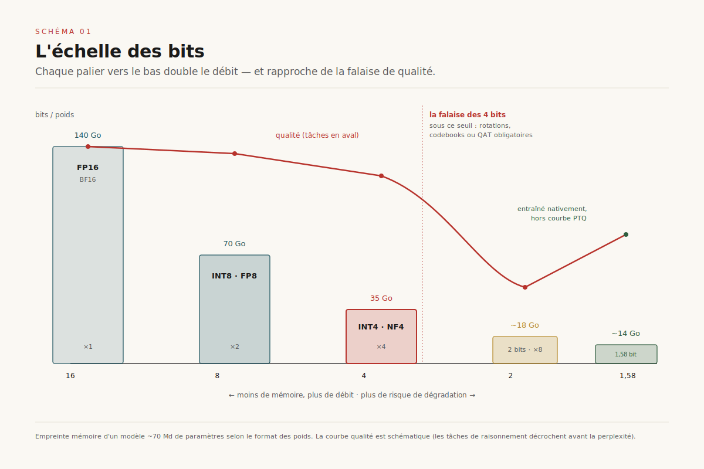
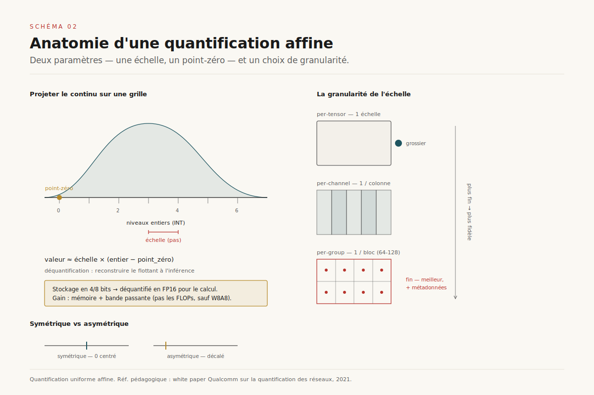
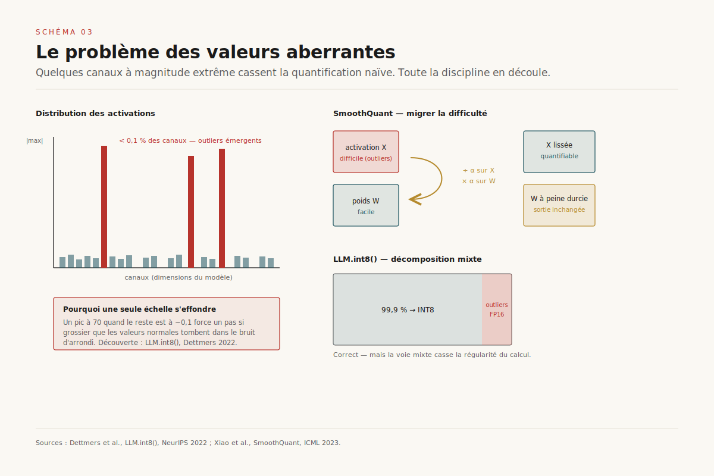
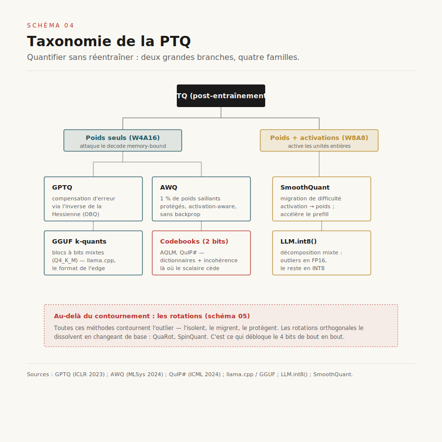
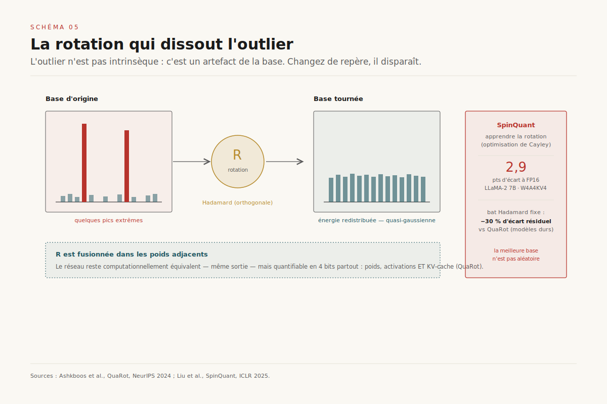

# La quantification des LLM : une bataille contre les valeurs aberrantes

> **Quantifier un modèle de langage n'est pas tronquer sa précision — c'est neutraliser une poignée de valeurs aberrantes qui concentrent l'essentiel de l'erreur ; sous 4 bits par poids, la qualité tombe d'une falaise que seules les méthodes de protection, de migration ou de rotation des outliers parviennent à repousser.** — 8 juillet 2026, Mathieu Guglielmino

*Deep dive du dossier [IA embarquée](../ia-embarquee/). Là où ce dossier traitait la quantification comme un levier parmi d'autres du budget mémoire de l'appareil, celui-ci lit la mécanique serrée : les algorithmes eux-mêmes, la façon dont on les évalue sans se mentir, et les formats matériels qui arrivent.*

---

## 1. Pourquoi quantifier : la mémoire prime sur le calcul

Un grand modèle de langage moderne passe l'essentiel de son temps d'inférence non pas à calculer, mais à **attendre la mémoire**. À chaque token généré, le décodage autorégressif doit relire l'intégralité des poids du modèle depuis la mémoire vive du GPU (HBM) vers les unités de calcul. Pour un modèle de 70 milliards de paramètres en 16 bits, cela représente 140 gigaoctets à faire transiter *par token*. ==La phase de génération est donc plafonnée par la bande passante mémoire, pas par la puissance de calcul== : le GPU tourne à vide en attendant les octets.[^1] C'est le même mur mémoire qui gouverne la gestion du KV-cache et l'IA embarquée.

D'où l'intérêt central de la quantification : réduire le nombre de bits par poids, c'est réduire directement le volume à transférer, donc accélérer le décodage — presque linéairement. Passer de 16 à 4 bits divise par quatre la mémoire des poids et, à peu près, quadruple le débit dans le régime *memory-bound*. La quantification n'est pas qu'une astuce de compression pour tenir sur une carte plus petite ; c'est le levier de latence le plus rentable de la pile d'inférence.

Mais « quantifier un LLM » recouvre trois cibles distinctes, avec trois budgets et trois difficultés :

- **Les poids** (*weights*), statiques, connus à l'avance : la cible la plus facile et la plus rentable. C'est là que se joue la quantification *weight-only* (W4A16 : poids sur 4 bits, activations sur 16).
- **Les activations** (*activations*), dynamiques, dépendantes de l'entrée : quantifier les deux (W8A8) permet d'utiliser des unités de calcul entières, plus rapides — mais les activations abritent les valeurs aberrantes les plus vicieuses.
- **Le KV-cache**, qui grossit avec le contexte et finit par dominer la mémoire à long contexte : une cible de plus en plus prioritaire.

Le schéma 1 pose l'échelle. Chaque palier vers le bas double le débit potentiel, mais chaque palier rapproche aussi d'une falaise de qualité. Toute la discipline consiste à descendre le plus bas possible **avant** de tomber.

## 2. Ce que « N bits » veut dire

La quantification uniforme affine, la plus répandue, projette un intervalle de valeurs flottantes sur une grille d'entiers régulièrement espacés. Deux paramètres suffisent : une **échelle** (*scale*, le pas de la grille) et un **point-zéro** (*zero-point*, le décalage qui fait correspondre le zéro flottant à un entier). Déquantifier, c'est l'opération inverse : `valeur ≈ scale × (entier − zero_point)`.[^3]

Deux choix structurent tout le reste.

**Symétrique ou asymétrique.** Une grille symétrique centre zéro et se passe de point-zéro (plus rapide) ; une grille asymétrique épouse mieux une distribution décentrée (les activations post-ReLU, positives) au prix d'un décalage à gérer.

**La granularité.** On peut partager une seule échelle pour tout un tenseur (*per-tensor*, le plus grossier), une échelle par canal de sortie (*per-channel*), ou une échelle par petit groupe de valeurs (*per-group*, typiquement 64 ou 128 poids). ==Plus la granularité est fine, mieux on absorbe les disparités de magnitude locales — au prix de quelques bits de métadonnées d'échelle par groupe.== Le compromis granularité/surcoût est le premier réglage de tout quantificateur sérieux.

Au-delà de l'entier uniforme, plusieurs formats coexistent : **FP8** (E4M3 ou E5M2), un flottant à 8 bits que le matériel récent (Hopper, Blackwell) exécute nativement ; **NF4** (*NormalFloat 4*), une grille non uniforme dont les niveaux sont placés aux quantiles d'une gaussienne — optimale pour des poids qui suivent justement une loi normale ;[^7] et le **ternaire** {−1, 0, +1}, cas limite à ~1,58 bit. Point crucial : dans la plupart des schémas *weight-only*, le calcul se fait toujours en FP16 après déquantification à la volée. On ne gagne alors que la mémoire et la bande passante — pas les FLOPs. Il faut quantifier *aussi* les activations (W8A8, W4A4) pour activer les unités de calcul basse précision.

## 3. La découverte fondatrice : les valeurs aberrantes

Tout aurait pu s'arrêter à la section précédente si les distributions étaient sages. Elles ne le sont pas. En 2022, Dettmers et ses coauteurs font une observation qui structure tout le domaine depuis : ==au-delà d'une certaine taille (~6,7 milliards de paramètres), des « traits émergents » apparaissent — quelques dimensions d'activation, moins de 0,1 % du total, dont la magnitude explose et domine le comportement du modèle.==[^2] Ces *emergent outlier features* sont concentrées dans un petit nombre de canaux, systématiques, et catastrophiques pour la quantification naïve : une seule valeur à 70 quand les autres sont à 0,1 force une échelle si grossière que tout le reste s'effondre dans le bruit d'arrondi.

La réponse de LLM.int8() est une **décomposition à précision mixte** : isoler les quelques canaux aberrants, les calculer en 16 bits, et quantifier tout le reste en 8 bits. Correct, mais lent — la voie mixte casse la régularité du calcul matriciel.

SmoothQuant (2023) propose une idée plus élégante : puisque ==les poids se quantifient bien mais les activations résistent à cause des outliers, migrons la difficulté des activations vers les poids==.[^4] Une transformation mathématiquement équivalente — diviser un canal d'activation par un facteur α et multiplier le poids correspondant par le même α — déplace la « bosse » d'outlier de l'activation (difficile) vers le poids (facile), sans changer la sortie. On lisse les activations en durcissant à peine les poids. Ce principe de *migration de difficulté* devient la matrice conceptuelle de presque tout ce qui suit.

## 4. La quantification post-entraînement (PTQ) : la famille dominante

En pratique, l'immense majorité des modèles quantifiés déployés le sont **sans réentraînement**, par PTQ : on part d'un modèle en 16 bits, on lui montre quelques centaines d'exemples de calibration, et on résout un problème d'optimisation local pour choisir les meilleures grilles. Trois familles dominent.

**GPTQ** (2023) reformule la quantification comme une reconstruction couche par couche, poids par poids, en utilisant l'information de courbure : à chaque poids quantifié, l'erreur introduite est **compensée** sur les poids restants via l'inverse de la matrice Hessienne de la couche.[^5] C'est l'algorithme OBQ (*Optimal Brain Quantization*) passé à l'échelle du milliard de paramètres par des approximations astucieuses. GPTQ quantifie un modèle de 175 milliards de paramètres en quelques heures GPU et reste une référence en 3-4 bits *weight-only*.

**AWQ** (MLSys 2024, *best paper*) part de l'observation d'AWQ : ==protéger seulement 1 % des poids — les « saillants », repérés par la magnitude des *activations* qui les traversent, pas par celle des poids eux-mêmes — suffit à réduire drastiquement l'erreur de quantification.==[^6] Plutôt que de garder ces 1 % en pleine précision (ce qui casserait le calcul), AWQ applique une mise à l'échelle par canal, *activation-aware*, qui protège les canaux saillants. Crucialement, AWQ ne fait ni rétropropagation ni reconstruction sur le jeu de calibration : il préserve donc la généralisation du modèle à d'autres domaines et modalités, là où les méthodes qui sur-optimisent la calibration se fragilisent.

**Les k-quants GGUF** de llama.cpp sont le format de facto de l'edge et du grand public. Ils quantifient par blocs à bits mixtes — un schéma comme `Q4_K_M` mélange 4 et 6 bits selon l'importance des sous-blocs, avec des échelles hiérarchiques. Moins « académique » que GPTQ ou AWQ, mais robuste, largement outillé, et taillé pour tourner sur CPU.

Enfin, pour viser le **2 bits**, les approches à *codebooks* prennent le relais : AQLM (quantification additive) et QuIP# combinent traitement d'incohérence et dictionnaires de vecteurs appris pour représenter des groupes de poids par des index vers un codebook, franchissant un seuil que la quantification scalaire uniforme ne tient pas.[^10]

## 5. Les rotations : dissoudre l'outlier plutôt que le contourner

Toutes les méthodes précédentes *contournent* les valeurs aberrantes — les isolent, les migrent, les protègent. En 2024, une idée plus radicale s'impose : **et si l'outlier n'était pas une propriété intrinsèque du modèle, mais un artefact de la base dans laquelle on regarde les activations ?**

QuaRot (NeurIPS 2024) applique aux états cachés une **rotation orthogonale** — une matrice de Hadamard aléatoire — avant de quantifier.[^8] Une rotation ne change rien au calcul (elle est absorbée, ou « fusionnée », dans les matrices de poids adjacentes, laissant le réseau *computationnellement équivalent*), mais elle **redistribue** l'énergie des quelques canaux aberrants sur toutes les dimensions. La distribution, après rotation, n'a plus d'outliers : elle est quasi-gaussienne et se quantifie superbement. QuaRot obtient ainsi une inférence 4 bits de bout en bout — poids, activations **et** KV-cache tous en 4 bits — chose que les méthodes de contournement peinaient à atteindre.

SpinQuant (ICLR 2025) pousse l'idée d'un cran : plutôt qu'une rotation de Hadamard *fixe et aléatoire*, ==pourquoi ne pas *apprendre* la meilleure rotation ?== Par une optimisation de Cayley sur la variété des matrices orthogonales, SpinQuant trouve des rotations qui battent Hadamard de plusieurs points, et réduit l'écart à la pleine précision à **2,9 points** sur LLaMA-2 7B en configuration W4A4KV4 — divisant par près d'un tiers l'écart résiduel de QuaRot sur les modèles réputés difficiles.[^9] L'insight est profond et généralisable : *l'outlier est une question de repère ; changez de repère, il disparaît*.

## 6. La quantification consciente de l'entraînement (QAT)

Quand on a le budget de calcul pour réentraîner — ou au moins affiner — le modèle, on peut faire mieux que toute PTQ. La **QAT** (*Quantization-Aware Training*) simule la quantification pendant l'entraînement : les poids sont arrondis à la volée dans la passe avant, et le gradient traverse cet arrondi non différentiable grâce à l'astuce du *Straight-Through Estimator* (on fait comme si l'arrondi avait une dérivée de 1). Le modèle **apprend à être robuste** à sa propre quantification. LLM-QAT et EfficientQAT industrialisent l'approche ; c'est par QAT qu'Apple a poussé ses *Foundation Models* embarqués jusqu'à ~2 bits par poids tout en préservant la qualité.

Le cas limite de la QAT renverse même la logique : au lieu de quantifier après coup, **entraîner directement en basse précision**. BitNet b1.58 (2024) entraîne un modèle dont chaque poids vaut {−1, 0, +1} — soit ~1,58 bit — dès la première itération.[^11] ==Un modèle ternaire remplace les multiplications matricielles par des additions et des soustractions== : plus de multiplieurs, une consommation énergétique effondrée, un profil idéal pour le CPU et le silicium embarqué. La contrepartie : il faut entraîner ce modèle *ab initio* dans ce régime, on ne peut pas ternariser un modèle FP16 existant sans dégât. La QAT, dans tous les cas, échange du calcul d'entraînement contre de la qualité récupérée à basse précision.

[SCHEMA-06]

## 7. Méta-évaluation : mesurer sans se mentir

Une méthode de quantification qui affiche « perplexité quasi-inchangée » ne dit presque rien. ==La perplexité est un thermomètre grossier : elle peut rester à 0,1 % de l'original pendant que la capacité de raisonnement, de code ou de calcul s'effondre.== Une quantification agressive dégrade d'abord les tâches les plus exigeantes — raisonnement multi-étapes, génération de code, mathématiques — bien avant de bouger l'aiguille de la perplexité sur du texte générique. Évaluer sérieusement une quantification impose donc une batterie de tâches en aval (raisonnement, code, suivi d'instructions), pas une seule métrique agrégée.

Trois pièges reviennent :

1. **La falaise sous 4 bits.** La dégradation n'est pas linéaire. De 16 à 8 à 4 bits, la perte reste modeste ; sous 4 bits, elle plonge — sauf à déployer les artilleries lourdes (rotations, codebooks, QAT). Les *k-bit inference scaling laws* de Dettmers & Zettlemoyer situent d'ailleurs le **4 bits comme l'optimum qualité/octet** pour la plupart des modèles : à budget mémoire fixé, un modèle plus gros quantifié en 4 bits bat un modèle plus petit en 8 ou 16 bits.[^12]
2. **La sensibilité par tâche.** Un même modèle quantifié peut être excellent en conversation et cassé en code. La cible d'usage doit dicter le point de calibration.
3. **La sur-adaptation au jeu de calibration.** Une méthode qui optimise fort sur quelques centaines d'exemples peut surapprendre leur distribution et se dégrader hors-domaine — l'argument même d'AWQ contre les méthodes à reconstruction lourde.

Le choix du schéma dépend enfin du goulot visé : **W8A8** (SmoothQuant) accélère le calcul *compute-bound* du *prefill* ; **W4A16** (AWQ, GPTQ) attaque le *decode* memory-bound et la mémoire des poids ; **la quantification du KV-cache** (2-4 bits) libère la mémoire à long contexte. Trois goulots, trois réponses — souvent combinées.

[SCHEMA-07]

## 8. Trajectoires 2026-2028

**La QAT par défaut.** À mesure que le coût marginal d'un tour de QAT baisse relativement au budget total d'entraînement, quantifier après coup devient le plan B. Les laboratoires qui contrôlent leur *pipeline* d'entraînement livreront des modèles nativement robustes à 4 bits, voire moins.

**Les formats matériels natifs.** Le tournant décisif de 2025 est l'arrivée du **FP4 exécuté nativement**. Deux formats à microscaling s'imposent : **MXFP4** (standard ouvert OCP, blocs de 32 valeurs partageant un exposant E8M0) et **NVFP4** (implémentation NVIDIA sur les tensor cores Blackwell : blocs de 16 valeurs, double échelle — une par bloc en FP8 E4M3 plus une par tenseur en FP32).[^11] NVFP4 annonce une empreinte mémoire réduite d'un facteur 3,5 contre FP16 et 1,8 contre FP8, pour moins de 1 % de perte de qualité sur certains modèles.[^12] Le point structurant : le FP4 cesse d'être une compression logicielle pour devenir un **type de donnée matériel de première classe** — le calcul lui-même se fait en 4 bits, pas seulement le stockage.

**La co-conception format × matériel × méthode.** Les meilleures méthodes de calibration (rotations, GPTQ) se marient désormais aux formats matériels : quantifier *pour* NVFP4 ou MXFP4 en tenant compte de leur granularité de bloc. La frontière algorithme/silicium se dissout.

**La frontière 1-bit et le KV-cache.** BitNet a ouvert la porte du ternaire natif ; la question ouverte est de savoir jusqu'où la qualité tient à l'échelle des grands modèles. Et à mesure que les contextes s'allongent, ==la quantification du KV-cache — pas celle des poids — devient le poste dominant==, rejoignant les préoccupations du dossier sur le cache clé-valeur.

La quantification aura ainsi accompli un glissement complet : d'astuce de compression réservée au déploiement contraint, elle devient une **propriété de conception** des modèles, pensée dès l'entraînement et gravée dans le silicium. La bataille contre les valeurs aberrantes, elle, reste le fil rouge — seulement, on la livre désormais de plus en plus tôt.

---

## Sources

[^1]: Kwon, Woosuk et al. *Efficient Memory Management for Large Language Model Serving with PagedAttention* (vLLM). SOSP 2023. Sur le régime memory-bound du décodage autorégressif. [arxiv.org/abs/2309.06180](https://arxiv.org/abs/2309.06180)

[^2]: Dettmers, Tim et al. *LLM.int8(): 8-bit Matrix Multiplication for Transformers at Scale*. NeurIPS 2022. Découverte des *emergent outlier features* au-delà de ~6,7B paramètres, décomposition à précision mixte. [arxiv.org/abs/2208.07339](https://arxiv.org/abs/2208.07339)

[^3]: Nagel, Markus et al. *A White Paper on Neural Network Quantization*. Qualcomm AI Research, 2021. Référence pédagogique sur la quantification affine, scale/zero-point, granularité. [arxiv.org/abs/2106.08295](https://arxiv.org/abs/2106.08295)

[^4]: Xiao, Guangxuan et al. *SmoothQuant: Accurate and Efficient Post-Training Quantization for Large Language Models*. ICML 2023. Migration de difficulté activation→poids par mise à l'échelle par canal. [arxiv.org/abs/2211.10438](https://arxiv.org/abs/2211.10438)

[^5]: Frantar, Elias et al. *GPTQ: Accurate Post-Training Quantization for Generative Pre-trained Transformers*. ICLR 2023. Compensation d'erreur via l'inverse de la Hessienne (OBQ à l'échelle). [arxiv.org/abs/2210.17323](https://arxiv.org/abs/2210.17323)

[^6]: Lin, Ji et al. *AWQ: Activation-aware Weight Quantization for LLM Compression and Acceleration*. MLSys 2024, Best Paper. 1 % de poids saillants, mise à l'échelle activation-aware sans backprop. [arxiv.org/abs/2306.00978](https://arxiv.org/abs/2306.00978)

[^7]: Dettmers, Tim et al. *QLoRA: Efficient Finetuning of Quantized LLMs*. NeurIPS 2023. Format NF4 (NormalFloat), grille non uniforme aux quantiles d'une gaussienne. [arxiv.org/abs/2305.14314](https://arxiv.org/abs/2305.14314)

[^8]: Ashkboos, Saleh et al. *QuaRot: Outlier-Free 4-Bit Inference in Rotated LLMs*. NeurIPS 2024. Rotations de Hadamard fusionnées dans les poids, inférence 4 bits de bout en bout. [arxiv.org/abs/2404.00456](https://arxiv.org/abs/2404.00456)

[^9]: Liu, Zechun et al. *SpinQuant: LLM Quantization with Learned Rotations*. ICLR 2025. Rotations apprises par optimisation de Cayley ; écart à FP16 réduit à 2,9 pts (LLaMA-2 7B, W4A4KV4). [arxiv.org/abs/2405.16406](https://arxiv.org/abs/2405.16406)

[^10]: Tseng, Albert et al. *QuIP#: Even Better LLM Quantization with Hadamard Incoherence and Lattice Codebooks*. ICML 2024. Quantification 2 bits par traitement d'incohérence et codebooks en treillis. [arxiv.org/abs/2402.04396](https://arxiv.org/abs/2402.04396)

[^11]: Wang, Hongyu et al. *The Era of 1-bit LLMs: All Large Language Models are in 1.58 Bits* (BitNet b1.58). 2024. Modèle ternaire {−1,0,+1} entraîné nativement, multiplications remplacées par des additions. Voir aussi NVIDIA, *Introducing NVFP4 for Efficient and Accurate Low-Precision Inference*, 2025, [developer.nvidia.com](https://developer.nvidia.com/blog/introducing-nvfp4-for-efficient-and-accurate-low-precision-inference/). [arxiv.org/abs/2402.17764](https://arxiv.org/abs/2402.17764)

[^12]: Dettmers, Tim et Luke Zettlemoyer. *The case for 4-bit precision: k-bit Inference Scaling Laws*. ICML 2023. Le 4 bits comme optimum qualité/octet. Voir aussi OCP, *Microscaling (MX) Data Formats Specification* / Rouhani et al. 2023 pour MXFP4 (bloc 32, exposant partagé) et le blog NVFP4 (bloc 16, double échelle, ×3,5 vs FP16). [arxiv.org/abs/2212.09720](https://arxiv.org/abs/2212.09720)
