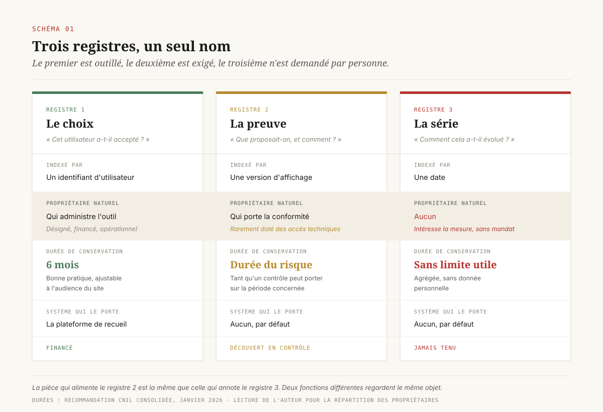
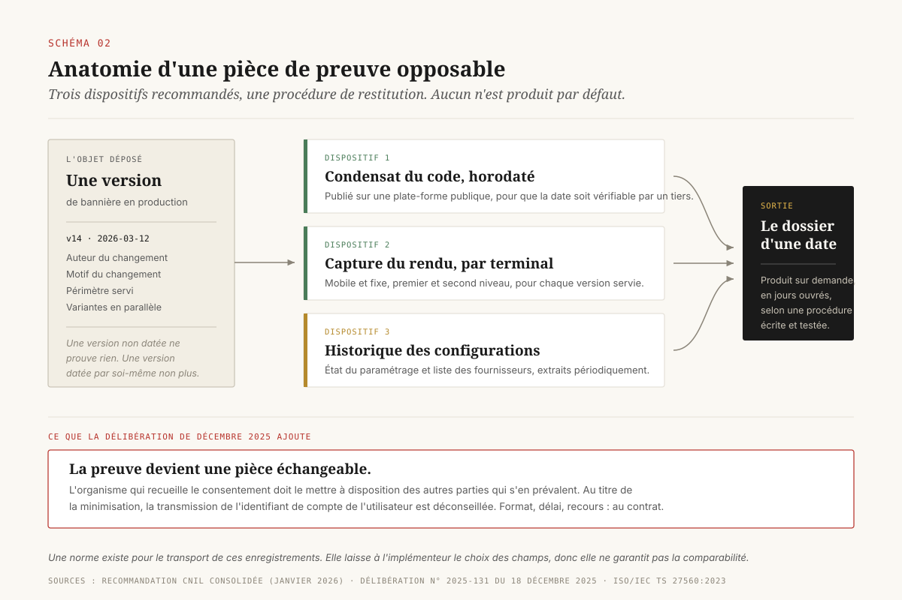
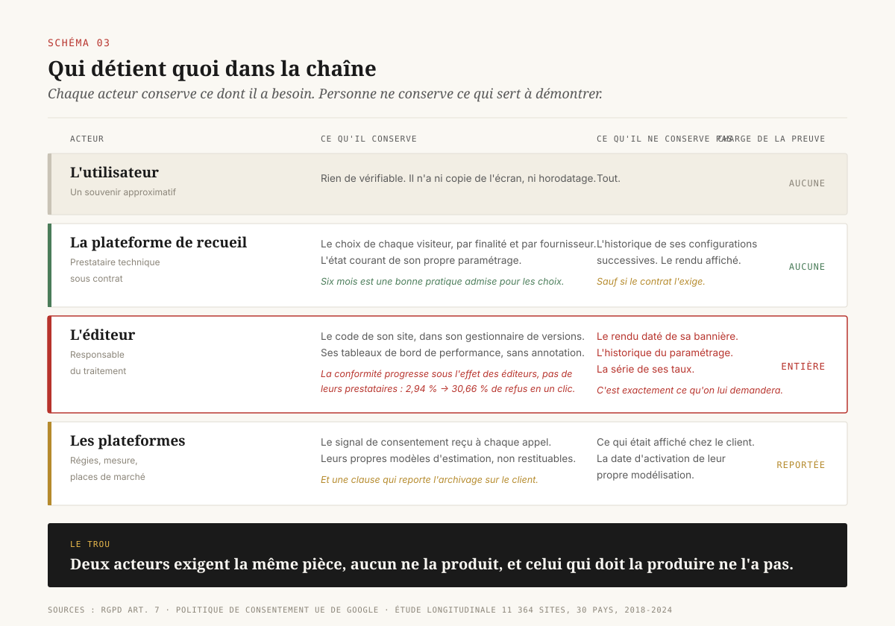
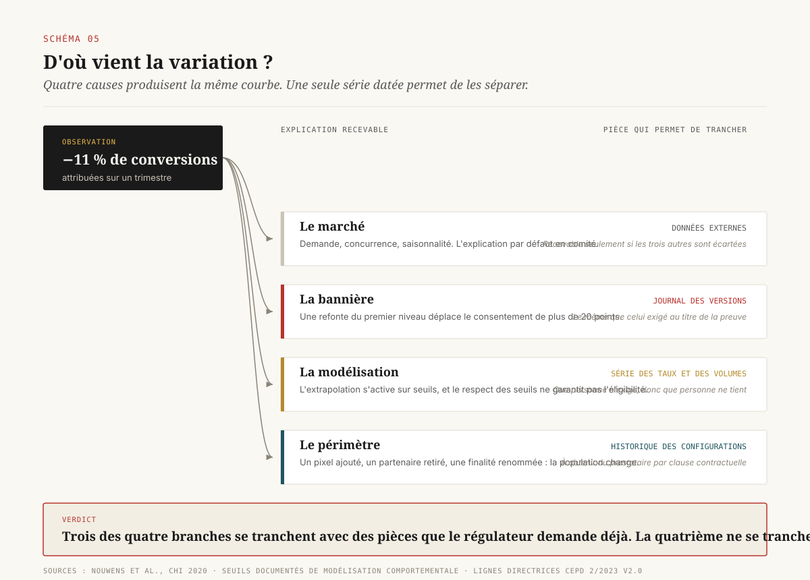

# Une bannière n'est pas une preuve

> **Le consentement produit trois registres que tout le monde appelle du même nom. Les organisations financent le premier, découvrent le deuxième en contrôle, et ne tiennent jamais le troisième, qui est pourtant le seul à rendre leurs propres chiffres relisables.** — 30 septembre 2026, Mathieu Guglielmino

Une direction data qui installe une plateforme de recueil du consentement croit avoir réglé deux problèmes d'un coup : la conformité et la mesure. La bannière s'affiche, les choix sont collectés, les balises se déclenchent ou pas selon le signal transmis. Le tableau de bord affiche un taux d'opt-in. Le dossier est classé.

Il reste deux questions auxquelles cette installation ne répond pas, et il faut souvent un contrôle ou un audit pour s'en apercevoir.

La première est juridique : « montrez-moi ce qui était affiché à l'écran le 12 mars, sur mobile, pour un visiteur venu d'Allemagne ». Presque aucune organisation ne peut produire cette pièce. Elle peut produire un choix stocké, ce qui est différent.

La seconde est analytique : « vos conversions ont baissé de onze pour cent au deuxième trimestre, est-ce le marché, la bannière, ou la modélisation ? ». Là encore, la plateforme de recueil ne répondra pas, parce qu'elle n'a jamais été conçue pour conserver une série historique de ses propres réglages.

Ces deux questions ont la même réponse manquante. ==Le consentement est un objet documentaire, et cet objet se décline en trois registres distincts, qui n'ont ni le même propriétaire, ni la même durée de conservation, ni le même système d'accueil.== Le premier, le **registre des choix**, est ce que la plateforme de recueil sait faire. Le deuxième, le **registre de preuve**, est une exigence réglementaire explicite que presque personne n'implémente. Le troisième, la **série des taux**, n'est demandé par aucun régulateur et n'est donc financé par personne, alors qu'il est la condition pour relire une courbe de conversion.

Ce dossier traite les trois comme des postes de gouvernance : qui les tient, combien de temps, à quel coût, et ce qu'on écrit au contrat pour les obtenir.

---

## 1. Ce qu'on croit avoir quand on a un outil de recueil

L'écosystème publicitaire européen transporte le consentement sous forme d'une chaîne de caractères encodée, générée par la plateforme de recueil et lue par les fournisseurs en aval. Elle dit quelles finalités l'utilisateur a acceptées, pour quels fournisseurs, avec quelle base légale invoquée. Elle circule à chaque appel publicitaire.

Cette chaîne a fait l'objet de la décision la plus structurante du domaine. En mars 2024, la Cour de justice de l'Union européenne a jugé qu'elle constitue une donnée à caractère personnel dès lors qu'elle peut être rattachée à un autre identifiant, une adresse IP par exemple, et que l'association professionnelle qui édite le cadre technique agit comme responsable conjoint du traitement avec ses participants[^5]. La cour des marchés de Bruxelles a confirmé l'analyse en mai 2025, en retenant la responsabilité conjointe pour les traitements propres de l'association et en relevant qu'aucune base légale valable n'avait été établie pour son propre traitement de cette chaîne[^6].

Ce qui se joue ici dépasse la question de la responsabilité. La décision requalifie l'objet. Une chaîne de consentement circulant dans la chaîne publicitaire est un **objet de traitement**, soumis aux mêmes obligations que les données qu'elle encadre. Elle n'est pas un certificat délivré par un tiers de confiance, et rien dans sa structure ne la rend opposable.

La distinction est facile à manquer, parce que les deux fonctions se ressemblent de loin. Un certificat atteste d'un fait passé dans une forme vérifiable par un tiers. La chaîne de consentement transporte un état courant dans une forme vérifiable par personne. Elle indique que la finalité 4 est acceptée pour tel fournisseur. Elle ne dit pas quel texte a été affiché, combien de boutons étaient visibles au premier niveau, si le refus demandait un clic ou trois, quelle version du gestionnaire tournait, ni quels fournisseurs figuraient dans la liste ce jour-là.

Or c'est exactement sur ces points que porte le contrôle. Les sanctions françaises de l'année 2025 en donnent la mesure : l'année a produit vingt et une sanctions relatives aux traceurs, pour un montant cumulé de 486 839 500 euros tous sujets confondus[^3], et les manquements retenus concernent le dépôt de traceurs avant toute expression de choix, des parcours où le chemin sans cookies est rendu moins attrayant que l'autre, et la lecture de traceurs qui se poursuit après un retrait[^4]. Aucun de ces trois manquements ne se constate ni ne se réfute en lisant une chaîne de consentement. Les trois se constatent en observant l'interface et la configuration.

Le champ concerné s'est par ailleurs élargi. Les lignes directrices du Comité européen de la protection des données sur le périmètre technique de l'article 5(3) de la directive vie privée, dans leur version définitive adoptée en octobre 2024, couvrent explicitement le suivi par pixel et par URL, certains traitements locaux dès lors qu'une information quitte le terminal, le suivi fondé sur la seule adresse IP, et la remontée d'objets connectés[^7]. La conséquence pratique est qu'une organisation qui a documenté ses cookies a documenté une fraction de son périmètre de consentement. Le reste vit dans des pixels de mesure, des liens de suivi et des remontées serveur qui ne sont presque jamais inventoriés dans le même outil.

---

## 2. Trois registres, un seul nom

Les trois objets que l'on confond sous l'expression « registre de consentement » répondent à trois questions différentes, ce qui explique qu'ils n'aient pas la même forme.

**Le registre des choix** répond à : *cet utilisateur a-t-il accepté ?* Il est granulaire, indexé par identifiant de navigateur ou de compte, et vit dans la plateforme de recueil. La Commission nationale de l'informatique et des libertés considère qu'une conservation de six mois des choix, refus compris, constitue une bonne pratique, tout en précisant que la durée s'apprécie au cas par cas selon la nature du site et les spécificités de son audience[^2]. Six mois, c'est une durée d'exploitation, calibrée sur la question opérationnelle : faut-il réafficher la bannière à ce visiteur ?

**Le registre de preuve** répond à : *que proposait-on, et comment, à cette date ?* Il n'est pas indexé par utilisateur mais par **version**. C'est un registre de configurations, pas un registre de personnes. Sa durée pertinente n'est pas celle de l'exploitation mais celle du risque : tant qu'un contrôle ou une action peut porter sur une période, la preuve relative à cette période doit exister. Les six mois de bonne pratique du registre des choix ne s'y appliquent pas, et confondre les deux durées est l'erreur d'archivage la plus courante du domaine.

**La série des taux** répond à : *comment le consentement a-t-il évolué, et pourquoi ?* Elle est agrégée, datée, sans donnée personnelle, et aucun texte ne l'exige. Elle n'a donc ni propriétaire désigné ni ligne budgétaire. Son absence ne fait jamais échouer un audit de conformité. Elle fait échouer, silencieusement, toute tentative d'expliquer une variation de performance.

La conséquence organisationnelle de ce découpage est qu'aucun des trois registres n'appartient naturellement à la même équipe. Le premier est technique et vit chez celui qui administre l'outil. Le deuxième est documentaire et relève du délégué à la protection des données, qui rarement dispose des accès permettant de le constituer. Le troisième est analytique et intéresse l'équipe mesure, qui n'a aucun mandat pour l'exiger. ==Un registre dont personne n'est propriétaire est un registre inexistant.==

---

## 3. Ce que le régulateur demande exactement

La recommandation française sur les cookies et autres traceurs, dans sa version consolidée publiée en janvier 2026, ne se contente pas de rappeler que le responsable doit pouvoir démontrer à tout moment que le consentement a été valablement recueilli. Elle liste des mécanismes concrets, et cette liste se lit comme une spécification d'archivage[^2].

Trois dispositifs y figurent. Un **condensat du code informatique** de la bannière peut être publié de façon horodatée sur une plate-forme publique, afin de pouvoir prouver a posteriori l'authenticité de la version invoquée. Une **capture du rendu visuel** affiché sur terminal mobile et sur terminal fixe peut être conservée, horodatée, pour chaque version. Les **informations relatives aux outils mis en œuvre et à leurs configurations successives** peuvent être conservées de façon horodatée.

Aucun de ces trois dispositifs n'est produit par défaut par une plateforme de recueil. Le premier suppose une empreinte cryptographique du code de la bannière, publiée hors du système de l'éditeur pour que sa date soit vérifiable par un tiers. Le deuxième suppose une chaîne de capture visuelle par type de terminal, déclenchée à chaque déploiement. Le troisième suppose un journal des changements de configuration, alors que la plupart des consoles d'administration affichent l'état courant et écrasent le précédent.

La formulation retenue est celle de la recommandation, donc du registre des bonnes pratiques et non de l'obligation directe. Elle a néanmoins la valeur d'un étalon : en contrôle, c'est à cette liste que la démonstration sera comparée. Une organisation qui produit les trois est dans une position confortable. Une organisation qui produit une capture d'écran prise le jour du contrôle démontre l'état présent et rien d'autre.

La délibération du 18 décembre 2025, qui encadre le consentement multi-terminaux et modifie la recommandation de 2020, ajoute une exigence de nature différente[^1]. Le texte porte sur les mécanismes permettant d'appliquer les choix d'un utilisateur à plusieurs appareils dans un environnement authentifié. Sa mise en œuvre reste facultative. Mais il pose que l'organisme qui recueille le consentement doit mettre la preuve de ce consentement à disposition des autres parties qui s'en prévalent, et recommande, au titre de la minimisation, de ne pas transmettre l'identifiant de compte de l'utilisateur.

Cette exigence fait passer la preuve du statut de pièce interne à celui de **pièce échangeable**. Dès lors qu'une régie, une place de marché ou un partenaire de mesure s'appuie sur un consentement recueilli par un tiers, il lui faut pouvoir en obtenir la preuve, dans un format qu'il puisse exploiter, sans que cette transmission emporte plus d'information que nécessaire. C'est un objet contractuel, avec un format, un délai et un recours.

Une norme technique existe pour cet objet. La spécification ISO/IEC TS 27560:2023 définit une structure d'enregistrement du consentement lisible par machine, et son échange entre entités sous forme de reçus[^12]. L'existence de ce cadre est une bonne nouvelle, et sa lecture attentive tempère l'enthousiasme : un reçu conforme n'exige qu'une section de métadonnées identifiant le reçu, et la spécification ne pose pas de contrainte sur la structuration de l'information à l'intérieur du reçu ni sur sa correspondance avec les champs de l'enregistrement d'origine. Le choix des informations transmises et de leur forme est laissé à l'entité qui implémente.

Autrement dit, deux enregistrements conformes à la même norme peuvent ne rien avoir en commun. La norme fournit une grammaire, l'organisation reste responsable du vocabulaire. Elle règle le problème du transport et laisse entier celui de la comparabilité, qui est le problème de l'auditeur.

---

## 4. La charge de la preuve ne se sous-traite pas

Le règlement général sur la protection des données place la charge de la démonstration sur le responsable du traitement, et impose que le retrait soit aussi simple que le recueil. Cette répartition n'a rien d'original en droit. Sa traduction opérationnelle est nettement moins bien admise, parce qu'elle contredit la façon dont le marché s'est organisé.

Le marché s'est organisé autour de l'idée qu'une plateforme de recueil certifiée réglait la question. Deux travaux récents suggèrent que la délégation ne fonctionne pas.

Le premier est une étude longitudinale portant sur 11 364 sites répartis dans trente pays, sur la période 2018-2024[^8]. Elle mesure la proportion de bannières offrant un refus en un clic : 2,94 % en 2018, 30,66 % en 2024. La progression est réelle, et laisse encore une large majorité de sites sans refus direct six ans après l'entrée en application du règlement. L'étude établit surtout deux corrélations utiles à une direction data. La conformité progresse là où l'autorité nationale agit et publie des orientations. Et l'amélioration est portée par les éditeurs eux-mêmes, les plateformes de recueil montrant peu de réaction à l'action réglementaire et peu d'influence sur les taux de conformité observés.

La conclusion se formule simplement : ==la plateforme de recueil est un prestataire technique, et le marché a documenté qu'elle ne joue pas le rôle de fonction conformité qu'on lui prête.==

Le second point vient du contrat, et non du régulateur. La politique européenne de consentement de l'utilisateur imposée par Google à ses annonceurs et éditeurs exige que le client conserve la trace du consentement obtenu, cette trace devant au minimum comporter le texte et les choix présentés à l'utilisateur dans le mécanisme de recueil, ainsi que la date et l'heure du consentement affirmatif[^11]. Depuis juillet 2025, la collecte est restreinte pour les sites qui ne transmettent pas les signaux de consentement attendus.

Il faut s'arrêter sur la convergence. Le régulateur français recommande de conserver, horodatés, le rendu visuel par version et l'historique des configurations. Le principal acheteur d'inventaire publicitaire exige par contrat la conservation du texte et des choix présentés, avec date et heure. Les deux demandent le même artefact, pour des raisons opposées, et avec des recours différents. Un manquement au premier expose à une sanction administrative. Un manquement au second expose à une restriction de collecte, dont l'effet sur la mesure est immédiat.

Cette double exigence est l'argument budgétaire qui manquait. Le registre de preuve cesse d'être une dépense de conformité pure dès lors que son absence peut dégrader l'accès aux données de campagne.

---

## 5. Le coût réel du dispositif

Un registre de preuve opposable se décompose en six postes. Les cinq premiers sont des coûts récurrents modestes, dont le total reste inférieur à ce qu'une organisation dépense en un trimestre d'outillage analytique. Le sixième est celui qui ruine les plans.

**Versionner la bannière.** Traiter la configuration de recueil comme du code : chaque modification produit une version identifiée, datée, avec son auteur et son motif. Coût de mise en place faible pour une équipe qui pratique déjà la gestion de versions, nul en récurrent.

**Capturer le rendu.** Produire, à chaque déploiement, la capture du premier niveau et du second niveau, sur terminal fixe et sur terminal mobile, pour chaque langue et chaque variante géographique servie. C'est le poste que les organisations sous-estiment le plus, parce que le nombre de combinaisons croît vite : trois langues, deux terminaux, deux niveaux d'affichage, et une refonte trimestrielle produisent quarante-huit pièces par an.

**Journaliser les configurations.** Extraire périodiquement l'état complet du paramétrage de l'outil, y compris la liste des fournisseurs déclarés, et conserver la série de ces extractions. La faisabilité dépend entièrement du prestataire, ce qui en fait un point de négociation contractuelle plutôt qu'un problème technique.

**Conserver et purger.** Écrire deux durées séparées, celle des choix et celle de la preuve, et implémenter la purge. Un registre qui conserve tout sans règle devient à son tour un manquement.

**Restituer.** Documenter la procédure qui permet, à partir d'une date, de produire le dossier complet de ce qui était affiché et configuré. Cette procédure doit être testée, parce qu'une procédure de restitution non testée est une hypothèse.

**Reconstituer.** Le sixième poste est celui de l'organisation qui n'a rien tenu et qui doit remonter dans le temps. Son coût n'est pas une estimation : il a été mesuré. Les auteurs de l'étude longitudinale citée plus haut ont dû reconstruire l'historique des bannières en combinant une archive publique du web et un jeu de données de collecte à grande échelle, en développant une méthode de rejeu des bannières sur des pages archivées[^8]. Une équipe de recherche a donc conçu un dispositif d'archéologie du web pour obtenir une information que chaque éditeur concerné détenait par construction et n'avait pas conservée.

C'est l'étalon du coût de l'absence. Une reconstitution rétrospective mobilise des compétences rares, produit un résultat partiel, et ne fournit aucun horodatage opposable, puisque la date d'archivage d'un tiers ne vaut pas preuve de la date de mise en production.

---

## 6. Le registre manquant : la série

Les deux premiers registres relèvent de la conformité. Le troisième relève de la mesure, et son absence produit un effet plus insidieux, parce qu'elle ne déclenche aucune alerte.

Voici la situation. Les conversions attribuées reculent de onze pour cent sur un trimestre. Quatre explications sont recevables.

La première est le **marché** : la demande a baissé, un concurrent a poussé, la saisonnalité joue. C'est l'explication par défaut, celle qui remonte en comité.

La deuxième est la **bannière**. Une refonte a modifié le parcours de choix, et le taux de consentement a bougé. L'ampleur possible n'est pas marginale. Les travaux de Nouwens et de ses coauteurs, présentés à la conférence CHI en 2020, montrent que la position et la disponibilité du refus au premier niveau déplacent le consentement de plus de vingt points de pourcentage[^9]. Le niveau de départ compte aussi : les mesures sectorielles situent le taux d'acceptation français autour de 55 à 60 %, dans la fourchette basse européenne, et indiquent qu'une très faible proportion des visiteurs atteint le second niveau de la bannière pour arbitrer finalité par finalité[^10]. Un changement de design est donc une intervention sur l'instrument de mesure, de la même nature qu'un changement de balise.

La troisième est la **modélisation**. Les plateformes d'analyse comblent les données manquantes par extrapolation depuis les visiteurs consentants. Cette extrapolation ne s'active que sous conditions : la propriété doit collecter au moins mille événements par jour avec un stockage analytique refusé pendant au moins sept jours, et compter au moins mille utilisateurs quotidiens consentants sur sept des vingt-huit derniers jours. La documentation ajoute que le respect de ces seuils ne garantit pas l'éligibilité[^13]. Une propriété peut donc entrer et sortir du régime modélisé sans notification, et une part variable du chiffre affiché en sortie change de nature sans que rien ne le signale.

La quatrième est le **périmètre**. Un pixel ajouté, un partenaire retiré, une finalité renommée dans la configuration, et la population mesurée n'est plus la même.

==Ces quatre explications sont indiscernables sans une série datée qui relie, mois par mois, les taux de consentement observés, les versions de bannière déployées et le régime de modélisation en vigueur.== Aucune d'entre elles ne se réfute par les données de conversion elles-mêmes, parce que toutes les quatre produisent la même forme de courbe.

La série qui permettrait de trancher est peu coûteuse. Trois colonnes suffisent : la date, le taux de consentement mesuré par finalité, l'identifiant de version de la bannière en production. Une quatrième colonne indiquant si la période était modélisée rend le tableau utilisable en comité.

Sa valeur dépasse le diagnostic rétrospectif. Une série de taux de consentement est aussi la seule base honnête pour estimer ce qu'on ne mesure pas. Un annonceur dont le taux d'acceptation est de 57 % sait que sa vision directe porte sur un peu plus de la moitié de son audience, et il connaît la date à laquelle cette proportion a changé. Sans la série, il dispose d'un chiffre courant et d'aucune histoire.

Le lien entre les trois registres se referme ici. La pièce que le régulateur demande, la capture horodatée par version, est la même que celle dont l'analyste a besoin pour annoter sa série. Le registre de preuve et le registre de mesure sont le même objet, regardés depuis deux fonctions qui ne se parlent pas. C'est la raison la plus solide de ne pas traiter le premier comme une dépense de conformité isolée.

---

## 7. Quatre décisions

**D1 · Nommer un propriétaire unique du registre de preuve.** Ni la plateforme de recueil, ni l'agence, ni le délégué à la protection des données seul. La fonction qui déploie la bannière tient le registre, et la fonction qui porte la conformité en définit le contenu. À défaut de nom écrit, le registre n'existera pas, quel que soit le budget alloué. *Pièce produite : une ligne dans une fiche de poste ou une lettre de mission, avec l'accès technique correspondant.*

**D2 · Écrire deux durées de conservation, séparément.** Celle des choix, alignée sur la bonne pratique de six mois et ajustée à l'audience. Celle de la preuve, alignée sur la période pendant laquelle un contrôle ou une action peut porter sur les traitements concernés. Documenter les deux dans le registre des traitements, avec leur justification et la règle de purge. *Pièce produite : deux durées distinctes, deux justifications, une procédure de purge testée.*

**D3 · Exiger au contrat l'export des configurations et le rejeu d'une version.** Trois clauses. L'export périodique et horodaté du paramétrage complet, liste des fournisseurs incluse, dans un format exploitable hors de l'outil. La conservation de l'historique des configurations pendant une durée au moins égale à celle du registre de preuve. La capacité de restituer, pour une date passée, la version de bannière alors servie. Ces clauses se négocient au renouvellement, et leur absence est un critère de sélection. *Pièce produite : trois clauses dans le contrat, et un test de restitution à la recette.*

**D4 · Annoter les séries de conversion par les versions de bannière.** Tout tableau de bord de conversion porte, sur le même axe temporel, les changements de version de la bannière, les taux de consentement par finalité, et l'indication du régime de modélisation. La règle de comité qui en découle : aucune variation de performance n'est commentée sans que ces trois informations soient affichées. *Pièce produite : une table de quatre colonnes, tenue par l'équipe mesure, versionnée et jointe au rapport de performance.*

---

## Ce que ces décisions ne règlent pas

Trois limites méritent d'être posées.

La première concerne la valeur probante réelle des dispositifs recommandés. Publier un condensat horodaté sur une plate-forme publique établit qu'un code existait à une date. Cela n'établit pas qu'il était en production sur l'ensemble du trafic, ni qu'aucune variante n'était servie en parallèle. Une organisation qui pratique l'expérimentation sur ses bannières doit journaliser ses variantes, faute de quoi son registre atteste d'une version qu'une partie de ses visiteurs n'a jamais vue.

La deuxième concerne le périmètre. Les lignes directrices européennes étendent le champ du consentement bien au-delà du cookie, et la majorité des inventaires de traceurs n'a pas été refaite depuis cette extension. Un registre de preuve rigoureux sur un périmètre incomplet reste incomplet.

La troisième est d'ordre budgétaire. La série des taux n'est exigée par personne. Une ligne qu'aucune obligation ne protège disparaît au premier arbitrage de fin d'exercice. Le seul moyen de la conserver est de la rendre structurellement inséparable de la pièce que le régulateur demande, ce qui est l'objet de la décision D4.

---

## Sources

[^1]: CNIL, **délibération n° 2025-131 du 18 décembre 2025** proposant des modalités pratiques de mise en conformité du consentement multi-terminaux et portant modification de la recommandation n° 2020-092. Publiée au Journal officiel du 18 janvier 2026. <https://www.legifrance.gouv.fr/cnil/id/CNILTEXT000053383564> (consulté le 30 septembre 2026).

[^2]: CNIL, **recommandation « cookies et autres traceurs » — version consolidée**, janvier 2026. Contient les mécanismes de preuve du consentement (condensat horodaté publié, capture du rendu visuel par version, historique horodaté des configurations des outils) et la bonne pratique de six mois pour la conservation des choix. <https://www.cnil.fr/sites/default/files/2026-01/recommandation_cookies_consolidee.pdf> (consulté le 30 septembre 2026).

[^3]: CNIL, **bilan des sanctions et mesures correctrices 2025**. Montant cumulé des sanctions et répartition par sujet, les traceurs figurant parmi les premiers motifs. <https://www.cnil.fr/fr/bilan-sanctions-2025> (consulté le 30 septembre 2026).

[^4]: Panorama des délibérations de la CNIL en 2025, cabinet Hoche Avocats. Recense les manquements retenus en matière de traceurs : dépôt avant expression du choix, parcours de refus dégradé, lecture de traceurs après retrait du consentement. <https://www.hlc.com/fr/publications/panorama-des-deliberations-de-la-cnil-en-2025-quand-les-sanctions-precedent-les-recommandations> (consulté le 30 septembre 2026).

[^5]: Cour de justice de l'Union européenne, **arrêt du 7 mars 2024, IAB Europe, C-604/22**. La chaîne de consentement du cadre de transparence constitue une donnée à caractère personnel lorsqu'elle est rattachable à un autre identifiant ; l'éditeur du cadre est responsable conjoint du traitement avec ses participants. <https://curia.europa.eu/juris/liste.jsf?num=C-604/22> (consulté le 30 septembre 2026).

[^6]: Cour des marchés de Bruxelles, **arrêt du 14 mai 2025**, suites de l'affaire IAB Europe. Confirme la qualification de donnée personnelle et la responsabilité conjointe pour les traitements propres de l'association, et relève l'absence de base légale établie au titre de l'article 6(1) pour son traitement de la chaîne. Analyse : DLA Piper, *Privacy Matters*. <https://privacymatters.dlapiper.com/2025/06/eu-brussels-court-of-appeal-rules-on-iab-europe-and-the-tc-string-implications-for-gdpr-compliance/> (consulté le 30 septembre 2026).

[^7]: Comité européen de la protection des données, **lignes directrices 2/2023 sur le champ d'application technique de l'article 5(3) de la directive 2002/58/CE**, version 2.0 adoptée le 7 octobre 2024. Étend explicitement l'analyse au suivi par URL et par pixel, au traitement local avec sortie d'information du terminal, au suivi fondé sur la seule adresse IP et aux remontées d'objets connectés. <https://www.edpb.europa.eu/system/files/2024-10/edpb_guidelines_202302_technical_scope_art_53_eprivacydirective_v2_en_0.pdf> (consulté le 30 septembre 2026).

[^8]: **A history of GDPR cookie banner compliance: the roles of publishers, regulators and CMPs**, 2026. Étude longitudinale sur 11 364 sites dans trente pays, 2018-2024 : proportion de bannières offrant un refus en un clic passant de 2,94 % à 30,66 %, corrélation entre conformité et action des autorités nationales, conformité portée par les éditeurs et non par les plateformes de recueil, méthode de rejeu des bannières sur pages archivées. <https://arxiv.org/abs/2606.31485> (consulté le 30 septembre 2026).

[^9]: Midas Nouwens, Ilaria Liccardi, Michael Veale, David Karger, Lalana Kagal, **Dark Patterns after the GDPR: Scraping Consent Pop-ups and Demonstrating their Influence**, *Proceedings of the 2020 CHI Conference on Human Factors in Computing Systems*. Établit expérimentalement l'effet du design du premier niveau sur le taux de consentement. <https://dl.acm.org/doi/10.1145/3313831.3376321> (consulté le 30 septembre 2026).

[^10]: Baromètre sectoriel des taux de consentement, synthèse 2025-2026 sur données de plateformes de recueil (ordre de grandeur de 21,7 milliards de choix utilisateurs). Situe l'opt-in français autour de 55-60 %, dans la fourchette basse européenne, et la proportion de visiteurs atteignant le second niveau de la bannière à quelques pour cent. Source vendeur, à lire comme un ordre de grandeur de marché. <https://www.donneespersonnelles.fr/taux-consentement-cookies> (consulté le 30 septembre 2026).

[^11]: Google, **politique de consentement de l'utilisateur dans l'Union européenne**. Impose contractuellement de conserver la trace du consentement obtenu, comprenant au minimum le texte et les choix présentés à l'utilisateur et la date et l'heure du consentement affirmatif. Restriction de la collecte depuis juillet 2025 pour les sites ne transmettant pas les signaux attendus. <https://www.google.com/about/company/user-consent-policy/> (consulté le 30 septembre 2026).

[^12]: **ISO/IEC TS 27560:2023 — Privacy technologies: consent record information structure**. Définit la structure d'un enregistrement de consentement lisible par machine et son échange sous forme de reçus ; laisse à l'entité qui implémente le choix des informations transmises et de leur structuration interne. <https://www.iso.org/standard/80392.html> (consulté le 30 septembre 2026).

[^13]: Google Analytics, **modélisation comportementale pour le mode consentement**. Seuils d'activation documentés (au moins mille événements quotidiens avec stockage analytique refusé pendant sept jours ; au moins mille utilisateurs quotidiens consentants sur sept des vingt-huit derniers jours) et mention explicite que le respect de ces seuils ne garantit pas l'éligibilité. <https://support.google.com/analytics/answer/11161109> (consulté le 30 septembre 2026).

---

*Format co-écrit avec l'aide d'une IA.*
