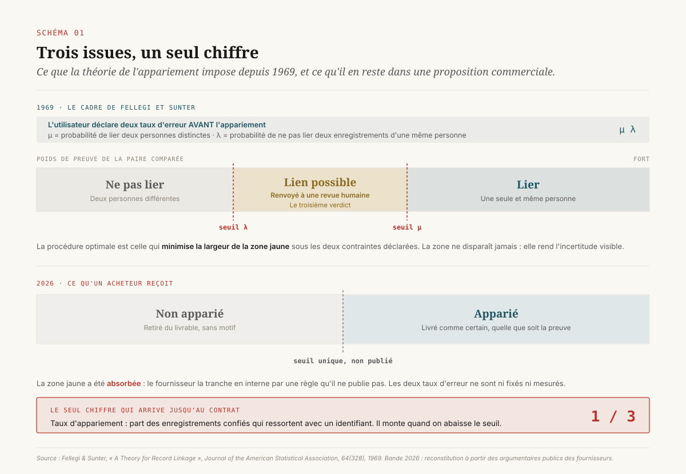
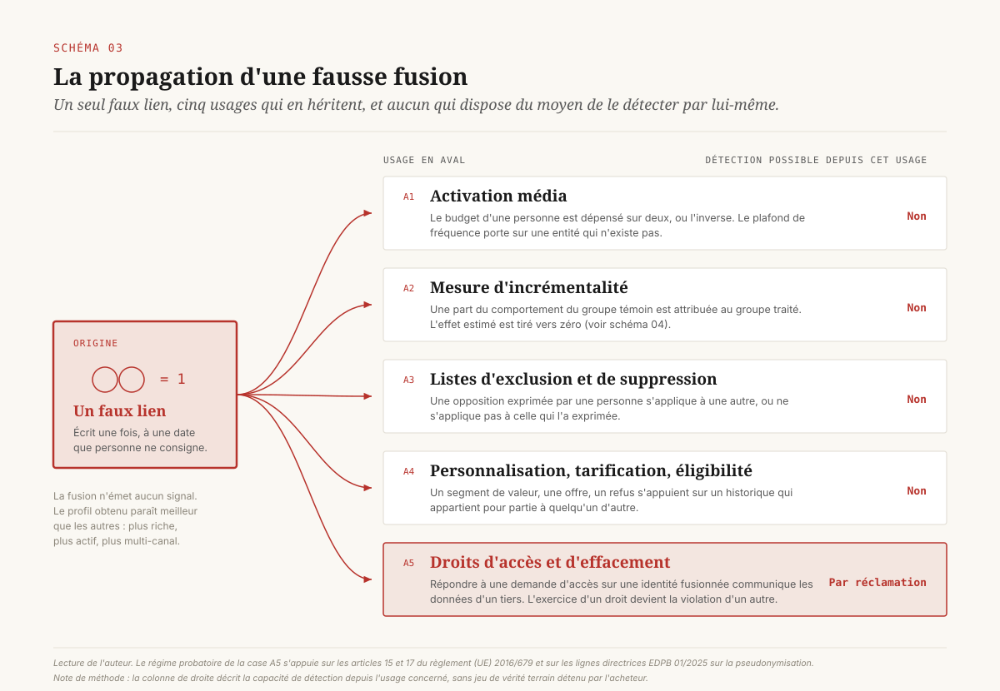
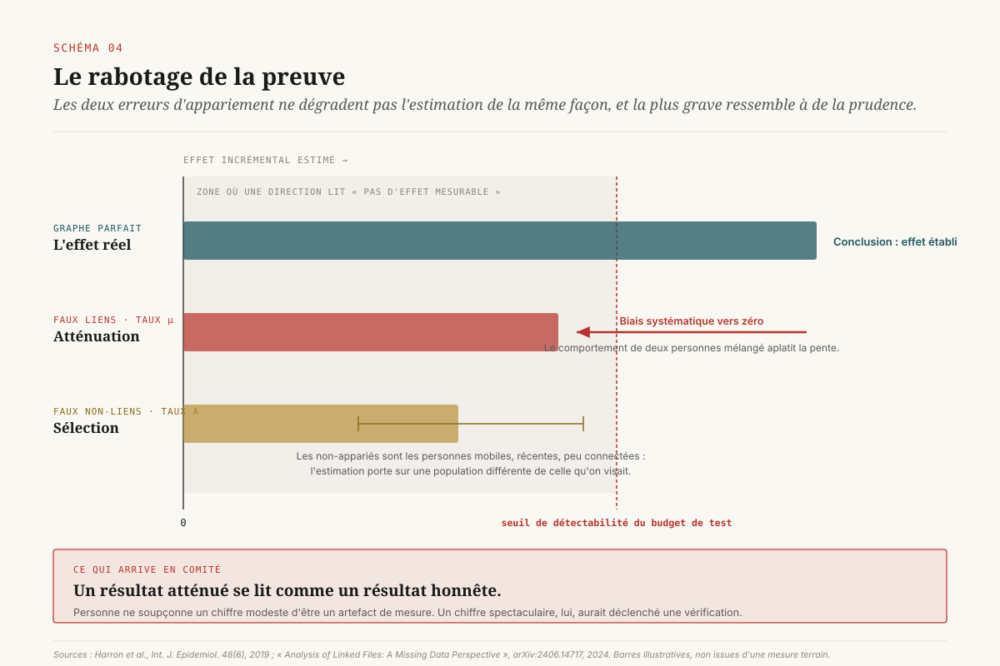

# Deux erreurs, un seul chiffre

> **Un graphe d'identité se vend sur son taux d'appariement, la seule des trois grandeurs de la décision qui ne coûte rien à celui qui le vend.** — 16 septembre 2026, Mathieu Guglielmino

## 1. Le chiffre qu'on achète

Il existe un chiffre que toute proposition commerciale de résolution d'identité contient, et un seul. Le taux d'appariement. Selon les fournisseurs et les zones, il se présente sous une douzaine de noms (taux de correspondance, taux de reconnaissance, couverture adressable, taux de réconciliation), et il répond toujours à la même question : sur cent enregistrements que vous nous confiez, combien en ressortent avec un identifiant.

Sa dispersion géographique est largement documentée par les fournisseurs eux-mêmes. Sur trafic américain, les acteurs de premier rang annoncent 40 à 60 % en global, et jusqu'à 70 à 80 % en mélangeant appariement déterministe et probabiliste sur du trafic exclusivement national. Au Canada, au Royaume-Uni et en Australie, les mêmes acteurs descendent dans une fourchette de 15 à 35 %. Dans l'Union européenne, on parle souvent de quelques pour cent, la contrainte de consentement s'ajoutant à la fragmentation linguistique et réglementaire.

Ces valeurs sont déclarées et non auditées. Leur intérêt n'est pas leur niveau, il est leur amplitude : un facteur dix entre deux zones pour la même technologie signale que le chiffre dépend moins de la qualité du graphe que du terrain sur lequel on le mesure. Une direction qui compare deux propositions sur ce seul indicateur compare deux périmètres de mesure.

Il y a plus gênant. ==Le taux d'appariement est une grandeur qu'on peut faire monter à volonté en abaissant l'exigence.== Un fournisseur qui accepte d'apparier deux enregistrements sur la seule base d'un nom et d'un code postal obtiendra mécaniquement une couverture supérieure à celui qui exige une correspondance sur un identifiant fort. Les deux publieront un pourcentage, dans la même unité, sur la même ligne de la grille comparative. Aucun des deux n'aura menti.

C'est la structure du problème : on achète une décision statistique qui comporte au moins trois grandeurs, et on l'arbitre sur une seule, dont la particularité est d'être la seule que le fournisseur puisse améliorer sans rien améliorer.

## 2. Ce que la théorie imposait

La résolution d'identité n'est pas une discipline récente. Sa formalisation date de 1969, dans un article d'Ivan Fellegi et Alan Sunter publié au *Journal of the American Statistical Association*, écrit pour les instituts statistiques nationaux qui devaient rapprocher des recensements et des registres d'état civil[^1]. Ce cadre reste, cinquante-sept ans plus tard, la référence théorique de tous les systèmes d'appariement probabiliste en production, y compris commerciaux.

Il dit trois choses que le marché publicitaire a discrètement laissées de côté.

**Premièrement, la décision a trois issues et non deux.** Pour chaque paire d'enregistrements comparée, Fellegi et Sunter définissent trois actions possibles : lier, ne pas lier, et une troisième que le vocabulaire commercial a fait disparaître, le *lien possible*. Cette zone intermédiaire correspond aux paires pour lesquelles le poids de preuve ne permet de trancher ni dans un sens ni dans l'autre. Le cadre théorique ne la considère pas comme un échec. Il l'impose comme le lieu où l'incertitude est rendue visible, et la renvoie à une revue humaine, ce que les instituts statistiques appellent encore aujourd'hui la revue clérical.

**Deuxièmement, il y a deux taux d'erreur, pas un indicateur de performance.** Le cadre distingue explicitement la probabilité de lier deux enregistrements qui ne correspondent pas à la même personne, et la probabilité de ne pas lier deux enregistrements qui y correspondent. Ces deux quantités sont notées séparément, elles ne se compensent pas, et la théorie ne propose aucun score unique qui les résumerait.

**Troisièmement, et c'est le point le plus lourd de conséquences, les seuils sont fixés par l'utilisateur avant l'appariement.** Dans le cadre original, l'analyste déclare les deux taux d'erreur qu'il est prêt à tolérer, et la procédure optimale est celle qui minimise la taille de la zone grise sous ces deux contraintes. L'ordre des opérations est explicite : on déclare d'abord ce qu'on accepte de se tromper, la machine optimise ensuite.

Comparons avec ce qu'un acheteur reçoit en 2026. La zone grise a été absorbée : le fournisseur la résout en interne, par une règle qu'il ne publie pas, et livre un résultat binaire. Les deux taux d'erreur ne sont pas mesurés, et lorsque des chiffres d'exactitude circulent (90 à 97 % selon les argumentaires courants), ils arrivent sans protocole, sans définition de la population de référence et sans jeu de vérité terrain identifiable. Les seuils ne sont pas fixés par l'acheteur, qui n'est le plus souvent pas informé qu'il existe des seuils.

==Le marché a conservé de la théorie de l'appariement la partie qui produit un chiffre, et retiré les deux parties qui produisent une obligation.==

## 3. Les deux erreurs ne sont pas symétriques

Une direction qui accepte l'idée qu'il existe deux erreurs demande aussitôt laquelle privilégier. La réponse n'est pas une affaire de goût. Les deux erreurs ont des économies radicalement différentes.

### Le faux non-lien

Le faux non-lien se produit quand le graphe ne reconnaît pas qu'il s'agit de la même personne. Son coût est de la portée perdue : une audience plus petite, une exclusion qui ne s'applique pas, une fréquence mal plafonnée, un client traité comme un prospect.

Ce coût a trois propriétés qui le rendent confortable. Il est **visible** au point d'origine, puisque le volume d'audience adressable se lit directement dans la plateforme. Il est **chiffrable**, puisqu'il se traduit en impressions non délivrées ou en médias achetés plus cher. Il est **corrigible par du budget**, puisqu'on peut compenser une sous-couverture en élargissant le ciblage ou en payant un second fournisseur d'identité.

Un directeur marketing voit ce coût dans son tableau de bord la semaine où il se produit. C'est, par construction, le seul des deux qu'il pense à négocier.

### La fausse fusion

La fausse fusion se produit quand le graphe déclare identiques deux personnes distinctes. Ses propriétés sont l'exact opposé des précédentes.

Elle est **invisible au point d'origine**. Rien, dans une console d'activation, ne signale qu'un profil unifié agrège les comportements de deux individus. Le profil paraît même meilleur que les autres : plus riche, plus actif, plus multi-canal.

Elle est **propagée**. Une fois écrite dans le graphe, la fusion se transmet à tout ce qui consomme le graphe : l'activation, la mesure, les listes d'exclusion, la personnalisation, et la réponse aux demandes d'exercice de droits. Chacun de ces usages hérite de l'erreur sans jamais recevoir d'information sur sa présence.

Elle est **irrattrapable sans la trace**. Défusionner deux identités suppose de savoir quels enregistrements ont été rapprochés, sur quelle base, et à quelle date. Cette information existe chez le fournisseur. Elle figure rarement dans le contrat de restitution.

Il faut ajouter une quatrième propriété, plus dérangeante. La fausse fusion est **non uniformément distribuée**. Elle se concentre mécaniquement sur les populations dont les combinaisons d'attributs sont les moins discriminantes : patronymes fréquents, adresses collectives, foyers multigénérationnels, personnes récemment déménagées. Le point mérite d'être retenu, parce qu'un régulateur l'a déjà établi dans un autre secteur, et que nous y reviendrons.

### La règle qui en découle

De l'asymétrie entre ces deux économies sort une règle simple et opposable en négociation. ==Un fournisseur optimise l'erreur que l'acheteur mesure, et l'acheteur ne mesure que celle qu'il voit.== Sans exigence contractuelle explicite sur la fausse fusion, il n'existe aucun mécanisme de marché qui pousse à la réduire, et il en existe un puissant qui pousse à l'accepter, puisqu'elle augmente le seul chiffre publié.

Le schéma 3 suit une fausse fusion unique à travers les cinq usages qui consomment un graphe d'identité. La lecture utile n'est pas le nombre d'usages touchés, elle est le fait qu'aucun des cinq ne dispose du moyen de détecter l'erreur par lui-même.

## 4. La fausse fusion rabote la preuve

Le paragraphe précédent tenait de l'intuition de gestion. Celui-ci tient d'un résultat statistique établi, et c'est l'argument le plus solide du dossier.

Lorsqu'on analyse des données issues d'un appariement imparfait, les deux erreurs ne dégradent pas l'inférence de la même manière. La littérature méthodologique, développée surtout en épidémiologie et en statistique publique où l'appariement de registres est la norme, décrit les deux mécanismes[^3].

Les **faux non-liens** produisent un biais de sélection. Les enregistrements qui échouent à s'apparier ne sont pas un échantillon aléatoire : ce sont les personnes aux données incomplètes, mobiles, récemment arrivées, ou moins connectées. L'analyse porte alors sur une sous-population systématiquement différente de la population visée.

Les **faux liens** produisent un biais d'atténuation. Le résultat est net et vaut d'être posé tel quel : dans un modèle de régression linéaire estimé sur des données appariées à tort, les coefficients de pente sont systématiquement biaisés vers zéro[^4]. Mélanger le comportement de deux personnes distinctes revient à brouiller la relation entre l'exposition et la réponse, et un brouillage aléatoire aplatit la pente.

Traduisons pour une direction qui finance un plan de mesure.

Un dispositif d'incrémentalité cherche à établir qu'une exposition publicitaire a causé un surcroît d'achat. Il compare des individus exposés et non exposés, ou des zones traitées et témoins, en appuyant la construction des groupes sur le graphe d'identité. Si ce graphe fusionne des individus distincts, une partie des personnes comptées comme exposées ne l'a pas été, et une partie du comportement attribué au groupe traité provient du groupe témoin. L'effet mesuré est tiré vers zéro.

==Le dispositif construit pour prouver l'effet le rabote, et il le rabote dans la direction qui ressemble à de la prudence.== Un résultat atténué se lit comme un résultat honnête. Personne ne soupçonne un chiffre modeste d'être un artefact de mesure, alors qu'un chiffre spectaculaire aurait déclenché une vérification.

Cette conclusion se combine mal avec un fait déjà établi dans un dossier voisin de cette série : le budget d'expérimentation d'un annonceur ordinaire place son seuil de détectabilité au-dessus de bien des effets réels. Ajouter une atténuation d'origine identitaire à une puissance statistique déjà courte revient à financer un dispositif qui ne peut structurellement pas conclure, et à lire son silence comme une information.

Il faut donc renverser l'ordre habituel des travaux. La qualification du graphe d'identité relève du plan de mesure lui-même, au même titre que le calcul de puissance, et elle le précède.

## 5. Ce que la précision vaut vraiment

L'appariement n'est que la première moitié de la chaîne. La seconde est l'attribut : une fois deux enregistrements réunis, on leur attache un âge, un genre, un revenu, une intention. Là aussi, il existe une mesure indépendante, et elle est ancienne.

Nico Neumann, Catherine Tucker et Timothy Whitfield ont publié en 2019 dans *Marketing Science* une étude de terrain sur l'exactitude des audiences de tierce partie[^2]. Le protocole est robuste pour ce domaine : plus de 90 audiences validées, issues de plus de 19 courtiers de données, sur deux attributs démographiques (âge, genre) et trois domaines d'intérêt, testées dans trois expériences distinctes.

Le résultat principal tient en une phrase. Face à une sélection aléatoire, l'utilisation d'un profil acheté augmentait l'identification d'un utilisateur portant l'attribut visé de **0 à 77 %** selon les segments. La borne basse mérite d'être lue lentement : certaines audiences achetées ne faisaient pas mieux que le hasard. Les auteurs concluent que la qualité varie fortement d'un courtier à l'autre, et que, compte tenu du surcoût des solutions de ciblage, les audiences de tierce partie sont souvent économiquement peu attractives hors emplacements médias chers.

Deux enseignements pour une direction, sept ans plus tard.

Le premier est arithmétique. La couverture et la précision se multiplient, elles ne s'additionnent pas. Un graphe qui reconnaît 60 % de la base avec 80 % de justesse d'appariement, alimentant un segment juste dans 60 % des cas, ne délivre pas 60 %, ni la moyenne des trois. Il délivre le produit. Aucun des trois facteurs n'est publié séparément, et seul le premier figure au contrat.

Le second tient à l'écart entre l'étude et le marché. Cette mesure indépendante date de 2019, elle est parue dans une revue de premier rang, et il n'en existe aujourd'hui aucun équivalent public conduit sur les graphes d'identité de 2026. L'absence de réplication n'est pas une preuve d'amélioration.

## 6. Le secteur qui a déjà tranché

Il existe un domaine où l'appariement d'enregistrements sur des personnes physiques est encadré depuis un demi-siècle, où l'erreur porte un nom, où un régulateur en a mesuré les effets et où une règle d'appariement a été déclarée illégale. Ce domaine est le crédit aux particuliers, aux États-Unis.

Le *Fair Credit Reporting Act* impose depuis 1970 aux agences de renseignement sur la solvabilité de suivre « des procédures raisonnables pour assurer l'exactitude maximale possible » des informations qu'elles rapportent sur un consommateur. La formulation est remarquable en ce qu'elle porte sur la **procédure** et non sur le résultat : le texte n'exige pas l'exactitude, il exige que les procédures soient raisonnables au regard de l'exactitude visée.

L'erreur d'appariement y porte un nom consacré, le *mixed file*, soit le dossier qui mélange les informations de deux personnes distinctes. C'est exactement la fausse fusion de la section 3, dans un secteur où elle prive quelqu'un d'un prêt.

Le 4 novembre 2021, le Bureau américain de protection financière des consommateurs a publié un avis consultatif dont la portée dépasse largement son secteur[^5]. Il y établit que l'appariement sur le seul nom, c'est-à-dire le rapprochement d'une information et d'un consommateur sur la base de la seule similarité des prénom et nom, sans vérification par un élément d'identification supplémentaire, se situe nettement en deçà de l'obligation légale.

Trois éléments de cet avis méritent d'être transposés.

**Un régulateur peut déclarer une règle d'appariement illégale.** L'objet de la décision n'est ni une donnée, ni une finalité, ni un consentement. C'est la règle de rapprochement elle-même, le seuil, la logique interne du système. Le raisonnement est directement transposable à n'importe quel graphe dont la règle produit un dommage prévisible.

**La clause de non-garantie ne protège pas celui qui l'écrit.** La déclaration accompagnant l'avis avertit explicitement les agences contre la tentative d'échapper à leurs responsabilités en assortissant leur rapport d'une mention indiquant qu'il pourrait ne pas correspondre à la bonne personne[^6]. Toute personne ayant lu un contrat de fourniture de données publicitaires reconnaîtra la clause : le fournisseur y décline la responsabilité de l'exactitude des appariements. Dans le secteur du crédit, cette clause a été jugée sans effet exonératoire.

**L'erreur d'appariement a un profil démographique.** L'avis relève que les rapprochements erronés sont plus fréquents parmi les populations hispaniques, noires et asiatiques, la diversité des patronymes y étant moindre que dans la population blanche non hispanique. Le constat est purement combinatoire, et il vaut pour tout système d'appariement onomastique, y compris publicitaire. Une direction qui déploie un ciblage ou une exclusion appuyés sur un graphe non qualifié déploie donc une erreur inégalement répartie, dans un cadre européen où la discrimination indirecte est un risque juridique caractérisé.

La différence entre les deux secteurs ne tient pas à la technique, qui est la même, ni à la gravité, qui est discutable. Elle tient à ce qu'un secteur a un régulateur qui compte les erreurs, et l'autre un marché qui publie un taux de couverture.

## 7. Le graphe n'est pas anonyme, et son caractère personnel est relatif

Trois décisions européennes récentes changent la lecture juridique d'un graphe d'identité. Elles vont dans des directions apparemment opposées, ce qui rend le résultat net plus intéressant qu'un simple durcissement.

**La chaîne de consentement est une donnée personnelle.** Dans son arrêt du 7 mars 2024, la Cour de justice de l'Union européenne a jugé qu'une chaîne composée de la combinaison de lettres et de caractères enregistrant les préférences d'un utilisateur constitue une donnée personnelle dès lors qu'elle peut, par des moyens raisonnables, être associée à un identifiant tel que l'adresse IP de l'appareil[^8]. La Cour a en outre retenu la responsabilité conjointe de l'organisation qui définit le cadre, tout en la bornant aux traitements dont elle détermine effectivement les finalités et les moyens. Un identifiant technique sans nom ni adresse relève donc du règlement dès qu'il est réassociable.

**Le caractère personnel s'apprécie du point de vue du détenteur.** L'arrêt du 4 septembre 2025 dans l'affaire opposant le Contrôleur européen de la protection des données au Conseil de résolution unique introduit une nuance décisive[^7]. La Cour y retient que le caractère personnel d'une donnée n'est pas une propriété absolue de la donnée. Les mêmes informations pseudonymisées peuvent ne pas être des données personnelles pour un destinataire qui ne dispose pas de la clé et n'a pas les moyens raisonnables de ré-identifier, tout en restant des données personnelles pour l'émetteur qui les détient.

La combinaison des deux arrêts produit une conséquence contre-intuitive pour un graphe partagé : **la qualification juridique d'un même identifiant change selon le point de la chaîne où on l'observe**. Chez l'annonceur qui détient la base d'origine, elle est personnelle sans discussion. Chez un partenaire aval, la réponse dépend de ce que ce partenaire peut raisonnablement faire. Or un graphe d'identité a pour fonction d'augmenter cette capacité de réassociation chez ceux qui le consultent. L'objet dont on achète la performance est donc celui qui déplace la qualification juridique de tous ceux à qui on le transmet.

Les lignes directrices adoptées par le Comité européen de la protection des données le 16 janvier 2025 confirment le cadre d'analyse[^9] : la pseudonymisation remplace ou sépare des identifiants, elle ne fait pas sortir les données du champ du règlement, et elle suppose une transformation conçue, une information additionnelle protégée séparément, des mesures techniques et organisationnelles, et une vision claire du domaine dans lequel la protection est censée opérer. Le hachage d'une adresse de courrier électronique ne coche aucune de ces cases par lui-même.

**La capacité de ré-identification est une circonstance aggravante.** La délibération de la CNIL du 15 juin 2023 sanctionnant un acteur du reciblage publicitaire de 40 millions d'euros est instructive sur le raisonnement[^10]. Le montant a été déterminé notamment au regard du volume de personnes concernées, de la quantité de données collectées sur les habitudes de consommation, et de la **capacité de la société à ré-identifier les personnes**, le traitement portant sur environ 370 millions d'identifiants. Le Conseil d'État a rejeté le recours le 4 mars 2026[^11]. Le grief central retenu tenait à l'absence de mesure permettant de s'assurer que les données traitées correspondaient à des consentements valablement recueillis, et à l'absence de mécanisme d'audit des partenaires.

Une direction data en tire trois obligations concrètes, rarement outillées.

D'abord, **le droit d'accès s'exerce sur une identité probabiliste**. Quand une personne demande quelles données sont détenues sur elle, la réponse suppose de retrouver toutes les identités que le graphe a rattachées à la sienne. Si l'une de ces liaisons est fausse, la réponse communique les données d'un tiers, et l'exercice d'un droit devient une violation.

Ensuite, **le droit à l'effacement se propage mal**. Effacer une personne d'un graphe fusionné suppose de savoir défusionner. À défaut, on efface trop ou trop peu, et les deux sont fautifs.

Enfin, **la preuve du consentement remonte à l'identifiant**. La sanction rappelle que le responsable qui exploite une chaîne de consentement doit pouvoir démontrer sa validité, et qu'il ne peut se retrancher derrière ses partenaires. Un appariement construit sur des identifiants dont la provenance de consentement n'est pas tracée transfère ce risque à celui qui active, non à celui qui apparie.

## 8. Pour le compte de qui le graphe apparie

Reste la question que cette série a déjà posée un étage plus haut, à propos de la mesure d'incrémentalité tenue par ceux qui vendent l'espace. Transposée à l'identité, elle s'énonce ainsi : qui décide que deux enregistrements désignent la même personne, et quel intérêt cette partie a-t-elle au résultat.

**Il n'existe pas un espace d'identité, il en existe plusieurs, et leurs définitions diffèrent.** Les identifiants dits universels reposent sur des entrées différentes et garantissent des choses différentes. Certains dérivent d'une adresse de courrier électronique fournie par l'utilisateur authentifié, hachée et salée, avec un mécanisme de consentement explicite et une rotation périodique. D'autres sont émis pour du trafic non authentifié, donc par inférence. D'autres encore sont des graphes propriétaires de plateformes, dont la règle d'appariement n'est ni publiée ni auditable de l'extérieur. Deux fournisseurs peuvent livrer des taux d'appariement comparables sur la même base tout en ayant réuni des personnes différentes.

**Le seul standard de transparence sur l'identité déclare qui, jamais avec quelle exactitude.** La spécification `id-sources.json` publiée par l'IAB Tech Lab en octobre 2021 permet à un acteur de déclarer sur son domaine les sources d'identifiants avec lesquelles il est intégré[^13]. L'objectif affiché est la lisibilité des chemins d'approvisionnement. Le fichier répond à la question « quels identifiants circulent ici ». Il ne porte aucun champ décrivant la règle d'appariement, ses seuils ou ses taux d'erreur.

**L'accréditation s'arrête avant l'appariement.** Le dispositif d'accréditation de référence du marché américain impose aux services de mesure candidats de divulguer à leurs clients l'ensemble des aspects méthodologiques de leur service, de respecter des standards minimaux et de se soumettre à un audit destiné à authentifier leurs procédures[^14]. Le périmètre couvre la mesure. La résolution d'identité qui l'alimente reste largement hors champ, la qualité des données et l'identité figurant parmi les sujets signalés comme en cours d'évaluation plutôt que comme normés. L'acheteur se retrouve dans une situation familière : une couche auditée posée sur une couche qui ne l'est pas.

**Le marché se concentre.** L'annonce du 17 mai 2026 de l'acquisition d'un des principaux fournisseurs indépendants de collaboration de données et d'identité par un groupe de communication, pour environ 2,2 milliards de dollars, illustre le mouvement[^12]. L'acquéreur revendique une infrastructure d'identité comme socle de ses agents et de sa production média. Le fait en lui-même n'établit aucune faute. Il déplace une question contractuelle : la couche qui arbitre l'identité de vos clients appartient désormais, dans plusieurs configurations de marché, à une partie qui a aussi un intérêt à l'achat média réalisé sur la base de cette identité. La parade tient dans le même dispositif que celui du dossier voisin sur la mesure : un droit de vérification écrit, et un jeu de vérité terrain que l'acheteur détient.

## 9. Le cahier des charges

Ce qui précède se résume en une exigence de principe : l'objet de l'achat est une procédure d'appariement dont l'acheteur fixe les paramètres et vérifie les résultats, et la couverture n'en est qu'un sous-produit. Voici ce que cela donne, ligne à ligne, dans un contrat.

**1. Le taux de fausse fusion est plafonné par l'acheteur.** Le contrat nomme une valeur maximale tolérée pour la probabilité d'apparier deux enregistrements désignant des personnes distinctes, et la rend contrôlable. C'est le paramètre que la théorie confie à l'utilisateur depuis 1969 et que le marché ne propose pas de fixer. Le poser change la conversation commerciale, parce qu'un fournisseur qui refuse de le plafonner vient d'indiquer qu'il ne le mesure pas.

**2. Le taux de non-appariement est mesuré et publié séparément.** La couverture cesse d'être l'indicateur et devient l'une des deux faces d'un couple. Elle est déclarée sur un périmètre défini (zone, canal, segment), sans agrégation qui masque la dispersion.

**3. La zone d'incertitude est déclarée, pas dissoute.** Le fournisseur indique la part des paires comparées qui tombent dans la zone intermédiaire, et la règle par laquelle il les tranche. Une direction peut alors choisir en connaissance de cause : les écarter (précision haute, couverture basse), les rattacher (l'inverse), ou les traiter différemment selon l'usage aval. La restauration du troisième verdict est la décision la plus structurante de cette liste, parce qu'elle rend l'arbitrage visible au lieu de le déléguer.

**4. L'acheteur détient un jeu de vérité terrain.** Quelques milliers d'identités connues avec certitude, issues de la base propre (clients authentifiés, doublons résolus manuellement, foyers documentés), tenues hors du périmètre livré au fournisseur et rejouées à chaque version du graphe. C'est le seul dispositif qui transforme une exactitude annoncée en exactitude mesurée. Il coûte quelques jours-homme et il est la contrepartie indispensable des exigences 1 et 2.

**5. Les appariements sont restituables.** Le contrat prévoit que l'acheteur peut obtenir, dans un format exploitable et un délai borné, la liste des enregistrements rapprochés et la base du rapprochement. Sans cette clause, une fausse fusion détectée n'est pas corrigible, et une demande d'effacement n'est pas exécutable proprement.

**6. Le graphe est versionné.** Chaque livraison porte une version identifiée, et toute modification de la règle d'appariement fait l'objet d'un préavis. Une refonte silencieuse des seuils déplace simultanément la taille des audiences et les résultats de mesure, sans qu'aucun tableau de bord ne l'explique. Le mécanisme est le même que la régression silencieuse à chaque changement de version d'un modèle, déjà documentée ailleurs dans cette série.

**7. Un titulaire est désigné pour les droits des personnes.** Une personne nommée répond de la capacité à reconstituer, pour une demande d'accès ou d'effacement, l'ensemble des identités que le graphe a rattachées à un individu. L'exigence paraît administrative. Elle est la seule qui oblige à vérifier que l'exigence 5 fonctionne réellement.

### Cinq décisions, classées par réversibilité

**Réversible en quelques jours.** Constituer le jeu de vérité terrain. Aucune négociation n'est requise, aucun fournisseur n'a besoin d'être prévenu, et le dispositif sert immédiatement à arbitrer entre deux propositions. C'est la décision la moins chère et la seule qui ne dépende de personne.

**Réversible à l'échelle d'un cycle contractuel.** Réécrire la clause de qualité pour y porter les exigences 1 à 3. Le coût réel est celui d'un cycle de négociation, et le gain immédiat est informationnel : la réponse du fournisseur à la demande de plafonnement renseigne davantage que le chiffre qu'il aurait fourni.

**Réversible à l'échelle d'un exercice.** Qualifier le graphe avant d'arrêter le plan de mesure annuel. Concrètement, faire précéder le calcul de puissance d'une estimation de l'atténuation attendue, et arbitrer les questions auxquelles on renonce en conséquence.

**Difficilement réversible.** Choisir un espace d'identité unique et y adosser à la fois l'activation et la mesure. Le confort d'exploitation est réel, et il crée la configuration où la partie qui définit l'identité est aussi celle dont on évalue la performance. La parade tient en une ligne : la mesure s'appuie sur une identité que l'acheteur peut reconstituer sans le fournisseur.

**Irréversible à l'échelle d'un mandat.** Laisser un graphe non qualifié alimenter des décisions d'exclusion, de tarification ou d'éligibilité. Les erreurs d'appariement y produisent des effets individuels et inégalement répartis, elles laissent une trace, et elles se découvrent en général par une réclamation plutôt que par un tableau de bord.

## 10. Ce qu'il faut retenir

La résolution d'identité est vendue comme une commodité, et elle est achetée comme telle : sur un chiffre, dans une grille comparative, à côté d'un prix. Le chiffre en question est le seul des trois que le fournisseur contrôle sans effort, et sa progression peut résulter d'un relâchement plutôt que d'un progrès.

La théorie qui fonde la discipline prescrit autre chose depuis 1969 : deux taux d'erreur déclarés par l'utilisateur, une zone d'incertitude assumée, et une procédure optimisée sous ces contraintes. Restaurer ces trois éléments dans un contrat ne demande aucune compétence technique particulière. Cela demande d'accepter que la couverture baisse quand on commence à exiger que les appariements soient justes.

Le crédit aux particuliers a franchi ce pas il y a cinquante ans, sous contrainte réglementaire, et un régulateur y a depuis déclaré une règle d'appariement illégale et privé d'effet la clause qui prétendait la couvrir. Le droit européen de la donnée s'est déplacé dans la même direction, en qualifiant les identifiants techniques et en faisant de la capacité de ré-identification un facteur aggravant.

La formule à retenir en réunion tient en une ligne. ==Le taux d'appariement mesure ce que le fournisseur a livré, jamais ce qu'il a livré de juste.== Aucune décision sérieuse ne se prend sur la première grandeur seule, et la seconde n'apparaîtra au contrat que le jour où un acheteur l'y écrira.

---

## Note de méthode

- L'accès à `pubsonline.informs.org` a été refusé par le proxy réseau de l'environnement de rédaction. Les chiffres de l'étude parue dans *Marketing Science* sont cités en substance depuis les résumés éditeur et institutionnels, recoupés sur deux formulations distinctes, et sont à revérifier à la source avant toute réutilisation contractuelle.
- Les taux d'appariement par zone géographique et les taux d'exactitude cités en section 2 sont **déclarés par des fournisseurs** et n'ont fait l'objet d'aucun audit indépendant public. Ils sont utilisés ici pour leur forme (l'amplitude, l'absence de protocole associé) et non pour leur valeur.
- La transposition du raisonnement du régulateur américain du crédit au domaine publicitaire est une **lecture de l'auteur**. Aucune autorité européenne n'a à ce jour qualifié une règle d'appariement publicitaire sur ce fondement.
- Le cahier des charges de la section 9 est une construction de l'auteur, dérivée du cadre théorique cité, et n'a pas été éprouvée contractuellement à grande échelle.

## Sources

[^1]: Ivan P. Fellegi et Alan B. Sunter, « A Theory for Record Linkage », *Journal of the American Statistical Association*, vol. 64, n° 328, décembre 1969, p. 1183-1210. https://www.tandfonline.com/doi/abs/10.1080/01621459.1969.10501049

[^2]: Nico Neumann, Catherine E. Tucker et Timothy Whitfield, « Frontiers: How Effective Is Third-Party Consumer Profiling? Evidence from Field Studies », *Marketing Science*, vol. 38, n° 6, novembre 2019. https://pubsonline.informs.org/doi/10.1287/mksc.2019.1188

[^3]: Katie Harron et al., « Reflections on modern methods: linkage error bias », *International Journal of Epidemiology*, vol. 48, n° 6, 2019, p. 2050-2060. https://academic.oup.com/ije/article/48/6/2050/5601471

[^4]: « Analysis of Linked Files: A Missing Data Perspective », arXiv:2406.14717, 2024. https://arxiv.org/abs/2406.14717

[^5]: Consumer Financial Protection Bureau, avis consultatif « Fair Credit Reporting; Name-Only Matching Procedures », 4 novembre 2021. https://files.consumerfinance.gov/f/documents/cfpb_name-only-matching_advisory-opinion_2021-11.pdf

[^6]: Consumer Financial Protection Bureau, déclaration du directeur accompagnant l'avis consultatif sur l'appariement sur le nom seul, 4 novembre 2021. https://files.consumerfinance.gov/f/documents/cfpb_name-only-matching-advisory-opinion_directors-statement_2021-11.pdf

[^7]: Cour de justice de l'Union européenne, affaire C-413/23 P, *CEPD c. CRU*, arrêt du 4 septembre 2025, communiqué de presse n° 107/25. https://curia.europa.eu/site/upload/docs/application/pdf/2025-09/cp250107en.pdf

[^8]: Cour de justice de l'Union européenne, affaire C-604/22, *IAB Europe*, arrêt du 7 mars 2024. https://fra.europa.eu/en/caselaw-reference/cjeu-case-c-60422-judgment

[^9]: Comité européen de la protection des données, lignes directrices 01/2025 sur la pseudonymisation, adoptées le 16 janvier 2025. https://www.edpb.europa.eu/system/files/2025-01/edpb_guidelines_202501_pseudonymisation_en.pdf

[^10]: Commission nationale de l'informatique et des libertés, délibération SAN-2023-009 du 15 juin 2023. https://www.legifrance.gouv.fr/cnil/id/CNILTEXT000047707063

[^11]: Conseil d'État, 10e et 9e chambres réunies, décision n° 482872 du 4 mars 2026. https://www.legifrance.gouv.fr/ceta/id/CETATEXT000053623557

[^12]: LiveRamp, communiqué relatif au projet d'acquisition par Publicis Groupe, 17 mai 2026. https://liveramp.com/news/publicis-to-acquire-liveramp-to-accelerate-data-co-creation-for-smarter-agents

[^13]: IAB Tech Lab, spécification technique `id-sources.json`, octobre 2021. https://iabtechlab.com/wp-content/uploads/2021/10/id-sources_pc-2021-10.pdf

[^14]: Media Rating Council, *Digital Advertising Auction Transparency Standards*, janvier 2026. https://www.mediaratingcouncil.org/sites/default/files/Standards/MRC_Digital_Advertising_Auction_Transparency_Standards_FINAL.pdf
