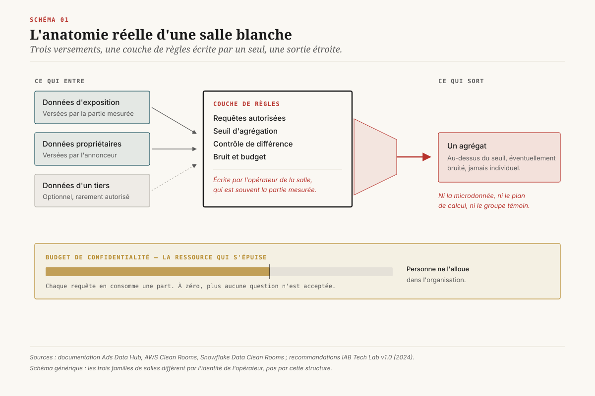
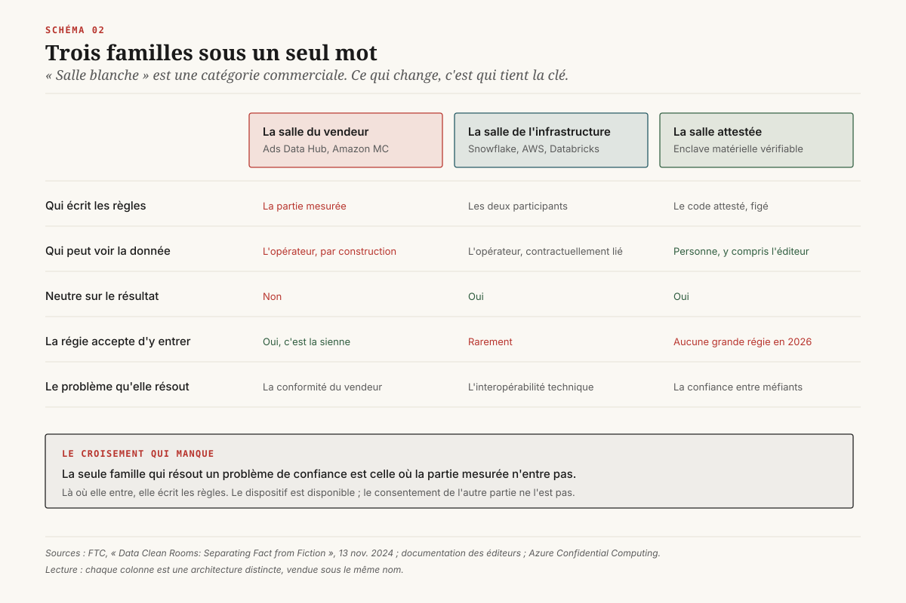
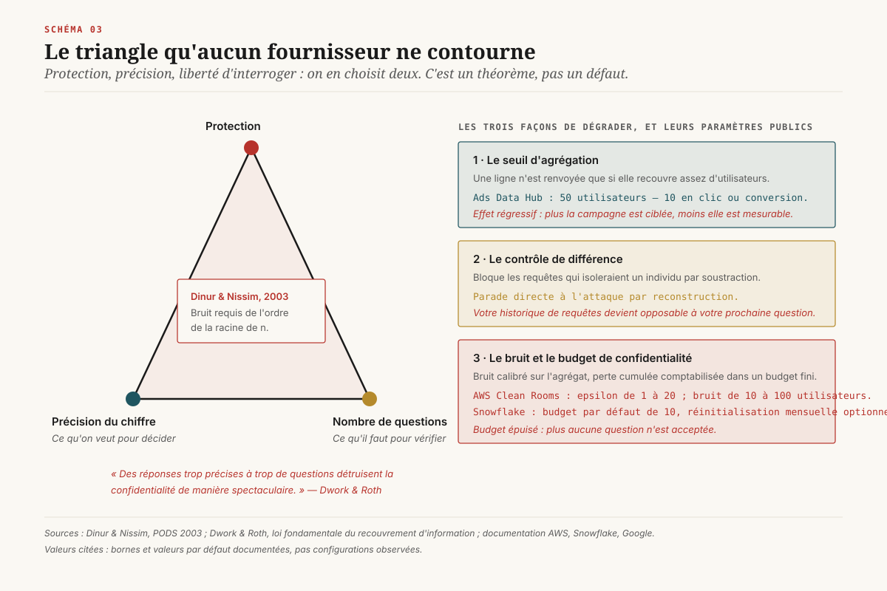
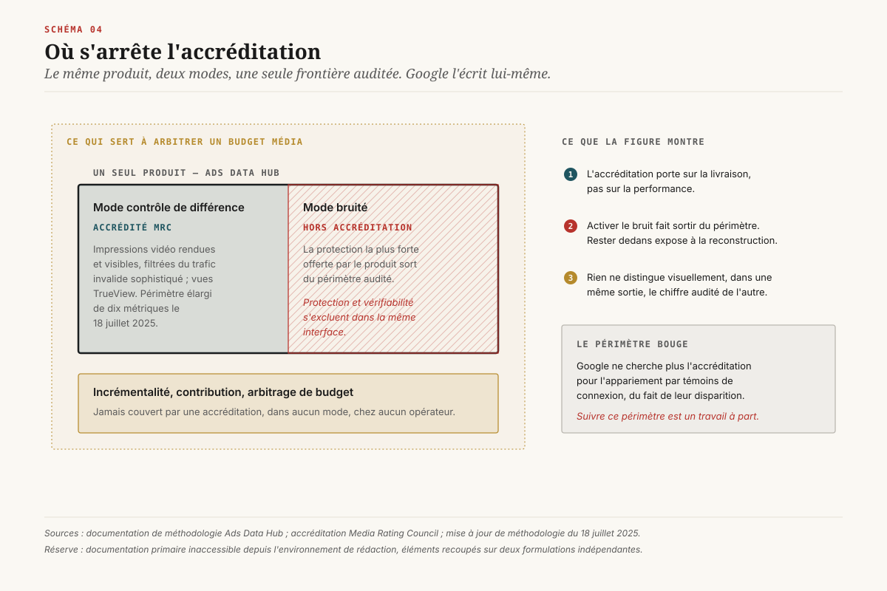
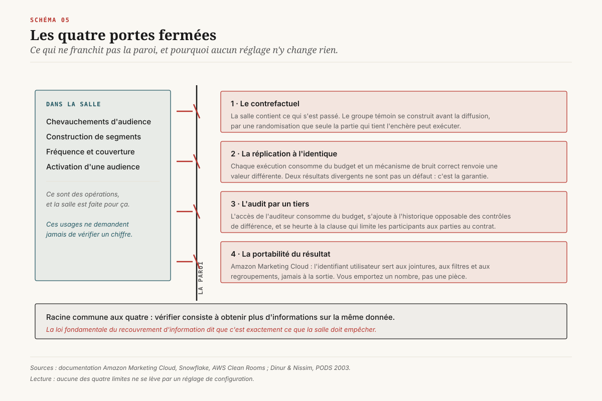
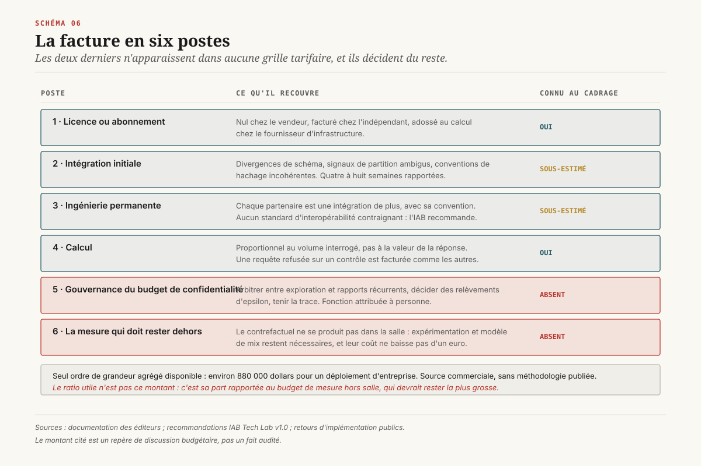
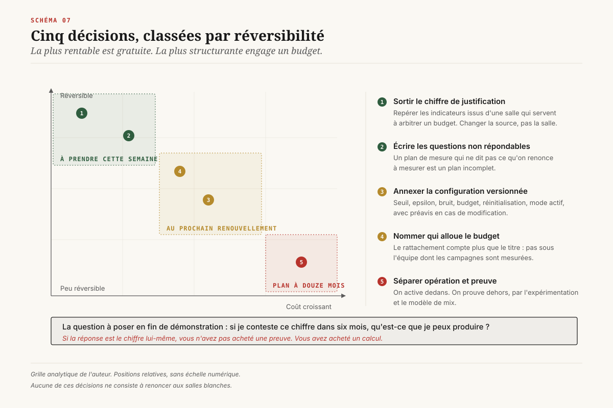

# La salle blanche ne prouve rien

> **La salle blanche a été vendue comme le lieu où la mesure redevient vérifiable. Le mécanisme qui empêche d'y ré-identifier un individu est celui qui empêche d'y auditer un chiffre, et cette exclusion n'est pas un défaut de produit : c'est un théorème.** — 19 août 2026, Mathieu Guglielmino

Un directeur data qui négocie aujourd'hui avec une régie, un distributeur ou une plateforme entend la même phrase : « passez par notre salle blanche ». Elle est présentée comme la réponse technique à une question de confiance. Vous ne voulez pas nous croire sur parole, vous ne pouvez pas récupérer nos données brutes, alors venez calculer vous-même chez nous.

L'offre est sincère et le dispositif fonctionne. Il ne fait simplement pas ce qu'on croit acheter. ==Une salle blanche est un lieu d'opération, pas un lieu de preuve.== Ce rapport explique pourquoi cette distinction n'est pas une nuance de vocabulaire mais une contrainte mathématique, ce qu'elle interdit concrètement, et ce qu'une direction data doit écrire dans ses contrats pour ne pas placer son chiffre de justification budgétaire dans la seule pièce où il ne pourra jamais être vérifié.

## 1. Ce qu'on a acheté, et pourquoi il n'y a plus d'alternative

La salle blanche de données est devenue en trois ans l'infrastructure par défaut de la collaboration publicitaire. Le principe est simple : deux parties versent chacune des données dans un environnement contrôlé par un tiers ou par l'une d'elles, une couche de règles limite les requêtes autorisées, et seuls des résultats agrégés en ressortent. Personne ne voit la donnée de l'autre. Tout le monde obtient un chiffre.

Le marché a suivi. Le secteur s'est consolidé en dix-huit mois : LiveRamp a racheté Habu pour 200 millions de dollars en janvier 2024, sa plus grosse acquisition en cinq ans[^14] ; WPP a absorbé InfoSum en avril 2025, retirant du marché l'un des derniers acteurs indépendants de taille. Dans le même temps, Amazon Web Services et Snowflake ont intégré des salles blanches à leur socle, en offre gratuite ou quasi gratuite pour les clients existants. Le nombre d'options réellement neutres a diminué pendant que l'adoption augmentait.

Un événement de fin 2025 a transformé cette tendance en dépendance. Le 17 octobre 2025, Google a retiré dix interfaces de Privacy Sandbox — dont l'API de rapport d'attribution, Topics et Protected Audience — après avoir constaté une adoption trop faible[^13]. La dépréciation est entrée en vigueur avec Chrome 144 en janvier 2026, la suppression complète est visée pour Chrome 150 en juillet 2026. Il ne reste du programme que CHIPS, FedCM et les jetons d'état privé, aucun des trois ne mesurant quoi que ce soit.

La conséquence est structurante pour une direction data. ==Le projet qui devait fournir une infrastructure de mesure publique, standardisée et intégrée au navigateur est mort ; la salle blanche est ce qui reste.== Elle n'est plus une option parmi d'autres, elle est le seul dispositif à l'échelle qui permette encore de croiser des données d'exposition publicitaire avec des données propriétaires. Un choix qui aurait pu être un arbitrage devient une contrainte, et un dispositif dont on n'examinait pas les limites parce qu'il était optionnel devient celui sur lequel repose la mesure.

C'est le bon moment pour lire son contrat.

## 2. Le nom ment, et le régulateur l'a écrit

Le 13 novembre 2024, les services de l'Office of Technology et de la Division of Privacy and Identity Protection de la *Federal Trade Commission* ont publié une note intitulée *Data Clean Rooms: Separating Fact from Fiction*[^1]. Sa formule la plus citée tient en une ligne : les salles blanches de données ne sont pas des salles, et elles ne nettoient pas les données. Le régulateur américain y avertit qu'un dispositif mal configuré ou mal présenté transforme un outil d'analyse prometteur en engagement de conformité qu'on ne pourra pas tenir.

Le point n'est pas rhétorique. « Salle blanche » désigne une catégorie commerciale, pas une architecture. Sous le même mot cohabitent trois dispositifs dont les propriétés de confiance n'ont rien de commun.

**La salle du vendeur.** Ads Data Hub chez Google, Amazon Marketing Cloud chez Amazon, les équivalents chez les grandes plateformes et chez les distributeurs devenus régies. L'opérateur de la salle est celui dont on veut mesurer la performance. Il fournit la donnée d'exposition, écrit les règles d'accès, définit les seuils, exploite l'infrastructure et décide de ce qui sort. L'annonceur apporte ses propres données et sa question.

**La salle de l'infrastructure.** Snowflake, AWS Clean Rooms, Databricks, Salesforce. L'opérateur est un fournisseur de calcul neutre vis-à-vis de la performance mesurée. Il n'a aucun intérêt au résultat. Mais il faut que les deux parties acceptent d'y verser leurs données, ce qui suppose que la partie mesurée l'accepte, et une régie n'a aucune obligation de sortir de sa propre salle.

**La salle attestée.** Les dispositifs fondés sur un *environnement d'exécution de confiance* (enclave matérielle isolée du système hôte), comme ceux de Decentriq sur les processeurs confidentiels d'Azure[^16]. La propriété revendiquée est plus forte : ni l'hébergeur ni l'éditeur de la salle ne peuvent inspecter la donnée en cours de traitement, et les participants peuvent *attester* cryptographiquement du code qui s'exécute. La confiance porte sur du matériel vérifiable au lieu d'une promesse contractuelle.

Ces trois familles ne répondent pas à la même question. La première résout un problème de conformité pour le vendeur. La deuxième résout un problème d'interopérabilité entre deux partenaires qui se font déjà confiance. Seule la troisième prétend résoudre un problème de confiance, et elle ne le peut que si la partie qui détient la donnée d'exposition accepte d'y entrer. En 2026, aucune grande régie ne le fait.

Le vocabulaire du secteur agrège ces trois situations. Les questions à poser à un fournisseur, listées dans la version 1.0 des recommandations de l'IAB Tech Lab publiée en juillet 2024[^10], servent précisément à les distinguer. Elles sont rarement posées.

## 3. Le théorème qu'aucun fournisseur ne contourne

Voici le cœur du dossier, et il ne vient ni du marketing ni du droit.

En 2003, Irit Dinur et Kobbi Nissim ont démontré un résultat qui a fondé toute la discipline moderne de la confidentialité statistique[^6]. Étant donné une base de données de *n* enregistrements accessible uniquement par des requêtes agrégées, il suffit d'un nombre étonnamment petit de requêtes bien choisies pour reconstruire l'intégralité des données individuelles sous-jacentes — sauf si l'on ajoute au résultat un bruit de l'ordre de Ω(√n). Autrement dit : l'agrégation seule ne protège rien. Elle ralentit un adversaire, elle ne l'arrête pas.

Cynthia Dwork et Aaron Roth ont donné à ce phénomène le nom qui lui est resté : la **loi fondamentale du recouvrement d'information**. Sa formulation canonique est brutale. ==Des réponses trop précises à trop de questions détruisent la confidentialité de manière spectaculaire.==[^7]

Ce résultat a deux conséquences que le vocabulaire commercial des salles blanches masque systématiquement.

**Première conséquence : toute salle blanche qui protège réellement doit dégrader.** Il n'existe pas de configuration où l'on obtient à la fois la précision d'une donnée individuelle, la liberté d'interroger autant qu'on veut, et une garantie de confidentialité. On en choisit deux. Ce n'est pas une limite d'ingénierie qu'un fournisseur plus habile lèverait à la version suivante, c'est un théorème.

**Deuxième conséquence : la dégradation doit porter sur le résultat.** On ne peut pas protéger en cachant la donnée d'entrée seulement, puisque l'attaque de reconstruction ne passe pas par l'entrée mais par l'accumulation de sorties. Il faut donc abîmer le chiffre qui sort, ou refuser de le donner.

Les trois mécanismes déployés en production sont exactement les trois façons de faire cela, et leurs paramètres sont publics.

**Le seuil d'agrégation.** Une ligne de résultat n'est renvoyée que si elle recouvre assez d'utilisateurs. Ads Data Hub exige un minimum de 50 utilisateurs par ligne, abaissé à 10 pour les requêtes portant uniquement sur des clics ou des conversions[^2]. Amazon Marketing Cloud applique une logique équivalente et supprime silencieusement les lignes trop fines : un regroupement qui produit un segment sous le seuil disparaît du résultat sans avertissement[^15]. La conséquence opérationnelle est régressive : plus votre campagne est ciblée, moins elle est mesurable.

**Le contrôle de différence.** Le système compare les requêtes successives d'un même utilisateur et bloque celles dont le résultat, rapproché d'une requête antérieure, permettrait d'isoler un individu par soustraction. C'est la parade directe à l'attaque de Dinur-Nissim. Elle a un coût peu commenté : elle rend l'historique de vos propres requêtes opposable à votre prochaine requête. Une question légitime peut être refusée à cause d'une question que vous avez posée trois semaines plus tôt.

**Le bruit et le budget.** L'approche la plus rigoureuse ajoute un bruit calibré aux agrégats et comptabilise la perte de confidentialité cumulée dans un *budget* fini. AWS Clean Rooms expose ce budget sous la forme d'un epsilon compris entre 1 et 20, et un paramètre de bruit exprimé en nombre d'utilisateurs à masquer, réglable entre 10 et 100[^8]. Snowflake attribue par défaut un budget de 10 par membre interrogateur, avec une option de réinitialisation mensuelle ; ==quand le budget est épuisé, la personne ne peut plus poser de question du tout jusqu'à ce qu'il soit augmenté ou renouvelé==[^9].

Ce dernier point mérite qu'on s'y arrête, parce qu'il change la nature de l'objet. Le budget de confidentialité est une ressource rare, consommée par chaque requête, dont l'épuisement produit un refus. Il crée dans l'entreprise une catégorie de dépense qui n'existait pas : le droit de poser une question. Qui l'alloue, entre l'équipe mesure et l'équipe activation, est une décision de gouvernance que personne n'a formalisée. Elle se prend aujourd'hui par ordre d'arrivée.

## 4. La preuve produit : l'accréditation s'arrête où le bruit commence

On pourrait considérer que tout ceci reste théorique et qu'en pratique les chiffres qui sortent d'une salle blanche sont assez bons. Un fait documenté par le fournisseur lui-même referme le débat.

Ads Data Hub est accrédité par le *Media Rating Council*, l'organisme américain d'accréditation des dispositifs de mesure média. L'accréditation porte sur les impressions vidéo rendues et visibles filtrées du trafic invalide sophistiqué et sur les vues TrueView, générées via l'interface et l'API d'Ads Data Hub, pour YouTube et les partenaires vidéo Google sur ordinateur, web mobile et application mobile[^4]. Google a élargi le périmètre documenté le 18 juillet 2025 en ajoutant dix métriques[^5].

Et la documentation de méthodologie précise que ==l'accréditation MRC ne s'étend pas aux requêtes exécutées en mode bruité==[^3]. Le reste de la méthodologie accréditée suppose que les requêtes tournent en mode de contrôle de différence.

Cette phrase est le document le plus honnête publié sur les salles blanches. Elle dit, dans les termes du fournisseur et validée par l'organisme d'accréditation, que la protection la plus forte offerte par le produit et la vérifiabilité du résultat s'excluent. Activez le bruit, vous sortez du périmètre audité. Restez dans le périmètre audité, vous acceptez un régime de protection dont Dinur et Nissim ont démontré qu'il ne résiste pas à un interrogateur patient. Le triangle du chapitre précédent n'est pas une abstraction : il est écrit dans une note de bas de page produit.

Il faut ajouter un second constat, plus embarrassant encore pour l'usage qu'on veut faire de ces salles. Ce que l'accréditation couvre — impressions vidéo visibles, filtrage du trafic invalide, vues TrueView — appartient à la famille des métriques de livraison. Ce sont exactement les métriques que le MRC accrédite depuis vingt ans, sur tous les dispositifs, et qu'un dossier précédent de cette série avait déjà identifiées comme le périmètre historique de l'accréditation. ==Aucune accréditation ne couvre l'incrémentalité, et une salle blanche n'y change rien.== Elle déplace le lieu du calcul sans déplacer la frontière de ce qui est auditable.

L'annonceur qui entre dans une salle blanche pour obtenir un chiffre défendable obtient donc un chiffre de livraison audité et un chiffre de performance qui ne l'est pas, dans la même sortie de requête, sans que rien ne les distingue visuellement.

Note complémentaire : Google a par ailleurs cessé de rechercher l'accréditation pour l'appariement par témoins de connexion, en raison de leur disparition annoncée. Le périmètre accrédité rétrécit d'un côté pendant qu'il s'élargit de l'autre, et le suivre est un travail à part entière.

## 5. Les quatre choses qui ne sortent jamais

Une salle blanche répond très bien à certaines questions. Elle recoupe des populations, calcule des chevauchements d'audience, construit des segments, mesure des fréquences, alimente une activation. Ce sont des opérations, et elle est faite pour ça.

Quatre choses n'en sortent structurellement pas, et aucune n'est un problème de configuration.

**Le contrefactuel.** Une salle blanche contient ce qui s'est passé. Elle ne contient pas ce qui se serait passé sans la campagne. Mesurer une incrémentalité suppose un groupe témoin construit avant la diffusion, par une randomisation que la partie qui tient l'enchère est seule à pouvoir exécuter. Une salle blanche à laquelle on verse a posteriori des données d'exposition et des données de vente produit une corrélation soigneusement calculée. La qualité du calcul ne compense pas l'absence de plan expérimental. C'est la limite que le dossier `mesure-juge-et-partie` avait établie du côté des régies ; elle se transporte intacte dans la salle, parce qu'elle ne portait jamais sur le lieu du calcul.

**La réplication.** Vérifier un chiffre suppose de pouvoir le recalculer. Sous un régime de budget de confidentialité, chaque exécution consomme du budget, et un mécanisme de bruit correctement implémenté renvoie une valeur légèrement différente à chaque fois. Deux exécutions identiques donnant deux résultats différents ne sont pas un défaut, c'est la garantie qui fonctionne. Mais la réplication à l'identique, socle de toute vérification, devient impossible par construction.

**L'audit par un tiers.** Faire vérifier un résultat par un auditeur indépendant suppose de lui donner accès. Cet accès consomme du budget de confidentialité, s'ajoute à l'historique opposable des contrôles de différence, et se heurte à la clause de la plupart des salles qui limite les participants aux parties au contrat. Le mécanisme de protection rend l'audit techniquement coûteux et contractuellement irrecevable en même temps.

**La portabilité.** On ne sort pas la microdonnée. Amazon Marketing Cloud est explicite : l'identifiant utilisateur existe dans les tables et sert aux jointures, aux filtres et aux regroupements, mais il ne peut jamais figurer dans le résultat[^15]. Le résultat n'est donc pas rejouable ailleurs, ni versable dans un modèle de mix marketing entretenu en interne, ni comparable ligne à ligne avec un autre dispositif. Vous emportez un nombre, pas une pièce.

Ces quatre points partagent la même racine. Toute opération de vérification consiste à obtenir plus d'informations sur la même donnée. La loi fondamentale du recouvrement d'information dit que c'est exactement ce qu'une salle blanche doit empêcher.

## 6. Le droit a bougé sous le produit

Deux mouvements juridiques de 2025 changent la lecture d'un contrat de salle blanche, et aucun des deux n'a été écrit en pensant à elle.

**L'arrêt *EDPS c. CRU*.** Le 4 septembre 2025, la Cour de justice de l'Union européenne a rendu son arrêt dans l'affaire C-413/23 P[^11]. Le Conseil de résolution unique avait transmis à un cabinet d'audit des observations pseudonymisées d'actionnaires. La Cour a jugé, pour la première fois explicitement, que des données suffisamment pseudonymisées peuvent constituer des données à caractère personnel pour l'émetteur sans en constituer pour le destinataire, dès lors que celui-ci ne peut raisonnablement ni inverser la pseudonymisation ni identifier les personnes par d'autres moyens. L'appréciation est **relative au destinataire**, et elle tient compte de facteurs techniques, organisationnels et juridiques.

La portée pour une salle blanche est directe. Le statut juridique de ce que vous y versez dépend de ce que l'opérateur de la salle peut réellement recouper, pas de la case que le fournisseur a cochée dans sa plaquette. Une salle opérée par un acteur qui détient par ailleurs un graphe d'identité étendu et une salle attestée où l'opérateur ne peut techniquement rien inspecter ne se trouvent pas dans la même situation, alors que le vocabulaire commercial les décrit de la même façon. ==L'attestation matérielle cesse d'être un argument technique pour devenir un argument juridique.== Elle documente précisément ce que le destinataire ne peut pas faire.

Réserve : l'arrêt départage un cas de transmission à un sous-traitant d'audit, et son application à un dispositif publicitaire n'a été tranchée par aucune autorité à ce jour. Il fixe une méthode d'appréciation, pas une qualification prête à l'emploi.

**L'article 6(8) du règlement sur les marchés numériques.** Le texte oblige les contrôleurs d'accès à fournir aux annonceurs et aux éditeurs, ainsi qu'aux tiers qu'ils mandatent, sur demande et gratuitement, l'accès aux outils de mesure de performance et aux données nécessaires pour conduire leur propre vérification indépendante, y compris des données non agrégées, sous une forme lisible par machine[^12]. Les manquements exposent à une amende pouvant atteindre 10 % du chiffre d'affaires mondial, 20 % en cas de récidive.

Cette obligation est en vigueur. Elle n'a, à la connaissance des sources consultées, jamais été invoquée pour contester le régime d'accès d'une salle blanche opérée par un contrôleur d'accès. Elle est pourtant le seul levier existant qui permette de poser la question dans les termes du droit plutôt que dans ceux de la négociation commerciale : le dispositif que vous m'imposez me permet-il de conduire ma propre vérification indépendante, ou seulement de recalculer votre chiffre chez vous. Un annonceur européen dispose là d'un point d'appui qu'il n'utilise pas.

## 7. La facture réelle

Le coût d'une salle blanche est presque toujours cadré comme une licence. Il comprend au moins six postes, et le dernier n'apparaît dans aucune grille tarifaire.

1. **Licence ou abonnement.** Nul chez le vendeur, qui l'offre parce qu'elle sert sa conformité et retient l'annonceur. Facturé chez les éditeurs indépendants et les salles attestées. Adossé au calcul chez les fournisseurs d'infrastructure.
2. **Intégration.** Les délais rapportés se comptent en semaines et non en heures : divergences de schéma, signaux de complétion de partition ambigus, conventions de hachage incohérentes entre partenaires. Une équipe qui déploie une analyse d'attribution y consacre couramment quatre à huit semaines de configuration et de formation.
3. **Ingénierie de données permanente.** Chaque partenaire supplémentaire est une intégration supplémentaire, avec sa propre convention. Travailler avec plusieurs salles simultanément multiplie les coûts de préparation, de gestion et d'extraction, et le secteur ne dispose d'aucun standard d'interopérabilité contraignant : la version 1.0 de l'IAB Tech Lab est une recommandation.
4. **Calcul.** Facturé à la requête ou à la charge de travail. Le coût est proportionnel au volume interrogé, pas à la valeur de la réponse, et une requête qui échoue sur un contrôle de confidentialité est facturée comme les autres.
5. **Gouvernance du budget de confidentialité.** Poste nouveau, poste sans propriétaire. Quelqu'un doit arbitrer entre l'exploration analytique et la production de rapports récurrents, décider si l'on relève epsilon au prix d'une garantie plus faible, et tenir la trace de ce qui a été dépensé. En pratique, cette fonction n'est attribuée à personne et l'arbitrage se fait par saturation.
6. **La mesure qui doit rester dehors.** Puisque le contrefactuel ne se produit pas dans la salle, le dispositif expérimental et le modèle de mix restent nécessaires, et leur coût ne baisse pas d'un euro parce qu'on a acheté une salle blanche. La salle est un coût qui s'ajoute au dispositif de preuve, pas un coût qui le remplace.

Le seul ordre de grandeur agrégé disponible publiquement pour un déploiement d'entreprise se situe autour de 880 000 dollars sur le périmètre licence, ingénierie, intégration et exploitation. Il provient d'une publication commerciale, il n'est ni audité ni méthodologiquement documenté, et il est cité ici comme repère de discussion budgétaire, pas comme un fait. Le chiffre utile n'est de toute façon pas celui-là : c'est le rapport entre ce poste et le budget de mesure hors salle, qui devrait rester supérieur.

## 8. Cinq décisions, classées par réversibilité

Aucune de ces décisions ne consiste à renoncer aux salles blanches. Elles servent à les remettre à leur place.

**Décision 1 — Sortir le chiffre de justification budgétaire de la salle. Réversible, gratuite.** Identifier dans les tableaux de bord actuels quels indicateurs proviennent d'une salle blanche et lesquels servent à arbitrer un budget. L'intersection est le problème. Elle se traite en changeant la source de l'indicateur, pas la salle. Cette décision ne coûte rien et se prend en une réunion.

**Décision 2 — Écrire la liste des questions non répondables. Réversible, faible coût.** Toute salle blanche a une frontière : seuils, budget, contrôles de différence, requêtes refusées. La liste des questions que le dispositif ne permet pas de traiter doit exister par écrit, être tenue à jour et être annexée au plan de mesure. Un plan de mesure qui ne dit pas ce qu'on renonce à mesurer est un plan incomplet.

**Décision 3 — Exiger la politique de confidentialité paramétrée en annexe versionnée. Coût contractuel, réversibilité moyenne.** Les paramètres qui déterminent la qualité de ce qui sort — seuil d'agrégation, epsilon, bruit par requête, budget alloué, règle de réinitialisation, mode de protection actif — sont des valeurs de configuration que l'opérateur peut changer. Ils doivent figurer dans une annexe versionnée, avec un préavis en cas de modification. Sans cela, une série temporelle produite en salle blanche peut changer de régime de mesure en cours de route sans qu'aucune trace n'en subsiste.

**Décision 4 — Attribuer la gouvernance du budget de confidentialité. Organisationnelle, réversible.** Une personne nommée arbitre l'allocation entre exploration et production, décide des relèvements d'epsilon et rend compte de la consommation. Le rattachement compte davantage que le titre : cette personne ne doit pas dépendre de l'équipe dont les campagnes sont mesurées.

**Décision 5 — Séparer les dispositifs d'opération et les dispositifs de preuve. Structurante, coûteuse, peu réversible.** C'est la décision de fond, et elle engage un budget. Les salles blanches servent à opérer : construire des audiences, calculer des chevauchements, activer, explorer. La preuve reste dehors, dans l'expérimentation géographique, le modèle de mix et la mesure par un tiers réellement indépendant. Une organisation qui fusionne les deux se retrouve à défendre son budget média avec un chiffre qu'elle ne peut ni répliquer, ni faire auditer, ni transporter.

La question à poser à un fournisseur en fin de démonstration tient en une phrase : si je conteste ce chiffre dans six mois, qu'est-ce que je peux produire. Si la réponse est le chiffre lui-même, vous n'avez pas acheté une preuve. Vous avez acheté un calcul.

## Note de méthode

Trois réserves portées dans le dossier.

**(a) Sources primaires inaccessibles.** Plusieurs sources primaires renvoient un `HTTP 403` depuis l'environnement de rédaction : `ftc.gov`, `developers.google.com`, `docs.snowflake.com`, `adexchanger.com`. Les éléments qui en proviennent — formule de la note FTC, seuils d'Ads Data Hub, exclusion du mode bruité du périmètre accrédité, paramètres de budget Snowflake — ont été recoupés sur au moins deux formulations indépendantes issues de résultats de recherche et de reprises professionnelles. Ils sont cités en substance et non entre guillemets, et doivent être vérifiés à la source avant toute réutilisation contractuelle. Le point le plus porteur du dossier, l'exclusion du mode bruité, est celui qui mériterait le plus une vérification directe dans la documentation de méthodologie de Google.

**(b) Le chiffre de coût n'est pas un fait.** L'ordre de grandeur de 880 000 dollars provient d'une publication commerciale sans méthodologie publiée. Il figure ici parce qu'aucune source de meilleure qualité n'existe publiquement, et il est signalé comme tel.

**(c) Les paramètres cités sont des valeurs par défaut ou des bornes documentées**, pas des configurations observées chez un annonceur. Un déploiement réel peut être plus strict ou plus permissif, et c'est exactement l'objet de la décision 3.

## Sources

[^1]: Federal Trade Commission, Office of Technology & Division of Privacy and Identity Protection, *Data Clean Rooms: Separating Fact from Fiction*, 13 novembre 2024. https://www.ftc.gov/policy/advocacy-research/tech-at-ftc/2024/11/data-clean-rooms-separating-fact-fiction (consulté le 19 août 2026, via reprises professionnelles — voir Note de méthode).

[^2]: Google for Developers, *Privacy checks in Ads Data Hub*. https://developers.google.com/ads-data-hub/guides/privacy-checks (consulté le 19 août 2026).

[^3]: Google for Developers, *Description of methodology — Ads Data Hub*. https://developers.google.com/ads-data-hub/marketers/resources/description-of-methodology (consulté le 19 août 2026).

[^4]: Adweek, *Media Rating Council Accredits Google's Ads Data Hub*. https://www.adweek.com/programmatic/media-rating-council-accredits-youtubes-ads-data-hub/ (consulté le 19 août 2026).

[^5]: PPC Land, *Google updates Ads Data Hub methodology with expanded metrics scope*, juillet 2025. https://ppc.land/google-updates-ads-data-hub-methodology-with-expanded-metrics-scope/ (consulté le 19 août 2026).

[^6]: Irit Dinur et Kobbi Nissim, *Revealing Information While Preserving Privacy*, PODS 2003. Résumé et portée : https://en.wikipedia.org/wiki/Reconstruction_attack (consulté le 19 août 2026).

[^7]: *The Theory of Reconstruction Attacks*, differentialprivacy.org. https://differentialprivacy.org/reconstruction-theory/ (consulté le 19 août 2026).

[^8]: Amazon Web Services, *Differential privacy policy — AWS Clean Rooms*. https://docs.aws.amazon.com/clean-rooms/latest/userguide/dp-settings.html (consulté le 19 août 2026).

[^9]: Snowflake, *Differential privacy in Snowflake Data Clean Rooms* et *Working with privacy budgets*. https://docs.snowflake.com/en/user-guide/cleanrooms/differential-privacy (consulté le 19 août 2026).

[^10]: IAB Tech Lab, *Data Clean Rooms Guidance and Recommended Practices, Version 1.0*, juillet 2024. https://iabtechlab.com/datacleanrooms/ (consulté le 19 août 2026).

[^11]: Cour de justice de l'Union européenne, *EDPS c. CRU*, C-413/23 P, 4 septembre 2025. https://curia.europa.eu/site/upload/docs/application/pdf/2025-09/cp250107en.pdf (consulté le 19 août 2026).

[^12]: Règlement (UE) 2022/1925 sur les marchés numériques, article 6(8). https://www.eu-digital-markets-act.com/Digital_Markets_Act_Article_6.html (consulté le 19 août 2026).

[^13]: PPC Land, *Chrome kills most Privacy Sandbox technologies after adoption fails*, octobre 2025. https://ppc.land/chrome-kills-most-privacy-sandbox-technologies-after-adoption-fails/ (consulté le 19 août 2026).

[^14]: LiveRamp, *LiveRamp to Acquire Habu to Accelerate the Power of Data Collaboration*, 17 janvier 2024. https://investors.liveramp.com/news-releases/news-release-details/liveramp-acquire-habu-accelerate-power-data-collaboration (consulté le 19 août 2026).

[^15]: Amazon Ads, *Amazon Marketing Cloud*. https://advertising.amazon.com/solutions/products/amazon-marketing-cloud (consulté le 19 août 2026).

[^16]: Microsoft Azure Confidential Computing, *Confidential Data Clean Rooms — the evolution of sensitive data collaboration*. https://techcommunity.microsoft.com/blog/azureconfidentialcomputingblog/confidential-data-clean-rooms-%E2%80%93-the-evolution-of-sensitive-data-collaboration/3273844 (consulté le 19 août 2026).

---

*Format co-écrit avec l'aide d'une IA.*
