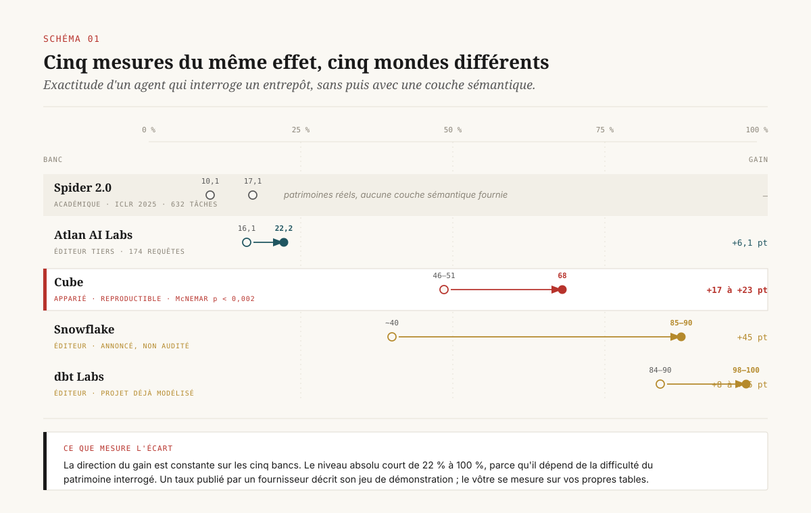
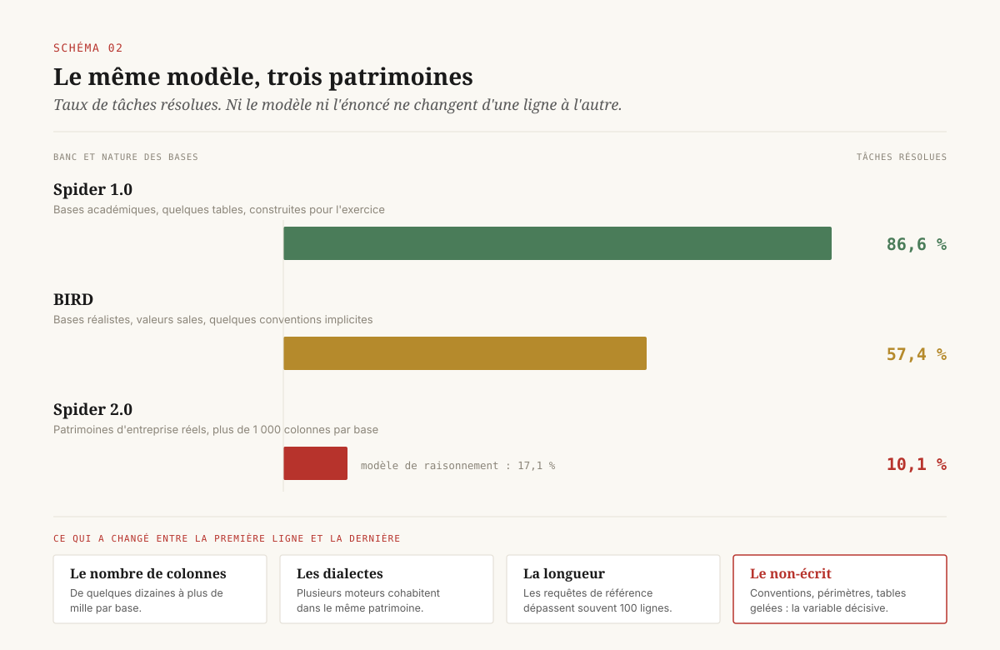
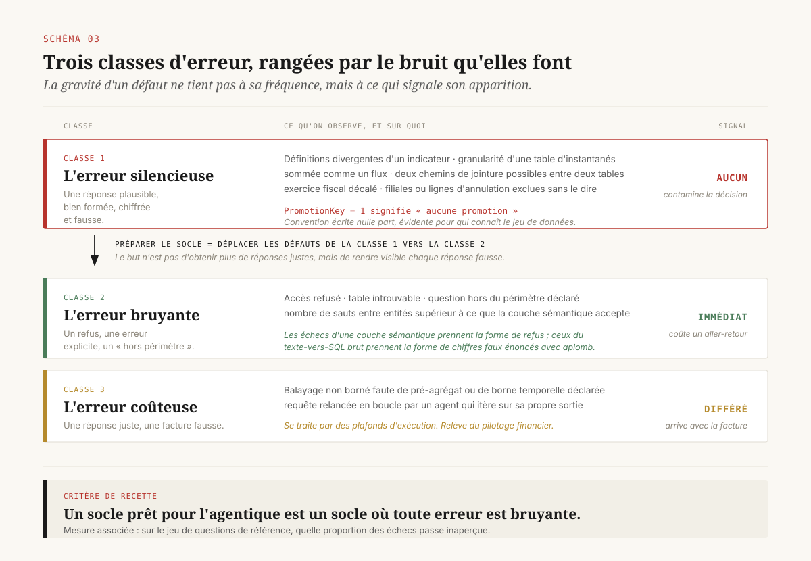
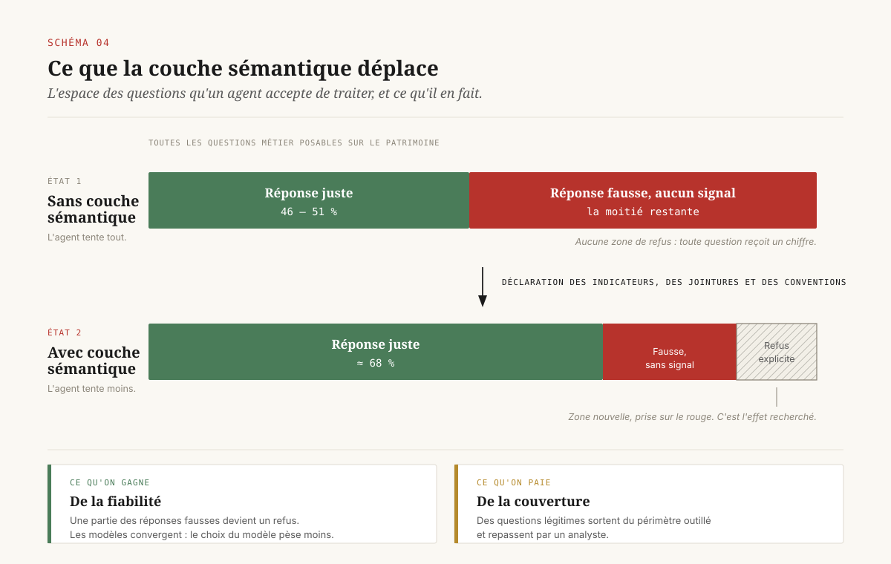

# Ce que l'agent ne peut pas deviner

> **Un agent d'analyse échoue sur ce que personne n'a écrit. Préparer un socle pour l'agentique consiste à convertir les erreurs silencieuses en erreurs bruyantes — et aucun chiffre d'exactitude publié par un éditeur ne prédit celui que vous obtiendrez.** — 11 septembre 2026, Mathieu Guglielmino

Depuis dix-huit mois, la même démonstration circule dans les comités : quelqu'un pose une question en français à un agent branché sur l'entrepôt de l'entreprise, l'agent écrit du SQL, un chiffre s'affiche. La démonstration fonctionne. Elle fonctionne parce qu'elle porte sur trois tables préparées pour l'occasion, et elle ne dit rien de ce qui se passera sur les quatre mille tables du patrimoine réel.

Ce dossier porte sur l'écart entre les deux. Il ne traite pas de la qualité des modèles, qui progresse et qui n'est pas le facteur limitant. Il traite de ce qu'une direction data doit avoir écrit, nommé et arbitré avant qu'un agent d'analyse ait le droit de répondre à une question dont dépend une décision.

---

## 1. Le chiffre qui ne veut rien dire

Cinq équipes ont mesuré la même chose entre 2024 et 2026 : de combien l'exactitude d'un agent qui interroge un entrepôt augmente quand on lui fournit une **couche sémantique**, c'est-à-dire une description formelle des indicateurs, des dimensions, des chemins de jointure et des conventions métier qui gouvernent les tables.

Les résultats, rangés côte à côte, forment un tableau déconcertant.

Le banc de Cube, publié en 2026 et reproductible sous licence MIT, mesure trois modèles de frontière sur cent questions posées au jeu de données commercial Contoso hébergé dans ClickHouse. Sans couche sémantique, les trois modèles se tiennent entre 46 et 51 % de réponses justes. Avec un document de couche sémantique d'environ neuf kilo-octets rédigé à la main, les trois convergent autour de 68 %. Le gain va de 17 à 23 points, avec un test de McNemar apparié dont la valeur *p* reste inférieure à 0,002 dans les trois cas[^1].

Le banc de dbt Labs, publié en avril 2026, mesure la même chose sur un projet modélisé et obtient des niveaux tout autres : de 90,0 % à 98,2 % pour un modèle, de 84,1 % à 100 % pour un autre. Sur le jeu de questions complet, le texte-vers-SQL brut passe de 32,7 % avec les modèles de 2023 à 64,5 % avec ceux de 2026[^2].

Le banc d'Atlan AI Labs, sur 174 requêtes uniques et 522 évaluations, mesure un passage de 16,1 % à 22,2 % quand on fournit à l'agent un contexte gouverné — un gain relatif de 38 % sur une base absolue qui reste très basse[^3].

Snowflake, de son côté, annonce pour Cortex Analyst adossé à ses vues sémantiques une exactitude de l'ordre de 85 à 90 %, contre environ 40 % sans[^4].

Et le seul banc académique construit sans éditeur, Spider 2.0, présenté en session orale à ICLR 2025, mesure sur 632 tâches issues de patrimoines d'entreprise réels des taux qui s'effondrent : 10,1 % pour GPT-4o, 17,1 % pour o1-preview[^5].

==Mis bout à bout, ces travaux placent l'exactitude « avec couche sémantique » quelque part entre 22 % et 100 %.== Un décideur qui cherche un chiffre pour son dossier d'investissement n'en trouvera pas.

Il faut lire ce désordre correctement. Les cinq mesures ne se contredisent pas sur le **sens** de l'effet : toutes montrent que fournir une description formelle du patrimoine améliore l'exactitude, et l'une d'elles l'établit avec un test statistique apparié. Ce qui diverge, c'est le **niveau**. Or le niveau est une propriété du patrimoine sur lequel on mesure. Contoso est un jeu commercial de démonstration ; un projet dbt modélisé est un patrimoine déjà travaillé pendant des années ; les bases de Spider 2.0 dépassent fréquemment le millier de colonnes et proviennent d'applications réelles comme les exports d'outils analytiques ou de gestion de la relation client.

La conséquence pour une direction data est directe et inconfortable. **Le taux d'exactitude annoncé par un fournisseur mesure la difficulté de son jeu de démonstration, pas la performance que vous obtiendrez.** Un dossier d'investissement qui reprend un chiffre d'éditeur ne prouve rien sur votre entrepôt. La seule mesure qui engage une décision est celle qu'on produit chez soi, sur ses propres tables, avec ses propres questions.

Cette conclusion a un coût très faible et personne ne la tire. Constituer un jeu de questions de référence — trente à cent questions métier réelles, chacune accompagnée de la réponse que l'entreprise tient pour juste — demande quelques jours de travail d'analyste. C'est moins cher qu'une semaine de conseil en cadrage, et c'est le seul livrable qui permette de comparer deux offres autrement que sur leurs plaquettes. On y reviendra en section 8 : c'est la première des six décisions, et la moins chère.

---

## 2. Le patrimoine décide

L'expérience la plus démonstrative de tout le corpus tient en deux lignes. Le même modèle, GPT-4o, résout 86,6 % des tâches du banc Spider 1.0 et 10,1 % de celles de Spider 2.0[^5]. Entre les deux, ni le modèle ni la formulation de la tâche n'a changé. Ce qui a changé, c'est la base de données.

Spider 1.0 posait des questions sur des bases académiques de quelques tables, construites pour l'exercice. Spider 2.0 pose des questions sur des patrimoines d'entreprise : plus de mille colonnes par base, plusieurs dialectes SQL, des requêtes de référence qui dépassent régulièrement cent lignes, et des tâches qui supposent d'enchaîner plusieurs requêtes plutôt que d'en écrire une seule[^5]. Le banc intermédiaire BIRD, qui introduit des bases réalistes sans aller jusqu'au patrimoine d'entreprise, situe GPT-4 à 57,4 %[^6]. La dégradation est monotone et elle suit une seule variable : la complexité du patrimoine interrogé.

==L'exactitude d'un agent d'analyse est une mesure de votre entrepôt avant d'être une mesure de votre modèle.==

Ce que Spider 2.0 met en défaut se nomme le **rattachement de schéma** : la capacité à identifier, parmi des milliers de colonnes, les quelques-unes qui portent la question posée, et à retrouver les chemins de jointure qui les relient. Un patrimoine d'entreprise est un sédiment. Il contient des tables actives et des tables gelées qui n'ont jamais été supprimées, des colonnes dont le nom ment sur le contenu, trois générations de conventions de nommage, des clés techniques dont la signification vit dans la tête de deux personnes. Rien de tout cela n'est une anomalie : c'est l'état normal d'un système d'information de quinze ans.

Un analyste humain navigue ce sédiment parce qu'il en connaît l'histoire. Il sait que la table des commandes a été refaite en 2021 et que l'ancienne sert encore à un reporting réglementaire. Il sait que le chiffre d'affaires du contrôle de gestion exclut les avoirs et que celui du commerce les inclut. Cette connaissance n'existe nulle part sous forme écrite ; elle existe sous forme de personnes.

L'agent n'a pas accès aux personnes. Il a accès aux métadonnées. L'asymétrie est là : **tout ce qu'un analyste sait sans l'avoir lu, l'agent doit le lire.** Un socle prêt pour l'agentique est un socle où cette connaissance implicite a été extraite des têtes et déposée dans un objet que la machine peut consulter.

Le chiffre de Gartner souvent cité dans les comités prend ici son sens opérationnel : selon une enquête menée auprès de 248 responsables de la gestion des données, 63 % des organisations ne disposent pas de pratiques de gestion adaptées à l'IA ou ignorent si elles en disposent, et le cabinet anticipe qu'à l'horizon 2026, 60 % des projets d'IA non soutenus par des données prêtes pour l'IA seront abandonnés[^7]. Le chiffre est une prédiction de cabinet et doit être lu comme telle. Sa valeur n'est pas dans la décimale : elle est dans le fait que le facteur limitant identifié est le patrimoine et non l'outil.

---

## 3. Trois classes d'erreur, rangées par le bruit qu'elles font

La plupart des grilles de préparation à l'agentique rangent les défauts par gravité perçue : qualité de la donnée, fraîcheur, complétude, documentation. Cette grille est peu utile pour arbitrer, parce qu'elle ne dit pas dans quel ordre traiter les chantiers.

Une grille plus opérante range les défauts par **le bruit qu'ils font quand ils se manifestent**. Trois classes suffisent.

### Classe 1 — l'erreur silencieuse

L'agent produit une réponse plausible, bien formée, chiffrée, et fausse. Personne ne le remarque, parce que rien ne signale l'anomalie. C'est la classe dangereuse, et c'est celle que la préparation du socle vise en priorité.

Le banc de Cube en donne un exemple qui devrait figurer dans toutes les notes de cadrage. Dans le jeu de données Contoso, la clé de promotion `PromotionKey = 1` désigne l'absence de promotion. C'est une convention implicite, inscrite nulle part dans le schéma, évidente pour qui connaît le jeu de données et invisible pour qui ne le connaît pas. Un agent qui l'ignore compte les ventes sans promotion parmi les ventes promues. Il rend un chiffre. Le chiffre est faux. Rien ne le signale[^1]. La liste des règles de pilotage rédigées à la main pour ce banc en compte treize de cette nature : table de faits par défaut, traitement des données d'instantané, formules des indicateurs métier, chemins de jointure, conventions géographiques, énumérations de booléens stockés en chaînes de caractères.

Toutes les erreurs silencieuses partagent une structure : une décision métier a été prise un jour, elle a été encodée dans une convention, et la convention n'a jamais été écrite parce qu'aucun humain n'en avait besoin.

Les familles récurrentes sont connues et se recensent :

- **Définitions divergentes d'un même indicateur** : le chiffre d'affaires, le client actif, la résiliation. Chacun de ces mots est un paquet de décisions, et différentes directions ont pris des décisions différentes.
- **Granularité** : une table d'instantanés hebdomadaires qu'on somme comme une table d'événements produit un chiffre multiplié par le nombre de semaines.
- **Jointures ambiguës** : deux chemins possibles entre deux tables donnent deux résultats différents, et rien n'indique lequel fait foi.
- **Calendriers** : exercice fiscal décalé, fuseaux horaires, semaine commençant le dimanche ou le lundi.
- **Périmètre implicite** : filiales exclues, tests internes non marqués, lignes d'annulation.

### Classe 2 — l'erreur bruyante

L'agent refuse, échoue ou renvoie une erreur explicite : accès refusé, table introuvable, question hors périmètre. Cette classe est bénigne. Elle coûte un aller-retour et elle ne contamine aucune décision.

Le banc de dbt Labs formule l'opposition entre les deux classes avec une netteté qu'on retiendra : les échecs d'une couche sémantique prennent la forme de refus, quand les échecs du texte-vers-SQL brut prennent la forme de chiffres faux énoncés avec aplomb[^2]. C'est la différence entre un système qui dit « je ne sais pas » et un système qui dit « 4 738 219 € ».

### Classe 3 — l'erreur coûteuse

L'agent produit une réponse juste au prix d'un balayage non borné : une requête qui parcourt plusieurs téraoctets parce qu'aucun pré-agrégat ni aucune borne temporelle n'a été déclaré. Le résultat est bon, la facture ne l'est pas. Cette classe se traite par des garde-fous d'exécution et par des plafonds, et elle appartient au registre du pilotage financier plutôt qu'à celui de la confiance.

### La règle

De ce classement se déduit une règle qui tient en une phrase et qui peut servir de critère de recette :

==Un socle prêt pour l'agentique est un socle où toute erreur est bruyante.==

Préparer le socle ne consiste donc pas d'abord à rendre l'agent plus juste. Cela consiste à **déplacer les défauts de la classe 1 vers la classe 2** : rendre impossible qu'une question mal posée, un périmètre mal compris ou une convention ignorée produise un chiffre présentable. Formulé ainsi, le chantier devient arbitrable, parce qu'on peut le mesurer : sur le jeu de questions de référence, quelle proportion des échecs est silencieuse.

---

## 4. Ce que la couche sémantique fait réellement

Une **couche sémantique** est une déclaration, versionnée et lisible par une machine, de ce que signifient les objets métier d'une entreprise : quels sont les indicateurs, comment ils se calculent, sur quelles dimensions ils s'analysent, par quels chemins les tables se joignent, quelles conventions gouvernent les valeurs. Les implémentations varient — MetricFlow chez dbt, les vues sémantiques de Snowflake, les vues de métriques d'Unity Catalog chez Databricks, Cube et AtScale en indépendants — mais l'objet est le même.

Il faut être précis sur ce qu'elle apporte, parce que le discours commercial lui prête un pouvoir qu'elle n'a pas.

**Elle ne rend pas le modèle plus capable.** Le résultat le plus instructif du banc de Cube est le second : avec la couche sémantique, les trois modèles de frontière testés convergent tous autour de 68 %, alors que sans elle ils se tiennent tous entre 46 et 51 %[^1]. La dispersion entre modèles est faible dans les deux états. ==Le choix du modèle pèse moins sur le résultat que la présence d'une description du patrimoine.== Pour une direction qui arbitre un budget, c'est l'information la plus actionnable du dossier : l'argent dépensé à comparer des modèles produit moins d'effet que le même argent dépensé à écrire des définitions.

**Elle ne garantit pas la justesse.** Le même banc plafonne à 68 %, ce que ses auteurs qualifient explicitement de plancher plutôt que de plafond, la couche sémantique ayant été rédigée une fois sans itération[^1]. Reste que sur un jeu de démonstration soigné, un tiers des réponses demeure faux. Un agent d'analyse à ce niveau est un outil d'exploration. Il n'est pas un outil de décision, et l'organisation doit écrire quelque part la classe de décisions qui a le droit de s'appuyer sur une réponse d'agent non revue.

**Ce qu'elle fait, c'est rétrécir l'espace des questions que l'agent accepte de traiter.** Le banc de dbt Labs le documente à son corps défendant : sur les questions qui tombent dans le périmètre de la couche sémantique, les deux modèles testés répondent juste dans 100 % des cas ; en revanche, certaines questions n'ont pas pu être traitées par la couche sémantique, le schéma d'origine exigeant davantage de sauts entre entités que MetricFlow n'en accepte[^2].

C'est un arbitrage, et il faut le nommer comme tel. La couche sémantique échange de la **couverture** contre de la **fiabilité**. Elle réduit le nombre de questions auxquelles le système répond, et elle augmente la confiance qu'on peut accorder aux réponses qu'il donne. Elle déplace une partie de la classe 1 vers la classe 2.

Une direction qui achète une couche sémantique en croyant acheter un agent plus intelligent sera déçue. Une direction qui l'achète en sachant qu'elle achète un périmètre déclaré et des refus explicites saura quoi en faire.

Il reste une question de méthode, et elle est ouverte. La construction d'une couche sémantique complète sur un patrimoine de plusieurs milliers de tables est un chantier de plusieurs trimestres. Les éditeurs proposent depuis 2026 des générateurs automatiques : Snowflake a porté en disponibilité générale, en février 2026, un dispositif qui dérive une vue sémantique du schéma existant[^4]. Ces générateurs produisent une structure ; l'arbitrage reste entier. Ils devinent qu'une colonne nommée `revenue` porte un chiffre d'affaires ; ils ne peuvent pas décider si ce chiffre d'affaires est celui du contrôle de gestion ou celui du commerce. La génération automatique traite le coût de saisie. Elle ne traite pas le coût de décision, qui est le vrai.

---

## 5. Qui possède la définition

Le chantier que la couche sémantique impose est moins technique qu'il n'en a l'air. Écrire qu'un indicateur se calcule d'une certaine façon suppose que quelqu'un ait tranché entre les façons concurrentes de le calculer, et que ce quelqu'un ait l'autorité de le faire.

Pendant vingt ans, l'informatique décisionnelle a permis d'éviter cet arbitrage. Chaque direction construisait ses rapports, chacune encodait sa définition dans son propre SQL, et les écarts se découvraient en comité sans jamais se résoudre. Le coût de la divergence était payé en réunions de réconciliation, jamais en décision. L'enquête 2026 de dbt Labs auprès de 363 praticiens et responsables de la donnée situe l'ambiguïté de la propriété des données parmi les difficultés persistantes, citée par 41 % des répondants, quand 83 % déclarent que renforcer la confiance dans la donnée et dans les équipes data est important[^8].

L'agent supprime l'échappatoire. Une couche sémantique n'accepte pas trois définitions concurrentes du chiffre d'affaires : elle en accepte une, ou elle en accepte trois sous trois noms distincts avec une règle disant laquelle répond à la question « quel est notre chiffre d'affaires ». Dans les deux cas, quelqu'un a tranché, et la trace de l'arbitrage est versionnée.

==La couche sémantique force une décision d'organisation que l'informatique décisionnelle permettait d'ajourner indéfiniment.== C'est la raison pour laquelle ces projets échouent rarement sur la technique et fréquemment sur le refus d'arbitrer.

La chaîne de maturité d'une définition comporte trois états, et il faut savoir dans lequel on se trouve :

1. **Implicite.** La définition vit dans le SQL d'un rapport et dans la mémoire de son auteur. Coût de production nul, coût de divergence élevé, aucune opposabilité.
2. **Documentée.** La définition est écrite, dans un glossaire ou un catalogue. Elle est consultable et elle n'est contraignante pour personne : rien n'empêche un rapport de la contredire.
3. **Opposable.** La définition est un objet exécutable, versionné, avec un propriétaire nommé et une procédure de modification. Les consommateurs, y compris l'agent, la calculent depuis cet objet. La contredire suppose de créer un objet concurrent, ce qui est visible.

Le passage de l'état 2 à l'état 3 est celui qui coûte, et c'est le seul qui change quelque chose pour un agent. Un glossaire que rien n'exécute est un document d'intention.

Les objets qui portent l'état 3 existent désormais chez tous les grands fournisseurs de plateformes de données. Les vues sémantiques de Snowflake sont des objets de base de données de niveau schéma, qui déclarent des tables, des relations, des faits, des dimensions et des indicateurs, et qui alimentent les fonctions d'analyse en langage naturel du fournisseur[^9]. Les vues de métriques d'Unity Catalog chez Databricks déclarent la définition et recalculent l'agrégat au moment de la requête, de sorte que la même définition rende le même nombre depuis SQL, depuis un tableau de bord ou depuis l'agent conversationnel[^10]. MetricFlow chez dbt définit les indicateurs une fois en YAML versionné et les sert à tous les consommateurs[^2].

Ce qu'aucun de ces objets ne fournit, c'est le **propriétaire**. Aucun format ne dit qui a le droit de modifier la définition du chiffre d'affaires, ni qui doit être consulté avant, ni ce qui se passe quand la modification casse une série historique. Ces règles se prennent dans une instance et s'écrivent dans une note. C'est le point de contact avec la piste gouvernance, et c'est le chantier que la technique ne fera pas à votre place.

[SCHEMA-05]

Une conséquence pratique mérite d'être posée : **le propriétaire d'une définition doit être un responsable métier, pas un ingénieur data.** L'ingénieur implémente la définition ; il n'a pas l'autorité pour décider si un avoir se déduit du chiffre d'affaires. Confier la propriété à l'équipe technique produit soit un arbitrage illégitime, soit un arbitrage indéfiniment reporté.

---

## 6. L'accès : le filtre a changé d'étage

Le second prérequis est moins discuté que la sémantique et il bloque autant de projets.

Dans l'informatique décisionnelle classique, l'habilitation s'appliquait au **rapport**. L'analyste qui construisait un tableau de bord avait un accès large au patrimoine ; le tableau de bord publié filtrait ce que chaque lecteur voyait. Le point de contrôle se situait à l'étage de la restitution, et l'architecture tenait parce qu'il y avait toujours un rapport entre la donnée et le lecteur.

Un agent qui écrit ses propres requêtes n'a pas de rapport intermédiaire. Le point de contrôle doit redescendre à l'étage de la requête, et deux montages seulement sont possibles.

Le premier consiste à faire tourner l'agent sous un **compte de service**. Simple à mettre en œuvre, et il produit un agent qui voit l'union de tout ce que le compte peut lire. Chaque utilisateur de l'agent hérite alors des droits du compte, quels que soient les siens. Une question formulée de la bonne façon suffit à faire sortir une information à laquelle le demandeur n'a pas accès. Le dispositif ne se corrige pas par des filtres ajoutés après coup dans l'invite, qui relèvent de la suggestion et non du contrôle.

Le second consiste à **propager l'identité du demandeur** jusqu'à l'entrepôt, de sorte que les règles de sécurité au niveau des lignes et des colonnes s'appliquent à la requête que l'agent a écrite. C'est le montage correct, et il suppose une chaîne complète : authentification du demandeur, échange de jeton, exécution sous son identité, journalisation de la délégation.

L'état du parc est documenté et il n'est pas bon. Une enquête 2026 auprès de 235 responsables sécurité de grandes entreprises rapporte que 92 % d'entre eux n'ont pas de visibilité complète sur les identités d'IA de leur organisation, que 86 % n'appliquent pas de politique d'habilitation à ces identités, et que 71 % constatent que des systèmes d'IA accèdent à des plateformes métier critiques quand 16 % seulement estiment gouverner cet accès de façon effective[^11]. Ces chiffres sont ceux d'un éditeur de gestion d'interfaces et doivent être lus avec la réserve d'usage ; l'ordre de grandeur recoupe néanmoins ce que rapportent les travaux du secteur sur la propagation d'autorisation dans les systèmes multi-agents.

Il y a une articulation directe avec la section précédente, et elle est contre-intuitive. **La couche sémantique est un bon endroit pour compiler les règles d'accès dans la requête**, parce qu'elle est l'objet que l'agent traverse obligatoirement. Une règle exprimée au niveau de la définition d'un indicateur s'applique à toute requête qui utilise cet indicateur, quelle que soit la formulation de la question. Une règle vérifiée après coup ne s'applique qu'aux requêtes qu'on a pensé à vérifier.

[SCHEMA-06]

La décision qui en découle est simple et elle est rarement prise au bon moment : **l'identité propagée se traite au pilote et non à la mise en production.** Un pilote mené sous compte de service démontre une faisabilité qui n'existe pas, puisqu'il exclut la contrainte qui déterminera l'architecture. Il produit une démonstration réussie et une remise à plat six mois plus tard.

---

## 7. Le standard qui arrive, et ce qu'il ne règle pas

Le 23 septembre 2025, Snowflake a annoncé avec Salesforce, dbt Labs, BlackRock et RelationalAI le lancement de l'**Open Semantic Interchange**, une initiative ouverte visant une spécification neutre de modèle sémantique : une façon commune de déclarer et d'échanger les métadonnées sémantiques, afin que la même logique métier vaille dans les outils décisionnels et dans les applications d'IA. La coalition annoncée réunit Alation, Atlan, BlackRock, Blue Yonder, Cube, dbt Labs, Elementum AI, Hex, Honeydew, Mistral AI, Omni, RelationalAI, Salesforce, Select Star, Sigma, Snowflake et ThoughtSpot[^12]. Le motif affiché est explicite : la fragmentation des définitions est présentée comme l'un des principaux obstacles à l'adoption de l'IA.

Le mouvement est réel et il va dans le bon sens. Databricks a de son côté porté ses *Business Semantics* d'Unity Catalog en disponibilité générale et en a ouvert le code[^10]. Snowflake a porté l'interrogation SQL standard de ses vues sémantiques en disponibilité générale le 2 mars 2026, après avoir ouvert en février un générateur automatique de vues[^4]. La convergence vers un format commun réduit un coût réel : celui de réécrire ses définitions à chaque changement d'outil.

Il faut cependant être exact sur ce que ce standard porte. Il porte un **format**. Il ne porte ni l'arbitrage, ni la propriété, ni la procédure de dépréciation.

C'est la même limite que celle observée sur les protocoles d'agents : normaliser la façon de déclarer un objet ne dit rien sur qui a le droit de le modifier. Un format d'échange rend une définition portable d'un outil à l'autre ; il ne dit pas laquelle des trois définitions concurrentes du chiffre d'affaires fait foi, ni qui tranche, ni ce qu'on fait des tableaux de bord qui s'appuyaient sur celle qu'on abandonne. Ces questions restent entières après l'adoption du standard, et elles sont les seules qui déterminent si le socle tient.

Une direction data peut donc tirer de cette actualité une conclusion tranquille : **l'arrivée d'un standard d'échange est une raison de commencer à écrire ses définitions maintenant.** Attendre la première version stable de la spécification ne fait gagner que de la syntaxe. Le format évoluera ; le travail d'arbitrage, lui, est intégralement réutilisable parce qu'il porte sur le métier et non sur la syntaxe. C'est l'un des rares chantiers de préparation à l'agentique dont la valeur ne dépend pas du fournisseur qu'on choisira ensuite.

---

## 8. Six décisions, classées par ce qu'elles rendent bruyant

Les six décisions ci-dessous se rangent par le volume d'erreurs silencieuses qu'elles convertissent en erreurs bruyantes, rapporté à leur coût. Elles sont indépendantes les unes des autres et se prennent séparément.

**D1 — Constituer un jeu de questions de référence avant toute mise en concurrence.**
Trente à cent questions métier réelles, chacune avec la réponse que l'entreprise tient pour juste, exécutable sur le patrimoine réel. Coût : quelques jours d'analyste. Effet : donne le seul chiffre d'exactitude qui engage quelque chose, et rend comparables deux offres dont les plaquettes ne le sont pas. C'est aussi un actif qui reste à vous, indépendamment de la plateforme retenue.

**D2 — Nommer un propriétaire métier par famille de définitions.**
Pas un comité, pas une équipe : une personne par famille, avec le droit de trancher et le devoir de motiver. Coût : politique. Effet : débloque le seul chantier que la technique ne peut pas faire à votre place, et met une signature en face de chaque définition opposable.

**D3 — Exiger l'identité propagée dès le pilote.**
Aucune expérimentation sous compte de service au-delà d'un jeu de données public. Coût : allonge le pilote de quelques semaines. Effet : évite une démonstration réussie sur une architecture qui ne passera pas en production.

**D4 — Déclarer le périmètre, c'est-à-dire écrire ce que l'agent refuse.**
La liste des questions hors périmètre est un livrable au même titre que la liste des indicateurs. Coût : faible. Effet : transforme en refus explicite ce qui serait sorti sous forme de chiffre plausible.

**D5 — Écrire les conventions implicites avant les indicateurs.**
Codes techniques dont la valeur a un sens métier, tables gelées à ne pas interroger, granularité des tables d'instantanés, exercice fiscal, périmètre par défaut. Coût : quelques jours d'entretien avec les analystes qui savent. Effet : la meilleure conversion classe 1 vers classe 2 par jour investi, parce que ces conventions sont exactement ce qu'aucune génération automatique ne peut deviner.

**D6 — Budgéter la maintenance sémantique comme une ligne récurrente.**
Une définition se périme : nouvelle offre, changement de périmètre, refonte d'un système source. Une couche sémantique non entretenue redevient en dix-huit mois un glossaire faux, c'est-à-dire pire qu'un glossaire absent, puisqu'elle est exécutée. Coût : une ligne budgétaire annuelle. Effet : évite que l'actif le plus structurant du dispositif se dégrade en silence.

[SCHEMA-07]

Une dernière décision, celle du calendrier, se déduit des cinq premières. La question n'est pas de savoir si l'on prépare le socle avant ou après le premier agent, puisque personne n'attendra. Elle est de savoir **quelle classe de décisions a le droit de s'appuyer sur une réponse d'agent non revue**, et de l'écrire avant que l'usage ne le décide par défaut. Sur un système à deux tiers de réponses justes, la réponse raisonnable est : l'exploration, le cadrage, la préparation d'une analyse. Pas le chiffre qui part au comité.

---

## Conclusion

Le discours dominant présente la préparation du socle comme un chantier de qualité de données : nettoyer, dédupliquer, compléter. Cette lecture rate l'essentiel. Un agent d'analyse ne souffre pas principalement de données sales — un analyste humain travaille sans difficulté sur des données sales, parce qu'il sait lesquelles ignorer.

Ce dont l'agent souffre, c'est de tout ce que l'organisation sait sans l'avoir écrit : les conventions, les périmètres, les arbitrages entre définitions concurrentes, les tables qu'on n'interroge plus. Cette connaissance est restée orale pendant vingt ans parce qu'un humain se trouvait toujours dans la boucle pour la fournir.

==Préparer un socle pour l'agentique consiste à écrire ce qu'on n'avait jamais eu besoin d'écrire.== Le travail est ingrat, il est peu démontrable en comité, et il constitue le seul actif du dispositif qui reste acquis quel que soit le fournisseur retenu, quel que soit le modèle et quelle que soit la génération d'outillage. Le reste se remplace.

---

*Format co-écrit avec l'aide d'une IA.*

## Note de méthode

Plusieurs domaines ont été refusés par le relais réseau utilisé pour ce travail — `cube.dev`, `docs.getdbt.com`, `atlan.com`, `www.snowflake.com`, `docs.snowflake.com`, `arxiv.org`, `openreview.net`, `businesswire.com`. Les éléments issus de ces pages ont été recoupés par des résumés indexés et, quand un miroir existait, sur la source primaire : le banc de Cube a été lu directement sur son dépôt public, seule mesure du corpus qui soit à la fois appariée, testée statistiquement et reproductible. Les chiffres d'exactitude publiés par des éditeurs sur leurs propres produits sont **annoncés et non audités** ; ils sont utilisés dans ce dossier pour leur dispersion, qui est le résultat, et non pour leur valeur. Les taux issus d'enquêtes de fournisseurs sont signalés comme tels dans le corps du texte.

## Sources

[^1]: Cube — *Semantic Layer Benchmark*, dépôt public sous licence MIT. Banc apparié sur 100 questions du jeu Contoso (ClickHouse), cinq niveaux de difficulté, trois modèles de frontière à effort de raisonnement médian ; couche sémantique de ~9 ko rédigée à la main, 13 règles de pilotage ; juge indépendant avec verdicts strict et analytique ; test de McNemar apparié. https://github.com/cubedevinc/semantic-layer-benchmark

[^2]: dbt Labs — *Semantic Layer vs. Text-to-SQL: 2026 Benchmark Update*, dbt Developer Blog, avril 2026. Exactitude portée de 90,0 % à 98,2 % et de 84,1 % à 100 % en configuration projet modélisé ; texte-vers-SQL brut de 32,7 % (modèles 2023) à 64,5 % (modèles 2026) ; questions hors portée de MetricFlow pour cause de sauts d'entités ; formulation de l'opposition refus contre chiffre faux. https://docs.getdbt.com/blog/semantic-layer-vs-text-to-sql-2026

[^3]: Atlan — *Text-to-SQL for Enterprise: Metric Drift and Context Layer*, 2026. Banc Atlan AI Labs : 16,1 % à 22,2 % d'exactitude avec contexte gouverné, 174 requêtes uniques et 522 évaluations. https://atlan.com/know/ai-agent/data-for-ai/text-to-sql-for-enterprise/

[^4]: Snowflake — documentation et guides *Semantic Views* / *Cortex Analyst*. Disponibilité générale de l'interrogation SQL standard des vues sémantiques le 2 mars 2026 ; générateur automatique de vues en disponibilité générale le 3 février 2026 ; exactitude annoncée de l'ordre de 85 à 90 % avec vues sémantiques contre environ 40 % sans. https://docs.snowflake.com/en/user-guide/snowflake-cortex/cortex-analyst

[^5]: Lei et al. — *Spider 2.0: Evaluating Language Models on Real-World Enterprise Text-to-SQL Workflows*, ICLR 2025 (session orale). 632 tâches issues de patrimoines réels, bases dépassant fréquemment 1 000 colonnes, plusieurs dialectes ; GPT-4o à 10,1 % et o1-preview à 17,1 % sur Spider 2.0, contre 86,6 % pour GPT-4o sur Spider 1.0. https://arxiv.org/abs/2411.07763

[^6]: xlang-ai — *Spider2*, dépôt public du banc. Statistiques des sous-ensembles (547 tâches Snow, 547 Lite, 68 DBT), comparatif des taux d'exécution Spider 1.0 / BIRD / Spider 2.0, dont BIRD à 57,4 %. https://github.com/xlang-ai/Spider2

[^7]: Gartner — *Lack of AI-Ready Data Puts AI Projects at Risk*, communiqué du 26 février 2025. Prévision d'abandon de 60 % des projets d'IA non soutenus par des données prêtes pour l'IA à l'horizon 2026 ; 63 % des organisations sans pratiques de gestion adaptées ou incertaines de leur état, sur 248 responsables interrogés au troisième trimestre 2024. https://www.gartner.com/en/newsroom/press-releases/2025-02-26-lack-of-ai-ready-data-puts-ai-projects-at-risk

[^8]: dbt Labs — *State of Analytics Engineering 2026*. Enquête auprès de 363 praticiens et responsables : 83 % jugent important de renforcer la confiance dans la donnée et les équipes data, 41 % citent l'ambiguïté de la propriété des données parmi les difficultés persistantes. https://www.getdbt.com/state-of-analytics-engineering

[^9]: Snowflake — *Overview of semantic views*, documentation produit. Objet de niveau schéma déclarant tables, relations, faits, dimensions et indicateurs, consommé par les fonctions d'analyse en langage naturel du fournisseur. https://docs.snowflake.com/en/user-guide/views-semantic/overview

[^10]: Databricks — *Announcing General Availability and Open Sourcing of Unity Catalog Business Semantics*, blog produit, et documentation *Unity Catalog metric views*. Définition déclarative, compilation et exécution déterministes du SQL sous-jacent au moment de la requête, même résultat depuis SQL, tableaux de bord et agent conversationnel. https://www.databricks.com/blog/redefining-semantics-data-layer-future-bi-and-ai

[^11]: Gravitee — *State of AI Agent Security Report 2026*. Enquête auprès de 235 responsables sécurité de grandes entreprises : 92 % sans visibilité complète sur les identités d'IA, 86 % sans politique d'habilitation appliquée à ces identités, 71 % constatant un accès de systèmes d'IA aux plateformes métier critiques pour 16 % estimant le gouverner effectivement. Source éditeur, non auditée. https://www.gravitee.io/state-of-ai-agent-security

[^12]: Snowflake, Salesforce, dbt Labs et al. — *Open Semantic Interchange*, communiqué du 23 septembre 2025. Initiative ouverte pour une spécification neutre de modèle sémantique ; coalition de dix-sept organisations à l'annonce. https://www.snowflake.com/en/news/press-releases/snowflake-salesforce-dbt-labs-and-more-revolutionize-data-readiness-for-ai-with-open-semantic-interchange-initiative/

[^13]: *Semantic Layers for Reliable LLM-Powered Data Analytics: A Paired Benchmark of Accuracy and Hallucination Across Three Frontier Models*, prépublication 2026. Mise en forme académique du protocole apparié accuracy / hallucination sur trois modèles de frontière. https://arxiv.org/pdf/2604.25149
