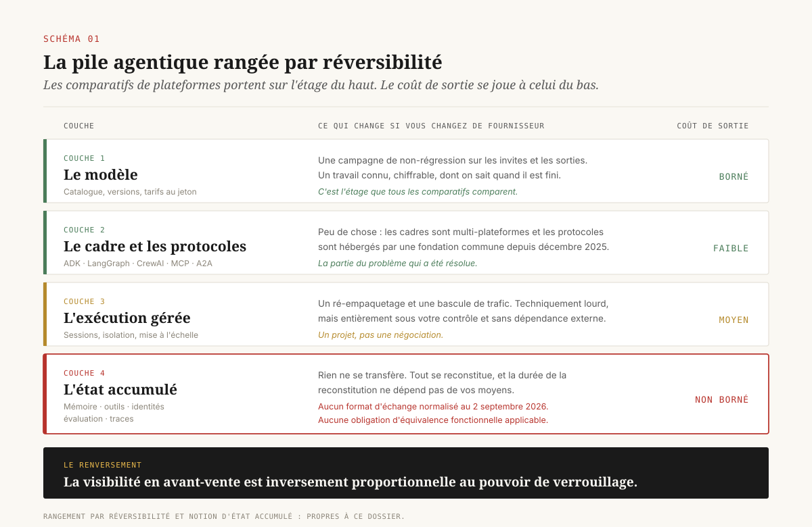
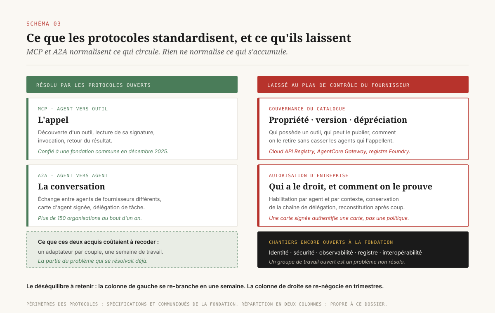
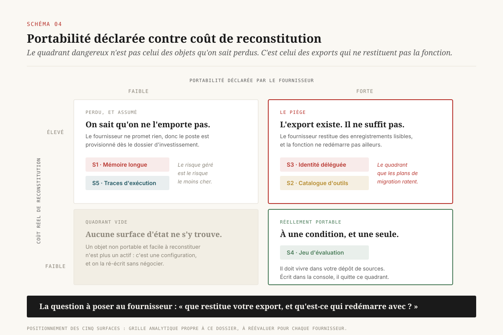
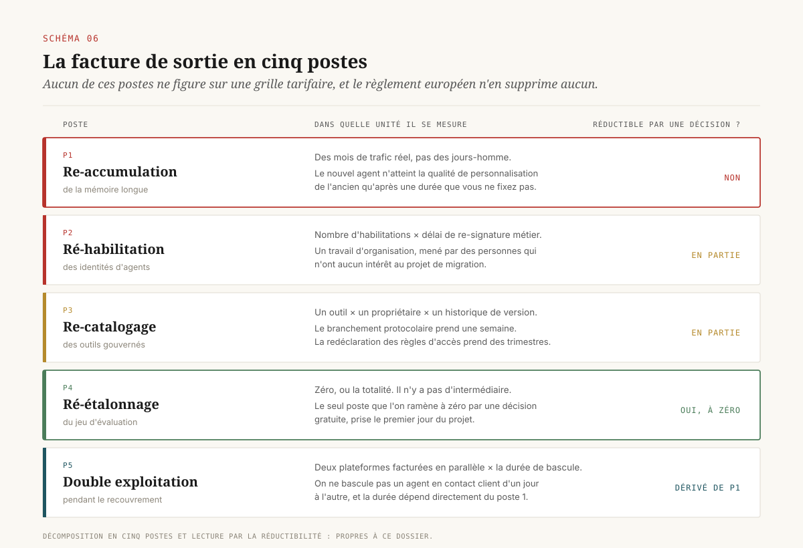
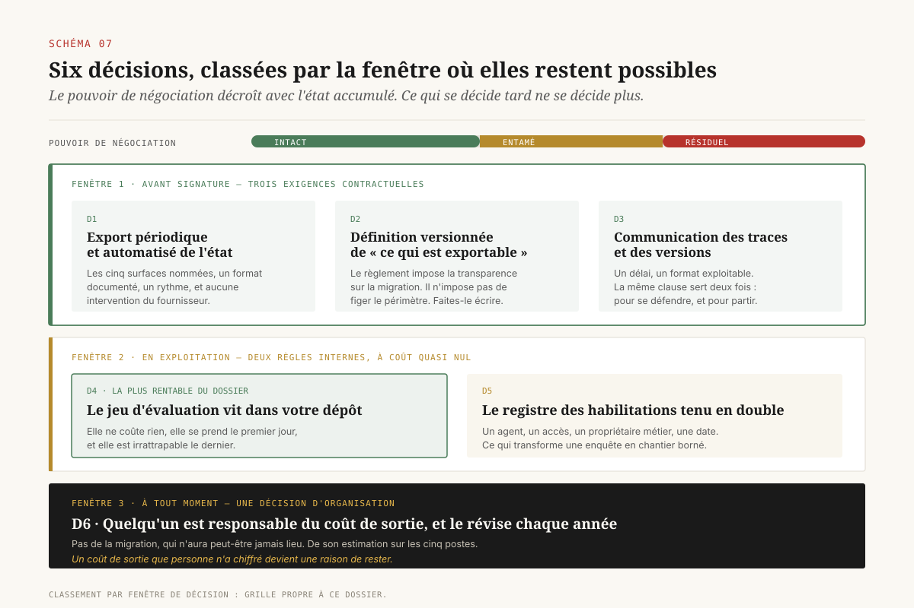

# Le verrou n'est pas le modèle

> **Choisir une plateforme agentique d'entreprise, ce n'est pas choisir un fournisseur de modèles : c'est désigner le propriétaire de l'état de ses agents.** — 2 septembre 2026, Mathieu Guglielmino

Les comparatifs de plateformes agentiques d'entreprise se ressemblent tous. Ils alignent Vertex AI Agent Engine, Amazon Bedrock AgentCore, Microsoft Foundry Agent Service, Databricks, Snowflake et Salesforce sur une même grille, et cette grille compte des modèles disponibles, des connecteurs, des régions de déploiement, des certifications. Un directeur data qui arbitre sur cette base croit choisir entre des capacités. Il choisit en réalité autre chose, et il ne le découvrira qu'au moment où il voudra partir.

Ce dossier propose un autre critère de lecture. Une plateforme agentique ne se juge pas sur ce qu'elle sait faire, mais sur ce qu'elle **accumule** pour votre compte et que vous ne pourrez pas emporter. Cette masse a un nom simple : l'**état**. La mémoire longue des agents, le catalogue d'outils gouverné, les identités déléguées, le jeu d'évaluation, les traces d'exécution. Aucune de ces cinq surfaces n'a de format d'échange normalisé en septembre 2026, et la réglementation européenne la plus favorable au changement de fournisseur s'arrête, par construction, juste avant elles.

## 1. Le mauvais critère

La couche modèle est la plus visible de la pile agentique, et c'est aussi la seule qui soit réellement interchangeable. Les trois grands fournisseurs de nuage distribuent tous des modèles qu'ils n'ont pas entraînés, et un agent bâti sur un modèle donné peut, en pratique, basculer sur un autre au prix d'une campagne de non-régression. Ce coût n'est pas nul, il a été traité ailleurs[^1], mais il est **borné** : on sait ce qu'on teste, on sait quand on a fini.

Un comparatif organisé autour du catalogue de modèles compare donc les fournisseurs sur l'étage où ils se différencient le moins et où le coût de sortie est le mieux connu. ==Le tableau de comparaison porte sur la seule couche de la pile qui ne verrouille pas.==

Cette inversion n'est pas un accident de méthode. Elle vient du fait que les couches supérieures sont **démontrables** en avant-vente, alors que les couches inférieures ne deviennent visibles qu'en exploitation. On peut faire la démonstration d'un modèle en dix minutes. On ne peut pas faire la démonstration de dix-huit mois de mémoire accumulée, de quatre-vingts outils publiés au catalogue interne, de deux cents habilitations d'agents dans l'annuaire, ni d'un jeu d'évaluation qui a fini par contenir toutes les régressions déjà rencontrées. Ces objets n'existent pas au moment où l'on signe. Ils existent au moment où l'on voudrait partir.

Databricks a donné en juin 2026 le chiffre qui résume ce déséquilibre. Présentant Agent Bricks au Data + AI Summit, l'éditeur indique que la boucle d'agent proprement dite représente environ **1 % du travail**, et que les 99 % restants sont la dette technique cachée des systèmes agentiques : capacité en jetons, déploiement, sécurité, évaluation, surveillance, contexte, partage[^2]. Le chiffre est produit par un fournisseur, il faut le lire pour sa forme plutôt que pour sa valeur. Sa forme suffit : ==les protocoles ouverts ont standardisé le 1 %.==

## 2. Ce que l'agent accumule

Un agent en production produit cinq objets persistants que son exploitant n'avait pas au démarrage, et qui n'existent que parce qu'il a tourné.

**La mémoire longue.** Ce que l'agent retient d'une session à l'autre, distillé à partir de l'historique de conversation. Google le commercialise sous le nom de Memory Bank, adossé à Agent Engine, disponible en version générale et utilisable depuis d'autres cadres logiciels que le sien[^3]. AWS le commercialise dans AgentCore, avec une facturation à l'enregistrement créé et à l'enregistrement récupéré[^4]. Microsoft le rattache aux fils de conversation de Foundry Agent Service.

**Le catalogue d'outils gouverné.** L'inventaire des actions que les agents ont le droit d'appeler, avec ses propriétaires, ses versions, ses habilitations. Google l'a formalisé en décembre 2025 avec le Cloud API Registry, un registre privé où les administrateurs approuvent les outils au niveau de l'organisation, alimenté par Apigee et exposé aux développeurs par un objet `ApiRegistry` dans le kit de développement d'agents[^5]. AWS l'expose comme AgentCore Gateway, facturé aux opérations et aux outils indexés pour la recherche sémantique[^4].

**L'identité déléguée.** Le compte au nom duquel l'agent agit, ses jetons, sa chaîne de délégation. Microsoft en a fait un type d'objet d'annuaire à part entière, Entra Agent ID, disponible en version générale depuis avril 2026, avec un annuaire unifié couvrant les agents créés dans Copilot Studio comme dans Foundry[^6][^7].

**Le jeu d'évaluation.** L'ensemble des cas de test qui disent si l'agent fait encore ce qu'on attend de lui. Il se construit par sédimentation, chaque incident y ajoutant un cas.

**Les traces d'exécution.** Le journal de ce que l'agent a fait, avec quels outils, dans quel ordre. Ce corpus est la matière première de toute analyse de coût, de toute défense juridique[^8] et de tout diagnostic de régression.

Ces cinq surfaces partagent trois propriétés. Elles n'existent qu'après la mise en production. Elles grossissent avec le temps sans que personne ne décide de leur croissance. Et elles sont, à des degrés divers, tenues par le fournisseur dans des structures qu'il n'a jamais promis de rendre lisibles ailleurs.

## 3. Surface 1 · La mémoire longue

La mémoire d'un agent conversationnel n'est pas un fichier. C'est le produit d'un traitement propriétaire appliqué à l'historique : extraction, consolidation, résolution de contradictions, oubli. Deux plateformes qui offrent « une mémoire longue » n'implémentent pas la même chose, ne stockent pas les mêmes objets, et n'exposent pas les mêmes points d'entrée.

La conséquence pratique se formule mal en termes de portabilité de données, parce que la question n'est pas là. Supposons même un export intégral, dans un format lisible, de tous les enregistrements de mémoire d'une plateforme A. Ces enregistrements ont été produits par la politique d'extraction de A. Les injecter dans B ne reconstitue pas le comportement de l'agent chez B, parce que B les récupérera selon sa propre politique de pertinence et les distillera selon la sienne.

==Le coût de sortie d'une mémoire longue n'est pas un coût de transfert. C'est un coût de **re-accumulation**.== Et la durée de cette re-accumulation n'est pas décidée par vous : elle est décidée par le rythme auquel vos utilisateurs interagissent avec l'agent. Une plateforme qui héberge dix-huit mois de mémoire d'un agent de support client vous impose, pour en sortir, dix-huit mois de trafic équivalent avant que le nouvel agent atteigne la même qualité de personnalisation.

Un signal permet de mesurer cette dépendance sans attendre : **la granularité de la facturation**. AgentCore facture séparément l'écriture d'événements à court terme, l'extraction de mémoire longue et la récupération[^4]. Cette décomposition est une information de première main sur ce que le fournisseur considère comme des opérations distinctes, donc sur ce qu'il détient. Un poste de facturation dédié est la preuve qu'un service tourne, et un service qui tourne est un service dont vous ne possédez pas le résultat.

## 4. Surface 2 · Le catalogue d'outils

Le protocole MCP a résolu un vrai problème. Avant lui, chaque cadre logiciel définissait sa propre convention d'appel d'outil, et brancher un agent sur un système d'information revenait à écrire un adaptateur par couple. MCP est devenu l'interface commune agent-vers-outil, et son adoption a effectivement réduit le coût d'intégration. Il a été donné à une fondation en décembre 2025, rejoint par A2A en août 2026[^9][^10].

Il faut mesurer précisément ce que cela règle. MCP normalise **l'appel** : la manière dont un agent découvre un outil, lit sa signature, l'invoque et reçoit un résultat. A2A normalise la **conversation entre agents** de fournisseurs différents. Ces deux acquis sont réels et ils ont un an d'existence à peine.

Ce qu'aucun des deux ne normalise se laisse énumérer sans ambiguïté :

- **Qui possède un outil** dans l'organisation, et qui peut le publier.
- **Comment on le versionne** et comment on le déprécie sans casser les agents qui l'appellent.
- **Quel agent a le droit de l'appeler**, dans quel contexte et avec quelles limites.
- **Comment on prouve après coup** quel agent l'a appelé et pour le compte de qui.

Ces quatre questions sont exactement celles d'un catalogue d'outils d'entreprise, et chaque fournisseur y répond dans son propre plan de contrôle. Le Cloud API Registry est un objet Google Cloud[^5]. AgentCore Gateway est un objet AWS. Le registre d'outils de Foundry est un objet Azure. Les trois parlent MCP sur le fil, et aucun ne parle le même langage sur la gouvernance.

Une organisation qui a publié quatre-vingts outils internes n'a donc pas quatre-vingts fichiers à déplacer. Elle a quatre-vingts déclarations d'appartenance, quatre-vingts historiques de version et un graphe d'habilitations qui n'existe que dans la console de son fournisseur. La partie standardisée du problème est celle qui se recodait en une semaine. La partie qui prend des mois est restée propriétaire.

La feuille de route publique de A2A confirme ce diagnostic plutôt qu'elle ne le dément : au bout d'un an, avec plus de 150 organisations participantes et une intégration dans les plateformes des trois grands fournisseurs, les chantiers encore ouverts portent sur la spécification d'interopérabilité, la consolidation du registre, les tests et les bonnes pratiques de sécurité[^9]. La fondation qui héberge les deux protocoles compte des groupes de travail sur l'identité, la sécurité et l'observabilité[^10]. Un groupe de travail ouvert est un problème non résolu.

## 5. Surface 3 · L'identité déléguée

C'est la surface la plus coûteuse à reconstituer, et la plus rarement examinée au moment du choix.

Un agent en production détient des accès. Il lit une base, écrit dans un outil de gestion de la relation client, déclenche un flux, appelle une interface de programmation de partenaire. Chacun de ces accès repose sur une décision d'habilitation prise par quelqu'un, à un moment, pour un motif. L'ensemble forme un graphe qui n'a pas été conçu : il s'est constitué par ajouts successifs.

Microsoft a formalisé cet objet en faisant de l'identité d'agent un type d'identité spécialisé dans Entra ID, doté de son propre cycle de vie de gouvernance, et en donnant aux équipes de sécurité un annuaire unifié des agents créés sur ses différentes surfaces[^6][^7]. C'est une avancée réelle de gouvernance, et c'est simultanément le verrou le plus dur du marché : ==une identité d'agent est un objet d'annuaire, et un annuaire ne s'exporte pas, il se reconstruit.==

AWS répond au même besoin avec AgentCore Identity, présenté comme un service de courtage d'identité doté d'un coffre pour les jetons de rafraîchissement et d'une autorisation sensible à l'identité[^4][^11]. Google adosse la question à la gestion des identités et des accès de sa propre plateforme.

Sortir d'une plateforme, du point de vue de l'identité, veut dire recréer chaque agent comme sujet dans un annuaire différent, retrouver pour chacun la liste de ce à quoi il avait droit, faire re-signer chaque habilitation par son propriétaire métier, et ré-établir les consentements délégués auprès de chaque système tiers. Ce travail n'est pas technique. Il est **organisationnel**, il mobilise des personnes qui n'ont aucun intérêt au projet de migration, et sa durée dépend de leur disponibilité.

Un dossier antérieur a montré pourquoi la chaîne de délégation est aussi une pièce de dossier au sens juridique : quand un agent engage l'entreprise, l'incapacité à reconstituer pour le compte de qui il a agi se retourne contre le déployeur[^8]. La conséquence pour le sujet présent est directe. Cette chaîne doit être conservée d'une manière que vous pouvez produire vous-même, indépendamment du fournisseur qui la génère.

## 6. Surfaces 4 et 5 · L'évaluation et les traces

Ces deux surfaces se traitent ensemble parce qu'elles se comportent en miroir.

**Le jeu d'évaluation est le seul actif de la liste qui soit réellement portable**, et il l'est à une condition unique : avoir été écrit hors plateforme. Un jeu de cas de test est un fichier de paires entrée / comportement attendu. Rien n'y est propriétaire tant qu'on ne l'a pas rédigé dans le formalisme d'un outil d'évaluation intégré. La tentation est forte de le faire, parce que l'outil intégré est gratuit à l'usage et déjà branché sur les traces. Le prix de cette gratuité est que le jeu devient un objet de la plateforme.

Il vaut donc la règle la plus rentable du dossier, et elle ne coûte rien : ==le jeu d'évaluation s'écrit dans un dépôt qui vous appartient, et la plateforme ne fait que l'exécuter.== Un fichier de cas de test versionné dans votre propre système de gestion de sources reste exécutable partout. Le même contenu saisi dans la console du fournisseur ne l'est nulle part ailleurs.

**Les traces d'exécution sont le cas inverse.** Elles ont une grammaire commune émergente, les conventions sémantiques d'OpenTelemetry pour l'IA générative, mais cette grammaire reste expérimentale sur la partie agent et n'émet aucun attribut de coût en monnaie[^12]. Surtout, les traces sont volumineuses, leur durée de conservation est un paramètre de facturation, et elles sont produites par l'exécution du fournisseur. Une organisation qui change de plateforme perd la continuité de sa série historique au moment exact où elle en aurait le plus besoin, puisque c'est cette série qui permettrait de comparer l'avant et l'après.

La matrice qui en résulte est la vraie grille de lecture d'un comparatif. Elle croise deux axes que les tableaux de fonctionnalités confondent : ce que le fournisseur **déclare** exportable, et ce que la reconstitution **coûte** réellement. Le quadrant dangereux n'est pas celui des objets déclarés non exportables, qu'on aura provisionnés. C'est celui des objets déclarés exportables dont l'export ne restitue pas la fonction.

## 7. Ce que le droit couvre, et où il s'arrête

Le règlement européen sur les données contient le dispositif le plus ambitieux jamais adopté contre l'enfermement propriétaire dans le nuage. Son chapitre VI, articles 23 à 31, interdit aux fournisseurs de services de traitement de données d'ériger des obstacles de nature précommerciale, commerciale, technique, contractuelle ou organisationnelle au changement de fournisseur, impose des clauses contractuelles minimales, et organise la disparition progressive des frais de sortie[^13].

Le calendrier est le suivant. Depuis le 12 septembre 2025, transparence intégrale sur les coûts de migration. Depuis le 12 janvier 2026, interdiction des pénalités de sortie et réduction des frais de migration au strict nécessaire. À compter du **12 janvier 2027**, la sortie devient entièrement gratuite, contrats en cours compris[^13][^14].

Une direction data qui lit ce calendrier peut légitimement conclure que le sujet de l'enfermement se referme de lui-même. C'est là que le texte demande à être lu de près.

L'article 30 distingue deux régimes selon le type de service. Pour les services d'**infrastructure**, le fournisseur d'origine doit prendre les mesures nécessaires pour permettre l'**équivalence fonctionnelle**, définie comme le rétablissement, sur la base des données et actifs numériques exportables du client, d'un niveau minimal de fonctionnalité dans l'environnement du nouveau fournisseur[^13][^14]. C'est une obligation de résultat sur la fonction, pas seulement sur la donnée.

Pour tous les **autres** services, plateforme applicative et logiciel en tant que service, l'obligation est différente et nettement plus légère : mettre à disposition, gratuitement, des interfaces ouvertes destinées à faciliter le processus de changement. Le texte le dit sans détour : le règlement ne crée pas d'obligation de faciliter l'équivalence fonctionnelle pour les fournisseurs autres que ceux du modèle d'infrastructure[^14].

Or une plateforme agentique gérée relève de la plateforme applicative, quand elle ne relève pas du logiciel en tant que service. Agent Engine, AgentCore, Foundry Agent Service et Agentforce sont vendus comme des services gérés dont le client ne pilote ni l'exécution, ni le stockage sous-jacent, ni les traitements de distillation de mémoire.

==La garantie la plus forte du droit européen sur la portabilité s'arrête exactement à l'étage où commence la pile agentique.== Au 12 janvier 2027, une entreprise européenne pourra sortir d'une plateforme d'agents sans payer de frais de sortie, et récupérera ses données exportables par une interface ouverte et gratuite. Elle n'aura aucun droit opposable à ce que le résultat soit fonctionnel chez le fournisseur suivant.

Cette lecture appelle deux réserves de méthode. La qualification d'un service donné au regard des catégories du règlement relève de l'analyse juridique au cas par cas, et une plateforme agentique fortement paramétrable pourrait plaider une autre qualification. Par ailleurs, les interfaces ouvertes de l'article 30 §2 sont une obligation réelle, dont la portée effective dépendra de la pratique des autorités nationales. Le point tenu ici est plus étroit et plus solide : **la sortie gratuite et la sortie exécutable sont deux obligations différentes, et le calendrier de 2027 ne porte que sur la première.**

## 8. La facture de sortie, et comment on la fait baisser avant de signer

Réunir ce qui précède donne une facture de sortie en cinq postes, dont aucun ne figure sur une grille tarifaire.

1. **Re-accumulation de la mémoire.** Mesurée en mois de trafic réel, pas en jours-homme. Le seul poste dont la durée ne dépend pas de vos moyens.
2. **Ré-habilitation des identités.** Mesurée en nombre d'habilitations × délai moyen de re-signature par un propriétaire métier. Le poste que les plans de migration sous-estiment le plus systématiquement.
3. **Re-catalogage des outils.** Redéclaration des propriétaires, des versions et des règles d'accès dans un autre plan de contrôle. La partie protocolaire est rapide, la partie gouvernance ne l'est pas.
4. **Ré-étalonnage de l'évaluation.** Nul si le jeu vit chez vous. Considérable s'il vit dans la console.
5. **Double exploitation.** Le coût de faire tourner les deux plateformes en parallèle pendant la période de recouvrement, parce qu'on ne bascule pas un agent en contact client d'un jour à l'autre.

La fenêtre pendant laquelle ces postes sont négociables est étroite, et elle se referme. Gartner anticipe que 40 % des applications d'entreprise embarqueront des agents spécialisés d'ici fin 2026, contre moins de 5 % en 2025[^15]. Une organisation qui n'a pas encore accumulé d'état négocie librement. Une organisation qui en a accumulé dix-huit mois négocie sous contrainte, et son fournisseur le sait.

Six décisions, classées par la fenêtre où elles restent disponibles.

**Avant signature — trois exigences contractuelles.**

*Un droit d'export périodique et automatisé de l'état, pas seulement des données.* La clause doit nommer les cinq surfaces, imposer un format documenté et un rythme, et prévoir que l'export s'exécute sans intervention du fournisseur. Un export sur demande est un export qui n'aura pas lieu au moment de la rupture.

*Une définition contractuelle de ce qui est exportable, opposable et versionnée.* Le règlement européen impose des clauses minimales et la transparence sur la migration[^13]. Il n'impose pas au fournisseur de figer sa définition de l'exportable. Faites-le figurer.

*Une clause de communication des traces et des versions*, dans un délai et un format exploitables. Elle relève du même besoin probatoire que celui déjà identifié en matière de responsabilité[^8], et elle sert deux fois : pour se défendre, et pour partir.

**En exploitation — deux règles internes, à coût quasi nul.**

*Le jeu d'évaluation vit dans votre dépôt.* C'est la décision la plus rentable du dossier parce qu'elle ne coûte rien, qu'elle se prend le premier jour et qu'elle est irrattrapable le dernier.

*Le registre des habilitations d'agents est tenu en double, hors de l'annuaire du fournisseur.* Une ligne par agent, par accès, par propriétaire métier et par date de validation. Cette liste est votre seul moyen de convertir une migration d'identités en un chantier borné plutôt qu'en une enquête.

**À tout moment — une décision d'organisation.**

*Quelqu'un est responsable du coût de sortie.* Pas de la migration, qui n'aura peut-être jamais lieu, mais de son estimation, révisée chaque année sur les cinq postes ci-dessus. Sans ce propriétaire, la facture de sortie n'apparaît qu'au moment où il est trop tard pour la faire baisser, et elle sert alors d'argument pour ne pas partir. Le verrou complet est là : ==un coût de sortie que personne n'a chiffré devient une raison de rester, et cette raison est la seule que le fournisseur n'a pas eu besoin d'écrire au contrat.==

## Note de méthode

Les vérifications de ce dossier se sont heurtées à la politique d'accès réseau de l'environnement de rédaction : les domaines `aws.amazon.com`, `learn.microsoft.com`, `docs.cloud.google.com`, `eur-lex.europa.eu`, `linuxfoundation.org` et plusieurs publications de cabinets juridiques ont retourné un refus d'accès. Les éléments qui en proviennent sont cités **en substance**, recoupés sur au moins deux formulations indépendantes, et donnés comme ordres de grandeur. Les montants de facturation, les dates de disponibilité générale et les libellés d'articles du règlement doivent être revérifiés à la source avant toute réutilisation contractuelle.

Deux réserves supplémentaires. Les chiffres d'adoption et de volume communiqués par les éditeurs sont **annoncés** et non audités : ils sont utilisés ici pour leur forme, jamais pour leur valeur. Et la qualification juridique d'une plateforme agentique au regard des catégories du chapitre VI n'a, à la connaissance de l'auteur, fait l'objet d'aucune décision ni d'aucune orientation publiée à ce jour ; le raisonnement de la section 7 est une lecture, à confirmer par un praticien.

## Sources

[^1]: Mathieu Guglielmino, « La facture d'un agent » (26 août 2026), section sur la péremption des modèles et le coût de re-qualification. https://mathieugug.github.io/facture-agent/

[^2]: Databricks, *Agent Bricks: Data + AI Summit 2026* (juin 2026) : plus de 100 000 agents construits, la boucle d'agent représentant environ 1 % du travail, les 99 % restants relevant de la gouvernance des données, de l'ancrage métier, de l'évaluation et du contrôle du coût. https://www.databricks.com/blog/agent-bricks-dais-2026

[^3]: Google Cloud, *Vertex AI Memory Bank in public preview* puis passage en disponibilité générale des sessions et de la mémoire longue d'Agent Engine. https://cloud.google.com/blog/products/ai-machine-learning/vertex-ai-memory-bank-in-public-preview

[^4]: Amazon Web Services, *Amazon Bedrock AgentCore pricing* : facturation indépendante des composants Runtime, Gateway, Memory, Identity, Observability, Evaluations, Policy, Browser et Code Interpreter. https://aws.amazon.com/bedrock/agentcore/pricing/

[^5]: Google Cloud, *New Enhanced Tool Governance in Vertex AI Agent Builder* (19 décembre 2025) : Cloud API Registry comme registre privé d'outils approuvés, passerelle Apigee et objet `ApiRegistry` dans le kit de développement d'agents. https://cloud.google.com/blog/products/ai-machine-learning/new-enhanced-tool-governance-in-vertex-ai-agent-builder

[^6]: Microsoft, *Announcing Microsoft Entra Agent ID: Secure and manage your AI agents* : annuaire unifié des identités d'agents créées dans Copilot Studio et Azure AI Foundry. https://techcommunity.microsoft.com/blog/microsoft-entra-blog/announcing-microsoft-entra-agent-id-secure-and-manage-your-ai-agents/3827392

[^7]: Microsoft Learn, *Agent identity concepts in Microsoft Foundry* : l'identité d'agent comme type d'identité spécialisé dans Entra ID, avec son cadre d'authentification et d'autorisation. https://learn.microsoft.com/en-us/azure/foundry/agents/concepts/agent-identity

[^8]: Mathieu Guglielmino, « Quand un agent engage l'entreprise » (7 août 2026), sur le dossier de preuve en sept postes et la clause de communication fournisseur. https://mathieugug.github.io/agent-engage-entreprise/

[^9]: Linux Foundation, *A2A Protocol Surpasses 150 Organizations, Lands in Major Cloud Platforms, and Sees Enterprise Production Use in First Year* (9 avril 2026) : feuille de route encore ouverte sur la spécification d'interopérabilité, le registre et la sécurité. https://www.linuxfoundation.org/press/a2a-protocol-surpasses-150-organizations-lands-in-major-cloud-platforms-and-sees-enterprise-production-use-in-first-year

[^10]: Janakiram MSV, *Agent2Agent Joins The Agentic AI Foundation Alongside MCP*, Forbes (19 août 2026) : A2A rejoint le 17 août 2026 la fondation lancée en décembre 2025 avec MCP ; groupes de travail ouverts sur l'identité, la sécurité et l'observabilité. https://www.forbes.com/sites/janakirammsv/2026/08/19/agent2agent-joins-the-agentic-ai-foundation-alongside-mcp/

[^11]: Amazon Web Services, *Amazon Bedrock AgentCore is now generally available* (13 octobre 2025) : couverture du cycle de vie complet d'un agent en production, dont l'isolation de session, la mémoire, la connexion d'outils et le courtage d'identité. https://aws.amazon.com/about-aws/whats-new/2025/10/amazon-bedrock-agentcore-available

[^12]: Mathieu Guglielmino, « L'observabilité des agents » et « OpenTelemetry GenAI », sur le caractère encore expérimental des conventions sémantiques côté agent et l'absence d'attribut de coût en monnaie. https://mathieugug.github.io/otel-genai-semconv/

[^13]: Hogan Lovells, *EU Data Act Series (part 7): Easy switching between data processing services (SaaS, IaaS, PaaS)* : présentation du chapitre VI, des clauses contractuelles minimales et du calendrier de suppression des frais de changement. https://www.hoganlovells.com/en/publications/eu-data-act-series-part-7-easy-switching-between-data-processing-services-saas-iaas-paas

[^14]: Deloitte Legal, *Cloud switching under the EU Data Act* : distinction de l'article 30 entre équivalence fonctionnelle pour l'infrastructure et interfaces ouvertes pour les autres services, et définition de l'équivalence fonctionnelle. https://www.deloittelegal.de/dl/en/services/legal/perspectives/cloud-switching-eu-data-act.html

[^15]: Gartner, *Gartner Predicts 40% of Enterprise Apps Will Feature Task-Specific AI Agents by 2026, Up from Less Than 5% in 2025* (26 août 2025). https://www.gartner.com/en/newsroom/press-releases/2025-08-26-gartner-predicts-40-percent-of-enterprise-apps-will-feature-task-specific-ai-agents-by-2026-up-from-less-than-5-percent-in-2025

---

*Format co-écrit avec l'aide d'une IA.*
