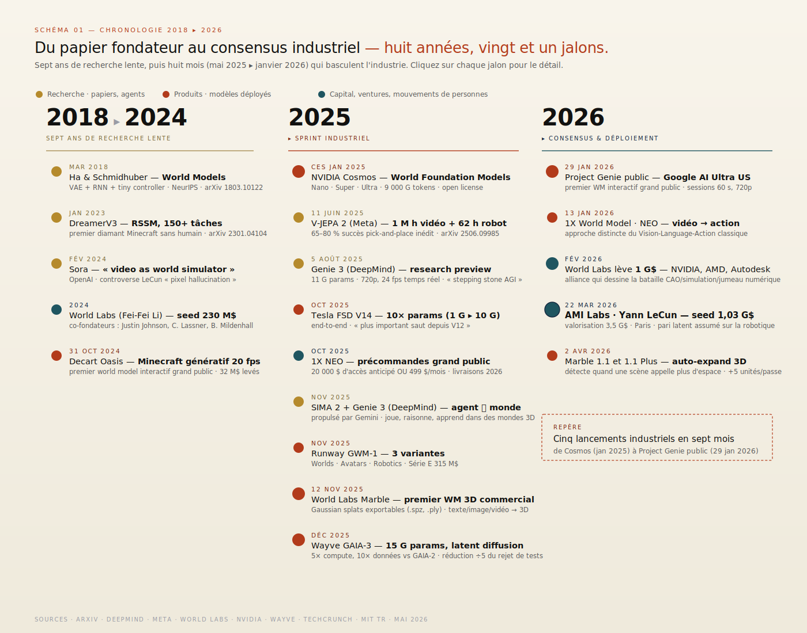
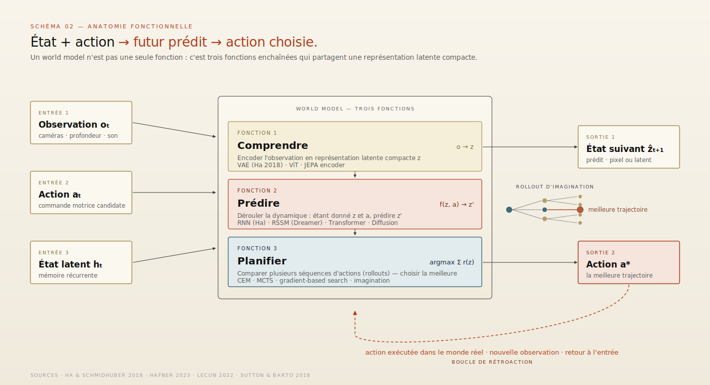
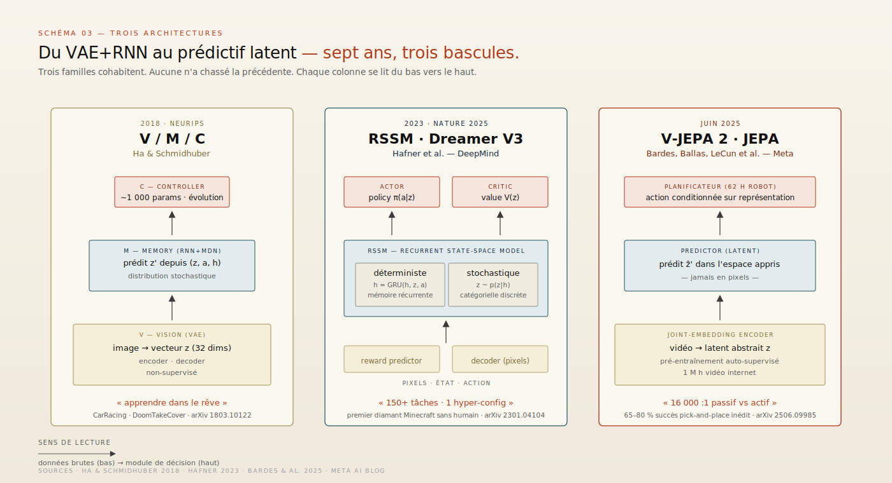
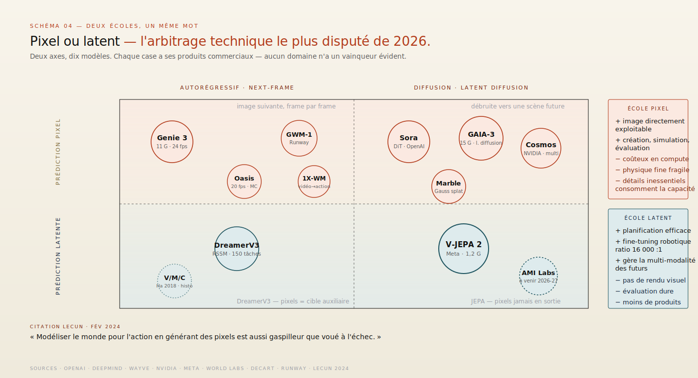
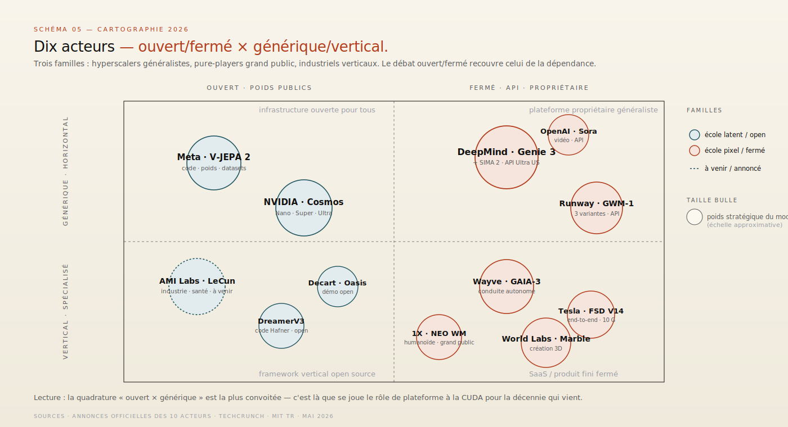
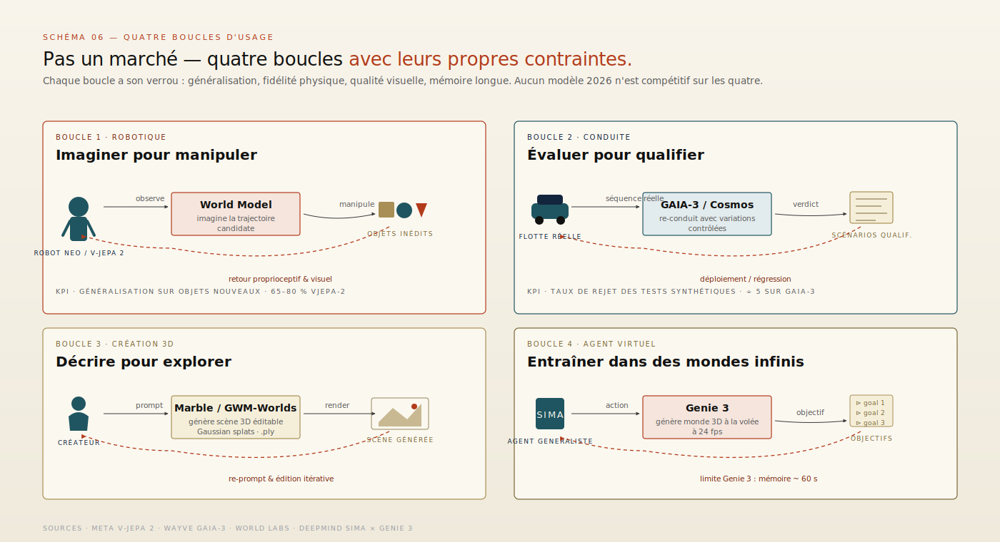
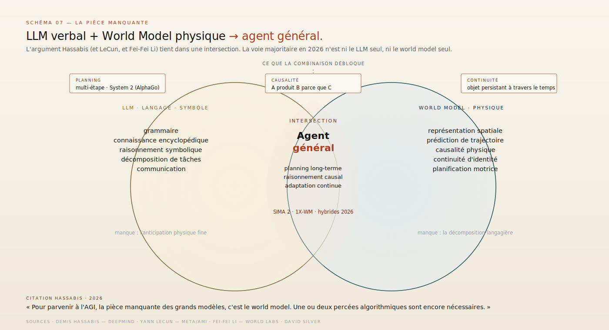
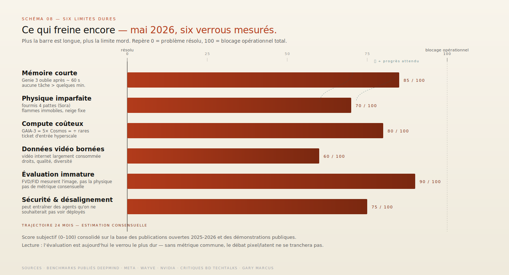
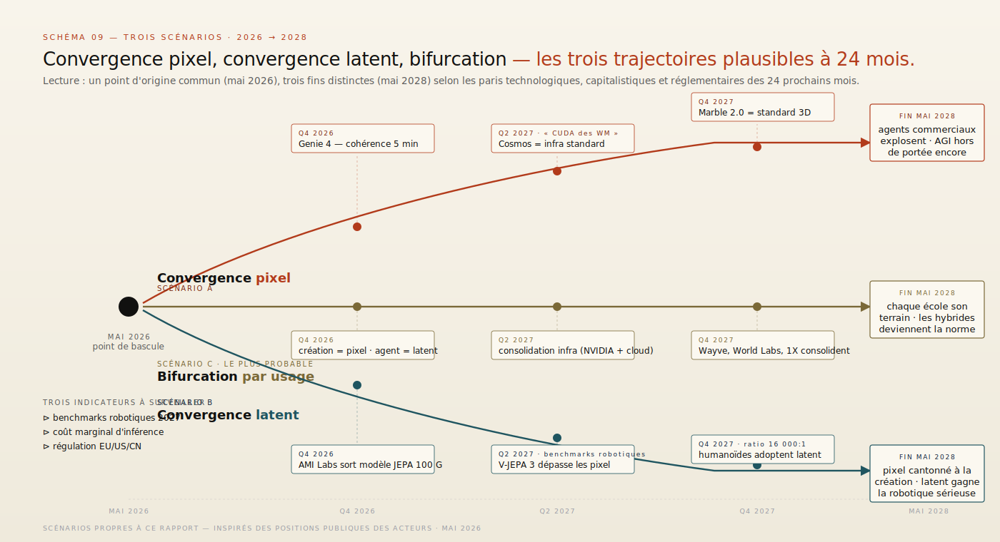

# World models — comprendre les enjeux

> **Le pari que la prochaine marche de l'IA ne viendra plus du langage, mais d'une physique apprise.** — 5 mai 2026, Mathieu Guglielmino

> *Format co-écrit avec l'aide d'une IA.*

---

## 1. L'instant world models

En douze mois, le terme *world model* est passé d'un mot-clé de chercheurs à un mot d'ordre stratégique. Cinq lancements industriels marquent la bascule : Genie 3 chez DeepMind (août 2025), V-JEPA 2 chez Meta (juin 2025), Marble chez World Labs (novembre 2025), GAIA-3 chez Wayve (décembre 2025), et la version publique de Project Genie pour les abonnés Google AI Ultra (janvier 2026)[^1] [^2] [^3] [^4] [^5]. ==Sur la même période, Yann LeCun quitte Meta pour fonder AMI Labs à Paris, levée seed de 1,03 milliard de dollars à une valorisation de 3,5 milliards, exclusivement focalisée sur les world models pour la robotique et l'industrie.==[^6]

Le déclencheur n'est pas une percée scientifique unique. C'est plutôt la convergence de trois constats. Premier constat : les LLM, malgré leur progression continue, butent sur les tâches qui demandent d'anticiper les conséquences d'une action dans le monde physique — fait reconnu publiquement par Demis Hassabis qui qualifie le world model de « pièce manquante » sur la route de l'AGI[^7]. Deuxième constat : la robotique humanoïde est en train de devenir un marché vrai, avec 1X NEO en précommande grand public depuis octobre 2025 (20 000 dollars d'accès anticipé ou 499 dollars par mois en abonnement)[^8] [^9], et il faut un substrat d'apprentissage qui ne soit pas seulement du langage. Troisième constat : la conduite autonome a quitté le règne des règles écrites pour celui de l'apprentissage de bout en bout — Tesla a remplacé 300 000 lignes de code de planification par un seul réseau neuronal en 2024 avec FSD V12, puis a poussé ce modèle à environ 10 milliards de paramètres en V14 fin 2025[^10] [^11].

Pour comprendre ce qui se joue, il faut clarifier quatre choses : ce qu'est un world model (et ce qu'il n'est pas) ; pourquoi deux écoles techniques s'opposent en 2026 ; qui sont les acteurs et où ils se positionnent ; et ce qui distingue un usage marketing du terme d'un usage scientifique sérieux. Ce rapport prend le temps de faire les quatre.

*Schéma 1 — Frise éditoriale. Vingt-deux jalons depuis l'article fondateur de Ha &amp; Schmidhuber (mars 2018) jusqu'à AMI Labs et Marble 1.1+ (printemps 2026), répartis sur trois pistes.*

---

## 2. Définition opérationnelle

### Un objet technique précis

Un world model est, dans sa définition la plus serrée, ==une fonction apprise qui prend en entrée l'état du monde et une action, et prédit l'état suivant==. Formellement : `f(état_t, action_t) → état_{t+1}`. Cette définition vient de la tradition du reinforcement learning fondé sur des modèles (model-based RL), où le terme circule depuis les années 1990 — mais c'est l'article *World Models* de David Ha et Jürgen Schmidhuber, publié à NeurIPS 2018, qui en a fait un objet d'étude grand public dans le deep learning[^12].

Cette définition simple cache trois usages distincts qu'il est essentiel de séparer. ==Premier usage : comprendre.== Le world model condense l'expérience visuelle (et parfois multimodale) en une représentation latente compacte qui retient ce qui importe pour prédire la suite. C'est l'usage de l'image comme moyen, pas comme finalité. ==Deuxième usage : prédire.== Étant donné un état présent et une action envisagée, le modèle déroule un futur — un seul, ou un échantillon de futurs probables. ==Troisième usage : planifier.== L'agent se sert du modèle comme d'un simulateur interne pour évaluer plusieurs séquences d'actions avant d'agir dans le monde réel — ce que Ha et Schmidhuber appelaient « apprendre en rêvant ».

*Schéma 2 — Anatomie fonctionnelle. Trois entrées (observation, action candidate, état latent) → trois fonctions (comprendre / prédire / planifier) → deux sorties (état suivant, action choisie). Boucle de rétroaction par le monde réel.*

### Ce qui le distingue d'un LLM

Un LLM génère le mot suivant ; un world model génère l'état suivant. La différence n'est pas qu'esthétique. Le LLM se déploie dans un espace symbolique discret (des tokens), où la grammaire et la sémantique fournissent des contraintes fortes ; le world model travaille dans un espace continu, à très haute dimension, où les contraintes sont physiques (gravité, cohérence d'objet, persistance temporelle) et beaucoup plus difficiles à apprendre depuis les seules données.

Cette différence explique trois faits empiriques observés en 2025-2026. D'abord, ==les LLM tombent en panne dès qu'on leur demande de raisonner sur des trajectoires physiques== : un GPT-class peut décrire un verre qui se renverse mais peine à anticiper exactement où la flaque s'étalera. Ensuite, les world models actuels — y compris les meilleurs — restent fragiles sur les détails physiques fins : le rapport technique de Genie 3 reconnaît que ses environnements n'ont qu'une mémoire d'environ une minute, et les vidéos de Sora ont été publiquement épinglées pour leurs fourmis à quatre pattes et leurs flammes immobiles[^13] [^14]. Enfin, ces deux familles peuvent être combinées — c'est le sens de l'architecture *language-conditioned world model*, où un LLM pilote la planification au-dessus d'un substrat physique appris.

### La fonction de planification : pourquoi c'est l'enjeu

Si le world model n'était qu'un générateur de vidéos, son intérêt resterait artistique. Sa promesse réelle est ailleurs : ==permettre à un agent de tester ses actions dans un simulateur interne avant d'agir==, et donc d'apprendre vite, sûrement, sans casser de matériel coûteux. C'est exactement ce que fait Tesla en interne avec ses « shadow trajectories » sur la flotte, ce que vise Wayve avec GAIA-3 (re-conduire une scène réelle avec des variations contrôlées pour évaluer la politique de conduite)[^15], ce que vise NVIDIA avec Cosmos pour les robots, et ce que vise 1X avec son world model qui génère « ce qui devrait arriver » avant de le convertir en commandes motrices[^9].

Ce schéma — *prédire pour mieux agir* — est la raison pour laquelle le sujet quitte les laboratoires. Il ne s'agit pas d'inventer un nouveau format de divertissement. Il s'agit de fournir à des systèmes physiques un substrat d'apprentissage qui réduise le coût d'erreur d'un facteur dix, cent ou mille.

---

## 3. Histoire courte : trois architectures

L'histoire utile se lit en trois architectures successives. Aucune n'a invalidé la précédente — elles cohabitent en 2026 dans des produits différents.

### Première architecture : V/M/C (Ha & Schmidhuber, 2018)

L'article fondateur découpe l'agent en trois composants[^12]. Une partie *Vision* (V), implémentée comme un *Variational Autoencoder*, compresse chaque image en un vecteur latent z de petite dimension (quelques dizaines à quelques centaines de coordonnées). Une partie *Memory* (M), implémentée comme un *Recurrent Neural Network* avec un *Mixture Density Network* en sortie, prédit la distribution probabiliste de z_{t+1} étant donné z_t, l'action a_t et l'état caché h_t. Une partie *Controller* (C) très petite — souvent quelques milliers de paramètres seulement — choisit l'action à partir de z_t et h_t.

L'élégance du schéma tient dans la disproportion : la majorité des paramètres vit dans V et M (le world model proprement dit), et le contrôleur est délibérément minuscule pour pouvoir être entraîné par des méthodes simples comme l'évolution. Le résultat le plus marquant : l'agent peut être entraîné *entièrement à l'intérieur de son propre rêve*, c'est-à-dire en simulant des séquences générées par M, puis transféré dans l'environnement réel sans dégradation. ==C'est la démonstration historique qu'un agent peut apprendre à conduire un kart de course en ne « voyant » jamais le vrai kart, seulement sa propre hallucination.==[^12]

### Deuxième architecture : RSSM et la lignée Dreamer

DeepMind, à partir de 2019, raffine le schéma avec une famille appelée Dreamer. Le composant central est le *Recurrent State-Space Model* (RSSM), une variante de M qui sépare proprement l'état déterministe (mémoire récurrente) de l'état stochastique (variables latentes échantillonnées) — séparation cruciale pour propager correctement l'incertitude dans les rollouts. ==DreamerV3 (publié en 2023, paru à *Nature* en 2025) est devenu la première politique à collecter du diamant dans Minecraft sans aucune donnée humaine, sans curriculum, et avec une seule configuration d'hyperparamètres testée sur plus de 150 tâches==[^16].

La leçon de Dreamer est paradoxale : dans la lignée pixel-prédictive, ce qui rend l'algorithme robuste n'est pas la sophistication architecturale, mais une discipline d'ingénierie sur les détails de l'apprentissage (symlog des observations, *KL balance*, *unimix* sur les catégorielles, normalisation par percentiles). Cette discipline a permis à Dreamer de supplanter les méthodes spécialisées dans des domaines aussi différents que le contrôle continu, les jeux Atari et les environnements 3D — un signal fort en faveur des world models comme **algorithme général**.

### Troisième architecture : JEPA et la lignée Meta

Yann LeCun, depuis 2022, défend une thèse contraire à la lignée pixel : ==prédire les pixels est gaspillage et voué à l'échec== parce que la dimensionnalité y est trop haute et l'incertitude trop difficile à modéliser proprement[^17]. Sa proposition s'appelle JEPA — *Joint Embedding Predictive Architecture* — et inverse la cible : on prédit non pas l'image future mais sa **représentation latente** future, dans un espace appris où les détails inessentiels (pixels d'arrière-plan, variations de luminosité) ont déjà été rabotés.

La lignée s'est concrétisée en trois étapes : I-JEPA (2023, image fixe), V-JEPA (2024, vidéo passive), V-JEPA 2 (juin 2025, vidéo + planification robotique)[^1]. V-JEPA 2 est entraîné en deux phases : un million d'heures de vidéo internet sans aucune action labellisée pour la phase auto-supervisée, puis seulement 62 heures de données robot avec actions pour le fine-tuning. Le résultat publié : 65 à 80 % de succès en pick-and-place sur des objets et environnements totalement inédits[^1] [^18]. ==Le pari de LeCun s'écrit en clair dans ce ratio : 16 000 fois plus de données passives que de données actives — la planification ne s'apprend pas, elle se déduit d'une bonne représentation.==

*Schéma 3 — Trois architectures comparées colonne par colonne. Chacune se lit du bas vers le haut, des données brutes (pixels ou vidéo) vers le module de décision.*

---

## 4. Le grand débat : pixel vs latent

### Deux écoles, un même nom

Quand un journaliste écrit « world model » en 2026, il peut désigner deux objets très différents qui ne se valent pas opérationnellement. L'école *pixel* prédit des images ou des vidéos directement : Sora (OpenAI), Genie 3 (DeepMind), GAIA-3 (Wayve), Cosmos Predict (NVIDIA), Marble (World Labs), Oasis (Decart), GWM-1 (Runway). L'école *latent* prédit des représentations apprises : V-JEPA 2 (Meta), AMI Labs (LeCun, en cours), et la branche prédictive de Dreamer.

La controverse n'est pas qu'académique. Elle se cristallise dans une phrase que LeCun a prononcée à propos de Sora en février 2024, et qui résume le procès intenté à toute l'école pixel : ==« Modéliser le monde pour l'action en générant des pixels est aussi gaspilleur et voué à l'échec »==[^19]. La critique tient en trois arguments. Premier argument : la dimensionnalité du pixel est immense, ce qui force le modèle à dépenser sa capacité à reconstruire des détails inessentiels au lieu d'apprendre la physique. Deuxième argument : la prédiction pixel est intrinsèquement multi-modale (plusieurs futurs sont également plausibles), ce qui pousse les modèles à générer un futur « moyen » flou et physiquement faux. Troisième argument empirique : on observe régulièrement des aberrations physiques même dans les meilleures sorties de Sora et Genie — fourmis à quatre pattes, chaises qui flottent, flammes immobiles, neige qui ne réagit pas aux skis[^14] [^20].

*Schéma 4 — Matrice technique. Neuf modèles positionnés sur deux axes : où ils prédisent (pixel ou latent) et comment ils prédisent (autoregressif ou diffusion).*

### La défense de l'école pixel

Les tenants de la prédiction pixel répondent par trois arguments. D'abord, il existe désormais des **données massives** d'entraînement (vidéos internet, capture vidéo de robot, simulation 3D), et l'argument de LeCun valait davantage à une époque où les world models pixel étaient surajustés. NVIDIA Cosmos a été entraîné sur 9 000 milliards de tokens issus de 20 millions d'heures de vidéo réelle (interactions humaines, robotique, conduite) — un volume qui n'existait pas il y a trois ans[^21]. Ensuite, les **modèles diffusifs**, en générant non pas un futur déterministe mais un échantillon de la distribution conditionnelle, traitent proprement la multi-modalité — c'est l'architecture choisie par Wayve pour GAIA-3 (15 milliards de paramètres en *latent diffusion*)[^4] [^15]. Enfin, et c'est l'argument décisif, les **rendus pixel sont directement utilisables** pour l'évaluation, la simulation, et la création de données synthétiques — toutes choses qu'un latent abstrait ne fournit pas.

L'argument est fort. Il explique pourquoi, dans les faits, l'école pixel domine le déploiement industriel en 2026 : conduite autonome (Wayve, Tesla), robotique (NVIDIA Cosmos adopté par 1X, Figure AI, Agility Robotics, Skild AI, Foretellix, Uber)[^22], création 3D (World Labs, Runway), gaming (Decart). L'école latent reste en avance pour la planification efficace, mais ses produits commerciaux sont encore rares.

### Le pari latent en 2026

Deux faits récents redonnent du souffle à l'école latent. Premier fait : V-JEPA 2 a démontré qu'on pouvait fine-tuner un world model latent géant avec très peu de données robotiques (62 heures contre des milliers d'heures pour les approches pixel), en obtenant des taux de succès comparables sur des tâches de manipulation novices[^1]. Deuxième fait : Yann LeCun, en quittant Meta pour fonder AMI Labs avec une levée de 1,03 milliard de dollars à 3,5 milliards de valorisation, a explicitement positionné le projet sur les domaines industriels et la santé — c'est-à-dire les domaines où la fiabilité prime sur la spectacularité visuelle[^6]. L'arbitrage capital est instructif : le marché finance, pour la première fois à cette échelle, une thèse qui dit non au pixel.

Le débat n'est probablement pas tranchable a priori. Il sera tranché par les benchmarks robotiques 2026-2027 — et par la capacité de chaque école à passer du laboratoire au déploiement reproductible sur du matériel hétérogène.

---

## 5. Panorama 2026 : dix acteurs

### Les hyperscalers

==**Google DeepMind** est le seul acteur à avoir mis un world model interactif entre les mains du grand public.== Genie 3, dévoilé en recherche en août 2025 puis ouvert aux abonnés Google AI Ultra américains via Project Genie le 29 janvier 2026, est un transformeur autoregressif de 11 milliards de paramètres qui génère des mondes navigables en temps réel à 720p et 24 images par seconde[^2] [^5] [^23]. Le modèle est un saut net par rapport à Genie 2 : la cohérence visuelle tient plusieurs minutes (contre une dizaine de secondes pour Genie 2)[^13]. DeepMind l'a explicitement présenté comme un « pas vers l'AGI » et a publié une étude couplant Genie 3 à son agent SIMA pour démontrer qu'un agent peut accomplir des objectifs dans des mondes générés à la volée[^24]. La limite : la session est plafonnée à 60 secondes côté Project Genie, et la mémoire visuelle reste sous la barre des 60 secondes — insuffisant pour servir de banc d'entraînement robotique sérieux.

**Meta AI**, sous la direction scientifique de Yann LeCun jusqu'à fin 2025, a poussé la lignée JEPA vers V-JEPA 2 (juin 2025) et a publié l'ensemble — poids, code, datasets — sous licence permissive sur GitHub et Hugging Face[^1] [^25]. La sortie de LeCun pour fonder AMI Labs en mars 2026, accompagnée d'une levée d'un milliard de dollars, redessine l'écosystème : Meta perd son chef de file scientifique du sujet, mais conserve une famille de modèles ouverts désormais utilisable par toute la communauté[^6].

**NVIDIA** ne construit pas un world model — il construit la plateforme. Cosmos, annoncé au CES 2025 puis enrichi en mars 2025, propose trois familles de modèles (Nano pour l'inférence à la périphérie, Super pour les performances générales, Ultra pour la qualité maximale) sous licence ouverte, avec un pipeline complet de tokenisation, de garde-fous et de curation de données[^21] [^22]. La stratégie est claire : faire de NVIDIA le fournisseur d'infrastructure pour l'entraînement et le déploiement des world models tiers — comme l'a été CUDA pour le deep learning.

### Les pure-players

==**World Labs**, fondée par Fei-Fei Li, a sorti Marble le 12 novembre 2025 — premier world model 3D commercial.== Marble transforme un texte, une photo, une vidéo, une mise en page 3D ou un panorama en environnement 3D éditable et téléchargeable, rendu sous forme de *Gaussian splats* exportables en .spz ou .ply, lisibles en VR[^3] [^26]. L'évolution est rapide : Marble 1.1 et Marble 1.1 Plus sont sortis le 2 avril 2026, ajoutant un système d'expansion automatique de la scène. World Labs a levé 1 milliard de dollars en février 2026 auprès de NVIDIA, AMD et Autodesk — alliance qui dessine clairement la prochaine bataille industrielle (CAO, simulation, jumeau numérique)[^3].

**AMI Labs** (Yann LeCun, mars 2026, Paris) est le pari latent assumé. La feuille de route publique cible la robotique industrielle et les applications de santé, en évitant explicitement les démonstrations grand public — positionnement réfléchi pour ne pas se faire mesurer sur le terrain (vidéo réaliste) où l'école pixel domine[^6].

**Runway** a annoncé GWM-1 en novembre 2025 — un autoregressif construit sur Gen-4.5 qui génère image par image en temps réel et accepte des contrôles d'action (poses de caméra, commandes robot, audio). Le modèle se décline en trois variantes : GWM Worlds (environnements explorables), GWM Avatars (personnages conversationnels), GWM Robotics (manipulation robotique)[^27]. Une Série E de 315 millions de dollars finance la suite.

**Decart**, plus modeste mais influente, a démontré dès le 31 octobre 2024 qu'un world model peut tourner en temps réel à 20 images par seconde sur du matériel grand public avec Oasis, un clone interactif de Minecraft généré à la volée par next-frame prediction sans moteur de jeu[^28] [^29]. La levée de 32 millions de dollars finance Oasis 2.0, sorti en 2025.

### Les industriels

==**Wayve**, basée à Londres, a publié GAIA-3 en décembre 2025 — 15 milliards de paramètres, *latent diffusion*, cinq fois plus de compute et dix fois plus de données que GAIA-2, données issues de 9 pays sur 3 continents.==[^4] [^15]. Le positionnement est singulier : GAIA-3 ne sert pas à conduire la voiture mais à la **valider**. L'entreprise reprend des séquences de conduite réelles, les rejoue avec des variations contrôlées (trajectoire ego différente, autres acteurs identiques) et mesure la robustesse de sa politique de conduite — ce qui a réduit d'un facteur cinq le rejet des données de test synthétiques. C'est l'illustration la plus claire du *world model comme banc d'essai* plutôt que comme contrôleur.

**Tesla** ne publie pas, mais ses choix architecturaux sont devenus public via Elon Musk et les notes de version FSD. FSD V12 a remplacé fin 2023 environ 300 000 lignes de code de planification par un seul réseau neuronal end-to-end[^11]. FSD V13 a généralisé l'architecture à toute la pile (décembre 2024). FSD V14, sorti en octobre 2025, a porté le modèle de ~1 milliard à ~10 milliards de paramètres — un saut décrit par Musk comme « la mise à jour AI/Autopilot la plus importante depuis V12 »[^10]. La V14.3.2 (avril 2026) unifie le modèle entre Robotaxi, FSD client et Actually Smart Summon — un seul réseau pour trois produits.

**1X** (humanoïdes) a annoncé en janvier 2026 le 1X World Model — un modèle qui ne mappe pas directement texte+images vers commandes motrices (la voie *vision-language-action*), mais ==génère d'abord une vidéo de ce qui devrait se passer dans la scène, puis convertit cette imagination en mouvement réel==[^9] [^30]. NEO Gamma, le robot consommateur, a ouvert ses précommandes en octobre 2025 ; le modèle commercial mêle achat unique (20 000 dollars) et abonnement (499 dollars par mois)[^8].

*Schéma 5 — Cartographie 2D. Dix acteurs positionnés selon leur degré d'ouverture (poids publics ou propriétaire) et leur ambition (générique horizontal ou vertical spécialisé).*

---

## 6. Quatre boucles d'application

Les world models ne forment pas un marché unifié. Ils alimentent quatre boucles d'usage distinctes, chacune avec ses contraintes, ses métriques et ses temps de cycle.

### Boucle 1 : la robotique

C'est la boucle la plus directe et la plus disputée. Le robot voit (caméras, profondeur, force), le world model imagine *ce qui se passerait si* (rollout d'une trajectoire candidate), un planificateur compare plusieurs rollouts et choisit le meilleur, le robot exécute, le résultat alimente la mise à jour du modèle. Le verrou n'est pas la perception mais la **généralisation** : un modèle entraîné sur des objets de cuisine doit fonctionner sur des objets de bureau qu'il n'a jamais vus. V-JEPA 2 est la première démonstration publique d'un taux de succès supérieur à 65 % sur des pick-and-place sur objets nouveaux dans des environnements nouveaux[^1] [^18]. Le marché commercial qui se profile : 1X (NEO grand public), Figure AI, Agility Robotics, Skild AI, plus une longue traîne de robots industriels spécialisés.

### Boucle 2 : la conduite autonome

Boucle plus ancienne (les premiers travaux remontent à 2017-2018) mais qui change de nature en 2025-2026. Le world model n'est plus seulement utilisé en ligne (par la voiture pour anticiper le trafic) mais surtout *hors ligne*, comme **simulateur d'évaluation** : on rejoue des scénarios réels avec des perturbations contrôlées pour mesurer la robustesse. C'est explicitement la stratégie de Wayve avec GAIA-3[^4] [^15]. Tesla, plus discret, utilise une approche end-to-end où le world model est implicite dans le réseau de conduite — pas séparé, mais embarqué dans les couches latentes du modèle qui génère les commandes[^11].

### Boucle 3 : la création 3D

Boucle nouvelle, où le world model devient un outil de création pour humains plutôt qu'un substrat pour agents. L'utilisateur décrit une scène en texte (« forêt en automne au lever du soleil »), le modèle génère un environnement 3D navigable, l'utilisateur édite et exporte. C'est le terrain de Marble (World Labs), de GWM Worlds (Runway), et indirectement de Genie 3 dans son mode public Project Genie. Le marché visé : effets spéciaux, jeu vidéo, architecture, design produit. La métrique n'est plus la cohérence physique stricte mais la **qualité esthétique** et l'éditabilité — ce qui explique le succès commercial plus rapide que pour la robotique.

### Boucle 4 : l'agent virtuel

Boucle la plus prospective. Un agent (LLM ou agent multimodal) interagit avec un world model pour s'entraîner, évaluer une politique ou simuler une stratégie sociale. L'expérience SIMA-Genie 3 de DeepMind illustre cette voie : SIMA reçoit un objectif, choisit une action, Genie 3 génère le frame résultant, SIMA observe et choisit l'action suivante[^24]. La promesse est d'entraîner des agents sur une diversité d'environnements infinie, sans coût d'ingénierie de simulation. La limite actuelle est dure : Genie 3 oublie au-delà d'une minute, ce qui rend impossible l'apprentissage de tâches longues.

*Schéma 6 — Quatre boucles d'application. Chaque boucle ferme un cycle agent → world model → environnement, avec sa contrainte limitante propre.*

### Convergence ou spécialisation ?

Il est tentant d'imaginer un world model unique qui couvrirait les quatre boucles. Les déclarations marketing de DeepMind (« general world model ») et de Runway (« general world model family ») vont dans ce sens. La réalité 2026 est plus prosaïque : ==chaque boucle a sa contrainte limitante propre== — généralisation pour la robotique, fidélité physique pour la conduite, qualité visuelle pour la création, mémoire longue pour l'agent virtuel. Aucun modèle actuel n'est compétitif sur les quatre. La convergence — si elle a lieu — supposera des modèles à 100-500 milliards de paramètres entraînés sur 10-100 fois plus de données qu'aujourd'hui, soit un palier qu'on n'atteindra probablement pas avant 2027-2028.

---

## 7. La pièce manquante : world model et AGI

### L'argument Hassabis

Demis Hassabis, CEO de Google DeepMind et co-récipiendaire du prix Nobel de chimie 2024, a articulé en 2025-2026 un argument qui structure désormais le débat AGI. ==La thèse tient en trois affirmations== : *(a)* les LLM, malgré leur scaling continu, n'apprennent pas correctement à raisonner sur des trajectoires causales dans le monde physique ; *(b)* un agent général a besoin d'un world model parce que l'action requiert d'anticiper les conséquences ; *(c)* la combinaison LLM + world model + planification de type AlphaGo (Monte Carlo Tree Search) est la voie crédible vers l'AGI à horizon 2030-2035[^7] [^31].

L'argument est défendu en des termes proches par Yann LeCun (qui en tire une conclusion plus radicale : les LLM sont une impasse, il faut tout reprendre depuis JEPA), par Fei-Fei Li (qui parle d'« intelligence spatiale » comme la pièce manquante), par David Silver (DeepMind, *Welcome to the Era of Experience*, 2025). Le consensus tacite : ==les modèles entraînés exclusivement sur du texte ne franchiront pas la marche cognitive suivante==.

### Trois fonctions cognitives où le world model fait la différence

Trois fonctions reviennent dans tous les arguments. **Planification long terme** — un LLM pur peut produire un plan en mots, mais a du mal à anticiper les états intermédiaires d'une exécution réelle. **Raisonnement causal** — comprendre qu'une action A produit un effet B *parce que* C, plutôt que comprendre qu'on observe statistiquement A puis B. **Continuité d'identité** — savoir qu'un objet vu sous un angle est le même que celui vu sous un autre angle, quelques secondes plus tard, dans des conditions de lumière différentes.

Sur ces trois axes, les world models progressent visiblement. SIMA 2, présenté par DeepMind en novembre 2025, est un agent qui « joue, raisonne et apprend dans des mondes 3D » — la formulation est délibérément cognitive[^24]. V-JEPA 2 obtient des taux de succès robotique sur tâches de planification multi-étapes que les approches end-to-end pur LLM-VLM n'atteignent pas[^1]. ==La direction est tracée — la question n'est plus *si* la pièce manquante est un world model, mais *quand* elle sera assez mature pour être déployée en production.==

*Schéma 7 — Diagramme de Venn argumentatif. Trois fonctions cognitives (planning, raisonnement causal, continuité d'objet) se débloquent dans l'intersection.*

### Les hybrides : la voie majoritaire

En 2026, les architectures purement langagières et les architectures purement world-model deviennent l'exception. La voie majoritaire est **hybride**. Le LLM gère le raisonnement symbolique de haut niveau (« je dois acheter du lait, le supermarché est fermé, j'appelle le voisin »), le world model gère les trajectoires physiques fines (« comment soulever cette bouteille sans renverser celle d'à côté »), un planificateur arbitre. Cette architecture est implicite dans la plupart des nouveaux systèmes humanoïdes : le LLM décompose la mission, le world model exécute les sous-tâches motrices.

Une variante particulièrement instructive est l'architecture *language-conditioned world model* : on injecte du langage dans le world model lui-même, à la fois en entrée (instructions) et comme signal de supervision auxiliaire. C'est le choix de 1X World Model, qui « génère un rollout vidéo conditionné texte de ce qui devrait se passer », puis le convertit en commande motrice[^9]. C'est aussi l'esprit de SIMA 2, où l'agent reçoit un objectif en langage naturel et le décompose dans le rendu de Genie 3.

Le pronostic raisonnable pour 2027 : la majorité des systèmes agentiques sérieux embarqueront un module world model, qu'il soit pixel ou latent. La pièce manquante ne manquera plus — ce qui ne signifie pas, attention, qu'on aura atteint l'AGI.

---

## 8. Limites, lignes de fuite et trois scénarios

### Six limites dures

==**Mémoire courte.**== Genie 3 oublie au-delà d'une minute. Aucun world model public en 2026 ne tient une cohérence solide au-delà de quelques minutes — ce qui exclut toute tâche longue (entretien d'une maison sur une heure, mission robotique sur une demi-journée, partie de jeu de rôle complexe).

==**Physique imparfaite.**== Les flammes immobiles de Sora, les fourmis à quatre pattes, la neige qui ne réagit pas aux skis dans Genie 3, les chaises qui flottent[^14] [^20]. Ces erreurs ne sont pas anecdotiques : elles révèlent que les modèles n'ont pas de représentation explicite de la physique, ils en ont une approximation statistique qui se brise dans les cas non-fréquents.

==**Compute coûteux.**== Entraîner GAIA-3 a demandé cinq fois plus de compute que GAIA-2, qui demandait déjà des semaines sur des dizaines de milliers de GPU[^4] [^15]. NVIDIA Cosmos repose sur 9 000 milliards de tokens d'entraînement[^21]. Pour un acteur sans accès à des capacités hyperscale, le ticket d'entrée à un world model sérieux est désormais prohibitif — d'où la concentration progressive sur quelques laboratoires.

==**Données vidéo bornées.**== Les world models pixel ont consommé une part importante de la vidéo internet réellement utilisable (qualité suffisante, droits exploitables, diversité de scènes). La prochaine décennie de scaling supposera des données synthétiques, capturées par des flottes ou des robots — boucle fermée qui pose des questions méthodologiques.

==**Évaluation immature.**== Personne ne sait évaluer un world model avec rigueur. Les benchmarks vidéo (FVD, FID) mesurent la qualité visuelle, pas la justesse physique. Les benchmarks robotiques mesurent le succès d'une tâche, pas la qualité de la prédiction interne. L'absence de métrique consensuelle ralentit la convergence du champ et autorise toutes les déclarations marketing.

==**Sécurité et désalignement.**== Un world model crédible peut servir à entraîner des agents qui agissent dans le monde réel — y compris des agents qu'on ne souhaiterait pas voir se déployer. La question de l'audit, de la chaîne de provenance des données, de la sécurité des poids, n'a pas reçu l'attention qu'elle mérite.

*Schéma 8 — Six verrous mesurés. L'évaluation est aujourd'hui le verrou le plus dur : sans métrique commune, le débat technique pixel/latent ne se tranchera pas par les chiffres.*

### Trois scénarios à 24 mois

Sur ces bases, trois scénarios encadrent ce qu'il est raisonnable d'anticiper d'ici mai 2028.

**Scénario A — Convergence pixel.** L'école pixel l'emporte. NVIDIA Cosmos devient l'infrastructure standard, comme CUDA l'a été. Tesla, Wayve, Figure, 1X intègrent des world models pixel-prédictifs dans leurs piles. Genie 4 ou 5 atteint la barre des 10 minutes de cohérence. World Labs Marble 2.0 devient le standard de fait pour la création 3D. AMI Labs reste cantonné à la recherche académique. Les systèmes hybrides LLM + world model pixel atteignent des capacités d'agent général sur des tâches courtes (24 heures). L'AGI reste hors de portée mais les agents commerciaux explosent.

**Scénario B — Convergence latent.** L'école latent rattrape son retard. AMI Labs ou un challenger sort un modèle JEPA à 100 milliards de paramètres qui surpasse en planification les world models pixel. Meta réinvestit massivement après le départ de LeCun. La robotique humanoïde adopte massivement le latent pour des raisons d'efficacité de fine-tuning (le ratio 16 000 :1 de V-JEPA 2 redevient un argument central). Les world models pixel restent dominants pour la création créative, mais sont supplantés pour les usages agentiques sérieux.

**Scénario C — Bifurcation par usage.** L'hypothèse la plus probable. Pixel pour la création (création 3D, simulation, évaluation), latent pour l'agent (robotique, planification long terme), hybrides pour la conduite et les humanoïdes. Chaque école garde son terrain. La consolidation se fait au niveau de l'infrastructure (NVIDIA, hyperscalers cloud) plutôt qu'au niveau des modèles. Les acteurs verticaux (Wayve, World Labs, 1X) consolident leurs niches.

*Schéma 9 — Trois trajectoires plausibles entre mai 2026 et mai 2028. Le scénario C (bifurcation par usage) est le plus probable selon nous.*

### Trois choses à surveiller

**Les benchmarks robotiques 2027.** Si V-JEPA 3 ou un successeur publie des taux de succès supérieurs à 90 % sur pick-and-place inédits, l'argument latent devient difficilement contestable. À l'inverse, si Cosmos+SIMA atteint ces taux par voie pixel, le débat penche durablement.

**Le coût marginal d'inférence.** Aujourd'hui, faire tourner Genie 3 à 24 fps demande des serveurs lourds. Si ce coût chute d'un facteur dix d'ici 2027 (par quantization, distillation, hardware spécialisé), l'usage embarqué devient possible — et la donne change pour la robotique mobile.

**Les régulateurs.** L'Europe, les États-Unis et la Chine commencent à s'intéresser aux world models comme classe de modèles distincte. Une régulation spécifique (audit des données vidéo, traçabilité des rendus, restrictions sur les usages militaires) infléchirait le rythme du déploiement.

==Une certitude tient : le terme world model n'est plus un jargon de chercheur. C'est devenu un mot de stratégie industrielle dont la définition exacte sera encore disputée pendant trois ans, mais dont la centralité ne fait plus débat.==

---

## Sources

[^1]: Meta AI. *Introducing the V-JEPA 2 world model and new benchmarks for physical reasoning*. Blog post, 11 juin 2025. <https://ai.meta.com/blog/v-jepa-2-world-model-benchmarks/> (consulté le 5 mai 2026).

[^2]: Google DeepMind. *Genie 3: A new frontier for world models*. Blog post, 5 août 2025. <https://deepmind.google/blog/genie-3-a-new-frontier-for-world-models/> (consulté le 5 mai 2026).

[^3]: World Labs. *Bringing Marble to Life*. Case study, 12 novembre 2025 (mis à jour 2 avril 2026). <https://www.worldlabs.ai/case-studies/bringing-marble-to-life> (consulté le 5 mai 2026).

[^4]: Wayve. *Wayve launches GAIA-3, advancing world models from simulation to evaluation*. Communiqué, décembre 2025. <https://wayve.ai/press/wayve-launches-gaia3/> (consulté le 5 mai 2026).

[^5]: Google. *Project Genie: AI world model now available for Ultra users in U.S.* Blog Google, 29 janvier 2026. <https://blog.google/innovation-and-ai/models-and-research/google-deepmind/project-genie/> (consulté le 5 mai 2026).

[^6]: MIT Technology Review. *Yann LeCun's new venture is a contrarian bet against large language models*. 22 janvier 2026. <https://www.technologyreview.com/2026/01/22/1131661/yann-lecuns-new-venture-ami-labs/> (consulté le 5 mai 2026).

[^7]: AI CERTs News. *DeepMind Bets on World Models, Questions LLM Path to AGI*. 2026. <https://www.aicerts.ai/news/deepmind-bets-on-world-models-questions-llm-path-to-agi/> (consulté le 5 mai 2026).

[^8]: 1X Technologies. *NEO consumer humanoid: Early Access $20,000 / Subscription $499/month*, octobre 2025. <https://www.1x.tech/> (consulté le 5 mai 2026).

[^9]: TechCrunch. *Neo humanoid maker 1X releases world model to help bots learn what they see*. 13 janvier 2026. <https://techcrunch.com/2026/01/13/neo-humanoid-maker-1x-releases-world-model-to-help-bots-learn-what-they-see/> (consulté le 5 mai 2026).

[^10]: Autopilot Review. *Tesla FSD v14.3 Rolling Out*. 2026. <https://www.autopilotreview.com/full-self-driving-update/> (consulté le 5 mai 2026).

[^11]: Fred Pope. *Tesla's Neural Network Revolution: How Full Self-Driving Replaced 300,000 Lines of Code with AI*. 2024. <https://www.fredpope.com/blog/machine-learning/tesla-fsd-12> (consulté le 5 mai 2026).

[^12]: Ha, D. & Schmidhuber, J. *World Models*. NeurIPS 2018, arXiv:1803.10122. <https://arxiv.org/abs/1803.10122> et version interactive <https://worldmodels.github.io/> (consulté le 5 mai 2026).

[^13]: Ben Dickson. *A critical look at DeepMind's Genie 3*. TechTalks, 7 août 2025. <https://bdtechtalks.com/2025/08/07/deepmind-genie-3/> (consulté le 5 mai 2026).

[^14]: Aeon. *Unpacking the Internet's Reaction on OpenAI's SORA — physics violations and Marcus critique*. 2024. <https://project-aeon.com/blogs/diverse-perspectives-on-sora-unpacking-the-communitys-response> (consulté le 5 mai 2026).

[^15]: Wayve. *GAIA-3: Scaling World Models to Power Safety and Evaluation*. Thinking blog, décembre 2025. <https://wayve.ai/thinking/gaia-3/> (consulté le 5 mai 2026).

[^16]: Hafner, D., Pasukonis, J., Ba, J., Lillicrap, T. *Mastering Diverse Domains through World Models* (DreamerV3). arXiv:2301.04104, publié à *Nature* en 2025. <https://arxiv.org/abs/2301.04104> et <https://danijar.com/project/dreamerv3/> (consulté le 5 mai 2026).

[^17]: LeCun, Y. *A Path Towards Autonomous Machine Intelligence*. OpenReview, juin 2022 (révisions ultérieures). Position paper de référence sur JEPA.

[^18]: VentureBeat. *Meta's new world model lets robots manipulate objects in environments they've never encountered before*. 11 juin 2025. <https://venturebeat.com/ai/metas-new-world-model-lets-robots-manipulate-objects-in-environments-theyve-never-encountered-before/> (consulté le 5 mai 2026).

[^19]: The Decoder. *Meta's chief AI researcher says OpenAI's "world simulator" Sora is a dead end*. Février 2024. <https://the-decoder.com/metas-chief-ai-researcher-says-openais-world-simulator-sora-is-a-dead-end/> (consulté le 5 mai 2026).

[^20]: ArXiv survey. *Is Sora a World Simulator? A Comprehensive Survey on General World Models and Beyond*. arXiv:2405.03520, 2024. <https://arxiv.org/abs/2405.03520> (consulté le 5 mai 2026).

[^21]: NVIDIA. *NVIDIA Launches Cosmos World Foundation Model Platform to Accelerate Physical AI Development*. Newsroom, CES 2025. <https://nvidianews.nvidia.com/news/nvidia-launches-cosmos-world-foundation-model-platform-to-accelerate-physical-ai-development> (consulté le 5 mai 2026).

[^22]: NVIDIA Investor Relations. *NVIDIA Announces Major Release of Cosmos World Foundation Models and Physical AI Data Tools*. 18 mars 2025. <https://investor.nvidia.com/news/press-release-details/2025/NVIDIA-Announces-Major-Release-of-Cosmos-World-Foundation-Models-and-Physical-AI-Data-Tools/default.aspx> (consulté le 5 mai 2026).

[^23]: Engadget. *Google's Project Genie lets you create your own 3D interactive worlds*. Janvier 2026. <https://www.engadget.com/ai/googles-project-genie-lets-you-create-your-own-3d-interactive-worlds-183646428.html> (consulté le 5 mai 2026).

[^24]: Google DeepMind. *SIMA 2: A Gemini-Powered AI Agent for 3D Virtual Worlds*. Blog post, novembre 2025. <https://deepmind.google/blog/sima-2-an-agent-that-plays-reasons-and-learns-with-you-in-virtual-3d-worlds/> (consulté le 5 mai 2026).

[^25]: Bardes, A. et al. *V-JEPA 2: Self-Supervised Video Models Enable Understanding, Prediction and Planning*. arXiv:2506.09985, juin 2025. <https://arxiv.org/abs/2506.09985> (consulté le 5 mai 2026).

[^26]: TechCrunch. *Fei-Fei Li's World Labs speeds up the world model race with Marble, its first commercial product*. 12 novembre 2025. <https://techcrunch.com/2025/11/12/fei-fei-lis-world-labs-speeds-up-the-world-model-race-with-marble-its-first-commercial-product/> (consulté le 5 mai 2026).

[^27]: Runway. *Introducing Runway GWM-1*. Research blog, novembre 2025. <https://runwayml.com/research/introducing-runway-gwm-1> (consulté le 5 mai 2026).

[^28]: TechCrunch. *Decart's AI simulates a real-time, playable version of Minecraft*. 31 octobre 2024. <https://techcrunch.com/2024/10/31/decarts-ai-simulates-a-real-time-playable-version-of-minecraft/> (consulté le 5 mai 2026).

[^29]: Decart AI. *Oasis* (modèle et démos). <https://oasis-model.github.io/> et Oasis 2.0 <https://oasis2.decart.ai/> (consulté le 5 mai 2026).

[^30]: 1X Technologies. *World Model — From Video to Action: A New Way Robots Learn*. <https://www.1x.tech/discover/world-model-self-learning> (consulté le 5 mai 2026).

[^31]: Hassabis, D. cité dans *Demis Hassabis on AGI, World Models, and the Next Golden Age of Science*. 14 janvier 2026. <https://jalookout.com/2026/01/14/demis-hassabis-agi-world-models-deepmind/> (consulté le 5 mai 2026).
